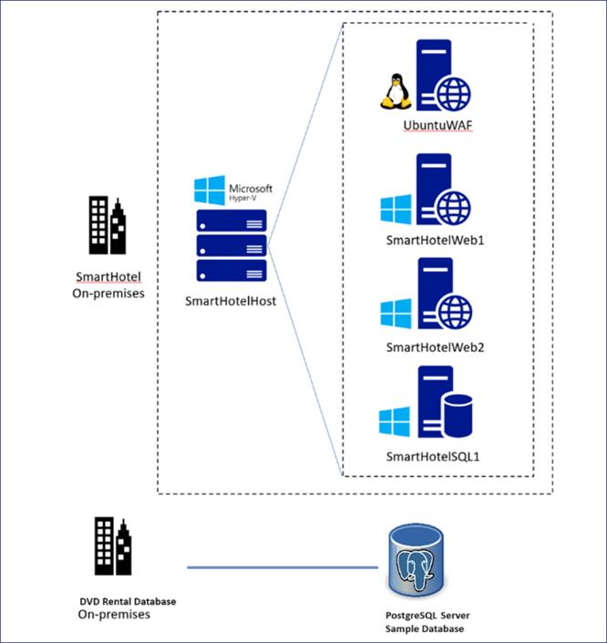

# Lab 01 - Distribuzione e verifica dell'ambiente locale e della zona di destinazione

## Obiettivo

Nel laboratorio lavoreremo con la **on-premises environment**, incluso
il seguente

- Una macchina virtuale di Azure che esegue Hyper-V annidato, con 4
  macchine virtuali annidate

- **2** gruppi di risorse con un totale di **17** risorse che sarebbero
  necessarie nelle prossime esercitazioni.

- Un **SmartHotel application**, in esecuzione in macchine virtuali
  nidificate all'interno di Hyper-V in SmartHotelHost

- Il peering reti virtuali è necessario dopo la migrazione.

- Azure SQL database e così via.

&nbsp;

- 

In **SmartHotelHostRG** viene creata una macchina virtuale che esegue
Hyper-V nidificato, con 4 macchine virtuali nidificate. Rappresenta
l'ambiente "locale" che verrà valutato ed eseguito la migrazione durante
questo lab.

L'applicazione **SmartHotel** comprende 4 macchine virtuali ospitate in
Hyper-V:

- **Livello di database** Ospitato nella macchina virtuale
  smarthotelSQL1, che esegue Windows Server 2016 e SQL Server 2017.

- **Livello applicazione** Ospitato nella macchina virtuale
  smarthotelweb2, che esegue Windows Server 2012R2.

- **Livello Web** Ospitato nella macchina virtuale smarthotelweb1, che
  esegue Windows Server 2012R2.

- **Proxy Web** ospitato nella macchina virtuale UbuntuWAF, che esegue
  Nginx in Ubuntu 18.04 LTS.

Per semplicità, non vi è ridondanza in nessuno dei livelli.

L'altro gruppo di risorse denominato SmartHotelRG comprende

Per valutare l'ambiente Hyper-V, si userà **Azure Migrate: Sever
Assessment**. Ciò include la distribuzione della **Azure Migrate
appliance** nell'host Hyper-V per raccogliere informazioni
sull'ambiente. Per un'analisi più approfondita, **Microsoft Monitoring
Agent** e **Dependency Agent** verranno installati nelle macchine
virtuali, abilitando la **Azure Migrate dependency visualization**.

Il di **SQL Server database** verrà valutato installando **Microsoft
Data Migration Assistant (DMA)** nell'host Hyper-V e utilizzandolo per
raccogliere informazioni sul database. La **Schema migration** e la
**data migration** verranno quindi completate usando il **Azure Database
Migration Service (DMS)**.

**The application, Web e proxy Web** verranno migrati alle di **Azure
VMs** usando **Azure Migrate: Server Migration**. Verranno illustrati i
passaggi per la creazione dell'ambiente Azure, la replica dei data in
Azure, la personalizzazione delle impostazioni della macchina virtuale e
l'esecuzione di un failover per eseguire la migrazione dell'applicazione
ad Azure.

**Nota:** dopo la migrazione, l'applicazione può essere modernizzata per
usare il **Azure Application Gateway** anziché la **Ubuntu Nginx**
**VM** e per usare il di **Azure App Service** per ospitare sia il **Web
tier** che il **application tiers**. Queste ottimizzazioni non rientrano
nell'ambito di questo lab, che è incentrato solo su una migrazione
"lift-and-shift" alle di Azure VMs.

Un diagramma di un server Descrizione generata automaticamente

> **Nota:** durante il lancio è stato utilizzato un modello per generare
> l'ambiente on-premise, quindi il lancio ha richiesto circa 7-10 minuti
> per l'implementazione. Una volta completata la distribuzione del
> modello, vengono eseguiti diversi script aggiuntivi per avviare
> l'ambiente lab. **Attendere almeno 1 ora dall'inizio della template
> deployment per l'esecuzione degli script.**
>
> **Durante la configurazione della On-premise, attendere 30-40 minuti,
> quindi procedere con l'attività 1.**

### Attività 1: Verificare l'ambiente locale

1.  Nella macchina virtuale lab aprire un browser e passare all
    `https://portal.azure.com` account di accesso usando le **Office 365
    Tenant Credential** dalla **Home/Resources tab** dell'interfaccia
    lab.

2.  Selezionare di **Resource group** nella home page.

- 

  Graphical user interface, testo, applicazione, e-mail Descrizione
  generata automaticamente

3.  Seleziona **SmartHotelHostRG**.

- 

  Graphical user interface, testo, applicazione Descrizione generata
  automaticamente

4.  Selezionare la macchina virtuale **SmartHotelHost** distribuita dal
    modello nel modulo precedente.

- 

  Graphical user interface, testo, applicazione, e-mail Descrizione
  generata automaticamente

5.  Prendere nota della **public IP address**.

- 

  Graphical user interface, testo, applicazione, e-mail Descrizione
  generata automaticamente

6.  Apri una scheda del browser e vai all**' Public IP of the
    SmartHotelHostVM** (annotato nel passaggio precedente). Verrà
    visualizzata l' applicazione **SmartHotel**, che è in esecuzione su
    macchine virtuali annidate all'interno di Hyper-V in SmartHotelHost.
    (L'applicazione non fa molto: è possibile aggiornare la pagina per
    vedere l'elenco degli ospiti o selezionare **'CheckIn'** o
    **'CheckOut'** per alternare il loro stato.)

- 

  Graphical user interface, applicazione Descrizione generata
  automaticamente

  > **NOTA:** Se la **SmartHotel** non **viene** visualizzata, attendere
  > 10 minuti e riprovare. L'operazione richiede **almeno 1 ora**
  > dall'inizio della distribuzione del modello. È anche possibile
  > controllare i livelli di attività della CPU, della rete e del disco
  > per la **SmartHotelHost** VM nel portale di Azure, per verificare se
  > il provisioning è ancora attivo.

L'attività è stata completata. Non chiudere questa scheda per procedere
con l'attività successiva.

### Attività 2: Verificare l'ambiente della zona di destinazione

1.  Torna alla scheda **SmartHotelHost** VM e seleziona **Home**.

- 

  Graphical user interface, applicazione, e-mail Descrizione generata
  automaticamente

2.  Selezionare il servizio di **Resource Groups**.

- 

  Graphical user interface, applicazione Descrizione generata
  automaticamente

3.  Selezionare il gruppo di risorse **SmartHotelRG**.

- 

  Graphical user interface, testo, applicazione, e-mail Descrizione
  generata automaticamente

4.  Si noti che sono disponibili la **Virtual network**, **Bastion
    resource**, **Application Gateway**, **SQL Server** e **il
    Database**.

- 

  Graphical user interface, testo, applicazione, e-mail Descrizione
  generata automaticamente

  

  Graphical user interface, testo, applicazione, e-mail Descrizione
  generata automaticamente

### Sommario

Al termine del lab, il modello di Resource Manager dovrebbe essere stato
distribuito correttamente e verificata **Smart Hotel Application**
locale che dovrebbe essere attiva e in esecuzione. È necessario
distribuire la della **Azure Landing zone resource** che comprende
Virtual Network, Azure Bastion, Application Gateway e Azure SQL Server
con un Azure SQL Database.

**Applicazione Smart Hotel**

Graphical user interface, applicazione Descrizione generata
automaticamente

**Risorsa della Azure Landing** in **SmartHotelRG**

Graphical user interface, testo, applicazione, e-mail Descrizione
generata automaticamente

Graphical user interface, testo, applicazione, e-mail Descrizione
generata automaticamente
