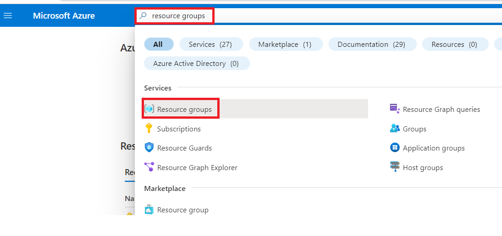
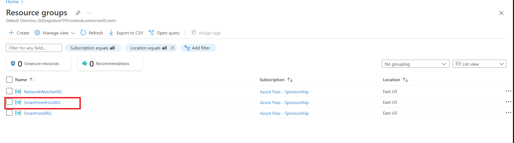
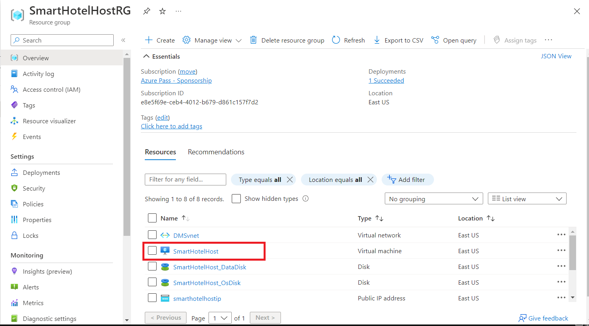
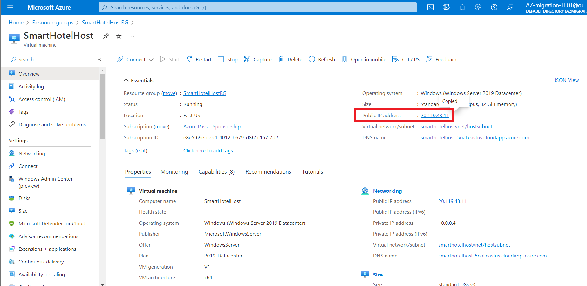
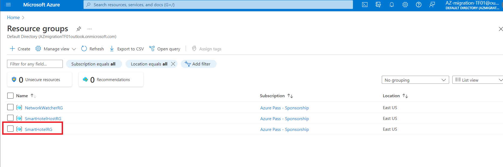
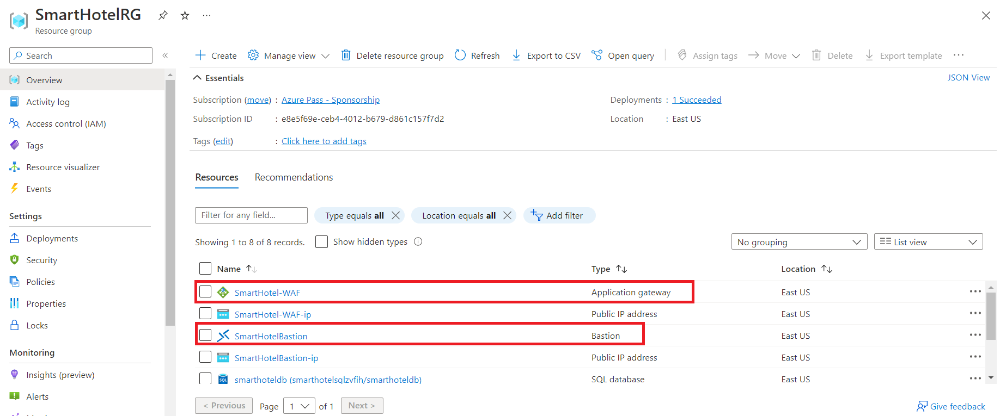
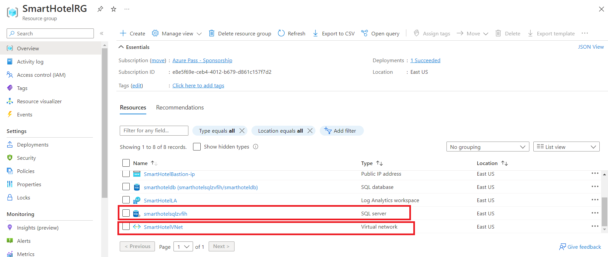

# ラボ１： - オンプレミス環境およびランディングゾーンの展開と検証する

# 目的

このラボでは、以下を含む**on-premises environment** を操作します。

- 4つのネストされたVMを持つネストされたHyper-Vを実行しているAzure VM。

- 今後の演習で必要となる合計 **17** のリソースを持つ **2**
  つのリソースグループ。

- **SmartHotel application**は, SmartHotelHost上の Hyper-V
  内のネストされた VM で動作する。

- マイグレーション後に必要となる VNet ピアリング。

- Azure SQL データベース など。

**SmartHotelHostRG**,
では、4つのネストされたVMを持つネストされたHyper-Vを実行しているＶＭが作成されます。これは、このラボで評価して、移行する「on-premises」環境を表しています。

**SmartHotel**アプリケーションは、Hyper-Vにホストされている4つのVMで構成されています：

- **Database tier**はWindows Server 2016 と SQL Server
  2017を実行しているsmarthotelSQL1 VMにホストされています。

- **Application tier**はWindows Server
  2012R2を実行している、smarthotelweb2 VMにホストされています。

- **Web tier**はWindows Server 2012R2を実行している、smarthotelweb1
  VMにホストされています。

- **Web proxy**はNginx on Ubuntu 18.04 LTSを実行している、UbuntuWAF
  VMにホストされています。

簡素化のため、各層に冗長構成はありません。

SmartHotelRGというもう一つのリソースグループは、以下の内容で構成されています。

Hyper-V環境の評価には**Azure Migrate: Server
Assessment**を使用します。このために、Hyper-V ホスト上に **Azure Migrate
appliance**をデプロイして、環境情報を収集します。より詳細な分析には、**Microsoft
Monitoring Agent**と**Dependency Agent**をVMにインストールし、**Azure
Migrate dependency visualization**を可能にします。

**SQL Server database**は、Hyper-Vホストに**Microsoft Data Migration
Assistant
(DMA)**をインストールし、データベースに関する情報を収集して、評価します。その後、**Azure
Database Migration Service (DMS)**を使用して、**Schema
migration**と**data migration**を完了します。   
  
**The application, web, and web proxy
tiers**のマイグレーションは、**Azure Migrate: Server
Migration**を利用して**Azure
VM**へ移行します。Azure環境の構築、データのレプリケーション、VM設定のカスタマイズ、フェールオーバーの実行などの手順を進めていきます。**  
  
注意：** マイグレーション後、アプリケーションは**Ubuntu Nginx VM**
の代わりに**Azure Application Gateway**を使用し、**web tier**
および**application tiers**は**Azure App
Service**上でホストするようにモダナイズ可能です。ただし、このラボではこれらの最適化は対象外であり、「lift
and shift」のAzureVMへの移行に限定されます。

サーバー説明の図は自動生成されました。

> **注意：** 起動時にOn-premise環境を生成するためにテンプレートが使用されたため、起動からデプロイまで約7～10分かかりました。テンプレートのデプロイが完了すると、ラボ環境をブートストラップするための追加スクリプトがいくつか実行されます。**Allow
> at least 1 hour from the start of template deployment for the scripts
> to run.**
>
> **While the On-premise environment is setup wait for 30-40 minutes and
> then proceed with Task 1.**

### タスク１： on-premises環境を確認する

1.  ラボのVM上でブラウザを開き、`https://portal.azure.com`にアクセスし、ラボインターフェイスの**Home/Resources
    tab**に記載されている **Office 365 Tenant
    Credential**を使ってログインします。

2.  ホームページで**Resource group**を選択します。 

    

3.  **SmartHotelHostRG**を選択します。

    

4.  前のモジュールのテンプレートによってデプロイされた**SmartHotelHost** VMを選択します。

    

5.  **public IP address**をメモします。

    

6.  ブラウザタブを開き、 **Public IP of the
    SmartHotelHostVM **（前の手順でメモしたもの）に移動します。SmartHotelHost上の
    Hyper-V 内のネストされた VM
    上で実行されている**SmartHotel**アプリケーションが表示されます。（このアプリケーションは特に機能はありませんが、ページを更新してゲストリストを確認したり、
    **「CheckIn」**または**「CheckOut」**を選択してステータスを切り替えたりすることはできます。)

    

  > **注意：** **SmartHotel applicationが表示されない**場合は、10
  > 分待ってからもう一度お試しください。テンプレートのデプロイ開始から**at
  > least 1
  > hour**かかります。Azureポータルで**SmartHotelHostVM**のCPU、ネットワーク、ディスクのアクティビティ
  > レベルを確認し、プロビジョニングがまだアクティブかどうかを確認することもできます。

このタスクは完了しました。次のタスクに進むには、このタブを閉じないでくださ。

### タスク2： ランディングゾーン環境を確認する

1.  **SmartHotelHost** VM タブに戻り、**Home**を選択します。

    

2.  **Resource Groups** サービスを選択します。

    

  

3.  **SmartHotelRG**リソース グループを選択します。

    

  

4.  **Virtual Network, Bastion resource, Application Gateway, SQL
    Server**と**Database**が利用可能であることに注意してください。

    

  

    

### まとめ

ラボの最後には、ARM
テンプレートが正常にデプロイされ、On-premises **Smart Hotel
Application** が稼働していることを検証する必要があります。The **Azure
Landing zone
resource** デプロイされているはずです。このリソースは、Virtual
Network、Azure Bastion、Application Gateway、Azure SQL Server と Azure
SQL Database で構成されています。

**Smart Hotel Application**

**SmartHotelRG内のAzure Landing zone**リソース 

