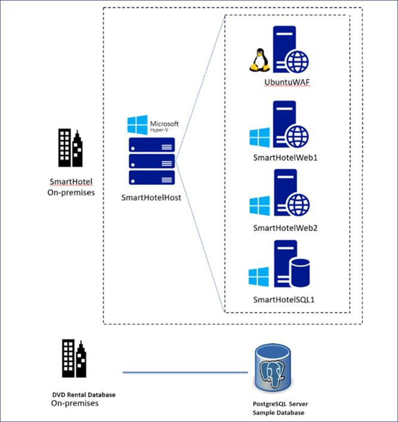

# Lab 01 - Deploying and verifying the on-premises environment and landing zone

## Objective

In the Lab we would be working with the **on-premises environment**  including
the below

- An Azure VM running nested Hyper-V, with 4 nested VMs

- **2** Resources groups with a total of **17** resource which would be
  required in the upcoming exercises.

- A **SmartHotel application**, which is running on nested VMs within
  Hyper-V on the SmartHotelHost

- VNet Peering required post migration.

- Azure SQL database etc.

    

In **SmartHotelHostRG**, a virtual machine running nested Hyper-V, with
4 nested VMs is created. This represents the 'on-premises' environment
which you will assess and migrate during this lab.

The **SmartHotel** application comprises 4 VMs hosted in Hyper-V:

- **Database tier** Hosted on the smarthotelSQL1 VM, which is running
  Windows Server 2016 and SQL Server 2017.

- **Application tier** Hosted on the smarthotelweb2 VM, which is running
  Windows Server 2012R2.

- **Web tier** Hosted on the smarthotelweb1 VM, which is running Windows
  Server 2012R2.

- **Web proxy** Hosted on the UbuntuWAF VM, which is running Nginx on
  Ubuntu 18.04 LTS.

For simplicity, there is no redundancy in any of the tiers.

The other resource group named SmartHotelRG comprises of

To assess the Hyper-V environment, you will use **Azure Migrate: Server
Assessment**. This includes deploying the **Azure Migrate appliance** on
the Hyper-V host to gather information about the environment. For deeper
analysis, the **Microsoft Monitoring Agent** and **Dependency
Agent** will be installed on the VMs, enabling the **Azure Migrate
dependency visualization**.

The **SQL Server database** will be assessed by installing
the **Microsoft Data Migration Assistant (DMA)** on the Hyper-V host,
and using it to gather information about the database. **Schema
migration** and **data migration** will then be completed using
the **Azure Database Migration Service (DMS)**.

**The application, web, and web proxy tiers** will be migrated
to **Azure VMs** using **Azure Migrate: Server Migration**. You will
walk through the steps of building the Azure environment, replicating
data to Azure, customizing VM settings, and performing a failover to
migrate the application to Azure.

**Note:** After migration, the application could be modernized to
use **Azure Application Gateway** instead of the **Ubuntu Nginx VM**,
and to use **Azure App Service** to host both the **web
tier** and **application tiers**. These optimizations are out of scope
of this lab, which is focused only on a 'lift and shift' migration to
Azure VMs.

> **Note:** A template was used to generate the On-premise environment during the launch, hence the launch took around 7-10 minutes to deploy. Once
template deployment is complete, several additional scripts are executed
to bootstrap the lab environment. **Allow at least 1 hour from the start
of template deployment for the scripts to run.**

> **While the On-premise environment is setup wait for 30-40 minutes and then proceed with Task 1.**

### Task 1: Verify the on-premises environment

1.  On your Lab VM open a browser and navigate
    to `https://portal.azure.com` login using the **Office 365
    Tenant Credential** from the **Home/Resources tab** of the Lab
    interface.

2.  Select **Resource group** on home page.

    

3.  Select **SmartHotelHostRG**.

    

4.  Select **SmartHotelHost** VM that was deployed by the template in
    the previous module.

    

5.  Make a note of the **public IP address**.

    

6.  Open a browser tab and navigate to **Public IP of the
    SmartHotelHostVM** (noted in the previous step ). You should see
    the **SmartHotel** application, which is running on nested VMs
    within Hyper-V on the SmartHotelHost. (The application doesn't do
    much: you can refresh the page to see the list of guests or
    select **'CheckIn'** or **'CheckOut'** to toggle their status.)

    

    > **Note:** If the **SmartHotel application** is **not** shown, wait 10
    minutes and try again. It takes **at least 1 hour** from the start of
    template deployment. You can also check the CPU, network and disk
    activity levels for the **SmartHotelHost** VM in the Azure portal, to
    see if the provisioning is still active.

You have completed this task. Do not close this tab to proceed ahead
with the next task.

### Task 2: Verify the landing zone environment

1.  Switch back to **SmartHotelHost** VM tab and select **Home**.

    

2.  Select **Resource Groups**.

    

3.  Select **SmartHotelRG** resource group.

    

4.  Note that the **Virtual Network**, **Bastion
    resource**, **Application Gateway**, **SQL
    Server** and, **Database** are available.

    

    

### Summary

At the end of the Lab, we should have successfully deployed the ARM
template and verified the
On-premises **Smart Hotel Application** which should be up and running.
The **Azure Landing zone resource** should be deployed which comprises
of Virtual Network, Azure Bastion, Application Gateway, and an Azure SQL
Server with an Azure SQL Database.

**Smart Hotel Application**

**Azure Landing zone** resource in the **SmartHotelRG**

