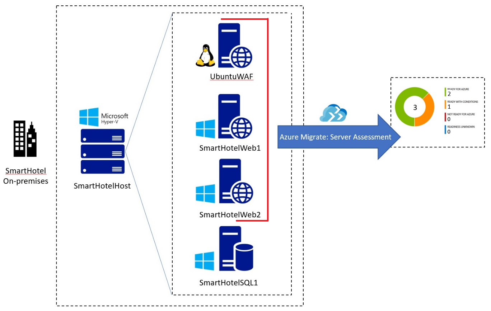
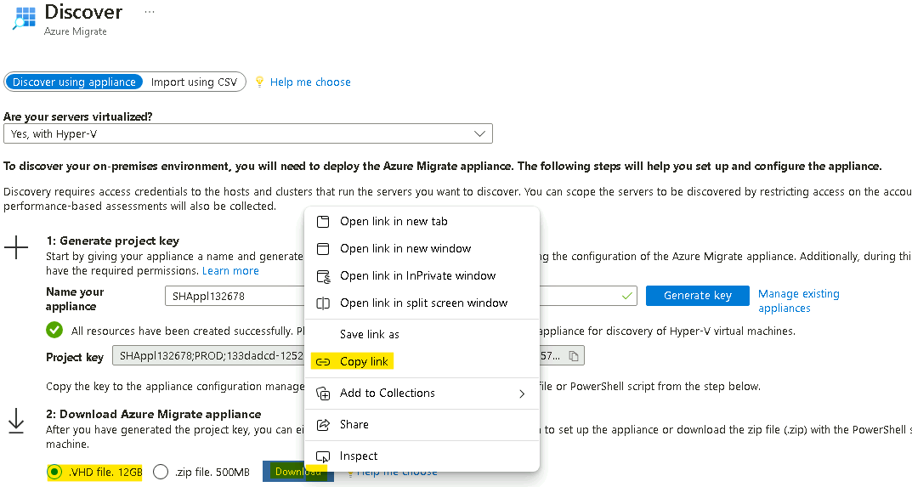
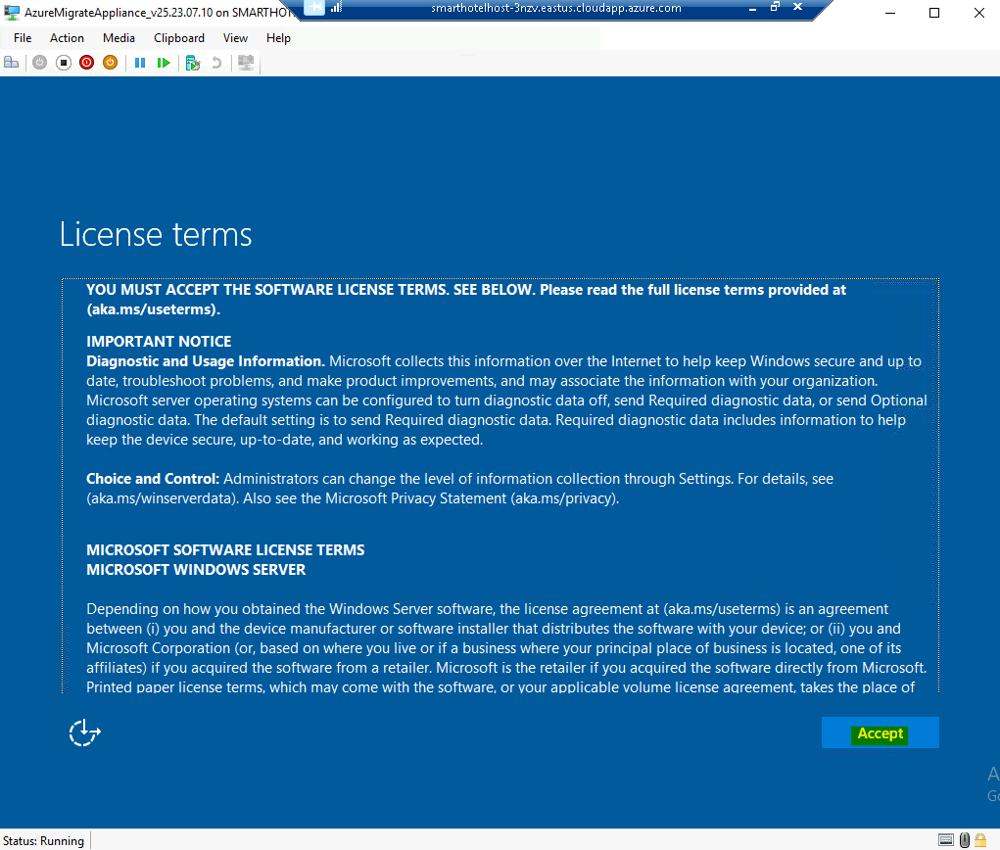
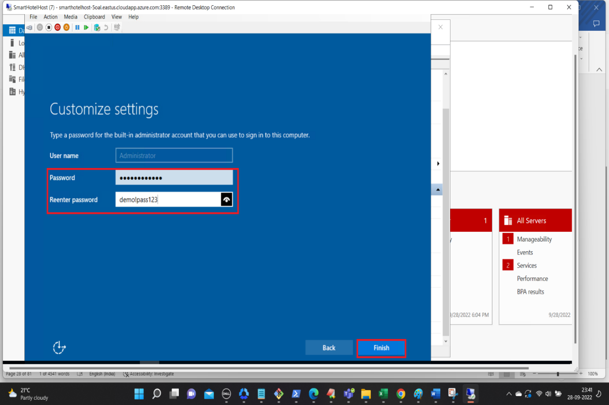
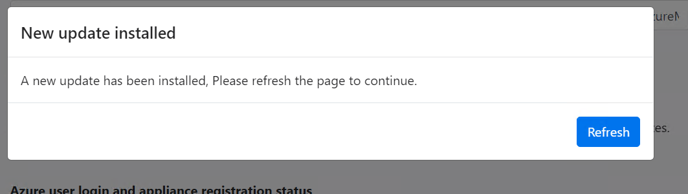
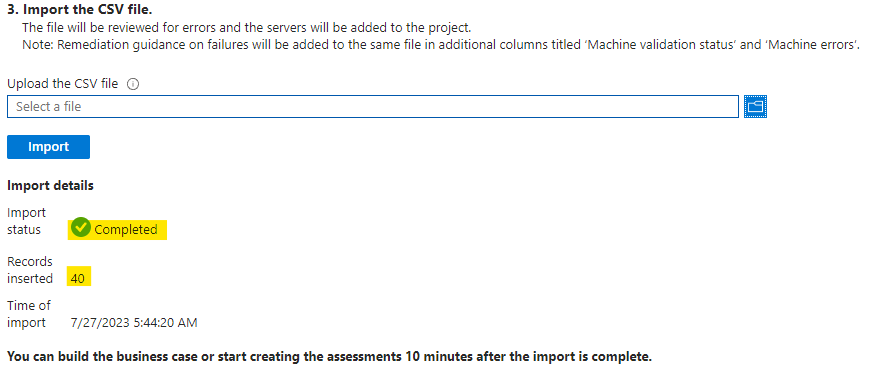
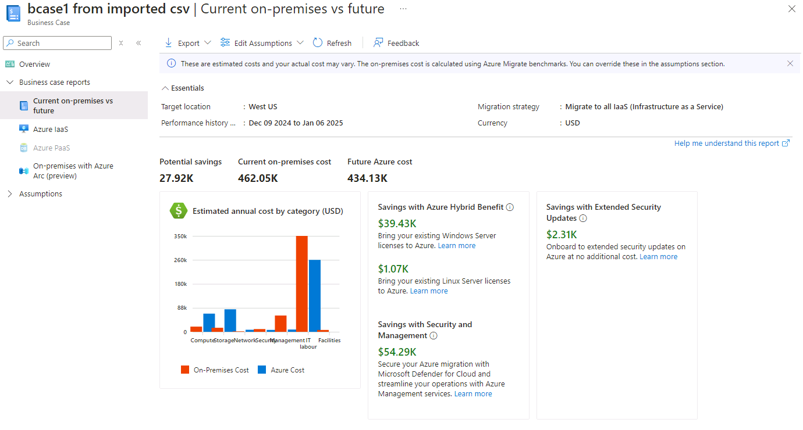
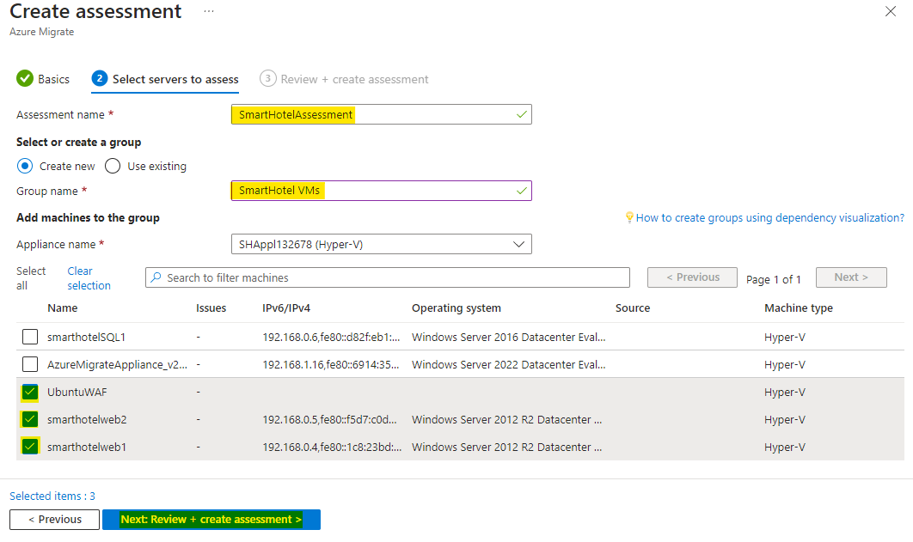
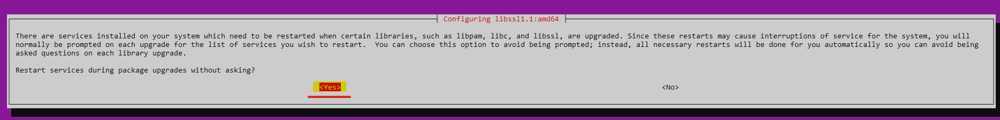

# 实验 02 - 发现和评估本地环境。

**目的**

在此实验室中，我们将使用 Azure Migrate 工具发现并评估本地
VM，并创建一个存储库以将评估数据存储在 Azure 迁移项目中。

我们还将安装代理来发现和可视化 VM 之间的依赖关系

为此，我们需要将 Azure Migrate 设备部署为 SmartHotelHost 上的
VM，然后运行所需的发现任务。

> **重要提示：**在开始此实验之前，您应该至少留出 30-40
> 分钟来部署本地环境**（实验 1 - 部署和验证本地环境和landing zone）。**

### 任务 1：创建 Azure Migrate 项目并添加评估和迁移工具

在此任务中，您将创建 Azure Migrate 项目并选择评估和迁移工具。

> **注意：**在本实验中，你将在 Azure Migrate 中使用 Microsoft
> 提供的评估和迁移工具。许多第三方工具还与 Azure Migrate
> 集成，用于评估和迁移。您可能希望花一些时间在本实验室之外探索这些第三方选项。

1.  切换回 **Azure 门户**选项卡或打开新选项卡并导航到
    `https://portal.azure.com` 并使用 **Office 365 租户凭据**登录。

2.  在搜索栏中，键入 `Azure Migrate` ，然后选择 “**Azure Migrate**”
    以打开 “**Azure Migrate 概述**” 边栏选项卡，如下所。

- 

  

  自动生成的计算机 Description 的屏幕截图

3.  选择 **Discover, assess and migrate**。

- 

  自动生成的计算机 Description 的屏幕截图

4.  选择 **Create project** （创建项目）。

- 

  自动生成的计算机 Description 的屏幕截图

5.  选择相应的 订阅 并创建名为 `AzureMigrateRG` 的新资源组

- 

6.  输入 `SmartHotelMigration`
    作为迁移项目名称，然后选择您附近的地理位置来存储迁移评估数据。这里我们选择
    **United States**。然后选择 **Create** （创建）。

- 

  

7.  Azure Migrate 部署将启动。完成后，您应该会看到当前迁移项目的
    “**Azure Migrate：发现和评估**” 和 “**Azure Migrate：服务器迁移**”
    面板，如下所示。

- 

您已完成此任务。请勿关闭此选项卡以继续执行下一个任务。

在此任务中，你使用默认的内置工具创建了 **Azure Migrate
项目**，用于服务器评估和服务器迁移。

### 任务 2：部署 Azure Migrate 设备

在此任务中，你将在本地 Hyper-V 环境中部署和配置 Azure Migrate
设备。此设备与 Hyper-V 服务器通信，以收集有关本地 VM
的配置和性能数据，并将该数据返回到 Azure Migrate 项目。

1.  在“**Azure Migrate： 发现和评估**” 下，选择 “**Discover**
    ”，然后选择 “**Using appliance**”以打开“**Discover machines**”
    边栏选项卡。

- 

  自动生成的计算机 Description 的屏幕截图

2.  在 **Are your servers
    virtualized？（**您的服务器是否虚拟化？）下，选择 **Yes， with
    Hyper-V**（是，使用 Hyper-V）。

- 

  自动生成的计算机 Description 的屏幕截图

3.  在“**1：生成项目密钥**”中，提供 `SHApplXXXXXX`（将 **XXXXXX**
    替换为随机数）作为要设置用于发现 Hyper-V VM 的 Azure Migrate
    设备的名称。选择“**Generate key**” 以开始创建所需的 Azure 资源。

- 

  自动生成的计算机 Description 的屏幕截图

  

4.  **等待**密钥生成，然后将 **Azure Migrate
    项目密钥**复制到剪贴板并将其保存到**记事本**。此 **Key**
    可在后续任务中使用它们。

- 

  自动生成的计算机 Description 的屏幕截图

5.  确保 **.VHD file 12 GB** 单选按钮，然后右键单击 **Download**
    按钮并选择 **Copy link** 选项。

- 

6.  复制记事本中的链接，以便稍后用于下载 Azure Migrate 设备。

- 

  自动生成黑白文本 Description

7.  在单独的浏览器选项卡中，导航到 **Azure 门户**。在全局搜索框中，输入
    `SmartHotelHost`，然后选择 **SmartHotelHost** 虚拟机。

- 

8.  选择 **Connect**，从下拉列表中选择 **Connect**。

- 

  自动生成的计算机 Description 的屏幕截图

9.  选择 **Download RDP File**（下载 RDP 文件）。

- 

  自动生成的计算机 Description 的屏幕截图

10. 单击通知的 **Keep** 按钮，然后单击 **Open file** 进行连接。

- 

  自动生成的计算机 Description 的屏幕截图

11. 使用用户名 `demouser` 和密码 `demopass123` **连接**到虚拟机

- 

  

12. 选择 **Yes**（是）。

- 

13. 在 **SmartHotelHost** VM 上打开 Chrome 浏览器，然后从记事本粘贴
    Azure Migrate 设备的复制链接，它应该会开始下载文件

- 

14. 下载文件后，单击下载的文件，选择选项 **Shown in folder**。

- 

  自动生成的计算机 Description 的屏幕截图

15. 双击 zip 文件 - **AzureMigrateAppliance**

- 

16. 显示文件夹 **AzureMigrateAppliance** 后，选择它，然后单击 “**Extract
    all**” 按钮，然后将文件夹路径提供为 `F\VirtualMachines`，然后单击
    “**Extract**” 按钮。

- 

17. 切换到 **Server Manager** 窗口。  

18. 在服务器管理器中，选择 “**Tools**” ，然后选择 “**Hyper-V Manager**”
    （如果服务器管理器未自动打开，请选择 “**Start**”，然后选择“**Server
    Manager**”）将其打开。

- 

19. 在 Hyper-V 管理器中，选择 **SMARTHOTELHOST**。现在，查看构成本地
    **SmartHotel** 应用程序的四个 VM 的列表。

- 

20. 在 Hyper-V 管理器的 **Actions** 下，选择 **Import Virtual
    Machine**...以打开 **Import Virtual Machine** 向导。

- 

21. 在第一步 **Before You Begin** （开始之前） 中，选择 **Next**
    （下一步）。

- 

22. 在“**Locate Folder**”步骤中，选择 “**Browse**”并导航到
    `F\VirtualMachines\AzureMigrateAppliance`（确保选择在前面的步骤中刚刚**提取**的文件夹），然后选择“**Select
    Folder**”，然后选择 **“Next**” 。

- 

  自动生成的计算机 Description 的屏幕截图

23. 在“**Select Virtual Machine**” 步骤中，应已选择
    **AzureMigrateAppliance** VM。选择 **Next**（下一步）。

- 

24. 在 **Choose Import Type** 步骤中，保留默认设置 **Register the
    virtual machine in-place**。选择 **Next**（下一步）。

- 

  自动生成的计算机 Description 的屏幕截图

25. 在 “**Connect Network**” 步骤中，你将看到一个错误，指出找不到 Azure
    Migrate 设备以前使用的虚拟交换机。从“**Connection**”下拉列表中，选择
    **Azure Migrate Switch**，然后选择 “**Next**” 。

- 

  自动生成的计算机 Description 的屏幕截图

  > ***注意：**Azure Migrate 设备需要访问 Internet 才能将数据上传到
  > Azure。它还需要访问 Hyper-V 主机。但是，它不需要直接访问在 Hyper-V
  > 主机上运行的应用程序 VM。为了保护应用程序环境，应将 Azure Migrate
  > 设备部署到 Hyper-V 中的单独子网，而不是与应用程序位于同一子网中。*

  > Hyper-V 环境具有使用 IP 地址空间 192.168.0.0/16 的 NAT
  > 网络。SmartHotel 应用程序使用的内部 NAT 交换机使用子网
  > 192.168.0.0/24，并且应用程序中的每个 VM 都已从此子网分配一个静态 IP
  > 地址。

  > Azure Migrate 设备将连接到已为您设置的单独子网 192.168.1.0/24。使用
  > “Azure Migrate 交换机”将设备连接到此子网。使用在 SmartHotelHost
  > 上运行的 DHCP 服务从此子网为设备分配一个 IP 地址。

26. 查看摘要页，然后选择“**Finish**”以创建 Azure Migrate 设备 VM。

- 

27. 在 Hyper-V 管理器中，选择 **AzureMigrateAppliance**
    VM，然后选择右侧的 “**Start**” 。

- 

您已完成此任务。请勿关闭 Hyper-V 管理器以继续执行下一个任务。

**任务摘要**

在此任务中，你在本地 Hyper-V 环境中部署了 Azure Migrate 设备。

### 任务 3：配置 Azure Migrate 设备

在此任务中，你将配置 Azure Migrate
设备，并使用它来完成迁移评估的发现阶段。

1.  在 Hyper-V 管理器中，选择 **AzureMigrateAppliance** VM，然后选择
    “开始”，然后选择“**Connect**”。

- 

2.  此时将打开一个新窗口，其中显示 Azure Migrate 设备。等待 License
    terms （许可条款） 屏幕显示，然后选择 **Accept** （接受）。

- 

3.  在 **Customize settings** 屏幕上，通过手动键入 Password （两次）
    将管理员密码设置为 demo！pass123。然后选择 **Finish** （完成）。

- > **注：** 输入密码时，VM
  > 使用美式键盘映射。如果您使用的是非美式键盘，则某些字符可能输入错误。选择第二个密码输入框中的“眼球”图标，以检查密码输入是否正确。

  

4.  在 “**Connect to AzureMigrateAppliance**”
    提示符下，使用滑块设置设备屏幕大小，然后选择 “**Connect**” 。

- 

5.  通过手动输入密码 `demo!pass123`
    以管理员身份登录（登录屏幕可能会选择您的本地键盘映射，使用“眼球”图标进行检查）。

- 

  图形用户界面，自动生成网站描述

6.  **等。**一两分钟后，浏览器将打开，显示 Azure Migrate
    设备配置向导（也可以从桌面快捷方式启动）。

- 

7.  打开设备配置向导时，将显示一个包含许可条款的弹出窗口。选择 **I
    agree**（我同意）接受条款。

- 

  自动生成的计算机 Description 的屏幕截图

8.  在 **Set up prerequisites**（设置先决条件）下，以下验证 Internet
    连接和时间同步的两个步骤应自动通过。

- 

  自动生成的计算机 Description 的屏幕截图

9.  将之前从 Azure 门户复制的 **Azure Migrate project key** 粘贴到
    **Verification of Azure Migrate project key** 部分中，然后单击
    **Verify** 按钮。

- 

  自动生成的计算机 Description 的屏幕截图

  > **注意：**如果您没有密钥，请在 Azure 门户的 Azure Migrate
  > 下转到**Server Assessment \> Discover \> Manage existing
  > appliances**，选择您在生成密钥时提供的设备名称，然后复制相应的密钥。

10. 验证 **Azure Migrate project key** 后，将启动自动更新过程。

- 

  自动生成的计算机 Description 的屏幕截图

11. 如果安装了新的更新，请单击 **Refresh** 按钮以重新加载页面。

- 

12. 点击 **Login**，将打开一个带有代码的弹出窗口。

- 

13. 将打开一个新窗口，显示 Device code（设备代码）。选择 **Copy code &
    Login**。

- 

  自动生成的计算机 Description 的屏幕截图

14. 在新的浏览器窗口中，出现提示时，粘贴 **Code** 并选择 **Next**。

- 

  自动生成的计算机 Description 的屏幕截图

15. 输入 Azure 门户凭据，然后选择“**Next**”。输入 **Password** 并选择
    **Sign in** （登录）。

- > **注意** - 由于嵌套虚拟化，@ 符号将显示为
  > 2。因此，请更正凭据，并确保使用键盘键入密码，或者您可以切换到实验室
  > VM，将密码粘贴到记事本中并复制它，切换回
  > SmartHotelVM，然后将密码粘贴到 AzureMigrate 设备 VM 中。

  

  自动生成的计算机 Description 的屏幕截图

  

16. 选择 **Continue**（继续）。

- 

  自动生成的计算机错误描述的屏幕截图

  

17. 返回到 **Azure Migrate 设备**选项卡，**设备注册**将自动开始。

- 

  自动生成的计算机 Description 的屏幕截图

18. 注册完成后，进入下一个面板 **Manage credentials and discovery
    sources**。

- 

  自动生成的计算机 Description 的屏幕截图

19. 在 “管理凭据和发现源” “**Step 1: Provide Hyper-V host credentials**”
    中，选择 “**Add credentials**” 。

- 

  自动生成的计算机 Description 的屏幕截图

20. 输入 `hostlogin` 作为 **Friendly name**，用户名
    `demouser`，然后手动键入设备将用于发现 VM 的 Hyper-V 主机/群集的密码
    `demo!pass123`。选择 **Save**。

- 

  自动生成的计算机 Description 的屏幕截图

  > **注意：**Azure Migrate 设备可能尚未选取本地键盘映射。选择密码框中的
  > “eyeball” 以检查密码是否输入正确。

  > ***注意：**通过“添加更多”按钮，Hyper-V 虚拟机发现支持多个凭证。*

21. 在 **Step 2: Provide Hyper-V host/cluster details** 中，选择 **Add
    discovery source** 以指定 Hyper-V 主机/群集 IP 地址/FQDN
    和凭据的友好名称以连接到主机/群集。

- 

  自动生成的计算机 Description 的屏幕截图

22. 选择“**Add single item**” ，在“IP 地址/FQDN”下输入
    `SmartHotelHost`，然后从下拉列表中选择 **hostlogin**
    作为映射凭据，然后选择 “**Save**” 。

- 

  自动生成的计算机 Description 的屏幕截图

  > **注意：**
  > 您可以一次**添加单个项目**或一次性**添加多个项目**。还有一个选项可以通过**导入
  > CSV** 来提供 Hyper-V 主机/群集详细信息。

23. 设备将验证与添加的 Hyper-V
    主机/群集的连接，并在表中针对每个主机/群集显示**验证状态**。

- 

  **注意：**添加发现源时：
  - 对于成功验证的主机/集群，您可以通过选择其 IP 地址/FQDN
    来查看更多详细信息。
  - 如果主机验证失败，请在表的 Status 列中选择 Validation failed
    （验证失败） 来查看错误。修复问题并再次验证。
  - 要删除主机或集群，请选择 **Delete** （删除）。
  - 您无法从集群中删除特定主机。您只能删除整个集群。
  - 您可以添加集群，即使集群中的特定主机存在问题。

24. 确保 Switch 已启用，然后单击 **Add credentials**

- 

  自动生成的计算机错误描述的屏幕截图

25. 在 Add credentials 弹出窗口中提供详细信息，然后单击 **Save** 按钮。

    - 凭证类型 – **Windows (Non-domain)**

    - 友好名称 – `WindowsVM`

    - 用户名 – `.\Administrator`

    - 密码 – 类型为手动 `demo!pass123`

- 

  自动生成的计算机 Description 的屏幕截图

26. 关闭通知。

- 

  自动生成的计算机 Description 的屏幕截图

27. 再次单击 **Add credentials**，然后在 Add credentials
    弹出窗口中提供详细信息，然后单击 **Save** 按钮。

    - 凭证类型 – **Linux (Non-domain)**

    - 友好名称 – `LinuxVM`

    - 用户名 – `.\demouser`

    - 密码 – 类型为手动 `demo!pass123`

- 

  自动生成的计算机 Description 的屏幕截图

28. 关闭通知。

- 

  自动生成的计算机 Description 的屏幕截图

29. 向下滚动，然后单击 **Start Discovery** 按钮。

- 

  自动生成的计算机 Description 的屏幕截图

  

  自动生成的计算机 Description 的屏幕截图

30. 等待 Azure Migrate 状态显示**Discovery has been successfully
    initiated**。这将需要 10-13
    分钟。成功启动发现后，您可以检查表中的每个主机/集群的发现状态。

- 

  自动生成的计算机 Description 的屏幕截图

31. 切换回实验室 VM，打开 Edge 浏览器，导航到 Azure 门户
    https://portal.azure.com，使用 Office 365 租户凭据登录，然后返回到
    **Azure Migrate** 边栏选项卡。

- 

  自动生成图形用户界面、文本、应用程序、电子邮件描述

32. 选择 **Server， databases and web apps**（服务器、数据库和 Web
    应用程序），然后选择 **Refresh**（刷新）。

- 

  A screenshot of a computer Description automatically generated

  

33. 在“**Azure
    Migrate：服务器评估**”下，应会看到到目前为止发现的服务器数的计数。如果发现仍在进行中，请选择
    **Refresh** periodic （定期刷新），直到显示 **5**
    个发现的服务器。这可能需要几分钟时间。

- 

  自动生成的计算机 Description 的屏幕截图

**重要提示：请等待发现过程完成，然后再继续执行下一个任务。**

您已完成此任务，请勿关闭此选项卡以继续执行下一个任务。

**任务摘要**

在此任务中，你在本地 Hyper-V 环境中配置了 Azure Migrate
设备，并启动了迁移评估发现过程。

### 任务 4：使用 CSV 文件导入 Servers 清单

您还可以使用 CSV 文件导入环境、其配置和利用率的清单。CSV 中的属性包括：

- **Server Name （服务器名称） –** 计算机的名称

- **IP 地址 –** 计算机使用的 IPv4 和 IPv6 地址的分号分隔列表

- **Cores （核心数） –** 使用的 vCPU 数量

- **Memory –** 内存量 （MB）

- **OS 详细信息**

  - **Name** **（名称）** –作系统的类型

  - **Version** **（版本）** – 正在使用的作系统版本

  - **体系结构 –** 体系结构（如 x64/x86）

- **CPU Utilization （CPU 利用率） –** 正在使用的 CPU 的百分比

- **Memory Utilization （内存利用率） –** CPU 使用率的百分比峰值

- **网络**

  - Adapter count （适配器计数） – 连接到计算机的 NIC 数量

  - Input Throughput – 进入系统的吞吐量（以 Mbps 为单位）

  - Output Throughput – 系统外的吞吐量（以 Mbps 为单位）

- **Boot Type （引导类型） –** 系统使用的引导类型 （UEFI/BIOS）

- **磁盘**

  - **Number of disks –** 附加到磁盘的磁盘数

  - **Per disk size （按磁盘大小） –** 磁盘大小 （GB）

  - **Per disk reads （Bytes） （每个磁盘读取 （字节）） –**
    每秒从每个磁盘读取的 MB 量

  - **Per disk writes （Bytes） （每个磁盘写入 （字节）） –**
    每秒写入每个磁盘的 MB 量

  - **Per disk reads （IOPS） （按磁盘读取次数 （IOPS）** –
    每秒从磁盘输出作的计数

  - **Per disk writes （IOPS） （按磁盘写入次数 （IOPS） –**
    每秒来自磁盘的输入作计数

填充 CSV 后，您可以通过执行以下作将系统导入 Migrate 评估阶段：

1.  在“**Azure Migrate**”边栏选项卡中，在“迁移目标”下，确保选中
    “**服务器、数据库和 Web 应用**
    ”，选择**“Discove**r”按钮，然后选择**“Using import**” 。

- 

  自动生成的计算机 Description 的屏幕截图

2.  从 C：\Labfiles 上传名为 **Azure Migrate import template.csv** 的
    CSV 文件，然后选择 “**Import**” 以读取该文件。

- 

  自动生成的计算机 Description 的屏幕截图

3.  导入应开始处理文件记录。

- 

  自动生成的计算机 Description 的屏幕截图

4.  您应该会收到如下图所示的通知

- 

  自动生成的数字描述

5.  在导入详细信息中，我们可以看到已成功插入 **40 条记录**。

- 

6.  关闭“发现”边栏选项卡，然后单击“**Refresh**”按钮。

- 

  自动生成的计算机 Description 的屏幕截图

7.  您应该能够看到 Discovered Servers 列表已更新。

    - **Discovered Servers – 45**

- 

  自动生成的计算机 Description 的屏幕截图

8.  单击 **Discovered items**，然后选择 **Import based**
    选项卡，您应该能够看到 40 个导入服务器的详细信息。确保选择 项目
    从下拉菜单中。

- 

  自动生成的计算机 Description 的屏幕截图

您已完成此任务，请勿关闭此选项卡以继续执行下一个任务。

### 任务 5：构建成本估算的业务案例。

在此任务中，我们将使用 Azure Migrate
来构建业务案例，该案例使用在发现阶段从 Azure Migrate
设备和导入的服务器列表中收集的数据。

业务案例功能可帮助你构建业务计划书，以了解 Azure
如何为你的业务带来最大价值。它强调：

- 本地与 Azure 总拥有成本。

- 年度现金流分析。

- 基于资源利用率的洞察，用于识别最适合云的服务器和工作负载。

- 快速实现迁移和现代化，包括终止对 Windows作系统和 SQL 版本的支持。

- 通过从资本支出模式转变为运营支出模式，只需为使用的资源付费，从而节省长期成本。

- 帮助消除成本规划流程中的猜测工作，并添加数据洞察驱动的计算。

- 使用 Azure Migrate 设备执行发现后，只需单击几下即可生成它。

- 会自动为现有 Azure Migrate 项目启用此功能。

1.  单击迁移目标下的 **Servers, databases and web apps** ，然后选择
    **Build business case** 按钮。

- 

  自动生成的计算机 Description 的屏幕截图

2.  在 **Build business case （Preview）**
    页面上，提供以下详细信息，然后单击 **Build business case** 按钮。

    - 业务案例名称 -`BCase1 from Imported CSV`

    - 目标位置 - **West US**

    - 发现源 – **Build a quick business case using the servers imported
      via a .CSV file.**

    - 节省选项 – **Reserved instance + Azure Saving Plan**

    - 现收现付的折扣 （%）- **0**

- 

  自动生成的计算机 Description 的屏幕截图

3.  我们应该会收到如下所示的通知

- 

  自动生成的计算机 Description 的屏幕截图

4.  几分钟后，单击 Refresh 按钮

- 

5.  计算 Assumptions 后，页面应如下所示

- 

  自动生成的计算机 Description 的屏幕截图

6.  查看 **TCO comparison** 下的详细信息，然后单击 **View Details**
    链接。

- 

7.  它将打开“业务案例报告 - **本地与
    Azure**”，其中应显示“**按类别估计的年度成本**”。

- 

8.  向下滚动以查看 **Total cost of ownership**（总拥有成本）详细信息

- 

9.  返回业务案例的“概述”页，查看 **YoY
    估计的当前状态与未来状态成本**以及 **Azure 混合权益的节省**

- 

  > **注意 -** 由于您计划分阶段迁移到
  > Azure，因此此折线图根据当年完成的估计迁移显示您每年的现金流。默认情况下，假定您将在当年迁移
  > 0%，第 1 年迁移 20%，第 2 年迁移 50%，第 3 年迁移
  > 100%。当前状态成本显示了您的净现金流在本地的情况，假设您的基础设施每年增长
  > 5%。未来状态成本显示当您每年将一定百分比迁移到 Azure 时（如“Azure
  > 成本”假设中所示），而您的基础设施每年增长 5%，您的净现金流将如何。

  > **注意 - Azure
  > 混合权益**是一项许可权益，可帮助您显著降低在云中运行工作负载的成本。它的工作原理是允许您在
  > Azure 上使用启用了软件保障的本地 Windows Server 和 SQL Server
  > 许可证。

10. 查看 Discovery insights 部分下提供的信息

    - **总服务器 – 分发**

    - **作系统分发**

- 

  自动生成的计算机 Description 的屏幕截图

11. 单击 **Azure IaaS**，查看 **Azure**
    选项卡，其中提供了已**准备好迁移**的服务器的信息，以及相同的 **IaaS
    成本估算**和**使用 Azure 混合权益节省**的信息。

- 

12. 向下滚动，了解更多详情

    - **按节省选项估算的成本**

    - **建议的 VM 系列和存储类型**

    - **本地成本与 Azure 成本**

- 

13. 向上滚动并单击 **On-premises** 选项卡，它将显示 **On-premises cost
    estimate**

- 

14. 向下滚动并检查 Server analysis 部分，其中显示

    - **按作系统分配**

    - **按虚拟化分发**

    - **按类别分配**

- 

15. 单击“支持终止”下的“**View
    details**”链接，它将列出业务案例中考虑的所有服务器，以及 **Azure
    中的建议目标、活动状态**和**合格产品/服务**。

- 

16. 关闭“详细信息”边栏选项卡，然后单击“假设”下的“**Azure cost**”。

- 

17. 在这里，可以修改 **Azure
    成本**和**成本建模的假设**，然后单击“**Save**”以重新评估业务案例。

18. 单击 **On-premises cost**（本地成本），在 **Compute** （计算）
    选项卡上，您有

    - **软件 - SQL Server 许可**

    - **软件 - Windows 服务器许可**

    - **虚拟化软件 – Hyper-V**

    - **虚拟化软件 – VMware**

- 

  自动生成的计算机 Description 的屏幕截图

19. 点击 **Storage** 选项卡检查设置

- 

  自动生成的计算机 Description 的屏幕截图

20. 点击 **Network** 选项卡检查设置

- 

  自动生成的计算机 Description 的屏幕截图

21. 点击 **Security** 选项卡以检查设置

- 

  自动生成的计算机 Description 的屏幕截图

22. 单击 **Management** 选项卡以检查设置 

23. 单击 **Labor** 选项卡以检查设置

- 

  自动生成的计算机 Description 的屏幕截图

24. 点击 **Facilities** 选项卡以检查设置

- 

  自动生成的计算机 Description 的屏幕截图

25. 可以通过更改这些设置，然后单击 Save （保存）
    按钮重新评估本地成本来估算适当的本地成本。

26. 现在，让我们为使用 Azure Migrate
    设备发现的服务器创建另一个业务案例。

27. 在 Azure Migrate 页面中，单击 “服务器、数据库和 Web 应用”
    ，然后单击 **Build Business case**

- 

  自动生成的计算机 Description 的屏幕截图

28. 在 **Build business case （Preview）**
    页面上，提供以下详细信息，然后单击 **Build business case** 按钮。

    - 业务案例名称 - `BCase2 Migrate Appliance`

    - 目标位置 - **West US**

    - 发现源 – **Use more accurate data insights collected via the Azure
      Migrate appliance.**

    - 迁移策略 - **Azure recommended approach to minimize cost**

    - 节省选项 – **Reserved instance + Azure Saving Plan**

    - 现收现付的折扣 （%） -**0**

- 

  自动生成的计算机 Description 的屏幕截图

29. 我们应该会收到如下所示的通知

- 

30. 几分钟后，单击 Refresh 按钮

- 

  自动生成的计算机 Description 的屏幕截图

31. 计算 Assumptions 后，页面应如下所示

- 

  自动生成的计算机 Description 的屏幕截图

32. 与为导入的服务器创建的业务案例类似，您可以查看以下区域的此业务案例的详细信息。

    - **TCO 比较**

    - **发现洞察**

    - 业务案例报告

      - **本地与 Azure**

      - **Azure IaaS**

    - 假设

      - **Azure 成本**

      - **本地成本**

33. 查看 **BCase2 Migrate 设备** – 业务案例后，返回 Azure Migrate
    页面，单击**服务器、数据库和 Web 应用程序**下的 “**Overview**”
    按钮。

- 

  自动生成的计算机 Description 的屏幕截图

34. 单击 Manage 下的 **Business cases**。

- 

  自动生成的计算机 Description 的屏幕截图

35. 我们应该能够看到从不同的发现源创建的 2 个业务案例。

    - 进口

    - 器具

- 

  自动生成的计算机 Description 的屏幕截图

### 任务 6：创建迁移评估

在此任务中，您将使用 Azure Migrate 使用在发现阶段收集的数据为
**SmartHotel** 应用程序创建迁移评估。

1.  在 Azure Migrate 中，选择“**Azure Migrate：发现和评估**”
    下的“**Assess -\> Azure VM**” 以启动新的迁移评估。

- 

  自动生成的计算机 Description 的屏幕截图

2.  在 **Create Assessment Basics** 边栏选项卡上，提供以下详细信息

    - 评估类型 - **Azure VM**

    - 发现源 - **Servers discovered from Azure Migrate Appliance**.

    - 在 Assessment settings （评估设置） 下 – 单击 **Edit** （编辑）
      链接

- 

  自动生成的计算机 Description 的屏幕截图

3.  **Assessment settings** （评估设置）
    边栏选项卡允许定制制作迁移评估报告时使用的许多设置。花点时间探索各种评估属性。

4.  然后进行以下更改并单击 **Save** 按钮。

    - 目标位置 – **West US** (增加了订阅 vCPU 核心的区域)

    - 储蓄选项 – **预留 3 年**

    - 百分位利用率 – **99^(th)**

    - VM 系列 – **全选**

- 

  自动生成的计算机 Description 的屏幕截图

**注意：**您必须进行更改才能启用 **Save**
按钮;如果您不想进行任何更改，只需关闭 Blade。

5.  返回 Basics 选项卡，单击 **Next： Select servers to assess \>**
    按钮。

- 

  自动生成的计算机 Description 的屏幕截图

6.  将 **Assessment name** 输入为 `SmartHotelAssessment`。选择“**Create
    New**” 并输入组名称 `SmartHotel VM`。选择
    **smarthotelweb1、smarthotelweb2** 和 **UbuntuWAF
    VM**，然后选择“**Next: Review+ Create assessment**” 按钮。

- 

  > **注意：**无需在评估中包括 smarthotelSQL1 或 AzureMigrateAppliance
  > VM，因为它们不会迁移到 Azure。（SQL Server 将迁移到 SQL
  > 数据库服务，Azure Migrate 设备仅用于迁移评估。

7.  选择 **Create assessment**（创建评估）。

- 

  自动生成的计算机 Description 的屏幕截图

8.  在“**Azure Migrate - 服务器、数据库和 Web
    应用**”边栏选项卡上，选择“定期 **Refresh** ”，直到显示的评估数为
    1。这可能需要 5-6 分钟。

9.  在 “Azure Migrate 服务器、数据库和 Web 应用” 页上的 “评估” 下，选择
    “1” 。

- 

  自动生成的计算机 Description 的屏幕截图

10. 单击列表中的 **SmartHotelAssessment**。

- 

  自动生成的计算机 Description 的屏幕截图

11. 花点时间研究评估概述。

- 

  自动生成的计算机 Description 的屏幕截图

12. 选择 **Settings**。

- 

  自动生成的计算机 Description 的屏幕截图

13. 在 Assessment （评估） 设置中，更改以下内容，然后单击 **Save**
    （保存） 按钮。

    - 性能历史 – **1 Week**

    - 百分位利用率 – **95^(th)**

- 

  自动生成的计算机 Description 的屏幕截图

14. 片刻之后，评估报告将更新以反映您的更改。

- 

  自动生成的计算机屏幕描述的屏幕截图

15. **比较**如下图所示。

- 

16. 选择 **Azure readiness**（图表或左侧导航）。请注意，对于
    **UbuntuWAF** VM，列出了有关 VM 迁移就绪情况的具体问题。

- 

  自动生成的计算机 Description 的屏幕截图

  > 请花几分钟时间探索迁移评估的其他方面。

  > **注：** 由于传输数据的性质，收集作系统环境 （OSE）
  > 信息并在环境之间迁移 VM
  > 数据的过程需要一些时间。但是，可以采取一些步骤来加速和查看系统的工作原理。以下是几个选项：

  > 刷新数据的常见步骤：（另请参阅发现疑难解答）

  - 服务器数据未在门户中更新 –
    如果服务器的数据未刷新，则这是一种加速数据的方法。
  - Do not see software inventory details （看不到软件清单详细信息） –
    默认情况下，软件清单每 24 小时仅刷新一次。这将强制刷新。
  - 软件清单错误 –
    在清单期间，有时会返回错误代码。这将列出所有错误代码和含义。

  > Migrate
  > 中的许多问题可能与设备由于定期计划或未传输数据而未刷新数据有关。强制更新数据和信息可以通过以下步骤来实现：

17. 在 “**服务器、数据库和 Web 应用**” 的 “**Azure Migrate**”
    页的“**Azure Migrate：发现和评估**” 中，选择 “**Overview**” 。

- 

  自动生成的计算机 Description 的屏幕截图

18. 在 **Manage** （管理） 下，选择 **Appliances** （设备）。选择
    **Refresh services** （刷新服务）。

- 

  自动生成的计算机 Description 的屏幕截图

  

  自动生成的计算机 Description 的屏幕截图

19. 等待刷新作完成。您现在应该会看到最新信息。

- 

  自动生成的计算机 Description 的屏幕截图

您已完成此任务。请勿关闭此选项卡以继续执行下一个任务。

**任务摘要：**

在此任务中，你创建并配置了 Azure Migrate 迁移评估。

### 任务 7：配置依赖项可视化

将工作负载迁移到 Azure
时，请务必了解所有工作负载依赖项。依赖项损坏可能意味着应用程序无法在
Azure
中正常运行，可能以难以检测的方式运行。某些依赖关系（例如应用程序层之间的依赖关系）是显而易见的。其他依赖项（如
DNS 查找、Kerberos 票证验证或证书吊销检查）则不是。

在此任务中，您将配置 **Azure Migrate
依赖项可视化**功能。这需要您首先创建一个 **Log Analytics
工作区**，然后在要迁移的 VM 上部署代理。

1.  仍在 **Azure Migrate** 页中，选择“**Servers, database and web
    apps**” 。在 “**Azure Migrate：发现和评估**” 下，单击 “**Groups**”
    下的数字 **1** 链接。

- 

  自动生成的计算机屏幕描述的屏幕截图

2.  选择 **SmartHotel VMs** 组以查看组详细信息。

- 

  自动生成的计算机 Description 的屏幕截图

3.  请注意，每个 VM 的 **Dependencies** （依赖项） 状态为 **Requires
    agent installation** （需要代理安装）。选择 **Requires agent
    installation** 为**Smarthotelweb1** VM。

- 

  自动生成的计算机 Description 的屏幕截图

4.  在 “**Dependencies**” 边栏选项卡上，选择 “**Configure Log Analytics
    workspace**” 。

- 

  自动生成的计算机 Description 的屏幕截图

5.  创建新的 Log Analytics 工作区。使用 AzureMigrateWSXXXXXX \[将
    **XXXXXX** 替换为随机数\] 作为工作区名称。从列表中选择 Log Analytics
    工作区位置，然后选择 **Configure**。

6.  等待工作区部署完成。记下记下记事本中的 **Workspace ID** 和
    **Workspace Key**。

- 

  自动生成的计算机 Description 的屏幕截图

7.  右键单击并复制 **4 个代理下载 URL**
    的链接地址，并将其粘贴到您在上一步 9 的**记事本**中记下的**工作区 ID
    和密钥**旁边。

- 

  自动生成的计算机 Description 的屏幕截图

  > **注意 ：** 您可以将这些链接邮寄到您的测试帐户中，并在 VM 中打开它。

8.  如果系统提示使用凭据进行连接，请返回到 **SmartHotelHost** 的 RDP
    会话。

    - 用户名- `demouser`

    - 密码- `demo!pass123`

9.  在 **Hyper-V 管理器**中，选择 **smarthotelweb1** 并选择
    **Connect**。

- 

  自动生成的计算机 Description 的屏幕截图

10. 出现提示时，再次选择 “**Connect**” ，然后键入密码 demo！pass123
    登录到 **Administrator** 帐户

- 

  图形用户界面，自动生成应用程序描述

  

11. 打开**Internet Explorer**

- 

12. 将链接粘贴到您之前保存的 **64-bit Microsoft Monitoring Agent for
    Windows**，当出现提示时，单击 **Run** 按钮。

- 

  自动生成的计算机错误描述的屏幕截图

  > **注意：**您可能需要在**本地服务器**下的**服务器管理器**上禁用
  > **Internet Explorer 增强的安全配置**才能完成下载。

13. 在 Microsoft Monitoring Agent 安装程序中，单击**Next**，然后单击 **I
    Agree**。

14. 继续执行默认选择，直到 **Agent Setup Options** （代理设置选项）
    页面。在此处，选择“**Connect the agent to Azure Log Analytics
    (OMS)**” ，然后选择 **“Next**” 。

- 

  自动生成的计算机 Description 的屏幕截图

15. 输入您之前复制的 Workspace ID 和 Workspace Key，然后从 Azure Cloud
    下拉列表中选择 **Azure Commercial**。选择
    **Next**，通过其余页面进行选择并**安装**代理。

- 

  自动生成的计算机 Description 的屏幕截图

16. 使用默认选项继续其余的设置，然后单击  **Finish**

- 

  自动生成的计算机 Description 的屏幕截图

17. 将 **Dependency Agent Windows installer**
    的链接粘贴到浏览器地址栏中。**运行**安装程序并通过安装向导进行选择以完成安装。

- 

  自动生成的计算机 Description 的屏幕截图

  > **注意：**安装 Dependency Agent 时，您无需配置工作区 ID
  > 和密钥，因为它使用与 Microsoft Monitoring Agent
  > 相同的设置，必须事先安装。

  

18. 关闭 **smarthotelweb1** VM 的虚拟机连接窗口。

19. 在 **Hyper-V 管理器**中，选择 **smarthotelweb2** 并选择
    **Connect**。

- 

20. 出现提示时，再次选择 “**Connect**” ，然后键入密码 `demo!pass123`
    登录到 **Administrator** 帐户

- 

  图形用户界面，自动生成应用程序描述

  

21. 打开 **Internet
    Explorer**，然后打开您之前记下的。出现提示时，**运行**安装程序。

- 

22. 关闭 **smarthotelweb2** VM 的虚拟机连接窗口。

23. 将链接粘贴到您之前保存的 **64-bit Microsoft Monitoring Agent for
    Windows**，当出现提示时，单击 **Run** 按钮。

- 

  自动生成的计算机错误描述的屏幕截图

  > **注意：**您可能需要在**本地服务器**下的**服务器管理器**上禁用
  > **Internet Explorer 增强的安全配置**才能完成下载。

24. 在 Microsoft Monitoring Agent 安装程序中，单击下**Next**，然后单击
    **I Agree**。

25. 继续执行默认选择，直到 **Agent Setup Options** （代理设置选项）
    页面。在此处，选择 “**Connect the agent to Azure Log Analytics
    (OMS)**” ，然后选择 “**Next**” 。

- 

  自动生成的计算机 Description 的屏幕截图

26. 输入您之前复制的 Workspace ID 和 Workspace Key，然后从 Azure Cloud
    下拉列表中选择 **Azure Commercial**。选择
    **Next**，通过其余页面进行选择并安装代理。

- 

  自动生成的计算机 Description 的屏幕截图

27. 使用默认选项继续其余的设置，然后单击 **Finish**

- 

  自动生成的计算机 Description 的屏幕截图

28. 将 **Dependency Agent Windows installer**
    的链接粘贴到浏览器地址栏中。**运行**安装程序并通过安装向导进行选择以完成安装。

- 

  自动生成的计算机 Description 的屏幕截图

  > **注意：**安装 Dependency Agent 时，您无需配置工作区 ID
  > 和密钥，因为它使用与 Microsoft Monitoring Agent
  > 相同的设置，必须事先安装。

  

  > 现在，您将在 **UbuntuWAF** VM 上**部署** **Linux 版本的 Microsoft
  > Monitoring Agent** 和 Dependency Agent。为此，您将首先使用 **SSH
  > session** 远程连接到 **UbuntuWAF**。

29. 返回到具有 **SmartHotelHost** 的 RDP
    会话，并使用桌面快捷方式打开命令提示符。

- 

  自动生成的计算机 Description 的屏幕截图

  > **注意：SmartHotelHost** 在启用适用于 Linux 的 Windows
  > 子系统的情况下运行 Windows Server 2019。这允许将命令提示符用作 SSH
  > 客户端。可在此处找到 Azure 上受支持的 Linux
  > 的详细信息：`https://Azure.com/Linux` `

30. 输入以下命令以连接到在 SmartHotelHost 上的 Hyper-V 中运行的
    **UbuntuWAF** VM使用以下命令

- `ssh demouser@192.168.0.8`

31. 当系统提示是否连接时，输入 **'yes'**。使用密码 demo！pass123。

- 

32. 输入以下命令，并在出现提示时输入密码 demo！pass123：

- `sudo -s`

  

  自动生成的计算机描述的屏幕截图

33. 这为终端会话提供了**提升/root 权限**

34. 输入以下命令，将 \\ 和 \\ 替换为之前复制的值。

- `wget https://raw.githubusercontent.com/Microsoft/OMS-Agent-for-Linux/master/installer/scripts/onboard_agent.sh && sh onboard_agent.sh -w <Workspace ID> -s <Workspace Key> -d opinsights.azure.com`

35. 出现提示时，选择 Yes （是），然后按 Enter 键

- 

  

36. 安装屏幕应如下所示。

- 

  

  自动生成的计算机程序 Description 的屏幕截图

37. 输入以下命令，将 \< **Workspace ID**\> 替换为之前复制的值

- `/opt/microsoft/omsagent/bin/service_control restart <Workspace ID>`

  

38. 输入以下命令以下载 Dependency Agent for Linux。

- `wget --content-disposition https://aka.ms/dependencyagentlinux -O InstallDependencyAgent-Linux64.bin`

  

  自动生成文本 Description 的计算机屏幕

39. 通过运行以下命令安装 Dependency Agent。

- `sh InstallDependencyAgent-Linux64.bin -s`

  

  自动生成的计算机 Description 的屏幕截图

40. 代理安装现已完成。

接下来，您需要在 SmartHotel
应用程序上生成一些流量，以便依赖关系可视化有一些数据可供使用。浏览到
SmartHotelHost 的公共 IP 地址，然后花几分钟刷新页面并让客人入住和退房。

**任务摘要**

在此任务中，你通过创建 Log Analytics 工作区并在 Windows 和 Linux
本地计算机上部署 Azure Monitoring Agent 和 Dependency Agent 来配置 Azure
Migrate 依赖项可视化功能。

### 任务 8：探索依赖项可视化

在此任务中，您将探索 Azure Migrate
的依赖项可视化功能。此功能使用您之前任务安装的 Dependency Agent
收集的数据。

1.  在 **Azure Migrate** 页面打开的情况下切换回 Azure 门户，选择
    “**Servers, database and web apps**” 。在 “**Azure
    Migrate：发现和评估**” 下，单击 “**Groups**下的数字 **1** 链接。

- 

  自动生成的计算机 Description 的屏幕截图

2.  选择 **SmartHotel VMs** 组以查看组详细信息。

- 

  自动生成的计算机 Description 的屏幕截图

3.  确保所有 VM 的 Dependency Agent 将状态显示为 **Installed**

- 

  自动生成的计算机 Description 的屏幕截图

4.  单击 **View dependencies** （查看依赖项）。

- 

  自动生成的计算机 Description 的屏幕截图

5.  请花几分钟时间浏览依赖项视图。展开每个服务器以显示该服务器上运行的进程。选择一个进程以查看进程信息。查看每个服务器建立的连接。

- 

  自动生成的计算机 Description 的屏幕截图

  

  自动生成的计算机 Description 的屏幕截图

**总结**

在实验室结束时，我们应该已经使用 Azure Migrate 设备成功发现并评估了本地
VM，并且元数据应该在 Azure Migrate 项目中可用，详细信息如下所示

- VM 评估

&nbsp;

- 

  图形用户界面，自动生成应用程序描述

&nbsp;

- VM 的依赖项映射

&nbsp;

- 

  自动生成的包含图表描述的图片
