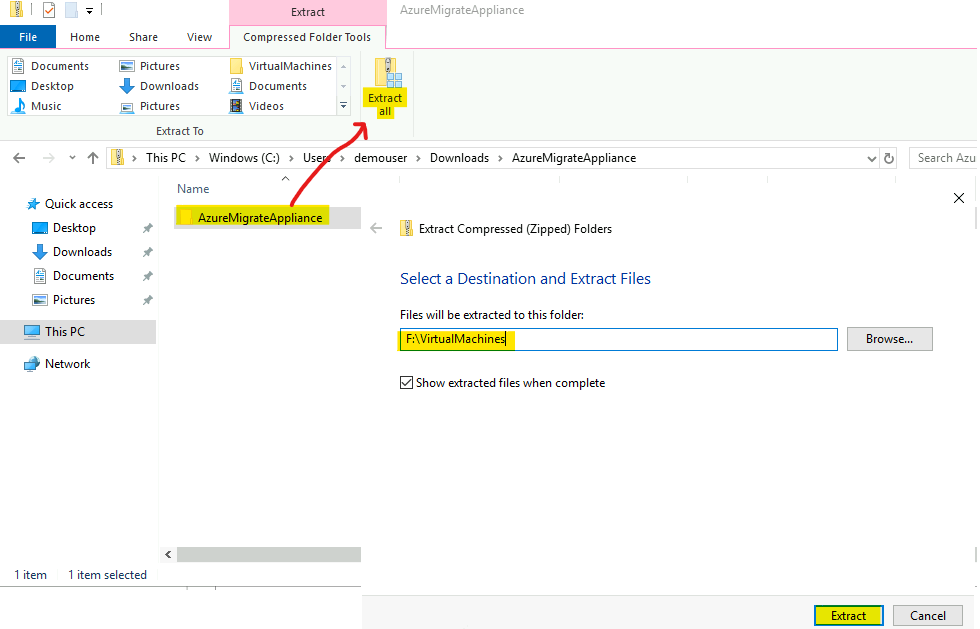
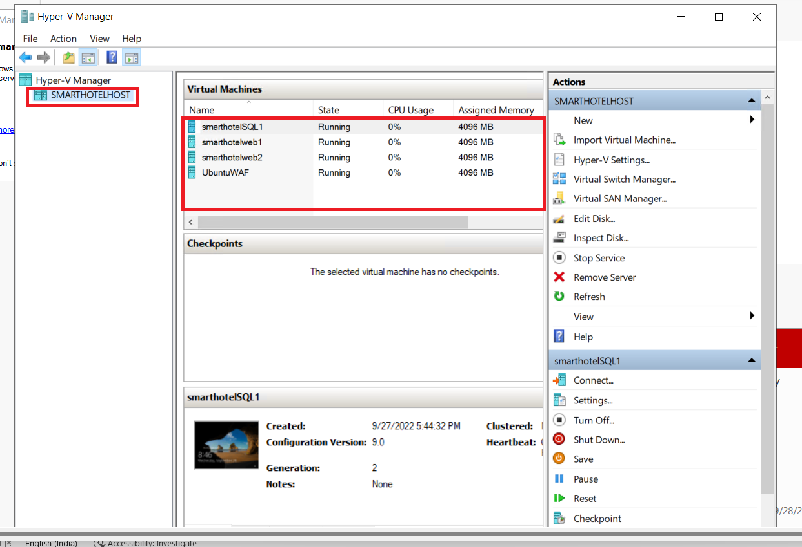
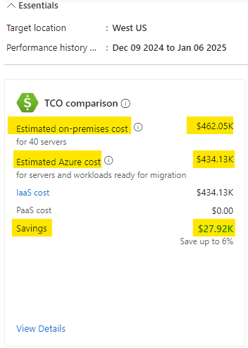
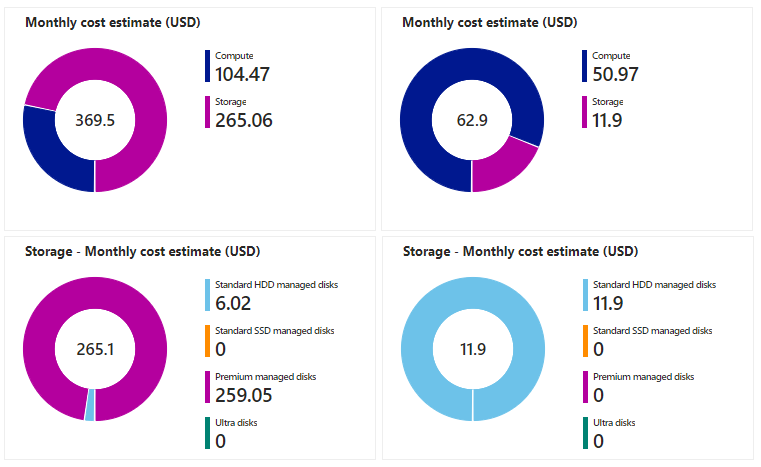

# 實驗 02 - 發現和評估本地環境。

**目的**

在此實驗室中，我們將使用 Azure Migrate 工具發現並評估本地
VM，並創建一個存儲庫以將評估數據存儲在 Azure 遷移項目中。

我們還將安裝代理來發現和可視化 VM 之間的依賴關係

為此，我們需要將 Azure Migrate 設備部署為 SmartHotelHost 上的
VM，然後運行所需的發現任務。

> **重要提示：**在開始此實驗之前，您應該至少留出 30-40
> 分鐘來部署本地環境**（實驗 1 - 部署和驗證本地環境和landing zone）。**

### 任務 1：創建 Azure Migrate 項目並添加評估和遷移工具

在此任務中，您將創建 Azure Migrate 項目並選擇評估和遷移工具。

> **注意** 在本實驗中，你將在 Azure Migrate 中使用 Microsoft
> 提供的評估和遷移工具。許多第三方工具還與 Azure Migrate
> 集成，用於評估和遷移。您可能希望花一些時間在本實驗室之外探索這些第三方選項。

1.  切換回 **Azure 門戶**選項卡或打開新選項卡並導航到
    `https://portal.azure.com` 並使用 **Office 365 租戶憑據**登錄。

2.  在搜索欄中，鍵入 `Azure Migrate` ，然後選擇 “**Azure Migrate**”
    以打開 “**Azure Migrate 概述**” 邊欄選項卡，如下所。

- 

  

  自動生成的計算機 Description 的屏幕截圖

3.  選擇 **Discover, assess and migrate**。

- 

  自動生成的計算機 Description 的屏幕截圖

4.  選擇 **Create project** （創建項目）。

- 

  自動生成的計算機 Description 的屏幕截圖

5.  選擇相應的 訂閱 並創建名為 `AzureMigrateRG` 的新資源組

- 

6.  輸入 `SmartHotelMigration`
    作為遷移項目名稱，然後選擇您附近的地理位置來存儲遷移評估數據。這裡我們選擇
    **United States**。然後選擇 **Create** （創建）。

- 

  

7.  Azure Migrate 部署將啟動。完成後，您應該會看到當前遷移項目的
    “**Azure Migrate：發現和評估**” 和 “**Azure Migrate：服務器遷移**”
    面板，如下所示。

- 

您已完成此任務。請勿關閉此選項卡以繼續執行下一個任務。

在此任務中，你使用默認的內置工具創建了 **Azure Migrate
項目**，用於服務器評估和服務器遷移。

### 任務 2：部署 Azure Migrate 設備

在此任務中，你將在本地 Hyper-V 環境中部署和配置 Azure Migrate
設備。此設備與 Hyper-V 服務器通信，以收集有關本地 VM
的配置和性能數據，並將該數據返回到 Azure Migrate 項目。

1.  在“**Azure Migrate： 發現和評估**” 下，選擇 “**Discover**
    ”，然後選擇 “**Using appliance**”以打開“**Discover machines**”
    邊欄選項卡。

- 

  自動生成的計算機 Description 的屏幕截圖

2.  在 **Are your servers
    virtualized？**（**您的服務器是否虛擬化？）下，選擇  Yes， with
    Hyper-V**（是，使用 Hyper-V）。

- 

  自動生成的計算機 Description 的屏幕截圖

3.  在“**1：生成項目密鑰**”中，提供 `SHApplXXXXXX`（將 **XXXXXX**
    替換為隨機數）作為要設置用於發現 Hyper-V VM 的 Azure Migrate
    設備的名稱。選擇“**Generate key**” 以開始創建所需的 Azure 資源。

- 

  自動生成的計算機 Description 的屏幕截圖

  

4.  **等待**密鑰生成，然後將 **Azure Migrate
    項目密鑰**複製到剪貼板並將其保存到**記事本**。此 **Key**
    可在後續任務中使用它們。

- 

  自動生成的計算機 Description 的屏幕截圖

5.  確保 **.VHD file 12 GB** 單選按鈕，然後右鍵單擊 **Download**
    按鈕並選擇 **Copy link** 選項。

- 

6.  複製記事本中的鏈接，以便稍後用於下載 Azure Migrate 設備。

- 

  自動生成黑白文本 Description

7.  在單獨的瀏覽器選項卡中，導航到 **Azure 門戶**。在全域搜索框中，輸入
    `SmartHotelHost`，然後選擇 **SmartHotelHost** 虛擬機。

- 

8.  選擇 **Connect**，從下拉列表中選擇 **Connect**。

- 

  自動生成的計算機 Description 的屏幕截圖

9.  選擇 **Download RDP File**（下載 RDP 文件）。

- 

  自動生成的計算機 Description 的屏幕截圖

10. 單擊通知的 **Keep** 按鈕，然後單擊 **Open file** 進行連接。

- 

  自動生成的計算機 Description 的屏幕截圖

11. 使用用戶名 `demouser` 和密碼 `demo!pass123` **連接**到虛擬機

- 

  

12. 選擇 **Yes**（是）。

- 

13. 在 **SmartHotelHost** VM 上打開 Chrome 瀏覽器，然後從記事本粘貼
    Azure Migrate 設備的複製鏈接，它應該會開始下載文件

- 

14. 下載文件後，單擊下載的文件，選擇選項 **Shown in folder**。

- 

  自動生成的計算機 Description 的屏幕截圖

15. 雙擊 zip 文件 - **AzureMigrateAppliance**

- 

16. 顯示文件夾 **AzureMigrateAppliance** 後，選擇它，然後單擊 “**Extract
    all**” 按鈕，然後將文件夾路徑提供為 `F:\VirtualMachines`，然後單擊
    “**Extract**” 按鈕。

- 

17. 切換到 **Server Manager** 窗口。  

18. 在服務器管理器中，選擇 “**Tools**” ，然後選擇 “**Hyper-V Manager**”
    （如果服務器管理器未自動打開，請選擇 “**Start**”，然後選擇“**Server
    Manager**”）將其打開。

- 

19. 在 Hyper-V 管理器中，選擇 **SMARTHOTELHOST**。現在，查看構成本地
    **SmartHotel** 應用程序的四個 VM 的列表。

- 

20. 在 Hyper-V 管理器的 **Actions** 下，選擇 **Import Virtual
    Machine**...以打開 **Import Virtual Machine** 嚮導。

- 

21. 在第一步 **Before You Begin** （開始之前） 中，選擇 **Next**
    （下一步）。

- 

22. 在“**Locate Folder**”步驟中，選擇 “**Browse**”並導航到
    `F:\VirtualMachines\AzureMigrateAppliance`（確保選擇在前面的步驟中剛剛**提取**的文件夾），然後選擇“**Select
    Folder**”，然後選擇 **“Next**” 。

- 

  自動生成的計算機 Description 的屏幕截圖

23. 在“**Select Virtual Machine**” 步驟中，應已選擇
    **AzureMigrateAppliance** VM。選擇 **Next**（下一步）。

- 

24. 在 **Choose Import Type** 步驟中，保留默認設置 **Register the
    virtual machine in-place**。選擇 **Next**（下一步）。

- 

  自動生成的計算機 Description 的屏幕截圖

25. 在 “**Connect Network**” 步驟中，你將看到一個錯誤，指出找不到 Azure
    Migrate 設備以前使用的虛擬交換機。從“**Connection**”下拉列表中，選擇
    **Azure Migrate Switch**，然後選擇 “**Next**” 。

- 

  自動生成的計算機 Description 的屏幕截圖

  > **注意** Azure Migrate 設備需要訪問 Internet 才能將數據上傳到
  > Azure。它還需要訪問 Hyper-V 主機。但是，它不需要直接訪問在 Hyper-V
  > 主機上運行的應用程序 VM。為了保護應用程序環境，應將 Azure Migrate
  > 設備部署到 Hyper-V 中的單獨子網，而不是與應用程序位於同一子網中。

  > Hyper-V 環境具有使用 IP 地址空間 192.168.0.0/16 的 NAT
  > 網絡。SmartHotel 應用程序使用的內部 NAT 交換機使用子網
  > 192.168.0.0/24，並且應用程序中的每個 VM 都已從此子網分配一個靜態 IP
  > 地址。

  > Azure Migrate 設備將連接到已為您設置的單獨子網 192.168.1.0/24。使用
  > “Azure Migrate 交換機”將設備連接到此子網。使用在 SmartHotelHost
  > 上運行的 DHCP 服務從此子網為設備分配一個 IP 地址。

26. 查看摘要頁，然後選擇“**Finish**”以創建 Azure Migrate 設備 VM。

- 

27. 在 Hyper-V 管理器中，選擇 **AzureMigrateAppliance**
    VM，然後選擇右側的 “**Start**” 。

- 

您已完成此任務。請勿關閉 Hyper-V 管理器以繼續執行下一個任務。

**任務摘要**

在此任務中，你在本地 Hyper-V 環境中部署了 Azure Migrate 設備。

### 任務 3：配置 Azure Migrate 設備

在此任務中，你將配置 Azure Migrate
設備，並使用它來完成遷移評估的發現階段。

1.  在 Hyper-V 管理器中，選擇 **AzureMigrateAppliance** VM，然後選擇
    “開始”，然後選擇“**Connect**”。

- 

2.  此時將打開一個新窗口，其中顯示 Azure Migrate 設備。等待 License
    terms （許可條款） 屏幕顯示，然後選擇 **Accept** （接受）。

- 

3.  在 **Customize settings** 屏幕上，通過手動鍵入 Password （兩次）
    將管理員密碼設置為 `demo!pass123`。然後選擇 **Finish** （完成）。

- > **注：** 輸入密碼時，VM
  > 使用美式鍵盤映射。如果您使用的是非美式鍵盤，則某些字符可能輸入錯誤。選擇第二個密碼輸入框中的“眼球”圖標，以檢查密碼輸入是否正確。

  

4.  在 “**Connect to AzureMigrateAppliance**”
    提示符下，使用滑塊設置設備屏幕大小，然後選擇 “**Connect**” 。

- 

5.  通過手動輸入密碼 `demo!pass123`
    以管理員身份登錄（登錄屏幕可能會選擇您的本地鍵盤映射，使用“眼球”圖標進行檢查）。

- 

  圖形用戶界面，自動生成網站描述

6.  **等。** 一兩分鐘後，瀏覽器將打開，顯示 Azure Migrate
    設備配置嚮導（也可以從桌面快捷方式啟動）。

- 

7.  打開設備配置嚮導時，將顯示一個包含許可條款的彈出窗口。選擇 **I
    agree**（我同意）接受條款。

- 

  自動生成的計算機 Description 的屏幕截圖

8.  在 **Set up prerequisites**（設置先決條件）下，以下驗證 Internet
    連接和時間同步的兩個步驟應自動通過。

- 

  自動生成的計算機 Description 的屏幕截圖

9.  將之前從 Azure 門戶複製的 **Azure Migrate project key** 粘貼到
    **Verification of Azure Migrate project key** 部分中，然後單擊
    **Verify** 按鈕。

- 

  自動生成的計算機 Description 的屏幕截圖

  > **注意** 如果您沒有密鑰，請在 Azure 門戶的 Azure Migrate
  > 下轉到**Server Assessment \> Discover \> Manage existing
  > appliances**，選擇您在生成密鑰時提供的設備名稱，然後複製相應的密鑰。

10. 驗證 **Azure Migrate project key** 後，將啟動自動更新過程。

- 

  自動生成的計算機 Description 的屏幕截圖

11. 如果安裝了新的更新，請單擊 **Refresh** 按鈕以重新加載頁面。

- 

12. 點擊 **Login**，將打開一個帶有代碼的彈出窗口。

- 

13. 將打開一個新窗口，顯示 Device code（設備代碼）。選擇 **Copy code &
    Login**。

- 

  自動生成的計算機 Description 的屏幕截圖

14. 在新的瀏覽器窗口中，出現提示時，粘貼 **Code** 並選擇 **Next**。

- 

  自動生成的計算機 Description 的屏幕截圖

15. 輸入 Azure 門戶憑據，然後選擇“**Next**”。輸入 **Password** 並選擇
    **Sign in** （登錄）。

- > **注意** - 由於嵌套虛擬化，@ 符號將顯示為
  > 2。因此，請更正憑據，並確保使用鍵盤鍵入密碼，或者您可以切換到實驗室
  > VM，將密碼粘貼到記事本中並複製它，切換回
  > SmartHotelVM，然後將密碼粘貼到 AzureMigrate 設備 VM 中。

  

  自動生成的計算機 Description 的屏幕截圖

  

16. 選擇 **Continue**（繼續）。

- 

  自動生成的計算機錯誤描述的屏幕截圖

  

17. 返回到 **Azure Migrate 設備**選項卡，**設備註冊**將自動開始。

- 

  自動生成的計算機 Description 的屏幕截圖

18. 註冊完成後，進入下一個面板 **Manage credentials and discovery
    sources**。

- 

  自動生成的計算機 Description 的屏幕截圖

19. 在 “管理憑據和發現源” “**Step 1: Provide Hyper-V host credentials**”
    中，選擇 “**Add credentials**” 。

- 

  自動生成的計算機 Description 的屏幕截圖

20. 輸入 `hostlogin` 作為 **Friendly name**，用戶名
    `demouser`，然後手動鍵入設備將用於發現 VM 的 Hyper-V 主機/群集的密碼
    `demo!pass123`。選擇 **Save**。

- 

  自動生成的計算機 Description 的屏幕截圖

  > **注意** Azure Migrate 設備可能尚未選取本地鍵盤映射。選擇密碼框中的
  > “eyeball” 以檢查密碼是否輸入正確。

  > ***注意** 通過“添加更多”按鈕，Hyper-V 虛擬機發現支持多個憑證。*

21. 在 **Step 2: Provide Hyper-V host/cluster details** 中，選擇 **Add
    discovery source** 以指定 Hyper-V 主機/群集 IP 地址/FQDN
    和憑據的友好名稱以連接到主機/群集。

- 

  自動生成的計算機 Description 的屏幕截圖

22. 選擇“**Add single item**” ，在“IP 地址/FQDN”下輸入
    `SmartHotelHost`，然後從下拉列表中選擇 **hostlogin**
    作為映射憑據，然後選擇 “**Save**” 。

- 

  自動生成的計算機 Description 的屏幕截圖

  > **注意** 
  > 您可以一次**添加單個項目**或一次性**添加多個項目**。還有一個選項可以通過**導入
  > CSV** 來提供 Hyper-V 主機/群集詳細信息。

23. 設備將驗證與添加的 Hyper-V
    主機/群集的連接，並在表中針對每個主機/群集顯示**驗證狀態**。

- 

  **注意** 添加發現源時：
  - 對於成功驗證的主機/集群，您可以通過選擇其 IP 地址/FQDN
    來查看更多詳細信息。
  - 如果主機驗證失敗，請在表的 Status 列中選擇 Validation failed
    （驗證失敗） 來查看錯誤。修復問題並再次驗證。
  - 要刪除主機或集群，請選擇 **Delete** （刪除）。
  - 您無法從集群中刪除特定主機。您只能刪除整個集群。
  - 您可以添加集群，即使集群中的特定主機存在問題。

24. 確保 Switch 已啟用，然後單擊 **Add credentials**

- 

  自動生成的計算機錯誤描述的屏幕截圖

25. 在 Add credentials 彈出窗口中提供詳細信息，然後單擊 **Save** 按鈕。

    - 憑證類型 – **Windows (Non-domain)**

    - 友好名稱 –`WindowsVM`

    - 用戶名 –`.\Administrator`

    - 密碼 – 類型為手動 `demo!pass123`

- 

  自動生成的計算機 Description 的屏幕截圖

26. 關閉通知。

- 

  自動生成的計算機 Description 的屏幕截圖

27. 再次單擊 **Add credentials**，然後在 Add credentials
    彈出窗口中提供詳細信息，然後單擊 **Save** 按鈕。

    - 憑證類型 – **Linux (Non-domain)**

    - 友好名稱 –`LinuxVM`

    - 用戶名 –`.\demouser`

    - 密碼 – 類型為手動`demo!pass123`

- 

  自動生成的計算機 Description 的屏幕截圖

28. 關閉通知。

- 

  自動生成的計算機 Description 的屏幕截圖

29. 向下滾動，然後單擊 **Start Discovery** 按鈕。

- 

  自動生成的計算機 Description 的屏幕截圖

  

  自動生成的計算機 Description 的屏幕截圖

30. 等待 Azure Migrate 狀態顯示**Discovery has been successfully
    initiated**。這將需要 10-13
    分鐘。成功啟動發現後，您可以檢查表中的每個主機/集群的發現狀態。

- 

  自動生成的計算機 Description 的屏幕截圖

31. 切換回實驗室 VM，打開 Edge 瀏覽器，導航到 Azure 門戶
    https://portal.azure.com，使用 Office 365 租戶憑據登錄，然後返回到
    **Azure Migrate** 邊欄選項卡。

- 

  自動生成圖形用戶界面、文本、應用程序、電子郵件描述

32. 選擇 **Server， databases and web apps**（服務器、數據庫和 Web
    應用程序），然後選擇 **Refresh**（刷新）。

- 

  A screenshot of a computer Description automatically generated

  

33. 在“**Azure
    Migrate：服務器評估**”下，應會看到到目前為止發現的服務器數的計數。如果發現仍在進行中，請選擇
    **Refresh** periodic （定期刷新），直到顯示 **5**
    個發現的服務器。這可能需要幾分鐘時間。

- 

  自動生成的計算機 Description 的屏幕截圖

**重要提示：請等待發現過程完成，然後再繼續執行下一個任務。**

您已完成此任務，請勿關閉此選項卡以繼續執行下一個任務。

**任務摘要**

在此任務中，你在本地 Hyper-V 環境中配置了 Azure Migrate
設備，並啟動了遷移評估發現過程。

### 任務 4：使用 CSV 文件導入 Servers 清單

您還可以使用 CSV 文件導入環境、其配置和利用率的清單。CSV 中的屬性包括：

- **Server Name （服務器名稱） –** 計算機的名稱

- **IP 地址 –** 計算機使用的 IPv4 和 IPv6 地址的分號分隔列表

- **Cores （核心數） –** 使用的 vCPU 數量

- **Memory –** 內存量 （MB）

- **OS 詳細信息**

  - **Name** **（名稱）** –作系統的類型

  - **Version** **（版本）** – 正在使用的作系統版本

  - **體系結構 –** 體系結構（如 x64/x86）

- **CPU Utilization （CPU 利用率） –** 正在使用的 CPU 的百分比

- **Memory Utilization （內存利用率） –** CPU 使用率的百分比峰值

- **網絡**

  - Adapter count （適配器計數） – 連接到計算機的 NIC 數量

  - Input Throughput – 進入系統的吞吐量（以 Mbps 為單位）

  - Output Throughput – 系統外的吞吐量（以 Mbps 為單位）

- **Boot Type （引導類型） –** 系統使用的引導類型 （UEFI/BIOS）

- **磁盤**

  - **Number of disks –** 附加到磁盤的磁盤數

  - **Per disk size （按磁盤大小） –** 磁盤大小 （GB）

  - **Per disk reads （Bytes） （每個磁盤讀取 （字節）） –**
    每秒從每個磁盤讀取的 MB 量

  - **Per disk writes （Bytes） （每個磁盤寫入 （字節）） –**
    每秒寫入每個磁盤的 MB 量

  - **Per disk reads （IOPS） （按磁盤讀取次數 （IOPS）** –
    每秒從磁盤輸出作的計數

  - **Per disk writes （IOPS） （按磁盤寫入次數 （IOPS） –**
    每秒來自磁盤的輸入作計數

填充 CSV 後，您可以通過執行以下作將系統導入 Migrate 評估階段：

1.  在“**Azure Migrate**”邊欄選項卡中，在“遷移目標”下，確保選中
    “**服務器、數據庫和 Web 應用**
    ”，選擇 **“Discove**r”按鈕，然後選擇 **“Using import**” 。

- 

  自動生成的計算機 Description 的屏幕截圖

2.  從 `C:\Labfiles` 上傳名為 **Azure Migrate import template.csv** 的
    CSV 文件，然後選擇 “**Import**” 以讀取該文件。

- 

  自動生成的計算機 Description 的屏幕截圖

3.  導入應開始處理文件記錄。

- 

  自動生成的計算機 Description 的屏幕截圖

4.  您應該會收到如下圖所示的通知

- 

  自動生成的數字描述

5.  在導入詳細信息中，我們可以看到已成功插入 **40 條記錄**。

- 

6.  關閉“發現”邊欄選項卡，然後單擊“**Refresh**”按鈕。

- 

  自動生成的計算機 Description 的屏幕截圖

7.  您應該能夠看到 Discovered Servers 列表已更新。

    - **Discovered Servers – 45**

- 

  自動生成的計算機 Description 的屏幕截圖

8.  單擊 **Discovered items**，然後選擇 **Import based**
    選項卡，您應該能夠看到 40 個導入服務器的詳細信息。確保選擇 項目
    從下拉菜單中。

- 

  自動生成的計算機 Description 的屏幕截圖

您已完成此任務，請勿關閉此選項卡以繼續執行下一個任務。

### 任務 5：構建成本估算的業務案例。

在此任務中，我們將使用 Azure Migrate
來構建業務案例，該案例使用在發現階段從 Azure Migrate
設備和導入的服務器列表中收集的數據。

業務案例功能可幫助你構建業務計劃書，以瞭解 Azure
如何為你的業務帶來最大價值。它強調：

- 本地與 Azure 總擁有成本。

- 年度現金流分析。

- 基於資源利用率的洞察，用於識別最適合雲的服務器和工作負載。

- 快速實現遷移和現代化，包括終止對 Windows作系統和 SQL 版本的支持。

- 通過從資本支出模式轉變為運營支出模式，只需為使用的資源付費，從而節省長期成本。

- 幫助消除成本規劃流程中的猜測工作，並添加數據洞察驅動的計算。

- 使用 Azure Migrate 設備執行發現後，只需單擊幾下即可生成它。

- 會自動為現有 Azure Migrate 項目啟用此功能。

1.  單擊遷移目標下的 **Servers, databases and web apps** ，然後選擇
    **Build business case** 按鈕。

- 

  自動生成的計算機 Description 的屏幕截圖

2.  在 **Build business case （Preview）**
    頁面上，提供以下詳細信息，然後單擊 **Build business case** 按鈕。

    - 業務案例名稱 -`BCase1 from Imported CSV`

    - 目標位置 - **West US**

    - 發現源 – **Build a quick business case using the servers imported
      via a .CSV file.**

    - 節省選項 – **Reserved instance + Azure Saving Plan**

    - 現收現付的折扣 （%）- **0**

- 

  自動生成的計算機 Description 的屏幕截圖

3.  我們應該會收到如下所示的通知

- 

  自動生成的計算機 Description 的屏幕截圖

4.  幾分鐘後，單擊 Refresh 按鈕

- 

5.  計算 Assumptions 後，頁面應如下所示

- 

  自動生成的計算機 Description 的屏幕截圖

6.  查看 **TCO comparison** 下的詳細信息，然後單擊 **View Details**
    鏈接。

- 

7.  它將打開“業務案例報告 - **本地與
    Azure**”，其中應顯示“**按類別估計的年度成本**”。

- 

8.  向下滾動以查看 **Total cost of ownership**（總擁有成本）詳細信息

- 

9.  返回業務案例的“概述”頁，查看 **YoY
    估計的當前狀態與未來狀態成本**以及 **Azure 混合權益的節省**

- 

  > **注意 -** 由於您計劃分階段遷移到
  > Azure，因此此折線圖根據當年完成的估計遷移顯示您每年的現金流。默認情況下，假定您將在當年遷移
  > 0%，第 1 年遷移 20%，第 2 年遷移 50%，第 3 年遷移
  > 100%。當前狀態成本顯示了您的淨現金流在本地的情況，假設您的基礎設施每年增長
  > 5%。未來狀態成本顯示當您每年將一定百分比遷移到 Azure 時（如“Azure
  > 成本”假設中所示），而您的基礎設施每年增長 5%，您的淨現金流將如何。

  > **注意 - Azure
  > 混合權益**是一項許可權益，可幫助您顯著降低在雲中運行工作負載的成本。它的工作原理是允許您在
  > Azure 上使用啟用了軟件保障的本地 Windows Server 和 SQL Server
  > 許可證。

10. 查看 Discovery insights 部分下提供的信息

    - **總服務器 – 分發**

    - **作系統分發**

- 

  自動生成的計算機 Description 的屏幕截圖

11. 單擊 **Azure IaaS**，查看 **Azure**
    選項卡，其中提供了已**準備好遷移**的服務器的信息，以及相同的 **IaaS
    成本估算**和**使用 Azure 混合權益節省**的信息。

- 

12. 向下滾動，瞭解更多詳情

    - **按節省選項估算的成本**

    - **建議的 VM 系列和存儲類型**

    - **本地成本與 Azure 成本**

- 

13. 向上滾動並單擊 **On-premises** 選項卡，它將顯示 **On-premises cost
    estimate**

- 

14. 向下滾動並檢查 Server analysis 部分，其中顯示

    - **按作系統分配**

    - **按虛擬化分發**

    - **按類別分配**

- 

15. 單擊“支持終止”下的“**View
    details**”鏈接，它將列出業務案例中考慮的所有服務器，以及 **Azure
    中的建議目標、活動狀態**和**合格產品/服務**。

- 

16. 關閉“詳細信息”邊欄選項卡，然後單擊“假設”下的“**Azure cost**”。

- 

17. 在這裡，可以修改 **Azure
    成本**和**成本建模的假設**，然後單擊“**Save**”以重新評估業務案例。

18. 單擊 **On-premises cost**（本地成本），在 **Compute** （計算）
    選項卡上，您有

    - **軟件 - SQL Server 許可**

    - **軟件 - Windows 服務器許可**

    - **虛擬化軟件 – Hyper-V**

    - **虛擬化軟件 – VMware**

- 

  自動生成的計算機 Description 的屏幕截圖

19. 點擊 **Storage** 選項卡檢查設置

- 

  自動生成的計算機 Description 的屏幕截圖

20. 點擊 **Network** 選項卡檢查設置

- 

  自動生成的計算機 Description 的屏幕截圖

21. 點擊 **Security** 選項卡以檢查設置

- 

  自動生成的計算機 Description 的屏幕截圖

22. 單擊 **Management** 選項卡以檢查設置 

23. 單擊 **Labor** 選項卡以檢查設置

- 

  自動生成的計算機 Description 的屏幕截圖

24. 點擊 **Facilities** 選項卡以檢查設置

- 

  自動生成的計算機 Description 的屏幕截圖

25. 可以通過更改這些設置，然後單擊 Save （保存）
    按鈕重新評估本地成本來估算適當的本地成本。

26. 現在，讓我們為使用 Azure Migrate
    設備發現的服務器創建另一個業務案例。

27. 在 Azure Migrate 頁面中，單擊 “服務器、數據庫和 Web 應用”
    ，然後單擊 **Build Business case**

- 

  自動生成的計算機 Description 的屏幕截圖

28. 在 **Build business case （Preview）**
    頁面上，提供以下詳細信息，然後單擊 **Build business case** 按鈕。

    - 業務案例名稱 - `BCase2 Migrate Appliance`

    - 目標位置 - **West US**

    - 發現源 – **Use more accurate data insights collected via the Azure
      Migrate appliance.**

    - 遷移策略 - **Azure recommended approach to minimize cost**

    - 節省選項 – **Reserved instance + Azure Saving Plan**

    - 現收現付的折扣 （%） -**0**

- 

  自動生成的計算機 Description 的屏幕截圖

29. 我們應該會收到如下所示的通知

- 

30. 幾分鐘後，單擊 Refresh 按鈕

- 

  自動生成的計算機 Description 的屏幕截圖

31. 計算 Assumptions 後，頁面應如下所示

- 

  自動生成的計算機 Description 的屏幕截圖

32. 與為導入的服務器創建的業務案例類似，您可以查看以下區域的此業務案例的詳細信息。

    - **TCO 比較**

    - **發現洞察**

    - 業務案例報告

      - **本地與 Azure**

      - **Azure IaaS**

    - 假設

      - **Azure 成本**

      - **本地成本**

33. 查看 **BCase2 Migrate 設備** – 業務案例後，返回 Azure Migrate
    頁面，單擊**服務器、數據庫和 Web 應用程序**下的 “**Overview**”
    按鈕。

- 

  自動生成的計算機 Description 的屏幕截圖

34. 單擊 Manage 下的 **Business cases**。

- 

  自動生成的計算機 Description 的屏幕截圖

35. 我們應該能夠看到從不同的發現源創建的 2 個業務案例。

    - 進口

    - 器具

- 

  自動生成的計算機 Description 的屏幕截圖

### 任務 6：創建遷移評估

在此任務中，您將使用 Azure Migrate 使用在發現階段收集的數據為
**SmartHotel** 應用程序創建遷移評估。

1.  在 Azure Migrate 中，選擇“**Azure Migrate：發現和評估**”
    下的“**Assess -\> Azure VM**” 以啟動新的遷移評估。

- 

  自動生成的計算機 Description 的屏幕截圖

2.  在 **Create Assessment Basics** 邊欄選項卡上，提供以下詳細信息

    - 評估類型 - **Azure VM**

    - 發現源 - **Servers discovered from Azure Migrate Appliance**.

    - 在 Assessment settings （評估設置） 下 – 單擊 **Edit** （編輯）
      鏈接

- 

  自動生成的計算機 Description 的屏幕截圖

3.  **Assessment settings** （評估設置）
    邊欄選項卡允許定制製作遷移評估報告時使用的許多設置。花點時間探索各種評估屬性。

4.  然後進行以下更改並單擊 **Save** 按鈕。

    - 目標位置 – **West US** (增加了訂閱 vCPU 核心的區域)

    - 儲蓄選項 – **預留 3 年**

    - 百分位利用率 – **99^(th)**

    - VM 系列 – **全選**

- 

  自動生成的計算機 Description 的屏幕截圖

**注意** 您必須進行更改才能啟用 **Save**
按鈕;如果您不想進行任何更改，只需關閉 Blade。

5.  返回 Basics 選項卡，單擊 **Next： Select servers to assess \>**
    按鈕。

- 

  自動生成的計算機 Description 的屏幕截圖

6.  將 **Assessment name** 輸入為 SmartHotelAssessment。選擇“**Create
    New**” 並輸入組名稱 **SmartHotel VM**。選擇
    **smarthotelweb1、smarthotelweb2** 和 **UbuntuWAF
    VM**，然後選擇“**Next: Review+ Create assessment**” 按鈕。

- 

  > **注意** 無需在評估中包括 smarthotelSQL1 或 AzureMigrateAppliance
  > VM，因為它們不會遷移到 Azure。（SQL Server 將遷移到 SQL
  > 數據庫服務，Azure Migrate 設備僅用於遷移評估。

7.  選擇 **Create assessment**（創建評估）。

- 

  自動生成的計算機 Description 的屏幕截圖

8.  在“**Azure Migrate - 服務器、數據庫和 Web
    應用**”邊欄選項卡上，選擇“定期 **Refresh** ”，直到顯示的評估數為
    1。這可能需要 5-6 分鐘。

9.  在 “Azure Migrate 服務器、數據庫和 Web 應用” 頁上的 “評估” 下，選擇
    “1” 。

- 

  自動生成的計算機 Description 的屏幕截圖

10. 單擊列表中的 **SmartHotelAssessment**。

- 

  自動生成的計算機 Description 的屏幕截圖

11. 花點時間研究評估概述。

- 

  自動生成的計算機 Description 的屏幕截圖

12. 選擇 **Settings**。

- 

  自動生成的計算機 Description 的屏幕截圖

13. 在 Assessment （評估） 設置中，更改以下內容，然後單擊 **Save**
    （保存） 按鈕。

    - 性能歷史 – **1 Week**

    - 百分位利用率 – **95^(th)**

- 

  自動生成的計算機 Description 的屏幕截圖

14. 片刻之後，評估報告將更新以反映您的更改。

- 

  自動生成的計算機屏幕描述的屏幕截圖

15. **比較**如下圖所示。

- 

16. 選擇 **Azure readiness**（圖表或左側導航）。請注意，對於
    **UbuntuWAF** VM，列出了有關 VM 遷移就緒情況的具體問題。

- 

  自動生成的計算機 Description 的屏幕截圖

  > 請花幾分鐘時間探索遷移評估的其他方面。

  > **注：** 由於傳輸數據的性質，收集作系統環境 （OSE）
  > 信息並在環境之間遷移 VM
  > 數據的過程需要一些時間。但是，可以採取一些步驟來加速和查看系統的工作原理。以下是幾個選項：

  > 刷新數據的常見步驟：（另請參閱發現疑難解答）

  - 服務器數據未在門戶中更新 –
    如果服務器的數據未刷新，則這是一種加速數據的方法。
  - Do not see software inventory details （看不到軟件清單詳細信息） –
    默認情況下，軟件清單每 24 小時僅刷新一次。這將強制刷新。
  - 軟件清單錯誤 –
    在清單期間，有時會返回錯誤代碼。這將列出所有錯誤代碼和含義。

  > Migrate
  > 中的許多問題可能與設備由於定期計劃或未傳輸數據而未刷新數據有關。強制更新數據和信息可以通過以下步驟來實現：

17. 在 “**服務器、數據庫和 Web 應用**” 的 “**Azure Migrate**”
    頁的“**Azure Migrate：發現和評估**” 中，選擇 “**Overview**” 。

- 

  自動生成的計算機 Description 的屏幕截圖

18. 在 **Manage** （管理） 下，選擇 **Appliances** （設備）。選擇
    **Refresh services** （刷新服務）。

- 

  自動生成的計算機 Description 的屏幕截圖

  

  自動生成的計算機 Description 的屏幕截圖

19. 等待刷新作完成。您現在應該會看到最新信息。

- 

  自動生成的計算機 Description 的屏幕截圖

您已完成此任務。請勿關閉此選項卡以繼續執行下一個任務。

**任務摘要：**

在此任務中，你創建並配置了 Azure Migrate 遷移評估。

### 任務 7：配置依賴項可視化

將工作負載遷移到 Azure
時，請務必瞭解所有工作負載依賴項。依賴項損壞可能意味著應用程序無法在
Azure
中正常運行，可能以難以檢測的方式運行。某些依賴關係（例如應用程序層之間的依賴關係）是顯而易見的。其他依賴項（如
DNS 查找、Kerberos 票證驗證或證書吊銷檢查）則不是。

在此任務中，您將配置 **Azure Migrate
依賴項可視化**功能。這需要您首先創建一個 **Log Analytics
工作區**，然後在要遷移的 VM 上部署代理。

1.  仍在 **Azure Migrate** 頁中，選擇“**Servers, database and web
    apps**” 。在 “**Azure Migrate：發現和評估**” 下，單擊 “**Groups**”
    下的數字 **1** 鏈接。

- 

  自動生成的計算機屏幕描述的屏幕截圖

2.  選擇 **SmartHotel VMs** 組以查看組詳細信息。

- 

  自動生成的計算機 Description 的屏幕截圖

3.  請注意，每個 VM 的 **Dependencies** （依賴項） 狀態為 **Requires
    agent installation** （需要代理安裝）。選擇 **Requires agent
    installation** 為**Smarthotelweb1** VM。

- 

  自動生成的計算機 Description 的屏幕截圖

4.  在 “**Dependencies**” 邊欄選項卡上，選擇 “**Configure Log Analytics
    workspace**” 。

- 

  自動生成的計算機 Description 的屏幕截圖

5.  創建新的 Log Analytics 工作區。使用 `AzureMigrateWSXXXXXX` \[將
    **XXXXXX** 替換為隨機數\] 作為工作區名稱。從列表中選擇 Log Analytics
    工作區位置，然後選擇 **Configure**。

6.  等待工作區部署完成。記下記下記事本中的 **Workspace ID** 和
    **Workspace Key**。

- 

  自動生成的計算機 Description 的屏幕截圖

7.  右鍵單擊並複製 **4 個代理下載 URL**
    的鏈接地址，並將其粘貼到您在上一步 9 的**記事本**中記下的**工作區 ID
    和密鑰**旁邊。

- 

  自動生成的計算機 Description 的屏幕截圖

  > **注意 ：** 您可以將這些鏈接郵寄到您的測試帳戶中，並在 VM 中打開它。

8.  如果系統提示使用憑據進行連接，請返回到 **SmartHotelHost** 的 RDP
    會話。

    - 用戶名- `demouser`

    - 密碼- `demo!pass123`

9.  在 **Hyper-V 管理器**中，選擇 **smarthotelweb1** 並選擇
    **Connect**。

- 

  自動生成的計算機 Description 的屏幕截圖

10. 出現提示時，再次選擇 “**Connect**” ，然後鍵入密碼 demo！pass123
    登錄到 **Administrator** 帳戶

- 

  圖形用戶界面，自動生成應用程序描述

  

11. 打開**Internet Explorer**

- 

12. 將鏈接粘貼到您之前保存的 **64-bit Microsoft Monitoring Agent for
    Windows**，當出現提示時，單擊 **Run** 按鈕。

- 

  自動生成的計算機錯誤描述的屏幕截圖

  > **注意** 您可能需要在**本地服務器**下的**服務器管理器**上禁用
  > **Internet Explorer 增強的安全配置**才能完成下載。

13. 在 Microsoft Monitoring Agent 安裝程序中，單擊**Next**，然後單擊 **I
    Agree**。

14. 繼續執行默認選擇，直到 **Agent Setup Options** （代理設置選項）
    頁面。在此處，選擇“**Connect the agent to Azure Log Analytics
    (OMS)**” ，然後選擇 **“Next**” 。

- 

  自動生成的計算機 Description 的屏幕截圖

15. 輸入您之前複製的 Workspace ID 和 Workspace Key，然後從 Azure Cloud
    下拉列表中選擇 **Azure Commercial**。選擇
    **Next**，通過其餘頁面進行選擇並**安裝**代理。

- 

  自動生成的計算機 Description 的屏幕截圖

16. 使用默認選項繼續其餘的設置，然後單擊  **Finish**

- 

  自動生成的計算機 Description 的屏幕截圖

17. 將 **Dependency Agent Windows installer**
    的鏈接粘貼到瀏覽器地址欄中。**運行**安裝程序並通過安裝嚮導進行選擇以完成安裝。

- 

  自動生成的計算機 Description 的屏幕截圖

  > **注意** 安裝 Dependency Agent 時，您無需配置工作區 ID
  > 和密鑰，因為它使用與 Microsoft Monitoring Agent
  > 相同的設置，必須事先安裝。

  

18. 關閉 **smarthotelweb1** VM 的虛擬機連接窗口。

19. 在 **Hyper-V 管理器**中，選擇 **smarthotelweb2** 並選擇
    **Connect**。

- 

20. 出現提示時，再次選擇 “**Connect**” ，然後鍵入密碼 demo！pass123
    登錄到 **Administrator** 帳戶

- 

  圖形用戶界面，自動生成應用程序描述

  

21. 打開 **Internet
    Explorer**，然後打開您之前記下的。出現提示時，**運行**安裝程序。

- 

22. 關閉 **smarthotelweb2** VM 的虛擬機連接窗口。

23. 將鏈接粘貼到您之前保存的 **64-bit Microsoft Monitoring Agent for
    Windows**，當出現提示時，單擊 **Run** 按鈕。

- 

  自動生成的計算機錯誤描述的屏幕截圖

  > **注意** 您可能需要在**本地服務器**下的**服務器管理器**上禁用
  > **Internet Explorer 增強的安全配置**才能完成下載。

24. 在 Microsoft Monitoring Agent 安裝程序中，單擊下**Next**，然後單擊
    **I Agree**。

25. 繼續執行默認選擇，直到 **Agent Setup Options** （代理設置選項）
    頁面。在此處，選擇 “**Connect the agent to Azure Log Analytics
    (OMS)**” ，然後選擇 “**Next**” 。

- 

  自動生成的計算機 Description 的屏幕截圖

26. 輸入您之前複製的 Workspace ID 和 Workspace Key，然後從 Azure Cloud
    下拉列表中選擇 **Azure Commercial**。選擇
    **Next**，通過其餘頁面進行選擇並安裝代理。

- 

  自動生成的計算機 Description 的屏幕截圖

27. 使用默認選項繼續其餘的設置，然後單擊 **Finish**

- 

  自動生成的計算機 Description 的屏幕截圖

28. 將 **Dependency Agent Windows installer**
    的鏈接粘貼到瀏覽器地址欄中。**運行**安裝程序並通過安裝嚮導進行選擇以完成安裝。

- 

  自動生成的計算機 Description 的屏幕截圖

  > **注意** 安裝 Dependency Agent 時，您無需配置工作區 ID
  > 和密鑰，因為它使用與 Microsoft Monitoring Agent
  > 相同的設置，必須事先安裝。

  

  > 現在，您將在 **UbuntuWAF** VM 上**部署** **Linux 版本的 Microsoft
  > Monitoring Agent** 和 Dependency Agent。為此，您將首先使用 **SSH
  > session** 遠程連接到 **UbuntuWAF**。

29. 返回到具有 **SmartHotelHost** 的 RDP
    會話，並使用桌面快捷方式打開命令提示符。

- 

  自動生成的計算機 Description 的屏幕截圖

  > **注意：SmartHotelHost** 在啟用適用於 Linux 的 Windows
  > 子系統的情況下運行 Windows Server 2019。這允許將命令提示符用作 SSH
  > 客戶端。可在此處找到 Azure 上受支持的 Linux
  > 的詳細信息：https://Azure.com/Linux` `

30. 輸入以下命令以連接到在 SmartHotelHost 上的 Hyper-V 中運行的
    **UbuntuWAF** VM使用以下命令

- `ssh demouser@192.168.0.8`

31. 當系統提示是否連接時，輸入 **'yes'**。使用密碼 demo！pass123。

- 

32. 輸入以下命令，並在出現提示時輸入密碼 demo！pass123：

- `sudo -s`

  

  自動生成的計算機描述的屏幕截圖

33. 這為終端會話提供了**提升/root 權限**

34. 輸入以下命令，將 \\ 和 \\ 替換為之前複製的值。

- `wget https://raw.githubusercontent.com/Microsoft/OMS-Agent-for-Linux/master/installer/scripts/onboard_agent.sh && sh onboard_agent.sh -w <Workspace ID> -s <Workspace Key> -d opinsights.azure.com`

35. 出現提示時，選擇 Yes （是），然後按 Enter 鍵

- 

  

36. 安裝屏幕應如下所示。

- 

  

  自動生成的計算機程序 Description 的屏幕截圖

37. 輸入以下命令，將 \< **Workspace ID**\> 替換為之前複製的值

- `/opt/microsoft/omsagent/bin/service_control restart <Workspace ID>`

  

38. 輸入以下命令以下載 Dependency Agent for Linux。

- `wget --content-disposition https://aka.ms/dependencyagentlinux -O InstallDependencyAgent-Linux64.bin`

  

  自動生成文本 Description 的計算機屏幕

39. 通過運行以下命令安裝 Dependency Agent。

- `sh InstallDependencyAgent-Linux64.bin -s`

  

  自動生成的計算機 Description 的屏幕截圖

40. 代理安裝現已完成。

接下來，您需要在 SmartHotel
應用程序上生成一些流量，以便依賴關係可視化有一些數據可供使用。瀏覽到
SmartHotelHost 的公共 IP 地址，然後花幾分鐘刷新頁面並讓客人入住和退房。

**任務摘要**

在此任務中，你通過創建 Log Analytics 工作區並在 Windows 和 Linux
本地計算機上部署 Azure Monitoring Agent 和 Dependency Agent 來配置 Azure
Migrate 依賴項可視化功能。

### 任務 8：探索依賴項可視化

在此任務中，您將探索 Azure Migrate
的依賴項可視化功能。此功能使用您之前任務安裝的 Dependency Agent
收集的數據。

1.  在 **Azure Migrate** 頁面打開的情況下切換回 Azure 門戶，選擇
    “**Servers, database and web apps**” 。在 “**Azure
    Migrate：發現和評估**” 下，單擊 “**Groups**下的數字 **1** 鏈接。

- 

  自動生成的計算機 Description 的屏幕截圖

2.  選擇 **SmartHotel VMs** 組以查看組詳細信息。

- 

  自動生成的計算機 Description 的屏幕截圖

3.  確保所有 VM 的 Dependency Agent 將狀態顯示為 **Installed**

- 

  自動生成的計算機 Description 的屏幕截圖

4.  單擊 **View dependencies** （查看依賴項）。

- 

  自動生成的計算機 Description 的屏幕截圖

5.  請花幾分鐘時間瀏覽依賴項視圖。展開每個服務器以顯示該服務器上運行的進程。選擇一個進程以查看進程信息。查看每個服務器建立的連接。

- 

  自動生成的計算機 Description 的屏幕截圖

  

  自動生成的計算機 Description 的屏幕截圖

**總結**

在實驗室結束時，我們應該已經使用 Azure Migrate 設備成功發現並評估了本地
VM，並且元數據應該在 Azure Migrate 項目中可用，詳細信息如下所示

- VM 評估

- 

  圖形用戶界面，自動生成應用程序描述

- VM 的依賴項映射

- 

  自動生成的包含圖表描述的圖片
