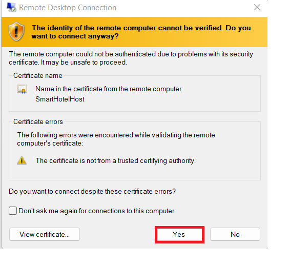
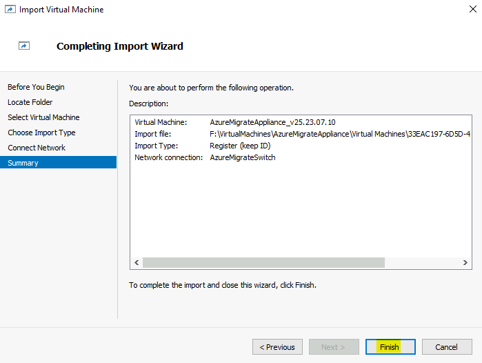
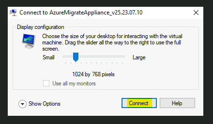
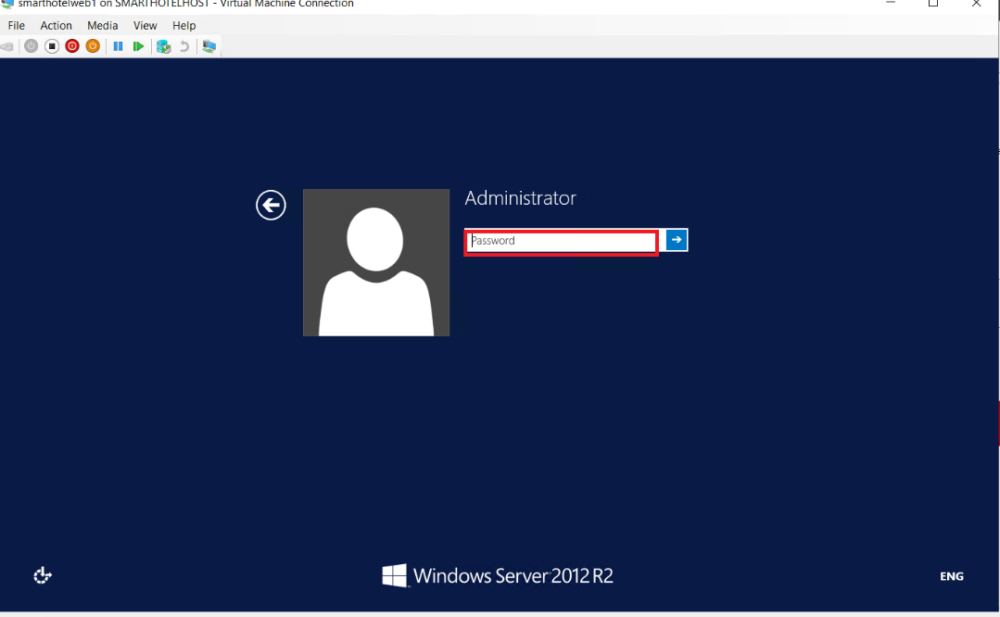
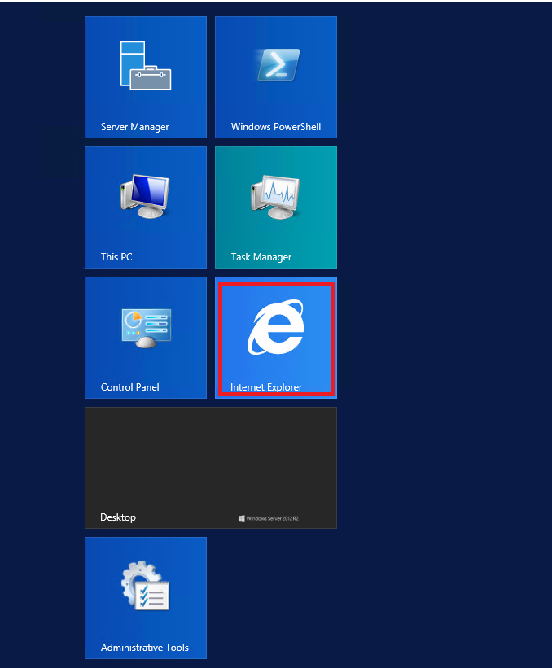

# Laboratorio 02 – Descubrir y evaluar el on-premises environment.

**Objetivo**

En este laboratorio, descubrimos y evaluamos los on-premises VMs con los
Azure Migrate Tools y crear un repositorio para almacenar los datos de
evaluación en un Azure Migration Project.

También instalemos los agentes para descubrir y visuliar el Dependency a
lo largo de los VMs

Para hacer esto, también necesitamos implementar el Azure Migrate
Appliance como un VM en el SmartHotelHost, y luego ejecute las tareas de
Discovery requeridas.

> **Importante**: Debe haber dejado pasar al menos 30-40 minutos para
> implementar el on-premises environment (**Lab 1- Deploying and
> verifying the on-premises environment and landing zone**) antes de
> empezar este laboratorio.

### Tarea 1: Cree el Azure Migrate project y agregar las herramientas assessment y migration

En esta tarea, creará el Azure Migrate project y seleccionará las
herramientas de assessment y migration.

> **Ojo**: En este laboratorio, usará el Microsoft-provided assessment y
> migration tools dentro de Azure Migrate. Un número de herramientas de
> terceros también se integran con Azure Migrate para assessment y
> migration. Puede que quiera explorar estas opciones de terceros fuera
> de este laboratorio.

1.  Cambie a la pestaña **Azure portal** o abra una nueva pestaña y
    navegue a `https://portal.azure.com` e inicie sesión con
    sus **Office 365 tenant credentials**.

2.  En el search bar tecle `Azure Migrate` y seleccione **Azure
    Migrate** para abrir el **Azure Migrate Overview** blade, como se ve
    aquí.

- 

  

  Una captura de pantalla de una computadora Descripción generada
  automáticamente

3.  Seleccione **Discover, assess and migrate**.

- 

  Una captura de pantalla de una computadora Descripción generada
  automáticamente

4.  Seleccione **Create project**.

- 

  Una captura de pantalla de una computadora Descripción generada
  automáticamente

5.  Seleccione el Subscription apropriado y cree un nuevo resource group
    llamado `AzureMigrateRG`

- 

6.  Introduzca `SmartHotelMigration` como el nombre de migration
    project, y elija un geography cerca de usted para almacenar los
    datos de evalucación de la migración. Aquí seleccionamos **United
    States**. Luego seleccione **Create**.

- 

  

7.  Empezará el Azure Migrate deployment. Una vez que se complete, debe
    ver los paneles **Azure Migrate: Discovery and
    assessment** y **Azure Migrate: Server Migration** para el migration
    project actual, como se ve aquí.

- 

Ha completado esta tarea. No cierre esta pestaña para continuar con la
siguiente tarea.

En esta tarea, ha creado un **Azure Migrate project**, con las
herramientas inegradas predeterminadas para server assessment y server
migration.

### Tarea 2: Implemente el Azure Migrate appliance

En esta tarea, implementará y configurará el Azure Migrate appliance en
el on-premises Hyper-V environment. Este appliance communica con el
Hyper-V server para obtener información y datos de rendimiento en sus
on-premises VMs, y devuelve estos datos a sus Azure Migrate project.

1.  En **Azure Migrate: Discovery and Assessment**,
    seleccione **Discover** y elija **Using appliance** para abrir
    el **Discover machines** blade.

- 

  Una captura de pantalla de una computadora Descripción generada
  automáticamente

2.  En **Are your servers virtualized?**, seleccione **Yes, with
    Hyper-V**.

- 

  Una captura de pantalla de una computadora Descripción generada
  automáticamente

3.  En **1: Generate project key**,
    proporcione `SHApplXXXXXX` (substitute **XXXXXX** with random
    number) como el nombre de Azure Migrate appliance que establecerá
    para el decubrimiento de Hyper-V VMs. Seleccione **Generate
    key** para iniciar la creación de Azure resources requeridos.

- 

  Una captura de pantalla de una computadora Descripción generada
  automáticamente

  

4.  **Espere** para que se genere la clave, y copie el **Azure Migrate
    project key** a su clipboard y guárdelo al **notepad.** Vamos a usar
    este **Key** en los siguientes Tasks.

- 

  Una captura de pantalla de una computadora Descripción generada
  automáticamente

5.  Asegure que se selecciona el botón **.VHD file 12 GB**, y haga clic
    derecho en el botón **Download** y seleccione la opción **Copy
    link**.

- 

6.  Copie el enlace en el notepad para usarlo más tarde para descargar
    Azure Migrate appliance.

- 

  Una descripción de texto en blanco y negro generada automáticamente

7.  En una pestaña diferente del navegador, navegue a **Azure portal**.
    En el cuadro de global search, introduzca `SmartHotelHost` y
    seleccione el **SmartHotelHost** virtual machine.

- 

8.  Seleccione **Connect**, elija **Connect** desde el drop-down.

- 

  Una captura de pantalla de una computadora Descripción generada
  automáticamente

9.  Seleccione **Download RDP File**.

- 

  Una captura de pantalla de una computadora Descripción generada
  automáticamente

10. Haga clic en el botón **Keep** para la notificación y haga clic en
    **Open file** para conectar.

- 

  Una captura de pantalla de una computadora Descripción generada
  automáticamente

11. **Conecte** a la máquina virtual con el username `demouser`
    password `demo!pass123`

- 

  

12. Seleccione **Yes**.

- 

13. Abra el navegador Chrome en el **SmartHotelHost** VM y pegue el
    enlace copiado para el Azure Migrate appliance desde el Notepad,
    debe haber empezado la descarga del archivo

- 

14. Una vez que se descarga el archivo, haga clic en el archivo
    descargado, elija la opción **Shown in folder.**

- 

  Una captura de pantalla de una computadora Descripción generada
  automáticamente

15. Haga doble clic en el zip file - **AzureMigrateAppliance**

- 

16. Una vez que se ve la carpeta **AzureMigrateAppliance,** selecciónelo
    y luego haga clic en el botón **Extract all** y proporcione el
    folder path como `F:\VirtualMachines` y haga clic en **Extract**.

- 

17. Cambie a la ventana **Server Manager**.  

18. En Server Manager, seleccione **Tools**, y luego **Hyper-V
    Manager** (si el Server Manager no se abre automáticamente, ábrelo
    en **Start**, y luego **Server Manager**).

- 

19. En Hyper-V Manager, seleccione **SMARTHOTELHOST**. Ahora ve una
    lista de cuatro VMs que contienen la
    aplicación **SmartHotel** local.

- 

20. En Hyper-V Manager, en **Actions**, seleccione **Import Virtual
    Machine…** para abrir el **Import Virtual Machine** wizard.

- 

21. En el primer paso, **Before You Begin**, seleccione **Next**.

- 

22. En el paso **Locate Folder**, seleccione **Browse** y navegue
    a `F:\VirtualMachines\AzureMigrateAppliance` (Asegúrese de
    seleccionar el que acaba de **extraer** en los pasos previos) y
    elija **Select Folder**, y seleccione **Next**.

- 

  Una captura de pantalla de una computadora Descripción generada
  automáticamente

23. En el paso **Select Virtual Machine**, se debe
    seleccionar **AzureMigrateAppliance** VM ya. Seleccione **Next**.

- 

24. En el paso **Choose Import Type**, mantenga la configuración
    predeterminada **Register the virtual machine in-place**.
    Seleccione **Next**.

- 

  Una captura de pantalla de una computadora Descripción generada
  automáticamente

25. En el paso **Connect Network**, verá un error que no se puede
    encontrar el virtual switch usado previamente por el Azure Migrate
    appliance. Desde el **Connection** drop down, seleccione el **Azure
    Migrate Switch**, y seleccione **Next**.

- 

  Una captura de pantalla de una computadora Descripción generada
  automáticamente

  > ***Ojo***: El Azure Migrate appliance necesita acceso a la red para
  > subir los datos a Azure. It also needs access to the Hyper-V host.
  > Sin embargo, no necesita un acceso directo a la aplicación VMs on el
  > Hyper-V host. Para proteger el entorno de la aplicación, se debe
  > impementar el Azure Migrate Appliance a un subnet separado dentro de
  > Hyper-V, en vez del mismo subnet como su aplicación.

  > El Hyper-V environment tiene un NAT network mediante un IP address
  > space 192.168.0.0/16. El internal NAT switch usado por la aplicación
  > SmartHotel usa el subnet 192.168.0.0/24, y se ha asignado un static
  > IP address a cada VM en la aplicación desde este subnet.

  > Se conectará el Azure Migrate Appliance a un subnet 192.168.1.0/24
  > diferente, lo que se ha configurado para usted. El ‘Azure Migrate
  > Switch’ conecta el appliance a este subnet. Se asigna un IP address
  > al appliance desde este subnet usando un DHCP service ejecutando en
  > el SmartHotelHost.

26. Revise la página de summary, y luego seleccione **Finish** para
    crear el Azure Migrate appliance VM.

- 

27. En Hyper-V Manager, seleccione el **AzureMigrateAppliance** VM, y
    seleccione **Start** en la parte derecha.

- 

Ha completado esta tarea. No cierre Hyper-V Manager para seguir con la
siguiente tarea.

**Resumen de la tarea**

En esta tarea implementó Azure Migrate appliance en el on-premises
Hyper-V environment.

### Tarea 3: Configure el Azure Migrate appliance

En esta tarea, configurará el Azure Migrate appliance y lo usará para
completar el discovery phase del migration assessment.

1.  En Hyper-V Manager, seleccione el **AzureMigrateAppliance** VM,
    inicie y seleccione **Connect**.

- 

2.  Se abr auna nueva ventana mostrando el Azure Migrate appliance.
    Espere a que se muestre la pantalla License terms, y
    seleccione **Accept**.

- 

3.  En la pantalla **Customize settings**, establezce el Administrator
    password a `demo!pass123` al teclar la contraseña manualmente (dos
    veces). Luego seleccione **Finish**.

- > **Ojo**: cuando introduzca la contraseña, el VM usa un formato de US
  > keyboard. Si usa un teclado que no sea de US, no se introducen bien
  > algunos de los carácteres. Seleccione el ícono ‘ojo’ en la segunda
  > casilla de contraseña para averiguar si se ha introducido bien la
  > contraseña.

  

4.  En el prompt **Connect to AzureMigrateAppliance**, establezca el
    tamaño de la pantalla del appliance con el slider, y
    seleccione **Connect**.

- 

5.  Inicie sesión con el Administrator al teclar la contraseña
    manualmente `demo!pass123` (la pantalla de inicio de sesión puede
    usar el format local del teclado, por facor use el ícono ‘ojo’ para
    averiguar).

- 

  Interfaz gráfica de usuario, descripción del sitio web generada
  automáticamente

6.  **Espere.** Después de unos minutos, se abrirá el navegador
    mostrando el Azure Migrate appliance configuration wizard (También
    se puede iniciar desde el acceso directo del escritorio).

- 

7.  Al abrir el asistente de configuración del dispositivo, aparecerá
    una ventana emergente con los términos de la licencia. Acepte los
    términos al seleccionar **I agree**.

- 

  Una captura de pantalla de una computadora Descripción generada
  automáticamente

8.  En **Set up prerequisites**, debe realizar de forma automática los
    siguientes dos pasos para verificar la conectividad de la red y
    sincronización de la hora.

- 

  Una captura de pantalla de una computadora Descripción generada
  automáticamente

9.  Pegue el **Azure Migrate project key** copiado desde el Azure
    portal, en la sección **Verification of Azure Migrate project key**,
    y haga clic en el botón **Verify**.

- 

  Una captura de pantalla de una computadora Descripción generada
  automáticamente

  > **Ojo**: Si no tiene el key, en el Azure Portal en Azure Migrate
  > vaya a **Server Assessment \> Discover \> Manage existing
  > appliances**, seleccione el appliance name que proporiconó a la hora
  > de key generation y copie el key correspondiente.

10. Una vez que el **Azure Migrate project key** esté configurado, se
    inicia un proceso de autoactualización.

- 

  Una captura de pantalla de una computadora Descripción generada
  automáticamente

11. Si se instala una nueva actualización, y haga clic en el
    botón **Refresh** para recargar la página.

- 

12. Haga clic en **Login**, se abre un pop up con un código.

- 

13. Se abre una nueva ventana mostrando un Device code.
    Seleccione **Copy code & Login.**

- 

  Una captura de pantalla de una computadora Descripción generada
  automáticamente

14. En las ventanas nuevas del navegador, cuando se le pide, pegue
    el **Code** y seleccione **Next**.

- 

  Una captura de pantalla de una computadora Descripción generada
  automáticamente

15. Introduzca sus Azure portal credentials y seleccione **Next**.
    Enter **Password** y seleccione **Sign in.**

- > **Ojo –** Debido a nested virtualization, aparece el símbolo @
  > como 2. Entonces rectifique las credenciales, y también asegúrese de
  > teclar la contraseña con el teclado o puede cambiar al Lab VM y
  > pegue la contraseña en un notepad y cópielo, y luego vuelva a
  > SmartHotelVM y puegue la contraseña en el AzureMigrate appliance VM.

  

  Una captura de pantalla de una computadora Descripción generada
  automáticamente

  

16. Seleccione **Continue**.

- 

  Una captura de pantalla de un error informático Descripción generada
  automáticamente

  

17. Vuelva a la pestaña **Azure Migrate Appliance** y se
    iniciará **Appliance registration** automáticamente.

- 

  Una captura de pantalla de una computadora Descripción generada
  automáticamente

18. Una vez que se complete el registro, procesa al siguiente
    panel, **Manage credentials and discovery sources**.

- 

  Una captura de pantalla de una computadora Descripción generada
  automáticamente

19. En Manage credentials and discovery sources **Step 1: Provide
    Hyper-V host credentials**, seleccione **Add credentials**.

- 

  Una captura de pantalla de una computadora Descripción generada
  automáticamente

20. Introduzca `hostlogin` como **Friendly name**, username `demouser` y
    tecle el password manualmente `demo!pass123` para el Hyper-V
    host/cluster que el appliance usará para descubrir los VMs.
    Seleccione **Save**.

- 

  Una captura de pantalla de una computadora Descripción generada
  automáticamente

  > **Ojo**: puede que el Azure Migrate appliance no ha detectado el
  > formato de su teclado local. Seleccione el ‘ojo’ en la casilla de
  > contraseña para averiguar si la contraseña fue introducida
  > corectamente.

  > ***Ojo:*** Se admiten múltiples credenciales para el -V VMs
  > discovery, a través del botón ‘Add more’.

21. En el **Paso** **2: Provide Hyper-V host/cluster details**,
    seleccione **Add discovery source** para especificar el Hyper-V
    host/cluster IP address/FQDN y el friendly name para las
    credenciales para conectarse al host/cluster.

- 

  Una captura de pantalla de una computadora Descripción generada
  automáticamente

22. Seleccione **Add single item,** enter `SmartHotelHost` en ‘IP
    Address / FQDN’ y seleccione **hostlogin** desde el drop-down como
    los Map credentials y luego haga **Save**.

- 

  Una captura de pantalla de una computadora Descripción generada
  automáticamente

  > **Ojo:** o puede **Add single item** uno por uno o **Add multiple
  > items** de un tiro. También hay una opción de para proporiconar los
  > detalles Hyper-V host/cluster a través de **Import CSV**.

23. El appliance validará la conexión a los Hyper-V hosts/clusters
    agregados y mostrará el **Validation status** en la tabla frente a
    cada host/cluster.

- 

  **Ojo:** A la hora de agregar los discovery sources:
  - Para los hosts/clusters validados exitosamente, puede ver más
    detalles al seleccionar sus IP address/FQDN.
  - Si la validación falla para un host, revise el error al seleccionar
    el Validation fallido en la columna Status de la tabla. Arregle el
    problema y valide de nuevo.
  - Para eliminar hosts o clusters, seleccione **Delete**.
  - No puede eliminar un host específico de un cluster. Solo puede
    quitar el cluster entero.
  - Puede agregar un cluster, aún si hay problemas con hosts específicos
    en el cluster.

24. Asegure que esté habilitado el Switch, y haga clic en **Add
    credentials**

- 

  Una captura de pantalla de un error informático Descripción generada
  automáticamente

25. En el Add credentials pop-up proporcione los detalles y haga clic en
    el botón **Save**.

    - Credential type – **Windows (Non-domain)**

    - Friendly name – `WindowsVM`

    - Username – `.\Administrator`

    - Password – tecle manualmente `demo!pass123`

- 

  Una captura de pantalla de una computadora Descripción generada
  automáticamente

26. Cierre la notificación.

- 

  Una captura de pantalla de una computadora Descripción generada
  automáticamente

27. Haga clic en **Add credentials** de nuevo y en el Add credentials
    pop-up proporcione los detalles y haga clic en el botón **Save**.

    - Credential type – **Linux (Non-domain)**

    - Friendly name – `LinuxVM`

    - Username – `.\demouser`

    - Password – tecle manualmente `demo!pass123`

- 

  Una captura de pantalla de una computadora Descripción generada
  automáticamente

28. Cierre la notificación.

- 

  Una captura de pantalla de una computadora Descripción generada
  automáticamente

29. Baje y haga clic en el botón **Start Discovery**.

- 

  Una captura de pantalla de una computadora Descripción generada
  automáticamente

  

  Una captura de pantalla de una computadora Descripción generada
  automáticamente

30. Espere a que Azure Migrate status muestra **Discovery has been
    successfully initiated**. Esto tardará unos 10-13 minutos. Después
    de que se inicie exitosamente el discovery, puede averiguar el
    discovery status contra cada host/cluster en la tabla.

- 

  Una captura de pantalla de una computadora Descripción generada
  automáticamente

31. Cambie a Lab VM, abra el Edge browser, navegue a Azure
    Portal `https://portal.azure.com` e inicie sesión con sus office 365
    tenant credentials y vuelva a **Azure Migrate** blade.

- 

  Interfaz gráfica de usuario, texto, aplicación, email Descripción
  generada automáticamente

32. Seleccione **Servers, databases and web apps** y luego
    seleccione **Refresh**.

- 

  Una captura de pantalla de una computadora Descripción generada
  automáticamente

  

33. En **Azure Migrate: Server Assessment** debe ver un recuento de la
    cantidad de servidores descubiertos hasta el momento. Si la
    detección aún está en curso, seleccione **Refresh** periódicamente
    hasta que se muestren 5 servidores detectados. Esto puede tardar
    varios minutos.

- 

  Una captura de pantalla de una computadora Descripción generada
  automáticamente

**Importante: Espere a que se complete el proceso de detección antes de
continuar con la siguiente tarea**.

Ha completado esta tarea, no cierre esta pestaña para continuar con la
siguiente tarea.

**Resumen de la tarea**

En esta tarea, configurará el Azure Migrate appliance en el on-premises
Hyper-V environment y empezará el migration assessment discovery
process.

### Tarea 4: Import el Servers inventory con un CSV file

También puede importar un inventario del entorno, su configuración y
utilización con un archivo CSV. Las propiedades del CSV son::

- **Server Name** – Nombre de la computadora

- **IP Addresses** – lista separada por punto y coma de direcciones IPv4
  e IPv6 utilizadas por el equipo

- **Cores** – número de vCPU utilizadas

- **Memory** – cantidad de memoria en MB

- **OS Details**

  - **Name** – Tipo de sistema operativo

  - **Version** – versión del sistema operativo en uso

  - **Architecture** – architecture (como x64/x86)

- **CPU Utilization** – porcentaje de la CPU en uso

- **Memory Utilization** – Pico porcentual del uso de la CPU

- **Network**

  - Adapter count – Número de NIC conectadas a la máquina

  - Input Throughput – cantidad de rendimiento en Mbps en el sistema

  - Output Throughput – cantidad de rendimiento en Mbps fuera del
    sistema

- **Boot Type** – Tipo de arranque utilizado por los sistemas
  (UEFI/BIOS)

- **Disks**

  - **Number of disks** – Número de discos conectados al disco

  - **Per disk size** – tamaño del disco en GB

  - **Per disk reads (Bytes)** – cantidad de MB por segundo leídos de
    cada disco

  - **Per disk writes (Bytes)** – cantidad de MB por segundo escritos en
    cada disco

  - **Per disk reads (IOPS)** – Recuento de operaciones de salida del
    disco por segundo

  - **Per disk writes (IOPS)** – Recuento de operaciones de entrada del
    disco por segundo

Una vez rellenado el CSV, puede importar los sistemas a la fase de
evaluación de Migrate haciendo lo siguiente:

1.  Cuando está en el **Azure Migrate** blade, en Migration goals,
    asegure que se seleccione **Servers, databases and web apps**,
    seleccione el botón **Discover** y elija **Using import**.

- 

  Una captura de pantalla de una computadora Descripción generada
  automáticamente

2.  Suba el CSV file llamado **Azure Migrate import
    template.csv** desde `C:\Labfiles` y seleccione **Import** para leer
    el archivo.

- 

  Una captura de pantalla de una computadora Descripción generada
  automáticamente

3.  El import debe iniciar el procesamiento de los registros de
    archivos.

- 

  Una captura de pantalla de una computadora Descripción generada
  automáticamente

4.  Debe obtener la notificación como se ve aquí en la imagen

- 

  Un primer plano de un número Descripción generada automáticamente

5.  En los import details puede ver que se han insertado **40
    Records** exitosamente.

- 

6.  Cierre el Discovery blade y haga clic en el botón **Refresh**.

- 

  Una captura de pantalla de una computadora Descripción generada
  automáticamente

7.  Puede ver que se ha actualizado la lista de Discovered Servers.

    - **Discovered Servers – 45**

- 

  Una captura de pantalla de una computadora Descripción generada
  automáticamente

8.  Haga clic en **Discovered items**, y luego seleccione la
    pestaña **Import based**, debe poder ver los detalles de los 40
    imported servers. Asegúrese de seleccionar el Project desde el
    drop-down menu.

- 

  Una captura de pantalla de una computadora Descripción generada
  automáticamente

Ha completado esta tarea, no cierre esta pestaña para seguir con la
siguiente tarea.

### Tarea 5: Construya los business cases para un presupuesto del costo.

En esta tarea, usaremos Azure Migrate para Build Business Case con los
datos recopilados durante el discovery phase desde el Azure Migrate
appliance y desde la lista Imported Servers.

El Business case capability le ayuda a construir una propuesta de
negocios para entender cómo Azure puede traer valor a su negocio.
Destaca:

- Costo total de propiedad local frente a Azure.

- Análisis de flujo de caja año tras año.

- Información basada en la utilización de recursos para identificar los
  servidores y las cargas de trabajo que son ideales para la nube.

- Ganancias rápidas para la migración y la modernización, incluido el
  fin del soporte técnico de las versiones del sistema operativo Windows
  y SQL.

- Ahorro de costos a largo plazo al pasar de un modelo de gastos de
  capital a un modelo de gastos operativos, al pagar solo por lo que
  usa.

- Ayuda a eliminar las conjeturas en el proceso de planificación de
  costos y agrega cálculos basados en información de datos.

- Se puede generar con solo unos pocos clics después de haber realizado
  la detección mediante el Azure Migrate appliance.

- La característica se habilita automáticamente para los proyectos
  existentes de Azure Migrate.

1.  Haga clic en **Servers, databases and web apps** en Migration goal,
    y luego seleccione el botón **Build business case**.

- 

  Una captura de pantalla de una computadora Descripción generada
  automáticamente

2.  En la página **Build business case (Preview)**, proporcione los
    siguientes detalles y haga clic en el botón **Build business case**.

    - Business case name - `BCase1 from Imported CSV`

    - Target location - **West US**

    - Discovery source – **Build a quick business case using the servers
      imported via a .CSV file.**

    - Savings options – **Reserved instance + Azure Saving Plan**

    - Discount (%) on Pay as you go - **0**

- 

  Una captura de pantalla de una computadora Descripción generada
  automáticamente

3.  Debemos obtener la notificación como se ve aquí

- 

  Una captura de pantalla de una computadora Descripción generada
  automáticamente

4.  Después de unos minutos, haga clic en el botón Refresh

- 

5.  Una vez que se calculan Assumptions la página se ve así

- 

  Una captura de pantalla de una computadora Descripción generada
  automáticamente

6.  Revise los detalles en **TCO comparison** y haga clic en el enlace
    **View Details**.

- 

7.  Esto abrirá los informes de Business case – **On-premises vs
    Azure**, lo que le muestra el **Estimated annual cost by category**.

- 

8.  Baje para ver los detalles de **Total cost of ownership**

- 

9.  Volviendo a la página Overview del Business Case, revise el **YoY
    estimated current vs future state cost** y el **Savings with Azure
    Hybrid Benefit**

- 

  > **Ojo** – Mientras que planea migrar a Azure en fases, este gráfico
  > de líneas muestra su flujo de caja de cada año en función de
  > finalización de la migración estimada aquel año. De forma
  > predeterminada, se supone que migrará el 0 % en el año actual, el 20
  > % en el año 1, el 50 % en el año 2 y el 100 % en el año 3. El costo
  > del estado actual muestra cómo será el flujo de caja neto en las
  > instalaciones, dado que la infraestructura crece un 5 % al año. El
  > costo de estado futuro muestra cómo será el flujo de caja neto a
  > medida que migre un porcentaje a Azure por año, como en los
  > supuestos de "costo de Azure", mientras que la infraestructura crece
  > un 5 % por año.

  > **Ojo** - **Azure Hybrid Benefit** es un beneficio de licencia que
  > le ayuda a reducir significativamente los costos de ejecución de sus
  > cargas de trabajo en la nube. Funciona permitiéndole usar su entorno
  > local de Software Assurance-enabled Windows Server y SQL Server
  > licenses en Azure.

10. Revise la información proporcionada en la sección Discovery insights

    - **Total Server – Distribution**

    - **OS Distribution**

- 

  Una captura de pantalla de una computadora Descripción generada
  automáticamente

11. Haga clic en el **Azure IaaS**, revise la pantalla **Azure** que
    proporciona información que es **Ready for migration** y
    también **IaaS cost estimate** para el mismo y el **Saving with
    Azure Hybrid Benefit**.

- 

12. Baje para más detalles sobre

    - **Estimated cost by savings option**

    - **Recommended VM family and Storage type**

    - **On-premises cost vs Azure cost**

- 

13. Suba y haga clic en la pestaña **On-premises**, va a
    mostrar **On-premises cost estimate**

- 

14. Baje y averigüe la sección Server analysis mostrando

    - **Distribution by operating system**

    - **Distribution by virtualization**

    - **Distribution by category**

- 

15. Haga clic en el enlace **View details** en End of Support, hará una
    lista de todos los servidores considerados en el caso de negocio
    con **recommended targets, activity state** y **qualifying offers in
    Azure**.

- 

16. Cierre el Details blade y luego haga clic en **Azure cost** en
    Assumptions.

- 

17. Aquí puede modificar el **Assumptions for Azure cost** y **Cost
    modelling** y luego haga clic en **Save** para reevaluar la Business
    case.

18. Haga clic en **On-premises cost**, en la pestaña **Compute** tiene
    la configuración para

    - **Software - SQL Server licensing**

    - **Software - Windows server licensing**

    - **Virtualization software – Hyper-V**

    - **Virtualization software – VMware**

- 

  Una captura de pantalla de una computadora Descripción generada
  automáticamente

19. Haga clic en la pestaña **Storage** para averiguar las
    configuraciones

- 

  Una captura de pantalla de una computadora Descripción generada
  automáticamente

20. Haga clic en la pestaña **Network** para averiguar las
    configuraciones

- 

  Una captura de pantalla de una computadora Descripción generada
  automáticamente

21. Haga clic en la pestaña **Security** para averiguar las
    configuraciones

- 

  Una captura de pantalla de una computadora Descripción generada
  automáticamente

22. Haga clic en la pestaña **Management** para averiguar las
    configuraciones 

23. Haga clic en la pestaña **Labor** para averiguar las configuraciones

- 

  Una captura de pantalla de una computadora Descripción generada
  automáticamente

24. Haga clic en la pestaña **Facilities** para averiguar las
    configuraciones

- 

  Una captura de pantalla de una computadora Descripción generada
  automáticamente

25. El costo local adecuado se puede estimar realizando cambios en esta
    configuración y, a continuación, haga clic en el botón Save para
    reevaluar el costo local.

26. Ahora vamos a crear otro caso de negocio para los servidores
    descubiertos usando el Azure Migrate appliance.

27. Para la página Azure Migrate, haga clic en Servers, databases y web
    apps y luego haga clic en **Build Business case**

- 

  Una captura de pantalla de una computadora Descripción generada
  automáticamente

28. En la página **Build business case (Preview)**, proporcione los
    siguientes detalles y haga clic en el botón **Build business case**.

    - Business case name - `BCase2 Migrate Appliance`

    - Target location - **West US**

    - Discovery source – **Use more accurate data insights collected via
      the Azure Migrate appliance.**

    - Migration strategy - **Azure recommended approach to minimize
      cost**

    - Savings options – **Reserved instance + Azure Saving Plan**

    - Discount (%) on Pay as you go - **0**

- 

  Una captura de pantalla de una computadora Descripción generada
  automáticamente

29. Deberíamos recibir la notificación como se muestra a continuación

- 

30. Después de unos minutos, haga clic en el botón Refresh

- 

  Una captura de pantalla de una computadora Descripción generada
  automáticamente

31. Una vez que se calculan los Assumptions, la página debería aparecer
    como se muestra a continuación

- 

  Una captura de pantalla de una computadora Descripción generada
  automáticamente

32. Similar al Business Case creado por los Imported Servers, puede
    revisar los detalles de este Business case para las siguientes
    áreas.

    - **TCO comparison**

    - **Discovery insights**

    - Business case reports

      - **On-premises vs Azure**

      - **Azure IaaS**

    - Assumptions

      - **Azure cost**

      - **On-premises cost**

33. Una vez que se revisa **BCase2 Migrate Appliance** – Business Case,
    volviendo a la página Azure Migrate, haga clic en el
    botón **Overview** en el **Servers, databases and web apps.**

- 

  Una captura de pantalla de una computadora Descripción generada
  automáticamente

34. Haga clic en **Business cases** en Manage.

- 

  Una captura de pantalla de una computadora Descripción generada
  automáticamente

35. Deberíamos poder ver los 2 casos de negocio creados a partir de
    diferentes fuentes de Discovery.

    - Import

    - Appliance

- 

  Una captura de pantalla de una computadora Descripción generada
  automáticamente

### Tarea 6: Cree un migration assessment

En esta tarea, usará Azure Migrate para crear un migration assessment
para la aplicación **SmartHotel**, usando los datos recopilados durante
el discovery phase.

1.  En Azure Migrate seleccione **Assess -\> Azure VM** en **Azure
    Migrate: Discovery and assessment** para iniciar una nueva
    evaluación de migración.

- 

  Una captura de pantalla de una computadora Descripción generada
  automáticamente

2.  En el **Create Assessment Basics** blade, proporcione los siguientes
    detalles

    - Assessment type - **Azure VM**

    - Discovery Source - **Servers discovered from Azure Migrate
      Appliance**.

    - En Assessment settings – haga clic en el enlace **Edit**

- 

  Una captura de pantalla de una computadora Descripción generada
  automáticamente

3.  El **Assessment settings** blade permite adaptar muchas de las
    configuraciones utilizadas al realizar un informe de evaluación de
    migración. Tómese unos minutos para explorar la amplia gama de
    propiedades de evaluación.

4.  A continuación, realice los siguientes cambios y haga clic en el
    botón **Save**.

    - Target location – **West US** (Región en la que se aumentaron los
      núcleos de vCPU de suscripción)

    - Saving options – **3 Years reserved**

    - Percentile utilization – **99^(th)**

    - VM series – **Select All**

- 

  Una captura de pantalla de una computadora Descripción generada
  automáticamente

**Ojo:** Tiene que hacer un cambio para que se active el botón **Save**;
si no quiere hacer ningún cambio, solo cierre el blade.

5.  Volviendo a la pestaña Basics, haga clic en el
    botón **Next**: **Select servers to assess \>** .

- 

  Una captura de pantalla de una computadora Descripción generada
  automáticamente

6.  Introduzca **Assessment name** as `SmartHotelAssessment`.
    Elija **Create New** e introduzca el nombre del grupo
    `SmartHotel VMs`. Seleccione
    el **smarthotelweb1**, **smarthotelweb2** y **UbuntuWAF** VMs y
    seleccione el botón **Next: Review+ Create assessment**.

- 

  > **Ojo**: No es necesario incluir las máquinas virtuales
  > smarthotelSQL1 o AzureMigrateAppliance en la evaluación, ya que no
  > se migrarán a Azure. (SQL Server se migrará al servicio SQL Database
  > y el dispositivo Azure Migrate Appliance solo se usa para la
  > evaluación de la migración.)

7.  Seleccione **Create assessment**.

- 

  Una captura de pantalla de una computadora Descripción generada
  automáticamente

8.  En el **Azure Migrate - Servers, databases and web apps** blade,
    seleccione **Refresh** periódicamente hasta que el número de cuotas
    mostradas sea 1. Esto puede tardar unos 5 minutos.

9.  En la página Azure Migrate Server, databases and web app en
    Assessment seleccione 1.

- 

  Una captura de pantalla de una computadora Descripción generada
  automáticamente

10. Haga clic en **SmartHotelAssessment** desde la lista.

- 

  Una captura de pantalla de una computadora Descripción generada
  automáticamente

11. Tómese un momento para estudiar el resumen de la evaluación.

- 

  Una captura de pantalla de una computadora Descripción generada
  automáticamente

12. Seleccione **Settings**.

- 

  Una captura de pantalla de una computadora Descripción generada
  automáticamente

13. En el Assessment setting cambie lo siguiente y haga clic en el
    botón **Save**.

    - Performance History – **1 Week**

    - Percentile utilization – **95^(th)**

- 

  Una captura de pantalla de una computadora Descripción generada
  automáticamente

14. Después de unos momentos, se actualizará el assessment report para
    mostrar sus cambios.

- 

  Una captura de pantalla de una computadora Descripción generada
  automáticamente

15. **Comparación** como se ve en la imagen.

- 

16. Seleccione **Azure readiness** (ya sea en el gráfico o en la
    navegación de la izquierda). Note que para el **UbuntuWAF** VM, se
    enumera un problema específico con respecto a la preparación de la
    máquina virtual para la migración.

- 

  Una captura de pantalla de una computadora Descripción generada
  automáticamente

  > Tómese unos minutos para explorar otros aspectos de la migration
  > assessment.

  > **Ojo**: El proceso de recopilación de información de los entornos
  > del sistema operativo (OSE) y la migración de datos de máquinas
  > virtuales entre entornos lleva algún tiempo debido a la naturaleza
  > de la transferencia de datos. Sin embargo, hay algunos pasos que se
  > pueden realizar para acelerar y ver cómo funciona el sistema. Estas
  > son algunas opciones:

  > Pasos comunes para actualizar datos: (también vea Troubleshoot
  > Discovery)

  - Server data not updating in portal – Si los datos de los servidores
    no se actualizan, este es un método para acelerarlo.

  &nbsp;

  - Do not see software inventory details – De forma predeterminada, el
    inventario de software solo se actualiza una vez cada 24 horas. Esto
    obliga a una actualización.

  &nbsp;

  - Software inventory errors – Durante el inventario, a veces se
    devuelven códigos de error. Esto enumera todos los códigos de error
    y significados.

  > Muchos problemas en Migrate pueden estar relacionados con el
  > dispositivo que no actualiza los datos debido a programaciones
  > regulares o que los datos no se transfieren. Forzar la actualización
  > de los datos y la información se puede lograr con los siguientes
  > pasos:

17. En la página **Azure Migrate** en **Servers, database and web
    apps**, **Azure Migrate: Discovery and assessment**,
    seleccione **Overview**.

- 

  Una captura de pantalla de una computadora Descripción generada
  automáticamente

18. En **Manage**, seleccione **Appliances**. Seleccione **Refresh
    services**.

- 

  Una captura de pantalla de una computadora Descripción generada
  automáticamente

  

  Una captura de pantalla de una computadora Descripción generada
  automáticamente

19. Espere a que se complete la operación de actualización. Ahora
    debería ver la información actualizada.

- 

  Una captura de pantalla de una computadora Descripción generada
  automáticamente

Ha completado esta tarea. No cierre esta pestaña para continuar con la
siguiente tarea.

**Resumen de la tarea:**

En esta tarea, ha creado y configurado un Azure Migrate migration
assessment.

### Tarea 7: Configure el dependency visualization

Al migrar una carga de trabajo a Azure, es importante comprender todas
las dependencias de la carga de trabajo. Una dependencia interrumpida
podría significar que la aplicación no se ejecuta correctamente en
Azure, quizás de formas difíciles de detectar. Algunas dependencias,
como las que existen entre los niveles de aplicación, son obvias. Otras
dependencias, como DNS lookups, Kerberos ticket validation o certificate
revocation checks, no las son.

En esta tarea, configurará la característica **Azure Migrate dependency
visualization**. Esto requiere crear un **Log Analytics workspace**, y
luego para implementar agents en los VMs a migrar.

1.  Cuando todavía está en la página **Azure Migrate**,
    Seleccione **Servers, database and web apps**. En **Azure Migrate:
    Discovery and assessment** haga clic en el enlace número **1**
    debajo de **Groups**.

- 

  Una captura de pantalla de una computadora Descripción generada
  automáticamente

2.  Seleccione el grupo **SmartHotel VMs** para ver los detalles del
    grupo.

- 

  Una captura de pantalla de una computadora Descripción generada
  automáticamente

3.  Note que cada VM tiene el estado **Dependencies** como **Requires
    agent installation**. Seleccione **Requires agent
    installation** para el **smarthotelweb1** VM.

- 

  Una captura de pantalla de una computadora Descripción generada
  automáticamente

4.  En el **Dependencies** blade, seleccione **Configure Log Analytics
    workspace**.

- 

  Una captura de pantalla de una computadora Descripción generada
  automáticamente

5.  Cree un nuevo Log Analytics workspace.
    Use `AzureMigrateWSXXXXXX` \[Substituya **XXXXXX** con un número
    aleatorio\], como el workspace name. Elija la ubicación de Log
    Analytics workspace desde la lista, y seleccione **Configure**.

6.  Espere a que se implemente el workspace. Tome nota de **Workspace
    ID** y **Workspace Key** en Notepad.

- 

  Una captura de pantalla de una computadora Descripción generada
  automáticamente

7.  Haga clic con el botón derecho y copie la dirección de enlace de
    cada una de las **4 URL de descarga del agente** y péguelas junto
    con el **Workspace ID y key** que notó en el **notepad** en el paso
    9 anterior.

- 

  Una captura de pantalla de una computadora Descripción generada
  automáticamente

  > **Ojo** : Puede enviar estos vínculos por correo a su cuenta de
  > prueba y abrirla en en VM.

8.  Vuelva a la sesión RDP de **SmartHotelHost** si se le solicita que
    se conecte, use las credenciales.

    - Username - `demouser`

    - Password - `demo!pass123`

9.  En **Hyper-V Manager**, seleccione **smarthotelweb1** y
    seleccione **Connect**.

- 

  Una captura de pantalla de una computadora Descripción generada
  automáticamente

10. Seleccione **Connect** de nuevo cuando se le pide e inicie sesión
    con la cuenta **Administrator** al teclar la
    contraseña `demo!pass123`

- 

  Interfaz gráfica de usuario, aplicación Descripción generada
  automáticamente

  

11. Abra **Internet Explorer**

- 

12. Pegue el enlace a **64-bit Microsoft Monitoring Agent for
    Windows** que haya guardado anteriormente, cuando se le solicite,
    haga clic en el botón **Run**.

- 

  Una captura de pantalla de un error informático Descripción generada
  automáticamente

  > **Ojo:** Es posible que deba deshabilitar **Internet Explorer
  > Enhanced Security Configuration** en **Server Manager** en **Local
  > Server** para completar la descarga.

13. En el Microsoft Monitoring Agent Setup, haga clic en **Next** y
    luego haga clic en **I Agree.**

14. Continúe con las selecciones predeterminadas hasta que el **Agent
    Setup Options** page. Desde allí, seleccione **Connect the agent to
    Azure Log Analytics (OMS)** y seleccione **Next**.

- 

  Una captura de pantalla de una computadora Descripción generada
  automáticamente

15. Introduzca el Workspace ID y Workspace Key que copió anteriormente y
    seleccione **Azure Commercial** desde el Azure Cloud drop-down.
    Seleccione **Next**, seleccione las páginas restantes
    e **instale** el agente.

- 

  Una captura de pantalla de una computadora Descripción generada
  automáticamente

16. Continúe el resto de la configuración con las opciones
    predeterminadas, luego haga clic en **Finish**

- 

  Una captura de pantalla de una computadora Descripción generada
  automáticamente

17. Pegue el enlace a **Dependency Agent Windows installer** en la barra
    de direcciones del navegador. **Ejecute** el installer y seleccione
    el install wizard para completar la instalación.

- 

  Una captura de pantalla de una computadora Descripción generada
  automáticamente

  > **Ojo:** No es necesario configurar el ID y la clave del espacio de
  > trabajo al instalar el Dependency Agent, ya que utiliza la misma
  > configuración que el Microsoft Monitoring Agent, que debe instalarse
  > de antemano.

  

18. Cierre la ventana de conexión de la máquina virtual para
    el **smarthotelweb1** VM.

19. En **Hyper-V Manager**, seleccione **smarthotelweb2** y seleccione
    select **Connect**.

- 

20. Seleccione **Connect** de nuevo cuando se le pide e inicie sesión en
    la cuenta **Administrator** al teclar la contraseña `demo!pass123`

- 

  Interfaz gráfica de usuario, aplicación Descripción generada
  automáticamente

  

21. Abra **Internet Explorer**, y tecle la contraseña que notó
    anteriormente. Cuando se le puede, **ejecute** el installer.

- 

22. Cierre la ventana de virtual machine connection window para
    el **smarthotelweb2** VM.

23. Pegue el enlace de **64-bit Microsoft Monitoring Agent for
    Windows** que guardó anteriormente, cuando se le pide, haga clic en
    el botón **Run**.

- 

  Una captura de pantalla de un error informático Descripción generada
  automáticamente

  > **Ojo:** puede que tenga que deshabilitar **Internet Explorer
  > Enhanced Security Configuration** en **Server Manager** en **Local
  > Server** para completar la descarga.

24. En el Microsoft Monitoring Agent Setup, haga clic en **Next** y
    luego haga clic en **I Agree.**

25. Proceda con las selecciones predeterminadas hasta la página **Agent
    Setup Options**. Desde ahí, seleccione **Connect the agent to Azure
    Log Analytics (OMS)** y seleccione **Next**.

- 

  Una captura de pantalla de una computadora Descripción generada
  automáticamente

26. Introduzca el Workspace ID y Workspace Key que copió anteriormente y
    seleccione **Azure Commercial** desde el Azure Cloud drop-down.
    Seleccione **Next**, seleccione a través de las páginas restantes
    e **instale** el agente.

- 

  Una captura de pantalla de una computadora Descripción generada
  automáticamente

27. Continue con el resto de Setup con las opciones predeterminadas, y
    haga clic en **Finish**

- 

  Una captura de pantalla de una computadora Descripción generada
  automáticamente

28. Pegue el enlace de **Dependency Agent Windows installer** en el
    browser address bar. **Ejecute** el installer y seleccione el
    install wizard para completar la instalación.

- 

  Una captura de pantalla de una computadora Descripción generada
  automáticamente

  > **Ojo:** No es necesario configurar el ID y la clave del espacio de
  > trabajo al instalar el Dependency Agent, Dado que utiliza la misma
  > configuración que el Microsoft Monitoring Agent, que debe instalarse
  > de antemano.

  

  > Ahora **implementará** los **Linux versions of the Microsoft
  > Monitoring Agent** y Dependency Agent en el **UbuntuWAF** VM. Para
  > hacerlo, primero se conectará a **UbuntuWAF** de forma remota con
  > un **SSH session**.

29. Vuelva a RDP session con el **SmartHotelHost** y abra un command
    prompt mediante el desktop shortcut.

- 

  Una captura de pantalla de una computadora Descripción generada
  automáticamente

  > **Ojo**: El **SmartHotelHost** se ejecuta Windows Server 2019 con el
  > Windows Subsystem for Linux habilitado. Esto permite que se usa
  > command prompt como un SSH client. Se puede encontrar la información
  > de admisión de Linux on Azure aquí: `https://Azure.com/Linux`

30. Escriba el siguiente comando para conectarse a la **máquina virtual
    UbuntuWAF** que se ejecuta en Hyper-V en SmartHotelHost use el
    siguiente comando

- `ssh demouser@192.168.0.8`

31. Introduzca **‘yes’** cuando se le pide si quiere conectar. Use la
    contraseña `demo!pass123`.

- 

32. Introduzca el siguiente comando, seguido de la contraseña
    `demo!pass123` cuando se le solicite:

- `sudo -s`

  

  Una captura de pantalla de una computadora Descripción generada
  automáticamente

33. Esto le da a la sesión de terminal **elevated/root privileges**

34. Introduzca el siguiente comando, sustituyendo \y \con los valores
    copiados anteriormente.

- `wget https://raw.githubusercontent.com/Microsoft/OMS-Agent-for-Linux/master/installer/scripts/onboard_agent.sh && sh onboard_agent.sh -w <Workspace ID> -s <Workspace Key> -d opinsights.azure.com`

35. Cuando se le pide Yes y presione enter

- 

  

36. Las pantallas de instalación deberían aparecer como se indica a
    continuación.

- 

  

  Captura de pantalla de un programa informático Descripción generada
  automáticamente

37. Introduzca el siguiente command, sustituyendo **\< Workspace
    ID\>** con el valor copiado anteriormente

- `/opt/microsoft/omsagent/bin/service_control restart <Workspace ID>`

  

38. Ingrese el siguiente comando para descargar el Dependency Agent for
    Linux.

- `wget --content-disposition https://aka.ms/dependencyagentlinux -O InstallDependencyAgent-Linux64.bin`

  

  Una pantalla de computadora con texto Descripción generada
  automáticamente

39. Instale el agente de dependencias ejecutando el siguiente command.

- `sh InstallDependencyAgent-Linux64.bin -s`

  

  Una captura de pantalla de una computadora Descripción generada
  automáticamente

40. La instalación del agente ya se ha completado.

A continuación, debe generar algo de tráfico en la aplicación SmartHotel
para que la visualización de dependencias tenga algunos datos con los
que trabajar. Vaya a la dirección IP pública del SmartHotelHost y
dedique unos minutos a actualizar la página y registrar la entrada y
salida de los huéspedes.

**Resumen de la tarea**

En esta tarea, ha configurado el Azure Migrate dependency visualization,
al crear un Log Analytics workspace e implementar el Azure Monitoring
Agent y Dependency Agent en Windows y Linux on-premises machines.

### Tarea 8: Explore el dependency visualization

En esta tarea, explorará el dependency visualization feature de Azure
Migrate. Este feature usa los datos recopilados al dependency agent que
instaló anteriormente.

1.  Cambie a Azure Portal con la página **Azure Migrate** abierta,
    seleccione **Servers, database and web apps**. En **Azure Migrate:
    Discovery and assessment** haga clic en el enlace número 1
    en **Groups**.

- 

  Una captura de pantalla de una computadora Descripción generada
  automáticamente

2.  Seleccione el **SmartHotel VMs** group para ver los detalles del
    grupo.

- 

  Una captura de pantalla de una computadora Descripción generada
  automáticamente

3.  Asegure que el Dependency agent para todos los VMs muestran el
    estado como **Installed**

- 

  Una captura de pantalla de una computadora Descripción generada
  automáticamente

4.  Haga clic en **View dependencies**.

- 

  Una captura de pantalla de una computadora Descripción generada
  automáticamente

5.  Tómese unos minutos para explorar la vista de dependencias. Expanda
    cada servidor para mostrar los procesos que se ejecutan en ese
    servidor. Seleccione un proceso para ver la información del proceso.
    Ver qué conexiones hace cada servidor.

- 

  Una captura de pantalla de una computadora Descripción generada
  automáticamente

  

  Una captura de pantalla de una computadora Descripción generada
  automáticamente

**Resumen**

Al final del laboratorio, deberíamos haber detectado y evaluado
correctamente las máquinas virtuales locales mediante el Azure Migrate
Appliance y los metadatos deberían estar disponibles en el proyecto de
Azure Migrate con los detalles que se muestran a continuación

- Evaluación de los VMs

&nbsp;

- 

  Graphical user interface, application Description automatically
  generated

&nbsp;

- Dependency Map del VMs

&nbsp;

- 

  Una imagen que contiene un gráfico Descripción generada
  automáticamente
