# Atelier 0 2 - Découverte et évaluation de l'environnement sur site.

**Objectif**

Dans cet atelier, nous allons découvrir, puis évaluer les machines
virtuelles locales à l'aide des outils Azure Migrate et créer un
référentiel pour stocker les données d'évaluation dans un projet de
migration Azure.

Nous installerions également des agents pour découvrir et visualiser la
dépendance entre les machines virtuelles

Pour ce faire, nous devons déployer l'appliance Azure Migrate en tant
que machine virtuelle sur le SmartHotelHost, puis exécuter les tâches de
découverte requises.

> **Important** : Vous devez avoir prévu au moins 30 à 40 minutes pour
> déployer l'environnement local (**Atelier 1 - Déploiement et
> vérification de l'environnement local et de la zone d'atterrissage**)
> avant de commencer cet atelier.

### Tâche 1 : Créer le projet Azure Migrate et ajouter des outils d'évaluation et de migration

Dans cette tâche, vous allez créer le projet Azure Migrate et
sélectionner les outils d'évaluation et de migration.

> **Remarque** : Dans cet atelier, vous allez utiliser les outils
> d'évaluation et de migration fournis par Microsoft dans Azure Migrate.
> Un certain nombre d'outils tiers sont également intégrés à Azure
> Migrate pour l'évaluation et la migration. Vous voudrez peut-être
> passer un peu de temps à explorer ces options tierces en dehors de cet
> atelier.

1.  Revenez à l' onglet **Azure portal**  ou ouvrez un nouvel onglet,
    accédez à `https://portal.azure.com` et connectez-vous avec vos
    **informations d'identification de Office 365 tenant.**

2.  Dans la barre de recherche, tapez `Azure Migrate` et sélectionnez
    **Azure Migrate** pour ouvrir le panneau **Azure Migrate Overview** 
    illustré ci-dessous.

- 

  

  Une capture d'écran d'un ordinateur Description générée
  automatiquement

3.  Sélectionnez **Discover, assess and migrate**.

- 

  Une capture d'écran d'un ordinateur Description générée
  automatiquement

4.  Sélectionnez **Create project**.

- 

  Une capture d'écran d'un ordinateur Description générée
  automatiquement

5.  Sélectionnez l'abonnement approprié et créez un groupe de ressources
    nommé `AzureMigrateRG`

- 

6.  Entrez `SmartHotelMigration` comme nom du projet de migration et
    choisissez une zone géographique proche de chez vous pour stocker
    les données d'évaluation de la migration. Ici, nous sélectionnons
    **United States**. Sélectionnez ensuite **Create**.

- 

  

7.  Le déploiement d'Azure Migrate démarre. Une fois l'opération
    terminée, les panneaux **Azure Migrate: Discovery and assessment** 
    et **Azure Migrate : server Migration** pour le projet de migration
    en cours, comme indiqué ci-dessous, s'affiche.

- 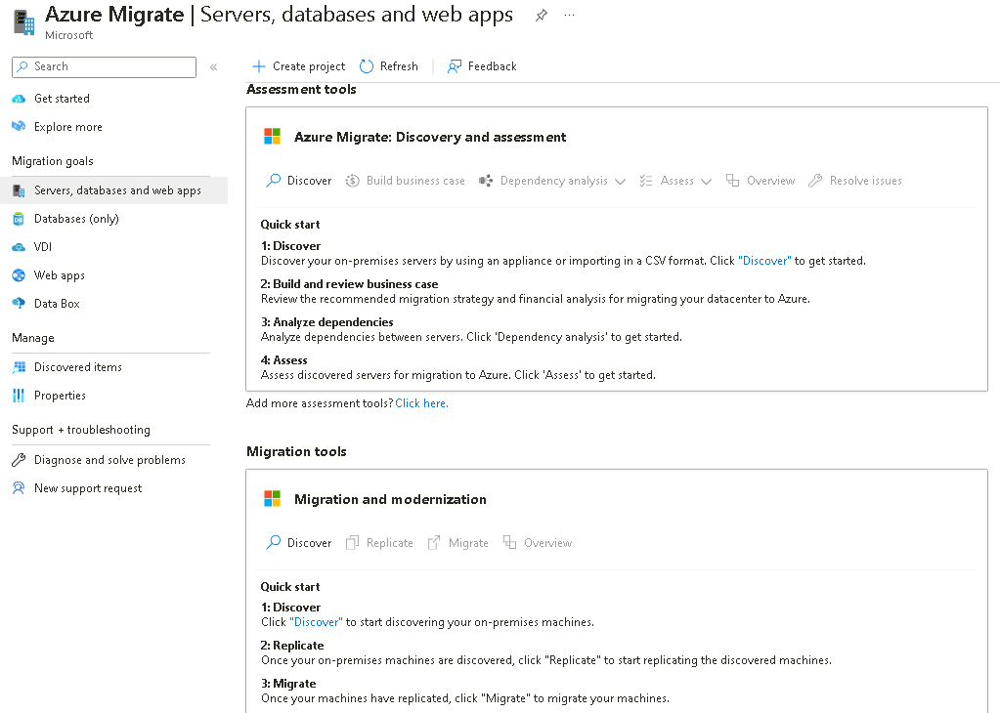

Vous avez terminé cette tâche. Ne fermez pas cet onglet pour passer à la
tâche suivante.

Dans cette tâche, vous avez créé un **projet Azure Migrate** à l'aide
des outils intégrés par défaut pour l'évaluation et la migration du
serveur.

### Tâche 2 : Déployer l'appliance Azure Migrate

Dans cette tâche, vous allez déployer et configurer l'appliance Azure
Migrate dans l'environnement Hyper-V local. Cette appliance communique
avec le serveur Hyper-V pour collecter des données de configuration et
de performances sur vos machines virtuelles locales, et retourne ces
données à votre projet Azure Migrate.

1.  Sous **Azure Migrate : Discovery and Assessment** sélectionnez
    **Discover**, puis choisissez **Using appliance**  pour ouvrir le
    panneau **Discover machines** .

- 

  Une capture d'écran d'un ordinateur Description générée
  automatiquement

2.  Sous **Are your servers virtualized?**, sélectionnez **yes, With
    Hyper-V**.

- 

  Une capture d'écran d'un ordinateur Description générée
  automatiquement

3.  Dans **1 : Generate project key** ,indiquez `SHApplXXXXXX` (en
    remplaçant **XXXXXX** par un nombre aléatoire) comme nom de
    l'appliance Azure Migrate que vous allez configurer pour la
    découverte des machines virtuelles Hyper-V. Sélectionnez **Generate
    key**  pour démarrer la création des ressources Azure requises.

- 

  Une capture d'écran d'un ordinateur Description générée
  automatiquement

  

4.  **Attendez** que la clé soit générée, puis copiez la clé **Azure
    Migrate project key**  dans votre presse-papiers et enregistrez-la
    dans le **Notepad.** Cette **Key** pour les utiliser dans d'autres
    tâches.

- 

  Une capture d'écran d'un ordinateur Description générée
  automatiquement

5.  Assurez-vous que le **. VHD file 12 GB**  est sélectionnée, puis
    cliquez avec le bouton droit de la souris sur le bouton **Download**
    et sélectionnez l' option **Copy link** .

- 

6.  Copiez le lien dans le bloc-notes pour l'utiliser ultérieurement
    pour télécharger l'appliance Azure Migrate.

- 

  Une description en noir et blanc générée automatiquement

7.  Dans un onglet de navigateur distinct, accédez au **Azure portal**.
    Dans la zone de recherche globale, entrez `SmartHotelHost, ` puis
    sélectionnez la machine virtuelle **SmartHotelHost**.

- 

8.  Sélectionnez **Connect**, choisissez **Connect** dans la liste
    déroulante.

- 

  Une capture d'écran d'un ordinateur Description générée
  automatiquement

9.  Sélectionnez **Download RDP File**.

- 

  Une capture d'écran d'un ordinateur Description générée
  automatiquement

10. Cliquez sur le bouton **Keep** pour la notification, puis cliquez
    sur **Open file** pour vous connecter.

- 

  Une capture d'écran d'un ordinateur Description générée
  automatiquement

11. **Connectez-vous** à la machine virtuelle à l'aide du nom
    d'utilisateur `demouser` et du mot de passe `demo!pass123`

- 

  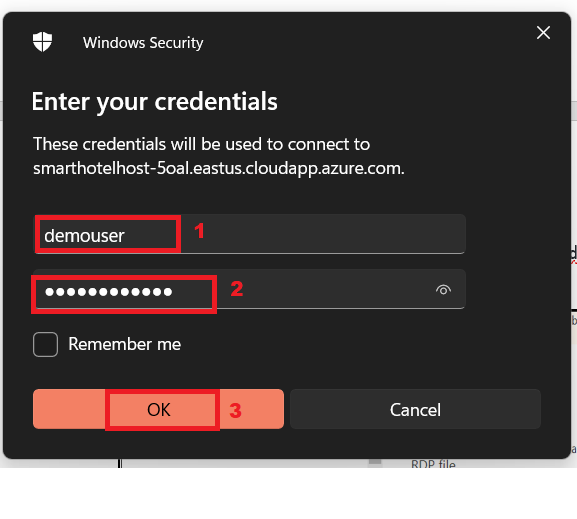

12. Sélectionnez **Yes**.

- 

13. Ouvrez le navigateur Chrome sur la machine virtuelle
    **SmartHotelHost** et collez le lien copié pour Azure Migrate
    appliance à partir du Bloc-notes, il doit commencer à télécharger le
    fichier

- 

14. Une fois le fichier téléchargé, cliquez sur le fichier téléchargé,
    choisissez l'option **Shown in folder.**

- 

  Une capture d'écran d'un ordinateur Description générée
  automatiquement

15. Double-cliquez sur le fichier zip - **AzureMigrateAppliance**

- 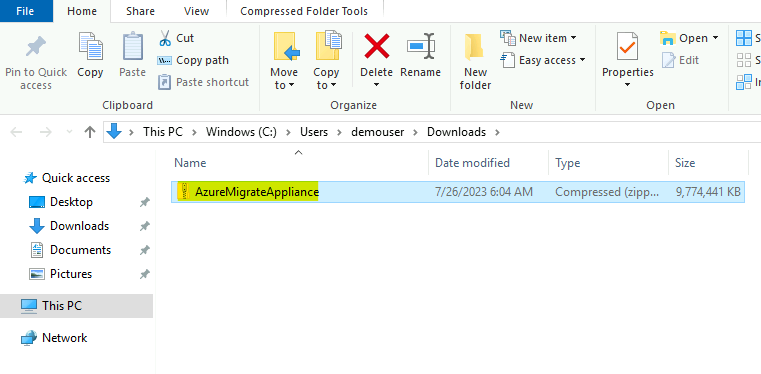

16. Une fois que le dossier **AzureMigrateAppliance** s'affiche,
    sélectionnez-le, puis cliquez sur le bouton **Extract all** puis
    fournissez le chemin d'accès au dossier sous la forme
    `F:\VirtualMachines` et cliquez sur le bouton **Extract**.

- 

17. Basculez vers la fenêtre **Server Manager** . 
    

18. Dans le Gestionnaire de serveurs, sélectionnez **Tools**, puis
    **Hyper-V Manager**  (si le Gestionnaire de serveur ne s'ouvre pas
    automatiquement, ouvrez-le en sélectionnant **Start**, puis **Server
    Manager**).

- 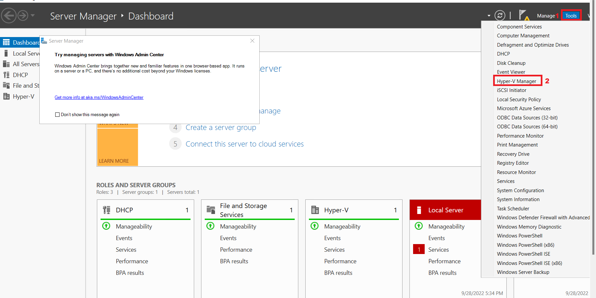

19. Dans le Gestionnaire Hyper-V, sélectionnez **SMARTHOTELHOST.** Voyez
    maintenant la liste des quatre machines virtuelles qui composent l'
    application **SmartHotel** locale .

- 

20. Dans le Hyper-V Manager, sous **Actions**, sélectionnez **Import
    Virtual Machine…** pour ouvrir l' Assistant **Import Virtual
    Machine** .

- 

21. À la première étape, **Before You Begin**, sélectionnez **Next**.

- 

22. À l' étape **Locate folder**, sélectionnez **Browse** et accédez à
    `F :``\VirtualMachines\AzureMigrateAppliance` (assurez-vous de
    sélectionner celui qui vient d'être ***extracted*** dans les étapes
    précédentes), puis choisissez **Select Folder**, puis sélectionnez
    **Next**.

- 

  Une capture d'écran d'un ordinateur Description générée
  automatiquement

23. À l'étape **Select Virtual Machine** , la machine virtuelle
    **AzureMigrateAppliance** doit déjà être sélectionnée. Sélectionnez
    **Next**.

- 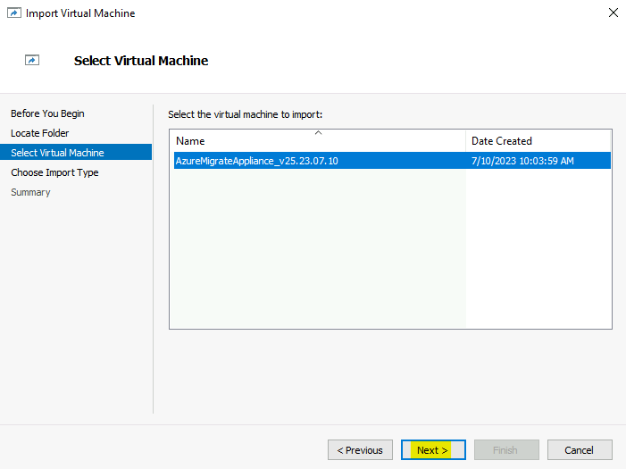

24. À l' étape **Choose Import Type** , conservez le paramètre par
    défaut **Register the virtual machine in-place**. Sélectionnez
    **Next**.

- 

  Une capture d'écran d'un ordinateur Description générée
  automatiquement

25. À l' étape **Connect Network**  vous verrez une erreur indiquant que
    le commutateur virtuel précédemment utilisé par l'appliance Azure
    Migrate est introuvable. Dans la liste déroulante **Connection**,
    sélectionnez **Azure Migrate Switch**, puis sélectionnez **Next**.

- 

  Une capture d'écran d'un ordinateur Description générée
  automatiquement

  > ***Remarque*** : Azure Migrate appliance a besoin d'accéder à
  > Internet pour charger des données sur Azure. Il a également besoin
  > d'accéder à Hyper-V host. Toutefois, il n'a pas besoin d'un accès
  > direct aux machines virtuelles d'application s'exécutant sur Hyper-V
  > host. Pour protéger l'environnement de l'application, lAzure Migrate
  > appliance doit être déployée dans un sous-réseau distinct au sein
  > d'Hyper-V, plutôt que dans le même sous-réseau que votre
  > application.

  > L'environnement Hyper-V dispose d'un réseau NAT utilisant l'espace
  > d'adressage IP 192.168.0.0/16. Le commutateur NAT interne utilisé
  > par l'application SmartHotel utilise le sous-réseau 192.168.0.0/24,
  > et chaque machine virtuelle de l'application s'est vu attribuer une
  > adresse IP statique à partir de ce sous-réseau.

  > Azure Migrate appliance sera connectée à un sous-réseau
  > 192.168.1.0/24 distinct, qui a été configuré pour vous.
  > L'utilisation du ‘Azure Migrate Switch’ connecte l'appliance à ce
  > sous-réseau. Une adresse IP est attribuée à l'appliance à partir de
  > ce sous-réseau à l'aide d'un service DHCP exécuté sur
  > SmartHotelHost.

26. Passez en revue la page de résumé, puis sélectionnez **Finish** pour
    créer la machine virtuelle d’ Azure Migrate appliance.

- 

27. Dans le Hyper-V Manager, sélectionnez la machine virtuelle
    **AzureMigrateAppliance**, puis sélectionnez **Start** à droite.

- 

Vous avez terminé cette tâche. Ne fermez pas le Hyper-V Manager pour
passer à la tâche suivante.

**Task summary**

Dans cette tâche, vous avez déployé l'appliance Azure Migrate dans
l'environnement Hyper-V local.

### Tâche 3 : Configurer l'appliance Azure Migrate

Dans cette tâche, vous allez configurer Azure Migrate appliance et
l'utiliser pour terminer la phase de découverte de l'évaluation de la
migration.

1.  Dans le Hyper-V Manager, sélectionnez la machine virtuelle
    **AzureMigrateAppliance**, Démarrer, puis sélectionnez **connect**.

- 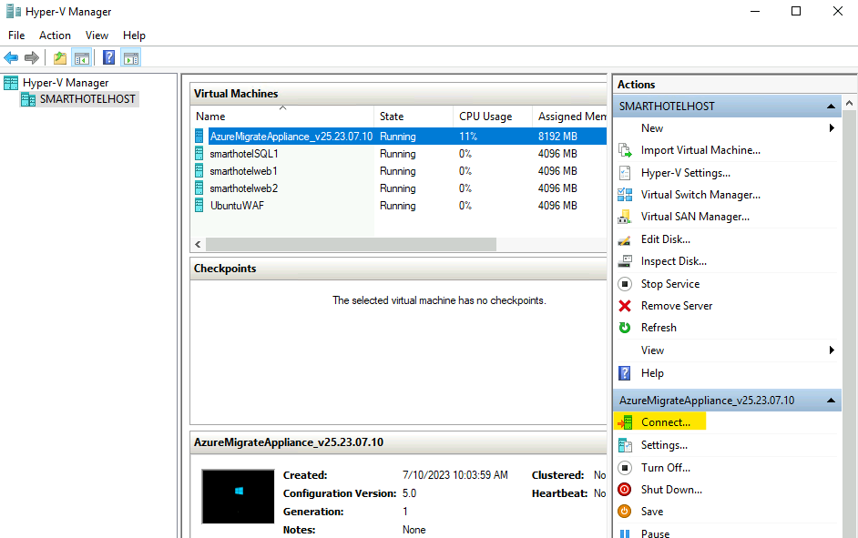

2.  Une nouvelle fenêtre s'ouvre et présente Azure Migrate appliance.
    Attendez que l'écran Termes du contrat de licence s'affiche, puis
    sélectionnez **Accept**.

- 

3.  Sur l' écran **Customize settings** , définissez le mot de passe
    administrateur sur `demo !pass``123` en tapant le mot de passe
    manuellement (deux fois). Sélectionnez ensuite **Finish**.

- > **Remarque** : Lors de la saisie du mot de passe, la machine
  > virtuelle utilise un mappage de clavier US. Si vous utilisez un
  > clavier non américain, certains caractères peuvent être saisis de
  > manière incorrecte. Sélectionnez l'icône ‘eyeball’ dans la deuxième
  > case de saisie du mot de passe pour vérifier que le mot de passe a
  > été saisi correctement.

  

4.  Au prompt **Connect to AzureMigrateAppliance** définissez la taille
    de l'écran de l'appliance à l'aide du curseur, puis sélectionnez
    **connect**.

- 

5.  Connectez-vous avec l'administrateur en tapant manuellement le mot
    de passe `demo!pass123` (l'écran de connexion peut récupérer le
    mappage de votre clavier local, utilisez l'icône 'globe oculaire'
    pour vérifier).

- 

  Interface utilisateur graphique, description du site web générée
  automatiquement

6.  **Wait.** Au bout d'une minute ou deux, le navigateur s'ouvre et
    affiche l'Assistant Configuration de Azure Migrate Appliance (il
    peut également être lancé à partir du raccourci sur le poste de
    travail).

- 

7.  À l'ouverture de l'assistant de configuration de l'appliance, une
    fenêtre contextuelle contenant les termes du contrat de licence
    s'affiche. Acceptez les conditions en sélectionnant **I agree**.

- 

  Une capture d'écran d'un ordinateur Description générée
  automatiquement

8.  Sous **Set up prerequisites**, les deux étapes suivantes pour
    vérifier la connectivité Internet et la synchronisation de l'heure
    doivent se dérouler automatiquement.

- 

  Une capture d'écran d'un ordinateur Description générée
  automatiquement

9.  Collez le **Azure Migrate project key**  copiée précédemment depuis
    le portail Azure, dans la section **Verification of Azure Migrate
    project key**, puis cliquez sur le bouton **Verify**.

- 

  Une capture d'écran d'un ordinateur Description générée
  automatiquement

  > **Remarque** : Si vous ne disposez pas de la clé, sur le portail
  > Azure, sous Azure Migrate, accédez à Évaluation du **Server
  > Assessment \> Discover \> Manage existing appliances** ,
  > sélectionnez le nom de l'appliance que vous avez fourni au moment de
  > la génération de la clé et copiez la clé correspondante.

10. Une fois **Azure Migrate project key**  est vérifiée, un processus
    de mise à jour automatique démarre.

- 

  Une capture d'écran d'un ordinateur Description générée
  automatiquement

11. Si une nouvelle mise à jour est installée, cliquez sur le bouton
    **Refresh** pour recharger la page.

- 

12. Cliquez sur **login** , une fenêtre contextuelle s'ouvrira avec un
    code.

- 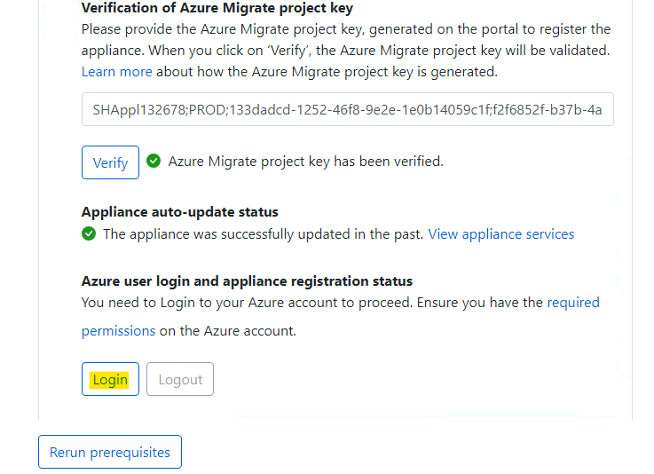

13. Une nouvelle fenêtre s'ouvrira avec un code d'appareil. Sélectionnez
    **Copy code & Login.**

- 

  Une capture d'écran d'un ordinateur Description générée
  automatiquement

14. Dans les nouvelles fenêtres du navigateur, lorsque vous y êtes
    invité, collez le **code** et sélectionnez **Next**.

- 

  Une capture d'écran d'un ordinateur Description générée
  automatiquement

15. Entrez vos informations d'identification du portail Azure, puis
    sélectionnez **Next**. Entrez **Password** et sélectionnez **Sign in
    .**

- > **Remarque –** En raison de la virtualisation imbriquée, le symbole
  > @ s'affiche sous la forme 2. Par conséquent, corrigez les
  > informations d'identification, assurez-vous également de taper le
  > mot de passe à l'aide du clavier ou vous pouvez basculer vers la
  > machine virtuelle Lab et coller le mot de passe dans un bloc-notes
  > et le copier, puis revenir à la SmartHotelVM et coller le mot de
  > passe dans la machine virtuelle de AzureMigrate appliance.

  

  Une capture d'écran d'un ordinateur Description générée
  automatiquement

  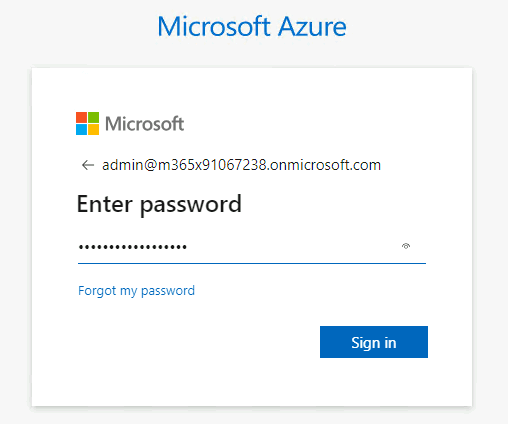

16. Sélectionnez **Continue**.

- 

  Une capture d'écran d'une erreur informatique Description générée
  automatiquement

  

17. Revenez à l' onglet **Azure Migrate Appliance**  et **Appliance
    registration**  démarre automatiquement.

- 

  Une capture d'écran d'un ordinateur Description générée
  automatiquement

18. Une fois l'inscription terminée, passez au panneau suivant, **Manage
    credentials and discovery sources**.

- 

  Une capture d'écran d'un ordinateur Description générée
  automatiquement

19. Dans Gérer les informations d'identification et les sources de
    découverte sources **Step 1: Provide Hyper-V host credentials**,
    sélectionnez **Add credentials.**

- 

  Une capture d'écran d'un ordinateur Description générée
  automatiquement

20. Entrez `hostlogin` en tant que **Friendly name**,nom d'utilisateur
    `demouser`` `et tapez manuellement le mot de passe `demo!pass123`
    pour the Hyper-V host/cluster que l'appliance utilisera pour
    détecter les machines virtuelles. Sélectionnez **Save**.

- 

  Une capture d'écran d'un ordinateur Description générée
  automatiquement

  > **Remarque** : Il se peut que Azure Migrate appliance n'ait pas
  > récupéré le mappage de votre clavier local. Sélectionnez le
  > ‘eyeball’ dans la case du mot de passe pour vérifier que le mot de
  > passe a été saisi correctement.

  > ***Remarque :*** Plusieurs informations d'identification sont prises
  > en charge pour la découverte des machines virtuelles Hyper-V, via le
  > bouton ‘Add more’

21. À **Step 2: Provide Hyper-V host/cluster details**. sélectionnez
    **Add discovery source**  pour spécifier l'adresse IP/le nom de
    domaine complet de l'hôte/cluster Hyper-V et le nom convivial des
    informations d'identification pour se connecter à l'hôte/cluster.

- 

  Une capture d'écran d'un ordinateur Description générée
  automatiquement

22. Sélectionnez **Add single item,**  entrez `SmartHotelHost` sous «
    Adresse IP / FQDN » et sélectionnez **hostlogin** dans la liste
    déroulante comme informations d'identification de la carte, puis
    **Save**.

- 

  Une capture d'écran d'un ordinateur Description générée
  automatiquement

  > **Remarque :** Vous pouvez **Add single item**  à la fois, soit
  > **Add multiple items**  en une seule fois. Il est également possible
  > de fournir des détails sur Hyper-V host/cluster via l'option
  > **Import CSV**.

23. L'appliance valide la connexion aux Hyper-V hosts/clusters ajoutés
    et affiche **Validation status**  dans le tableau pour chaque
    host/cluster.

- 

  **Remarque :** Lors de l'ajout de sources de découverte :
  - Pour les host/clusters validés avec succès, vous pouvez afficher
    plus de détails en sélectionnant leur IP address/FQDN
  - Si la validation échoue pour un host, vérifiez l'erreur en
    sélectionnant Échec de la validation dans la colonne État de la
    table. Résolvez le problème et validez à nouveau.
  - Pour supprimer des hôtes ou des clusters, sélectionnez **Delete**.
  - Vous ne pouvez pas supprimer un hôte spécifique d'un cluster. Vous
    pouvez uniquement supprimer l'intégralité du cluster.
  - Vous pouvez ajouter un cluster, même s'il existe des problèmes avec
    des hôtes spécifiques dans le cluster.

24. Assurez-vous que le commutateur est activé, puis cliquez sur **Add
    credentials**

- 

  Une capture d'écran d'une erreur informatique Description générée
  automatiquement

25. Dans la fenêtre contextuelle Ajouter des informations
    d'identification, fournissez les détails, puis cliquez sur le bouton
    **Save**.

    - Type d'informations d'identification – **Windows (Non-domain)**

    - Nom convivial – `WindowsVM`

    - Nom d'utilisateur – `.\Administrator`

    - Mot de passe – tapez manuellement `demo!pass123`

- 

  Une capture d'écran d'un ordinateur Description générée
  automatiquement

26. Fermez la notification.

- 

  Une capture d'écran d'un ordinateur Description générée
  automatiquement

27. Cliquez à nouveau sur **Add credentials**  et sur la fenêtre
    contextuelle Ajouter des informations d'identification pour fournir
    les détails, puis cliquez sur le bouton **Save**.

    - Type d'informations d'identification – **Linux (hors domaine)**

    - Nom convivial – `LinuxVM`

    - Nom d'utilisateur – `.\demouser`

    - Mot de passe – tapez manuellement `demo!pass123`

- 

  Une capture d'écran d'un ordinateur Description générée
  automatiquement

28. Fermez la notification.

- 

  Une capture d'écran d'un ordinateur Description générée
  automatiquement

29. Faites défiler vers le bas, puis cliquez sur le bouton **Start
    Discovery** .

- 

  Une capture d'écran d'un ordinateur Description générée
  automatiquement

  

  Une capture d'écran d'un ordinateur Description générée
  automatiquement

30. Attendez que l'état Azure Migrate indique que  **Discovery has been
    successfully initiated**. Cela prendra 10 à 13 minutes. Une fois la
    détection lancée, vous pouvez vérifier l'état de la découverte par
    rapport à chaque hôte/cluster du tableau.

- 

  Une capture d'écran d'un ordinateur Description générée
  automatiquement

31. Revenez à Lab VM, ouvrez le navigateur Edge, accédez au portail
    Azure `https://portal.azure.com` connectez-vous avec vos
    informations d'identification de locataire Office 365, puis revenez
    à le Panneau **Azure Migrate** .

- 

  Interface utilisateur graphique, texte, application, e-mail
  Description générée automatiquement

32. Sélectionnez **Servers, databases and web apps** **,** puis
    **Refresh**.

- 

  Une capture d'écran d'un ordinateur Description générée
  automatiquement

  

33. Sous **Azure Migrate : évaluation des serveurs**, vous devez voir le
    nombre de serveurs découverts à ce jour. Si la découverte est
    toujours en cours, sélectionnez **Actualiser** régulièrement jusqu'à
    ce que **5** serveurs découverts s'affichent. Cela peut prendre
    plusieurs minutes.

- 

  Une capture d'écran d'un ordinateur Description générée
  automatiquement

**Important : Attendez la fin du processus de découverte avant de passer
à la tâche suivante**.

Vous avez terminé cette tâche, ne fermez pas cet onglet pour passer à la
tâche suivante.

**Résumé de la tâche**

Dans cette tâche, vous avez configuré l'appliance Azure Migrate dans
l'environnement Hyper-V local et démarré le processus de découverte de
l'évaluation de la migration.

### Tâche 4 : Importer l'inventaire des serveurs à l'aide d'un fichier CSV

Vous pouvez également importer un inventaire de l'environnement, de sa
configuration et de son utilisation à l'aide d'un fichier CSV. Les
propriétés du fichier CSV sont les suivantes :

- **Server name** – nom de l'ordinateur

- **IP Addresses** – liste d'adresses IPv4 et IPv6 utilisées par la
  machine séparées par des points-virgules

- **Cores** : nombre de vCPU utilisés

- **Memory** – quantité de mémoire en MB

- **OS Details**

  - **Name** – type de système d'exploitation

  - **Version** – version du système d'exploitation utilisé

  - **Architecture** – architecture (comme x64/x86)

- **CPU Utilisation** – pourcentage du processeur utilisé

- **Memory Utilization** – pourcentage de pic d'utilisation du
  processeur

- **Network**

  - Nombre d'adaptateurs : nombre de cartes réseau connectées à la
    machine

  - Débit d'entrée : quantité de débit en Mbps dans le système

  - Débit de sortie : quantité de débit en Mbits/s sortant du système

- **Boot type** - type de démarrage utilisé par les systèmes (UEFI/BIOS)

- **Disks**

  - **Number of disks** : nombre de disques attachés au disque

  - **Per disk size** – taille du disque en GB

  - **Per disk reads (Bytes)**: quantité de Mo par seconde lue sur
    chaque disque

  - **Per disk writes (Bytes)**  : quantité de Mo par seconde écrite sur
    chaque disque

  - **Per disk reads (IOPS)**  : nombre d'opérations de sortie du disque
    par seconde

  - **Per disk writes (IOPS)** : nombre d'opérations d'entrée sur le
    disque par seconde

Une fois le fichier CSV renseigné, vous pouvez importer les systèmes
dans la phase d'évaluation Migrate en procédant comme suit :

1.  Dans le panneau **Azure Migrate**, sous Objectifs de migration,
    assurez-vous que l' option **Servers, databases and web app** est
    sélectionnée, sélectionnez le **bouton Discover**, puis choisissez
    **Using import**.

- 

  Une capture d'écran d'un ordinateur Description générée
  automatiquement

2.  Chargez le fichier CSV nommé **Azure Migrate import template.csv** à
    partir de `C:\Labfiles`, puis sélectionnez **Import** pour lire le
    fichier.

- 

  Une capture d'écran d'un ordinateur Description générée
  automatiquement

3.  L'importation doit commencer à traiter les enregistrements de
    fichiers.

- 

  Une capture d'écran d'un ordinateur Description générée
  automatiquement

4.  Vous devriez recevoir la notification comme indiqué dans l'image
    ci-dessous

- 

  Gros plan d'un numéro Description générée automatiquement

5.  Dans les détails de l'importation, nous pouvons voir que **40
    Records**  ont été insérés avec succès.

- 

6.  Fermez le panneau Découverte, puis cliquez sur le bouton
    **Refresh**.

- 

  Une capture d'écran d'un ordinateur Description générée
  automatiquement

7.  Vous devriez voir que la liste des serveurs découverts est mise à
    jour.

    - **Serveurs découverts – 45**

- 

  Une capture d'écran d'un ordinateur Description générée
  automatiquement

8.  Cliquez sur **Discovered items**, puis sélectionnez l' onglet
    **Import based** , vous devriez pouvoir voir le détail des 40
    serveurs importés. Assurez-vous de sélectionner le projet dans le
    menu déroulant.

- 

  Une capture d'écran d'un ordinateur Description générée
  automatiquement

Vous avez terminé cette tâche, ne fermez pas cet onglet pour passer à la
tâche suivante.

### Tâche 5 : Élaborer des analyses de rentabilisation pour l'estimation des coûts.

Dans cette tâche, nous allons utiliser Azure Migrate pour générer une
analyse de rentabilité à l'aide des données collectées lors de la phase
de découverte à partir de Azure Migrate appliance et de la liste des
serveurs importés.

La fonctionnalité d'analyse de rentabilité vous aide à élaborer une
proposition commerciale pour comprendre comment Azure peut apporter le
plus de valeur à votre entreprise. Il met en évidence :

- Coût de possession local et coût total de possession Azure.

- Analyse des flux de trésorerie d'une année sur l'autre.

- Des informations basées sur l'utilisation des ressources pour
  identifier les serveurs et les charges de travail idéaux pour le
  cloud.

- Des gains rapides pour la migration et la modernisation, y compris la
  fin du support des versions du système d'exploitation Windows et de
  SQL.

- Des économies à long terme en passant d'un modèle de dépenses
  d'investissement à un modèle de dépenses d'exploitation, en ne payant
  que ce que vous utilisez.

- Permet d'éliminer les conjectures dans votre processus de
  planification des coûts et d'ajouter des informations sur les données,
  des calculs basés sur des informations.

- Il peut être généré en quelques clics après avoir effectué la
  découverte à l'aide de Azure Migrate Appliance.

- La fonctionnalité est automatiquement activée pour les projets Azure
  Migrate existants.

1.  Cliquez sur **Servers, databases and web apps**  sous Objectif de
    migration, puis sur le bouton selectionnez **Build business case** .

- 

  Une capture d'écran d'un ordinateur Description générée
  automatiquement

2.  Sur la page **Build business case (Preview)** fournissez les détails
    ci-dessous, puis cliquez sur le bouton Générer une **analyse de
    rentabilité**.

    - Nom de l'étude de cas - `BCase1 à partir d'un fichier CSV importé`

    - Emplacement cible - **West us**

    - Source de découverte – **Build a quick business case using the
      servers imported via a .CSV file.**

    - Options d'économies – **Reserved instance + Azure Saving Plan**

    - Réduction ( %) sur le paiement à l'utilisation - **0**

- 

  Une capture d'écran d'un ordinateur Description générée
  automatiquement

3.  Nous devrions recevoir la notification comme indiqué ci-dessous

- 

  Une capture d'écran d'un ordinateur Description générée
  automatiquement

4.  Après quelques minutes, cliquez sur le bouton Actualiser

- 

5.  Une fois les hypothèses calculées, la page devrait apparaître comme
    ci-dessous

- 

  Une capture d'écran d'un ordinateur Description générée
  automatiquement

6.  Passez en revue les détails sous le **TCO comparison**  et cliquez
    sur le lien **View Details** .

- 

7.  Il ouvrira les rapports d'analyse de rentabilité – **On-premises vs
    Azure** qui doivent vous montrer le **Estimated annual cost by
    category**.

- 

8.  Faites défiler vers le bas pour voir les détails du **Total cost of
    ownership** 

- 

9.  De retour sur la page Vue d'ensemble de l'analyse de rentabilité,
    passez en revue le **YoY estimated current vs future state
    cost** et **Savings with Azure Hybrid Benefit**

- 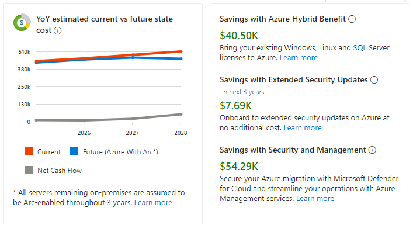

  > **Remarque** : comme vous envisagez de migrer vers Azure par phases,
  > ce graphique linéaire affiche votre flux de trésorerie par an en
  > fonction de la migration estimée effectuée cette année-là. Par
  > défaut, il est supposé que vous migrerez 0 % l'année en cours, 20 %
  > l'année 1, 50 % l'année 2 et 100 % l'année 3. Le coût actuel indique
  > comment votre flux de trésorerie net sera disponible localement ,
  > étant donné que votre infrastructure croît de 5 % par an. Le coût de
  > l'état futur indique comment sera votre flux de trésorerie net
  > lorsque vous migrerez un certain pourcentage vers Azure par an,
  > comme dans les hypothèses de ‘Azure cost’, alors que votre
  > infrastructure croît de 5 % par an.

  > **Remarque** : **Azure Hybrid Benefit** est un avantage de licence
  > qui vous permet de réduire considérablement les coûts d'exécution de
  > vos charges de travail dans le cloud. Il fonctionne en vous
  > permettant d'utiliser vos licences Windows Server et SQL Server
  > locales activées par Software Assurance sur Azure.

10. Passez en revue les informations fournies dans la section Insights
    Discovery

    - **Serveur Total – Distribution**

    - **Distribution du système d'exploitation**

- 

  Une capture d'écran d'un ordinateur Description générée
  automatiquement

11. Cliquez sur **Azure** **IaaS**, passez en revue l' onglet **Azure**
    qui fournit des informations sur les serveurs **Ready for
    migration** ,ainsi que **IaaS cost estimate**  pour ceux-ci et les
    **Saving with Azure Hybrid Benefit.**

- 

12. Faites défiler vers le bas pour plus de détails sur

    - **Estimation du coût par option d'économie**

    - **Famille de machines virtuelles et type de stockage recommandés**

    - **Coût local par rapport au coût Azure**

- 

13. Faites défiler vers le haut et cliquez sur l' onglet
    **On-premises** , il affichera **On-premises cost estimate**

- 

14. Faites défiler vers le bas et vérifiez que la section Analyse du
    serveur affiche

    - **Répartition par système d'exploitation**

    - **Distribution par virtualisation**

    - **Répartition par catégorie**

- 

15. Cliquez sur le lien **View details**  sous Fin de support, il
    répertorie tous les serveurs pris en compte dans l'analyse de
    rentabilité avec**recommended targets, activity
    state** et **qualifying offers in Azure**

- 

16. Fermez le panneau Détails, puis cliquez sur **Azure cost** sous
    Hypothèses.

- 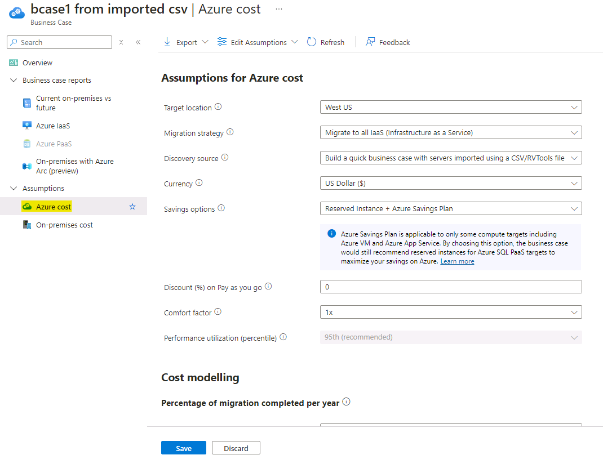

17. Ici, vous pouvez modifier les **Assumptions for Azure
    cost** et **Cost modelling**  puis cliquer sur **Sava** pour
    réévaluer l'analyse de rentabilité.

18. Cliquez sur **On-premises cost**, dans l' onglet **Compute**  pour
    lequel vous avez les paramètres

    - **Software - SQL Server licensing**

    - **Software - Windows server licensing**

    - **Virtualization software – Hyper-V**

    - **Virtualization software – VMware**

- 

  Une capture d'écran d'un ordinateur Description générée
  automatiquement

19. Cliquez sur l' onglet **Storage** pour vérifier les paramètres

- 

  Une capture d'écran d'un ordinateur Description générée
  automatiquement

20. Cliquez sur l' onglet **Réseau** pour vérifier les paramètres

- 

  Une capture d'écran d'un ordinateur Description générée
  automatiquement

21. Cliquez sur l' onglet **Security** pour vérifier les paramètres

- 

  Une capture d'écran d'un ordinateur Description générée
  automatiquement

22. Cliquez sur l' onglet **Management** pour vérifier les paramètres
    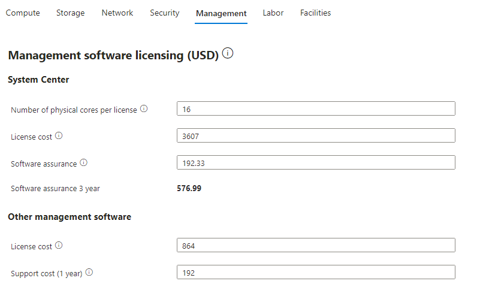

23. Cliquez sur l' onglet **Labor** pour vérifier les paramètres

- 

  Une capture d'écran d'un ordinateur Description générée
  automatiquement

24. Cliquez sur l' onglet **Facilities** pour vérifier les paramètres

- 

  Une capture d'écran d'un ordinateur Description générée
  automatiquement

25. Le coût local approprié peut être estimé en apportant des
    modifications à ces paramètres, puis en cliquant sur le bouton
    Enregistrer pour réévaluer le coût sur site.

26. Nous allons maintenant créer une autre analyse de rentabilité pour
    les serveurs découverts à l'aide de Azure Migrate appliance.

27. Dans la page Azure Migrate, cliquez sur Serveurs, bases de données
    et applications web, puis sur **Build Business case**

- 

  Une capture d'écran d'un ordinateur Description générée
  automatiquement

28. Sur la page **Build business case (Preview)** fournissez les détails
    ci-dessous, puis cliquez sur le bouton **Build business case** .

    - Nom de l'étude de cas - `BCase2 Migrate Appliance`

    - Emplacement cible – **West us**

    - Source de découverte : **utilisez des informations de données plus
      précises collectées via l'appliance Azure Migrate.**

    - Stratégie de migration - **Approche recommandée par Azure pour
      réduire les coûts**

    - Options d'économies – **Instance réservée + Plan d'épargne Azure**

    - Réduction ( %) sur le paiement à l'utilisation - **0**

- 

  Une capture d'écran d'un ordinateur Description générée
  automatiquement

29. Nous devrions recevoir la notification comme indiqué ci-dessous

- 

30. Après quelques minutes, cliquez sur le bouton Actualiser

- 

  Une capture d'écran d'un ordinateur Description générée
  automatiquement

31. Une fois les hypothèses calculées, la page devrait apparaître comme
    ci-dessous

- 

  Une capture d'écran d'un ordinateur Description générée
  automatiquement

32. À l'instar de l'analyse de rentabilité créée pour les serveurs
    importés, vous pouvez consulter les détails de cette analyse de
    rentabilité pour les zones ci-dessous.

    - **TCO comparison**

    - **Discovery insights**

    - Rapports d'analyse de rentabilité

      - **On-premises vs Azure**

      - **Azure IaaS**

    - Hypothèses

      - **Azure cost**

      - **On-premises cost**

33. Une fois l'analyse de rentabilité de **BCase2 Migrate Appliance** 
    examinée, de retour sur la page Azure Migrate, cliquez sur le bouton
    **Overview**  sous **Servers, databases and web apps.**

- 

  Une capture d'écran d'un ordinateur Description générée
  automatiquement

34. Cliquez sur **Business cases**  sous Gérer.

- 

  Une capture d'écran d'un ordinateur Description générée
  automatiquement

35. Nous devrions être en mesure de voir les 2 Business cases créés à
    partir de différentes sources Discovery.

    - Importation

    - Appareil

- 

  Une capture d'écran d'un ordinateur Description générée
  automatiquement

### Tâche 6 : Créer une évaluation de la migration

Dans cette tâche, vous allez utiliser Azure Migrate pour créer une
évaluation de migration pour l' application **SmartHotel**, à l'aide des
données collectées lors de la phase de découverte.

1.  Dans Azure Migrate, sélectionnez **Assess -\> Azure VM**  sous
    **Azure Migrate: Discovery and assessment**  pour démarrer une
    nouvelle évaluation de migration.

- 

  Une capture d'écran d'un ordinateur Description générée
  automatiquement

2.  Dans le panneau **Create Assessment Basics**  de l'évaluation,
    fournissez les détails ci-dessous

    - Type d'évaluation - **Azure VM**

    - Source de découverte : **Servers discovered from Azure Migrate
      Appliance**.

    - Sous Paramètres d'évaluation, cliquez sur le lien **Edit**

- 

  Une capture d'écran d'un ordinateur Description générée
  automatiquement

3.  Le **Assessment settings**  d'évaluation permet de personnaliser de
    nombreux paramètres utilisés lors de la création d'un rapport
    d'évaluation de migration. Prenez quelques instants pour explorer le
    large éventail de propriétés d'évaluation.

4.  Effectuez ensuite les modifications ci-dessous et cliquez sur le
    bouton **Save** .

    - Emplacement cible : **West us** (région dans laquelle les cœurs de
      processeur virtuel d'abonnement ont été augmentés)

    - Options d'économie – **3 Years reserved**

    - Utilisation en centile – **99^(th)**

    - Série VM – **Select All**

- 

  Une capture d'écran d'un ordinateur Description générée
  automatiquement

**Remarque :** Vous devez effectuer une modification pour que le bouton
**Save** soit activé ; si vous ne souhaitez pas apporter de
modifications, fermez simplement la lame.

5.  De retour dans l'onglet Notions de base, cliquez sur le bouton
    **Next**: **Select servers to assess \>** 

- 

  Une capture d'écran d'un ordinateur Description générée
  automatiquement

6.  Entrez **Assessment name** comme `SmartHotelAssessment`. Choisissez
    **Create New**  et entrez le nom de groupe `SmartHotel VMs`.
    Sélectionnez les **smarthotelweb1**, **smarthotelweb2**  et
    **UbuntuWAF**, puis sélectionnez le bouton **Review+ Create
    assessment** .

- 

  > **Remarque** : Il n'est pas nécessaire d'inclure les machines
  > virtuelles smarthotelSQL1 ou AzureMigrateAppliance dans
  > l'évaluation, car elles ne seront pas migrées vers Azure. (SQL
  > Server sera migré vers le service SQL Database et Azure Migrate
  > compliance est uniquement utilisée pour l'évaluation de la
  > migration.)

7.  Sélectionnez **Create assessment**.

- 

  Une capture d'écran d'un ordinateur Description générée
  automatiquement

8.  Dans le panneau **Azure Migrate - Servers, databases and web apps** 
    sélectionnez **Refresh** régulièrement jusqu'à ce que le nombre
    d'évaluations affiché soit 1. Cela peut prendre 5 à 6 minutes.

9.  Sur la page Azure Migrate Server, bases de données et application
    web, sous Évaluation, sélectionnez 1.

- 

  Une capture d'écran d'un ordinateur Description générée
  automatiquement

10. Cliquez sur **SmartHotelAssessment** dans la liste.

- 

  Une capture d'écran d'un ordinateur Description générée
  automatiquement

11. Prenez un moment pour étudier la vue d'ensemble de l'évaluation.

- 

  Une capture d'écran d'un ordinateur Description générée
  automatiquement

12. Sélectionnez **Settings**.

- 

  Une capture d'écran d'un ordinateur Description générée
  automatiquement

13. Dans les paramètres d'évaluation, modifiez les éléments ci-dessous,
    puis cliquez sur le bouton **Save**.

    - Historique des performances – **1 semaine**

    - Utilisation en centile – **95^(th)**

- 

  Une capture d'écran d'un ordinateur Description générée
  automatiquement

14. Après quelques instants, le rapport d'évaluation sera mis à jour
    pour refléter vos modifications.

- 

  Une capture d'écran d'un écran d'ordinateur Description générée
  automatiquement

15. **Comparaison** comme indiqué dans l'image ci-dessous.

- 

16. Sélectionnez **Azure readiness**  (sur le graphique ou dans le volet
    de navigation de gauche). Notez que pour la machine virtuelle
    **UbuntuWAF**, une préoccupation spécifique est répertoriée
    concernant la préparation de la machine virtuelle pour la migration.

- 

  Une capture d'écran d'un ordinateur Description générée
  automatiquement

  > Prenez quelques minutes pour explorer d'autres aspects de
  > l'évaluation de la migration.

  > **Remarque** : Le processus de collecte d'informations sur les
  > environnements de système d'exploitation (OSE) et de migration des
  > données des machines virtuelles entre les environnements prend un
  > certain temps en raison de la nature du transfert de données.
  > Cependant, il y a quelques étapes qui peuvent être faites pour
  > accélérer et voir comment le système fonctionne. Voici quelques
  > options :

  > Étapes courantes d'actualisation des données : (voir aussi Résoudre
  > les problèmes de découverte)

  - Les données du serveur ne sont pas mises à jour dans le portail : si
    les données des serveurs ne sont pas actualisées, il s'agit d'une
    méthode pour les accélérer.

  &nbsp;

  - Ne voyez pas les détails de l'inventaire logiciel : par défaut,
    l'inventaire logiciel n'est actualisé qu'une fois toutes les 24
    heures. Cela oblige à un rafraîchissement.

  &nbsp;

  - Erreurs d'inventaire logiciel – pendant l'inventaire, des codes
    d'erreur sont parfois renvoyés. Celle-ci répertorie tous les codes
    d'erreur et leurs significations.

  > De nombreux problèmes liés à la migration peuvent être liés au fait
  > que l'appliance n'actualise pas les données en raison de
  > planifications régulières ou que les données ne sont pas
  > transférées. Pour forcer la mise à jour des données et des
  > informations, procédez comme suit :

17. Dans la page **Servers, database and web apps**, **Azure Migrate:
    Discovery and assessment**, sélectionnez **Overview**.

- 

  Une capture d'écran d'un ordinateur Description générée
  automatiquement

18. Sous **Manage**, sélectionnez **Appliances**. Sélectionnez **Refresh
    services**.

- 

  Une capture d'écran d'un ordinateur Description générée
  automatiquement

  

  Une capture d'écran d'un ordinateur Description générée
  automatiquement

19. Attendez la fin de l'opération d'actualisation. Vous devriez
    maintenant voir des informations à jour.

- 

  Une capture d'écran d'un ordinateur Description générée
  automatiquement

Vous avez terminé cette tâche. Ne fermez pas cet onglet pour passer à la
tâche suivante.

**Résumé de la tâche :**

Dans cette tâche, vous avez créé et configuré une évaluation de
migration Azure Migrate.

### Tâche 7 : Configurer la visualisation des dépendances

Lors de la migration d'une charge de travail vers Azure, il est
important de comprendre toutes les dépendances de la charge de travail.
Une dépendance rompue peut signifier que l'application ne s'exécute pas
correctement dans Azure, peut-être de manière difficile à détecter.
Certaines dépendances, telles que celles entre les couches
d'application, sont évidentes. D'autres dépendances, telles que les
recherches DNS, la validation de ticket Kerberos ou les vérifications de
révocation de certificat, ne le sont pas.

Dans cette tâche, vous allez configurer **Azure Migrate dependency
visualization**  Pour ce faire, vous devez d'abord créer un **Log
Analytics workspace**, puis déployer des agents sur les machines
virtuelles à migrer.

1.  Toujours dans la page **Azure Migrate**, sélectionnez **Servers,
    database and web apps**. Sous **Azure Migrate: Discovery et
    assessment**  cliquez sur le lien numéro **1** sous **Groups**.

- 

  Une capture d'écran d'un écran d'ordinateur Description générée
  automatiquement

2.  Sélectionnez le groupe **SmartHotel VMs** pour afficher les détails
    du groupe.

- 

  Une capture d'écran d'un ordinateur Description générée
  automatiquement

  Notez que chaque machine virtuelle a son statut **Dependencies** comme
  **Requires agent installation**. Sélectionnez **Requires agent
  installation** Pour le  **smarthotelweb1** VM.

  Une capture d'écran d'un ordinateur Description générée
  automatiquement

3.  Dans le panneau **Dependancies**, sélectionnez **agent
    installation** pour le  **smarthotelweb1** VM

- 

  Une capture d'écran d'un ordinateur Description générée
  automatiquement

4.  Créez un espace de travail Log Analytics. Utilisez
    `AzureMigrateWSXXXXXX` \[Remplacer **XXXXXX** par un nombre
    aléatoire\] comme nom de l'espace de travail. Choisissez
    l'emplacement de l'espace de travail Log Analytics dans la liste,
    puis sélectionnez **Configure**.

5.  Attendez que l'espace de travail soit déployé. Notez **Workspace
    ID**  et la **clé Workspace Key**  dans le Bloc-notes.

- 

  Une capture d'écran d'un ordinateur Description générée
  automatiquement

6.  Cliquez avec le bouton droit de la souris et copiez l'adresse du
    lien de chacune des **4 agent download URLs** puis collez-les à côté
    de **Workspace ID and key**  que vous avez notés dans **notepad**  à
    l'étape 9 précédente.

- 

  Une capture d'écran d'un ordinateur Description générée
  automatiquement

  > **Remarque** : Vous pouvez envoyer ces liens par e-mail à votre
  > compte de test et l'ouvrir dans VM.

7.  Revenez à la session RDP de **SmartHotelHost** si vous êtes invité à
    vous connecter à l'aide des informations d'identification.

    - Nom d'utilisateur - `demouser`

    - Mot de passe - `demo!pass123`

8.  Dans **le Hyper-V Manager**, sélectionnez **smarthotelweb1** et
    sélectionnez **Connect**.

- 

  Une capture d'écran d'un ordinateur Description générée
  automatiquement

9.  Sélectionnez à nouveau **connect** lorsque vous y êtes invité et
    connectez-vous au compte **administrator** en tapant le mot de passe
    `demo!pass123`

- 

  Interface utilisateur graphique, application Description générée
  automatiquement

  

10. Ouvrez **Internet Explorer**

- 

11. Collez le lien vers **4-bit Microsoft Monitoring Agent for
    Windows**  que vous avez enregistré précédemment, puis cliquez sur
    le bouton **Run** lorsque vous y êtes invité .

- 

  Une capture d'écran d'une erreur informatique Description générée
  automatiquement

  > **Remarque :** Vous devrez peut-être désactiver la **configuration
  > de la sécurité renforcée d'Internet Explorer** sur le **Gestionnaire
  > de serveur** sous **Serveur local** pour terminer le téléchargement.

12. Dans le programme d'installation de Microsoft Monitoring Agent,
    cliquez sur **Next**, puis sur **I agree.**

13. Poursuivez avec les sélections par défaut jusqu'à la page **Agent
    Setup Options** . À partir de là, sélectionnez **Connect the agent
    to Azure Log Analytics (OMS)** puis sélectionnez **Next**.

- 

  Une capture d'écran d'un ordinateur Description générée
  automatiquement

14. Entrez l'ID d'espace de travail et la clé d'espace de travail que
    vous avez copiés précédemment, puis sélectionnez **Azure
    Commercial** dans la liste déroulante Cloud Azure. Sélectionnez
    **Next**, parcourez les pages restantes et **install** l'agent.

- 

  Une capture d'écran d'un ordinateur Description générée
  automatiquement

15. Continuez le reste de la configuration avec les options par défaut,
    puis cliquez sur **Finish**

- 

  Une capture d'écran d'un ordinateur Description générée
  automatiquement

16. Collez le lien vers le **Dependency Agent Windows installer**  dans
    la barre d'adresse du navigateur. **Run** le programme
    d'installation et sélectionnez-le dans l'assistant d'installation
    pour terminer l'installation.

- 

  Une capture d'écran d'un ordinateur Description générée
  automatiquement

  > **Remarque :** Vous n'avez pas besoin de configurer l'ID et la clé
  > de l'espace de travail lors de l'installation de l'agent de
  > dépendances, car il utilise les mêmes paramètres que l'agent de
  > surveillance Microsoft, qui doit être installé au préalable.

  

17. Fermez la fenêtre de connexion de la machine virtuelle pour la
    machine virtuelle **smarthotelweb1.**

18. Dans **Hyper-V Manager**, sélectionnez **smarthotelweb2** et
    sélectionnez **Connect**.

- 

19. Sélectionnez à nouveau **connect** lorsque vous y êtes invité et
    connectez-vous au **compte administrateur** en tapant le mot de
    passe `demo!pass123`

- 

  Interface utilisateur graphique, application Description générée
  automatiquement

  

20. Ouvrez **Internet Explorer** et, comme vous l'avez noté
    précédemment. Lorsque vous y êtes invité, **Run** le programme
    d'installation.

- 

21. Fermez la fenêtre de connexion de la machine virtuelle pour la VM
    **smarthotelweb2**.

22. Collez le lien vers **64-bit Microsoft Monitoring Agent for
    Windows**  que vous avez enregistré précédemment, puis cliquez sur
    le bouton **Run** lorsque vous y êtes invité .

- 

  Une capture d'écran d'une erreur informatique Description générée
  automatiquement

  > **Remarque :** Vous devrez peut-être désactiver l’ **Internet
  > Explorer Enhanced Security Configuration**  sur le **Server
  > manager** sous **local server** pour terminer le téléchargement.

23. Dans le programme d'installation de Microsoft Monitoring Agent,
    cliquez sur **Next**, puis sur **agree.**

24. Poursuivez avec les sélections par défaut jusqu'à la page **Agent
    Setup Options** . À partir de là, sélectionnez **Connect the agent
    to Azure Log Analytics (OMS)** **,** puis sélectionnez **Next**.

- 

  Une capture d'écran d'un ordinateur Description générée
  automatiquement

25. Entrez l'ID d'espace de travail et la clé d'espace de travail que
    vous avez copiés précédemment, puis sélectionnez **Azure
    Commercial** dans la liste déroulante Azure Cloud. Sélectionnez
    **Next**, parcourez les pages restantes et **install** l'agent.

- 

  Une capture d'écran d'un ordinateur Description générée
  automatiquement

26. Continuez le reste de la configuration avec les options par défaut,
    puis cliquez sur **Finish**

- 

  Une capture d'écran d'un ordinateur Description générée
  automatiquement

27. Collez le lien vers le **Dependency Agent Windows installer**  dans
    la barre d'adresse du navigateur. **Run** le programme
    d'installation et sélectionnez-le dans l'assistant d'installation
    pour terminer l'installation.

- 

  Une capture d'écran d'un ordinateur Description générée
  automatiquement

  > **Remarque :** Vous n'avez pas besoin de configurer l'ID et la clé
  > de l'espace de travail lors de l'installation de l'agent de
  > dépendances, car il utilise les mêmes paramètres que l'agent de
  > surveillance Microsoft, qui doit être installé au préalable.

  

  > Vous allez maintenant **deploy** le  **Linux versions of the
  > Microsoft Monitoring Agent**  **et** de **l'**agent de dépendance
  > sur la machine virtuelle **UbuntuWAF**. Pour ce faire, vous allez
  > d'abord vous connecter à l'**UbuntuWAF** à distance à l'aide d'une
  > **SSH session**.

28. Revenez à la session RDP avec le **SmartHotelHost** et ouvrez un
    prompt de commande à l'aide du raccourci sur le bureau.

- 

  Une capture d'écran d'un ordinateur Description générée
  automatiquement

  > **Remarque** : Le **SmartHotelHost** exécute Windows Server 2019
  > avec le sous-système Windows pour Linux activé. Cela permet
  > d'utiliser l'a commande prompt en tant que client SSH. Pour plus
  > d'informations sur Linux pris en charge sur Azure, cliquez ici :
  > `https://Azure.com/Linux`

29. Entrez la commande suivante pour vous connecter à la machine
    virtuelle **UbuntuWAF** s'exécutant dans Hyper-V sur le
    SmartHotelHost Utilisez la commande suivante

- `SSH demouser@192.168.0.8`

30. Entrez **‘yes’**  lorsque vous êtes invité à vous connecter ou non.
    Utilisez le mot de passe `demo!pass123`.

- 

31. Entrez la commande suivante, suivie du mot de passe `demo!pass123`
    lorsque vous y êtes invité :

- `sudo -s`

  

  Une capture d'écran d'un ordinateur Description générée
  automatiquement

32. Cela donne à la session de terminal **elevated/root privileges**

33. Entrez la commande suivante, en remplaçant \et \par les valeurs
    copiées précédemment.

- `wget https://raw.githubusercontent.com/Microsoft/OMS-Agent-for-Linux/master/installer/scripts/onboard_agent.sh && sh onboard_agent.sh -w <ID d'espace de travail> -s <``<Workspace Key> -d opinsights.azure.com`

34. Lorsque vous y êtes invité, sélectionnez Oui, puis appuyez sur
    Entrée

- 

  

35. Les écrans d'installation doivent apparaître comme ci-dessous.

- 

  

  Une capture d'écran d'un programme d'ordinateur Description générée
  automatiquement

36. Entrez la commande suivante, en remplaçant **\< Workspace ID\>** par
    la valeur copiée précédemment

- `/opt/microsoft/omsagent/bin/service_control redémarrer <Workspace ID>`

  

37. Entrez la commande suivante pour télécharger l'agent de dépendances
    pour Linux.

- `wget --content-disposition https://aka.ms/dependencyagentlinux -O InstallDependencyAgent-Linux64.bin`

  

  Un écran d'ordinateur avec texte Description générée automatiquement

38. Installez l'agent de dépendance en exécutant la commande ci-dessous.

- `sh InstallDependencyAgent-Linux64.bin -s`

  

  Une capture d'écran d'un ordinateur Description générée
  automatiquement

39. L'installation de l'agent est maintenant terminée.

Ensuite, vous devez générer du trafic sur l'application SmartHotel afin
que la visualisation des dépendances dispose de données avec lesquelles
travailler. Naviguez jusqu'à l'adresse IP publique du SmartHotelHost et
passez quelques minutes à actualiser la page et à enregistrer les
invités à l'entrée et à la sortie.

**Résumé de la tâche**

Dans cette tâche, vous avez configuré la fonctionnalité de visualisation
des dépendances Azure Migrate en créant un espace de travail Log
Analytics et en déployant l'agent de surveillance Azure et l'agent de
dépendance sur des machines locales Windows et Linux.

### Tâche 8 : Explorer la visualisation des dépendances

Dans cette tâche, vous allez explorer la fonctionnalité de visualisation
des dépendances d'Azure Migrate. Cette fonctionnalité utilise les
données collectées par l'agent de dépendance que vous avez installé la
tâche précédente.

1.  Revenez au portail Azure avec la page **Azure Migrate** ouverte,
    sélectionnez **web Servers, database and web apps**. Sous **Azure
    Migrate: Discovery and assessment** cliquez sur le lien numéro **1**
    sous **Groups**.

- 

  Une capture d'écran d'un ordinateur Description générée
  automatiquement

2.  Sélectionnez le groupe **SmartHotel VMs** pour afficher les détails
    du groupe.

- 

  Une capture d'écran d'un ordinateur Description générée
  automatiquement

3.  Assurez-vous que l'agent de dépendance de toutes les machines
    virtuelles affiche l'état **Install**

- 

  Une capture d'écran d'un ordinateur Description générée
  automatiquement

4.  Cliquez sur **View dependencies**.

- 

  Une capture d'écran d'un ordinateur Description générée
  automatiquement

5.  Prenez quelques minutes pour explorer la vue des dépendances.
    Développez chaque serveur pour afficher les processus en cours
    d'exécution sur ce serveur. Sélectionnez un processus pour afficher
    les informations sur le processus. Identifiez les connexions
    établies par chaque serveur.

- 

  Une capture d'écran d'un ordinateur Description générée
  automatiquement

  

  Une capture d'écran d'un ordinateur Description générée
  automatiquement

**Résumé**

À la fin de l'atelier, nous devons avoir découvert et évalué les
machines virtuelles locales à l'aide de l'appliance Azure Migrate et les
métadonnées doivent être disponibles sur le projet Azure Migrate avec
les détails indiqués ci-dessous

- Évaluation des machines virtuelles

&nbsp;

- 

  Interface utilisateur graphique, application Description générée
  automatiquement

&nbsp;

- Carte des dépendances des machines virtuelles

&nbsp;

- 

  Une image contenant le graphique Description générée automatiquement
