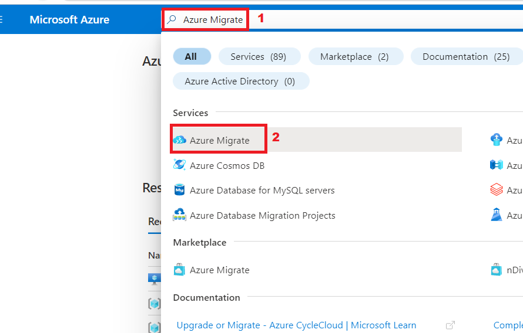
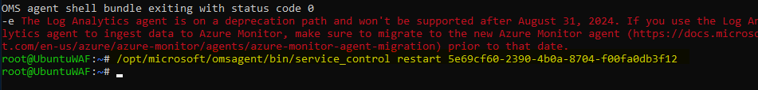

# Lab 02 - Individuazione e valutazione dell'ambiente locale.

**Obiettivo**

In questo lab verranno individuate e quindi valutate le macchine
virtuali locali usando gli strumenti di Azure Migrate e verrà creato un
repository per archiviare i data di valutazione in un progetto di
migrazione di Azure.

Installeremo anche agenti per scoprire e visualizzare la dipendenza tra
le macchine virtuali

A tale scopo, è necessario distribuire l'appliance di Azure Migrate come
macchina virtuale in SmartHotelHost, quindi eseguire le attività di
individuazione necessarie.

> **Importante**: prima di avviare questo lab, è necessario attendere
> almeno 30-40 minuti per distribuire l'ambiente locale **(Lab 1 -
> Distribuzione e verifica dell'ambiente locale e della zona di
> destinazione**).

### Attività 1: Creare il progetto Azure Migrate e aggiungere strumenti di valutazione e migrazione

In questa attività verrà creato il progetto Azure Migrate e verranno
selezionati gli strumenti di valutazione e migrazione.

> **Nota**: in questo lab si useranno gli strumenti di valutazione e
> migrazione forniti da Microsoft all'interno di Azure Migrate. Con
> Azure Migrate sono integrati anche diversi strumenti di terze parti
> per la valutazione e la migrazione. Potresti voler dedicare un po' di
> tempo all'esplorazione di queste opzioni di terze parti al di fuori di
> questo laboratorio.

1.  Tornare alla scheda di **Azure Portal** o aprire una nuova scheda e
    passare a `https://portal.azure.com` e accedere con le **Office 365
    tenant credentials**.

2.  Nella barra di ricerca digitare `Azure`` ``Migrate` e selezionare
    **Azure Migrate** per aprire il pannello **Azure Migrate Overview**,
    illustrato di seguito.

- 

  

  Uno screenshot di un computer Descrizione generata automaticamente

3.  Seleziona **Discover, assess and migrate**.

- 

  Uno screenshot di un computer Descrizione generata automaticamente

4.  Seleziona **Create project**.

- 

  Uno screenshot di un computer Descrizione generata automaticamente

5.  Selezionare la sottoscrizione appropriata e creare un nuovo gruppo
    di risorse denominato `AzureMigrateRG`

- 

6.  Immettere `SmartHotelMigration` come nome del progetto di migrazione
    e scegliere un'area geografica vicina a te per archiviare i data di
    valutazione della migrazione. Qui stiamo selezionando **United
    States**. Quindi seleziona **Create**.

- 

  

7.  Verrà avviata la distribuzione di Azure Migrate. Al termine,
    verranno visualizzati i pannelli **Azure Migrate: Discovery and
    assessment** e **Azure Migrate: Server Migration** per il progetto
    di migrazione corrente, come illustrato di seguito.

- 

L'attività è stata completata. Non chiudere questa scheda per procedere
con l'attività successiva.

In questa attività è stato creato un di **Azure Migrate project** usando
gli strumenti predefiniti per la valutazione e la migrazione del server.

### Attività 2: Distribuire l'appliance di Azure Migrate

In questa attività si distribuirà e si configurerà l'appliance Azure
Migrate nell'ambiente Hyper-V locale. Questa appliance comunica con il
server Hyper-V per raccogliere data di configurazione e prestazioni
sulle macchine virtuali locali e restituisce tali data al progetto Azure
Migrate.

1.  In **Azure Migrate: Discovery and Assessment** selezionare
    **Discover** e scegliere **Using appliance** per aprire il pannello
    **Discover machines**.

- 

  Uno screenshot di un computer Descrizione generata automaticamente

2.  Nella sezione **Are your servers virtualized?**, selezionare **Yes,
    with Hyper-V**.

- 

  Uno screenshot di un computer Descrizione generata automaticamente

3.  In **1: Generate project key,** del progetto specificare
    `SHApplXXXXXX` (sostituire **XXXXXX** con un numero casuale) come
    nome per l'appliance di Azure Migrate che verrà configurata per
    l'individuazione delle macchine virtuali Hyper-V. Selezionare
    **Generate key** per avviare la creazione delle risorse di Azure
    necessarie.

- 

  Uno screenshot di un computer Descrizione generata automaticamente

  

4.  **Wait** la generazione della chiave, quindi copiare la **Azure
    Migrate project key** negli Appunti e salvarla nel **notepad.**
    Questa **Key** per usarli in ulteriori Compiti.

- 

  Uno screenshot di un computer Descrizione generata automaticamente

5.  Assicurarsi che . Il pulsante di opzione **.VHD file 12GB** è
    selezionato, quindi fare clic con il pulsante destro del mouse sul
    pulsante **Download** e selezionare l' opzione **Copy link**.

- 

6.  Copiare il collegamento nel Blocco note da usare in un secondo
    momento per scaricare l'appliance di Azure Migrate.

- 

  Un testo in bianco e nero Descrizione generata automaticamente

7.  In una scheda del browser separata passare al **Azure portal**.
    Nella casella di ricerca globale immettere `SmartHotelHost,`quindi
    selezionare la macchina virtuale **SmartHotelHost**.

- 

8.  Seleziona **Connect**, scegli **Connect** dal menu a discesa.

- 

  Uno screenshot di un computer Descrizione generata automaticamente

9.  Selezionare **Download RDP File**.

- 

  Uno screenshot di un computer Descrizione generata automaticamente

10. Fare clic sul pulsante **Keep** per la notifica, quindi fare clic su
    **Open file** per connettersi.

- 

  Uno screenshot di un computer Descrizione generata automaticamente

11. **Connect** alla macchina virtuale utilizzando username `demouser` e
    password `demo!pass123`

- 

  

12. Seleziona **Yes**.

- 

13. Apri il browser Chrome sulla VM **SmartHotelHost** e incolla il
    collegamento copiato per l'appliance Azure Migrate dal Blocco note,
    dovrebbe iniziare a scaricare il file

- 

14. Una volta scaricato il file, fai clic sul file scaricato, scegli
    l'opzione **Shown in folder.**

- 

  Uno screenshot di un computer Descrizione generata automaticamente

15. Fare doppio clic sul file zip - **AzureMigrateAppliance**

- 

16. Una volta visualizzata la cartella **AzureMigrateAppliance**,
    selezionarla e quindi fare clic sul pulsante **Extract all**, quindi
    fornire il percorso della cartella come `F:\VirtualMachines` e fare
    clic sul pulsante **Extract**.

- 

17. Passare alla finestra **Server Manager**. 

> 

18. In Server Manager selezionare **Tools**, quindi **Hyper-V Manager**
    (se Server Manager non si apre automaticamente, aprirlo selezionando
    **Start**, quindi **Server Manager**).

- 

19. In Hyper-V Manager, seleziona **SMARTHOTELHOST.** A questo punto
    viene visualizzato un elenco delle quattro macchine virtuali che
    comprendono l' applicazione **SmartHotel** locale .

- 

20. Nella console di gestione di Hyper-V, in **Actions**, selezionare
    **Import Virtual Machine...**per aprire la procedura guidata
    **Import Virtual Machine**.

- 

21. Nel primo passaggio, **Before You Begin**, selezionare **Next**.

- 

22. Nel passaggio **Locate Folder** selezionare **Browse** e passare a
    `F:\VirtualMachines\AzureMigrateAppliance` (assicurarsi di
    selezionare quello appena ***extracted*** nei passaggi precedenti),
    quindi scegliere **Select Folder**, quindi selezionare **Next**.

- 

  Uno screenshot di un computer Descrizione generata automaticamente

23. Nel passaggio **Select Virtual Machine** dovrebbe essere già
    selezionata la macchina virtuale **AzureMigrateAppliance**.
    Seleziona **Next**.

- 

24. Nel passaggio **Choose Import Type**, mantenere l'impostazione
    predefinita **Register the virtual machine in-place**. Seleziona
    **Next**.

- 

  Uno screenshot di un computer Descrizione generata automaticamente

25. Nel passaggio **Connect Network** verrà visualizzato un errore che
    indica che non è stato possibile trovare il commutatore virtuale
    usato in precedenza dall'appliance Azure Migrate. Nell' elenco a
    discesa **Connection** selezionare il **Azure Migrate Switch** e
    quindi selezionare **Next**.

- 

  Uno screenshot di un computer Descrizione generata automaticamente

  > ***Nota***: l'appliance Azure Migrate deve accedere a Internet per
  > caricare i data in Azure. Richiede anche l'accesso all'host Hyper-V.
  > Tuttavia, non richiede l'accesso diretto alle macchine virtuali
  > dell'applicazione in esecuzione nell'host Hyper-V. Per proteggere
  > l'ambiente dell'applicazione, l'appliance Azure Migrate deve essere
  > distribuita in una subnet separata all'interno di Hyper-V, anziché
  > nella stessa subnet dell'applicazione.

  > L'ambiente Hyper-V dispone di una rete NAT che utilizza lo spazio di
  > indirizzi IP 192.168.0.0/16. Il commutatore NAT interno usato
  > dall'applicazione SmartHotel usa la subnet 192.168.0.0/24 e a ogni
  > macchina virtuale nell'applicazione è stato assegnato un indirizzo
  > IP statico da questa subnet.

  > L'appliance Azure Migrate verrà connessa a una subnet separata
  > 192.168.1.0/24, che è stata configurata automaticamente. L'uso del
  > commutatore di Azure Migrate connette l'appliance a questa subnet.
  > All'appliance viene assegnato un indirizzo IP da questa subnet
  > utilizzando un servizio DHCP in esecuzione su SmartHotelHost.

26. Esaminare la pagina di riepilogo, quindi selezionare **Finish** per
    creare la macchina virtuale dell'appliance di Azure Migrate.

- 

27. Nella console di gestione di Hyper-V selezionare la macchina
    virtuale **AzureMigrateAppliance**, quindi selezionare **Start** a
    destra.

- 

L'attività è stata completata. Non chiudere la console di gestione di
Hyper-V per procedere con l'attività successiva.

**Riepilogo delle attività**

In questa attività è stata distribuita l'appliance Azure Migrate
nell'ambiente Hyper-V locale.

### Attività 3: Configurare l'appliance di Azure Migrate

In questa attività si configurerà l'appliance di Azure Migrate e la si
userà per completare la fase di individuazione della valutazione della
migrazione.

1.  Nella console di gestione di Hyper-V selezionare la macchina
    virtuale **AzureMigrateAppliance**, Avvia e quindi selezionare
    **Connect**.

- 

2.  Verrà visualizzata una nuova finestra che mostra l'appliance Azure
    Migrate. Attendi che venga visualizzata la schermata Termini di
    licenza, quindi seleziona **Accept**.

- 

3.  Nella schermata **Customize settings**, imposta la password
    dell'amministratore su `demo!pass123` digitando manualmente la
    password (due volte). Quindi seleziona **Finish**.

- > **Nota**: Quando si immette la password, la macchina virtuale
  > utilizza una mappatura della tastiera statunitense. Se si utilizza
  > una tastiera non statunitense, alcuni caratteri potrebbero essere
  > inseriti in modo errato. Seleziona l'icona "eyeball" nella seconda
  > casella di immissione della password per verificare che la password
  > sia stata inserita correttamente.

  

4.  Al prompt **Connect to AzureMigrateAppliance** impostare le
    dimensioni dello schermo dell'appliance usando il dispositivo di
    scorrimento, quindi selezionare **Connect**.

- 

5.  Accedi con l'amministratore digitando manualmente la password
    `demo!pass123` (la schermata di accesso potrebbe rilevare la
    mappatura della tastiera locale, usa l'icona 'eyeball' per
    controllare).

- 

  Graphical user interface, sito web Descrizione generata
  automaticamente

6.  **Wait.** Dopo un minuto o due, si aprirà il browser che mostra la
    procedura guidata di configurazione dell'appliance Azure Migrate
    (può anche essere avviata dal collegamento sul desktop).

- 

7.  All'apertura della procedura guidata di configurazione
    dell'accessorio, viene visualizzato un pop-up con le condizioni di
    licenza. Accetta i termini selezionando **I agree**.

- 

  Uno screenshot di un computer Descrizione generata automaticamente

8.  In **Set up prerequisites**, i due passaggi seguenti per verificare
    la connettività Internet e la sincronizzazione dell'ora devono
    passare automaticamente.

- 

  Uno screenshot di un computer Descrizione generata automaticamente

9.  Incollare la **Azure Migrate project key** copiata dal portale Azure
    in precedenza, nella sezione **Verification of Azure Migrate project
    key**, quindi fare clic sul pulsante **Verify**.

- 

  Uno screenshot di un computer Descrizione generata automaticamente

  > **Nota**: se non si dispone della chiave, nel portale di Azure in
  > Azure Migrate passare a **Server Assessment \> Discover \> Manage
  > existing appliances**, selezionare il nome dell'appliance fornito al
  > momento della generazione della chiave e copiare la chiave
  > corrispondente.

10. Dopo aver verificato la **Azure Migrate project key**, verrà avviato
    un processo di aggiornamento automatico.

- 

  Uno screenshot di un computer Descrizione generata automaticamente

11. Se è installato un nuovo aggiornamento, fare clic sul pulsante
    **Refresh** per ricaricare la pagina.

- 

12. Clicca su **Login**, si aprirà un pop-up con un codice.

- 

13. Si aprirà una nuova finestra che mostra un codice dispositivo.
    Seleziona **Copy code & Login.**

- 

  Uno screenshot di un computer Descrizione generata automaticamente

14. Nelle nuove finestre del browser, quando richiesto, incolla il
    **Code** e seleziona **Next**.

- 

  Uno screenshot di un computer Descrizione generata automaticamente

15. Immettere le credenziali del portale di Azure e selezionare
    **Next**. Inserisci la **Password** e seleziona **Sign in.**

- > **Nota –** A causa della virtualizzazione nidificata, il simbolo @
  > verrà visualizzato come 2. Quindi correggi le credenziali,
  > assicurati anche di digitare la password utilizzando la tastiera
  > oppure puoi passare alla VM Lab e incollare la password in un blocco
  > note e copiarla, tornare alla SmartHotelVM e incollare la password
  > nella VM dell'appliance AzureMigrate.

  

  Uno screenshot di un computer Descrizione generata automaticamente

  

16. Seleziona **Continue**.

- 

  Uno screenshot di un errore del computer Descrizione generata
  automaticamente

  

17. Tornare alla scheda **Azure Migrate Appliance** e la **Appliance
    registration** verrà avviata automaticamente.

- 

  Uno screenshot di un computer Descrizione generata automaticamente

18. Una volta completata la registrazione, passare al pannello
    successivo, **Manage credentials and discovery sources**.

- 

  Uno screenshot di un computer Descrizione generata automaticamente

19. In Gestisci credenziali e origini di individuazione **Passaggio 1:
    Provide Hyper-V host credentials** selezionare **Add credentials**.

- 

  Uno screenshot di un computer Descrizione generata automaticamente

20. Immettere `hostlogin` come **Friendly name**, **Username**
    `demouser `e digitare manualmente la **password** `demo!pass123` per
    l'host/cluster Hyper-V che l'appliance utilizzerà per individuare le
    macchine virtuali. Selezionare **Save**.

- 

  Uno screenshot di un computer Descrizione generata automaticamente

  > **Nota**: l'appliance Azure Migrate potrebbe non aver rilevato il
  > mapping della tastiera locale. Seleziona il "eyeball" nella casella
  > della password per verificare che la password sia stata inserita
  > correttamente.

  > ***Nota:*** sono supportate più credenziali per l'individuazione di
  > macchine virtuali Hyper-V, tramite il pulsante "Add more".

21. In **Passaggio 2: Provide Hyper-V host/cluster details** selezionare
    **Add discovery source** per specificare l'indirizzo IP/FQDN
    dell'host/cluster Hyper-V e il nome descrittivo per le credenziali
    per la connessione all'host/cluster.

- 

  Uno screenshot di un computer Descrizione generata automaticamente

22. Seleziona **Add single item,** inserisci `SmartHotelHost` in
    "Indirizzo IP / FQDN" e seleziona **hostlogin** dal menu a discesa
    come Mappa credenziali, quindi **Save**.

- 

  Uno screenshot di un computer Descrizione generata automaticamente

  > **Nota:** puoi **Add single item** alla volta o **Add multiple
  > items** in una volta sola. È inoltre disponibile un'opzione per
  > fornire i dettagli dell'host/cluster Hyper-V tramite la importazione
  > di file **Import CSV**.

23. L'appliance convaliderà la connessione agli host/cluster Hyper-V
    aggiunti e mostrerà lo di **Validation status** nella tabella per
    ogni host/cluster.

- 

  **Nota:** quando si aggiungono origini di rilevamento:
  - Per gli host/cluster convalidata correttamente, è possibile
    visualizzare altri dettagli selezionando il relativo indirizzo
    IP/FQDN.
  - Se la convalida non riesce per un host, esaminare l'errore
    selezionando Convalida non riuscita nella colonna Stato della
    tabella. Risolvi il problema e convalida di nuovo.
  - Per rimuovere host o cluster, selezionare **Delete**.
  - Non è possibile rimuovere un host specifico da un cluster. È
    possibile rimuovere solo l'intero cluster.
  - È possibile aggiungere un cluster, anche se si verificano problemi
    con host specifici nel cluster.

24. Assicurati che l'interruttore sia abilitato, quindi fai clic su
    **Add credentials**

- 

  Uno screenshot di un errore del computer Descrizione generata
  automaticamente

25. Nel pop-up Aggiungi credenziali fornisci i dettagli e quindi fai
    clic sul pulsante **Save**.

    - Credential type- **Windows (Non-domain)**

    - Friendly name- `WindowsVM`

    - Username– `.\A``d``ministrator`

    - Password – type is manually demo`!pass123`

- 

  Uno screenshot di un computer Descrizione generata automaticamente

26. Chiudi la notifica.

- 

  Uno screenshot di un computer Descrizione generata automaticamente

27. Fare nuovamente clic su **Add credentials** e sul pop-up Aggiungi
    credenziali fornire i dettagli e quindi fare clic sul pulsante
    **Save**.

    - Credential type: **Linux (Non-domain)**

    - Friendly name – `LinuxVM`

    - Username– `.\``demouser`

    - Password – type is manually demo`!pass123`

- 

  Uno screenshot di un computer Descrizione generata automaticamente

28. Chiudi la notifica.

- 

  Uno screenshot di un computer Descrizione generata automaticamente

29. Scorri verso il basso e quindi fai clic sul pulsante **Start
    Discovery**.

- 

  Uno screenshot di un computer Descrizione generata automaticamente

  

  Uno screenshot di un computer Descrizione generata automaticamente

30. Attendere che lo stato di Azure Migrate mostri che la **Discovery
    has been successfully initiated**. Ci vorranno 10-13 minuti. Dopo
    che l'individuazione è stata avviata correttamente, è possibile
    controllare lo stato dell'individuazione rispetto a ciascun
    host/cluster nella tabella.

- 

  Uno screenshot di un computer Descrizione generata automaticamente

31. Tornare alla macchina virtuale lab, aprire il browser Edge, passare
    al https://portal.azure.com portale di Azure e accedere con le
    credenziali del tenant di Office 365 e tornare al pannello di
    **Azure** **Migrate**.

- 

  Interfaccia utente grafica, testo, applicazione, e-mail Descrizione
  generata automaticamente

32. Selezionare **Servers, databases e Web apps,** quindi selezionare
    **Refresh**.

- 

  Uno screenshot di un computer Descrizione generata automaticamente

  

33. In **Azure Migrate: Server Assessment** dovrebbe essere visualizzato
    un conteggio del numero di server individuati finora. Se
    l'individuazione è ancora in corso, selezionare **Refresh**
    periodicamente fino a quando non vengono visualizzati **5** server
    individuati. L'operazione potrebbe richiedere alcuni minuti.

- 

  Uno screenshot di un computer Descrizione generata automaticamente

**Importante: attendere il completamento del processo di rilevamento
prima di procedere all'attività successiva**.

Hai completato questa attività, non chiudere questa scheda per procedere
con l'attività successiva.

**Riepilogo delle attività**

In questa attività è stata configurata l'appliance di Azure Migrate
nell'ambiente Hyper-V locale e è stato avviato il processo di
individuazione della valutazione della migrazione.

### Attività 4: Importare l'inventario dei server utilizzando un file CSV

È inoltre possibile importare un inventario dell'ambiente, della sua
configurazione e del suo utilizzo con un file CSV. Le proprietà nel CSV
sono:

- **Server Name** – nome del computer

- **IP Addresses**: elenco separato da punto e virgola degli indirizzi
  IPv4 e IPv6 utilizzati dalla macchina

- **Cores:** numero di vCPU utilizzate

- **Memory**: quantità di memoria in MB

- **Dettagli del sistema operativo**

  - **Name** – tipo di sistema operativo

  - **Version**: versione del sistema operativo in uso

  - **Architecture** – architettura (come x64/x86)

- **Utilizzo CPU:** percentuale della CPU in uso

- **Utilizzo della memoria**: picco percentuale dell'utilizzo della CPU

- **Rete**

  - Adapter count – numero di schede di rete collegate alla macchina

  - Input Throughput – quantità di throughput in Mbps nel sistema

  - Output Throughput – quantità di throughput in Mbps fuori dal sistema

- **Tipo di avvio**: tipo di avvio utilizzato dai sistemi (UEFI/BIOS)

- **Dischi**

  - **Number of disks**: numero di dischi collegati al disco

  - **Per disk size**: dimensioni del disco in GB

  - **Per disk reads (byte)** – quantità di MB al secondo letti da
    ciascun disco

  - **Per disk writes (byte):** quantità di MB al secondo scritti su
    ciascun disco

  - **Per disk reads (IOPS):** conteggio delle operazioni di output dal
    disco al secondo

  - **Per disk writes (IOPS):** conteggio delle operazioni di input dal
    disco al secondo

Una volta compilato il file CSV, è possibile importare i sistemi nella
fase di valutazione della migrazione eseguendo le operazioni seguenti:

1.  Nel pannello **Azure Migrate**, in Obiettivi di migrazione,
    assicurarsi che sia selezionata l'opzione **Servers, databases and
    Web apps**, selezionare il pulsante **Discover** e scegliere **Using
    Import**.

- 

  Uno screenshot di un computer Descrizione generata automaticamente

2.  Caricare il file CSV denominato **Azure Migrate import
    template.csv** da `C:\Labfiles` e quindi selezionare **Import** per
    leggere il file.

- 

  Uno screenshot di un computer Descrizione generata automaticamente

3.  L'importazione dovrebbe iniziare l'elaborazione dei record di file.

- 

  Uno screenshot di un computer Descrizione generata automaticamente

4.  Dovresti ricevere la notifica come mostrato nell'immagine
    sottostante

- 

  Un primo piano di un numero Descrizione generata automaticamente

5.  Nei dettagli dell'importazione possiamo vedere che **40 Records**
    sono stati inseriti con successo.

- 

6.  Chiudere il pannello Individuazione e quindi fare clic sul pulsante
    **Refresh**.

- 

  Uno screenshot di un computer Descrizione generata automaticamente

7.  Dovresti essere in grado di vedere l'elenco dei server individuati
    aggiornato.

    - **Discovered Servers– 45**

- 

  Uno screenshot di un computer Descrizione generata automaticamente

8.  Fai clic su **Discovered items**, quindi seleziona la scheda
    **Import based**, dovresti essere in grado di vedere i dettagli dei
    40 server importati. Assicurati di selezionare il progetto dal menu
    a discesa.

- 

  Uno screenshot di un computer Descrizione generata automaticamente

Hai completato questa attività, non chiudere questa scheda per procedere
con l'attività successiva.

### Attività 5: Creazione di business case per la stima dei costi.

In questa attività verrà usato Azure Migrate per creare un business case
usando i data raccolti durante la fase di individuazione dall'appliance
Azure Migrate e dall'elenco dei server importati.

La funzionalità Business case consente di creare una proposta aziendale
per comprendere in che modo Azure può apportare il massimo valore
all'azienda. Mette in evidenza:

- Costo totale di proprietà in locale e costo totale di proprietà di
  Azure.

- Analisi dei flussi di cassa anno su anno.

- Informazioni dettagliate basate sull'utilizzo delle risorse per
  identificare i server e i carichi di lavoro ideali per il cloud.

- Vittorie rapide per la migrazione e la modernizzazione, comprese le
  versioni di fine supporto del sistema operativo Windows e SQL.

- Risparmi sui costi a lungo termine grazie al passaggio da un modello
  di spesa in conto capitale a un modello di spesa operativa, pagando
  solo per ciò che si utilizza.

- Aiuta a eliminare le congetture nel processo di pianificazione dei
  costi e aggiunge calcoli basati su informazioni dettagliate sui data.

- Può essere generato in pochi clic dopo aver eseguito l'individuazione
  usando l'appliance Azure Migrate.

- La funzionalità viene abilitata automaticamente per i progetti di
  Azure Migrate esistenti.

1.  Fare clic su **Servers, databases and Web apps** in Obiettivo
    migrazione, quindi selezionare **Build business case**.

- 

  Uno screenshot di un computer Descrizione generata automaticamente

2.  Nella pagina **Build business case (Preview)** specificare i
    dettagli seguenti e quindi fare clic sul pulsante **Build business
    case**.

    - Business case name - `BCase1`` fr``om`` Imported CSV`

    - Target location – **West US**

    - Discovery source: **Build a quick business case using the servers
      imported via a.CSV file.**

    - Savings options – **Reserved instance + Azure Saving Plan**

    - Discount (%) on Pay as you go- **0**

- 

  Uno screenshot di un computer Descrizione generata automaticamente

3.  Dovremmo ricevere la notifica come mostrato di seguito

- 

  Uno screenshot di un computer Descrizione generata automaticamente

4.  Dopo pochi minuti fare clic sul pulsante **Refresh**.

- 

5.  Una volta calcolate le ipotesi, la pagina dovrebbe apparire come di
    seguito

- 

  Uno screenshot di un computer Descrizione generata automaticamente

6.  Esamina i dettagli sotto il **TCO comparison** e fai clic sul link
    **View Details**.

- 

7.  Verranno aperti i report del caso aziendale - **On-premises vs
    Azure**, che dovrebbero mostrare il **Estimated annual cost by
    category**.

- 

8.  Scorri verso il basso per visualizzare i dettagli sul **Total cost
    of ownership.**

- 

9.  Tornare alla pagina Panoramica del business case ed esaminare il
    **YoY estimated current vs future state cost** e **Savings with
    Azure Hybrid Benefit.**

- 

  > **Nota** : Poiché si prevede di eseguire la migrazione ad Azure in
  > più fasi, questo grafico a linee mostra il flusso di cassa all'anno
  > in base alla migrazione stimata completata in quell'anno. Per
  > impostazione predefinita, si presume che la migrazione verrà
  > eseguita allo 0% nell'anno corrente, al 20% nell'anno 1, al 50%
  > nell'anno 2 e al 100% nell'anno 3. Il costo dello stato attuale
  > mostra come sarà il flusso di cassa netto on-premise, dato che
  > l'infrastruttura sta crescendo del 5% all'anno. Il costo dello stato
  > futuro mostra come sarà il flusso di cassa netto quando si esegue la
  > migrazione di una percentuale ad Azure all'anno, come nelle ipotesi
  > di "costo di Azure", mentre l'infrastruttura cresce del 5% all'anno.

  > **Nota** - **Azure Hybrid Benefit** è un vantaggio di licenza che
  > consente di ridurre significativamente i costi di esecuzione dei
  > carichi di lavoro nel cloud. Funziona consentendo di usare le
  > licenze di Windows Server e SQL Server abilitate per Software
  > Assurance in Azure.

10. Esaminare le informazioni fornite nella sezione Informazioni
    dettagliate sull'individuazione

    - **Total Server – Distribution**

    - **OS Distribution**

- 

  Uno screenshot di un computer Descrizione generata automaticamente

11. Fare clic su **Azure IaaS**, esaminare la scheda **Azure** che
    fornisce informazioni per i server **Ready for migration**, nonché
    la **IaaS cost estimate** per lo stesso e il **Saving with Azure
    Hybrid** **Benefit.**

- 

12. Scorri verso il basso per maggiori dettagli su

    - **Estimated cost by savings option**

    - **Recommended VM family and Storage type**

    - **On-premises cost vs Azure cost**

- 

13. Scorri verso l'alto e fai clic sulla scheda **On-premises**,
    mostrerà la **On-premises cost estimate.**

- 

14. Scorri verso il basso e controlla la sezione Analisi del server che
    mostra

    - **Distribution by operating system**

    - **Distribution by virtualization**

    - **Distribution by category**

- 

15. Fare clic sul collegamento **View details** in Fine del supporto,
    verranno elencati tutti i server considerati nel business case con
    **recommended targets, activity state** e **qualifying offers in
    Azure**.

- 

16. Chiudere il pannello Dettagli e quindi fare clic su **Azure cost**
    in Presupposti.

- 

17. Qui è possibile modificare **Assumptions for Azure cost** e la
    **Cost modelling** e quindi fare clic su **Save** per rivalutare il
    business case.

18. Fare clic su **On-premises Cost**, nella scheda **Compute** sono
    disponibili le impostazioni per

    - **Software – SQL Server licensing**

    - **Software – Windows server licensing**

    - **Virtualization Software– Hyper-V**

    - **Virtualization Software – VMware**

- 

  Uno screenshot di un computer Descrizione generata automaticamente

19. Fare clic sulla scheda **Storage** per verificare le impostazioni

- 

  Uno screenshot di un computer Descrizione generata automaticamente

20. Fare clic sulla scheda **Network** per verificare le impostazioni

- 

  Uno screenshot di un computer Descrizione generata automaticamente

21. Fare clic sulla scheda **Security** per verificare le impostazioni

- 

  Uno screenshot di un computer Descrizione generata automaticamente

22. Fare clic sulla scheda **Management** per verificare le impostazioni
    

23. Fare clic sulla scheda **Labor** per verificare le impostazioni

- 

  Uno screenshot di un computer Descrizione generata automaticamente

24. Fare clic sulla scheda **Facilities** per verificare le impostazioni

- 

  Uno screenshot di un computer Descrizione generata automaticamente

25. Il costo locale corretto può essere stimato apportando modifiche a
    queste impostazioni e quindi facendo clic sul pulsante Salva per
    rivalutare il costo locale.

26. A questo punto verrà creato un altro business case per i server
    individuati usando l'appliance Azure Migrate.

27. Dalla pagina Azure Migrate fare clic su Server, database e app Web e
    quindi fare clic su **Build business case**

- 

  Uno screenshot di un computer Descrizione generata automaticamente

28. Nella pagina **Build business case (Preview)** specificare i
    dettagli seguenti e quindi fare clic sul pulsante **Build business
    case**.

    - Business case name - `BCase2 Migrate Appliance`

    - Target location – **West US**

    - Discovery source: **Use more accurate data insights collected via
      the Azure Migrate appliance.**

    - Migration strategy: **Azure recommended approach to minimize
      cost**

    - Savings options – **Reserved instance + Azure Saving Plan**

    - Discount (%) on Pay as you go - **0**

- 

  Uno screenshot di un computer Descrizione generata automaticamente

29. Dovremmo ricevere la notifica come mostrato di seguito

- 

30. Dopo pochi minuti fare clic sul pulsante **Refresh**.

- 

  Uno screenshot di un computer Descrizione generata automaticamente

31. Una volta calcolate le ipotesi, la pagina dovrebbe apparire come di
    seguito

- 

  Uno screenshot di un computer Descrizione generata automaticamente

32. Analogamente al business case creato per i server importati, è
    possibile esaminare i dettagli di questo business case per le aree
    seguenti.

    - **TCO comparison**

    - **Discovery insights**

    - Rapporti sui casi aziendali

      - **On-premises vs Azure**

      - **Azure IaaS**

    - Ipotesi

      - **Azure cost**

      - **On-premises cost**

33. Dopo aver esaminato la **BCase2 Migrate Appliance** - Business Case,
    tornare alla pagina Azure Migrate e fare clic sul pulsante
    **Overview** sotto **Servers, databasesa e Web apps.**

- 

  Uno screenshot di un computer Descrizione generata automaticamente

34. Fare clic su **Business cases** in Gestisci.

- 

  Uno screenshot di un computer Descrizione generata automaticamente

35. Dovremmo essere in grado di vedere i 2 business case creati da
    diverse fonti di Discovery.

    - Import

    - Appliance

- 

  Uno screenshot di un computer Descrizione generata automaticamente

### Attività 6: Creare una valutazione della migrazione

In questa attività si userà Azure Migrate per creare una valutazione
della migrazione per l' applicazione **SmartHotel**, usando i data
raccolti durante la fase di individuazione.

1.  In Azure Migrate selezionare **Assess -\> Azure VM** in **Azure
    Migrate: Discovery and assessment** per avviare una nuova
    valutazione della migrazione.

- 

  Uno screenshot di un computer Descrizione generata automaticamente

2.  Nel pannello **Create Assessment Basics** specificare i dettagli
    seguenti

    - Assessment type– **Azure VM**

    - Discovery Source: **Servers discovered from Azure Migrate
      Appliance**

    - Under Assessment settings-fare clic sul collegamento **Edit**

- 

  Uno screenshot di un computer Descrizione generata automaticamente

3.  Il pannello **Assessment settings** consente di personalizzare molte
    delle impostazioni usate durante la creazione di un report di
    valutazione della migrazione. Prenditi qualche minuto per esplorare
    l'ampia gamma di proprietà di valutazione.

4.  Quindi apporta le modifiche seguenti e fai clic sul pulsante
    **Save**.

    - Target location: **West US** (area in cui sono stati aumentati i
      core vCPU della sottoscrizione)

    - Saving options – **3 Years reserved**

    - Percentile utilization – **99^(th)**

    - VM series – **Select All**

- 

  Uno screenshot di un computer Descrizione generata automaticamente

**Nota:** È necessario apportare una modifica affinché il pulsante
**Save** sia abilitato; se non si desidera apportare modifiche, è
sufficiente chiudere il pannello.

5.  Torna alla scheda Informazioni di base, fai clic sul pulsante
    **Next: Select servers to assess\>**.

- 

  Uno screenshot di un computer Descrizione generata automaticamente

6.  Immettere il **Assessment name** come `SmartHotelAssessment`.
    Scegliere **Create New** e immettere il nome del gruppo
    `SmartHotel VMs`. Selezionare le macchine virtuali
    **smarthotelweb1**, **smarthotelweb2** e **UbuntuWAF,** quindi
    selezionare il pulsante **Next: Review+Create assessment**.

- 

  > **Nota**: non è necessario includere le macchine virtuali
  > smarthotelSQL1 o AzureMigrateAppliance nella valutazione, poiché non
  > verrà eseguita la migrazione ad Azure. SQL Server verrà migrato al
  > servizio database SQL e l'appliance Azure Migrate verrà usata solo
  > per la valutazione della migrazione.

7.  Seleziona **Create assessment**.

- 

  Uno screenshot di un computer Descrizione generata automaticamente

8.  Nel pannello **Azure Migrate - Servers, databases e Web apps**
    selezionare **Refresh** periodicamente fino a quando il numero di
    valutazioni visualizzato non è 1. Questo potrebbe richiedere 5-6
    minuti.

9.  Nella pagina Azure Migrate Server, database e app Web in Valutazione
    selezionare 1.

- 

  Uno screenshot di un computer Descrizione generata automaticamente

10. Clicca su **SmartHotelAssessment** dall'elenco.

- 

  Uno screenshot di un computer Descrizione generata automaticamente

11. Prenditi un momento per studiare la panoramica della valutazione.

- 

  Uno screenshot di un computer Descrizione generata automaticamente

12. Seleziona **Settings**.

- 

  Uno screenshot di un computer Descrizione generata automaticamente

13. Nelle impostazioni di valutazione, modifica quanto segue e quindi
    fai clic sul pulsante **Save**.

    - Performance History – **1 Week**

    - Percentile utiliization– **95^(th)**

- 

  Uno screenshot di un computer Descrizione generata automaticamente

14. Dopo alcuni istanti, il rapporto di valutazione verrà aggiornato per
    riflettere le modifiche.

- 

  Uno screenshot dello schermo di un computer Descrizione generata
  automaticamente

15. **Comparison** come mostrato nell'immagine sottostante.

- 

16. Selezionare di **Azure readiness** (nel grafico o nel riquadro di
    spostamento a sinistra). Si noti che per la macchina virtuale
    **UbuntuWAF** è elencato un problema specifico relativo alla
    disponibilità della macchina virtuale per la migrazione.

- 

  Uno screenshot di un computer Descrizione generata automaticamente

  > Dedicare qualche minuto a esplorare altri aspetti della valutazione
  > della migrazione.

  > **Nota**: Il processo di raccolta delle informazioni degli ambienti
  > del sistema operativo (OSE) e la migrazione dei data delle macchine
  > virtuali tra gli ambienti richiede del tempo a causa della natura
  > del trasferimento dei data. Tuttavia, ci sono alcuni passaggi che
  > possono essere eseguiti per velocizzare e visualizzare come funziona
  > il sistema. Queste sono alcune opzioni:

  > Passaggi comuni per aggiornare i data: (vedere anche Risoluzione dei
  > problemi di individuazione)

  - I data del server non vengono aggiornati nel portale: se i data dei
    server non vengono aggiornati, questo è un metodo per accelerarli.

  &nbsp;

  - Non visualizzare i dettagli dell'inventario software: per
    impostazione predefinita, l'inventario software viene aggiornato
    solo una volta ogni 24 ore. In questo modo viene forzato un
    aggiornamento.

  &nbsp;

  - Errori di inventario del software: durante l'inventario a volte
    vengono restituiti codici di errore. Questo elenca tutti i codici di
    errore e i significati.

  > Molti problemi nella migrazione possono essere correlati al mancato
  > aggiornamento dei data da parte dell'appliance a causa di
  > pianificazioni regolari o al mancato trasferimento dei data.
  > L'aggiornamento forzato dei data e delle informazioni può essere
  > ottenuto con i seguenti passaggi:

17. Nella pagina **Azure Migrate** in **Servers, database e Web apps**,
    **Azure Migrate: Discovery and assessment**, selezionare
    **Overview**.

- 

  Uno screenshot di un computer Descrizione generata automaticamente

18. In **Manage** selezionare **Appliances**. Selezionare di **Refresh
    services**.

- 

  Uno screenshot di un computer Descrizione generata automaticamente

  

  Uno screenshot di un computer Descrizione generata automaticamente

19. Attendere il completamento dell'operazione di aggiornamento. A
    questo punto dovrebbero essere visualizzate informazioni aggiornate.

- 

  Uno screenshot di un computer Descrizione generata automaticamente

L'attività è stata completata. Non chiudere questa scheda per procedere
con l'attività successiva.

**Riepilogo dell'attività:**

In questa attività è stata creata e configurata una valutazione della
migrazione di Azure Migrate.

### Attività 7: Configurare la visualizzazione delle dipendenze

Quando si esegue la migrazione di un carico di lavoro ad Azure, è
importante comprendere tutte le dipendenze del carico di lavoro. Una
dipendenza interrotta potrebbe significare che l'applicazione non viene
eseguita correttamente in Azure, forse in modi difficili da rilevare.
Alcune dipendenze, ad esempio quelle tra i livelli dell'applicazione,
sono evidenti. Altre dipendenze, come le ricerche DNS, la convalida dei
ticket Kerberos o i controlli di revoca dei certificati, non lo sono.

In questa attività si configurerà la funzionalità di **Azure Migrate
dependency visualization**. A tale scopo, è necessario creare prima di
**Log Analytics workspace** e quindi distribuire gli agenti nelle
macchine virtuali di cui eseguire la migrazione.

1.  Nella pagina **Azure Migrate** selezionare **Servers, database e Web
    apps**. In **Azure Migrate: Discovery and assessment** Fare clic sul
    collegamento numero **1** in **Groups**.

- 

  Uno screenshot dello schermo di un computer Descrizione generata
  automaticamente

2.  Selezionare il gruppo di **SmartHotel VMs** per visualizzare i
    dettagli del gruppo.

- 

  Uno screenshot di un computer Descrizione generata automaticamente

3.  Si noti che lo stato delle **Dependencies** di ogni macchina
    virtuale è **Requires agent installation**. Selezionare **Requires
    agent installation** per la macchina virtuale **smarthotelweb1**.

- 

  Uno screenshot di un computer Descrizione generata automaticamente

4.  Nel pannello **Dependencies,** selezionare **Configure Log Analytics
    workspace**.

- 

  Uno screenshot di un computer Descrizione generata automaticamente

5.  Creare una nuova area di lavoro Log Analytics. Usare
    `AzureMigrateWSXXXXXX` \[Sostituire **XXXXXX** con un numero
    casuale\] come nome dell'area di lavoro. Scegliere Percorso area di
    lavoro Log Analytics dall'elenco, quindi selezionare **Configure**.

6.  Attendere la distribuzione dell'area di lavoro. Prendere nota dell
    **Workspace ID** e della **Workspace Key** in Blocco note.

- 

  Uno screenshot di un computer Descrizione generata automaticamente

7.  Fai clic con il pulsante destro del mouse e copia l'indirizzo del
    collegamento di ciascuno dei **4 agent download URLs** dell'agente e
    incollali insieme all **Workspace ID and key** che hai annotato nel
    **notepad** nel passaggio precedente 9.

- 

  Uno screenshot di un computer Descrizione generata automaticamente

  > **Nota** : Puoi inviare questi link al suoi account di prova e
  > aprirlo in VM.

8.  Torna alla sessione RDP di **SmartHotelHost** se ti viene richiesto
    di connetterti, utilizza le credenziali.

    - Username - `demouser`

    - Password - `demo!pass123`

9.  Nella **Hyper-V Manager,** selezionare **smarthotelweb1** e
    selezionare **Connect**.

- 

  Uno screenshot di un computer Descrizione generata automaticamente

10. Seleziona di nuovo **Connect** quando richiesto e accedi all'
    account **Administrator** digitando la password `demo!pass123`

- 

  Graphical user interface, applicazione Descrizione generata
  automaticamente

  

11. Aprire **Internet Explorer**

- 

12. Incollare il collegamento a **64-bit** **Microsoft Monitoring Agent
    for Windows** salvato in precedenza, quando richiesto fare clic sul
    pulsante **Run**.

- 

  Uno screenshot di un errore del computer Descrizione generata
  automaticamente

  > **Nota:** potrebbe essere necessario disabilitare la **Internet
  > Explorer Enhanced Security Configuration** su **Server Manager** in
  > **Local Server** per completare il download.

13. Nell'installazione di Microsoft Monitoring Agent, fare clic su
    **Next**, quindi **I Agree.**

14. Procedi con le selezioni predefinite fino alla pagina Opzioni di
    **Agent Setup Options**. Da qui selezionare **Connect the agent to
    Azure Log Analytics (OMS)** e selezionare **Next**.

- 

  Uno screenshot di un computer Descrizione generata automaticamente

15. Immettere l'ID area di lavoro e la chiave dell'area di lavoro
    copiati in precedenza e selezionare **Azure Commercial** dall'elenco
    a discesa Azure Cloud. Selezionare **Next**, selezionare le pagine
    rimanenti e **install** l'agente.

- 

  Uno screenshot di un computer Descrizione generata automaticamente

16. Continua il resto dell'installazione con le opzioni predefinite,
    quindi fai clic su **Finish**

- 

  Uno screenshot di un computer Descrizione generata automaticamente

17. Incolla il collegamento al programma di **Dependency Agent Windows
    installer** nella barra degli indirizzi del browser. **Run** il
    programma di installazione e seleziona tramite la procedura guidata
    di installazione per completare l'installazione.

- 

  Uno screenshot di un computer Descrizione generata automaticamente

  > **Nota:** Non è necessario configurare l'ID e la chiave dell'area di
  > lavoro durante l'installazione dell'agente di dipendenza, poiché
  > utilizza le stesse impostazioni dell'agente di monitoraggio
  > Microsoft, che deve essere installato in anticipo.

  

18. Chiudere la finestra di connessione della macchina virtuale per la
    VM **smarthotelweb1**.

19. Nella console di **Hyper-V Manager**, selezionare **smarthotelweb2**
    e selezionare **Connect**.

- 

20. Seleziona di nuovo **Connect** quando richiesto e accedi all'
    account **Administrator** digitando la password `demo!pass123`

- 

  Graphical user interface, applicazione Descrizione generata
  automaticamente

  

21. Aprire **Internet Explorer** e, che è stato annotato in precedenza.
    Quando richiesto, **Run** il programma di installazione.

- 

22. Chiudere la finestra di connessione della macchina virtuale per la
    VM **smarthotelweb2**.

23. Incollare il collegamento a **64-bit Microsoft Monitoring Agent for
    Windows** salvato in precedenza, quando richiesto fare clic sul
    pulsante **Run**.

- 

  Uno screenshot di un errore del computer Descrizione generata
  automaticamente

  > **Nota:** potrebbe essere necessario disabilitare la **Internet
  > Explorer Enhanced Security Configuration** su **Server Manager** in
  > **Local Server** per completare il download.

24. Nell'installazione di Microsoft Monitoring Agent, fare clic su
    **Next**, quindi su **I Agree.**

25. Procedi con le selezioni predefinite fino alla pagina di **Agent
    Setup Options**. Da qui selezionare **Connct the agent to** **Azure
    Log Analytics (OMS)** e selezionare **Next**.

- 

  Uno screenshot di un computer Descrizione generata automaticamente

26. Immettere l'ID area di lavoro e la chiave dell'area di lavoro
    copiati in precedenza e selezionare **Azure Commercial** dall'elenco
    a discesa Azure Cloud. Selezionare **Next**, selezionare le pagine
    rimanenti e **install** l'agente.

- 

  Uno screenshot di un computer Descrizione generata automaticamente

27. Continua il resto dell'installazione con le opzioni predefinite,
    quindi fai clic su **Finish**

- 

  Uno screenshot di un computer Descrizione generata automaticamente

28. Incolla il collegamento al programma di **Dependency Agent Windows
    installer** nella barra degli indirizzi del browser. **Run** il
    programma di installazione e seleziona tramite la procedura guidata
    di installazione per completare l'installazione.

- 

  Uno screenshot di un computer Descrizione generata automaticamente

  > **Nota:** Non è necessario configurare l'ID e la chiave dell'area di
  > lavoro durante l'installazione dell'agente di dipendenza, poiché
  > utilizza le stesse impostazioni dell'agente di monitoraggio
  > Microsoft, che deve essere installato in anticipo.

  

  > A questo punto si **deploy** le **Linux versions of the**
  > **Microsoft Monitoring Agent** e Dependency Agent nella macchina
  > virtuale **UbuntuWAF**. Per fare ciò, devi prima connetterti a
  > **UbuntuWAF** da remoto utilizzando una **SSH session**.

29. Torna alla sessione RDP con **SmartHotelHost** e apri un prompt dei
    comandi utilizzando il collegamento sul desktop.

- 

  Uno screenshot di un computer Descrizione generata automaticamente

  > **Nota**: **SmartHotelHost** esegue Windows Server 2019 con il
  > sottosistema Windows per Linux abilitato. In questo modo è possibile
  > utilizzare il prompt dei comandi come client SSH. Altre informazioni
  > su Linux supportato in Azure sono disponibili qui:
  > `https://Azure.com/Linux`

30. Immettere il comando seguente per connettersi alla **UbuntuWAF** VM
    in esecuzione in Hyper-V in SmartHotelHost Usare il comando seguente

- `ssh demouser@192.168.0.8`

31. Immettere **"Yes"** quando viene richiesto se connettersi. Usa la
    demo della password`!pass123`.

- 

32. Immettere il seguente comando, seguito dalla password `demo!pass123`
    quando richiesto:

- `sudo`` -s`

  

  Una schermata di un computer Descrizione generata automaticamente

33. In questo modo la sessione del terminale dispone di **elevated/root
    privileges**

34. Immettere il seguente comando, sostituendo \\ e \\ con i valori
    copiati in precedenza.

- `wget`` https://raw.githubusercontent.com/Microsoft/OMS-Agent-for-Linux/master/installer/scripts/onboard_agent.sh && ``sh`` onboard_agent.sh -w <``Workspace ``ID> -s <``Workspace Key``> -d opinsights.azure.com`

35. Quando richiesto, selezionare **Yes** e quindi premere Invio

- 

  

36. Le schermate di installazione dovrebbero apparire come di seguito.

- 

  

  Uno screenshot di un programma per computer Descrizione generata
  automaticamente

37. Immettere il comando seguente, sostituendo **\< Workspace ID\>** con
    il valore copiato in precedenza

- `/opt/``microsoft``/``omsagent``/bin/``service_control`` r``estart ``<``Wo``rkspace ID``>`

  

38. Immettere il comando seguente per scaricare l'agente di dipendenza
    per Linux.

- `wget`` --content-disposition https://aka.ms/dependencyagentlinux -O InstallDependencyAgent-Linux64.bin`

  

  Lo schermo di un computer con testo Descrizione generato
  automaticamente

39. Installare l'agente di dipendenza eseguendo il comando seguente.

- `sh`` InstallDependencyAgent-Linux64.bin -s`

  

  Uno screenshot di un computer Descrizione generata automaticamente

40. L'installazione dell'agente è ora completa.

Successivamente, è necessario generare traffico sull'applicazione
SmartHotel in modo che la visualizzazione delle dipendenze disponga di
alcuni data con cui lavorare. Naviga fino all'indirizzo IP pubblico di
SmartHotelHost e dedica qualche minuto all'aggiornamento della pagina e
al check-in e al check-out degli ospiti.

**Riepilogo delle attività**

In questa attività è stata configurata la funzionalità di
visualizzazione delle dipendenze di Azure Migrate, creando un'area di
lavoro Log Analytics e distribuendo l'agente di monitoraggio di Azure e
l'agente di dipendenza nei computer locali Windows e Linux.

### Attività 8: Esplorare la visualizzazione delle dipendenze

In questa attività si esplorerà la funzionalità di visualizzazione delle
dipendenze di Azure Migrate. Questa funzionalità usa i data raccolti
dall'agente di dipendenza installato in precedenza.

1.  Tornare al portale di Azure con la pagina **Azure Migrate** aperta,
    selezionare **Servers, database e Web apps**. In **Azure Migrate:
    Discovery and assessment** Fare clic sul collegamento numero **1**
    in **Groups**.

- 

  Uno screenshot di un computer Descrizione generata automaticamente

2.  Selezionare il gruppo di **SmartHotel VMs** per visualizzare i
    dettagli del gruppo.

- 

  Uno screenshot di un computer Descrizione generata automaticamente

3.  Assicurarsi che l'agente di dipendenza per tutte le macchine
    virtuali mostri lo stato come **Installed**

- 

  Uno screenshot di un computer Descrizione generata automaticamente

4.  Fare clic su **View dependencies**.

- 

  Uno screenshot di un computer Descrizione generata automaticamente

5.  Dedicare alcuni minuti all'esplorazione della visualizzazione delle
    dipendenze. Espandere ogni server per visualizzare i processi in
    esecuzione su tale server. Selezionare un processo per visualizzare
    le informazioni sul processo. Scopri quali connessioni effettua
    ciascun server.

- 

  Uno screenshot di un computer Descrizione generata automaticamente

  

  Uno screenshot di un computer Descrizione generata automaticamente

**Sommario**

Al termine del Lab, le macchine virtuali locali con l'appliance di Azure
Migrate dovrebbero essere state individuate e valutate correttamente e i
metadata dovrebbero essere disponibili nel progetto Azure Migrate con i
dettagli illustrati di seguito

- Assessment of VMs

&nbsp;

- 

  Graphical User interface, applicazione Descrizione generata
  automaticamente

&nbsp;

- Mappa delle dipendenze delle macchine virtuali

&nbsp;

- 

  Un'immagine contenente il grafico Descrizione generata automaticamente
