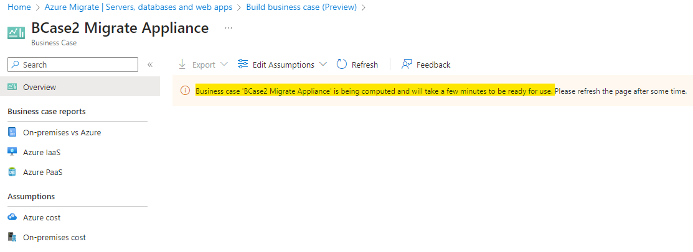
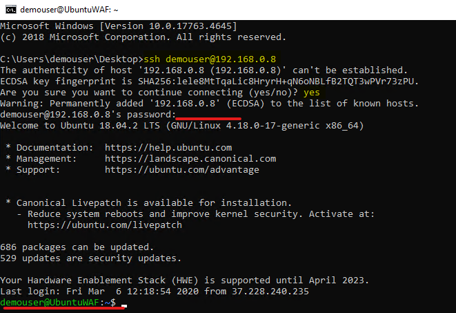

# ラボ２：on-premises環境を検出と評価する

**目的**

このラボでは、Azure Migrate
ツールを使用してon-premisesのVMを検出および評価し、評価データを保存するためのリポジトリを
Azure Migration プロジェクト内に作成します。

また、VM間の依存関係を可視化するためにエージェントをインストールします。

そうするために、SmartHotelHost 上に Azure
MigrateアプライアンスをVMとしてデプロイし、必要なDiscoveryタスクを実行する必要があります。

> **重要：**このラボを開始する前に、on-premise環境のデプロイ**（Lab 1-
> Deploying and verifying the on-premises environment and landing
> zone）** に少なくとも 30 ～ 40 分かかるようにしてください。

### タスク１： Azure Migrate プロジェクトの作成と評価・移行ツールの追加する

このタスクでは、Azure Migrate
プロジェクトを作成し、評価および移行ツールを選択します。

> **注意：**このラボでは、Azure Migrate 内で Microsoft
> が提供する評価および移行ツールを使用します。Azure Migrate
> には、評価と移行の両方のために、多数のサードパーティ製ツールも統合されています。これらのサードパーティ製ツールについては、ラボの外で調査することをおすすめします。

1.  **Azure
    portal**タブに戻って、または新しいタブを開いて`https://portal.azure.com` に`**Office
    365 tenant credentials**を使用してログインします。

2.  検索バーに `Azure Migrate` と入力し、**Azure
    Migrate**を選択して、以下に示す**Azure Migrate
    Overview**ブレードを開きます。

- 

  

  コンピュータのスクリーンショット説明は自動的に生成されました。

3.  **Discover, assess and migrate**を選択します。

- 

  コンピュータのスクリーンショット説明は自動的に生成されました。

4.  **Create project**を選択します。

- 

  コンピュータのスクリーンショット説明は自動的に生成されました。

5.  サブスクリプションを選択し`AzureMigrateRG`という名前の新しいリソースグループを作成します。

- 

6.  `SmartHotelMigration`と入力し、移行評価データを保存する地域を選択します。ここでは**United
    States**を選択します。**Create**を選択します。

- 

  

7.  The Azure Migrate
    のデプロイが開始されます。完了すると、現在の移行プロジェクトの**Azure
    Migrate: Discovery and assessment**パネルと**Azure Migrate: Server
    Migration**パネルが以下のように表示されます。

- 

このタスクは完了しました。次のタスクに進むには、このタブを閉じないでください。

このタスクでは、サーバーの評価とサーバーの移行のための既定の組み込みツールを使用して、**Azure
Migrate project**を作成しました。

### タスク２： Azure Migrate アプライアンスをデプロイする

このタスクでは、on-premisesの Hyper-V 環境にAzure
Migrateアプライアンスをデプロイして構成します。このアプライアンスは
Hyper-V サーバーと通信してon-premisesVM
の構成データとパフォーマンスデータを収集し、そのデータを Azure Migrate
プロジェクトに返します。

1.  **Azure Migrate**では: **Discovery and
    Assessment**で、**Discover**を選択し、**Using
    appliance**を選択して**Discover machines**ブレードを開きます。

- 

  コンピュータのスクリーンショット 説明は自動的に生成されました。

2.  「**Are your servers virtualized?**」の下**Yes, with
    Hyper-V**を選択します。

- 

  コンピュータのスクリーンショット 説明は自動的に生成されました。

8.   **1: Generate project key**で、 Hyper-V VMsの検出用に設定するAzure
    Migrateアプライアンス名として「`SHApplXXXXXX`（**XXXXXX**
    はランダムな数字に置き換えてください）を入力します。 **Generate
    key**を選択して、必要な Azure リソースの作成を開始します。

- 

  コンピュータのスクリーンショット 説明は自動的に生成されました。

  

3.  キーが生成されるまで**Wait** **。**その後、 **Azure Migrate project
    key**をクリップボードにコピーし、**notepad**に保存してください。この**Key**は、以降のタスクで使用できます。

- 

  コンピュータのスクリーンショット 説明は自動的に生成されました。

4.  **.VHD file 12 GB**ラジオ
    ボタンが選択されていることを確認し、**Download**を右クリックして**Copy
    link**を選択します。

- 

5.  後で Azure Migrate
    アプライアンスをダウンロードするときに使用するリンクをメモにコピーします。

- 

  自動的に生成された白黒のテキストの説明

6.  別のブラウザタブで、 **Azure
    Portal**に移動します。グローバル検索ボックスに`SmartHotelHost` と入力し、 `**SmartHotelHost**仮想マシンを選択します。

- 

7.  **Connect**を選択して、ドロップダウンから**Connect** を選択します。

- 

  コンピュータのスクリーンショット 説明は自動的に生成されました。

8.  **Download RDP File**にクリックします。

- 

  コンピュータのスクリーンショット 説明は自動的に生成されました。

9.  通知の**Keep**ボタンをクリックし、**Open
    file**をクリックして接続します。

- 

  コンピュータのスクリーンショット 説明は自動的に生成されました。

10. ユーザー名「`demouser`」、パスワード「`demo!pass123`」で仮想マシンに**Connect**をクリックします。

- 

  

11. **Yes**にクリックします。

- 

12. **SmartHotelHost VM**で Chrome ブラウザーを開き、メモからコピーした
    Azure Migrate
    アプライアンスのリンクを貼り付けると、ファイルのダウンロードが開始されます。

- 

13. ファイルがダウンロードされたら、ダウンロードしたファイルをクリックし、**Shown
    in folder**オプションを選択します。

- 

  コンピュータのスクリーンショット 説明は自動的に生成されました。

14. zipファイルをダブルクリックします‐**AzureMigrateAppliance**

- 

15. **AzureMigrateAppliance**フォルダーが表示されたらそれを選択し、**Extract
    all** ボタンをクリックし、フォルダー パスを`F:\VirtualMachines`として指定して`、**Extract**ボタンをクリックします。

- 

16. **Server Manager** ウィンドウに切り替えます。
    

17. サーバー マネージャーで、**Tools**、**Hyper-V
    Manager**に選択します（サーバー
    マネージャーが自動的に開かない場合は、 **Start**、**Server
    Manager**に選択して開きます)。

- 

18. Hyper-V マネージャーで、 **SMARTHOTELHOST**
    を選択します。on-premisesの**SmartHotel**アプリケーションを構成する
    4 つの VM の一覧が表示されます。

- 

19. **Actions**の下で、**Import Virtual Machine…** を選択して、**Import
    Virtual Machine**ウィザードを開きます。

- 

20. 最初のステップで、 **Before You Begin**で、**Next**を選択します。

- 

21. **Locate Folder**ステップで、**Browse**を選択し、`F:\VirtualMachines\AzureMigrateAppliance`に移動し（前のステップで***extracted***ものを選択するはずです)
    、**Select Folder**を選択して、**Next**を選択します**。**

- 

  コンピュータのスクリーンショット 説明は自動的に生成されました。

22. **Select Virtual Machine**ステップでは、 **AzureMigrateAppliance**
    VM が既に選択されているはずです。**Next**を選択します。

- 

23. **Choose Import Type**ステップでは、デフォルト設定を**Register the
    virtual machine in-place**にして、**Next**を選択します。

- 

  コンピュータのスクリーンショット 説明は自動的に生成されました。

24. **Connect Network**のステップで、Azure
    Migrateアプライアンスで以前使用されていた仮想スイッチが見つからないというエラーが表示されます。**Connection**ドロップダウンから**Azure
    Migrate Switch**を選択し、**Next**を選択してください。

- 

  コンピュータのスクリーンショット 説明は自動的に生成されました。

  > ***注意：***Azure
  > Migrateアプライアンスは、Azureにデータをアップロードするためにインターネットへのアクセスが必要です。また、Hyper-Vホストへのアクセスも必要です。ただし、Hyper-Vホスト上で実行されているアプリケーションVMに直接アクセスする必要はありません。アプリケーション環境を保護するため、Azure
  > Migrateアプライアンスは、アプリケーションと同じサブネットではなく、Hyper-V内の別のサブネットにデプロイする必要があります。

  > Hyper-V環境には、IPアドレス空間192.168.0.0/16を使用するNATネットワークがあります。SmartHotelアプリケーションが使用する内部NATスイッチはサブネット192.168.0.0/24を使用しており、アプリケーション内の各VMにはこのサブネットから静的IPアドレスが割り当てられています。  
  > Azure Migrate アプライアンスは、セットアップ済みの別のサブネット
  > 192.168.1.0/24 に接続されます。「Azure Migrate
  > Switch」を使用して、アプライアンスをこのサブネットに接続します。アプライアンスには、SmartHotelHost
  > で実行されている DHCP サービスを使用して、このサブネットから IP
  > アドレスが割り当てられます。

25. 概要ページを確認し、**Finish**を選択して、Azure Migrate
    アプライアンス VM を作成します。

- 

26. Hyper-V マネージャーで、 **AzureMigrateAppliance** VM
    を選択し、右側の**Start**を選択します。

- 

このタスクは完了しました。次のタスクに進むには、Hyper-V
Managerを閉じないでください。

**タスクのまとめ**

このタスクでは、on-premisesの Hyper-V 環境に Azure Migrate
アプライアンスをデプロイしました。

### タスク３：Azure Migrate アプライアンスを構成する

このタスクでは、Azure Migrate
アプライアンスを構成し、それを使用して移行アセスメントの発見フェーズを完了します。

1.  Hyper-V
    マネージャーで、**AzureMigrateApplianceVM**を選択し、Startをクリックしてから**Connect**を選択します。

- 

2.  新しいウィンドウが開き、Azure
    Migrateアプライアンスが表示されます。ライセンス条項画面が表示されるまで待ち、**Accept**を選択します。

- 

3.  **Customize
    settings**画面で、管理者パスワードを手動で（２回）入力し、`demo!pass123` に設定します。Finishを選択します。

- > **注意：**
  > パスワード入力時、VMはUSキーボードマッピングを使用します。USキーボード以外のキーボードをご利用の場合、一部の文字が正しく入力されない場合があります。2番目のパスワード入力ボックスにある「eyeball」アイコンを選択して、パスワードが正しく入力されていることを確認してください。

  

4.  **Connect to
    AzureMigrateAppliance**プロンプトで、スライダーを使用してアプライアンスの画面サイズを設定し、**Connect**を選択します。

- 

5.  パスワード`demo!pass123` を手動で入力して、管理者としてログインします`(ログイン画面でローカル
    キーボード
    マッピングが取得される場合があります。「eyeball」アイコンを使用して確認してください)
    。

- 

  グラフィカルユーザーインターフェース、ウェブサイトの説明は自動的に生成されます。

6.  **Wait.** 1 ～ 2 分後にブラウザーが開き、Azure Migrate
    アプライアンス構成ウィザードが表示されます (デスクトップ
    ショートカットから起動することもできます) 。

- 

7.  アプライアンス設定ウィザードを開くと、ライセンス条項が記載されたポップアップが表示されます。**I
    agree**を選択して条項に同意してください**。**

- 

  コンピュータのスクリーンショット 説明は自動的に生成されました。

8.  **Set up prerequisites**
    で、インターネット接続と時刻同期を確認するための次の 2
    つの手順が自動的に完了するはずです。

- 

  コンピュータのスクリーンショット 説明は自動的に生成されました。

9.  先ほど Azure ポータルからコピーした**Azure Migrate project keyを、
    Verification of Azure Migrate project
    key**セクションに貼り付けて、**Verify**ボタンをクリックします。

- 

  コンピュータのスクリーンショット 説明は自動的に生成されました。

  > **注意：**キーがない場合は、Azure Portal の Azure Migrate で**Server
  > Assessment \> Discover \> Manage existing
  > appliances**に移動し、キー生成時に指定したアプライアンス名を選択して、対応するキーをコピーします。

10. **Azure Migrate project
    key** が検証されると、自動更新プロセスが開始されます。

- 

  コンピュータのスクリーンショット 説明は自動的に生成されました。

11. 新しいアップデートがインストールされている場合は、**Refresh**ボタンをクリックしてページを再読み込みしま す。

- 

12. **Login**をクリックすると、コードを含むポップアップが開きます。

- 

13. 新しいウィンドウが開き、デバイスコードが表示されます。**Copy code &
    Login**を選択してください。

- 

  コンピュータのスクリーンショット 説明は自動的に生成されました。

14. 新しいブラウザ
    ウィンドウでプロンプトが表示されたら、**Code**を貼り付けて**Next**を選択します。

- 

  コンピュータのスクリーンショット 説明は自動的に生成されました。

15. Azureポータルの資格情報を入力し、**Next**を選択します。**Password**を入力し、**Sign
    in**を選択します**。**

- > **注意：** ネストされた仮想化のため、@ 記号は 2
  > として表示されます。したがって、資格情報を修正し、キーボードを使用してパスワードを入力するか、ラボ
  > VM に切り替えてメモ帳にパスワードを貼り付けてコピーし、SmartHotelVM
  > に切り替えて、AzureMigrate アプライアンス VM
  > にパスワードを貼り付けます。

  

  コンピュータのスクリーンショット 説明は自動的に生成されました。

  

16.  **Continue**を選択します。

- 

  コンピュータエラーのスクリーンショット 説明は自動的に生成されました。

  

17. **Azure Migrate Appliance** タブに戻ると、**Appliance
    registration**自動的に開始されます。

- 

  コンピュータのスクリーンショット 説明は自動的に生成されました。

18. 登録が完了したら、次のパネル**Manage credentials and discovery
    sources**に進みます。

- 

  コンピュータのスクリーンショット 説明は自動的に生成されました。

19. 資格情報と検出ソースの管理で**Step 1: Provide Hyper-V host
    credentials**に**Add credentials**を選択します。

- 

  コンピュータのスクリーンショット 説明は自動的に生成されました。

20. **Friendly
    name**に「`hostlogin` 」、username に「`demouser`」と入力し、アプライアンスがVMの検出に使用するHyper-Vホスト/クラスターのパスワードを手動で`demo!pass123`
    と入力します。**Save**にクリックします。

- 

  コンピュータのスクリーンショット 説明は自動的に生成されました。

  > **注意：** Azure
  > Migrateアプライアンスがローカルキーボードのマッピングを取得していない可能性があります。パスワードボックスの「eyeball」アイコンを選択して、パスワードが正しく入力されていることを確認してください。

  > ***注意：***「Add more」ボタンを介した Hyper-V VM
  > の検出では、複数の資格情報がサポートされています。

21. **Step 2: Provide Hyper-V host/cluster details**に、**Add discovery
    source** を選択して、Hyper-V ホスト/クラスターの IP アドレス/FQDN
    と、ホスト/クラスターに接続するための資格情報のフレンドリ名を指定します。

- 

  コンピュータのスクリーンショット 説明は自動的に生成されました。

22. **Add single item**を選択し、\[IP Address / FQDN\]
    の下に`SmartHotelHost`と入力し、マップ資格情報としてドロップダウンから**hostlogin**を選択して、**Save**にクリックします。

- 

  コンピュータのスクリーンショット 説明は自動的に生成されました。

  > **注意：** 一度に**Add single item**することも、**Add multiple
  > items**こともできます。また、 **Import
  > CSV**を使用してHyper-Vホスト/クラスターの詳細を提供するオプションもあります。

23. アプライアンスは、追加された Hyper-V
    ホスト/クラスターへの接続を検証し、各ホスト/クラスターに対する**Validation
    status**をテーブルに表示します。

- 

  **注意：** 検出ソースを追加する場合:
  - 正常に検証されたホスト/クラスターについては、IP アドレス/FQDN
    を選択して詳細を表示できます。
  - ホストの検証に失敗した場合は、表のステータス列で検証失敗を選択してエラー内容を確認し、問題を修正して再度検証してください。
  - ホストまたはクラスターを削除するには、 **Delete**を選択します。
  - クラスターから特定のホストを削除することはできません。削除できるのはクラスター全体のみです。
  - クラスター内の特定のホストに問題がある場合でも、クラスターを追加できます。

24. スイッチが有効になっていることを確認して、**Add
    credentials**をクリックします。

- 

  コンピュータエラーのスクリーンショット 説明は自動的に生成されました。

25. 「資格情報の追加」ポップアップで詳細を入力し、**Save**ボタンをクリックします。

    - Credential type – **Windows (Non-domain)**

    - Friendly name – `WindowsVM`

    - Username – `.\Administrator`

    - Password –`demo!pass123`を`手動で入力してください。

- 

  コンピュータのスクリーンショット 説明は自動的に生成されました。

26. 通知を閉じます。

- 

  コンピュータのスクリーンショット 説明は自動的に生成されました。

27. **Add
    credentials**をクリックし、資格情報の追加するポップアップで詳細を入力して、**Save**ボタンをクリックします。

    - 資格情報の種類 – **Linux (Non-domain)**

    - フレンドリー名 – `LinuxVM`

    - ユーザー名 – `.\demouser`

    - パスワード –`demo!pass123`を`手動で入力してください

- 

  コンピュータのスクリーンショット 説明は自動的に生成されました。

28. 通知を閉じます。

- 

  コンピュータのスクリーンショット 説明は自動的に生成されました。

29. 下にスクロールして、**Start Discovery** ボタンをクリックします。

- 

  コンピュータのスクリーンショット 説明は自動的に生成されました。

  

  コンピュータのスクリーンショット 説明は自動的に生成されました。

30. Azure Migrate のステータスに**Discovery has been successfully
    initiated**と表示されるまでお待ちください。これには 10～13
    分かかります。検出が正常に開始されたら、テーブル内の各ホスト/クラスターの検出ステータスを確認できます。

- 

  コンピュータのスクリーンショット 説明は自動的に生成されました。

31. ラボ VM に戻り、Edge ブラウザーを開いて Azure Portal
    `(https://portal.azure.com)に移動し`、Office 365
    テナントの資格情報でサインインして、 **Azure
    Migrate**ブレードに戻ります。

- 

  グラフィカルユーザーインターフェース、テキスト、アプリケーション、電子メールの説明が自動的に生成される。

32. **Servers, databases and web
    apps**を選択し、**Refresh**を選択します。

- 

  コンピュータのスクリーンショット 説明は自動的に生成されました。

  

33. **Azure Migrate: Server
    Assessment** の下に、これまでに検出されたサーバーの数が表示されます。検出がまだ進行中の場合は、検出されたサーバーが**5**台になるまで定期的に**Refresh** を選択してください。これには数分かかる場合があります。

- 

  コンピュータのスクリーンショット 説明は自動的に生成されました。

**重要:
次のタスクに進む前に、検出プロセスが完了するまで待機してください**。

このタスクは完了しました。次のタスクに進むには、このタブを閉じないでください。

**タスクのまとめ**

このタスクでは、on-premiseの Hyper-V 環境で Azure Migrate
アプライアンスを構成し、移行評価検出プロセスを開始しました。

### タスク4: CSVファイルを使用してサーバーインベントリをインポートする

環境のインベントリ、構成、使用状況をCSVファイルでインポートすることもできます。CSVファイルのプロパティは次のとおりです：

- **Server Name** – コンピュータの名前

- **IP Addresses** –
  マシンで使用されるIPv4およびIPv6アドレスのセミコロン区切りリスト

- **Cores** – 使用されているvCPUの数

- **Memory** – メモリ量（MB）

- **OS Details**

  - **Name** – オペレーティングシステムの種類

  - **Version** – 使用中の OS のバージョン

  - **Architecture** – アーキテクチャ（x64/x86 など）

- **CPU Utilization** – 使用中のCPUの割合

- **Memory Utilization** – CPU使用率の急上昇率

- **Network**

  - アダプタ数 – マシンに接続されているNICの数

  - 入力スループット – システムへのMbpsスループット量

  - 出力スループット – システムから出力されるMbpsスループットの量

- **Boot Type** – システムで使用されるブートのタイプ（UEFI/BIOS）

- **Disks**

  - **Number of disks** – ディスクに接続されているディスクの数

  - **Per disk size** – ディスクサイズGB

  - **Per disk reads (Bytes)** –
    各ディスクから1秒あたりに読み取られるMB量

  - **Per disk writes (Bytes)** –
    各ディスクに1秒あたりに書き込まれるMB量

  - **Per disk reads (IOPS)** – 1秒あたりのディスクからの出力操作回数

  - **Per disk writes (IOPS)** – 1秒あたりのディスクからの入力操作回数

CSV
が入力されたら、次の手順でシステムを移行評価フェーズにインポートできます：

1.  **Azure Migrate**ブレードの移行の目標で **Servers, databases and
    web**が選択されていることを確認し、**Discover**ボタンを選択して**Using
    import**を選択します。

- 

  コンピュータのスクリーンショット 説明は自動的に生成されました。

2.  `C:\Labfiles`から**Azure Migrate import
    template.csv**という名前の CSV ファイルをアップロードし、
    **Import**を選択してファイルを読み取ります。

- 

  コンピュータのスクリーンショット 説明は自動的に生成されました。

3.  インポートによりファイル レコードの処理が開始されます。

- 

  コンピュータのスクリーンショット 説明は自動的に生成されました。

4.  下の画像のような通知が届くはずです。

- 

  数字のクローズアップ説明は自動的に生成されました。

5.  **40 Records**が正常に挿入されたことがわかります。

- 

6.  検出ブレードを閉じて、**Refresh**ボタンをクリックします。

- 

  コンピュータのスクリーンショット 説明は自動的に生成されました。

7.  検出されたサーバーのリストが更新されていることがわかります。

    - **Discovered Servers – 45**

- 

  コンピュータのスクリーンショット 説明は自動的に生成されました。

8.  **Discovered items**をクリックし、**Import
    based**タブを選択すると、インポートされた40台のサーバーの詳細が表示されます。ドロップダウンメニューからプロジェクトを選択してください。

- 

  コンピュータのスクリーンショット 説明は自動的に生成されました。

このタスクは完了しました。次のタスクに進むには、このタブを閉じないでください。

### タスク 5：コスト見積りのビジネス ケースを作成します。

このタスクでは、Azure Migrate アプライアンスとインポートされたサーバー
リストから検出フェーズ中に収集されたデータを使用して、Azure Migrate
でビジネス ケースを構築します。

ビジネスケース機能は、Azure
がお客様のビジネスに最大限の価値をもたらす方法を理解するためのビジネス提案書の作成に役立ちます。主な内容は次のとおりです：

- On-premisesと Azure の総所有コストの比較。

- 前年比のキャッシュフロー分析。

- クラウドに最適なサーバーとワークロードを特定するためのリソース使用率に基づく洞察。

- Windows OS および SQL
  バージョンのサポート終了を含む、移行と最新化の迅速な成功。

- 使用した分だけ支払うことで、資本支出モデルから運用支出モデルに移行し、長期的なコスト削減を実現します。

- コスト計画プロセスにおける推測作業を排除し、データ洞察に基づく計算を追加します。

- Azure Migrate
  アプライアンスを使用して検出を実行した後、数回クリックするだけで生成できます。

- この機能は、既存の Azure Migrate
  プロジェクトに対して自動的に有効になります。

1.  C移行目標の下にある**Servers, databases and web
    apps**をクリックし、**Build business case**ボタンを選択します。

- 

  コンピュータのスクリーンショット 説明は自動的に生成されました。

9.  **Build business case (Preview)** ページで、以下の詳細を入力し、**Build business
    case**ボタンをクリックします。

    - ビジネスケース名 -`BCase1 from the imported CSV`

    - 対象地域 - **West US**

    - 検出ソース – **.C Build a quick business case using the servers
      imported via a .CSV file**

    - 節約オプション – **Reserved instance + Azure Saving Plan**

    &nbsp;

    - プリペイド割引（％）- **0**

- 

  コンピュータのスクリーンショット 説明は自動的に生成されました。

2.  以下のような通知が届くはずで。

- 

  コンピュータのスクリーンショット 説明は自動的に生成されました。

3.  数分後に更新ボタンをクリックしてください。

- 

4.  仮定が計算されると、ページは以下のように表示されます。

- 

  コンピュータのスクリーンショット 説明は自動的に生成されました。

5.  **TCO comparison**の詳細を確認し、**View
    Details**リンクをクリックします。

- 

6.  **On-premises vs Azure**が開き、**Estimated annual cost by
    category**が表示されます。

- 

10. **Total cost of ownership**の詳細をご覧ください。

- 

7.  ビジネスケースの概要ページに戻り、**YoY estimated current vs future
    state cost** と**Savings with Azure Hybrid Benefit**を確認します。

- 

  > **注意** - Azure
  > への移行を段階的に計画しているため、この折れ線グラフは、その年に完了すると予想される移行量に基づいて、年間のキャッシュフローを示しています。デフォルトでは、当年度は
  > 0%、1 年目は 20%、2 年目は 50%、3 年目は 100%
  > の移行を想定しています。現在のコストは、インフラストラクチャが年間
  > 5%
  > 増加した場合、on-premisesの純キャッシュフローがどのようになるかを示しています。将来のコストは、「Azure
  > cost」の想定に基づき、インフラストラクチャが年間 5%
  > 増加した場合、年間の一定割合を Azure
  > に移行した場合の純キャッシュフローを示しています。

  > **Note** - **Azure Hybrid
  > Benefit**、クラウドでのワークロード実行コストを大幅に削減できるライセンス特典です。on-premisesのソフトウェア
  > アシュアランス対応 Windows Server および SQL Server ライセンスを
  > Azure で利用できるようにすることで、そのメリットを実感いただけます。

8.  Discovery insights セクションで提供されている情報を確認します。

    - **Total Server – Distribution**

    - **OS Distribution**

- 

  コンピュータのスクリーンショット 説明は自動的に生成されました。

9.  **Azure IaaS**をクリックし、**Ready for
    migration**サーバーの情報と、同じサーバーの**IaaS cost
    estimate、**および**Saving with Azure Hybrid
    Benefit**を示す**Azure**タブを確認します。

- 

11. 詳細については下にスクロールしてください。

    - **Estimated cost by savings option**

    - **Recommended VM family and Storage type**

    - **On-premises cost vs Azure cost**

- 

12. 上にスクロールして**on-premises**タブをクリックすると、**On-premises
    cost estimate**が表示されます。

- 

10. 下にスクロールして、サーバー分析セクションを確認します。

    - **Distribution by operating system**

    - **Distribution by virtualization**

    - **Distribution by category**

- 

11. **View details**リンクをクリックすると、ビジネス
    ケースで検討されているすべてのサーバーの一覧が、 **recommended
    targets, activity state** と**qualifying offers in
    Azure**とともに表示されます。

- 

12. 詳細ブレードを閉じて、前提条件の下の**Azure
    cost**をクリックします**。**

- 

13. **Assumptions for Azure cost** と**Cost
    modelling**を変更し、**Save** をクリックしてビジネス
    ケースを再評価できます。

14. **On-premises cost**をクリックし、**Compute**タブで設定を行います。

    - **Software - SQL Server licensing**

    - **Software - Windows server licensing**

    - **Virtualization software – Hyper-V**

    - **Virtualization software – VMware**

- 

  コンピュータのスクリーンショット 説明は自動的に生成されました。

15. **Storage**をクリックして設定を確認します。

- 

  コンピュータのスクリーンショット 説明は自動的に生成されました。

16. **Network**をクリックして設定を確認します。

- 

  コンピュータのスクリーンショット 説明は自動的に生成されました。

17. **Security**タブをクリックして設定を確認します。

- 

  コンピュータのスクリーンショット 説明は自動的に生成されました。

18. **Management**タブをクリックして設定を確認します。

19. 設定を確認するには**Labor**タブをクリックします。

- 

  コンピュータのスクリーンショット 説明は自動的に生成されました。

20. 設定を確認するには**Facilities**タブをクリックします。

- 

  コンピュータのスクリーンショット 説明は自動的に生成されました。

21. これらの設定を変更し、保存ボタンをクリックしてon-premisesのコストを再評価することで、適切なon-premisesのコストを見積もることができます。

22. 次に、Azure Migrate
    アプライアンスを使用して検出されたサーバーの別のビジネス
    ケースを作成しましょう。

23. Azure Migrate ページから、\[サーバー、データベース、Web アプリ\]
    をクリックし、 **Build Business case**をクリックします。

- 

  コンピュータのスクリーンショット 説明は自動的に生成されました。

24. **Build business case
    (Preview)**ページで、以下の詳細を入力し、**Build business
    case**ボタンをクリックします。

    - ビジネスケース名 - `BCase2 Migrate Appliance`

    - 対象地域 - **West US**

    - 検出ソース – **Use more accurate data insights collected via the
      Azure Migrate appliance.**

    - 移行戦略 - **Azure recommended approach to minimize cost**

    - 節約オプション – **Reserved instance + Azure Saving Plan**

    - プリペイド割引（％） - **0**

- 

  コンピュータのスクリーンショット 説明は自動的に生成されました。

25. 以下のような通知が届くはずです。

- 

26. 数分後に更新ボタンをクリックしてください。

- 

  コンピュータのスクリーンショット 説明は自動的に生成されました。

27. 仮定が計算されると、ページは以下のように表示されます。

- 

  コンピュータのスクリーンショット 説明は自動的に生成されました。

28. インポートされたサーバー用に作成されたビジネス
    ケースと同様に、以下の領域についてこのビジネス
    ケースの詳細を確認できます。

    - **TCO comparison**

    - **Discovery insights**

    - ビジネスケースレポート

      - **On-premises vs Azure**

      - **Azure IaaS**

    &nbsp;

    - 仮定

      - **Azure cost**

      - **On-premises cost**

29. **BCase2 Migrate Appliance –** ビジネス ケースを確認したら、Azure
    Migrate ページに戻り、 **Servers, databases and web
    apps**の下の**Overview**ボタンをクリックします**。**

- 

  コンピュータのスクリーンショット 説明は自動的に生成されました。

30. マネージの下**Business cases**をクリックします。

- 

  コンピュータのスクリーンショット 説明は自動的に生成されました。

31. 異なる Discovery ソースから作成された 2 つのビジネス
    ケースを確認できるはずです。

    - 輸入

    - 家電製品

- 

  コンピュータのスクリーンショット 説明は自動的に生成されました。

### タスク６：移行評価を作成する

このタスクでは、Azure
Migrateを使用して、発見フェーズ中に収集されたデータを使用してSmartHotelアプリケーションの移行評価を作成します。

1.  Azure Migrate で、**Azure Migrate: Discovery and
    assessment**の下の**Assess -\> Azure
    VM** を選択して、新しい移行評価を開始します。

- 

  コンピュータのスクリーンショット 説明は自動的に生成されました。

2.  **Create Assessment Basics** ブレードで、以下の詳細を入力します。

    - 評価の種類 - **Azure VM**

    - 検出ソース - **Servers discovered from Azure Migrate Appliance**。

    - 評価設定の下にある**Edit**リンクをクリックします。

- 

  コンピュータのスクリーンショット 説明は自動的に生成されました。

3.  **Assessment
    settings**ブレードでは、移行評価レポートの作成時に使用する多くの設定をカスタマイズできます。ぜひ、幅広い評価プロパティをご確認ください。

4.  次に、以下の変更を行って、**Save**ボタンをクリックします。

    - ターゲットロケーション – **West US** (Region in which the
      Subscription vCPU cores were increased)

    - 貯蓄オプション – **3 Years reserved**

    - パーセンタイル使用率 – **99^(th)**

    - VM シリーズ – **Select All**

- 

  コンピュータのスクリーンショット 説明は自動的に生成されました。

**注意：** 
**Save**ボタンを有効にするには変更を加える必要があります。変更を加えたくない場合は、ブレードを閉じてください。

5.  Basicsタブに戻り、**Next**: **Select servers to
    assess**ボタンをクリックします。

- 

  コンピュータのスクリーンショット 説明は自動的に生成されました。

6.  **Assessment name**に`SmartHotelAssessment`と入力します。**Create
    New**を選択し、グループ名に「 `SmartHotel VMs` 」と入力します。**smarthotelweb1**
    、 **smarthotelweb2** 、 **UbuntuWAF** VMを選択し、**Next: Review+
    Create assessment**ボタンを選択します。

- 

  > **注意：** smarthotelSQL1 または AzureMigrateAppliance VM は Azure
  > に移行されないため、評価に含める必要はありません。(SQL Server は SQL
  > Database サービスに移行され、Azure Migrate Appliance
  > は移行評価にのみ使用されます。)

7.  **Create assessment**を選択します。

- 

  コンピュータのスクリーンショット 説明は自動的に生成されました。

8.  **Azure Migrate - Servers, databases and web
    apps**ブレードで、表示される評価の数が 1
    になるまで、定期的に**Refresh**を選択します。これには 5 ～ 6
    分かかる場合があります。

9.  Azure Migrate サーバー、データベース、Web アプリ
    ページの評価で1を選択します。

- 

  コンピュータのスクリーンショット 説明は自動的に生成されました。

10. リストから**SmartHotelAssessment**をクリックします。

- 

  コンピュータのスクリーンショット 説明は自動的に生成されました。

11. 評価の概要を少し調べてみましょう。

- 

  コンピュータのスクリーンショット 説明は自動的に生成されました。

12. **Settings**を選択します。

- 

  コンピュータのスクリーンショット 説明は自動的に生成されました。

13. 評価設定で以下を変更し、**Save**ボタンをクリックします。

    - パフォーマンス履歴 – **1 Week**

    - パーセンタイル使用率 – **95^(th)**

- 

  コンピュータのスクリーンショット 説明は自動的に生成されました。

14. しばらくすると、評価レポートが更新され、変更が反映されます。

- 

  コンピュータ画面のスクリーンショット 説明は自動的に生成されました。

15. **Comparison**は下の画像をご覧ください。

- 

16. **Azure
    readiness**（チャートまたは左側のナビゲーション）を選択します。**UbuntuWAF**
    VMの場合、VM
    の移行準備状況に関する具体的な懸念事項がリストされていることに注意してください。

- 

  コンピュータのスクリーンショット 説明は自動的に生成されました。

  > 数分かけて、移行評価の他の側面を調べてみましょう。

  > **注意：**
  > オペレーティングシステム環境（OSE）の情報収集と環境間のVMデータの移行は、データ転送の性質上、ある程度の時間がかかります。ただし、いくつかの手順を実行することで、処理を高速化し、システムの動作状況を確認することができます。以下にいくつかのオプションをご紹介します：

  > データを更新するための一般的な手順:
  > (検出のトラブルシューティングも参照)

  - ポータルでサーバー データが更新されない –
    サーバーのデータが更新されない場合は、これを高速化する方法があります。

  &nbsp;

  - ソフトウェアインベントリの詳細は表示されません。デフォルトでは、ソフトウェアインベントリは24時間に1回のみ更新されます。この設定により、強制的に更新されます。

  &nbsp;

  - ソフトウェアインベントリエラー –
    インベントリ中にエラーコードが返されることがあります。ここではすべてのエラーコードとその意味を一覧表示します。

  > 移行における多くの問題は、定期的なスケジュールやデータの転送不足によりアプライアンスがデータを更新していないことに起因しています。データと情報を強制的に更新するには、以下の手順を実行してください：

17. **Azure Migrate**ページの**Servers, database and web apps**, **Azure
    Migrate: Discovery and assessment**で、 **Overview**を選択します。

- 

  コンピュータのスクリーンショット 説明は自動的に生成されました。

18. **Manage**の下で**Appliances**を選択します。**Refresh
    services**を選択します**。**

- 

  コンピュータのスクリーンショット 説明は自動的に生成されました。

  

  コンピュータのスクリーンショット 説明は自動的に生成されました。

19. 更新操作が完了するまでお待ちください。最新の情報が表示されるはずです。

- 

  コンピュータのスクリーンショット 説明は自動的に生成されました。

  このタスクは完了しました。次のタスクに進むには、このタブを閉じないでください。

**タスクのまとめ**

このタスクでは、Azure Migrate 移行評価を作成して構成しました。

### タスク7：依存関係の視覚化を構成する

ワークロードをAzureに移行する際には、ワークロードの依存関係をすべて理解することが重要です。依存関係が壊れていると、アプリケーションがAzureで正常に動作しない可能性があり、その原因が検知しにくい場合もあります。アプリケーション層間の依存関係など、明らかな依存関係もあれば、DNSルックアップ、Kerberosチケットの検証、証明書失効チェックなど、そうでない依存関係もあります。

**Azure Migrate dependency
visualization**を構成します。そのためには、まず**Log Analytics
workspace**を作成し、次に移行対象の VM
にエージェントをデプロイする必要があります。

1.  **Azure Migrate**ページで、**Servers, database and web
    apps**を選択します。**Azure Migrate: Discovery and
    assessment**の下にある**Groups**の番号**1**
    のリンクをクリックします。

- 

  コンピュータのスクリーンショット 説明は自動的に生成されました。

2.  グループの詳細を表示するには、**SmartHotel
    VM**グループを選択します。

- 

  コンピュータのスクリーンショット 説明は自動的に生成されました。

3.  各 VM の**Dependencies**ステータスが**Requires agent
    installation**になっていることに注意してください**。smarthotelweb1
    VM**に対して**Requires agent installation**を選択します。

- 

  コンピュータのスクリーンショット 説明は自動的に生成されました。

4.  **Dependencies**ブレードで、**Configure Log Analytics
    workspace**を選択します**。

- 

  コンピュータのスクリーンショット 説明は自動的に生成されました。

5.  新しいLog
    Analyticsワークスペースを作成します。ワークスペース名には、
    `AzureMigrateWSXXXXXX `（
    **XXXXXX**はランダムな数字に置き換えてください）を使用してください。リストからLog
    Analyticsワークスペースの場所を選択し、**Configure**を選択します。

6.  ワークスペースがデプロイされるのを待ちます。**Workspace
    ID** と**Workspace Key**をメモにしてください。

- 

  コンピュータのスクリーンショット 説明は自動的に生成されました。

7.  **4 agent download URLs** それぞれのリンク
    アドレスを右クリックしてコピーし、前の手順 9
    で**notepad**に書き留めた**Workspace ID and
    key** と一緒に貼り付けます。

- 

  コンピュータのスクリーンショット 説明は自動的に生成されました。

  > **Note** : これらのリンクをテスト アカウントにメールで送信し、VM
  > で開くことができます。

8.  接続を要求された場合は、資格情報を使用して**SmartHotelHost**の RDP
    セッションに戻ります。

    - Username - `demouser`

    - Password - `demo!pass123`

9.  **Hyper-V Manager**で、
    **smarthotelweb1**を選択し、**Connect**を選択します。

- 

  コンピュータのスクリーンショット 説明は自動的に生成されました。

10. ポップアップが出ると**Connect**を選択し、パスワード`demo!pass123`を入力して`**Administrator**にログインします。

- 

  グラフィカルユーザーインターフェース、アプリケーションの説明は自動的に生成されます。

  

11. **Internet Explorer**を開きます。

- 

12. 先ほど保存した**64-bit Microsoft Monitoring Agent for
    Windows** へのリンクを貼り付け、プロンプトが表示されたら**Run**ボタンをクリックします。

- 

  コンピュータエラーのスクリーンショット 説明は自動的に生成されました。

  > **注意：** You may need to disable **Internet Explorer Enhanced
  > Security Configuration** on **Server Manager** under **Local
  > Server** to complete the download.

13. Microsoft Monitoring Agent のセットアップで、**Next** をクリックし、
    **I Agree**をクリックします**。**

14. **Agent Setup
    Options**ページまで、デフォルトの選択内容で進みます。そこで、**Connect
    the agent to Azure Log Analytics
    (OMS)** に接続するを選択し、**Next**を選択します。

- 

  コンピュータのスクリーンショット 説明は自動的に生成されました。

15. 先ほどコピーしたワークスペースIDとワークスペースキーを入力し、
    「Azure Cloud」ドロップダウンから**Azure
    Commercial**を選択します。**Next**を選択し、残りのページでエージェントを**install**します。

- 

  コンピュータのスクリーンショット 説明は自動的に生成されました。

16. 残りのセットアップはデフォルトオプションで続行し、**Finish**をクリックします。

- 

  コンピュータのスクリーンショット 説明は自動的に生成されました。

17. **Dependency Agent Windows
    installer** へのリンクをブラウザのアドレスバーに貼り付けます。インストーラーを**Run**し、インストールウィザードに従ってインストールを完了します。

- 

  コンピュータのスクリーンショット 説明は自動的に生成されました。

  > **注意：** Dependency Agent をインストールするときにワークスペース
  > ID
  > とキーを構成する必要はありません。これは、事前にインストールする必要がある
  > Microsoft Monitoring Agent と同じ設定が使用されるためです。

  

18. **smarthotelweb1 VM**の仮想マシン接続ウィンドウを閉じます。

19. **Hyper-V Manager**で**smarthotelweb2** と**Connect**を選択します。

- 

20. **Connect**を選択し、パスワード`demo!pass123`を入力して`**Administrator**にログインします。

- 

  グラフィカルユーザーインターフェース、アプリケーションの説明は自動的に生成されます。

  

21. **Internet Explorer**を開き、先ほどメモしておいた URL
    を入力します。プロンプトが表示されたら、インストーラーを**Run**します。

- 

22. **smarthotelweb2 VM**の仮想マシン接続ウィンドウを閉じます。

23. 先ほど保存した**64-bit Microsoft Monitoring Agent for
    Windows** へのリンクを貼り付け、プロンプトが表示されたら**Run**ボタンをクリックします。

- 

  コンピュータエラーのスクリーンショット 説明は自動的に生成されました。

  > **注意：** ダウンロードを完了するには、**Local Server**の**Server
  > Manager**で**Internet Explorer Enhanced Security
  > Configuration**を無効にする必要がある場合があります。

24. Microsoft Monitoring Agent
    のセットアップで、**Next**をクリックし、**I
    Agree**をクリックします**。**

25. **Agent Setup
    Options** ページまで、デフォルトの選択内容で進みます。そこで、**Connect
    the agent to Azure Log Analytics
    (OMS)** を選択し、**Next**を選択します。

- 

  コンピュータのスクリーンショット 説明は自動的に生成されました。

26. 先ほどコピーしたワークスペースIDとワークスペースキーを入力し、
    「Azure Cloud」ドロップダウンから**Azure
    Commercial**を選択します。**Next**を選択し、残りのページでエージェントを**install**します。

- 

  コンピュータのスクリーンショット 説明は自動的に生成されました。

13. 残りのセットアップはデフォルトオプションで続行し、**Finish**をクリックします。

- 

  コンピュータのスクリーンショット 説明は自動的に生成されました。

27. **Dependency Agent Windows
    installer** へのリンクをブラウザのアドレスバーに貼り付けます。インストーラーを**Run**し、インストールウィザードに従ってインストールを完了します。

- 

  コンピュータのスクリーンショット 説明は自動的に生成されました。

  > **注意：** Dependency Agent をインストールするときにワークスペース
  > ID
  > とキーを構成する必要はありません。これは、事前にインストールする必要がある
  > Microsoft Monitoring Agent と同じ設定が使用されるためです。

  

  > **UbuntuWAF VMにLinux versions of the Microsoft Monitoring
  > Agent** とDependency
  > Agentを**deploy**します。そのためには、まず**SSH
  > session**を使用して**UbuntuWAFに**リモート接続します。

28. **SmartHotelHost**との RDP セッションに戻り、デスクトップ
    ショートカットを使用してコマンド プロンプトを開きます。

- 

  コンピュータのスクリーンショット 説明は自動的に生成されました。

  > **注意：** **SmartHotelHost**はWindows Server 2019でWindows
  > Subsystem for
  > Linuxを有効にして実行しています。これにより、コマンドプロンプトをSSHクライアントとして使用できます。AzureでサポートされているLinuxの詳細については、
  > `https://Azure.com/Linux`を`ご覧ください。

29. > SmartHotelHostのHyper-Vで実行されている**UbuntuWAF
    > VM**に接続するには、次のコマンドを入力します。

- `ssh demouser@192.168.0.8`

30. **「yes」** と入力してください。パスワードは`demo!pass123`を使用してください``。`

- 

31. 次のコマンドを入力し、プロンプトが表示されたらパスワード`demo!pass123` を入力します``：`

- `sudo -s`

  

  コンピュータのスクリーンショット 説明は自動的に生成されました。

32. これにより、ターミナルセッションに**elevated/root
    privileges**が付与されます**。**

33. \and\を前にコピーした値に置き換えて、次のコマンドを入力します。

- `wget https://raw.githubusercontent.com/Microsoft/OMS-Agent-for-Linux/master/installer/scripts/onboard_agent.sh && sh onboard_agent.sh -w <Workspace ID> -s <Workspace Key> -d opinsights.azure.com`

34. プロンプトが表示されたらはいを選択し、Enterキーを押します。

- 

  

35. インストール画面は以下のように表示されます。

- 

  

  コンピュータプログラムのスクリーンショット 自動生成された説明。

36. 次のコマンドを入力し、**\< Workspace
    ID\>**を先ほどコピーした値に置き換えます。

- `/opt/microsoft/omsagent/bin/service_control restart <Workspace ID>`

  

37. Linux 用の Dependency Agent
    をダウンロードするには、次のコマンドを入力します。

- `wget --content-disposition https://aka.ms/dependencyagentlinux -O InstallDependencyAgent-Linux64.bin`

  

  自動的に生成されたテキストの説明が表示されたコンピューター画面。

38. 以下のコマンドを実行して依存関係エージェントをインストールします。

- `sh InstallDependencyAgent-Linux64.bin -s`

  

  コンピュータのスクリーンショット 説明は自動的に生成されました。

39. エージェントのインストールが完了しました。

次に、SmartHotelアプリケーションでトラフィックを生成し、依存関係の可視化に必要なデータを取得する必要があります。SmartHotelHostのパブリックIPアドレスにアクセスし、数分間かけてページを更新し、ゲストのチェックインとチェックアウトを行ってください。

**タスクのまとめ**

このタスクでは、Log Analytics ワークスペースを作成し、on-premisesの
Windows マシンと Linux マシンの両方に Azure Monitoring Agent と
Dependency Agent をデプロイして、Azure Migrate
の依存関係の視覚化機能を構成しました。

### タスク8：依存関係の視覚化を調べる

このタスクでは、Azure Migrate
の依存関係可視化機能について説明します。この機能は、前のタスクでインストールした依存関係エージェントによって収集されたデータを使用します。

1.  **Azure Migrate**ページを開いた状態で Azure Portal
    に戻り、**Servers, database and web apps**を選択します。**Azure
    Migrate: Discovery and assessment** の下にある**Groups**の番号**1**
    のリンクをクリックします。

- 

  コンピュータのスクリーンショット 説明は自動的に生成されました。

2.  グループの詳細を表示するには、 **SmartHotel
    VMグループ**を選択します。

- 

  コンピュータのスクリーンショット 説明は自動的に生成されました。

3.  すべての VM の Dependency Agent
    のステータスが**Installed**済みになっていることを確認します。

- 

  コンピュータのスクリーンショット 説明は自動的に生成されました。

4.  Click on **View dependencies**.

- 

  コンピュータのスクリーンショット 説明は自動的に生成されました。

5.  依存関係ビューを少し見てみましょう。各サーバーを展開すると、そのサーバーで実行されているプロセスが表示されます。プロセスを選択すると、プロセス情報が表示されます。各サーバーがどのような接続を行っているかを確認できます。

- 

  コンピュータのスクリーンショット 説明は自動的に生成されました。

  

  コンピュータのスクリーンショット 説明は自動的に生成されました。

**まとめ**

ラボの最後には、Azure Migrate アプライアンスを使用してon-premisesの VM
の検出と評価が正常に行われ、メタデータが Azure Migrate
プロジェクトで利用可能になり、詳細が以下のように表示されます。

- VMsの評価

&nbsp;

- 

  グラフィカルユーザーインターフェース、アプリケーションの説明は自動的に生成されます。

&nbsp;

- VMの依存関係マップ

&nbsp;

- 

  チャートを含む画像の説明が自動的に生成されます。
