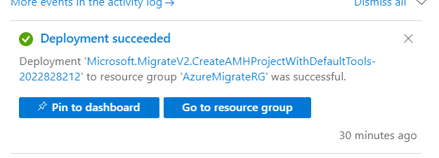
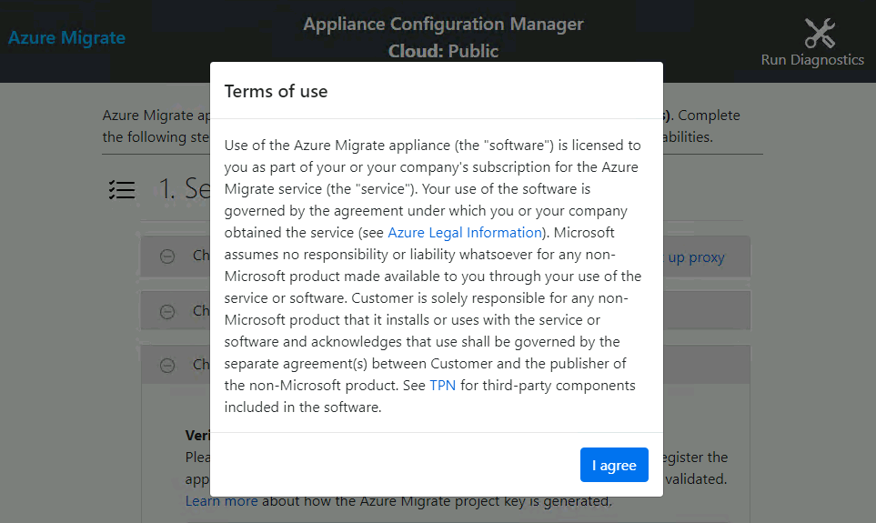
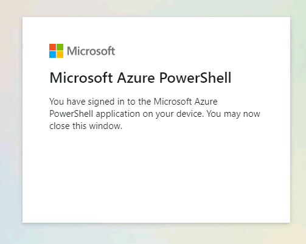
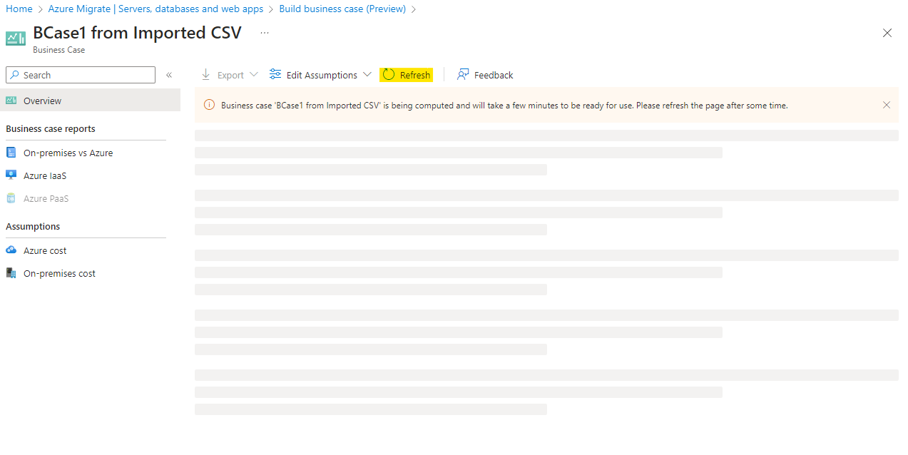
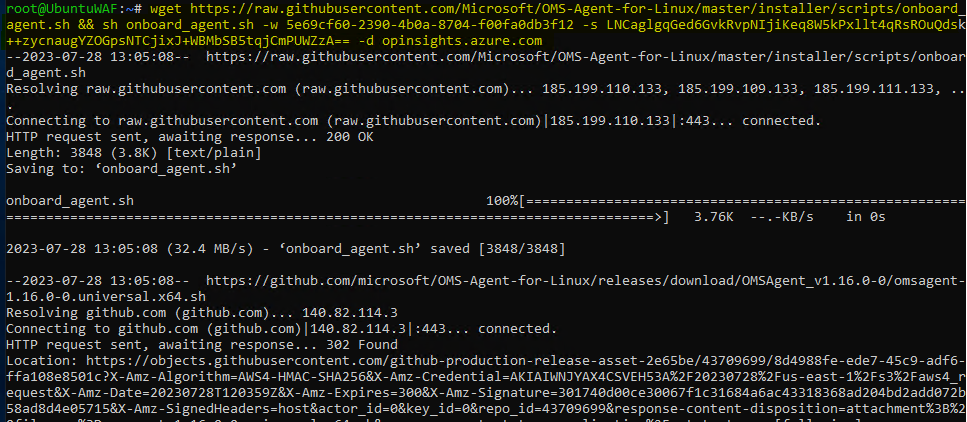

# 실습 02 - 온프레미스 환경 발견 및 평가

**목표**

이 실습에서는 Azure Migrate Tools를 사용하여 온-프레미스 VM을 검색하고
평가한 후, Azure Migration Project에 평가 데이터를 저장할 저장소를
생성합니다.

또한 VM 간의 Dependency을 검색하고 visualisation하기 위해 에이전트를
설치합니다.

이를 위해서는 Azure Migrate Appliance를 SmartHotelHost에 VM으로 배포한
다음, 필요한 Discovery 작업을 실행해야 합니다.

> **중요**: 이 실습을 시작하기 전에 온프레미스 환경(**Lab 1- Deploying
> and verifying the on-premises environment and landing zone**)을
> 배포하는 데 최소 30~40분이 소요되어야 합니다.

### 작업 1: Azure Migrate 프로젝트 만들기 및 평가 및 마이그레이션 도구 추가

이 작업에서는 Azure Migrate 과제를 만들고 평가 및 마이그레이션 도구를
선택합니다.

> **참고**: 이 실습에서는 Azure Migrate 내에서 Microsoft에서 제공하는
> 평가 및 마이그레이션 도구를 사용합니다. 평가 및 마이그레이션을 위해
> 여러 타사 도구도 Azure Migrate에 통합되어 있습니다. 이 실습 외부에서
> 이러한 타사 옵션을 살펴보는 것이 좋습니다.

1.  **Azure Portal** 탭으로 돌아가거나 새 탭을 열고
    `https://portal.azure.com` 으로 이동하여 **Office 365 tenant
    credentials**로 로그인합니다.

2.  검색 창에 `Azure Migrate` 를 입력하고 Azure Migrate를 선택하면
    아래와 같이 **Azure Migrate Overview**  블레이드가 열립니다.

- 

  

  컴퓨터 스크린샷 설명 자동 생성

3.  **Discover, assess and migrate**을 선택합니다.

- 

  컴퓨터 스크린샷 설명 자동 생성

4.  **Create project**를 선택합니다.

- 

  컴퓨터 설명 스크린샷이 자동으로 생성

5.  적절한 구독을 선택하고 `AzureMigrateRG` 라는 새 리소스 그룹을 만듭니다.

- 

6.  마이그레이션 프로젝트 이름으로 `SmartHotelMigration`을 입력하고,
    마이그레이션 평가 데이터를 저장할 가까운 지역을 선택하세요. 여기서는
    **United States**를 선택합니다. 그런 다음 **Create**를 선택합니다.

- 

  

7.  Azure Migrate 배포가 시작됩니다. 완료되면 아래와 같이 현재
    마이그레이션 프로젝트에 대한 **Azure Migrate: Discovery and
    assessment** 와 **Azure Migrate: Server Migration** 패널이
    표시되어야 합니다.

- 

이 작업을 완료했습니다. 다음 작업을 진행하려면 이 탭을 닫지 마세요.

이 작업에서는 서버 평가 및 서버 마이그레이션을 위한 기본 제공 도구를
사용하여 **Azure Migrate project**를 만들었습니다.

### 작업 2: Azure Migrate Appliance 배포

이 작업에서는 온-프레미스 Hyper-V 환경에 Azure Migrate Appliance를
배포하고 구성합니다. 이 Appliance는 Hyper-V 서버와 통신하여 온-프레미스
VM에 대한 구성 및 성능 데이터를 수집하고 해당 데이터를 Azure Migrate
프로젝트로 반환합니다..

1.  **Azure Migrate: Discovery and Assessment**에서 **Discover**를
    선택하고 **Using appliance**를 선택하여 **Discover
    machines** 블레이드를 엽니다.

- 

  컴퓨터 스크린샷 설명 자동 생성

2.  **Are your servers virtualized?**에서 **Yes, with Hyper-V**을
    선택합니다.

- 

  컴퓨터 스크린샷 설명 자동 생성

3.  **1: Generate project key**에서 Hyper-V VM 검색을 위해 설정할 Azure
    Migrate Appliance의 이름으로 `SHApplXXXXXX`(**XXXXXX**를 임의의 숫자로
    대체)를 입력합니다. **Generate key** 를 선택하여 필요한 Azure 리소스
    생성을 시작합니다.

- 

  컴퓨터 스크린샷 설명 자동 생성됨

  

4.  키가 생성될 때까지 **기다린** 후 **Azure Migrate project key** 를
    클립보드에 복사하여 **notepad**에 저장합니다. 이 키는 향후 작업에서
    사용할 수 있습니다.

- 

  컴퓨터 스크린샷 설명 자동 생성됨

5.  **.VHD file 12 GB** 라디오 버튼이 선택되어 있는지 확인한 다음,
    **Download**버튼을 마우스 오른쪽 버튼으로 클릭하고 **Copy
    link** 옵션을 선택합니다.

- 

6.  나중에 Azure Migrate Appliance를 다운로드하는 데 사용할 링크를
    notepad에 복사합니다.

- 

  흑백 텍스트 설명이 자동으로 생성

7.  별도의 브라우저 탭에서 **Azure portal**로 이동합니다. 글로벌
    검색창에 SmartHotelHost를 입력한 후 **SmartHotelHost** 가상 머신을
    선택합니다.

- 

8.  **Connect**를 선택하고 드롭다운에서 **Connect**를 선택합니다.

- 

  컴퓨터 스크린샷 설명 자동 생성

9.  **Download RDP File**를 선택합니다.

- 

  컴퓨터 설명 스크린샷 자동으로 생성

10. 알림에 대해 **Keep** 버튼을 클릭한 다음 **Open file** 를 클릭하여
    연결합니다.

- 

  컴퓨터 스크린샷 설명 자동 생성됨

11. 사용자 이름 `demouser` 와 비밀번호 `demo!pass123` 을 사용하여 가상 머신에 연결합니다.

- 

  

12. **Yes**를 선택합니다

- 

13. 13\. **SmartHotelHost VM**에서 Chrome 브라우저를 열고 메모장에서
    Azure Migrate Appliance에 대한 복사한 링크를 붙여넣으면 파일
    다운로드가 시작됩니다.

- 

14. 파일이 다운로드되면 다운로드한 파일을 클릭하고 **Shown in folder**
    옵션을 선택합니다.

- 

  컴퓨터 스크린샷 설명 자동 생성됨

15. zip 파일(**AzureMigrateAppliance**)을 두 번 클릭합니다.

- 

16. **AzureMigrateAppliance** 폴더가 표시되면 해당 폴더를 선택한 다음
    **Extract all** 버튼을 클릭하고 폴더 경로를 `F:\VirtualMachines` 로
    지정한 후 **Extract** 버튼을 클릭합니다.

- 

17. **Server Manager** 창으로 전환합니다.

18. Server Manager에서 **Tools**를 선택한 다음 **Hyper-V Manager** 를
    선택합니다(Server Manager가 자동으로 열리지 않으면 **Start**를
    선택한 다음 **Server Manager**를 선택하여 엽니다).

- 

19. Hyper-V 관리자에서 **SMARTHOTELHOST**를 선택합니다. 이제 온-프레미스
    **SmartHotel** 애플리케이션을 구성하는 네 개의 VM 목록이 표시됩니다.

- 

20. Hyper-V Manager의 **Actions**에서 **Import Virtual Machine…** 를
    선택하여 **Import Virtual Machine** wizard를 엽니다.

- 

21. 첫 번째 단계인 **Before You Begin**에 **Next**을 선택합니다.

- 

22. **Locate Folder** 단계에서 **Browse** 를 선택하고
    `F:\VirtualMachines\AzureMigrateAppliance` 로 이동합니다(이전 단계에서
    **추출한** 폴더를 선택해야 함). 그런 다음 **Select Folder**를
    선택하고 **Next**를 선택합니다.

- 

  컴퓨터 설명 스크린샷 자동으로 생성됨

23. **Select Virtual Machine** 단계에서 **AzureMigrateAppliance** VM이
    이미 선택되어 있어야 합니다. **Next**를 선택합니다.

- 

24. **Choose Import Type** 단계에서 기본 설정인 **Register the virtual
    machine in-place**을 유지합니다. **Next** 를 선택합니다.

- 

  컴퓨터 설명 스크린샷 자동으로 생성됨

25. **Connect Network**단계에서 Azure Migrate Appliance에서 이전에
    사용했던 가상 스위치를 찾을 수 없다는 오류가 표시됩니다.
    **Connection**  드롭다운에서 **Azure Migrate Switch**를 선택한 후
    **Next**를 선택합니다.

- 

  컴퓨터 설명 스크린샷 자동으로 생성됨

  > **참고**: Azure Migrate appliance는 Azure에 데이터를 업로드하기 위해
  > 인터넷에 액세스해야 합니다. 또한 Hyper-V host에 대한 액세스도
  > 필요합니다. 그러나 Hyper-V host에서 실행되는 애플리케이션 VM에 직접
  > 액세스할 필요는 없습니다. 애플리케이션 환경을 보호하려면 Azure
  > Migrate Appliance를 애플리케이션과 동일한 subnet이 아닌 Hyper-V 내의
  > 별도 subnet에 배포해야 합니다.

  > Hyper-V 환경에는 IP 주소 공간 192.168.0.0/16을 사용하는 NAT
  > 네트워크가 있습니다. SmartHotel 애플리케이션에서 사용하는 내부 NAT
  > switch는 subnet 192.168.0.0/24를 사용하며, 애플리케이션의 각 VM에는
  > 이 subnet의 고정 IP 주소가 할당되었습니다.

  > Azure Migrate Appliance는 미리 설정된 별도의 subnet 192.168.1.0/24에
  > 연결됩니다. 'Azure Migrate Switch'를 사용하면 Appliance가 이
  > subnet에 연결됩니다. Appliance는 SmartHotelHost에서 실행되는 DHCP
  > 서비스를 통해 이 subnet의 IP 주소를 할당받습니다.

26. Summary 페이지를 검토한 다음 **Finish**를 선택하여 Azure Migrate
    appliance VM을 만듭니다.

- 

27. Hyper-V Manager에서 **AzureMigrateAppliance** VM을 선택한 다음
    오른쪽에서 **Start**를 선택합니다.

- 

이 작업을 완료했습니다. 다음 작업을 진행하기 위해 Hyper-V 관리자를 닫지
마세요.

**작업 요약**

이 작업에서는 온-프레미스 Hyper-V 환경에 Azure Migrate Appliance를
배포했습니다.

### 작업 3: Azure Migrate appliance 구성

이 작업에서는 Azure Migrate appliance를 구성하고 이를 사용하여
마이그레이션 평가의 검색 단계를 완료합니다.

1.  Hyper-V 관리자에서 **AzureMigrateAppliance**  VM을 선택하고 시작을
    클릭한 다음 **Connect**를 선택합니다.

- 

2.  Azure Migrate appliance를 보여주는 새 창이 열립니다. License
    terms화면이 표시될 때까지 기다린 후 **Accept**를 선택합니다.

- 

3.  **Customize settings**  설정 화면에서 관리자 비밀번호를
    `demo!pass123` 으로 설정하려면 비밀번호를 직접 두 번 입력합니다. 그런
    다음 **Finish**를 선택합니다.

- > 참고: 비밀번호를 입력할 때 VM은 미국 키보드 매핑을 사용합니다. 미국
  > 키보드가 아닌 다른 키보드를 사용하는 경우 일부 문자가 잘못 입력될 수
  > 있습니다. 두 번째 비밀번호 입력란에서 'eyeball' 아이콘을 선택하여
  > 비밀번호가 올바르게 입력되었는지 확인합니다.

  

4.  **Connect to AzureMigrateAppliance**프롬프트에서 슬라이더를 사용하여
    appliance screen size를 설정한 다음 **Connect**를 선택합니다.

- 

5.  관리자 계정으로 로그인하려면 `demo!pass123` 이라는 비밀번호를 직접
    입력합니다(로그인 화면에서 로컬 키보드 매핑을 확인할 수 있습니다.
    'eyeball' 아이콘을 사용하여 확인하세요).

- 

  그래픽 사용자 인터페이스, 웹사이트 설명 자동으로 생성

6.  **잠시 기다립니다**. 1~2분 후 브라우저가 열리고 Azure Migrate
    Appliance 구성 wizard가 표시됩니다(바탕 화면 바로 가기에서도 실행할
    수 있습니다).

- 

7.  Appliance configuration wizard가 열리면 license terms팝업이
    나타납니다. **I agree**를 선택하여 약관에 동의합니다.

- 

  컴퓨터 설명 스크린샷 자동으로 생성됨

8.  **Set up prerequisites**에서 인터넷 연결 및 시간 동기화를 확인하는
    다음 두 단계는 자동으로 통과되어야 합니다.

- 

  컴퓨터 스크린샷 설명 자동으로 생성

9.  앞서 Azure Portal에서 복사한 **Azure Migrate project key** 를
    **Verification of Azure Migrate project key** 섹션에 붙여넣은 다음
    **Verify** 버튼을 클릭합니다.

- 

  컴퓨터 스크린샷 설명 자동으로 생성됨

  > **참고**: 키가 없으면 Azure Portal의 Azure Migrate에서 **Server
  > Assessment \> Discover \> Manage existing appliances** 관리로 이동한
  > 다음 키 생성 시 제공한 Appliance 이름을 선택하고 해당 키를
  > 복사합니다.

10. **Azure Migrate project key** 가 확인되면 자동 업데이트 프로세스가
    시작됩니다.

- 

  컴퓨터 설명 스크린샷 자동으로 생성

11. 새로운 업데이트가 설치된 경우 **Refresh**버튼을 클릭하여 페이지를
    다시 로드합니다.

- 

12. **Login**을 클릭하면 코드가 적힌 팝업이 열립니다.

- 

13. 기기 코드가 표시된 새 창이 열립니다. **Copy code & Login**을
    선택합니다.

- 

  컴퓨터 스크린샷 자동으로 생성됨

14. 새 브라우저 창에서 메시지가 표시되면 **Code**를 붙여넣고 **Next**를
    선택합니다.

- 

  컴퓨터 설명 스크린샷 자동으로 생성됨

15. Azure portal credentials을 입력하고 **Next**를 선택합니다.
    **Password**를 입력하고 **Sign in**을 선택합니다.

- > **참고** – 중첩 가상화로 인해 @ 기호가 2로 표시됩니다. 따라서 자격
  > 증명을 수정하고 키보드를 사용하여 비밀번호를 입력하거나 랩 VM으로
  > 전환하여 메모장에 비밀번호를 붙여넣고 복사한 후, SmartHotelVM으로
  > 다시 전환하여 AzureMigrate appliance VM에 비밀번호를 붙여넣습니다.

  

  컴퓨터 설명 스크린샷 자동 생성됨

  

16. **Continue**를 을 선택합니다.

- 

  컴퓨터 오류 설명 스크린샷 자동으로 생성됨

  

17. **Azure Migrate Appliance** 탭으로 돌아가면 **Appliance
    registration** 가 자동으로 시작됩니다.

- 

  컴퓨터 스크린샷 설명 자동으로 생성됨

18. 등록이 완료되면 다음 패널인 **Manage credentials and discovery
    sources**로 이동합니다.

- 

  컴퓨터 설명 스크린샷 자동 생성됨

19. Manage credentials and discovery sources 에서**Step 1: Provide
    Hyper-V host credentials**에서 **Add credentials**를 선택합니다.

- 

  컴퓨터 설명 스크린샷 자동 생성됨

20. **Friendly name**에 `hostlogin`을 입력하고, user에 `demouser`를 입력한
    후, Appliance가 VM을 검색하는 데 사용할 Hyper-V host/cluster의
    `demo!pass123` 비밀번호를 직접 입력합니다. **Save**를 선택합니다.

- 

  컴퓨터 설명 스크린샷 자동 생성됨

  > **참고**: Azure Migrate appliance가 로컬 키보드 매핑을 인식하지
  > 못했을 수 있습니다. 암호 상자에서 ' eyeball '를 선택하여 암호가
  > 올바르게 입력되었는지 확인합니다.

  > **참고**: Add more버튼을 통해 Hyper-V VM discovery에 여러 자격
  > 증명이 지원됩니다.

21. **Step 2: Provide Hyper-V host/cluster detail**제공에서 **Add
    discovery source** 를 선택하여 Hyper-V host/cluster IP
    address/FQDN과 host/cluster에 연결하는 데 필요한 자격 증명의 친숙한
    이름을 지정합니다.

- 

  컴퓨터 설명 스크린샷 자동 생성됨

22. **Add single item**을 선택하고 ‘IP Address / FQDN’에
    `SmartHotelHost`를 입력한 다음, 맵 자격 증명으로 드롭다운에서
    **hostlogin**을 선택한 후 **저장**을 선택합니다.

- 

  컴퓨터 설명 스크린샷 자동 생성됨

  > **Note:** 한 번에 **Add single item** 을 하거나 **Add multiple
  > items** 을 한 번에 추가할 수 있습니다. **Import CSV**를 통해 Hyper-V
  > host/cluster 정보를 제공하는 옵션도 있습니다.

23. Appliance는 추가된 Hyper-V hosts/clusters에 대한 연결을 검증하고 각
    host/clusters에 대한 **Validation status** 를 표에 표시합니다.

- 

  **참고:** 검색 소스를 추가할 때:
  - 성공적으로 검증된 hosts/clusters의 경우, IP address/FQDN 을 선택하여
    자세한 내용을 볼 수 있습니다.
  - Host 유효성 검사가 실패하면 표의 상태 열에서 유효성 검사 실패를
    선택하여 오류를 검토하십시오. 문제를 해결하고 다시 유효성 검사를
    수행합니다.
  - Host 또는 Clusters를 제거하려면 **Delete**를 선택합니다.
  - You can’t remove a specific host from a cluster. You can only remove
    the entire cluster. Clusters에서 특정 Host를 제거할 수 없습니다.
    전체 Clusters만 제거할 수 있습니다.
  - You can add a cluster, even if there are issues with specific hosts
    in the cluster. Cluster의 특정 호스트에 문제가 있더라도 Cluster를
    추가할 수 있습니다.

24. 스위치가 활성화되었는지 확인한 다음 **Add credentials**를
    클릭합니다.

- 

  컴퓨터 오류 스크린샷 자동으로 생성됨

25. Add credentials 추가 팝업에서 세부 정보를 입력한 후 **save** 버튼을
    클릭합니다.

    - Credential type – **Windows (Non-domain)**

    - Friendly name – `WindowsVM`

    - Username – `.\Administrator`

    - Password – type is manually `demo!pass123`

- 

  컴퓨터 설명 스크린샷 자동 생성됨

26. 알림을 닫습니다.

- 

  컴퓨터 설명 스크린샷 자동 생성됨

27. **Add credentials** 를 다시 클릭하고 Add credentials 팝업에서 세부
    정보를 제공한 다음 **Save** 버튼을 클릭합니다.

    - Credential type – **Linux (Non-domain)**

    - Friendly name – `LinuxVM`

    - Username – `.\demouser`

    - Password – type is manually `demo!pass123`

- 

  컴퓨터 설명 스크린샷 자동 생성됨

28. 알림을 닫습니다.

- 

  컴퓨터 설명 스크린샷 자동 생성됨

29. 아래로 스크롤한 다음 **Start Discovery** 버튼을 클릭합니다.

- 

  컴퓨터 설명 스크린샷 자동 생성됨

  

  컴퓨터 설명 스크린샷 자동 생성됨

30. Azure Migrate 상태가 **Discovery has been successfully
    initiated**으로 표시될 때까지 기다립니다. 10~13분 정도 소요됩니다.
    검색이 성공적으로 시작되면 표에서 각 host/cluster의 검색 상태를
    확인할 수 있습니다.

- 

  컴퓨터 설명 스크린샷 자동 생성됨

31. 실습VM으로 돌아가서 Edge 브라우저를 열고 Azure Portal
    https://portal.azure.com으로 이동한 다음 office 365 tenant
    credentials으로 로그인하고 **Azure Migrate** 블레이드로 돌아갑니다.

- 

  그래픽 사용자 인터페이스, 텍스트, 애플리케이션, 이메일 설명 자동 생성

32. **Servers, databases**및 **web apps**을 선택한 다음 **Refresh**를
    선택합니다.

- 

  컴퓨터 설명 스크린샷 자동 생성됨

  

33. **Azure Migrate: Server Assessment** 에서 지금까지 검색된 서버 수를
    확인할 수 있습니다. 검색이 아직 진행 중이면 검색된 서버 **5**개가
    표시될 때까지 주기적으로 **Refresh**를 선택합니다. 이 작업에는 몇 분
    정도 걸릴 수 있습니다.

- 

  컴퓨터 설명 스크린샷 자동 생성됨

중요: 다음 작업으로 진행하기 전에 검색 프로세스가 완료될 때까지
기다립니다.

이 작업을 완료했습니다. 다음 작업을 진행하기 위해 이 탭을 닫지 마세요.

**작업 요약**

이 작업에서는 온-프레미스 Hyper-V 환경에서 Azure Migrate 어플라이언스를
구성하고 마이그레이션 평가 검색 프로세스를 시작했습니다.

### 작업 4: CSV 파일을 사용하여 서버 인벤토리 가져오기

CSV 파일을 사용하여 환경, 구성 및 사용률 인벤토리를 가져올 수도
있습니다. CSV 파일의 속성은 다음과 같습니다.

- **Server Name** – 컴퓨터 이름

- **IP Addresses** –머신에서 사용하는 IPv4 및 IPv6 주소(세미콜론으로
  구분) 목록

- **Cores** –사용된 vCPU 수

- **Memory** – 메모리 용량(MB)

- **OS 세부정보**

  - **Name** –운영 체제 유형

  - **Version** – 사용 중인 OS 버전

  - **Architecture** – 아키텍처(예: x64/x86)

- **CPU Utilization** – 사용 중인 CPU 비율

- **Memory Utilization** – CPU 사용량의 백분율 급증

- **Network**

  - Adapter count – 머신에 연결된 NIC의 수

  - Input Throughput – 시스템으로의 처리량(Mbps)

  - Output Throughput – 시스템 외부의 처리량(Mbps)

- **Boot Type** – 시스템에서 사용하는 부팅 유형(UEFI/BIOS)

- **Disks**

  - **Number of disks** –디스크에 연결된 디스크 수

  - **Per disk size** – 디스크 크기(GB)

  - **Per disk reads (Bytes)** – 각 디스크에서 초당 읽은 MB 양

  - **Per disk writes (Bytes)** – 각 디스크에 초당 기록되는 MB 양

  - **Per disk reads (IOPS)** – 초당 디스크에서 발생하는 출력 작업 수

  - **Per disk writes (IOPS)** – 초당 디스크에서 발생하는 입력 작업 수

CSV가 채워지면 다음을 수행하여 시스템을 마이그레이션 평가 단계로 가져올
수 있습니다.

1.  **Azure Migrate** 블레이드의 마이그레이션 목표 아래에서
    that **Servers, databases and web apps** 이 선택되어 있는지
    확인하고, **Discover** 버튼을 선택한 다음 **Using import**을
    선택합니다.

- 

  컴퓨터 설명 스크린샷 자동 생성됨

2.  `C:\Labfiles` 에서 **Azure Migrate import template.csv** 라는 CSV
    파일을 업로드한 다음 **Import** 를 선택하여 파일을 읽습니다.

- 

  컴퓨터 설명 스크린샷 자동 생성됨

3.  가져오기가 파일 레코드 처리를 시작해야 합니다.

- 

  컴퓨터 설명 스크린샷 자동 생성됨

4.  아래 이미지와 같이 알림이 표시되어야 합니다.

- 

  숫자 설명의 클로즈업이 자동으로 생성

5.  가져오기 세부 정보에서 **40 Records** 가 성공적으로 삽입되었음을
    확인할 수 있습니다.

- 

6.  Discovery 블레이드를 닫은 후 **Refresh** 버튼을 클릭합니다.

- 

  컴퓨터 설명 스크린샷 자동 생성됨

7.  Discovered Servers목록이 업데이트된 것을 확인할 수 있습니다.

    - **Discovered Servers – 45**

- 

  컴퓨터 설명 스크린샷 자동 생성됨

8.  **Discovered items**을 클릭한 다음 **Import based** 탭을 선택하면
    가져온 40개 서버의 세부 정보를 확인할 수 있습니다. 드롭다운 메뉴에서
    프로젝트를 선택합니다.

- 

  컴퓨터 설명 스크린샷 자동 생성됨

이 작업을 완료했습니다. 다음 작업으로 넘어가려면 이 탭을 닫지 마세요.

### 작업 5: 비용 예측을 위한 비즈니스 사례 구축

이 작업에서는 Azure Migrate 어플라이언스와 가져온 서버 목록에서 검색
단계에서 수집된 데이터를 사용하여 Azure Migrate를 사용하여 비즈니스
사례를 구축합니다.

비즈니스 사례 기능은 Azure가 비즈니스에 최대 가치를 제공할 수 있는
방법을 파악하기 위한 비즈니스 제안서를 작성하는 데 도움이 됩니다. 이
기능은 다음과 같은 특징을 강조합니다.

- 온프레미스 vs Azure 총소유비용

- 연간 현금 흐름 분석

- 클라우드에 적합한 서버 및 워크로드를 파악하기 위한 리소스 사용률 기반
  인사이트

- Windows OS 및 SQL 버전 지원 종료를 포함한 마이그레이션 및 현대화에
  대한 신속한 성과

- 자본 지출 모델에서 운영 지출 모델로 전환하여 사용한 만큼만 비용을
  지불함으로써 장기적인 비용 절감 효과를 얻을 수 있습니다.

- 비용 계획 프로세스에서 추측 작업을 제거하고 데이터 인사이트 기반
  계산을 추가합니다.

- Azure Migrate 어플라이언스를 사용하여 검색을 수행한 후 몇 번의
  클릭만으로 생성할 수 있습니다.

- 이 기능은 기존 Azure Migrate 프로젝트에 자동으로 활성화됩니다.

1.  **Servers, databases and web apps** 을 클릭합니다. 
    Migration goal에서 **Build business case** 버튼을 선택합니다.

- 컴퓨터 설명 스크린샷 자동 생성됨

2.  **Build business case (Preview)** 페이지에서 아래 세부 정보를 입력한
    다음 **Build business case** 버튼을 클릭합니다.

    - Business case name - `BCase1 from Imported CSV`

    - Target location - **West US**

    - Discovery source – **Build a quick business case using the servers
      imported via a .CSV file.**

    - Savings options – **Reserved instance + Azure Saving Plan**

    - Discount (%) on Pay as you go - **0**

- 

  컴퓨터 설명 스크린샷 자동 생성됨

3.  아래와 같이 알림을 받아야 합니다.

- 

  컴퓨터 설명 스크린샷 자동 생성됨

4.  몇 분 후에 Refresh 버튼을 클릭합니다.

- 

5.  가정이 계산되면 페이지가 아래와 같이 나타나야 합니다.

- 

  컴퓨터 설명 스크린샷 자동 생성됨

6.  **TCO comparison** 에서 세부 정보를 검토하고 **View Details**링크를
    클릭합니다.

- 

7.  비즈니스 사례 보고서**On-premises vs Azure**가 열리고 **Estimated
    annual cost by category**가 표시됩니다.

- 

8.  아래로 스크롤하여 **Total cost of ownership** 세부 정보를
    확인합니다.

- 

9.  비즈니스 사례의 개요 페이지로 돌아가서 **YoY estimated current vs
    future state cost** **Savings with Azure Hybrid Benefit**을
    검토합니다.

- 

  > **참고** - Azure로 단계적으로 마이그레이션할 계획이므로, 이 선형
  > 차트는 해당 연도에 완료된 예상 마이그레이션을 기준으로 연간 현금
  > 흐름을 보여줍니다. 기본적으로 당해 연도에는 0%, 1년차에는 20%,
  > 2년차에는 50%, 3년차에는 100% 마이그레이션한다고 가정합니다. 현재
  > 상태 비용은 인프라가 매년 5%씩 성장하는 것을 기준으로
  > 온프레미스에서의 순 현금 흐름이 어떻게 될지 보여줍니다. 미래 상태
  > 비용은 인프라가 매년 5%씩 성장하는 동안 'Azure 비용' 가정에 따라
  > 매년 일정 비율씩 Azure로 마이그레이션할 때의 순 현금 흐름이 어떻게
  > 될지 보여줍니다.

  > 참고 - **Azure Hybrid Benefit** 은 클라우드에서 워크로드를 실행하는
  > 비용을 크게 절감하는 데 도움이 되는 라이선스 혜택입니다. Azure에서
  > 온프레미스 Software Assurance 지원 Windows Server 및 SQL Server
  > 라이선스를 사용할 수 있도록 지원합니다.

10. Discovery insights 섹션에 제공된 정보를 검토합니다

    - **Total Server – Distribution**

    - **OS Distribution**

- 

  컴퓨터 설명 스크린샷 자동 생성됨

11. **Azure IaaS를** 클릭하고 **마이그레이션 준비가 된** 서버에 대한
    정보와 해당 **IaaS 비용 견적**, Azure Hybrid Benefit을 통한 절감액이
    제공되는 **Azure** 탭을 검토합니다

- 

12. 다음에 대한 자세한 내용을 보려면 아래로 스크롤합니다

    - **Estimated cost by savings option**

    - **Recommended VM family and Storage type**

    - **On-premises cost vs Azure cost**

- 

13. 위로 스크롤하여 **On-premises**  탭을 클릭하면 **On-premises cost
    estimate**가 표시됩니다.

- 

14. 아래로 스크롤하여 Server analysis 섹션을 확인합니다.

    - **Distribution by operating system**

    - **Distribution by virtualization**

    - **Distribution by category**

- 

15. 지원 종료 아래에 있는 **View details** 링크를 클릭하면 비즈니스
    사례에서 고려되는 모든 서버와 **recommended targets, activity
    state**, **qualifying offers in Azure**가 나열됩니다.

- 

16. 세부 정보 블레이드를 닫은 다음 가정 아래에서 **Azure cost** 를
    클릭합니다.

- 

17. 여기에서 **Assumptions for Azure cost** and **Cost
    modelling** 수정한 다음 **Save**을 클릭하여 비즈니스 사례를 다시
    평가할 수 있습니다.

18. **On-premises cost**을 클릭하고 **compute**탭에 다음 설정이
    있습니다.

    - **Software - SQL Server licensing**

    - **Software - Windows server licensing**

    - **Virtualization software – Hyper-V**

    - **Virtualization software – VMware**

- 

  컴퓨터 설명 스크린샷 자동 생성됨

19. **Storage** 탭을 클릭하여 설정을 확인합니다.

- 

  컴퓨터 설명 스크린샷 자동 생성됨

20. **Network** 탭을 클릭하여 설정을 확인합니다.

- 

  컴퓨터 설명 스크린샷 자동 생성됨

21. **Security** 탭을 클릭하여 설정을 확인합니다.

- 

  컴퓨터 설명 스크린샷 자동 생성됨

22. **Management** 탭을 클릭하여 설정을 확인합니다.

23. **Labor** 탭을 클릭하여 설정을 확인합니다.

- 

  컴퓨터 설명 스크린샷 자동 생성됨

24. **Facilities**  탭을 클릭하여 설정을 확인합니다.

- 

  컴퓨터 설명 스크린샷 자동 생성됨

25. 이 설정을 변경한 후 Save버튼을 클릭하여 온프레미스 비용을 재평가하면
    적절한 온프레미스 비용을 예측할 수 있습니다.

26. 이제 Azure Migrate 어플라이언스를 사용하여 검색된 서버에 대한 또
    다른 비즈니스 사례를 만들어 보겠습니다.

27. Azure Migrate 페이지에서 '서버, 데이터베이스 및 웹앱'을 클릭한 다음
    **Build Business case**을 클릭합니다.

- 

  컴퓨터 설명 스크린샷 자동 생성됨

28. **Build business case (Preview)**  페이지에서 아래 세부 정보를
    입력한 다음 **Build business case**  버튼을 클릭합니다.

    - Business case name - `BCase2 Migrate Appliance`

    - Target location - **West US**

    - Discovery source – **Use more accurate data insights collected via
      the Azure Migrate appliance.**

    - Migration strategy - **Azure recommended approach to minimize
      cost**

    - Savings options – **Reserved instance + Azure Saving Plan**

    - Discount (%) on Pay as you go - **0**

- 

  컴퓨터 설명 스크린샷 자동 생성됨

29. 아래와 같이 알림을 받아야 합니다.

- 

30. 몇 분 후에 Refresh버튼을 클릭하세요.

- 

  컴퓨터 설명 스크린샷 자동 생성됨

31. 가정이 계산되면 페이지가 아래와 같이 나타나야 합니다.

- 

  컴퓨터 설명 스크린샷 자동 생성됨

32. 가져온 서버에 대해 작성된 비즈니스 사례와 유사하게 아래 영역에 대한
    이 비즈니스 사례의 세부 정보를 검토할 수 있습니다.

    - **TCO comparison**

    - **Discovery insights**

    - Business case reports

      - **On-premises vs Azure**

      - **Azure IaaS**

    - Assumptions

      - **Azure cost**

      - **On-premises cost**

33. **BCase2 Migrate Appliance**  – Business Case를 검토한 후 Azure
    Migrate 페이지로 돌아가 **Servers, databases and web apps** 아래의
    **Overview** 버튼을 클릭합니다.

- 

  컴퓨터 설명 스크린샷 자동 생성됨

34. Manage에서 **Business cases** 를 클릭합니다.

- 

  컴퓨터 설명 스크린샷 자동 생성됨

35. 서로 다른 Discovery 소스에서 생성된 2개의 비즈니스 사례를 볼 수
    있어야 합니다.

    - Import

    - Appliance

- 

  컴퓨터 설명 스크린샷 자동 생성됨

### 작업 6: 마이그레이션 평가 만들기

이 작업에서는 Azure Migrate를 사용하여 검색 단계에서 수집된 데이터를
사용하여 **SmartHotel** 애플리케이션에 대한 마이그레이션 평가를
만듭니다.

1.  Azure Migrate에서 **Azure Migrate: Discovery and assessment** 아래의
    **Assess -\> Azure VM** 을 선택하여 새 마이그레이션 평가를
    시작합니다.

- 

  컴퓨터 설명 스크린샷 자동 생성됨

2.  **Create Assessment Basics**  블레이드에서 아래 세부 정보를
    제공합니다.

    - Assessment type - **Azure VM**

    - Discovery Source - **Servers discovered from Azure Migrate
      Appliance**.

    - Under Assessment settings – click on the **Edit** link

- 

  컴퓨터 설명 스크린샷 자동 생성됨

3.  **Assessment settings** 블레이드를 사용하면 마이그레이션 평가 보고서
    작성 시 사용되는 다양한 설정을 맞춤 설정할 수 있습니다. 다양한 평가
    속성을 살펴봅니다.

4.  Then make the below changes and click on the **Save** button. 아래
    내용을 변경하고 **Save**버튼을 클릭합니다.

    - Target location – **West US** (Region in which the Subscription
      vCPU cores were increased)

    - Saving options – **3 Years reserved**

    - Percentile utilization – **99^(th)**

    - VM series – **Select All**

- 

  컴퓨터 설명 스크린샷 자동 생성됨

**참고**: **Save** 버튼을 활성화하려면 설정을 변경해야 합니다. 변경하지
않으려면 블레이드를 닫습니다.

5.  기본 탭으로 돌아가서 **Next**: **Select servers to assess \>** 
    버튼을 클릭하세요.

- 

  컴퓨터 설명 스크린샷 자동 생성됨

6.  **Assessment name** 을 SmartHotelAssessment로 입력합니다. **Create
    New** 를 선택하고 그룹 이름을 SmartHotel VMs로 입력합니다.
    **smarthotelweb1**, **smarthotelweb2**, **UbuntuWAF** VM을 선택한 후
    **Next: Review+ Create assessment** 버튼을 클릭합니다.

- 

  > **참고**: smarthotelSQL1 또는 AzureMigrateAppliance VM은 Azure로
  > 마이그레이션되지 않으므로 평가에 포함할 필요가 없습니다. (SQL
  > Server는 SQL Database 서비스로 마이그레이션되고 Azure Migrate
  > Appliance는 마이그레이션 평가에만 사용됩니다.)

7.  **Create assessment**를 선택합니다.

- 

  컴퓨터 설명 스크린샷 자동 생성됨

8.  **Azure Migrate - Servers, databases and web apps** 블레이드에서
    표시된 평가 수가 1이 될 때까지 주기적으로 **Refresh**를 선택합니다.
    이 작업에는 5~6분 정도 걸릴 수 있습니다.

9.  Azure Migrate Server, databases and web app page의 Assessment
    아래에서 1을 선택합니다.

- 

  컴퓨터 설명 스크린샷 자동 생성됨

10. 목록에서 **SmartHotelAssessment**를 클릭합니다.

- 

  컴퓨터 설명 스크린샷 자동 생성됨

11. 평가 개요를 잠깐 살펴봅니다.

- 

  컴퓨터 설명 스크린샷 자동 생성됨

12. **Settings**을 선택합니다.

- 

  컴퓨터 설명 스크린샷 자동 생성됨

13. 평가 설정에서 아래 내용을 변경한 후 **Save** 버튼을 클릭합니다.

    - Performance History – **1 Week**

    - Percentile utilization – **95^(th)**

- 

  컴퓨터 설명 스크린샷 자동 생성됨

14. 잠시 후, 평가 보고서가 업데이트되어 변경 사항이 반영됩니다.

- 

  컴퓨터 화면 스크린샷. 설명은 자동 생성

15. 아래 이미지와 같이 **비교합니다**.

- 

16. **Azure readiness**  (차트 또는 왼쪽 탐색 메뉴)를 선택합니다.
    **UbuntuWAF** VM의 경우, VM 마이그레이션 준비 상태와 관련된 특정
    문제가 나열되어 있습니다.

- 

  컴퓨터 설명 스크린샷 자동 생성됨

  > 마이그레이션 평가의 다른 측면을 살펴보는 데 잠시 시간을 냅니다.

  > **참고**: Operating system environments (OSE) 정보를 수집하고 환경
  > 간에 VM 데이터를 마이그레이션하는 과정은 데이터 전송의 특성상 다소
  > 시간이 걸립니다. 하지만 시스템 작동 방식을 확인하고 속도를 높이기
  > 위한 몇 가지 단계가 있습니다. 다음은 몇 가지 옵션입니다:

  > 데이터를 새로 고치는 일반적인 단계: (문제 해결 검색 참조)

> o 포털에서 서버 데이터가 업데이트되지 않음 - 서버 데이터가 새로
> 고쳐지지 않는 경우, 이 방법을 통해 속도를 높일 수 있습니다.
>
> o 소프트웨어 인벤토리 세부 정보 표시 안 함 - 기본적으로 소프트웨어
> 인벤토리는 24시간에 한 번만 새로 고쳐집니다. 이 경우 새로 고쳐야
> 합니다.
>
> o 소프트웨어 인벤토리 오류 - 인벤토리 작업 중에 오류 코드가 반환되는
> 경우가 있습니다. 여기에는 모든 오류 코드와 그 의미가 나열되어
> 있습니다.

- > 마이그레이션 과정에서 발생하는 많은 문제는 어플라이언스가 정기적인
  > 일정으로 인해 데이터를 새로 고치지 못하거나 데이터가 전송되지 않는
  > 것과 관련이 있을 수 있습니다. 다음 단계를 통해 데이터와 정보를
  > 강제로 업데이트할 수 있습니다.

17. **Azure Migrate** 페이지의 **Servers, database and web
    apps**, **Azure Migrate: Discovery and assessment**에서
    **Overview**를 선택합니다.

- 

  컴퓨터 설명 스크린샷 자동 생성됨

18. **Manage**에서 **Appliances**를 선택하고 **Refresh services**을
    선택합니다.

- 

  컴퓨터 설명 스크린샷 자동 생성됨

  

  컴퓨터 설명 스크린샷 자동 생성됨

19. 새로 고침 작업이 완료될 때까지 기다리세요. 이제 최신 정보가
    표시됩니다.

- 

  컴퓨터 설명 스크린샷 자동 생성됨

이 작업을 완료했습니다. 다음 작업을 진행하려면 이 탭을 닫지 마세요.

**작업 요약:**

이 작업에서는 Azure Migrate 마이그레이션 평가를 만들고 구성했습니다.

### 작업 7: Dependency visualisation 구성

Azure로 워크로드를 마이그레이션할 때는 모든 워크로드 종속성을 이해하는
것이 중요합니다. 종속성이 손상되면 애플리케이션이 Azure에서 제대로
실행되지 않을 수 있으며, 감지하기 어려운 방식으로 실행될 수 있습니다.
애플리케이션 계층 간 종속성과 같은 일부 종속성은 명확하지만, DNS
lookups, Kerberos 티켓 유효성 검사 또는 인증서 해지 확인과 같은 다른
종속성은 명확하지 않습니다.

이 작업에서는 **Azure Migrate dependency visualization**기능을
구성합니다. 이를 위해서는 먼저 **Log Analytics workspace**을 만든 다음
마이그레이션할 VM에 에이전트를 배포해야 합니다.

1.  **Azure Migrate** 페이지에서 **Servers, database and web apps**.을
    선택합니다. **Azure Migrate: Discovery and assessment** 아래에서
    **Groups**아래의 **1**번 링크를 클릭합니다.

- 

  컴퓨터 화면 스크린샷 설명이 자동 생성

2.  **SmartHotel VMs** 그룹을 선택하여 그룹 세부 정보를 확인합니다.

- 

  컴퓨터 설명 스크린샷 자동 생성됨

3.  각 VM의 **Dependencies** 상태가 **Requires agent installation**로
    설정되어 있는지 확인합니다. smarthotelweb1 VM에 대해 **Requires
    agent installation**를 선택합니다.

- 

  컴퓨터 설명 스크린샷 자동 생성됨

4.  **Dependencies** 블레이드에서 **Configure Log Analytics
    workspace**를 선택합니다.

- 

  컴퓨터 설명 스크린샷 자동 생성됨

5.  새 Log Analytics 작업 영역을 만듭니다. 작업 영역 이름으로
    AzureMigrateWSXXXXXX \[**XXXXXX**를 임의의 숫자로 대체\]를
    사용합니다. 목록에서 Log Analytics 작업 영역 위치를 선택한 다음
    **Configure**를 선택합니다.

6.  Workspace가 배포될 때까지 기다립니다. 메모장에 **Workspace ID**와
    **Workspace Key** 를 기록해 둡니다.

- 

  컴퓨터 설명 스크린샷 자동 생성됨

7.  **4 agent download URLs**각각의 링크 주소를 마우스 오른쪽 버튼으로
    클릭하고 복사한 다음 이전 단계 9에서 메모장에 기록해 둔 **Workspace
    ID and key** 와 함께 붙여넣습니다.

- 

  컴퓨터 설명 스크린샷 자동 생성됨

  > **참고**: 이 링크를 테스트 계정으로 메일로 보내고 VM에서 열 수
  > 있습니다.

8.  자격 증명을 사용하여 연결하라는 메시지가 표시되면
    **SmartHotelHost**의 RDP 세션으로 돌아갑니다.

    - Username - `demouser`

    - Password - `demo!pass123`

9.  **Hyper-V Manager**에서 **smarthotelweb1**을 선택하고 **Connect**를
    선택합니다.

- 

  컴퓨터 설명 스크린샷 자동 생성됨

10. 메시지가 표시되면 다시 **Connect** 을 선택하고 `demo!pass123` 비밀번호를 입력하여 **Administrator** 계정에 로그인합니다 

- 

  그래픽 사용자 인터페이스, 애플리케이션 설명이 자동 생성

  

11. **Internet Explorer**를 엽니다.

- 

12. 이전에 저장해 둔 **64-bit Microsoft Monitoring Agent for
    Windows** 의 링크를 붙여넣고, 메시지가 표시되면 **Run** 버튼을
    클릭합니다.

- 

  컴퓨터 오류 설명 스크린샷이 자동으로 생성

  > **참고**: 다운로드를 완료하려면 **Local Server** 의 **Server
  > Manager**  **Internet Explorer Enhanced Security Configuration**을
  > 비활성화해야 할 수 있습니다.

13. Microsoft Monitoring Agent 설치 화면에서 **Next**를 클릭한 후 **I
    Agree**를 클릭합니다.

14. **Agent Setup Options** 페이지까지 기본 선택 사항을 유지합니다. 그런
    다음 **Connect the agent to Azure Log Analytics (OMS)** 을 선택하고
    **Next**를 클릭합니다.

- 

  컴퓨터 설명 스크린샷 자동 생성됨

15. 앞서 복사한 Workspace ID와 Workspace Key를 입력하고 Azure Cloud
    드롭다운에서 **Azure Commercial**을 선택합니다. **Next**를 선택하고
    나머지 페이지에서 에이전트를 선택하여 **설치합니다.**

- 

  컴퓨터 설명 스크린샷 자동 생성됨

16. 기본 옵션으로 나머지 설정을 계속한 다음 **Finish**를 클릭합니다.

- 

  컴퓨터 설명 스크린샷 자동 생성됨

17. **Dependency Agent Windows installer**  링크를 브라우저 주소창에
    붙여넣습니다. 설치 프로그램을 **실행하고** 설치 wizard를 통해 설치를
    완료합니다.

- 

  컴퓨터 설명 스크린샷 자동 생성됨

  > **참고**: Dependency Agent를 설치할 때 작업 공간 ID와 키를 구성할
  > 필요가 없습니다. Microsoft Monitoring Agent와 동일한 설정을 사용하기
  > 때문입니다. Microsoft Monitoring Agent는 미리 설치해야 합니다.

  

18. **smarthotelweb1** VM의 가상 머신 연결 창을 닫습니다.

19. **Hyper-V Manager**에서 **smarthotelweb2**를 선택하고 **Connect**를
    선택합니다.

- 

20. 메시지가 표시되면 다시 **Connect** 을 선택하고 `demo!pass123` 비밀번호를 입력하여 **Administrator** 계정에 로그인합니다 

- 

  그래픽 사용자 인터페이스, 애플리케이션 설명이 자동 생성

  

21. **Internet Explorer**를 열고 앞서 언급한 대로, 메시지가 표시되면
    설치 프로그램을 **실행**합니다.

- 

22. **smarthotelweb2** VM의 가상 머신 연결 창을 닫습니다.

23. 앞서 저장해 둔 **64-bit Microsoft Monitoring Agent for
    Windows**링크를 붙여넣고, 메시지가 표시되면 **Run**버튼을
    클릭합니다.

- 

  컴퓨터 오류 설명 스크린샷이 자동으로 생성

  > **참고**: 다운로드를 완료하려면 **Local Server** 아래의 **Server
  > Manager** 에서 **Internet Explorer Enhanced Security
  > Configuration**을 비활성화해야 할 수 있습니다.

24. Microsoft Monitoring Agent 설치 화면에서 **Next**를 클릭한 후 **I
    Agree**를 클릭합니다.

25. **Agent Setup Options**  페이지까지 기본 선택 사항을 유지하세요.
    그런 다음 **Connect the agent to Azure Log Analytics (OMS)**을
    선택하고 **Next**를 클릭합니다.

- 

  컴퓨터 설명 스크린샷 자동 생성됨

26. 앞서 복사한 Workspace ID와 Workspace Key를 입력하고 Azure Cloud
    드롭다운에서 **Azure Commercial**을 선택합니다. **Next**를 선택하고
    나머지 페이지에서 에이전트를 선택하여 **설치**합니다.

- 

  컴퓨터 설명 스크린샷 자동 생성됨

27. 기본 옵션으로 나머지 설정을 계속한 다음 **Finish**를 클릭합니다.

- 

  컴퓨터 설명 스크린샷 자동 생성됨

28. **Dependency Agent Windows installer**링크를 브라우저 주소창에
    붙여넣습니다. 설치 프로그램을 **실행하고** 설치 wizard를 통해 설치를
    완료합니다.

- 

  컴퓨터 설명 스크린샷 자동 생성됨

  > **참고**: Dependency Agent를 설치할 때 작업 공간 ID와 키를 구성할
  > 필요가 없습니다. Microsoft Monitoring Agent와 동일한 설정을 사용하기
  > 때문입니다. Microsoft Monitoring Agent는 미리 설치해야 합니다.

  

  > 이제 **UbuntuWAF VM**에 **Linux versions of the Microsoft Monitoring
  > Agent**와 Dependency Agent를 **배포합니다**. 이를 위해 먼저 SSH
  > session을 사용하여 **UbuntuWAF**에 원격으로 연결합니다.

29. **SmartHotelHost**를 사용하여 RDP 세션으로 돌아가 바탕 화면 바로
    가기를 사용하여 명령 프롬프트를 엽니다.

- 

  컴퓨터 설명 스크린샷 자동 생성됨

  > 참고: SmartHotelHost 는 Windows Subsystem for Linux 가 활성화된 Windows Server 2019 를 실행합니다 . 따라서 명령 프롬프트를 SSH 클라이언트로 사용할 수 있습니다. Azure 에서 지원되는 Linux 에 대한 자세한 내용은 `ttps://Azure.com/Linux` 에서 확인할 수 있습니다 

30. SmartHotelHost의 Hyper-V에서 실행 중인 **UbuntuWAF** VM에 연결하려면
    다음 명령을 입력합니다. 다음 명령을 사용하세요.

- `ssh demouser@192.168.0.8`

31. 연결 여부를 묻는 메시지가 나타나면 '**yes**'를 입력하고, 비밀번호는
    **demo!pass123** 을 사용합니다.

- 

32. 다음 명령을 입력한 후 메시지가 나타나면 demo!pass123 비밀번호를
    입력합니다.

- `sudo -s`

  

  컴퓨터 설명이 자동으로 생성된 스크린샷

33. 이렇게 하면 터미널 세션에 **elevated/root privileges**이 부여됩니다.

34. 다음 명령을 입력하고, \and \를 이전에 복사한 값으로 바꾸세요.

- `wget https://raw.githubusercontent.com/Microsoft/OMS-Agent-for-Linux/master/installer/scripts/onboard_agent.sh && sh onboard_agent.sh -w <Workspace ID> -s <Workspace Key> -d opinsights.azure.com`

35. 메시지가 나타나면 예를 선택한 다음 Enter를 누릅니다.

- 

  

36. 설치 화면은 아래와 같습니다.

- 

  

  컴퓨터 프로그램 설명의 스크린샷이 자동으로 생성

37. **\< Workspace ID\>** 를 앞서 복사한 값으로 대체하여 다음 명령을
    입력합니다.

- `/opt/microsoft/omsagent/bin/service_control restart <Workspace ID>`

  

38. Linux용 Dependency Agent를 다운로드하려면 다음 명령을 입력합니다.

- `wget --content-disposition https://aka.ms/dependencyagentlinux -O InstallDependencyAgent-Linux64.bin`

  

  설명이라는 텍스트가 자동 생성된 컴퓨터 화면

39. 아래 명령을 실행하여 Dependency 에이전트를 설치합니다.

- `sh InstallDependencyAgent-Linux64.bin -s`

  

  컴퓨터 설명 스크린샷 자동 생성됨

40. 에이전트 설치가 완료되었습니다.

다음으로, Dependency visualisation에 사용할 데이터를 확보하기 위해
SmartHotel 애플리케이션에서 트래픽을 생성해야 합니다. SmartHotelHost의
공용 IP 주소로 이동하여 몇 분 동안 페이지를 새로 고치고 게스트를 체크인
및 체크아웃합니다.

**작업 요약**

이 작업에서는 Log Analytics 작업 영역을 만들고 Windows 및 Linux
온-프레미스 컴퓨터 모두에 Azure Monitoring Agent와 Dependency Agent를
배포하여 Azure Migrate Dependency visualisation 기능을 구성했습니다.

### 작업 8: Dependency visualisation 살펴보기

이 작업에서는 Azure Migrate의 Dependency visualisation 기능을
살펴보겠습니다. 이 기능은 이전 작업에서 설치한 Dependency 에이전트에서
수집한 데이터를 사용합니다.

1.  **Azure Migrate** 페이지가 열린 상태에서 Azure Portal로 돌아가서
    **Servers, database and web apps**을 선택합니다. **Azure Migrate:
    Discovery and assessmen** 아래에서 **Groups**아래의 **1**번 링크를
    클릭합니다.

- 

  컴퓨터 설명 스크린샷 자동 생성됨

2.  **SmartHotel VMs**그룹을 선택하여 그룹 세부 정보를 확인하세요.

- 

  컴퓨터 설명 스크린샷 자동 생성됨

3.  모든 VM에 대한 Dependency 에이전트가 **Installed** 상태를 표시하는지
    확인합니다.

- 

  컴퓨터 설명 스크린샷 자동 생성됨

4.  **View dependencies**를 클릭합니다.

- 

  컴퓨터 설명 스크린샷 자동 생성됨

5.  잠시 시간을 내어 dependencies 보기를 살펴봅니다. 각 서버를 확장하면
    해당 서버에서 실행 중인 프로세스가 표시됩니다. 프로세스를 선택하면
    프로세스 정보를 볼 수 있습니다. 각 서버가 어떤 연결을 맺고 있는지
    확인합니다

- 

  컴퓨터 설명 스크린샷 자동 생성됨

**요약**

실습을 마치면 Azure Migrate Appliance를 사용하여 온프레미스 VM을
성공적으로 검색하고 평가했을 것이며, 메타데이터는 아래와 같이 Azure
Migrate 프로젝트에서 세부 정보와 함께 제공되어야 합니다.

- Assessment of VMs

&nbsp;

- 

  그래픽 사용자 인터페이스, 애플리케이션 설명이 자동 생성

&nbsp;

- VM의 Dependency Map

&nbsp;

- 

  차트 설명이 포함된 그림이 자동 생성
