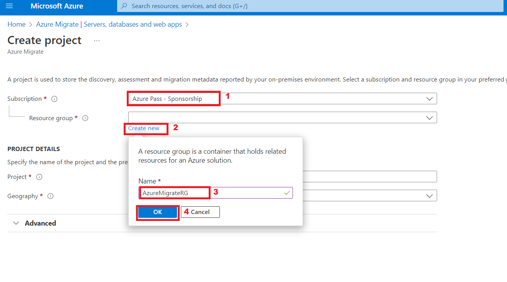
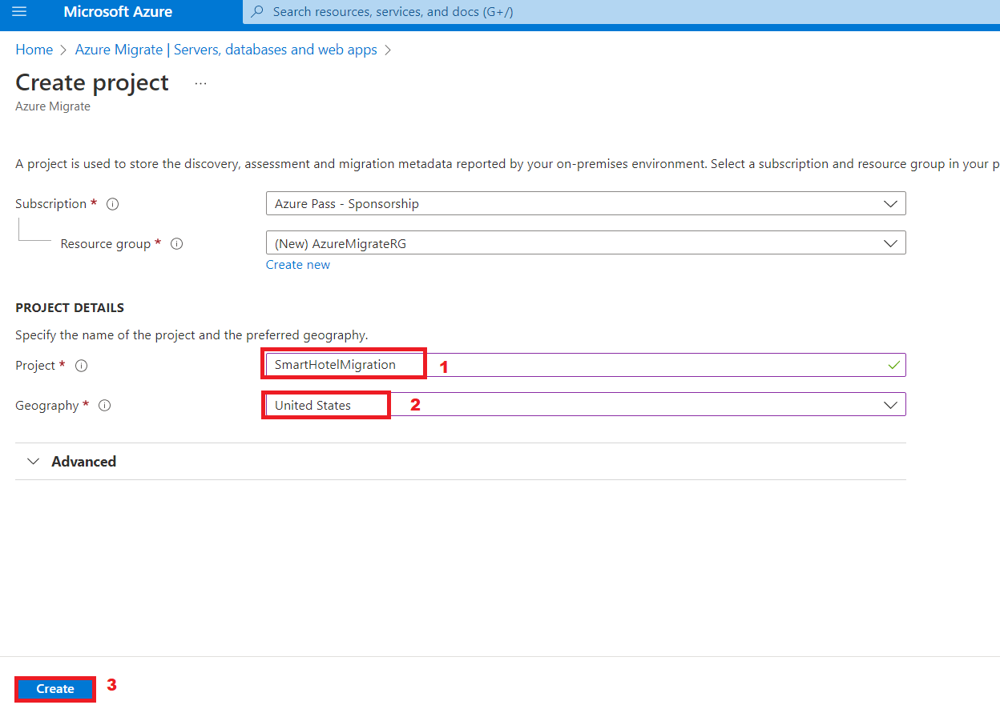
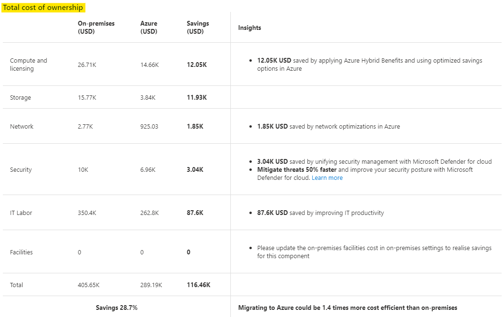
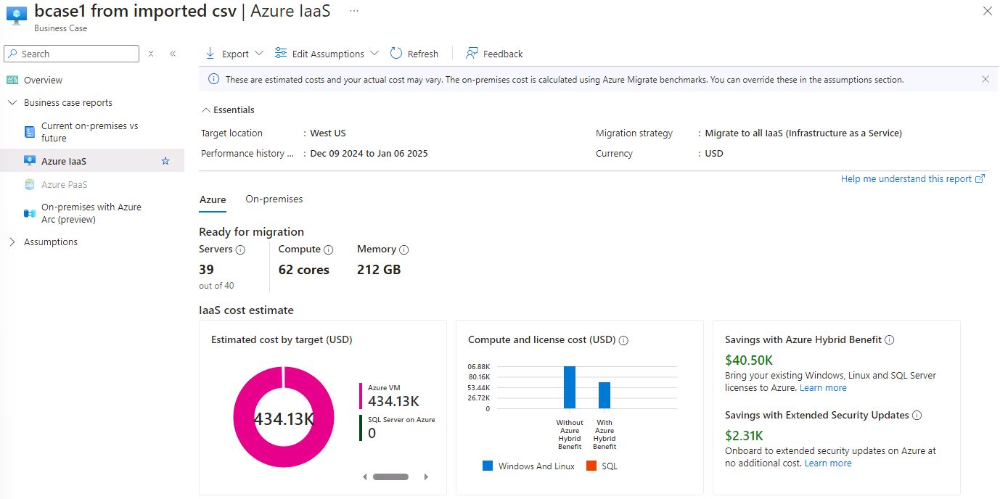
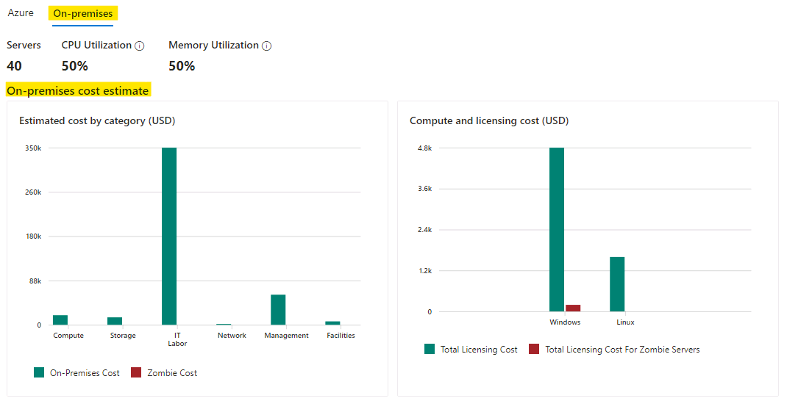

# Laboratório 02 - Descobrindo e avaliando o ambiente local.

**Objetivo**

Neste laboratório, descobriremos e avaliaremos as VMs locais usando as
Ferramentas de Azure Migrate e criaremos um repositório para armazenar
os dados de avaliação em um Projeto de Azure Migrate.

Também instalaríamos agentes para descobrir e visualizar a dependência
entre as VMs

Para fazer isso, precisamos implementar o Azure Migrate Appliance como
uma VM no SmartHotelHost e, em seguida, executar as tarefas de
descoberta necessárias.

> **Importante** : Você deve ter reservado pelo menos 30 a 40 minutos
> para implementar o ambiente local ( **Laboratório 1 - Implementação e
> verificação do ambiente local e landing zone** ) antes de iniciar este
> laboratório.

### Tarefa 1: Criar o projeto do Azure Migrate e adicionar ferramentas de avaliação e migração

Nesta tarefa, você criará o projeto do Azure Migrate e selecionará as
ferramentas de avaliação e migração.

> **Observação** : Neste laboratório, você usará as ferramentas de
> avaliação e migração fornecidas pela Microsoft no Azure Migrate.
> Diversas ferramentas de terceiros também estão integradas ao Azure
> Migrate para avaliação e migração. Você pode dedicar algum tempo para
> explorar essas opções de terceiros fora deste laboratório.

1.  Volte para a aba **Azure portal** ou abra uma nova aba e navegue até
    `https://portal.azure.com` e faça login com sua **Office 365 tenant
    credentials**.

2.  Na barra de pesquisa, digite `Azure Migrate` e selecione **Azure
    Migrate** para abrir o painel **Azure Migrate Overview,** mostrada
    abaixo.

- 

  

  Uma captura de tela de uma descrição de computador gerada
  automaticamente

3.  Selecione **Discover, assess and migrate**.

- 

  Uma captura de tela de uma descrição de computador gerada
  automaticamente

4.  Selecione **Create project**.

- 

  Uma captura de tela de uma descrição de computador gerada
  automaticamente

5.  Selecione a assinatura apropriada e crie um novo grupo de recursos
    chamado `AzureMigrateRG`

- 

6.  Insira `SmartHotelMigration` como nome do projeto de migração e
    escolha uma região próxima a você para armazenar os dados de
    avaliação da migração. Aqui, selecionamos **United States**. Em
    seguida, selecione **Create**.

- 

  

7.  A implementação do Azure Migrate será iniciada. Após a conclusão,
    você verá os painéis **Azure Migrate: Discovery and assessment** e
    **Azure Migrate: Server Migration** para o projeto de migração
    atual, conforme mostrado abaixo.

- 

Você concluiu esta tarefa. Não feche esta aba para prosseguir para a
próxima tarefa.

Nesta tarefa, você criou um **projeto do Azure Migrate** usando as
ferramentas internas padrão para avaliação e migração de servidor.

### Tarefa 2: Implementar o dispositivo Azure Migrate

Nesta tarefa, você implementará e configurará o dispositivo Azure
Migrate no ambiente Hyper-V local. Este dispositivo se comunica com o
servidor Hyper-V para coletar dados de configuração e desempenho sobre
suas VMs locais e retorna esses dados ao seu projeto do Azure Migrate.

1.  Em **Azure Migrate: Discovery and Assessment**, selecione
    **Discover** e escolha **Using appliance** para abrir o painel
    **Discover machines.**

- 

  Uma captura de tela de uma descrição de computador gerada
  automaticamente

2.  No **Are your servers virtualized?,** selecione **Yes, with
    Hyper-V**.

- 

  Uma captura de tela de uma descrição de computador gerada
  automaticamente

3.  Em **1: Generate project key**, forneça `SHApplXXXXXX` (substitua
    **XXXXXX** por um número aleatório) como nome para o dispositivo
    Azure Migrate que você configurará para descoberta de VMs do
    Hyper-V. Selecione **Generate key** para iniciar a criação dos
    recursos necessários do Azure.

- 

  Uma captura de tela de uma descrição de computador gerada
  automaticamente

  

4.  **Aguarde** a criação da chave, copie a **Azure Migrate project
    key** para a sua área de transferência e salve-a no **bloco de
    notas.** Use esta **Key** em tarefas futuras.

- 

  Uma captura de tela de uma descrição de computador gerada
  automaticamente

5.  Certifique-se de que o botão de opção Arquivo.**VHD 12 GB** esteja
    selecionado, clique com o botão direito do mouse no botão
    **Download** e selecione a opção **Copiar link.**

- 

6.  Copie o link no bloco de notas para ser usado posteriormente para
    baixar o dispositivo Azure Migrate.

- 

  Uma descrição de texto em preto e branco gerada automaticamente

7.  Em uma aba separada do navegador, navegue até o **Azure portal**. Na
    caixa de pesquisa global, digite `SmartHotelHost` e selecione a
    máquina virtual **SmartHotelHost.**

- 

8.  Selecione **Connect** e escolha **Connect** no menu suspenso.

- 

  Uma captura de tela de uma descrição de computador gerada
  automaticamente

9.  Selecione **Download RDP File**.

- 

  Uma captura de tela de uma descrição de computador gerada
  automaticamente

10. Clique no botão **Keep** para receber a notificação e depois clique
    em **Open file** para conectar.

- 

  Uma captura de tela de uma descrição de computador gerada
  automaticamente

11. **Connect** à máquina virtual usando o nome de usuário
    `demouser` e a senha `demo!pass123`

- 

  

12. Selecione **Yes**.

- 

13. Abra o navegador Chrome na VM **SmartHotelHost** e cole o link
    copiado para o dispositivo Azure Migrate do Bloco de Notas. Ele deve
    começar a baixar o arquivo.

- 

14. Após o download do arquivo, clique no arquivo baixado e escolha a
    opção **Shown in folder.**

- 

  Uma captura de tela de uma descrição de computador gerada
  automaticamente

15. Clique duas vezes no arquivo zip - **AzureMigrateAppliance**

- 

16. Quando a pasta **AzureMigrateAppliance** for exibida, selecione-a e
    clique no botão **Extract all.** Depois, forneça o caminho da pasta
    como `F:\VirtualMachines` e clique no botão **Extract**.

- 

17. Altere para a janela do **Server Manager**.

18. No Gerenciador do Servidor, selecione **Tools** e, em seguida,
    **Hyper-V Manager** (Se o Gerenciador do Servidor não abrir
    automaticamente, abra-o selecionando **Start** e, em seguida,
    **Server Manager**).

- 

19. No Gerenciador do Hyper-V, selecione **SMARTHOTELHOST.** Agora você
    verá uma lista das quatro VMs que compõem o aplicativo
    **SmartHotel** local.

- 

20. No Gerenciador do Hyper-V, em **Actions**, selecione **Import
    Virtual Machine …** para abrir o assistente **Import Virtual
    Machine.**

- 

21. Na primeira etapa, **Before You Begin**, selecione **Next**.

- 

22. Na etapa **Locate Folder**, selecione **Browse** e navegue até
    `F:\VirtualMachines\AzureMigrateAppliance` (Certifique-se de
    selecionar o que foi ***extraído*** nas etapas anteriores), depois
    escolha **Select Folder** e, em seguida, **Next**.

- 

  Uma captura de tela de uma descrição de computador gerada
  automaticamente

23. Na etapa **Select Virtual Machine**, a VM **AzureMigrateAppliance**
    já deve estar selecionada. Selecione **Next**.

- 

24. Na etapa **Choose Import Type**, mantenha a configuração padrão
    **Register the virtual machine in-place**. Selecione **Next**.

- 

  Uma captura de tela de uma descrição de computador gerada
  automaticamente

25. Na etapa **Connect Network**, você verá um erro informando que o
    virtual switch usado anteriormente pelo dispositivo Azure Migrate
    não pôde ser encontrado. No menu suspenso **Connection,** selecione
    o **Azure Migrate Switch** e, em seguida, selecione **Next**.

- 

  Uma captura de tela de uma descrição de computador gerada
  automaticamente

  > ***Observação*** : O dispositivo Azure Migrate precisa de acesso à
  > Internet para carregar dados no Azure. Também precisa de acesso ao
  > Hyper-V host. No entanto, não precisa de acesso direto às VMs do
  > aplicativo em execução no Hyper-V host. Para proteger o ambiente do
  > aplicativo, o dispositivo Azure Migrate deve ser implementado em uma
  > sub-rede separada dentro do Hyper-V, em vez de na mesma sub-rede de
  > suas aplicações.

  > O ambiente Hyper-V possui uma rede NAT usando o espaço de endereço
  > IP 192.168.0.0/16. O NAT switch interno usado pelo aplicativo
  > SmartHotel utiliza a sub-rede 192.168.0.0/24, e cada VM no
  > aplicativo recebeu um endereço IP estático dessa sub-rede.

  > O dispositivo Azure Migrate será conectado a uma sub-rede separada,
  > 192.168.1.0/24, que foi configurada para você. O uso do " Azure
  > Migrate Switch " conecta o dispositivo a essa sub-rede. O
  > dispositivo recebe um endereço IP dessa sub-rede usando um serviço
  > DHCP executado no SmartHotelHost.

26. Revise a página de resumo e selecione **Finish** para criar a VM do
    dispositivo Azure Migrate.

- 

27. No Gerenciador do Hyper-V, selecione a VM **AzureMigrateAppliance**
    e, em seguida, selecione **Start** à direita.

- 

Você concluiu esta tarefa. Não feche o Gerenciador do Hyper-V para
prosseguir com a próxima tarefa.

**Resumo da tarefa**

Nesta tarefa, você implantou o dispositivo Azure Migrate no ambiente
Hyper-V local.

### Tarefa 3: Configurar o dispositivo Azure Migrate

Nesta tarefa, você configurará o dispositivo Azure Migrate e o usará
para concluir a fase de descoberta da avaliação da migração.

1.  No Gerenciador do Hyper-V, selecione a VM **AzureMigrateAppliance,**
    Iniciar e, em seguida, selecione **Connect**.

- 

2.  Uma nova janela será aberta exibindo o dispositivo Azure Migrate.
    Aguarde a exibição da tela Termos de Licença e selecione **Accept**.

- 

3.  Na tela **Customize settings**, defina a senha do administrador como
    `demo!pass123`, digitando manualmente (duas vezes). Em seguida,
    selecione **Finish**.

- > **Observação** : Ao digitar a senha, a VM utiliza um mapeamento de
  > teclado dos EUA. Se você estiver usando um teclado não americano,
  > alguns caracteres podem ser inseridos incorretamente. Selecione o
  > ícone de ‘eyeball’ na segunda caixa de entrada de senha para
  > verificar se a senha foi digitada corretamente.

  

4.  No prompt **Connect to AzureMigrateAppliance**, defina o tamanho da
    tela do dispositivo usando o controle deslizante e selecione
    **Connect**.

- 

5.  Efetue login como administrador digitando a senha manualmente
    `demo!pass123` (A tela de login pode detectar o mapeamento do seu
    teclado local, use o ícone do ‘eyeball’ para verificar).

- 

  Interface gráfica do usuário, descrição do site gerada automaticamente

6.  **Aguarde.** Após um ou dois minutos, o navegador será aberto,
    exibindo o assistente de configuração do dispositivo Azure Migrate
    (Também pode ser iniciado a partir do atalho no desktop).

- 

7.  Ao abrir o assistente de configuração do dispositivo, um pop-up com
    os termos da licença será exibido. Aceite os termos selecionando **I
    agree**.

- 

  Uma captura de tela de uma descrição de computador gerada
  automaticamente

8.  Em **Set up prerequisites**, as duas etapas a seguir para verificar
    a conectividade com a Internet e a sincronização de horário devem
    ocorrer automaticamente.

- 

  Uma captura de tela de uma descrição de computador gerada
  automaticamente

9.  Cole a **Azure Migrate project key** copiada do portal do Azure
    anteriormente, na seção **Verification of Azure Migrate project
    key** e clique no botão **Verify**.

- 

  Uma captura de tela de uma descrição de computador gerada
  automaticamente

  > **Observação** : Se você não tiver a chave, no Portal do Azure, em
  > Azure Migrate, acesse **Server Assessment \> Discover \> Manage
  > existing appliances**, selecione o nome do dispositivo fornecido no
  > momento da geração da chave e copie a chave correspondente.

10. Depois que a **Azure Migrate project key** for verificada, um
    processo de atualização automática será iniciado.

- 

  Uma captura de tela de uma descrição de computador gerada
  automaticamente

11. Se uma nova atualização estiver instalada, clique no botão
    **Refresh** para recarregar a página.

- 

12. Clique em **Login**, uma janela pop-up será aberta com um código.

- 

13. Uma nova janela será aberta exibindo o código do dispositivo.
    Selecione **Copy code & Login.**

- 

  Uma captura de tela de uma descrição de computador gerada
  automaticamente

14. Nas novas janelas do navegador, quando solicitado, cole o **Code** e
    selecione **Next**.

- 

  Uma captura de tela de uma descrição de computador gerada
  automaticamente

15. Insira suas credenciais do portal do Azure e selecione **Next**.
    Digite a **Password** e selecione **Sign in.**

- > **Observação –** Devido à virtualização aninhada, o símbolo @
  > aparecerá como 2. Portanto, corrija as credenciais e certifique-se
  > de digitar a senha usando o teclado ou você pode alternar para a VM
  > do laboratório, colar a senha em um bloco de notas e copiá-la. Em
  > seguida, volte para a SmartHotelVM e cole a senha na VM do
  > dispositivo AzureMigrate.

  

  Uma captura de tela de uma descrição de computador gerada
  automaticamente

  

16. Selecione **Continue**.

- 

  Uma captura de tela de um erro de computador Descrição gerada
  automaticamente

  

17. Retorne à aba **Azure Migrate Appliance** e o **Appliance
    registration** será iniciado automaticamente.

- 

  Uma captura de tela de uma descrição de computador gerada
  automaticamente

18. Após a conclusão do registro, prossiga para o próximo painel,
    **Manage credentials and discovery sources**.

- 

  Uma captura de tela de uma descrição de computador gerada
  automaticamente

19. Em Gerenciar credenciais e fontes de descoberta **Step 1: Provide
    Hyper-V host credentials**, selecione **Add credentials**.

- 

  Uma captura de tela de uma descrição de computador gerada
  automaticamente

20. Digite `hostlogin` como **Friendly name**, nome de usuário
    `demouser` e digite a senha manualmente `demo!pass123` para o
    Hyper-V hosts/cluster que o dispositivo usará para descobrir VMs.
    Selecione **Save**.

- 

  Uma captura de tela de uma descrição de computador gerada
  automaticamente

  > **Observação** : o dispositivo Azure Migrate pode não ter detectado
  > o mapeamento do seu teclado local. Selecione o "olho" na caixa de
  > senha para verificar se a senha foi inserida corretamente.

  > ***Observação:*** várias credenciais são suportadas para descoberta
  > de VMs do Hyper-V, por meio do botão "Adicionar mais".

21. Em **Step 2: Provide Hyper-V host/cluster details**, selecione **Add
    discovery source** para especificar o IP address/FQDN do Hyper-V
    host/cluster e o nome amigável para credenciais para conexão ao
    host/cluster.

- 

  Uma captura de tela de uma descrição de computador gerada
  automaticamente

22. Selecione **Add single item,** insira `SmartHotelHost` em 'IP
    Address / FQDN' e selecione **hostlogin** no menu suspenso como
    credenciais do Mapa e, em seguida, **Save**.

- 

  Uma captura de tela de uma descrição de computador gerada
  automaticamente

  > **Observação:** Você pode **adicionar um item** por vez ou **vários
  > itens** de uma só vez. Há também a opção de fornecer detalhes do
  > Hyper-V host/cluster por meio da **importação de CSV.**

23. O dispositivo validará a conexão com os Hyper-V host/clusters
    adicionados e mostrará o **Validation status** na tabela para cada
    host/cluster.

- 

  **Observação:** Ao adicionar fontes de descoberta:
  - Para hosts/clusters validados com sucesso, você pode visualizar mais
    detalhes selecionando seu endereço IP/FQDN.
  - Se a validação falhar para um host, revise o erro selecionando "
    Validation failed " na coluna "Status" da tabela. Corrija o problema
    e valide novamente.
  - Para remover hosts ou clusters, selecione **Delete**.
  - Não é possível remover um host específico de um cluster. Você só
    pode remover o cluster inteiro.
  - Você pode adicionar um cluster, mesmo se houver problemas com hosts
    específicos no cluster.

24. Certifique-se de que o Switch esteja habilitado e clique em **Add
    credentials**

- 

  Uma captura de tela de um erro de computador Descrição gerada
  automaticamente

25. No pop-up Adicionar credenciais, forneça os detalhes e clique no
    botão **Save**.

    - Credential type – Windows (Non-domain)

    - Friendly name – `WindowsVM`

    - Username – `.\Administrator`

    - Password – `demo!pass123`

- 

  Uma captura de tela de uma descrição de computador gerada
  automaticamente

26. Feche a notificação.

- 

  Uma captura de tela de uma descrição de computador gerada
  automaticamente

27. Clique em **Add credentials** novamente e no pop-up Adicionar
    credenciais forneça os detalhes e depois clique no botão **Save**.

    - Credential type – Linux (Non-domain)

    - Friendly name – `LinuxVM`

    - Username – `.\demouser`

    - Password – `demo!pass123`

- 

  Uma captura de tela de uma descrição de computador gerada
  automaticamente

28. Feche a notificação.

- 

  Uma captura de tela de uma descrição de computador gerada
  automaticamente

29. Role para baixo e clique no botão **Start Discovery**.

- 

  Uma captura de tela de uma descrição de computador gerada
  automaticamente

  

  Uma captura de tela de uma descrição de computador gerada
  automaticamente

30. Aguarde até que o status do Azure Migrate mostre **Discovery has
    been successfully initiated**. Isso levará de 10 a 13 minutos. Após
    o início da descoberta, você poderá verificar o status da descoberta
    em cada host/cluster na tabela.

- 

  Uma captura de tela de uma descrição de computador gerada
  automaticamente

31. Volte para a VM do Lab, abra o navegador Edge, navegue até o Portal
    do Azure Portal `https://portal.azure.com` e entre com suas
    credenciais de locatário do Office 365 e retorne para o painel do
    **Azure Migrate.**

- 

  Interface gráfica do usuário, texto, aplicativo, e-mail Descrição
  gerada automaticamente

32. Selecione **Servers, databases and web apps** e selecione
    **Refresh**.

- 

  Uma captura de tela de uma descrição de computador gerada
  automaticamente

  

33. Em **Azure Migrate: Server Assessment,** você verá uma contagem do
    número de servidores descobertos até o momento. Se a descoberta
    ainda estiver em andamento, selecione **Refresh** periodicamente até
    que **5** servidores descobertos sejam exibidos. Isso pode levar
    vários minutos.

- 

  Uma captura de tela de uma descrição de computador gerada
  automaticamente

**Importante: Aguarde a conclusão do processo de descoberta antes de
prosseguir para a próxima tarefa.**

Você concluiu esta tarefa, não feche esta aba para prosseguir com a
próxima tarefa.

**Resumo da tarefa**

Nesta tarefa, você configurou o dispositivo Azure Migrate no ambiente
Hyper-V local e iniciou o processo de descoberta de avaliação de
migração.

### Tarefa 4: Importar inventário de servidores usando um arquivo CSV

Você também pode importar um inventário do ambiente, sua configuração e
utilização com um arquivo CSV. As propriedades no CSV são:

- **Nome do servidor** – nome do computador

- **Endereços IP** – lista separada por ponto e vírgula de endereços
  IPv4 e IPv6 usados pela máquina

- **Núcleos** – número de vCPUs usados

- **Memória** – quantidade de memória em MB

- **Detalhes do SO**

  - **Nome** – tipo de sistema operacional

  - **Versão** – versão do sistema operacional em uso

  - **Arquitetura** – arquitetura (como x64/x86)

- **Utilização da CPU** – porcentagem da CPU em uso

- **Utilização de memória** – pico percentual de uso da CPU

- **Rede**

  - Contagem de adaptadores – número de NICs conectadas à máquina

  - Taxa de transferência de entrada – quantidade de taxa de
    transferência em Mbps no sistema

  - Taxa de transferência de saída – quantidade de taxa de transferência
    em Mbps de saída do sistema

- **Tipo de inicialização** – tipo de inicialização usado pelos sistemas
  (UEFI/BIOS)

- **Discos**

  - **Número de discos** – número de discos anexados ao disco

  - **Por tamanho de disco** – tamanho do disco em GB

  - **Leituras por disco (Bytes)** – quantidade de MB por segundo lidos
    de cada disco

  - **Gravações por disco (Bytes)** – quantidade de MB por segundo
    gravados em cada disco

  - **Leituras por disco (IOPS)** – contagem de operações de saída do
    disco por segundo

  - **Gravações por disco (IOPS)** – contagem de operações de entrada do
    disco por segundo

Depois que o CSV estiver preenchido, você poderá importar os sistemas
para a fase de avaliação do Migrate fazendo o seguinte:

1.  No painel **Azure Migrate** , em Migration goals, certifique-se de
    que **Servidores Servers, databases and web apps** esteja
    selecionado, selecione o botão **Discover** e escolha **Using
    import**.

- 

  Uma captura de tela de uma descrição de computador gerada
  automaticamente

2.  Carregue o arquivo CSV chamado **Azure Migrate import template.csv**
    do `C:\Labfiles` e selecione **Import** para ler o arquivo.

- 

  Uma captura de tela de uma descrição de computador gerada
  automaticamente

3.  A importação deve começar a processar os registros do arquivo.

- 

  Uma captura de tela de uma descrição de computador gerada
  automaticamente

4.  Você deve receber a notificação conforme mostrado na imagem abaixo

- 

  Um close-up de um número Descrição gerada automaticamente

5.  Nos detalhes da importação, podemos ver que **40 registros** foram
    inseridos com sucesso.

- 

6.  Feche o painel Descoberta e clique no botão **Refresh**.

- 

  Uma captura de tela de uma descrição de computador gerada
  automaticamente

7.  Você poderá ver que a lista de Servidores Descobertos foi
    atualizada.

    - **Discovered Servers – 45**

- 

  Uma captura de tela de uma descrição de computador gerada
  automaticamente

8.  Clique em **Discovered items** e selecione a aba **Import based**.
    Você poderá ver os detalhes dos 40 servidores importados.
    Certifique-se de selecionar Project no menu suspenso.

- 

  Uma captura de tela de uma descrição de computador gerada
  automaticamente

Você concluiu esta tarefa, não feche esta aba para prosseguir com a
próxima tarefa.

### Tarefa 5: Construir casos de negócios para estimativa de custos.

Nesta tarefa, usaremos o Azure Migrate para criar um caso de negócios
usando os dados coletados durante a fase de descoberta do dispositivo
Azure Migrate e da lista de servidores importados.

O recurso Caso de negócio ajuda você a elaborar uma proposta de negócio
para entender como o Azure pode agregar mais valor ao seu negócio. Ele
destaca:

- Custo total de propriedade local vs. Azure.

- Análise de fluxo de caixa ano a ano.

- Insights baseados na utilização de recursos para identificar
  servidores e cargas de trabalho ideais para a nuvem.

- Resultados rápidos para migração e modernização, incluindo versões do
  Windows e do SQL que estão no fim do suporte.

- Economia de custos a longo prazo ao migrar de um modelo de despesa de
  capital para um modelo de despesa operacional, pagando somente pelo
  que você usa.

- Ajuda a eliminar suposições no seu processo de planejamento de custos
  e adiciona cálculos baseados em insights de dados.

- Pode ser gerado em apenas alguns cliques após você realizar a
  descoberta usando o dispositivo Azure Migrate.

- O recurso é habilitado automaticamente para projetos existentes do
  Azure Migrate.

1.  Clique em **Servers, databases and web apps** em Meta de migração e
    selecione o botão **Build business case**.

- 

  Uma captura de tela de uma descrição de computador gerada
  automaticamente

2.  Na página **Build business case (Preview)**, forneça os detalhes
    abaixo e clique no botão **Build business case**.

    - Business case name - `BCase1 from Imported CSV`

    - Target location - West US

    - Discovery source – Build a quick business case using the servers
      imported via a .CSV file.

    - Savings options – Reserved instance + Azure Saving Plan

    - Discount (%) on Pay as you go - 0

- 

  Uma captura de tela de uma descrição de computador gerada
  automaticamente

3.  Devemos receber a notificação conforme mostrado abaixo

- 

  Uma captura de tela de uma descrição de computador gerada
  automaticamente

4.  Após alguns minutos, clique no botão Refresh

- 

5.  Uma vez calculadas as suposições, a página deverá aparecer como
    abaixo

- 

  Uma captura de tela de uma descrição de computador gerada
  automaticamente

6.  Revise os detalhes na **TCO comparison** e clique no link **View
    Details**.

- 

7.  Abrirá os relatórios de casos de negócios – **On-premises vs
    Azure**, que devem mostrar o **Estimated annual cost by category**.

- 

8.  Role para baixo para ver os detalhes do **Total cost of ownership**

- 

9.  De volta à página Visão geral do caso de negócios, revise o **YoY
    estimated current vs future state cost** e **Savings with Azure
    Hybrid Benefit**

- 

  > **Observação** - Como você planeja migrar para o Azure em fases,
  > este gráfico de linhas mostra seu fluxo de caixa anual com base na
  > estimativa de migração concluída naquele ano. Por padrão, presume-se
  > que você migrará 0% no ano atual, 20% no Ano 1, 50% no Ano 2 e 100%
  > no Ano 3. O custo do estado atual mostra como será seu fluxo de
  > caixa líquido local, considerando que sua infraestrutura está
  > crescendo 5% ao ano. O custo do estado futuro mostra como será seu
  > fluxo de caixa líquido à medida que você migra uma porcentagem para
  > o Azure por ano, como nas premissas do ‘Azure cost’, enquanto sua
  > infraestrutura está crescendo 5% ao ano.

  > **Observação** : **O Benefício Híbrido do Azure** é um benefício de
  > licenciamento que ajuda você a reduzir significativamente os custos
  > de execução de suas cargas de trabalho na nuvem. Funciona permitindo
  > que você use suas licenças do Windows Server e do SQL Server
  > habilitadas para o Software Assurance no local no Azure.

10. Revise as informações fornecidas na seção Insights de descoberta

    - **Total Server – Distribution**

    - **OS Distribution**

- 

  Uma captura de tela de uma descrição de computador gerada
  automaticamente

11. Clique em **Azure IaaS**, revise a aba **Azure** que fornece
    informações sobre os Servidores que estão **Ready for migration** e
    também a **IaaS cost estimate** para os mesmos e o **Saving with
    Azure Hybrid Benefit**.

- 

12. Role para baixo para mais detalhes sobre

    - **Estimated cost by savings option**

    - **Recommended VM family and Storage type**

    - **On-premises cost vs Azure cost**

- 

13. Role para cima e clique na aba **On-premises**, ela mostrará a
    **On-premises cost estimate**

- 

14. Role para baixo e verifique a seção Análise do servidor mostrando

    - **Distribution by operating system**

    - **Distribution by virtualization**

    - **Distribution by category**

- 

15. Clique no link **View details** em Fim do suporte. Ele listará todos
    os servidores considerados no caso de negócios com **recommended
    targets, activity state** e **qualifying offers in Azure**.

- 

16. Feche o painel Detalhes e clique em **Azure cost** em Suposições.

- 

17. Aqui você pode modificar as **Assumptions for Azure cost** e a
    **Cost modelling** e clicar em **Save** para reavaliar o caso de
    negócios.

18. Clique em **On-premises cost**, na guia **Compute** você tem as
    configurações para

    - **Software - SQL Server licensing**

    - **Software - Windows server licensing**

    - **Virtualization software – Hyper-V**

    - **Virtualization software – VMware**

- 

  Uma captura de tela de uma descrição de computador gerada
  automaticamente

19. Clique na aba **Storage** para verificar as configurações

- 

  Uma captura de tela de uma descrição de computador gerada
  automaticamente

20. Clique na aba **Network** para verificar as configurações

- 

  Uma captura de tela de uma descrição de computador gerada
  automaticamente

21. Clique na aba **Security** para verificar as configurações

- 

  Uma captura de tela de uma descrição de computador gerada
  automaticamente

22. Clique na aba **Management** para verificar as configurações

23. Clique na aba **Labor** para verificar as configurações

- 

  Uma captura de tela de uma descrição de computador gerada
  automaticamente

24. Clique na aba **Facilities** para verificar as configurações

- 

  Uma captura de tela de uma descrição de computador gerada
  automaticamente

25. O custo local adequado pode ser estimado fazendo alterações nessas
    configurações e, em seguida, clicando no botão Save para reavaliar o
    custo local.

26. Agora vamos criar outro caso de negócio para os servidores
    descobertos usando o dispositivo Azure Migrate.

27. Na página Azure Migrate, clique em Servidores, bancos de dados e
    aplicativos da Web e, em seguida, clique em **Build Business case**

- 

  Uma captura de tela de uma descrição de computador gerada
  automaticamente

28. Na página **Build business case (Preview)**, forneça os detalhes
    abaixo e clique no botão **Build business case**.

    - Business case name - `BCase2 Migrate Appliance`

    - Target location - West US

    - Discovery source – Use more accurate data insights collected via
      the Azure Migrate appliance.

    - Migration strategy - Azure recommended approach to minimize cost

    - Savings options – Reserved instance + Azure Saving Plan

    - Discount (%) on Pay as you go - 0

- 

  Uma captura de tela de uma descrição de computador gerada
  automaticamente

29. Devemos receber a notificação conforme mostrado abaixo

- 

30. Após alguns minutos, clique no botão Refresh

- 

  Uma captura de tela de uma descrição de computador gerada
  automaticamente

31. Uma vez calculadas as suposições, a página deverá aparecer como
    abaixo

- 

  Uma captura de tela de uma descrição de computador gerada
  automaticamente

32. Semelhante ao caso de negócio criado para os servidores importados,
    você pode revisar os detalhes deste caso de negócio para as áreas
    abaixo.

    - **Comparação de TCO**

    - **Insights de descoberta**

    - Relatórios do caso de negócio

      - **No local vs. Azure**

      - **Azure IaaS**

    - Suposições

      - **Custo do Azure**

      - **Custo do local**

33. Depois que o **BCase2 Migrate Appliance** – Business Case for
    revisado, volte à página do Azure Migrate, clique no botão
    **Overview** em the **Servers, databases and web apps.**

- 

  Uma captura de tela de uma descrição de computador gerada
  automaticamente

34. Clique em **Business cases** em Manage.

- 

  Uma captura de tela de uma descrição de computador gerada
  automaticamente

35. Deveríamos conseguir ver os 2 casos de negócios criados a partir de
    diferentes fontes de descoberta.

    - Import

    - Appliance

- 

  Uma captura de tela de uma descrição de computador gerada
  automaticamente

### Tarefa 6: Criar uma avaliação de migração

Nesta tarefa, você usará o Azure Migrate para criar uma avaliação de
migração para a aplicação **SmartHotel**, usando os dados coletados
durante a fase de descoberta.

1.  No Azure Migrate, selecione **Assess -\> Azure VM** em **Azure
    Migrate: Discovery and assessment** para iniciar uma nova avaliação
    de migração.

- 

  Uma captura de tela de uma descrição de computador gerada
  automaticamente

2.  No painel **Create Assessment Basics**, forneça os detalhes abaixo

    - Assessment type - Azure VM

    - Discovery Source - Servers discovered from Azure Migrate
      Appliance.

    - Under Assessment settings – click on the Edit link

- 

  Uma captura de tela de uma descrição de computador gerada
  automaticamente

3.  A aba **Assessment settings** permite personalizar muitas das
    configurações usadas ao criar um relatório de avaliação de migração.
    Reserve um momento para explorar a ampla gama de propriedades de
    avaliação.

4.  Em seguida, faça as alterações abaixo e clique no botão **Save**.

    - Target location – West US (Region in which the Subscription vCPU
      cores were increased)

    - Saving options – 3 Years reserved

    - Percentile utilization – 99^(th)

    - VM series – Select All

- 

  Uma captura de tela de uma descrição de computador gerada
  automaticamente

**Observação:** Você precisa fazer uma alteração para que o botão
**Save** seja habilitado; se não quiser fazer nenhuma alteração, basta
fechar o painel.

5.  De volta à aba Basics, clique no botão **Next**: **Select servers to
    assess \>**.

- 

  Uma captura de tela de uma descrição de computador gerada
  automaticamente

6.  Insira o **Assessment name** como `SmartHotelAssessment`. Selecione
    **Create New** e insira o nome do grupo `SmartHotel VMs`. Selecione
    as VMs **smarthotelweb1** , **smarthotelweb2** e **UbuntuWAF** e
    selecione **Next: Review+ Create assessment**.

- 

  > **Observação**: Não há necessidade de incluir as VMs smarthotelSQL1
  > ou AzureMigrateAppliance na avaliação, pois elas não serão migradas
  > para o Azure. (O SQL Server será migrado para o serviço de SQL
  > Database e o Azure Migrate Appliance será usado apenas para
  > avaliação da migração.)

7.  Selecione **Create assessment**.

- 

  Uma captura de tela de uma descrição de computador gerada
  automaticamente

8.  No painel **Azure Migrate - Servers, databases and web apps**,
    selecione **Refresh** periodicamente até que o número de avaliações
    mostradas seja 1. Isso pode levar de 5 a 6 minutos.

9.  Na página Servidor do Azure Migrate, Servidores, bancos de dados e
    aplicativos web, em Avaliação, selecione 1.

- 

  Uma captura de tela de uma descrição de computador gerada
  automaticamente

10. Clique em **SmartHotelAssessment** na lista.

- 

  Uma captura de tela de uma descrição de computador gerada
  automaticamente

11. Reserve um momento para estudar a visão geral da avaliação.

- 

  Uma captura de tela de uma descrição de computador gerada
  automaticamente

12. Selecione **Settings**.

- 

  Uma captura de tela de uma descrição de computador gerada
  automaticamente

13. Nas configurações de avaliação, altere os itens abaixo e, em
    seguida, clique no botão **Save**.

    - Performance History – **1 Week**

    - Percentile utilization – **95^(th)**

- 

  Uma captura de tela de uma descrição de computador gerada
  automaticamente

14. Após alguns instantes, o relatório de avaliação será atualizado para
    refletir suas alterações.

- 

  Uma captura de tela de uma tela de computador Descrição gerada
  automaticamente

15. **Comparação** conforme mostrado na imagem abaixo.

- 

16. Selecione **Azure readiness** (no gráfico ou na navegação à
    esquerda). Observe que, para a VM **UbuntuWAF** ,há uma preocupação
    específica relacionada à prontidão da VM para migração.

- 

  Uma captura de tela de uma descrição de computador gerada
  automaticamente

  > Reserve alguns minutos para explorar outros aspectos da avaliação da
  > migração.

  > **Observação**: O processo de coleta de informações de Operating
  > System Environments (OSE) e migração de dados de VMs entre ambientes
  > leva algum tempo devido à natureza da transferência de dados. No
  > entanto, existem algumas etapas que podem ser seguidas para acelerar
  > e visualizar o funcionamento do sistema. Estas são algumas opções:

  > Etapas comuns para atualizar dados: (consulte também Troubleshoot
  > Discovery)

  - Dados do servidor não estão sendo atualizados no portal – se os
    dados dos servidores não estiverem sendo atualizados, este é um
    método para acelerá-los.

  

  - Não é possível visualizar os detalhes do inventário de software –
    por padrão, o inventário de software é atualizado apenas uma vez a
    cada 24 horas. Isso força uma atualização.

  

  - Erros de inventário de software – durante o inventário, às vezes são
    retornados códigos de erro. Aqui estão listados todos os códigos de
    erro e seus significados.

  > Muitos problemas na migração podem estar relacionados ao fato de o
  > dispositivo não atualizar os dados devido a agendamentos regulares
  > ou à impossibilidade de transferência de dados. Forçar a atualização
  > dos dados e informações pode ser feito com as seguintes etapas:

17. Na página **Azure Migrate** em **Servers, database and web
    apps**, **Azure Migrate: Discovery and assessment**, selecione
    **Overview**.

- 

  Uma captura de tela de uma descrição de computador gerada
  automaticamente

18. Em **Manage**, selecione **Appliances**. Selecione **Refresh
    services**.

- 

  Uma captura de tela de uma descrição de computador gerada
  automaticamente

  

  Uma captura de tela de uma descrição de computador gerada
  automaticamente

19. Aguarde a conclusão da operação de atualização. Agora você deverá
    ver informações atualizadas.

- 

  Uma captura de tela de uma descrição de computador gerada
  automaticamente

Você concluiu esta tarefa. Não feche esta aba para prosseguir para a
próxima tarefa.

**Resumo da tarefa:**

Nesta tarefa, você criou e configurou uma avaliação de migração no Azure
Migrate.

### Tarefa 7: Configurar visualização de dependências

Ao migrar uma carga de trabalho para o Azure, é importante entender
todas as dependências da carga de trabalho. Uma dependência quebrada
pode significar que o aplicativo não será executado corretamente no
Azure, talvez de maneiras difíceis de detectar. Algumas dependências,
como aquelas entre camadas do aplicativo, são óbvias. Outras
dependências, como pesquisas de DNS, validação de tíquetes Kerberos ou
verificações de revogação de certificados, não são.

Nesta tarefa, você configurará o recurso **Azure Migrate dependency
visualization**. Para isso, você precisa primeiro criar um **Log
Analytics workspace** e, em seguida, implementar agentes nas VMs a serem
migradas.

1.  Ainda na página do **Azure Migrate** , selecione **Servers, database
    and web apps**. Em **Azure Migrate: Discovery and assessment**,
    clique no link número **1** em **Groups**.

- 

  Uma captura de tela de uma tela de computador Descrição gerada
  automaticamente

2.  Selecione o grupo **SmartHotel VMs** para ver os detalhes do grupo.

- 

  Uma captura de tela de uma descrição de computador gerada
  automaticamente

3.  Observe que cada VM tem o status de **Dependencies** como **Requires
    agent installation**. Selecione **Requires agent installation** para
    a VM **smarthotelweb1.**

- 

  Uma captura de tela de uma descrição de computador gerada
  automaticamente

4.  No painel **Dependencies**, selecione **Configure Log Analytics
    workspace**.

- 

  Uma captura de tela de uma descrição de computador gerada
  automaticamente

5.  Crie um novo Log Analytics workspace. Use
    `AzureMigrateWSXXXXXX `\[substitua **XXXXXX** por um número
    aleatório\] como nome do workspace. Escolha o local do Log Analytics
    workspace na lista e selecione **Configure**.

6.  Aguarde a implementação do workspace. Anote o **Workspace ID** e o
    **Workspace Key** no Bloco de Notas.

- 

  Uma captura de tela de uma descrição de computador gerada
  automaticamente

7.  Clique com o botão direito e copie o endereço do link de cada um dos
    **4 URLs de download do agente** e cole-os junto com o **Workspace
    ID and key** que você anotou no **bloco de notas** na etapa 9
    anterior.

- 

  Uma captura de tela de uma descrição de computador gerada
  automaticamente

  > **Observação** : Você pode enviar esses links para sua conta de
  > teste e abri-la na VM.

8.  Retorne à sessão RDP do **SmartHotelHost** se solicitado a conectar
    e use as credenciais.

    - Username - demouser

    - Password - demo!pass123

9.  No **Hyper-V Manager**, selecione **smarthotelweb1** e selecione
    **Connect**.

- 

  Uma captura de tela de uma descrição de computador gerada
  automaticamente

10. Selecione **Connect** novamente quando solicitado e faça login na
    conta de **Administrator** digitando a senha `demo!pass123`

- 

  Interface gráfica do usuário, descrição do aplicativo gerada
  automaticamente

  

11. Abra o **Internet Explorer**

- 

12. Cole o link para o **64-bit Microsoft Monitoring Agent for Windows**
    que você salvou anteriormente. Quando solicitado, clique no botão
    **Run.**

- 

  Uma captura de tela de um erro de computador Descrição gerada
  automaticamente

  > **Observação:** Talvez seja necessário desabilitar a **Internet
  > Explorer Enhanced Security Configuration** no **Server Manager,** em
  > **Local Server,** para concluir o download.

13. Na configuração do Microsoft Monitoring Agent, clique em **Next** e
    depois em **I Agree.**

14. Prossiga com as seleções padrão até a página **Agent Setup
    Options**. A partir daí, selecione **Connect the agent to Azure Log
    Analytics (OMS)** e **Next**.

- 

  Uma captura de tela de uma descrição de computador gerada
  automaticamente

15. Insira o ID do Workspace e a Chave do Workspace que você copiou
    anteriormente e selecione **Azure Commercial** no menu suspenso
    Azure Cloud. Selecione **Next**, navegue pelas páginas restantes e
    **install** o agente.

- 

  Uma captura de tela de uma descrição de computador gerada
  automaticamente

16. Continue o restante da configuração com as opções padrão e clique em
    **Finish**

- 

  Uma captura de tela de uma descrição de computador gerada
  automaticamente

17. Cole o link para **Dependency Agent Windows installer** na barra de
    endereços do navegador. **Run** o instalador e siga as etapas do
    assistente de instalação até concluir o processo.

- 

  Uma captura de tela de uma descrição de computador gerada
  automaticamente

  > **Observação:** Você não precisa configurar o ID e a chave do
  > workspace ao instalar o Dependency Agent, pois ele usa as mesmas
  > configurações do Microsoft Monitoring Agent, que deve ser instalado
  > previamente.

  

18. Feche a janela de conexão da máquina virtual para a VM
    **smarthotelweb1.**

19. No **Hyper-V Manager**, selecione **smarthotelweb2** e selecione
    **Connect**.

- 

20. Selecione **Connect** novamente quando solicitado e faça login na
    conta de **Administrator** digitando a senha `demo!pass123`

- 

  Interface gráfica do usuário, descrição do aplicativo gerada
  automaticamente

  

21. Abra o **Internet Explorer**, conforme mencionado anteriormente.
    Quando solicitado, **execute** o instalador.

- 

22. Feche a janela de conexão da máquina virtual para a VM
    **smarthotelweb2.**

23. Cole o link para o **64-bit Microsoft Monitoring Agent for Windows**
    que você salvou anteriormente. Quando solicitado, clique no botão
    **Run.**

- 

  Uma captura de tela de um erro de computador Descrição gerada
  automaticamente

  > **Observação:** talvez seja necessário desabilitar **a Configuração
  > de segurança aprimorada do Internet Explorer** no **Gerenciador do
  > servidor,** em **Servidor local,** para concluir o download.

24. Na configuração do Microsoft Monitoring Agent, clique em **Next** e
    depois em **I Agree.**

25. Prossiga com as seleções padrão até a página **Agent Setup
    Options**. A partir daí, selecione **Connect the agent to Azure Log
    Analytics (OMS)** e **Next**.

- 

  Uma captura de tela de uma descrição de computador gerada
  automaticamente

26. Insira o ID do Workspace e a Chave do Workspace que você copiou
    anteriormente e selecione **Azure Commercial** no menu suspenso do
    Azure Cloud. Selecione **Next**, percorra as páginas restantes e
    **instale** o agente.

- 

  Uma captura de tela de uma descrição de computador gerada
  automaticamente

27. Continue o restante da configuração com as opções padrão e clique em
    **Finish**

- 

  Uma captura de tela de uma descrição de computador gerada
  automaticamente

28. Cole o link para o **Dependency Agent Windows installer** na barra
    de endereços do navegador. **Run** o instalador e siga as etapas do
    assistente até concluir a instalação.

- 

  Uma captura de tela de uma descrição de computador gerada
  automaticamente

  > **Observação:** Você não precisa configurar o ID e a chave do
  > workspace ao instalar o Dependency Agent, pois ele usa as mesmas
  > configurações do Microsoft Monitoring Agent, que deve ser instalado
  > previamente.

  

  > Agora, você **implementará** as **versões Linux do Agente de
  > Monitoramento Microsoft** e do Agente de Dependência na VM
  > **UbuntuWAF.** Para isso, primeiro você se conectará ao
  > **UbuntuWAF** remotamente usando uma **sessão SSH.**

29. Retorne à sessão RDP com o **SmartHotelHost** e abra um prompt de
    comando usando o atalho no desktop.

- 

  Uma captura de tela de uma descrição de computador gerada
  automaticamente

  > **Observação** : O **SmartHotelHost** executa o Windows Server 2019
  > com o Subsistema Windows para Linux habilitado. Isso permite que o
  > prompt de comando seja usado como um cliente SSH. Mais informações
  > sobre o Linux compatível com o Azure podem ser encontradas aqui:
  > `https://Azure.com/Linux`

30. Digite o seguinte comando para se conectar à VM **UbuntuWAF** em
    execução no Hyper-V no SmartHotelHost. Use o seguinte comando

- `ssh demouser@192.168.0.8`

31. Digite **"yes"** quando for perguntado se deseja se conectar. Use a
    senha `demo!pass123`.

- 

32. Digite o seguinte comando, seguido pela senha
    `demo!pass123` quando solicitado:

- `sudo -s`

  

  Uma captura de tela de uma descrição de computador gerada
  automaticamente

33. Isso dá à sessão do terminal **elevated/root privileges**

34. Digite o seguinte comando, substituindo \e \\ pelos valores copiados
    anteriormente.

- `wget`` https://raw.githubusercontent.com/Microsoft/OMS-Agent-for-Linux/master/installer/scripts/onboard_agent.sh && ``sh`` onboard_agent.sh -w <Workspace ID> -s <Workspace Key> -d opinsights.azure.com`

35. Quando solicitado, selecione Yes e pressione Enter

- 

  

36. As telas de instalação devem aparecer conforme abaixo.

- 

  

  Uma captura de tela de um programa de computador Descrição gerada
  automaticamente

37. Digite o seguinte comando, substituindo **\< Workspace ID\>** pelo
    valor copiado anteriormente

- `/opt/microsoft/omsagent/bin/service_control restart <Workspace ID>`

  

38. Digite o seguinte comando para baixar o Dependency Agent para Linux.

- `wget --content-disposition https://aka.ms/dependencyagentlinux -O InstallDependencyAgent-Linux64.bin`

  

  Uma tela de computador com texto Descrição gerado automaticamente

39. Instale o agente de dependência executando o comando abaixo.

- `sh InstallDependencyAgent-Linux64.bin -s`

  

  Uma captura de tela de uma descrição de computador gerada
  automaticamente

40. A instalação do agente está concluída.

Em seguida, você precisa gerar tráfego no aplicativo SmartHotel para que
a visualização de dependências tenha dados para trabalhar. Navegue até o
endereço IP público do SmartHotelHost e reserve alguns minutos para
atualizar a página e verificar a entrada e saída dos hóspedes.

**Resumo da tarefa**

Nesta tarefa, você configurou o recurso de visualização de dependências
do Azure Migrate, criando um Log Analytics workspace e implementando o
Agente de Monitoramento do Azure e o Agente de Dependência em máquinas
locais Windows e Linux.

### Tarefa 8: Explorar a visualização de dependências

Nesta tarefa, você explorará o recurso de visualização de dependências
do Azure Migrate. Este recurso utiliza dados coletados pelo agente de
dependência que você instalou na tarefa anterior.

1.  Retorne ao Portal do Azure com a página do **Azure Migrate** aberta
    e selecione **Servers, database and web apps**. Em **Azure Migrate:
    Discovery and assessment,** clique no link número **1** em
    **Grupos.**

- 

  Uma captura de tela de uma descrição de computador gerada
  automaticamente

2.  Selecione o grupo **SmartHotel VMs** para ver os detalhes do grupo.

- 

  Uma captura de tela de uma descrição de computador gerada
  automaticamente

3.  Certifique-se de que o agente de dependência para todas as VMs
    esteja mostrando o status como **Installed**

- 

  Uma captura de tela de uma descrição de computador gerada
  automaticamente

4.  Clique em **View dependencies**.

- 

  Uma captura de tela de uma descrição de computador gerada
  automaticamente

5.  Reserve alguns minutos para explorar a visualização de dependências.
    Expanda cada servidor para mostrar os processos em execução nele.
    Selecione um processo para ver suas informações. Veja quais conexões
    cada servidor faz.

- 

  Uma captura de tela de uma descrição de computador gerada
  automaticamente

  

  Uma captura de tela de uma descrição de computador gerada
  automaticamente

**Resumo**

No final do laboratório, devemos ter descoberto e avaliado com sucesso
as VMs locais usando o Azure Migrate Appliance e os metadados devem
estar disponíveis no projeto Azure Migrate com os detalhes mostrados
abaixo

- Assessment of VMs

- 

  Interface gráfica do usuário, descrição do aplicativo gerada
  automaticamente

- Dependency Map of the VMs

- 

  Uma imagem contendo o gráfico de uma descrição gerada automaticamente
