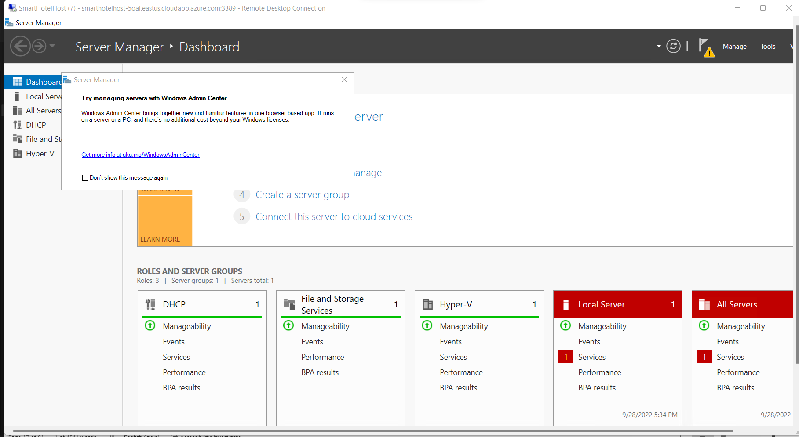
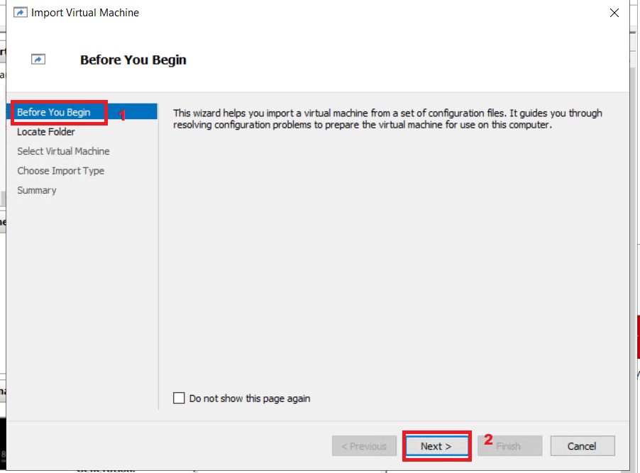
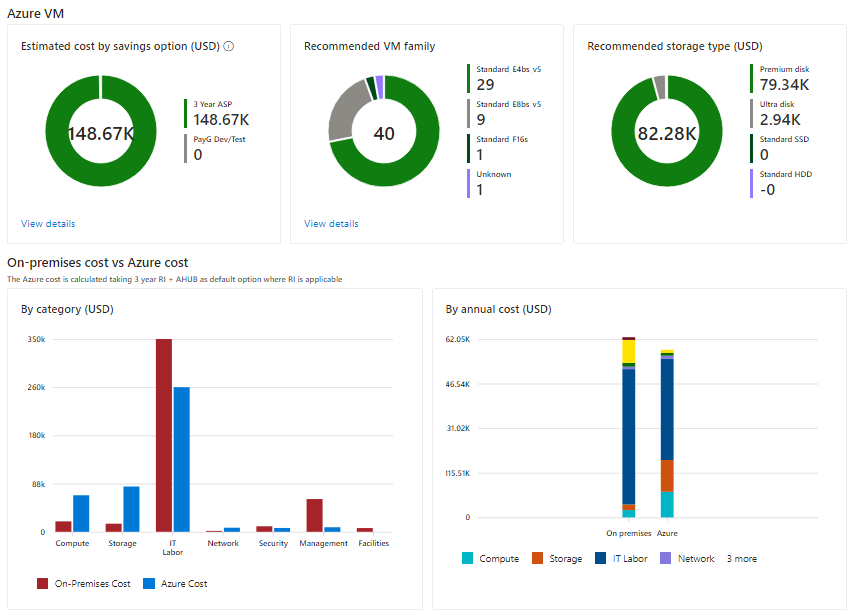

# Lab 02 – Entdecken und Bewerten von on-premises Umgebung.

**Ziele**

In diesem Lab würden wir die on-premises VMs mithilfe der Azure Migrate
Tools ermitteln und anschließend bewerten und ein Repository erstellen,
um die Bewertungsdaten in einem Azure-Migrationsprojekt zu speichern.

Wir würden auch Agenten installieren, um die Abhängigkeit zwischen den
VMs zu erkennen und zu visualisieren

Dazu müssen wir die Azure Migrate Appliance als VM auf dem
SmartHotelHost bereitstellen und dann die erforderlichen
Discovery-Aufgaben ausführen.

> **Wichtig**: Sie sollten mindestens 30–40 Minuten für die
> Bereitstellung von on-premises Umgebung (**Lab 1**– Bereitstellen und
> Überprüfen von on-premises Umgebung und Zielzonen) eingeplant haben,
> bevor Sie mit diesem Lab beginnen.

### Aufgabe 1: Erstellen des Azure Migrate-Projekts und Hinzufügen von Bewertungs- und Migrationstools

In dieser Aufgabe erstellen Sie das Azure Migrate-Projekt und wählen die
Bewertungs- und Migrationstools aus.

> **Notiz**: In diesem Lab verwenden Sie die von Microsoft
> bereitgestellten Bewertungs- und Migrationstools in Azure Migrate.
> Darüber hinaus sind verschiedene Tools von Drittanbietern für
> Bewertung und Migration in Azure Migrate integriert. Sie können diese
> Drittanbieteroptionen auch außerhalb dieses Labs erkunden.

1.  Wechseln Sie zurück zur Registerkarte „**Azure portal**“ oder öffnen
    Sie eine neue Registerkarte, navigieren Sie zu
    `https://portal.azure.com` und melden Sie sich mit Ihren **Office
    365 tenant credentials** an.

2.  Geben Sie in der Suchleiste „`Azure Migrate`“ ein und wählen Sie
    „**Azure Migrate**“ aus, um das unten angezeigte blade „**Azure
    Migrate Overview**“ zu öffnen.

- 

  

  Ein Screenshot eines Computers Beschreibung automatisch erstellt

3.  Wählen Sie „**Discover, assess and migrate**“ aus.

- 

  Ein Screenshot eines Computers Beschreibung automatisch erstellt

4.  Wählen Sie **Create project** aus.

- 

  Ein Screenshot einer Computerbeschreibung, die automatisch generiert
  wird

5.  Wählen Sie das entsprechende Subscription aus und erstellen Sie eine
    neue resource group mit dem Namen `AzureMigrateRG`

- 

6.  Geben Sie „`SmartHotelMigration`“ als Namen für das
    Migrationsprojekt ein und wählen Sie eine Region in Ihrer Nähe, in
    der die Migrationsbewertungsdaten gespeichert werden sollen. Hier
    wählen wir **United States** aus. Wählen Sie anschließend
    „**Create**“ aus.

- 

  

7.  Die Azure Migrate-Bereitstellung wird gestartet. Nach Abschluss
    sollten die Bereiche „**Azure Migrate: Discovery and assessment**“
    und „**Azure Migrate: Server Migration**“ für das aktuelle
    Migrationsprojekt angezeigt werden (siehe unten).

- 

Sie haben diese Aufgabe abgeschlossen. Schließen Sie diese Registerkarte
nicht, um mit der nächsten Aufgabe fortzufahren.

In dieser Aufgabe haben Sie ein Azure Migrate-Projekt erstellt und dabei
die standardmäßig integrierten Tools zur Serverbewertung und
Servermigration verwendet.

### Aufgabe 2: Bereitstellen der Azure Migrate-Appliance

In dieser Aufgabe stellen Sie die Azure Migrate-Appliance im on-premises
Hyper-V-Umgebung bereit und konfigurieren sie. Diese Appliance
kommuniziert mit dem Hyper-V-Server, um Konfigurations- und
Leistungsdaten zu Ihren on-premises VMs zu erfassen und diese Daten an
Ihr Azure Migrate-Projekt zurückzugeben.

1.  Wählen Sie unter „**Azure Migrate: Discovery and Assessment**“ die
    Option „**Discover**“ und dann „**Using appliance**“ aus, um das
    blade „**Discover machines**“ zu öffnen.

- 

  Ein Screenshot einer Computerbeschreibung, die automatisch generiert
  wird

2.  Wählen Sie unter „**Are your servers virtualized?**“ die Option
    „**Yes, with Hyper-V**“ aus.

- 

  Ein Screenshot einer Computerbeschreibung, die automatisch generiert
  wird

3.  Geben Sie in **1: Generate project key** `SHApplXXXXXX`  (ersetzen
    Sie XXXXXX durch eine Zufallszahl) als Namen für die Azure
    Migrate-Appliance an, die Sie für die Ermittlung von Hyper-V-VMs
    einrichten. Wählen Sie „**Generate key**“ aus, um mit der Erstellung
    der erforderlichen Azure-Ressourcen zu beginnen.

- 

  Ein Screenshot einer Computerbeschreibung, die automatisch generiert
  wird

  

4.  **Warten** Sie auf die Generierung des Schlüssels, kopieren Sie den
    **Azure Migrate project key** in die Zwischenablage und speichern
    Sie ihn im **notepad**. Dieser **Key**  kann dann für weitere
    Aufgaben verwendet werden.

- 

  Ein Screenshot einer Computerbeschreibung, die automatisch generiert
  wird

5.  Stellen Sie sicher, dass das Optionsfeld „.**VHD file 12 GB**“
    ausgewählt ist, klicken Sie dann mit der rechten Maustaste auf die
    Schaltfläche „**Download**“ und wählen Sie die Option „**Copy
    link**“.

- 

6.  Kopieren Sie den Link in den Editor, um ihn später zum Herunterladen
    der Azure Migrate-Appliance zu verwenden.

- 

  Eine automatisch generierte Beschreibung in Schwarzweiß

7.  Navigieren Sie in einem separaten Browsertab zum **Azure portal**.
    Geben Sie im globalen Suchfeld „`SmartHotelHost`“ ein und wählen Sie
    dann den virtuelle Maschine „**SmartHotelHost**“ aus.

- 

8.  Wählen Sie „**Connect**“ und dann „**Connect**“ aus der
    Dropdown-Liste.

- 

  Ein Screenshot einer Computerbeschreibung, die automatisch generiert
  wird

9.  Wählen Sie „**Download RDP File**“.

- 

  Ein Screenshot einer Computerbeschreibung, die automatisch generiert
  wird

10. Klicken Sie für die Benachrichtigung auf die Schaltfläche „**Keep**“
    und dann auf „**Open file**“, um eine Verbindung herzustellen.

- 

  Ein Screenshot einer Computerbeschreibung, die automatisch generiert
  wird

11. **Connect** zur virtuellen Maschine mit dem Benutzernamen `demouser`
    und dem Passwort `demo!pass123`

- 

  

12. Wählen Sie **Yes**.

- 

13. Öffnen Sie den Chrome-Browser auf der **SmartHotelHost**-VM und
    fügen Sie den kopierten Link für das Azure Migrate- Appliance aus
    dem Editor ein. Der Download der Datei sollte beginnen.

- 

14. Sobald die Datei heruntergeladen ist, klicken Sie auf die
    heruntergeladene Datei und wählen Sie die Option „**Shown in
    folder**“.

- 

  Ein Screenshot einer Computerbeschreibung, die automatisch generiert
  wird

15. Doppelklicken Sie auf die ZIP-Datei – **AzureMigrateAppliance**

- 

16. Sobald der Ordner „**AzureMigrateAppliance**“ angezeigt wird, wählen
    Sie ihn aus, klicken Sie auf die Schaltfläche „**Extract all**“,
    geben Sie den Ordnerpfad als `F:\VirtualMachines` an und klicken Sie
    auf die Schaltfläche „**Extract**“.

- 

17. Wechseln Sie zum Fenster „**Server Manager**“.
    

18. Wählen Sie im Server-Manager „**Tools**“ und dann „**Hyper-V
    Manager**“ aus (wenn der Server-Manager nicht automatisch geöffnet
    wird, öffnen Sie ihn, indem Sie „**Start**“ und dann „**Server
    Manager**“ auswählen).

- 

19. Wählen Sie im Hyper-V-Manager **SMARTHOTELHOST** aus. Es wird nun
    eine Liste der vier VMs angezeigt, aus denen die on-premises
    SmartHotel-Anwendung besteht.

- 

20. Wählen Sie im Hyper-V-Manager unter „**Actions**“ die Option
    „**Import Virtual Machine…**“ aus, um den Assistenten „**Import
    Virtual Machine**“ zu öffnen.

- 

21. Wählen Sie im ersten Schritt „**Before You Begin**“ die Option
    „**Next**“ aus.

- 

22. Wählen Sie im Schritt „**Locate Folder**“ die Option „**Browse**“
    aus und navigieren Sie zu
    F` F:\VirtualMachines\AzureMigrateAppliance` (achten Sie darauf, den
    Ordner auszuwählen, der gerade in den vorherigen Schritten
    ***extrahiert***  wurde), wählen Sie dann „**Select Folder**“ und
    dann „**Next**“.

- 

  Ein Screenshot einer Computerbeschreibung, die automatisch generiert
  wird

23. Im Schritt „**Select Virtual Machine**“ sollte die
    **AzureMigrateAppliance**-VM bereits ausgewählt sein. Wählen Sie
    „**Next**“ aus.

- 

24. Behalten Sie im Schritt „**Choose Import Type**“ die
    Standardeinstellung „**Register the virtual machine in-place**“ bei.
    Wählen Sie „**Next**“ aus.

- 

  Ein Screenshot einer Computerbeschreibung, die automatisch generiert
  wird

25. Beim Schritt „**Connect Network**“ wird die Fehlermeldung angezeigt,
    dass der zuvor vom Azure Migrate- Appliance verwendete virtuelle
    Switch nicht gefunden werden konnte. Wählen Sie in der Dropdownliste
    „**Connection**“ den **Azure Migrate Switch** und dann „**Next**“
    aus.

- 

  Ein Screenshot einer Computerbeschreibung, die automatisch generiert
  wird

  > ***Notiz***: Die Azure Migrate-Appliance benötigt Internetzugang, um
  > Daten in Azure hochzuladen. Sie benötigt außerdem Zugriff auf den
  > Hyper-V-Host. Er benötigt jedoch keinen direkten Zugriff auf die
  > Anwendungs-VMs, die auf dem Hyper-V-Host laufen. Zum Schutz der
  > Anwendungsumgebung sollte die Azure Migrate-Appliance in einem
  > separaten Subnetz innerhalb von Hyper-V und nicht im selben Subnetz
  > wie Ihre Anwendung bereitgestellt werden.

  > Die Hyper-V-Umgebung verfügt über ein NAT-Netzwerk mit dem
  > IP-Adressraum 192.168.0.0/16. Der interne NAT-Switch der
  > SmartHotel-Anwendung nutzt das Subnetz 192.168.0.0/24, und jeder VM
  > in der Anwendung wurde eine statische IP-Adresse aus diesem Subnetz
  > zugewiesen.

  > Die Azure Migrate Appliance wird mit dem separaten Subnetz
  > 192.168.1.0/24 verbunden, das bereits für Sie eingerichtet wurde.
  > Über den „Azure Migrate Switch“ wird die Appliance mit diesem
  > Subnetz verbunden. Der Appliance wird über einen DHCP-Dienst auf dem
  > SmartHotelHost eine IP-Adresse aus diesem Subnetz zugewiesen.

26. Überprüfen Sie Summary Seite und wählen Sie dann „**Finish**“ aus,
    um die VM der Azure Migrate-Appliance zu erstellen.

- 

27. Wählen Sie im Hyper-V-Manager, die **AzureMigrateAppliance**-VM aus
    und wählen Sie dann rechts „**Start**“ aus.

- 

Sie haben diese Aufgabe abgeschlossen. Schließen Sie den Hyper-V-Manager
nicht, um mit der nächsten Aufgabe fortzufahren.

**Zusammenfassung der Aufgabe**

In dieser Aufgabe haben Sie die Azure Migrate-Appliance in on-premises
Hyper-V-Umgebung bereitgestellt.

### Aufgabe 3: Konfigurieren der Azure Migrate-Appliance

In dieser Aufgabe konfigurieren Sie das Azure Migrate- Appliance und
verwenden es, um die Ermittlungsphase der Migrationsbewertung
abzuschließen.

1.  Wählen Sie im Hyper-V-Manager, die **AzureMigrateAppliance**-VM aus,
    Start und wählen Sie dann „Verbinden“ aus.

- 

2.  Es öffnet sich ein neues Fenster mit der Azure Migrate-Appliance.
    Warten Sie, bis der Bildschirm mit den Lizenzbedingungen (License
    terms) angezeigt wird, und wählen Sie dann „**Accept**“ aus.

- 

3.  Legen Sie im Bildschirm „**Customize settings**“ das
    Administratorkennwort auf „`demo!pass123`“ fest, indem Sie das
    Kennwort manuell (zweimal) eingeben. Wählen Sie anschließend
    „**Finish**“.

- > **Notiz**: Bei der Passworteingabe, verwendet die VM eine
  > US-Tastaturbelegung. Wenn Sie eine nicht-US-Tastatur verwenden,
  > werden einige Zeichen möglicherweise falsch eingegeben. Wählen Sie
  > das ‘eyeball’ symbol im zweiten Passworteingabefeld, um die korrekte
  > Passworteingabe zu überprüfen.

  

4.  Stellen Sie bei der Eingabeaufforderung „**Connect to
    AzureMigrateAppliance**“ die Bildschirmgröße von appliance mit dem
    Schieberegler ein und wählen Sie dann „**Connect**“ aus.

- 

5.  Melden Sie sich mit dem Administratorrechten an, indem Sie das
    Kennwort `demo!pass123`  manuell eingeben (auf dem Anmeldebildschirm
    wird möglicherweise Ihre lokale Tastaturbelegung angezeigt.
    Überprüfen Sie dies mithilfe des ‘eyeball’ symbol).

- 

  Grafische Benutzeroberfläche, Website-Beschreibung automatisch
  generiert

6.  **Warten.**Nach ein oder zwei Minuten wird der Browser geöffnet und
    zeigt den Konfigurationsassistenten für das Azure Migrate appliance
    an (er kann auch über die Desktopverknüpfung gestartet werden).

- 

7.  Beim Öffnen des Appliance-Konfigurationsassistenten, wird ein
    Popup-Fenster mit den Lizenzbedingungen (license terms) angezeigt.
    Akzeptieren Sie die Bedingungen, indem Sie **I agree** auswählen.

- 

  Ein Screenshot einer Computerbeschreibung, die automatisch generiert
  wird

8.  Unter „**Set up prerequisites**“ sollten die folgenden beiden
    Schritte zum Überprüfen der Internetverbindung und der
    Zeitsynchronisierung automatisch ausgeführt werden.

- 

  Ein Screenshot einer Computerbeschreibung, die automatisch generiert
  wird

9.  Fügen Sie den **Azure Migrate project key**, den Sie zuvor aus dem
    Azure-Portal kopiert haben, in den Abschnitt **Verification of Azure
    Migrate project key** ein, und klicken Sie dann auf die Schaltfläche
    **Verify**.

- 

  Ein Screenshot einer Computerbeschreibung, die automatisch generiert
  wird

  > **Hinweis**: Wenn Sie den Schlüssel nicht haben, gehen Sie im
  > Azure-Portal unter Azure Migrate zu **Server Assessment \> Discover
  > \> Manage existing appliances**, wählen Sie den appliance name aus,
  > den Sie bei der Schlüsselgenerierung angegeben haben, und kopieren
  > Sie den entsprechenden Schlüssel.

10. Sobald der **Azure Migrate project key** überprüft wurde, wird ein
    automatischer Aktualisierungsprozess gestartet.

- 

  Ein Screenshot einer Computerbeschreibung, die automatisch generiert
  wird

11. Wenn ein neues Update installiert ist, klicken Sie auf die
    Schaltfläche „**Refresh**“, um die Seite neu zu laden.

- 

12. Klicken Sie auf „**Login**“. Ein Popup mit einem Code wird geöffnet.

- 

13. Es öffnet sich ein neues Fenster mit einem Device code. Wählen Sie
    „**Copy code & Login**“.

- 

  Ein Screenshot einer Computerbeschreibung, die automatisch generiert
  wird

14. Fügen Sie im neuen Browserfenster, bei entsprechender Aufforderung,
    den **Code** ein und wählen Sie „**Next**“ aus.

- 

  Ein Screenshot einer Computerbeschreibung, die automatisch generiert
  wird

15. Geben Sie Ihre Azure-Portalanmeldeinformationen ein, und wählen Sie
    **Next** aus. Geben Sie das **Kennwort** (**Password**) ein, und
    wählen Sie **Sign in** aus.

- > **Notiz -**Aufgrund der verschachtelten Virtualisierung wird das
  > @-Symbol als 2 angezeigt. Korrigieren Sie daher die
  > Anmeldeinformationen und geben Sie das Kennwort unbedingt über die
  > Tastatur ein. Alternativ können Sie zur Lab-VM wechseln, das
  > Kennwort in einen Notizblock einfügen und kopieren. Wechseln Sie
  > dann zurück zur SmartHotelVM und fügen Sie das Kennwort in die
  > AzureMigrate-Appliance-VM ein.

  

  Ein Screenshot einer Computerbeschreibung, die automatisch generiert
  wird

  

16. Wählen Sie „**Continue**“ aus.

- 

  Ein Screenshot einer automatisch generierten
  Computerfehlerbeschreibung

  

17. Kehren Sie zur Registerkarte „**Azure Migrate Appliance**“ zurück
    und die **Appliance registration** wird automatisch gestartet.

- 

  Ein Screenshot einer Computerbeschreibung, die automatisch generiert
  wird

8.  Sobald die Registrierung abgeschlossen ist, fahren Sie mit dem
    nächsten Bereich fort: **Manage credentials and discovery sources**.

- 

  wird Ein Screenshot einer Computerbeschreibung, die automatisch
  generiert

18. Wählen Sie unter „Manage credentials and discovery sources“ – **Step
    1: Provide Hyper-V host credentials**“ die Option „**Add
    credentials**“ aus.

- 

  Ein Screenshot einer Computerbeschreibung, die automatisch generiert
  wird

19. Geben Sie **Friendly name** als „`hostlogin`“, username  als
    „`demouser`“ und das password „demo!pass123“ manuell für den Hyper-V
    host/cluster ein, den die Appliance zum Erkennen von VMs verwendet.
    Wählen Sie „**Save**“ aus.

- 

  Ein Screenshot einer Computerbeschreibung, die automatisch generiert
  wird

  > **Hinweis**: Das Azure Migrate appliance hat Ihre lokale
  > Tastaturbelegung möglicherweise nicht erkannt. Klicken Sie im
  > Kennwortfeld auf ‘eyeball’, um zu überprüfen, ob das Kennwort
  > korrekt eingegeben wurde.

  > ***Hinweis:*** Für die Erkennung von Hyper-V-VMs werden mehrere
  > Anmeldeinformationen unterstützt, die über die Schaltfläche „Add
  > more“ aufgerufen werden können.

20. Wählen Sie in **Step 2: Provide Hyper-V host/cluster details** an
    die Option „**Add discovery source**“ aus, um die IP Hyper-V
    host/cluster IP address/FQDN und friendly name für die
    Anmeldeinformationen zum Herstellen einer Verbindung mit dem
    Host/Cluster anzugeben.

- 

  Ein Screenshot einer Computerbeschreibung, die automatisch generiert
  wird

21. Wählen Sie „**Add single item**“, geben Sie unter „IP Address /
    FQDN“ „`SmartHotelHost`“ ein, wählen Sie „**hostlogin**“ aus der
    Dropdown-Liste als Map credentials aus und dann **Save**.

- 

  Ein Screenshot einer Computerbeschreibung, die automatisch generiert
  wird

  > **Hinweis:** Sie können entweder **einzelne Elemente gleichzeitig**
  > oder **mehrere** **Elemente auf einmal hinzufügen**. Es besteht auch
  > die Möglichkeit, Hyper-V-Host-/Clusterdetails über den **Import
  > CSV** bereitzustellen.

22. Die appliance validiert die Verbindung zu den hinzugefügten
    Hyper-V-Hosts/Clustern und zeigt den **Validation status** in der
    Tabelle für jeden Host/Cluster an.

- 

  **Notiz:** Beim Hinzufügen von Erkennungsquellen:
  - Für erfolgreich validierte Hosts/Cluster können Sie weitere Details
    anzeigen, indem Sie deren IP-Adresse/FQDN auswählen.
  - Wenn die Validierung für einen Host fehlschlägt, überprüfen Sie den
    Fehler, indem Sie in der Spalte „Status“ der Tabelle „Validation
    failed“ auswählen. Beheben Sie das Problem, und führen Sie die
    Validierung erneut durch.
  - Um Hosts oder Cluster zu entfernen, wählen Sie **Delete**.
  - Sie können keinen bestimmten Host aus einem Cluster entfernen. Sie
    können nur den gesamten Cluster entfernen.
  - Sie können einen Cluster hinzufügen, auch wenn es Probleme mit
    bestimmten Hosts im Cluster gibt.

23. Stellen Sie sicher, dass der Switch aktiviert ist, und klicken Sie
    dann auf **Add credentials.**

- 

  Ein Screenshot einer automatisch generierten
  Computerfehlerbeschreibung

24. Geben Sie im Popup „Add credentials“ die Details ein und klicken Sie
    dann auf die Schaltfläche „**Save**“.

    1.  Credential type – **Windows (Non-domain)**

    2.  Friendly name – `WindowsVM`

    3.  Username – `.``\Administrator`

    4.  Password – Geben Sie manuell `demo!pass123`

- Ein Screenshot einer Computerbeschreibung, die automatisch generiert
  wird

25. Schließen Sie die Benachrichtigung.

- 

  Ein Screenshot einer Computerbeschreibung, die automatisch generiert
  wird

26. Klicken Sie erneut auf „**Add credentials**“, geben Sie im Popup
    „Add credentials“ die Details ein und klicken Sie dann auf die
    Schaltfläche „**Save**“.

    1.  Credential type – **Linux (Non-domain)**

    2.  Friendly name – `LinuxVM`

    3.  Username – `.``\``demouser`

    - Password – Geben Sie manuell `demo!pass123`` `ein

- 

  Ein Screenshot einer Computerbeschreibung, die automatisch generiert
  wird

27. Schließen Sie die Benachrichtigung.

- 

  Ein Screenshot einer Computerbeschreibung, die automatisch generiert
  wird

28. Scrollen Sie nach unten und klicken Sie dann auf die Schaltfläche
    „**Start Discovery**“.

- 

  Ein Screenshot einer Computerbeschreibung, die automatisch generiert
  wird

  

  Ein Screenshot einer Computerbeschreibung, die automatisch generiert
  wird

29. Warten Sie, bis der Azure Migrate status „**Discovery has been
    successfully initiated**“ anzeigt. Dies dauert 10–13 Minuten.
    Nachdem die Erkennung erfolgreich gestartet wurde, können Sie den
    Erkennungsstatus für jeden Host/Cluster in der Tabelle überprüfen.

- 

  Ein Screenshot einer Computerbeschreibung, die automatisch generiert
  wird

30. Wechseln Sie zurück zur Lab-VM, öffnen Sie den Edge-Browser,
    navigieren Sie zum Azure-Portal `https://portal.azure.com`, melden
    Sie sich mit Ihren Office 365-Mandantenanmeldeinformationen an und
    kehren Sie zum **Azure Migrate**-Blade zurück.

- 

  Grafische Benutzeroberfläche, Text, Anwendung, E-Mail Beschreibung
  automatisch generiert

31. Wählen Sie „**Servers, databases and web apps**“ und dann
    „**Refresh**“ aus.

- 

  Ein Screenshot einer Computerbeschreibung, die automatisch generiert
  wird

  

32. Unter „**Azure Migrate: Server Assessment**“ sollten Sie die Anzahl
    der bisher erkannten Server sehen. Wenn die Erkennung noch läuft,
    wählen Sie regelmäßig „**Refresh**“ aus, bis fünf erkannte Server
    angezeigt werden. Dies kann einige Minuten dauern.

- 

  Ein Screenshot einer Computerbeschreibung, die automatisch generiert
  wird

**Wichtig: Warten Sie, bis der Erkennungsprozess abgeschlossen ist,
bevor Sie mit der nächsten Aufgabe fortfahren**.

Sie haben diese Aufgabe abgeschlossen. Schließen Sie diese Registerkarte
nicht, um mit der nächsten Aufgabe fortzufahren.

**Zusammenfassung der Aufgabe**

In dieser Aufgabe haben Sie die Azure Migrate-Appliance in on-premises
Hyper-V-Umgebung konfiguriert und den Ermittlungsprozess zur
Migrationsbewertung gestartet.

### Aufgabe 4: Importieren des Server-Bestandaufnahme mithilfe einer CSV-Datei 

Sie können auch eine Bestandsaufnahme der Umgebung, ihrer Konfiguration
und Nutzung mit einer CSV-Datei importieren. Die Eigenschaften in der
CSV-Datei sind:

- **Server Name** – Name des Rechners

- **IP Addresses**  – durch Semikolon getrennte Liste der vom Maschinen
  verwendeten IPv4- und IPv6-Adressen

- **Cores** – Anzahl der verwendeten vCPU

- **Memory**  – Größe des Speichers in MB

- **OS Details**

  - **Name**– Typ des Betriebssystems (OS)

  - **Version**– Version des verwendeten Betriebssystems (OS)

  - **Architecture** – architecture (like x64/x86)

- **CPU Utilization**  – Prozentsatz der CPU-Nutzung

- **Memory Utilization**  – prozentualer Anstieg der CPU-Auslastung

- **Netzwerk**

  - Adapter count – Anzahl der an den Rechner angeschlossenen NICs

  - Input Throughput – Durchsatzmenge in Mbit/s in das System

  - Output Throughput – Durchsatzmenge in Mbit/s aus dem System

- **Boot Type**– vom System verwendeter Boottyp (UEFI/BIOS)

- **Disks**

  - **Number of disks**  – Anzahl der Festplatten, die an die Festplatte
    angeschlossen sind

  - **Per disk size**  – Größe der Festplatte in GB

  - **Per disk reads (Bytes)**– Anzahl der MB, die pro Sekunde von jeder
    Festplatte gelesen werden

  - **Per disk writes (Bytes)**– Anzahl der MB, die pro Sekunde auf jede
    Festplatte geschrieben werden

  - **Per disk reads (IOPS)**– Anzahl der Ausgabevorgänge von der
    Festplatte pro Sekunde

  - **Per disk writes (IOPS)**– Anzahl der Eingabevorgänge von der
    Festplatte pro Sekunde

Sobald die CSV-Datei ausgefüllt ist, können Sie die Systeme wie folgt in
die Migrationsbewertungsphase importieren:

9.  Stellen Sie sicher, dass auf blade „Azure Migrate“ unter „Migration
    goals“ die Option „**Servers, databases and web apps**“ ausgewählt
    ist. Wählen Sie die Schaltfläche „**Discover**“ und anschließend
    „**Using import**“ aus.

- 

  Ein Screenshot einer Computerbeschreibung, die automatisch generiert
  wird

1.  Laden Sie die CSV-Datei mit dem Namen **Azure Migrate import
    template.csv** von `C:\Labfiles`  hoch und wählen Sie dann
    „**Import**“ aus, um die Datei zu lesen.

- 

  Ein Screenshot einer Computerbeschreibung, die automatisch generiert
  wird

2.  Der Import sollte mit der Verarbeitung der Dateidatensätze beginnen.

- 

  Ein Screenshot einer Computerbeschreibung, die automatisch generiert
  wird

3.  Sie sollten die Benachrichtigung wie im Bild unten gezeigt erhalten.

- 

  Eine Nahaufnahme einer Nummer Beschreibung automatisch generiert

4.  In den Importdetails können wir sehen, dass **40 Datensätze** (**40
    Records**) erfolgreich eingefügt wurden.

- 

5.  Schließen Sie das **Discovery-Blade** und klicken Sie dann auf die
    Schaltfläche „**Refresh**“.

- 

  Ein Screenshot einer Computerbeschreibung, die automatisch generiert
  wird

6.  Sie sollten die aktualisierte Discovered Servers sehen können.

    - **Discovered Servers – 45**

- 

  Ein Screenshot einer Computerbeschreibung, die automatisch generiert
  wird

7.  Klicken Sie auf „**Discovered items**“ und wählen Sie dann die
    Registerkarte „**Import based**“. Sie sollten die Details der 40
    importierten Server sehen können. Wählen Sie unbedingt das Projekt
    aus dem Dropdown-Menü aus.

- 

  Ein Screenshot einer Computerbeschreibung, die automatisch generiert
  wird

Sie haben diese Aufgabe abgeschlossen. Schließen Sie diese Registerkarte
nicht, um mit der nächsten Aufgabe fortzufahren.

### Aufgabe 5: Erstellen Sie Business Cases zur Kostenschätzung.

In dieser Aufgabe verwenden wir Azure Migrate, um einen Business Case zu
erstellen und dabei die während der Ermittlungsphase vom Azure
Migrate-Appliance und aus der Liste der importierten Server gesammelten
Daten zu verwenden.

Mithilfe der Business Case-Funktion können Sie einen Geschäftsvorschlag
erstellen, um zu verstehen, wie Azure Ihrem Unternehmen den
größtmöglichen Nutzen bringen kann. Sie hebt Folgendes hervor:

- Gesamtbetriebskosten on-premises im Vergleich zu Azure.

- Cashflow-Analyse im Jahresvergleich.

- Erkenntnisse auf Grundlage der Ressourcennutzung zur Identifizierung
  von Servern und Workloads, die sich ideal für die Cloud eignen.

- Schnelle Erfolge bei der Migration und Modernisierung, einschließlich
  der Einstellung des Supports für Windows-Betriebssysteme und
  SQL-Versionen.

- Langfristige Kosteneinsparungen durch die Umstellung von einem
  Investitionsausgabenmodell auf ein Betriebsausgabenmodell, indem Sie
  nur für das bezahlen, was Sie nutzen.

- Beseitigen Sie Rätselraten in Ihrem Kostenplanungsprozess und fügen
  Sie Berechnungen hinzu, die auf datenbasierten Erkenntnissen basieren.

- Es kann mit nur wenigen Klicks generiert werden, nachdem Sie die
  Erkennung mit dem Azure Migrate-Gerät durchgeführt haben.

- Die Funktion wird für vorhandene Azure Migrate-Projekte automatisch
  aktiviert.

1.  Klicken Sie unter „Migration goal“ auf „**Servers, databases and web
    apps**“ und wählen Sie die Schaltfläche „**Build business case**“
    aus.

- 

  Ein Screenshot einer Computerbeschreibung, die automatisch generiert
  wird

2.  Geben Sie auf der Seite „**Build business case (Preview)**“ die
    folgenden Details ein und klicken Sie dann auf die Schaltfläche
    „**Build business case**“.

    - Business case name - `BCase1 from Imported CSV`

    - Target location - **West US**

    - Discovery source – **Build a quick business case using the servers
      imported via a .CSV file.**

    - Savings options – **Reserved instance + Azure Saving Plan**

    - Discount (%) on Pay as you go - **0**

- 

  Ein Screenshot einer Computerbeschreibung, die automatisch generiert
  wird

3.  Wir sollten die Benachrichtigung wie unten gezeigt erhalten

- 

  Ein Screenshot einer Computerbeschreibung, die automatisch generiert
  wird

4.  Klicken Sie nach einigen Minuten auf die Schaltfläche „Refresh“

- 

5.  Sobald die Annahmen berechnet sind, sollte die Seite wie folgt
    aussehen

- 

  Ein Screenshot einer Computerbeschreibung, die automatisch generiert
  wird

6.  Überprüfen Sie die Details unter dem **TCO comparison** und klicken
    Sie auf den Link „**View Details** “.

- 

10. Dadurch werden die Business Case-Berichte „**On-premises vs Azure**“
    geöffnet, die Ihnen die **Estimated annual cost by category**
    anzeigen sollten.

- 

7.  Scrollen Sie nach unten, um **Total cost of ownership** anzuzeigen

- 

11. Zurück auf der Seite Overview des Business Case, überprüfen Sie
    **YoY estimated current vs future state cost** und **Savings with
    Azure Hybrid Benefit.**

- 

  > **Hinweis-** Da Sie die Migration zu Azure schrittweise planen,
  > zeigt dieses Liniendiagramm Ihren jährlichen Cashflow basierend auf
  > der geschätzten Migrationsdauer des jeweiligen Jahres. Standardmäßig
  > wird angenommen, dass Sie im laufenden Jahr 0 %, im ersten Jahr 20
  > %, im zweiten Jahr 50 % und im dritten Jahr 100 % migrieren. Die
  > aktuellen Kosten zeigen Ihren Netto-Cashflow on-premises, wenn Ihre
  > Infrastruktur jährlich um 5 % wächst. Die zukünftigen Kosten zeigen
  > Ihren Netto-Cashflow, wenn Sie gemäß den Annahmen zu den
  > Azure-Kosten jährlich einen bestimmten Prozentsatz zu Azure
  > migrieren und Ihre Infrastruktur jährlich um 5 % wächst.

  > **Hinweis- Azure Hybrid Benefit**  ist ein Lizenzierungsvorteil, der
  > Ihnen hilft, die Kosten für die Ausführung Ihrer Workloads in der
  > Cloud deutlich zu senken. Sie können Ihre on-premises Software
  > Assurance-fähigen Windows Server- und SQL Server-Lizenzen in Azure
  > nutzen.

8.  Überprüfen Sie die im Abschnitt „Discovery Insights“
    bereitgestellten Informationen

    - **Total Server – Distribution**

    - **OS Distribution**

> 

- Ein Screenshot einer Computerbeschreibung, die automatisch generiert
  wird

9.  Klicken Sie auf **Azure IaaS** und überprüfen Sie die Registerkarte
    **Azure**, die Informationen zu den Servern enthält, die für die
    **Migration bereit** sind (**Ready for migration**). Außerdem
    erhalten Sie dort **IaaS cost estimate** dafür und die **Saving with
    Azure Hybrid Benefit**.

- 

10. Scrollen Sie nach unten, um weitere Informationen zu erhalten.

    - **Estimated cost by savings option**

    - **Recommended VM family and Storage type**

    - **On-premises cost vs Azure cost**

- 

12. Scrollen Sie nach oben und klicken Sie auf die Registerkarte
    „**On-Premises**“. Dort wird die **On-premises cost estimate**
    angezeigt.

- 

11. crollen Sie nach unten und überprüfen Sie den Abschnitt
    „Serveranalyse“.

    - **Distribution by operating system**

    - **Distribution by virtualization**

    - **Distribution by category**

- 

13. Klicken Sie unter „End of Support“ auf den Link „**View details**“.
    Es werden alle im business case berücksichtigten Server mit
    **recommended targets, activity state** und **qualifying offers in
    Azure** aufgelistet.

- 

12. Schließen Sie blade „**Details**“, und klicken Sie dann unter
    „Assumptions“ auf „**Azure cost**“.

- 

13. Hier können Sie **Assumptions for Azure cost** und **Cost
    modelling** ändern und dann auf „**Save**“ klicken, um den Business
    Case neu zu bewerten.

14. Klicken Sie auf **On-premises cost**. Auf der Registerkarte
    **Compute** finden Sie die Einstellungen für

    - **Software - SQL Server licensing**

    - **Software - Windows server licensing**

    - **Virtualization software – Hyper-V**

    - **Virtualization software – VMware**

- 

  Ein Screenshot einer Computerbeschreibung, die automatisch generiert
  wird

15. Klicken Sie auf die Registerkarte **Storage**, um die Einstellungen
    zu überprüfen

- 

  Ein Screenshot einer Computerbeschreibung, die automatisch generiert
  wird

16. Klicken Sie auf die Registerkarte „**Network**“, um die
    Einstellungen zu überprüfen

- 

  Ein Screenshot einer Computerbeschreibung, die automatisch generiert
  wird

17. Klicken Sie auf die Registerkarte **Security**, um die Einstellungen
    zu überprüfen

- 

  Ein Screenshot einer Computerbeschreibung, die automatisch generiert
  wird

18. Klicken Sie auf die Registerkarte „**Management**“, um die
    Einstellungen zu überprüfen

19. Klicken Sie auf die Registerkarte „**Labor**“, um die Einstellungen
    zu überprüfen

- 

  Ein Screenshot einer Computerbeschreibung, die automatisch generiert
  wird

20. Klicken Sie auf die Registerkarte „**Facilities**“, um die
    Einstellungen zu überprüfen

- 

  Ein Screenshot einer Computerbeschreibung, die automatisch generiert
  wird

21. Die tatsächlichen on-premises-Kosten können geschätzt werden, indem
    Sie Änderungen an diesen Einstellungen vornehmen und dann auf die
    Schaltfläche „Save“ klicken, um die on-premises-Kosten neu zu
    berechnen.

22. Lassen Sie uns nun einen weiteren Business case für die Server
    erstellen, die mit der Azure Migrate-Appliance entdeckt wurden.

23. Klicken Sie auf der Azure Migrate-Seite auf Servers, databases und
    web apps und dann auf **Build Business case**.

- 

  Ein Screenshot einer Computerbeschreibung, die automatisch generiert
  wird

24. Geben Sie auf der Seite „**Build business case (Preview)**“ die
    folgenden Details ein und klicken Sie dann auf die Schaltfläche
    „**Build business case**“.

    - Business case name - `BCase2 Migrate Appliance`

    - Target location - **West US**

    &nbsp;

    - Discovery source – **Use more accurate data insights collected via
      the Azure Migrate appliance**.

    &nbsp;

    - Migration strategy - **Azure recommended approach to minimize
      cost**

    - Savings options – **Reserved instance + Azure Saving Plan**

    - Discount (%) on Pay as you go - **0**

> 

- Ein Screenshot einer Computerbeschreibung, die automatisch generiert
  wird

25. Wir sollten die Benachrichtigung wie unten gezeigt erhalten

- 

26. Klicken Sie nach einigen Minuten auf die Schaltfläche „Refresh“

- 

  Ein Screenshot einer Computerbeschreibung, die automatisch generiert
  wird

27. Sobald die Annahmen berechnet sind, sollte die Seite wie folgt
    aussehen

- 

  Ein Screenshot einer Computerbeschreibung, die automatisch generiert
  wird

28. Ähnlich wie bei dem Geschäftsfall, der für die importierten Server
    erstellt wurde, können Sie die Details dieses Geschäftsfalls für die
    folgenden Bereiche überprüfen.

    - **TCO comparison**

    - **Discovery insights**

    - Business case reports

      - **On-premises vs Azure**

      - **Azure IaaS**

    - Assumptions

      - **Azure cost**

      - **On-premises cost**

29. Nachdem der **BCase2 Migrate Appliance**– Business Case überprüft
    wurde, klicken Sie auf der Azure Migrate-Seite unter „**Servers,
    databases and web apps**“ auf die Schaltfläche „**Overview**“.

- 

  Ein Screenshot einer Computerbeschreibung, die automatisch generiert
  wird

30. Klicken Sie unter „Manage“ auf „**Business cases**“.

- 

  Ein Screenshot einer Computerbeschreibung, die automatisch generiert
  wird

31. Wir sollten in der Lage sein, die 2 Business cases zu sehen, die aus
    verschiedenen Discovery-sources erstellt wurden.

    - Import

    - Appliance

- 

  Ein Screenshot einer Computerbeschreibung, die automatisch generiert
  wird

### Aufgabe 6: Erstellen einer Migrationsbewertung

In dieser Aufgabe verwenden Sie Azure Migrate, um mithilfe der während
der Ermittlungsphase gesammelten Daten eine Migrationsbewertung für die
**SmartHotel**-Anwendung zu erstellen.

1.  Wählen Sie in Azure Migrate unter **Azure Migrate: Discovery and
    assessment** die Option **Assess -\> Azure VM** aus, um eine neue
    Migrationsbewertung zu starten.

- 

  Ein Screenshot einer Computerbeschreibung, die automatisch generiert
  wird

2.  Geben Sie auf blade „**Create Assessment Basics**“ die folgenden
    Details ein.

    - Assessment type– **Azure-VM**

    - Discovery Source: **Servers discovered from Azure Migrate
      Appliance**

    - Under Assessment settings: Klicken Sie auf den Link **Edit**

- 

  Ein Screenshot einer Computerbeschreibung, die automatisch generiert
  wird

3.  Das blade **Assessment settings** ermöglicht die Anpassung vieler
    Einstellungen, die bei der Erstellung eines
    Migrationsbewertungsberichts verwendet werden. Nehmen Sie sich einen
    Moment Zeit, um das breite Spektrum der Bewertungseigenschaften zu
    erkunden.

4.  Nehmen Sie dann die folgenden Änderungen vor und klicken Sie auf die
    Schaltfläche „**Save**“.

    - Target location – **West US**  (Region, in der die Anzahl der
      vCPU-cores des Abonnements erhöht wurde)

    - Saving options – **3 Years reserved**

    - Percentile utilization – **99^(th**)

    - VM series – Alles auswählen

- 

  Ein Screenshot einer Computerbeschreibung, die automatisch generiert
  wird

**Hinweis:** Sie müssen eine Änderung vornehmen, damit die Schaltfläche
„**Save**“ aktiviert wird. Wenn Sie keine Änderungen vornehmen möchten,
schließen Sie einfach das blade.

5.  Klicken Sie auf der Registerkarte „Basics“ auf die Schaltfläche
    „**Next**: **Select servers to assess \>**“.

- 

  Ein Screenshot einer Computerbeschreibung, die automatisch generiert
  wird

6.  Geben Sie **Assessment name** als „`SmartHotelAssessment`“ ein.
    Wählen Sie „**Create New**“ und geben Sie group name als
    „`SmartHotel VMs`“ ein. Wählen Sie die VMs
    „**smarthotelweb1**, **smarthotelweb2** und **UbuntuWAF** “ aus und
    klicken Sie anschließend auf „**Next: Review+ Create assessment**“.

- 

  > **Hinweis**: Es besteht keine Notwendigkeit, die VMs smarthotelSQL1
  > oder AzureMigrateAppliance in die Bewertung einzubeziehen, da sie
  > nicht nach Azure migriert werden. (Der SQL Server wird zum
  > SQL-Datenbankdienst migriert und die Azure Migrate Appliance wird
  > nur für die Bewertung der Migration verwendet).

7.  Wählen Sie „**Create assessment**“ aus.

- 

  Ein Screenshot einer Computerbeschreibung, die automatisch generiert
  wird

8.  Wählen Sie auf blade „**Azure Migrate - Servers, databases and web
    apps**“ regelmäßig „**Refresh**“ aus, bis die Anzahl der angezeigten
    Bewertungen 1 beträgt. Dies kann 5–6 Minuten dauern.

9.  Wählen Sie auf der Seite „Azure Migrate Server, databases and web
    app“ unter „Assessment“ 1 aus.

- 

  Ein Screenshot einer Computerbeschreibung, die automatisch generiert
  wird

10. Klicken Sie in der Liste auf **SmartHotelAssessment**.

- 

  Ein Screenshot einer Computerbeschreibung, die automatisch generiert
  wird

11. Nehmen Sie sich einen Moment Zeit, um die Bewertungsübersicht zu
    studieren.

- 

  Ein Screenshot einer Computerbeschreibung, die automatisch generiert
  wird

12. Wählen Sie **Settings**.

- 

  Ein Screenshot einer Computerbeschreibung, die automatisch generiert
  wird

13. Ändern Sie in Assessment setting, die folgenden Angaben und klicken
    Sie dann auf die Schaltfläche „**Save**“.

    - Performance History – **1 Week**

    - Percentile utilization – **95^(th)**

- 

  Ein Screenshot einer Computerbeschreibung, die automatisch generiert
  wird

14. Nach einigen Augenblicken wird der Bewertungsbericht aktualisiert
    und zeigt Ihre Änderungen an.

- 

  Ein Screenshot eines Computerbildschirms Beschreibung wird automatisch
  generiert.

15. **Vergleich** wie im Bild unten gezeigt.

- 

16. Wählen Sie **Azure readiness** (entweder im Diagramm oder in der
    linken Navigation). Beachten Sie, dass für die **UbuntuWAF**-VM ein
    spezielles Anliegen bezüglich der Bereitschaft der VM für die
    Migration aufgeführt ist.

- 

  Ein Screenshot einer Computerbeschreibung, die automatisch generiert
  wird

  > Nehmen Sie sich ein paar Minuten Zeit, um andere Aspekte der
  > Migrationsbewertung zu erkunden.

  > **Hinweis**: Das Sammeln von Informationen zu
  > Betriebssystemumgebungen (OSE) und die Migration von VM-Daten
  > zwischen Umgebungen nimmt aufgrund der Art der Datenübertragung
  > einige Zeit in Anspruch. Es gibt jedoch einige Schritte, die den
  > Vorgang beschleunigen und die Funktionsweise des Systems verbessern
  > können. Hier sind einige Optionen:

  > Allgemeine Schritte zum Aktualisieren von Daten: (siehe auch
  > Troubleshoot Discovery)

  - Serverdaten werden im Portal nicht aktualisiert – wenn die
    Serverdaten nicht aktualisiert werden, ist dies eine Methode, dies
    zu beschleunigen.

  &nbsp;

  - Keine Details zum Softwarebestand anzeigen – standardmäßig wird das
    Softwarebestand nur alle 24 Stunden aktualisiert. Dies erzwingt eine
    Aktualisierung.

  &nbsp;

  - Fehler bei der Softwarebestand – Bei der Bestand werden manchmal
    Fehlercodes zurückgegeben. Hier finden Sie eine Liste aller
    Fehlercodes und deren Bedeutung.

> Viele Migrationsprobleme können damit zusammenhängen, dass die
> Appliance die Daten aufgrund regelmäßiger Zeitpläne nicht aktualisiert
> oder die Daten nicht übertragen werden. Die Aktualisierung der Daten
> und Informationen kann mit den folgenden Schritten erzwungen werden:

17. > Wählen Sie auf der **Azure Migrate**-Seite unter „**Servers,
    > database and web apps**, **Azure Migrate: Discovery and
    > assessment**“ die Option „**Overviewq**“ aus.

- 

  Ein Screenshot einer Computerbeschreibung, die automatisch generiert
  wird

18. Wählen Sie unter „**Manage**“ die Option „**Appliances**“ aus.
    Wählen Sie „**Refresh services**“ aus.

- 

  Ein Screenshot einer Computerbeschreibung, die automatisch generiert
  wird

  

  Ein Screenshot einer Computerbeschreibung, die automatisch generiert
  wird

19. Warten Sie, bis der Aktualisierungsvorgang abgeschlossen ist. Sie
    sollten nun aktuelle Informationen sehen.

- 

  Ein Screenshot einer Computerbeschreibung, die automatisch generiert
  wird

Sie haben diese Aufgabe abgeschlossen. Schließen Sie diese Registerkarte
nicht, um mit der nächsten Aufgabe fortzufahren.

**Zusammenfassung der Aufgabe:**

In dieser Aufgabe haben Sie eine Azure Migrate migration assessment
erstellt und konfiguriert.

### Aufgabe 7: Konfigurieren der Abhängigkeitsvisualisierung

Bei der Migration einer Workload zu Azure ist es wichtig, alle
Workloadabhängigkeiten zu verstehen. Eine unterbrochene Abhängigkeit
kann dazu führen, dass die Anwendung in Azure nicht ordnungsgemäß
ausgeführt wird, möglicherweise auf schwer erkennbare Weise. Einige
Abhängigkeiten, beispielsweise zwischen Anwendungsebenen, sind
offensichtlich. Andere Abhängigkeiten, wie DNS-Lookups,
Kerberos-Ticketvalidierung oder Zertifikatssperrprüfungen, sind es
hingegen nicht.

In dieser Aufgabe konfigurieren Sie Funktion **Azure Migrate dependency
visualization**. Dazu müssen Sie zunächst einen **Log Analytics
workspace** erstellen und dann Agents auf den zu migrierenden VMs
bereitstellen.

1.  Wählen Sie auf der Seite **Azure Migrate**, „**Servers, database and
    web apps**“ aus. Klicken Sie unter „**Azure Migrate: Discovery and
    assessment**“ unter „**Groups**“ auf den Link Nummer **1**.

- 

  Ein Screenshot eines Computerbildschirms Beschreibung wird automatisch
  generiert.

2.  Wählen Sie die **SmartHotel VMs** Gruppe aus, um die Gruppendetails
    anzuzeigen.

- 

  Ein Screenshot einer Computerbeschreibung, die automatisch generiert
  wird

3.  Beachten Sie, dass jede VM den **Dependencies** status als
    **Requires agent installation** hat. Wählen Sie **Requires agent
    installation** für die **smarthotelweb1** VM.

- 

  Ein Screenshot einer Computerbeschreibung, die automatisch generiert
  wird

4.  Wählen Sie auf blade „**Dependencies**“ die Option „**Configure Log
    Analytics workspace**“ aus.

- 

  Ein Screenshot einer Computerbeschreibung, die automatisch generiert
  wird

5.  Erstellen Sie einen neuen Log Analytics workspace. Verwenden Sie
    `AzureMigrateWSXXXXXX` \[Ersetzen Sie XXXXXX durch eine
    Zufallszahl\] als workspace name. Wählen Sie in der Liste Log
    Analytics workspace location aus, und klicken Sie dann auf
    **Configure**.

6.  Warten Sie, bis workspace bereitgestellt ist. Notieren Sie sich die
    **Workspace ID**  und den **Workspace Key** im Editor.

- 

  Ein Screenshot einer Computerbeschreibung, die automatisch generiert
  wird

7.  Klicken Sie mit der rechten Maustaste, kopieren Sie die Linkadressen
    aller **4 agent download URLs** und fügen Sie sie neben **Workspace
    ID and key** ein, die Sie im vorherigen Schritt 9 im Editor notiert
    haben.

- 

  Ein Screenshot einer Computerbeschreibung, die automatisch generiert
  wird

  > **Hinweis**: Sie können diese Links an Ihr Testkonto mailen und in
  > VM öffnen.

8.  Kehren Sie zur RDP-Sitzung von **SmartHotelHost** zurück, wenn Sie
    zur Verbindung aufgefordert werden, und verwenden Sie die
    Anmeldeinformationen.

    - Username - `demouser`

    - Password - `demo!pass``123`

9.  Wählen Sie im **Hyper-V-Manager** „**smarthotelweb1**“ und dann
    „**Connect**“ aus.

- 

  Ein Screenshot einer Computerbeschreibung, die automatisch generiert
  wird

10. Wählen Sie erneut „**Connect**“, wenn Sie dazu aufgefordert werden,
    und melden Sie sich beim **Administrator** Konto an, indem Sie das
    Kennwort `demo!pass123`` `eingeben.

- 

  Grafische Benutzeroberfläche, Anwendungsbeschreibung automatisch
  generiert

  

11. Öffnen Sie den **Internet Explorer**

- 

12. Fügen Sie den Link zum **64-bit Microsoft Monitoring Agent for
    Windows** ein, den Sie zuvor gespeichert haben, und klicken Sie bei
    der entsprechenden Aufforderung auf die Schaltfläche „**Run**“.

- 

  Ein Screenshot einer automatisch generierten
  Computerfehlerbeschreibung

  > **Hinweis:** Möglicherweise müssen Sie **Internet Explorer Enhanced
  > Security Configuration** im **Server Manager** unter „**Local
  > Server**“ deaktivieren, um den Download abzuschließen.

13. Klicken Sie im Microsoft Monitoring Agent-Setup auf „**Next**“ und
    dann auf „**I Agree**“.

14. Fahren Sie mit den Standardeinstellungen fort, bis Sie zur Seite
    „**Agent Setup Options**“ gelangen. Wählen Sie dort „**Connect the
    agent to Azure Log Analytics (OMS)**“ und anschließend „**Next**“
    aus.

- 

  Ein Screenshot einer Computerbeschreibung, die automatisch generiert
  wird

15. Geben Sie die zuvor kopierte Workspace ID und den Workspace Key ein
    und wählen Sie in der Dropdownliste „Azure Cloud“ die Option
    „**Azure Commercial**“ aus. Klicken Sie auf „**Next**“, navigieren
    Sie durch die verbleibenden Seiten und **installieren** Sie den
    Agenten.

- 

  Ein Screenshot einer Computerbeschreibung, die automatisch generiert
  wird

16. Fahren Sie mit dem restlichen Setup mit den Standardoptionen fort
    und klicken Sie dann auf **Finish**

- 

  Ein Screenshot einer Computerbeschreibung, die automatisch generiert
  wird

17. Fügen Sie den Link zum **Dependency Agent
    Windows-Installationsprogramm** in die Adressleiste des Browsers
    ein. **Run** das Installationsprogramm und wählen Sie den
    Installationsassistenten, um die Installation abzuschließen.

- 

  Ein Screenshot einer Computerbeschreibung, die automatisch generiert
  wird

  > **Hinweis:** Sie müssen die workspace ID und Key bei der
  > Installation des Dependency Agent nicht konfigurieren, da dieser
  > dieselben Einstellungen verwendet wie der Microsoft Monitoring
  > Agent, der zuvor installiert werden muss.

  

18. Schließen Sie das Fenster virtual machine connection für die VM
    **smarthotelweb1**.

19. Wählen Sie im **Hyper-V-Manager** **smarthotelweb2** und dann
    **Connect** aus.

- 

14. Wählen Sie erneut „**Connect**“, wenn Sie dazu aufgefordert werden,
    und melden Sie sich beim **Administrator** Konto an, indem Sie das
    Kennwort `demo!pass123` eingeben.

- 

  Grafische Benutzeroberfläche, Anwendungsbeschreibung automatisch
  generiert

  

20. Öffnen Sie den **Internet Explorer**, den Sie zuvor notiert haben.
    **Run** Installer, wenn Sie dazu aufgefordert werden.

- 

21. Schließen Sie das Fenster virtual machine connection für die VM
    **smarthotelweb2**.

22. Fügen Sie den Link zum **64-bit Microsoft Monitoring Agent for
    Windows** ein, den Sie zuvor gespeichert haben, und klicken Sie bei
    der entsprechenden Aufforderung auf die Schaltfläche „**Run**“.

- 

  Ein Screenshot einer automatisch generierten
  Computerfehlerbeschreibung

  > **Hinweis:** Möglicherweise müssen Sie **Internet Explorer Enhanced
  > Security** **Configuration** im **Server-Manager** unter **Local
  > Server** deaktivieren, um den Download abzuschließen.

23. Klicken Sie im Microsoft Monitoring Agent Setup auf „**Next**“ und
    dann auf „**I Agree**“.

24. Fahren Sie mit den Standardeinstellungen fort, bis Sie zur Seite
    „**Agent Setup Options**“ gelangen. Wählen Sie dort „**Connect the
    agent to Azure Log Analytics (OMS)**“ und anschließend „**Next**“
    aus.

- 

  Ein Screenshot einer Computerbeschreibung, die automatisch generiert
  wird

25. Geben Sie die zuvor kopierte Workspace ID und den Workspace Key ein
    und wählen Sie in der Dropdownliste „Azure Cloud“ die Option
    „**Azure Commercial**“ aus. Klicken Sie auf „**Next**“, navigieren
    Sie durch die verbleibenden Seiten und **install**  den Agenten.

- 

  Ein Screenshot einer Computerbeschreibung, die automatisch generiert
  wird

26. Fahren Sie mit dem restlichen Setup mit den Standardoptionen fort
    und klicken Sie dann auf **Finish**.

- 

  Ein Screenshot einer Computerbeschreibung, die automatisch generiert
  wird

27. Fügen Sie den Link zum **Dependency Agent Windows installer** in die
    Adressleiste des Browsers ein. Run **Installationsprogramm** und
    wählen Sie den Installationsassistenten, um die Installation
    abzuschließen.

- 

  Ein Screenshot einer Computerbeschreibung, die automatisch generiert
  wird

  > **Hinweis:** Sie müssen die workspace-ID und Key bei der
  > Installation des Dependency Agent nicht konfigurieren, da dieser
  > dieselben Einstellungen verwendet wie der Microsoft Monitoring
  > Agent, der zuvor installiert werden muss.

  

  > Sie **stellen** nun die **Linux-Versionen des Microsoft Monitoring
  > Agent** und des Dependency Agent auf der **UbuntuWAF**-VM bereit.
  > Stellen Sie dazu zunächst per **SSH-Sitzung** eine Remoteverbindung
  > zur **UbuntuWAF** **her**.

28. Kehren Sie zur RDP-Sitzung mit dem **SmartHotelHost** zurück und
    öffnen Sie über die Desktopverknüpfung eine Eingabeaufforderung.

- 

  Ein Screenshot einer Computerbeschreibung, die automatisch generiert
  wird

  > **Hinweis**: Der **SmartHotelHost** läuft unter Windows Server 2019
  > mit aktiviertem Windows-Subsystem für Linux. Dadurch kann die
  > Eingabeaufforderung als SSH-Client verwendet werden. Weitere
  > Informationen zu unterstützten Linux-Systemen auf Azure finden Sie
  > hier: `https://Azure.com/Linux`

29. Geben Sie den folgenden Befehl ein, um eine Verbindung zur
    **UbuntuWAF**-VM herzustellen, die in Hyper-V auf dem SmartHotelHost
    ausgeführt wird. Verwenden Sie den folgenden Befehl

> `ssh demouser@192.168.0.8`

30. Geben Sie „**yes“** ein, wenn Sie gefragt werden, ob eine Verbindung
    hergestellt werden soll. Verwenden Sie das Kennwort `demo!pass123`.

- 

31. Geben Sie den folgenden Befehl ein, gefolgt vom Kennwort
    `demo!pass123`, wenn Sie dazu aufgefordert werden:

- `sudo`` -s`

  

  Ein Screenshot einer Computerbeschreibung, die automatisch generiert
  wird

32. Dies gibt der Terminalsitzung **elevated/root privileges**

33. Geben Sie den folgenden Befehl ein und ersetzen Sie \\ und \\ durch
    die zuvor kopierten Werte.

- `wget`` https://raw.githubusercontent.com/Microsoft/OMS-Agent-for-Linux/master/installer/scripts/onboard_agent.sh && ``sh`` onboard_agent.sh -w <Workspace ID> -s <Workspace Key> -d opinsights.azure.com`

34. Wählen Sie bei der entsprechenden Aufforderung „Yes“ und drücken Sie
    die Eingabetaste.

- 

  

35. Die Installationsbildschirme sollten wie unten angezeigt werden.

- 

  

  Ein Screenshot eines Computerprogramms. Beschreibung automatisch
  generiert

36. Geben Sie den folgenden Befehl ein und ersetzen Sie **\<Workspace
    ID\>** durch den zuvor kopierten Wert

- `/opt/``microsoft``/``omsagent``/bin/``service_control`` restart <Workspace ID>`

  

37. Geben Sie den folgenden Befehl ein, um den Dependency Agent für
    Linux herunterzuladen.

- `wget`` --content-disposition https://aka.ms/dependencyagentlinux -O InstallDependencyAgent-Linux64.bin`

  

  Ein Computerbildschirm mit automatisch generierter Textbeschreibung

38. Installieren Sie den dependency agent, indem Sie den folgenden
    Befehl ausführen.

- `sh`` InstallDependencyAgent-Linux64.bin -s`

  

  Ein Screenshot einer Computerbeschreibung, die automatisch generiert
  wird

39. Die Agenteninstallation ist nun abgeschlossen.

Als Nächstes müssen Sie Datenverkehr in der SmartHotel-Anwendung
generieren, damit die Abhängigkeitsvisualisierung Daten zur Verfügung
hat. Navigieren Sie zur public IP-Adresse des SmartHotelHosts und
aktualisieren Sie die Seite kurz, um Gäste ein- und auszuchecken.

**Zusammenfassung der Aufgabe**

In dieser Aufgabe haben Sie die Azure Migrate-Funktion zur
Abhängigkeitsvisualisierung konfiguriert, indem Sie einen Log Analytics-
workspace erstellt und den Azure Monitoring Agent und den Dependency
Agent auf on-premises Windows- und Linux-Maschinen bereitgestellt haben.

### Aufgabe 8: Abhängigkeitsvisualisierung erkunden

In dieser Aufgabe erkunden Sie die Abhängigkeitsvisualisierungs funktion
von Azure Migrate. Diese Funktion verwendet Daten, die vom dependency
agent erfasst wurden, den Sie in der vorherigen Aufgabe installiert
haben.

1.  Wechseln Sie zurück zum Azure-Portal, während die **Azure
    Migrate**-Seite geöffnet ist, und wählen Sie „**Servers, database
    and web apps**“ aus. Klicken Sie unter „**Azure Migrate: Discovery
    and assessment**“ unter „**Groups**“ auf den Link Nummer **1**.

- 

  Ein Screenshot einer Computerbeschreibung, die automatisch generiert
  wird

2.  Wählen Sie die **SmartHotel-VM-Gruppe** aus, um die Gruppendetails
    anzuzeigen.

- 

  Ein Screenshot einer Computerbeschreibung, die automatisch generiert
  wird

3.  Stellen Sie sicher, dass der Dependency agent für alle VMs den
    Status „**Installed**“ anzeigt.

- 

  Ein Screenshot einer Computerbeschreibung, die automatisch generiert
  wird

4.  Klicken Sie auf **View dependencies**.

- 

  Ein Screenshot einer Computerbeschreibung, die automatisch generiert
  wird

5.  Nehmen Sie sich ein paar Minuten Zeit, um die dependencies view zu
    erkunden. Erweitern Sie jeden Server, um die darauf laufenden
    Prozesse anzuzeigen. Wählen Sie einen Prozess aus, um
    Prozessinformationen anzuzeigen. Sehen Sie, welche connections jeder
    Server herstellt.

- 

  Ein Screenshot einer Computerbeschreibung, die automatisch generiert
  wird

  

  Ein Screenshot einer Computerbeschreibung, die automatisch generiert
  wird

**Zusammenfassung**

Am Ende dieses Labs sollten wir die on-premises VMs mithilfe der Azure
Migrate Appliance erfolgreich ermittelt und bewertet haben und die
Metadaten sollten im Azure Migrate-Projekt mit den unten gezeigten
Details verfügbar sein.

- Assessment von VMs

&nbsp;

- 

  Grafische Benutzeroberfläche, Anwendungsbeschreibung automatisch
  generiert

&nbsp;

- Dependency Map der VMs

&nbsp;

- 

  Ein Bild mit automatisch generierter Diagrammbeschreibung
