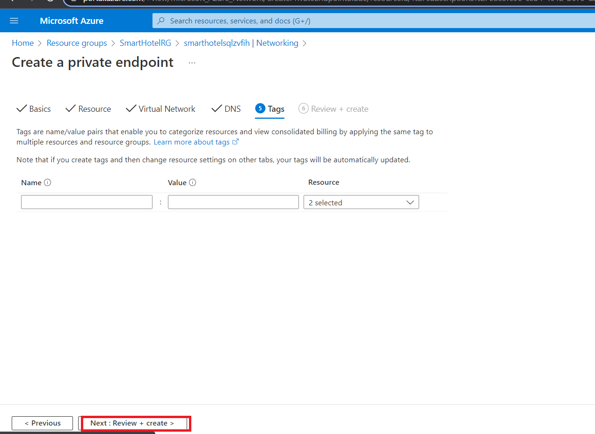

# 实验 03 - 将 VM 从本地环境迁移到 Azure 

## 目的

在本实验中，我们将使用 Azure Migrate 工具和 Azure
迁移项目中的评估数据迁移本地 VM，我们将注册 Azure Migrate
设备进行复制，然后为复制的 VM 配置静态 IP，最后将 VM
迁移到相应资源组中的 Azure。

### 任务 1：创建存储帐户

在此任务中，你将创建一个新的 **Azure 存储帐户**，该帐户将由 **Azure
Migrate：服务器迁移**在迁移期间用于存储虚拟机数据。

> **注意：**本实验重点介绍工作负载迁移所需的技术工具。在实际场景中，在迁移资产之前，应该更多地考虑长期计划。托管
> VM
> 所需的登陆区域还应包括网络流量、访问控制、资源组织和治理方面的注意事项。例如，CAF
> 迁移蓝图和 CAF
> 基础蓝图可用于部署预定义的登陆区域，并展示基础设施即代码 （IaC）
> 方法在基础设施资源管理方面的潜力。

1.  切换回 **Azure 门户**选项卡或打开新选项卡并导航到
    `https://portal.azure.com` 并使用 Office 365 租户凭据登录。在 Azure
    门户的左侧导航栏中，选择 “**+** **Create** a resource” 。

- 

  自动生成图形用户界面、文本、应用程序、电子邮件描述

2.  搜索并选择 `Storage account`，然后选择 **Create**。

- 

  图形用户界面，自动生成应用程序描述

  

  自动生成图形用户界面、文本、应用程序、电子邮件描述

3.  在“**Create storage
    account**”边栏选项卡的“**Basics**”选项卡上，使用以下值：

    - 订阅：**保留默认选择的订阅。**

    - 资源组：**AzureMigrateRG**

    - 存储帐户名称：`migstrgXXXXXX` \[将 **XXXXXX** 替换为随机数\]

    - 地点：**West US**。

    - 性能：**Standard**

    - 冗余：**Locally-redundant storage （**本地冗余存储） **(LRS)**

- 

  自动生成的计算机 Description 的屏幕截图

4.  选择“**Data protection**” 选项卡，\[**取消选中**\] “**Enable soft
    delete blobs**” ，然后选择 “**Review**” 按钮，然后选择 “**Create**”
    。

- 

  自动生成的计算机 Description 的屏幕截图

  

  自动生成的计算机 Description 的屏幕截图

  

  自动生成的计算机 Description 的屏幕截图

5.  单击 “转到资源” ，然后在 “**Data management**” 下选择“**Data
    protection**” ，确保未选中 “**Enable soft delete for blobs**”
    ，然后单击 “**Save**”按钮。

- 

您已完成此任务。请勿关闭此选项卡以继续执行下一个任务。

**任务摘要**

在此任务中，你创建了一个新的 Azure 存储帐户，该帐户将由 Azure
Migrate：服务器迁移使用。

### 任务 2：创建专用终端节点

在此任务中，您将在提供的虚拟网络上创建一个终结点，该终端节点将由 SQL
Server 资源使用。

您还将在此网络中配置私有终端节点，以允许对 SQL
数据库进行私有、安全的访问。

> **注意：**Azure
> 提供了多个选项来部署正确的网络配置。完成实验后，如果想要更好地了解网络选项，请参阅
> \[网络决策指南\] `https://docs.microsoft.com/azure/cloud-adoption-framework/decision-guides/software-defined-network`，它基于云采用框架的
> Azure 登陆区域构建。

1.  导航到 **SmartHotelRG** 资源组，然后单击列出的 **SQL
    Server**，如下图所示。

- 

  自动生成图形用户界面、文本、应用程序、电子邮件描述

  

  自动生成图形用户界面、文本、应用程序描述

2.  在“**Security**”下，选择 “**Networking -\>Private access**”
    ，然后选择 “**+ Create a Private endpoint**” 。

- 

3.  在 **Basics** 选项卡上，输入以下配置，然后选择 **Next: Resource**：

    - 资源组：**SmartHotelRG**

    - 名称：`SmartHotel-DB-Endpoint`

    - 区域：**West US** (选择与 SmartHotelVNet 相同的位置。)

- 

  自动生成的计算机 Description 的屏幕截图

4.  在 Resource （资源） 选项卡上，输入以下配置，然后选择 **Next：
    Virtual Network**（下一步：虚拟网络）：

    - 目标子资源： **sqlServer**

- 

5.  在 **Virtual Network** （虚拟网络） 选项卡上，输入以下配置，然后选择
    **Next： DNS**（下一步： DNS）：

    - 虚拟网络：**SmartHotelVNet**

    - 子网：**SmartHotelDB (192.168.0.128/25)**

    - Private IP configuration（私有 IP 配置）：选择 **Dynamically
      allocate IP address**（动态分配 IP 地址）

- 

6.  在 **DNS** 选项卡上，输入以下配置，然后选择 **Next： Tags**。

    - 与私有 DNS 区域集成：**Yes**

    - 订阅：**保留默认选定的订阅**

    - 资源组：**SmartHotelRG**

- 

7.  选择 **Review + create**。

- 

8.  选择 **Create**。

- 

  自动生成的计算机 Description 的屏幕截图

9.  **等待**部署完成。

- 

  自动生成的计算机 Description 的屏幕截图

10. 打开“**Private Endpoint**” 边栏选项卡，单击“**DNS configuration**”
    ，并注意终结点的 **FQDN** 列为 **\database.windows.net**，内部 IP
    地址为 **192.168.0.132**。

- 

  自动生成的计算机 Description 的屏幕截图

> **注意：**使用专用 DNS，因此数据库域名 **\database.windows.net** 在从
> SmartHotelVNet 解析时解析为内部私有终端节点 IP 地址
> **192.168.0.132**，但在从 VNet 外部解析时解析为数据库服务器面向
> Internet 的 IP
> 地址。这意味着在这两种情况下都可以使用相同的连接字符串（包含域名）。
>
> **注意：**如果私有端点连接不允许 IP
> 地址或数据库域名连接到数据库，则可能需要创建新的防火墙规则以允许数据库和私有链接的
> IP 地址范围。

您已完成此任务。请勿关闭此选项卡以继续执行下一个任务。

**任务摘要**

在此任务中，您在虚拟网络上创建了一个专用终端节点，该终端节点将用于访问
SQL 数据库。

### 任务 3：为存储帐户创建专用终结点

在此任务中，您将在提供的虚拟网络上创建一个终端节点，该终端节点将由**复制存储帐户**使用。您还将在此网络中配置一个专用终端节点，以允许对**复制存储帐户**进行私有、安全的访问。

1.  导航到 **AzureMigrateRG** 资源组，然后单击列出的复制存储帐户
    **migstrgXXXXXX**，如下图所示。

- 

  自动生成的计算机 Description 的屏幕截图

2.  在 “**Security**” 下，选择 “**Networking -\> Private endpoint
    connections**” ，然后选择 “**+ Private endpoint**” 。

- 

  自动生成的计算机 Description 的屏幕截图

3.  在 **Basics** 选项卡上，输入以下配置，然后选择 **Next: Resource**：

    - 资源组： **AzureMigrateRG**

    - 名称：`Storage-Endpoint`

    - 区域： **West US**

- 

  自动生成的计算机 Description 的屏幕截图

4.  在 **Resource** （资源） 选项卡上，输入以下配置，然后选择 **Next：
    Virtual Network**（下一步：虚拟网络）：

    - 目标子资源： **blob**

- 

  自动生成的计算机 Description 的屏幕截图

5.  在 **Virtual Network** （虚拟网络） 选项卡上，输入以下配置，然后选择
    **Next： DNS**（下一步： DNS）：

    - 虚拟网络： **smarthotelhostvnet**

    - 子网： **hostsubnet**

    - Private IP configuration（私有 IP 配置）：选择 **Dynamically
      allocate IP address**（动态分配 IP 地址）

- 

  自动生成的计算机 Description 的屏幕截图

6.  在 **DNS** 选项卡上，输入以下配置，然后选择 **Next： Tags**。

    - 与私有 DNS 区域集成：**Yes**

    - 订阅：**保留默认选定的订阅**

    - 资源组： **SmartHotelHostRG**

- 

  自动生成的计算机 Description 的屏幕截图

7.  选择 **Review + create**。

- 

  自动生成的计算机 Description 的屏幕截图

8.  选择 **Create**。

- 

  自动生成的计算机 Description 的屏幕截图

9.  **等待**部署完成。

- 

  自动生成的计算机 Description 的屏幕截图

**任务摘要**

在此任务中，您在虚拟网络上创建了一个专用终端节点，该终端节点将用于访问**复制存储帐户**。

### 任务 4：注册 Hyper-V 主机进行迁移和现代化

在此任务中，您将向 **Azure Migrate: Server Migration** 服务注册 Hyper-V
主机。此服务使用 **Azure Site Recovery**
作为基础迁移引擎。在注册过程中，你将在 **Hyper-V 主机**上部署 **Azure
Site Recovery 提供程序**。

1.  返回到 **Azure 门户** `https://portal.azure.com` 中的 **Azure
    Migrate** 边栏选项卡。

- 

  图形用户界面，自动生成应用程序描述

2.  在左侧的 **Migration goals** 下选择 **Servers，databases and
    webapps**。在 **Migration tools** （迁移工具） 下，选择 **Discover**
    （发现）。

- > **注意：**您可能需要自行添加迁移工具，方法是按照“**Migration
  > Tools**”部分下方的链接，选择“**Azure Migrate: Server Migration**”
  > ，然后选择“**Add tool(s)**”。

  

  自动生成的计算机 Description 的屏幕截图

3.  在 **Discover machines** （发现计算机） 面板中，For **Where do you
    want to migrate to？** （您要迁移到何处？选择 Azure VM，在 **Are
    your machines virtualized** 下，选择 **Yes**， **with Hyper-V**。在
    **Target region** （目标区域） 下，输入 **West US** （**与 Azure SQL
    数据库使用的区域相同**，可在 Azure
    门户中找到）并选中确认复选框。选择“**Create resources**” 以开始部署
    Azure Migrate 使用的 Azure Site Recovery资源：用于 **Hyper-V
    迁移**的服务器迁移。 I

- 

  自动生成的计算机 Description 的屏幕截图

4.  部署完成后，应使用其他说明更新 “**Discover machines**” 面板。

- 

  自动生成的文本 Description 的特写

5.  将 **Hyper-V 复制**提供程序软件安装程序的 **Download** （下载）
    链接复制到剪贴板。

- 

  自动生成的计算机 Description 的屏幕截图

6.  打开 **SmartHotelHost** 远程桌面窗口，从桌面快捷方式启动
    **Chrome**，然后将链接粘贴到新的浏览器选项卡中，以下载 Azure Site
    Recovery 提供程序安装程序。

- 

  自动生成图形用户界面、文本、应用程序描述

7.  返回到浏览器中的 **Discover machines** （发现计算机） 页面（在
    SmartHotelHost 远程桌面会话之外）。选择蓝色的 **Download** （下载）
    按钮并下载注册密钥文件。

- 

  自动生成图形用户界面、文本、应用程序、电子邮件描述

8.  在 Windows 资源管理器中打开文件位置，然后将文件复制到剪贴板。返回到
    **SmartHotelHost** 远程桌面会话并将文件粘贴到桌面。

- 

  图形用户界面，自动生成应用程序描述

9.  仍在 **SmartHotelHost** 远程桌面会话中，打开您刚才下载的
    **AzureSiteRecoveryProvider.exe** 安装程序。

- 

  自动生成图形用户界面、文本、应用程序、电子邮件描述

10. 在 **Microsoft Update** 选项卡上，选择 **Off** （关闭），然后选择
    **Next** （下一步）。

- 

  自动生成图形用户界面、文本、应用程序、电子邮件描述

11. 接受默认安装位置，然后单击 **Install**。

- 

  自动生成图形用户界面、文本、应用程序描述

12. 选择 **Register** 。

- 

  自动生成图形用户界面、文本、应用程序、电子邮件描述

13. 浏览到您下载的密钥文件的位置。加载密钥后，选择 **Next**。

- 

  自动生成图形用户界面、文本、应用程序、电子邮件描述

14. 选择 “**Connect directly to Azure Site Recovery without a proxy
    server**” ，然后选择 “**Next**” 。将开始向 **Azure Site Recovery**
    **注册** **Hyper-V 主机**。

- 

  自动生成图形用户界面、文本、应用程序、电子邮件描述

15. 等待注册完成（这可能需要几分钟）。然后选择 **Finish** （完成）。

- 

  自动生成图形用户界面、文本、应用程序描述

16. 最小化 **SmartHotelHost** 远程桌面会话并返回到 **Azure Migrate**
    浏览器窗口。**Refresh** 浏览器，然后通过选择 **Migration tools**下的
    **Discover** 重新打开**发现机器机**面板。

- 

  自动生成的计算机 Description 的屏幕截图

17. 为 **Are your machines virtualized?** （您的计算机是否已虚拟化？）
    选择 **Yes**， with Hyper-V （是，使用 Hyper-V？）。单击 **Finalize
    registration** 按钮，该按钮现在应已启用。

- 

  自动生成的计算机 Description 的屏幕截图

18. Azure Migrate 现在将完成向 Hyper-V
    主机注册。**等待**注册完成。这可能需要几分钟时间。

- 

  自动生成的计算机 Description 的屏幕截图

19. 注册完成后，关闭 **Discover machines** 面板。

- 

  自动生成的计算机错误描述的屏幕截图

20. **Migration and modernization** （迁移和现代化） 面板现在应显示 **5
    个发现的服务器**。

- 

  自动生成的计算机 Description 的屏幕截图

**任务摘要**

在此任务中，您向 Azure Migrate 服务器迁移服务注册了 Hyper-V 主机。

### 任务 5：启用从 Hyper-V 到 Azure Migrate 的复制

在此任务中，你将配置并启用本地虚拟机从 Hyper-V 到 Azure Migrate
服务器迁移服务的复制。

1.  在 **Migration and modernization** （迁移和现代化） 下，选择
    **Replicate**（复制）。这将打开 **Replicate** 向导

- 

  自动生成的计算机 Description 的屏幕截图

2.  在 **Specify intent** （指定意图） 选项卡中，输入以下配置，然后选择
    **Continue** （继续）。

    - 您要迁移的内容：**Servers or virtual machines(VM)**

    - 要迁移到的位置：**Azure VM**

    - 您的机器是否虚拟化了？– **Yes, with Hyper-V**

- 

  自动生成的计算机 Description 的屏幕截图

3.  在“**Virtual machines**” 选项卡上的 “**Import migration settings
    from an assessment**” 下，选择 “**Yes, apply migration settings from
    an Azure Migrate assessment**”。选择 **SmartHotel VMs** VM 组和
    **SmartHotelAssessment** 迁移评估。

- 

  自动生成的计算机 Description 的屏幕截图

4.  **Virtual machines** （虚拟机）
    选项卡现在应显示评估中包含的虚拟机。选择
    **UbuntuWAF**、**smarthotelweb1** 和 **smarthotelweb2**
    虚拟机，然后选择 Next。

- 

  自动生成的计算机 Description 的屏幕截图

5.  在 **Target settings** （目标设置） 选项卡上，选择您的订阅和现有的
    **SmartHotelRG** 资源组。在“**Cache storage account**”下，选择
    **migstrgXXXXXX** 存储帐户，然后在“**Virtual Network**”
    下选择“**SmartHotelVNet**” 。在 Subnet （子网） 下，选择
    **SmartHotel**。选择 **Next**（下一步）。

- 

  自动生成的计算机 Description 的屏幕截图

6.  在 **Compute** （计算） 选项卡上，为每个虚拟机选择
    **Standard_F2s_v2** VM 大小。为 **smarthotelweb** 虚拟机选择
    **Windows operating system**，为 **UbuntuWAF** 虚拟机选择
    **Linux**作系统。选择 **Next**（下一步）。

- 

  自动生成的计算机 Description 的屏幕截图

7.  在 **Disks** （磁盘）
    选项卡上，查看设置，但不要进行任何更改。选择 **Next**

- 

  自动生成的计算机 Description 的屏幕截图

8.  在 **Tags** 选项卡上，单击 **Next**，然后在 **Review + Start**复制
    选项卡上，单击 **Replicate** 按钮。

9.  在“**Migration tools**” 边栏选项卡中的 “**Migration and
    modernization**” 下，选择 “**Overview**”按钮。

- 

  自动生成的计算机 Description 的屏幕截图

10. 确认 3 台计算机正在复制。

- 

  自动生成的计算机 Description 的屏幕截图

11. 在左侧的 **Manage** 下选择 **Replication**。选择
    **Refresh**（刷新），然后等待所有三台计算机都处于 **Protected**
    （受保护） 状态，这表明初始复制已完成。这将需要几分钟时间。

- 

  自动生成的计算机 Description 的屏幕截图

> **注意：**虚拟机的复制大约需要 20-40 分钟才能完成，请等待相同时间。

自动生成的计算机 Description 的屏幕截图

您已完成任务。请勿关闭窗口并继续执行下一个任务。

**任务摘要**

在此任务中，您启用了从 Hyper-V 主机到 Azure Migrate 的复制，并在 Azure
中配置了复制的 VM 大小。

### 任务 6：为每个 VM 配置静态内部 IP 地址

在此任务中，您将修改每个复制的 VM 的设置，以使用与该计算机的本地 IP
地址匹配的静态专用 IP 地址。

1.  仍在使用 **Azure Migrate: Migration and modernization |
    Replication** 边栏选项卡中，选择 **smarthotelweb1**
    虚拟机。这将打开此计算机的详细迁移和复制边栏选项卡。花点时间研究一下这些信息。

- 

  自动生成的计算机 Description 的屏幕截图

2.  在左侧的 **General**（常规）下选择 **Compute and
    Network**（计算和网络），然后选择 **Edit**（编辑）。

- 

  自动生成的计算机 Description 的屏幕截图

3.  确认 VM 配置为使用 **F2s_v2** VM 大小（或者 **DS2_v2 或 D2s_v3**）。

- 

4.  在 **Network Interfaces** （网络接口） 下，选择
    **InternalNATSwitch** 以打开**网络接口设置**。

- 

  自动生成的计算机 Description 的屏幕截图

5.  将 **Private IP address**（私有 IP 地址）更改为 `192.168.0.4`。选择
    “**OK**” 以关闭“网络接口设置”边栏选项卡。

- 

  自动生成图形用户界面、文本、应用程序描述

6.  **保存 smarthotelweb1** 设置。

- 

  自动生成的计算机 Description 的屏幕截图

  

> **注 -** 重复这些步骤，为另一个

7.  仍在使用 **Azure Migrate: Migration and modernization |
    Replication** 边栏选项卡中，选择 **smarthotelweb2** 虚拟机。

- 

  自动生成的计算机 Description 的屏幕截图

8.  在左侧的 **General**（常规）下选择 **Compute and
    Network**（计算和网络），然后选择 **Edit**（编辑）。

- 

9.  在 **Network Interfaces** （网络接口） 下，选择
    **InternalNATSwitch** 以打开网络接口设置。

- 

10. 将 **Private IP address**（私有 IP 地址）更改为 `192.168.0.5`。选择
    “**OK**”以关闭“网络接口设置” 边栏选项卡。

- 

11. **保存 smarthotelweb2** 设置。

- 

12. 使用 **Azure Migrate: Migration and modernization | Replicating
    machines** 边栏选项卡中，选择 **UbuntuWAF**
    虚拟机。这将打开此计算机的详细迁移和复制边栏选项卡

- 

  自动生成的计算机 Description 的屏幕截图

13. 在左侧的 **General**（常规）下选择 **Compute and
    Network**（计算和网络），然后选择 **Edit**（编辑）

- 

  自动生成图形用户界面、文本、应用程序、电子邮件描述

14. 确认 VM 配置为使用 **F2s_v2** VM 大小 。在 **Network Interfaces**
    （网络接口） 下，选择 **InternalNATSwitch** 以打开网络接口设置。

- 

15. 将 **Private IP address**（私有 IP 地址）更改为 `192.168.0.8`。选择
    “**OK**” 以关闭“网络接口设置” 边栏选项卡。

- 

  图形用户界面，自动生成应用程序描述

16. **保存 UbuntuWAF** 设置。

- 

  图形用户界面，自动生成应用程序描述

您已完成任务。请勿关闭窗口并继续执行下一个任务。

**任务摘要**

在此任务中，您修改了每个复制的 VM 的设置，以使用与该计算机的本地 IP
地址匹配的静态专用 IP 地址

> **注意：**Azure Migrate 会对 VM
> 设置进行“最佳猜测”，但你可以完全控制已迁移项的设置。在这种情况下，设置静态专用
> IP 地址可确保 Azure 中的虚拟机保留它们在本地拥有的相同
> IP，从而避免在迁移期间必须重新配置 VM（例如，通过编辑 web.config
> 文件）。

### 任务 7：服务器迁移

在此任务中，您将执行 UbuntuWAF、smarthotelweb1 和 smarthotelweb2
计算机到 Azure 的迁移。

> **注意：**在实际场景中，您将在最终迁移之前执行测试迁移。为了节省时间，您将跳过此实验室中的测试迁移。测试迁移过程与最终迁移非常相似。

1.  使用顶部的链接返回到“**Azure Migrate: Servers, databases and web
    apps**”边栏选项卡，如下图所示。

- 

2.  单击 **Migration tools** 部分下的 **Overview**。

- 

  自动生成的计算机 Description 的屏幕截图

3.  在 **Step 3： Migrate** （步骤 3： 迁移） 下，选择 **Migrate**
    （迁移）。

- 

  自动生成的计算机 Description 的屏幕截图

4.  在 **Specify Intent** 页面上，确保选择 **Azure VM**，然后单击
    Continue

- 

  自动生成的计算机 Description 的屏幕截图

  > **注意：**您可以选择是否在迁移之前自动关闭本地虚拟机，以最大程度地减少数据丢失。任一设置都适用于此实验室。

5.  在“**Migrate**”边栏选项卡上，选择 3
    个虚拟机，然后选择“**Migrate**”以启动迁移过程。

- 

  自动生成的计算机 Description 的屏幕截图

6.  迁移过程将开始。

- 

7.  要监控进度，请选择左侧 **Manage** 下的 **Jobs**，然后查看三个
    **Planned failover** jobs 的状态。

- 

  自动生成的计算机 Description 的屏幕截图

8.  **等待**所有三个 **Planned failover** jobs 都显示 **Status
    （成功**）。您不需要刷新浏览器。这可能需要长达 **15 分钟**的时间。

- 

  自动生成的计算机 Description 的屏幕截图

9.  导航到 **SmartHotelRG** 资源组，并检查是否已为要迁移的每个虚拟机创建
    VM、网络接口和磁盘资源。

- 

  自动生成图形用户界面、文本、应用程序、电子邮件描述

  

  自动生成的计算机 Description 的屏幕截图

**任务摘要**

在此任务中，您使用 Azure Migrate 使用已配置的设置和从 Hyper-V
计算机复制的数据创建 Azure VM。这会将您的本地 VM 迁移到 Azure。

### 总结

在练习结束时，我们应该已成功复制 3 个 VM，然后将其迁移到 SmartHotelRG
资源组。

- **smarthotelweb1**

- **smarthotelweb2**

- **UbuntuWAF**

我们还需要停止已迁移的 VM 和 SmartHotelHost VM
以节省积分，以确保可以完成剩余的实验。

自动生成图形用户界面、文本、应用程序、电子邮件描述

自动生成图形用户界面、文本、应用程序、电子邮件描述

我们还需要停止已迁移的 VM 和 SmartHotelHost VM
以节省积分，以确保可以完成剩余的实验。
