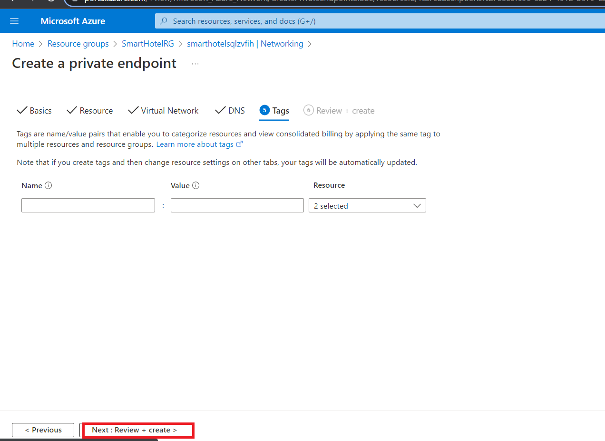
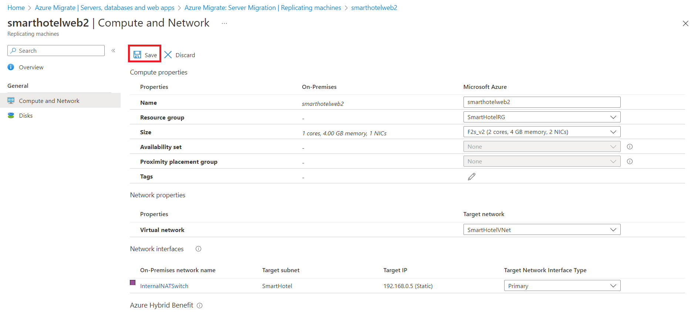

# 實驗 03 - 將 VM 從本地環境遷移到 Azure 

## 目的

在本實驗中，我們將使用 Azure Migrate 工具和 Azure
遷移項目中的評估數據遷移本地 VM，我們將註冊 Azure Migrate
設備進行複製，然後為複製的 VM 配置靜態 IP，最後將 VM
遷移到相應資源組中的 Azure。

### 任務 1：創建存儲帳戶

在此任務中，你將創建一個新的 **Azure 存儲帳戶**，該帳戶將由 **Azure
Migrate：服務器遷移**在遷移期間用於存儲虛擬機數據。

> **注意** 本實驗重點介紹工作負載遷移所需的技術工具。在實際場景中，在遷移資產之前，應該更多地考慮長期計劃。託管
> VM
> 所需的登陸區域還應包括網絡流量、訪問控制、資源組織和治理方面的注意事項。例如，CAF
> 遷移藍圖和 CAF
> 基礎藍圖可用於部署預定義的登陸區域，並展示基礎設施即代碼 （IaC）
> 方法在基礎設施資源管理方面的潛力。

1.  切換回 **Azure 門戶**選項卡或打開新選項卡並導航到
    `https://portal.azure.com` 並使用 Office 365 租戶憑據登錄。在 Azure
    門戶的左側導航欄中，選擇 “**+** **Create** a resource” 。

- 

  自動生成圖形用戶界面、文本、應用程序、電子郵件描述

2.  搜索並選擇 `Storage account`，然後選擇 **Create**。

- 

  圖形用戶界面，自動生成應用程序描述

  

  自動生成圖形用戶界面、文本、應用程序、電子郵件描述

3.  在“**Create storage
    account**”邊欄選項卡的“**Basics**”選項卡上，使用以下值：

    - 訂閱：**保留默認選擇的訂閱。**

    - 資源組：**AzureMigrateRG**

    - 存儲帳戶名稱：`migstrgXXXXXX` \[將 **XXXXXX** 替換為隨機數\]

    - 地點：**West US**。

    - 性能：**Standard**

    - 冗餘：**Locally-redundant storage （** 本地冗餘存儲） **(LRS)**

- 

  自動生成的計算機 Description 的屏幕截圖

4.  選擇“**Data protection**” 選項卡，\[**取消選中**\] “**Enable soft
    delete blobs**” ，然後選擇 “**Review**” 按鈕，然後選擇 “**Create**”
    。

- 

  自動生成的計算機 Description 的屏幕截圖

  

  自動生成的計算機 Description 的屏幕截圖

  

  自動生成的計算機 Description 的屏幕截圖

5.  單擊 “轉到資源” ，然後在 “**Data management**” 下選擇“**Data
    protection**” ，確保未選中 “**Enable soft delete for blobs**”
    ，然後單擊 “**Save**”按鈕。

- 

您已完成此任務。請勿關閉此選項卡以繼續執行下一個任務。

**任務摘要**

在此任務中，你創建了一個新的 Azure 存儲帳戶，該帳戶將由 Azure
Migrate：服務器遷移使用。

### 任務 2：創建專用終端節點

在此任務中，您將在提供的虛擬網絡上創建一個終結點，該終端節點將由 SQL
Server 資源使用。

您還將在此網絡中配置私有終端節點，以允許對 SQL
數據庫進行私有、安全的訪問。

> **注意** Azure
> 提供了多個選項來部署正確的網絡配置。完成實驗後，如果想要更好地瞭解網絡選項，請參閱
> \[網絡決策指南\]`https://docs.microsoft.com/azure/cloud-adoption-framework/decision-guides/software-defined-network`，它基於雲採用框架的
> Azure 登陸區域構建。

1.  導航到 **SmartHotelRG** 資源組，然後單擊列出的 **SQL
    Server**，如下圖所示。

- 

  自動生成圖形用戶界面、文本、應用程序、電子郵件描述

  

  自動生成圖形用戶界面、文本、應用程序描述

2.  在“**Security**”下，選擇 “**Networking -\>Private access**”
    ，然後選擇 “**+ Create a Private endpoint**” 。

- 

3.  在 **Basics** 選項卡上，輸入以下配置，然後選擇 **Next: Resource**：

    - 資源組：**SmartHotelRG**

    - 名稱：`SmartHotel-DB-Endpoint`

    - 區域：**West US** (選擇與 SmartHotelVNet 相同的位置。)

- 

  自動生成的計算機 Description 的屏幕截圖

4.  在 Resource （資源） 選項卡上，輸入以下配置，然後選擇 **Next：
    Virtual Network**（下一步：虛擬網絡）：

    - 目標子資源： **sqlServer**

- 

5.  在 **Virtual Network** （虛擬網絡） 選項卡上，輸入以下配置，然後選擇
    **Next： DNS**（下一步： DNS）：

    - 虛擬網絡：**SmartHotelVNet**

    - 子網：**SmartHotelDB (192.168.0.128/25)**

    - Private IP configuration（私有 IP 配置）：選擇 **Dynamically
      allocate IP address**（動態分配 IP 地址）

- 

6.  在 **DNS** 選項卡上，輸入以下配置，然後選擇 **Next： Tags**。

    - 與私有 DNS 區域集成：**Yes**

    - 訂閱：**保留默認選定的訂閱**

    - 資源組：**SmartHotelRG**

- 

7.  選擇 **Review + create**。

- 

8.  選擇 **Create**。

- 

  自動生成的計算機 Description 的屏幕截圖

9.  **等待**部署完成。

- 

  自動生成的計算機 Description 的屏幕截圖

10. 打開“**Private Endpoint**” 邊欄選項卡，單擊“**DNS configuration**”
    ，並注意終結點的 **FQDN** 列為 **\database.windows.net**，內部 IP
    地址為 **192.168.0.132**。

- 

  自動生成的計算機 Description 的屏幕截圖

> **注意** 使用專用 DNS，因此數據庫域名 **\database.windows.net** 在從
> SmartHotelVNet 解析時解析為內部私有終端節點 IP 地址
> **192.168.0.132**，但在從 VNet 外部解析時解析為數據庫服務器面向
> Internet 的 IP
> 地址。這意味著在這兩種情況下都可以使用相同的連接字符串（包含域名）。
>
> **注意** 如果私有端點連接不允許 IP
> 地址或數據庫域名連接到數據庫，則可能需要創建新的防火牆規則以允許數據庫和私有鏈接的
> IP 地址範圍。

您已完成此任務。請勿關閉此選項卡以繼續執行下一個任務。

**任務摘要**

在此任務中，您在虛擬網絡上創建了一個專用終端節點，該終端節點將用於訪問
SQL 數據庫。

### 任務 3：為存儲帳戶創建專用終結點

在此任務中，您將在提供的虛擬網絡上創建一個終端節點，該終端節點將由**複製存儲帳戶**使用。您還將在此網絡中配置一個專用終端節點，以允許對**複製存儲帳戶**進行私有、安全的訪問。

1.  導航到 **AzureMigrateRG** 資源組，然後單擊列出的複製存儲帳戶
    **migstrgXXXXXX**，如下圖所示。

- 

  自動生成的計算機 Description 的屏幕截圖

2.  在 “**Security**” 下，選擇 “**Networking -\> Private endpoint
    connections**” ，然後選擇 “**+ Private endpoint**” 。

- 

  自動生成的計算機 Description 的屏幕截圖

3.  在 **Basics** 選項卡上，輸入以下配置，然後選擇 **Next: Resource**：

    - 資源組： **AzureMigrateRG**

    - 名稱：`Storage-Endpoint`

    - 區域： **West US**

- 

  自動生成的計算機 Description 的屏幕截圖

4.  在 **Resource** （資源） 選項卡上，輸入以下配置，然後選擇 **Next：
    Virtual Network**（下一步：虛擬網絡）：

    - 目標子資源： **blob**

- 

  自動生成的計算機 Description 的屏幕截圖

5.  在 **Virtual Network** （虛擬網絡） 選項卡上，輸入以下配置，然後選擇
    **Next： DNS**（下一步： DNS）：

    - 虛擬網絡： **smarthotelhostvnet**

    - 子網： **hostsubnet**

    - Private IP configuration（私有 IP 配置）：選擇 **Dynamically
      allocate IP address**（動態分配 IP 地址）

- 

  自動生成的計算機 Description 的屏幕截圖

6.  在 **DNS** 選項卡上，輸入以下配置，然後選擇 **Next： Tags**。

    - 與私有 DNS 區域集成：**Yes**

    - 訂閱：**保留默認選定的訂閱**

    - 資源組： **SmartHotelHostRG**

- 

  自動生成的計算機 Description 的屏幕截圖

7.  選擇 **Review + create**。

- 

  自動生成的計算機 Description 的屏幕截圖

8.  選擇 **Create**。

- 

  自動生成的計算機 Description 的屏幕截圖

9.  **等待**部署完成。

- 

  自動生成的計算機 Description 的屏幕截圖

**任務摘要**

在此任務中，您在虛擬網絡上創建了一個專用終端節點，該終端節點將用於訪問**複製存儲帳戶**。

### 任務 4：註冊 Hyper-V 主機進行遷移和現代化

在此任務中，您將向 **Azure Migrate: Server Migration** 服務註冊 Hyper-V
主機。此服務使用 **Azure Site Recovery**
作為基礎遷移引擎。在註冊過程中，你將在 **Hyper-V 主機**上部署 **Azure
Site Recovery 提供程序**。

1.  返回到 **Azure 門戶** `https://portal.azure.com` 中的 **Azure
    Migrate** 邊欄選項卡。

- 

  圖形用戶界面，自動生成應用程序描述

2.  在左側的 **Migration goals** 下選擇 **Servers，databases and
    webapps**。在 **Migration tools** （遷移工具） 下，選擇 **Discover**
    （發現）。

- > **注意** 您可能需要自行添加遷移工具，方法是按照“**Migration
  > Tools**”部分下方的鏈接，選擇“**Azure Migrate: Server Migration**”
  > ，然後選擇“**Add tool(s)**”。

  

  自動生成的計算機 Description 的屏幕截圖

3.  在 **Discover machines** （發現計算機） 面板中，For **Where do you
    want to migrate to？** （您要遷移到何處？選擇 Azure VM，在 **Are
    your machines virtualized** 下，選擇 **Yes**， **with Hyper-V**。在
    **Target region** （目標區域） 下，輸入 **West US** （**與 Azure SQL
    數據庫使用的區域相同**，可在 Azure
    門戶中找到）並選中確認複選框。選擇“**Create resources**” 以開始部署
    Azure Migrate 使用的 Azure Site Recovery資源：用於 **Hyper-V
    遷移**的服務器遷移。 I

- 

  自動生成的計算機 Description 的屏幕截圖

4.  部署完成後，應使用其他說明更新 “**Discover machines**” 面板。

- 

  自動生成的文本 Description 的特寫

5.  將 **Hyper-V 複製**提供程序軟件安裝程序的 **Download** （下載）
    鏈接複製到剪貼板。

- 

  自動生成的計算機 Description 的屏幕截圖

6.  打開 **SmartHotelHost** 遠程桌面窗口，從桌面快捷方式啟動
    **Chrome**，然後將鏈接粘貼到新的瀏覽器選項卡中，以下載 Azure Site
    Recovery 提供程序安裝程序。

- 

  自動生成圖形用戶界面、文本、應用程序描述

7.  返回到瀏覽器中的 **Discover machines** （發現計算機） 頁面（在
    SmartHotelHost 遠程桌面會話之外）。選擇藍色的 **Download** （下載）
    按鈕並下載註冊密鑰文件。

- 

  自動生成圖形用戶界面、文本、應用程序、電子郵件描述

8.  在 Windows 資源管理器中打開文件位置，然後將文件複製到剪貼板。返回到
    **SmartHotelHost** 遠程桌面會話並將文件粘貼到桌面。

- 

  圖形用戶界面，自動生成應用程序描述

9.  仍在 **SmartHotelHost** 遠程桌面會話中，打開您剛才下載的
    **AzureSiteRecoveryProvider.exe** 安裝程序。

- 

  自動生成圖形用戶界面、文本、應用程序、電子郵件描述

10. 在 **Microsoft Update** 選項卡上，選擇 **Off** （關閉），然後選擇
    **Next** （下一步）。

- 

  自動生成圖形用戶界面、文本、應用程序、電子郵件描述

11. 接受默認安裝位置，然後單擊 **Install**。

- 

  自動生成圖形用戶界面、文本、應用程序描述

12. 選擇 **Register** 。

- 

  自動生成圖形用戶界面、文本、應用程序、電子郵件描述

13. 瀏覽到您下載的密鑰文件的位置。加載密鑰後，選擇 **Next**。

- 

  自動生成圖形用戶界面、文本、應用程序、電子郵件描述

14. 選擇 “**Connect directly to Azure Site Recovery without a proxy
    server**” ，然後選擇 “**Next**” 。將開始向 **Azure Site Recovery**
    **註冊** **Hyper-V 主機**。

- 

  自動生成圖形用戶界面、文本、應用程序、電子郵件描述

15. 等待註冊完成（這可能需要幾分鐘）。然後選擇 **Finish** （完成）。

- 

  自動生成圖形用戶界面、文本、應用程序描述

16. 最小化 **SmartHotelHost** 遠程桌面會話並返回到 **Azure Migrate**
    瀏覽器窗口。**Refresh** 瀏覽器，然後通過選擇 **Migration tools**下的
    **Discover** 重新打開**發現機器機**面板。

- 

  自動生成的計算機 Description 的屏幕截圖

17. 為 **Are your machines virtualized?** （您的計算機是否已虛擬化？）
    選擇 **Yes**， with Hyper-V （是，使用 Hyper-V？）。單擊 **Finalize
    registration** 按鈕，該按鈕現在應已啟用。

- 

  自動生成的計算機 Description 的屏幕截圖

18. Azure Migrate 現在將完成向 Hyper-V
    主機註冊。**等待**註冊完成。這可能需要幾分鐘時間。

- 

  自動生成的計算機 Description 的屏幕截圖

19. 註冊完成後，關閉 **Discover machines** 面板。

- 

  自動生成的計算機錯誤描述的屏幕截圖

20. **Migration and modernization** （遷移和現代化） 面板現在應顯示 **5
    個發現的服務器**。

- 

  自動生成的計算機 Description 的屏幕截圖

**任務摘要**

在此任務中，您向 Azure Migrate 服務器遷移服務註冊了 Hyper-V 主機。

### 任務 5：啟用從 Hyper-V 到 Azure Migrate 的複製

在此任務中，你將配置並啟用本地虛擬機從 Hyper-V 到 Azure Migrate
服務器遷移服務的複製。

1.  在 **Migration and modernization** （遷移和現代化） 下，選擇
    **Replicate**（複製）。這將打開 **Replicate** 嚮導

- 

  自動生成的計算機 Description 的屏幕截圖

2.  在 **Specify intent** （指定意圖） 選項卡中，輸入以下配置，然後選擇
    **Continue** （繼續）。

    - 您要遷移的內容：**Servers or virtual machines(VM)**

    - 要遷移到的位置：**Azure VM**

    - 您的機器是否虛擬化了？– **Yes, with Hyper-V**

- 

  自動生成的計算機 Description 的屏幕截圖

3.  在“**Virtual machines**” 選項卡上的 “**Import migration settings
    from an assessment**” 下，選擇 “**Yes, apply migration settings from
    an Azure Migrate assessment**”。選擇 **SmartHotel VMs** VM 組和
    **SmartHotelAssessment** 遷移評估。

- 

  自動生成的計算機 Description 的屏幕截圖

4.  **Virtual machines** （虛擬機）
    選項卡現在應顯示評估中包含的虛擬機。選擇
    **UbuntuWAF**、**smarthotelweb1** 和 **smarthotelweb2**
    虛擬機，然後選擇 Next。

- 

  自動生成的計算機 Description 的屏幕截圖

5.  在 **Target settings** （目標設置） 選項卡上，選擇您的訂閱和現有的
    **SmartHotelRG** 資源組。在“**Cache storage account**”下，選擇
    **migstrgXXXXXX** 存儲帳戶，然後在“**Virtual Network**”
    下選擇“**SmartHotelVNet**” 。在 Subnet （子網） 下，選擇
    **SmartHotel**。選擇 **Next**（下一步）。

- 

  自動生成的計算機 Description 的屏幕截圖

6.  在 **Compute** （計算） 選項卡上，為每個虛擬機選擇
    **Standard_F2s_v2** VM 大小。為 **smarthotelweb** 虛擬機選擇
    **Windows operating system**，為 **UbuntuWAF** 虛擬機選擇
    **Linux**作系統。選擇 **Next**（下一步）。

- 

  自動生成的計算機 Description 的屏幕截圖

7.  在 **Disks** （磁盤）
    選項卡上，查看設置，但不要進行任何更改。選擇 **Next**

- 

  自動生成的計算機 Description 的屏幕截圖

8.  在 **Tags** 選項卡上，單擊 **Next**，然後在 **Review + Start**複製
    選項卡上，單擊 **Replicate** 按鈕。

9.  在“**Migration tools**” 邊欄選項卡中的 “**Migration and
    modernization**” 下，選擇 “**Overview**”按鈕。

- 

  自動生成的計算機 Description 的屏幕截圖

10. 確認 3 台計算機正在複製。

- 

  自動生成的計算機 Description 的屏幕截圖

11. 在左側的 **Manage** 下選擇 **Replication**。選擇
    **Refresh**（刷新），然後等待所有三台計算機都處於 **Protected**
    （受保護） 狀態，這表明初始複製已完成。這將需要幾分鐘時間。

- 

  自動生成的計算機 Description 的屏幕截圖

> **注意** 虛擬機的複製大約需要 20-40 分鐘才能完成，請等待相同時間。

自動生成的計算機 Description 的屏幕截圖

您已完成任務。請勿關閉窗口並繼續執行下一個任務。

**任務摘要**

在此任務中，您啟用了從 Hyper-V 主機到 Azure Migrate 的複製，並在 Azure
中配置了複製的 VM 大小。

### 任務 6：為每個 VM 配置靜態內部 IP 地址

在此任務中，您將修改每個複製的 VM 的設置，以使用與該計算機的本地 IP
地址匹配的靜態專用 IP 地址。

1.  仍在使用 **Azure Migrate: Migration and modernization |
    Replication** 邊欄選項卡中，選擇 **smarthotelweb1**
    虛擬機。這將打開此計算機的詳細遷移和複製邊欄選項卡。花點時間研究一下這些信息。

- 

  自動生成的計算機 Description 的屏幕截圖

2.  在左側的 **General**（常規）下選擇 **Compute and
    Network**（計算和網絡），然後選擇 **Edit**（編輯）。

- 

  自動生成的計算機 Description 的屏幕截圖

3.  確認 VM 配置為使用 **F2s_v2** VM 大小（或者 **DS2_v2 或 D2s_v3**）。

- 

4.  在 **Network Interfaces** （網絡接口） 下，選擇
    **InternalNATSwitch** 以打開**網絡接口設置**。

- 

  自動生成的計算機 Description 的屏幕截圖

5.  將 **Private IP address**（私有 IP 地址）更改為 `192.168.0.4`。選擇
    “**OK**” 以關閉“網絡接口設置”邊欄選項卡。

- 

  自動生成圖形用戶界面、文本、應用程序描述

6.  **保存 smarthotelweb1** 設置。

- 

  自動生成的計算機 Description 的屏幕截圖

  

> **注 -** 重複這些步驟，為另一個

7.  仍在使用 **Azure Migrate: Migration and modernization |
    Replication** 邊欄選項卡中，選擇 **smarthotelweb2** 虛擬機。

- 

  自動生成的計算機 Description 的屏幕截圖

8.  在左側的 **General**（常規）下選擇 **Compute and
    Network**（計算和網絡），然後選擇 **Edit**（編輯）。

- 

9.  在 **Network Interfaces** （網絡接口） 下，選擇
    **InternalNATSwitch** 以打開網絡接口設置。

- 

10. 將 **Private IP address**（私有 IP 地址）更改為 `192.168.0.5`。選擇
    “**OK**”以關閉“網絡接口設置” 邊欄選項卡。

- 

11. **保存 smarthotelweb2** 設置。

- 

12. 使用 **Azure Migrate: Migration and modernization | Replicating
    machines** 邊欄選項卡中，選擇 **UbuntuWAF**
    虛擬機。這將打開此計算機的詳細遷移和複製邊欄選項卡

- 

  自動生成的計算機 Description 的屏幕截圖

13. 在左側的 **General**（常規）下選擇 **Compute and
    Network**（計算和網絡），然後選擇 **Edit**（編輯）

- 

  自動生成圖形用戶界面、文本、應用程序、電子郵件描述

14. 確認 VM 配置為使用 **F2s_v2** VM 大小 。在 **Network Interfaces**
    （網絡接口） 下，選擇 **InternalNATSwitch** 以打開網絡接口設置。

- 

15. 將 **Private IP address**（私有 IP 地址）更改為 `192.168.0.8`。選擇
    “**OK**” 以關閉“網絡接口設置” 邊欄選項卡。

- 

  圖形用戶界面，自動生成應用程序描述

16. **保存 UbuntuWAF** 設置。

- 

  圖形用戶界面，自動生成應用程序描述

您已完成任務。請勿關閉窗口並繼續執行下一個任務。

**任務摘要**

在此任務中，您修改了每個複製的 VM 的設置，以使用與該計算機的本地 IP
地址匹配的靜態專用 IP 地址

> **注意** Azure Migrate 會對 VM
> 設置進行“最佳猜測”，但你可以完全控制已遷移項的設置。在這種情況下，設置靜態專用
> IP 地址可確保 Azure 中的虛擬機保留它們在本地擁有的相同
> IP，從而避免在遷移期間必須重新配置 VM（例如，通過編輯 web.config
> 文件）。

### 任務 7：服務器遷移

在此任務中，您將執行 UbuntuWAF、smarthotelweb1 和 smarthotelweb2
計算機到 Azure 的遷移。

> **注意** 在實際場景中，您將在最終遷移之前執行測試遷移。為了節省時間，您將跳過此實驗室中的測試遷移。測試遷移過程與最終遷移非常相似。

1.  使用頂部的鏈接返回到“**Azure Migrate: Servers, databases and web
    apps**”邊欄選項卡，如下圖所示。

- 

2.  單擊 **Migration tools** 部分下的 **Overview**。

- 

  自動生成的計算機 Description 的屏幕截圖

3.  在 **Step 3： Migrate** （步驟 3： 遷移） 下，選擇 **Migrate**
    （遷移）。

- 

  自動生成的計算機 Description 的屏幕截圖

4.  在 **Specify Intent** 頁面上，確保選擇 **Azure VM**，然後單擊
    Continue

- 

  自動生成的計算機 Description 的屏幕截圖

  > **注意** 您可以選擇是否在遷移之前自動關閉本地虛擬機，以最大程度地減少數據丟失。任一設置都適用於此實驗室。

5.  在“**Migrate**”邊欄選項卡上，選擇 3
    個虛擬機，然後選擇“**Migrate**”以啟動遷移過程。

- 

  自動生成的計算機 Description 的屏幕截圖

6.  遷移過程將開始。

- 

7.  要監控進度，請選擇左側 **Manage** 下的 **Jobs**，然後查看三個
    **Planned failover** jobs 的狀態。

- 

  自動生成的計算機 Description 的屏幕截圖

8.  **等待**所有三個 **Planned failover** jobs 都顯示 **Status
    （成功**）。您不需要刷新瀏覽器。這可能需要長達 **15 分鐘**的時間。

- 

  自動生成的計算機 Description 的屏幕截圖

9.  導航到 **SmartHotelRG** 資源組，並檢查是否已為要遷移的每個虛擬機創建
    VM、網絡接口和磁盤資源。

- 

  自動生成圖形用戶界面、文本、應用程序、電子郵件描述

  

  自動生成的計算機 Description 的屏幕截圖

**任務摘要**

在此任務中，您使用 Azure Migrate 使用已配置的設置和從 Hyper-V
計算機複製的數據創建 Azure VM。這會將您的本地 VM 遷移到 Azure。

### 總結

在練習結束時，我們應該已成功複製 3 個 VM，然後將其遷移到 SmartHotelRG
資源組。

- **smarthotelweb1**

- **smarthotelweb2**

- **UbuntuWAF**

我們還需要停止已遷移的 VM 和 SmartHotelHost VM
以節省積分，以確保可以完成剩餘的實驗。

自動生成圖形用戶界面、文本、應用程序、電子郵件描述

自動生成圖形用戶界面、文本、應用程序、電子郵件描述

我們還需要停止已遷移的 VM 和 SmartHotelHost VM
以節省積分，以確保可以完成剩餘的實驗。
