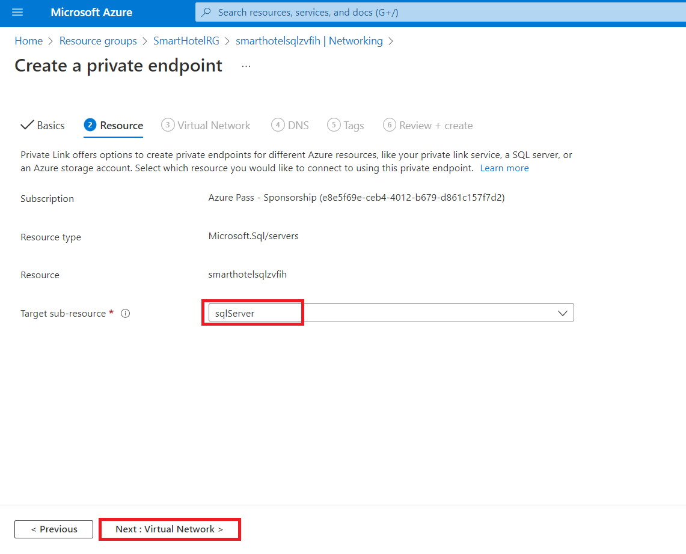

# Laboratorio 03 – Migrar los VMs desde un on-premises environment a Azure

## Objetivo

En este laboratorio, migramos los on-premises VMs mediante el Azure
Migrate Tool y los datos de evaluación en un Azure Migration Project,
registramos el Azure Migrate Appliance para Replication y luego
configurar el static IP para el VM replicado, y por fin migrar los VMs a
Azure en el Resource group correspondiente.

### Tarea 1: Cree una cuenta de almacenamiento

En esta tarea, creará un nuevo **Azure Storage Account** que usará
el **Azure Migrate: Server Migration** para el almacenamiento de los
datos de su máquina virtual durante la migración.

> **Ojo:** Este laboratorio se enfoca en as herramientas técnicas
> necesarias para la migración del workload. En un escenario real, se
> debe tomar en cuenta un plan a largo plazo andes de migrar los
> activos. El landing zone necesario para alojar los VMs tmabién debe
> incluir consideraciones como network traffic, access control, resource
> organization, y governance. Por ejemplo, se puede usar CAF Migration
> Blueprint y CAF Foundation Blueprint para implementar un landing zone
> predefinido y demostrar el potencial del enfoque Infrastructure as
> Code (IaC) para la gestión de recursos de la infraestructura.

1.  Cambie a la pestaña **Azure Portal** o abra una nueva pestaña y
    navegue a `https://portal.azure.com` e inicie sesión con sus office
    365 tenant credentials. En la navegación izquierda del Azure portal,
    seleccione **+ Create** **a resource**.

- 

  Interfaz gráfica de usuario, texto, aplicación, email Descripción
  generada automáticamente

2.  Busque y seleccione `Storage account`, seguido por **Create**.

- 

  Interfaz gráfica de usuario, aplicación Descripción generada
  automáticamente

  

  Interfaz gráfica de usuario, texto, aplicación, email Descripción
  generada automáticamente

3.  En el **Create storage account** blade, en la pestaña **Basics**,
    use los siguientes valores:

    - Subscription: **Keep the default selected subscription**.

    - Resource group: **AzureMigrateRG**

    - Storage account name: `migstrgXXXXXX` \[sustituya **XXXXXX** con
      un número aleatorio\]

    - Location: **West US**.

    - Performance: **Standard**

    - Redundancy: **Locally-redundant storage (LRS)**

- 

  Una captura de pantalla de una computadora Descripción generada
  automáticamente

4.  Seleccione la pestaña **Data protection** y \[**deseleccione**\] el
    **Enable soft delete blobs** y luego seleccione el botón **Review**,
    y seleccione **Create**.

- 

  Una captura de pantalla de una computadora Descripción generada
  automáticamente

  

  Una captura de pantalla de una computadora Descripción generada
  automáticamente

  

  Una captura de pantalla de una computadora Descripción generada
  automáticamente

5.  Haga clic en Go to resource y en **Data management** seleccione
    **Data protection** asegure que **Enable soft delete for blobs** no
    esté seleccionado, y haga clic en el botón **Save**.

- 

Ha completado esta tarea. No cierre esta pestaña para continuar con la
siguiente tarea.

**Resumen de la tarea**

En esta tarea, ha creado un nuevo Azure Storage Account que será usado
por el Azure Migrate: Server Migration.

### Tarea 2: Cree un Private Endpoint

En esta tarea, creará un endpoint en el virtual network proporcionado
que será usado por el SQL Server resource.

También configurará un endpoint privado en esta red para permitir un
acceso privado y seguro al SQL Database.

> **Ojo:** Azure proporciona varias opciones de implementar la
> configuración de la red correcta. Después del laboratorio, si quiere
> una mejor comprensión de sus opciones de networking, vea el \[network
> decision
> guide\]`https://docs.microsoft.com/azure/cloud-adoption-framework/decision-guides/software-defined-network`,
> lo que se construye en los Azure landing zones de Cloud Adoption
> Framework.

1.  Navegue a **SmartHotelRG** resource group, y haga clic en el **SQL
    server** enlistado como se ve en la imagen.

- 

  Interfaz gráfica de usuario, texto, aplicación, email Descripción
  generada automáticamente

  

  Graphical user interface, text, application Description automatically
  generated

2.  En **Security**, seleccione **Networking** **-\>Private access**, y
    seleccione **+ Create a Private endpoint**.

- 

3.  En la pestaña **Basics**, introduzca la siguiente configuración y
    seleccione **Next: Resource**:

    - Resource group: **SmartHotelRG**

    - Name: `SmartHotel-DB-Endpoint`

    - Region: **West US** (Seleccione la misma ubicación que el
      SmartHotelVNet.)

- 

  Una captura de pantalla de una computadora Descripción generada
  automáticamente

4.  En la pestaña **Resource**, introduzca la siguiente configuración y
    seleccione **Next: Virtual Network**:

    - Target sub-resource: **sqlServer**

- 

5.  En la pestaña **Virtual Network**, introduzca la siguiente
    configuración y seleccione **Next: DNS**:

    - Virtual network: **SmartHotelVNet**

    - Subnet: **SmartHotelDB (192.168.0.128/25)**

    - Private IP configuration: Seleccione **Dynamically allocate IP
      address**

- 

6.  En la pestaña **DNS**, introduzca la siguiente configuración y
    seleccione **Next: Tags.**

    - Integrate with private DNS zone: **Yes**

    - Subscription: **Keep the default selected subscription**

    - Resource group: **SmartHotelRG**

- 

7.  Seleccione **Review + create**.

- 

8.  Seleccione **Create**.

- 

  Una captura de pantalla de una computadora Descripción generada
  automáticamente

9.  **Espere** a que se complete la implementación.

- 

  Una captura de pantalla de una computadora Descripción generada
  automáticamente

10. Abra el **Private Endpoint** blade, haga clic en **DNS
    configuration** y note que el **FQDN** para el endpoint se enlista
    como **\database.windows.net**, con un internal IP
    address **192.168.0.132**.

- 

  Una captura de pantalla de una computadora Descripción generada
  automáticamente

> **Ojo**: Se usa private DNS para que el database domain
> name, **\database.windows.net** se resuelve a internal private
> endpoint IP address **192.168.0.132** cuando será resuelto desde el
> SmartHotelVNet, pero se resuelve al Internet-facing IP address del
> database server cuando resuelto desde fuera de VNet. Esto significa
> que se puede usar el mismo connection string (que contiene el nombre
> del domain) en ambos casos.
>
> **Ojo**: Si el private endpoint connection falla para permitir el IP
> address o database domain name para conectarse al database, puede
> quenecesite creer una nueva regla del firewall para permitir los IP
> address ranges del database y el enlace privado.

Ha completado esta tarea. No cierre esta pestaña para continuar con la
siguiente tarea.

**Resumen de la tarea**

En esta tarea, ha creado un endpoint privado endpoint en la red virtual,
lo que se usará para acceder al SQL database.

### Tarea 3: Cree un Private Endpoint para la cuenta del almacenamiento

En esta tarea, creará un endpoint en la red virtual proporcionada, lo
que será usado por el **Replication Storage Account**. También
configurará un private endpoint en esta red para permitir acceso privado
y seguro al **Replication Storage Account**.

1.  Navegue a **AzureMigrateRG** resource group y haga clic en el
    Replication Storage Account **migstrgXXXXXX** enlistado como se ve
    en la imagen.

- 

  Una captura de pantalla de una computadora Descripción generada
  automáticamente

2.  En **Security**, seleccione **Networking -\> Private endpoint
    connections**, y luego seleccione **+ Private endpoint**.

- 

  Una captura de pantalla de una computadora Descripción generada
  automáticamente

3.  En la pestaña **Basics**, introduzca la siguiente configuración y
    seleccione **: Resource**:

    - Resource group:  **AzureMigrateRG**

    - Name: `Storage-Endpoint`

    - Region: **West US**

- 

  Una captura de pantalla de una computadora Descripción generada
  automáticamente

4.  En la pestaña **Resource**, introduzca la siguiente configuración y
    seleccione**: Virtual Network**:

    - Target sub-resource: **blob**

- 

  Una captura de pantalla de una computadora Descripción generada
  automáticamente

5.  En la pestaña **Virtual Network**, introduzca la siguiente
    configuración y seleccione **: DNS**:

    - Virtual network: **smarthotelhostvnet**

    - Subnet: **hostsubnet**

    - Private IP configuration: Seleccione **Dynamically allocate IP
      address**

- 

  Una captura de pantalla de una computadora Descripción generada
  automáticamente

6.  En la pestaña **DNS**, introduzca la siguiente configuración y
    seleccione **: Tags**.

    - Integrate with private DNS zone: **Yes**

    - Subscription: **Keep the default selected subscription**

    - Resource group: **SmartHotelHostRG**

- 

  Una captura de pantalla de una computadora Descripción generada
  automáticamente

7.  Seleccione **Review + create**.

- 

  Una captura de pantalla de una computadora Descripción generada
  automáticamente

8.  Seleccione **Create**.

- 

  Una captura de pantalla de una computadora Descripción generada
  automáticamente

9.  **Espere** a que se complete la implementación.

- 

  Una captura de pantalla de una computadora Descripción generada
  automáticamente

**Resumen de la tarea**

En esta tarea, creó un endpoint privado en la red virtual que será usado
para acceder **Replication Storage Account**.

### Tarea 4: Registre el Hyper-V Host con migración y modernización

En esta tarea, registrará su Hyper-V host con el **Azure Migrate: Server
Migration** service. Este servicio usa **Azure Site Recovery** como el
underlying migration engine. Como parte del proceso de inscripción,
impplementará el **Azure Site Recovery Provider** en su **Hyper-V
host**.

1.  Vuelva a **Azure Migrate** blade en el **Azure Portal**
    `https://portal.azure.com`.

- 

  Interfaz gráfica de usuario, aplicación Descripción generada
  automáticamente

2.  Seleccione **Servers,databases and webapps** en **Migration
    goals** en la izquierda. En **Migration tools**,
    seleccione **Discover**.

- > **Ojo:** puede que necesite agregar el migration tool por su propia
  > cuenta en el enlace en la sección **Migration Tools**,
  > seleccionando **Azure Migrate: Server Migration**, y luego
  > seleccionando **Add tool(s)**.

  

  Una captura de pantalla de una computadora Descripción generada
  automáticamente

3.  En el panel **Discover machines**, para **Where do you want to
    migrate to?** elija Azure VM, en **Are your machines virtualized**,
    seleccione **Yes, with Hyper-V**. En **Target
    region** introduzca **West US (**la misma región que **Azure SQL
    Database** lo que se puede encontrar en el Azure portal) y
    seleccione la casiila. Seleccione **Create resources** para iniciar
    la implementación del Azure Site Recovery resource usado por Azure
    Migrate: Server Migration para **Hyper-V migrations**.

- 

  Una captura de pantalla de una computadora Descripción generada
  automáticamente

4.  Una vez que se complete la implementación, se debe actualizar el
    panel **‘Discover machines’** con instrucciones adicionales.

- 

  Un primer plano de una descripción de texto generada automáticamente

5.  Copie el enlace **Download** para el **Hyper-V
    replication** provider software installer a su clipboard.

- 

  Una captura de pantalla de una computadora Descripción generada
  automáticamente

6.  Abra el **SmartHotelHost** remote desktop window,
    inicie **Chrome** desde el desktop shortcut, y pegue el enalce en
    una nueva pestaña para descargar el Azure Site Recovery provider
    installer.

- 

  Interfaz gráfica de usuario, texto, aplicación Descripción generada
  automáticamente

7.  Vuelva a la página **Discover machines** en su navegador (fuera de
    la sesión SmartHotelHost remote desktop). Seleccione el botón azul
    **Download** y descargue el registration key file.

- 

  Interfaz gráfica de usuario, texto, aplicación, email Descripción
  generada automáticamente

8.  Abra la ubicación del archivo en Windows Explorer, y copie el
    archivo al clipboard. Vuelva a la sesión **SmartHotelHost** remote
    desktop y pegue el archivo al desktop.

- 

  Interfaz gráfica de usuario, aplicación Descripción generada
  automáticamente

9.  Dentro de la sesión **SmartHotelHost** remote desktop, abra
    el **AzureSiteRecoveryProvider.exe** installer que acaba de
    descargar.

- 

  Interfaz gráfica de usuario, texto, aplicación, email Descripción
  generada automáticamente

10. En la pestaña **Microsoft Update**, seleccione **Off** y
    seleccione **Next**.

- 

  Interfaz gráfica de usuario, texto, aplicación, email Descripción
  generada automáticamente

11. Acepte la ubicación predeterminada de la instalación y haga clic
    en **Install**.

- 

  Interfaz gráfica de usuario, texto, aplicación Descripción generada
  automáticamente

12. Seleccione **Register**.

- 

  Interfaz gráfica de usuario, texto, aplicación, email Descripción
  generada automáticamente

13. Navegue a la ubicación del key file que descargó. Cuando se carga el
    key seleccione **Next**.

- 

  Interfaz gráfica de usuario, texto, aplicación, email Descripción
  generada automáticamente

14. Seleccione **Connect directly to Azure Site Recovery without a proxy
    server** y seleccione **Next**. Se empezará
    la **registration** del **Hyper-V host** con **Azure Site
    Recovery**.

- 

  Interfaz gráfica de usuario, texto, aplicación, email Descripción
  generada automáticamente

15. Espere a que se complete la registración (puede llevar varios
    minutos). A continuación, seleccione **Finish**.

- 

  Interfaz gráfica de usuario, texto, aplicación Descripción generada
  automáticamente

16. Minimice el **SmartHotelHost** remote desktop session y vuelva
    a **Azure Migrate** browser window. **Actualice** su navegador, y
    vualva a abrir el panel **Discover machines** al
    seleccionar **Discover** en **Migration tools**.

- 

  Una captura de pantalla de una computadora Descripción generada
  automáticamente

17. Seleccione **Yes, with Hyper-V** para **Are your machines
    virtualized?**. Haga clic en el botón **Finalize registration**, lo
    que se debe habilitar.

- 

  Una captura de pantalla de una computadora Descripción generada
  automáticamente

18. Azure Migrate ahora completará la inscripción con el Hyper-V
    host. **Espere** a que se complete la inscripción. Puede llevar unos
    minutos.

- 

  Una captura de pantalla de una computadora Descripción generada
  automáticamente

19. Una vez que se complete la inscripción, cierre el panel **Discover
    machines**.

- 

  Una captura de pantalla de un error informático Descripción generada
  automáticamente

20. El panel **Migration and modernization** ahora debe mostrar **5
    discovered servers**.

- 

  Una captura de pantalla de una computadora Descripción generada
  automáticamente

**Resumen de la tarea**

En esta tarea, ha registrado su Hyper-V host con el Azure Migrate Server
Migration service.

### Tarea 5: Habilite Replication desde Hyper-V a Azure Migrate

En esta tarea, configurará y habilitará la replicación de sus máquinas
virtuales locales desde Hyper-V al Azure Migrate Server Migration
service.

1.  En **Migration and modernization**, seleccione **Replicate**. Esto
    abre un **Replicate** wizard

- 

  Una captura de pantalla de una computadora Descripción generada
  automáticamente

2.  En la pestaña **Specify intent** introduzca la siguiente
    configuración y luego seleccione **Continue.**

    - What do you want to migrate: **Servers or virtual machines(VM)**

    - Where do you want to migrate to: **Azure VM**

    - Are your machine virtualized? – **Yes, with Hyper-V**

- 

  Una captura de pantalla de una computadora Descripción generada
  automáticamente

3.  En la pestaña **Virtual machines**, en **Import migration settings
    from an assessment**, seleccione **Yes, apply migration settings
    from an Azure Migrate assessment.** Seleccione el **SmartHotel
    VMs** VM group y el **SmartHotelAssessment** migration assessment.

- 

  Una captura de pantalla de una computadora Descripción generada
  automáticamente

4.  La pestaña **Virtual machines** ahora debe mostrar los VMs incluidos
    en esta evaluación. Seleccione
    los **UbuntuWAF**, **smarthotelweb1**, y **smarthotelweb2**, y luego
    seleccione Next.

- 

  Una captura de pantalla de una computadora Descripción generada
  automáticamente

5.  En la pestaña **Target settings**, seleccione su suscripción y
    el **SmartHotelRG** resource group existente. En **Cache storage
    account** seleccione el **migstrgXXXXXX** storage account y
    en **Virtual Network** seleccione **SmartHotelVNet**. En Subnet
    seleccione **SmartHotel**. Seleccione **Next**.

- 

  Una captura de pantalla de una computadora Descripción generada
  automáticamente

6.  En la pestaña **Compute**, seleccione **Standard_F2s_v2** VM size
    para cada máquina virtual. Seleccione el **Windows operating
    system** para los VMs de **smarthotelweb**  y el sistema
    operativo **Linux** para el VM **UbuntuWAF**. Seleccione **Next**.

- 

  Una captura de pantalla de una computadora Descripción generada
  automáticamente

7.  En la pestaña **Disks**, revise las configuraciones, pero no haga
    ningún cambio. Seleccione **Next**

- 

  Una captura de pantalla de una computadora Descripción generada
  automáticamente

8.  En la pestaña **Tags** haga clic en **Next**, y luego en la
    pestaña **Review + Start** replication, haga clic en el
    botón **Replicate**.

9.  En el **Migration tools** blade, en **Migration and modernization**,
    seleccione el botón **Overview**.

- 

  Una captura de pantalla de una computadora Descripción generada
  automáticamente

10. Confirme que hay 3 máquinas replicando.

- 

  Una captura de pantalla de una computadora Descripción generada
  automáticamente

11. Seleccione **Replication** en **Manage** en la parte izquierda.
    Seleccione **Refresh** occasionalmente y espere a que las tres
    máquinas tengan un **Protected** status, lo que muestra que se ha
    completado la replicación inicial. Esto llevara unos minutos.

- 

  Una captura de pantalla de una computadora Descripción generada
  automáticamente

> **Ojo:** La replicación de las máquinas virtuales tardará entre 20 y
> 40 minutos en completarse, espere lo mismo.

Una captura de pantalla de una computadora Descripción generada
automáticamente

Ha completado la tarea. No cierre la ventana y continúe con la siguiente
tarea.

**Resumen de la tarea**

En esta tarea, ha habilitado la replicación de Hyper-V host a Azure
Migrate, y configurado el tamaño del VM replicado en Azure.

### Tarea 6: Configure los static internal IP addresses para cada VM

En esta tarea, modificará las configuraciones para cada VM replicado
para usar un static private IP address que se coincide con los
on-premises IP addresses para dicha máquina.

1.  Continuando en el **Azure Migrate: Migration and modernization |
    Replication** blade, seleccione el **smarthotelweb1** virtual
    machine. Esto abre un blade de migración y replicación para esta
    máquina. Eche un vistazo a la información.

- 

  Una captura de pantalla de una computadora Descripción generada
  automáticamente

2.  Seleccione **Compute and Network** en **General** en la parte
    izquierda, y seleccione **Edit**.

- 

  Una captura de pantalla de una computadora Descripción generada
  automáticamente

3.  Confirme que se ha configurado el VM para usar el **F2s_v2** VM size
    (o **DS2_v2** o **D2s_v3**).

- 

4.  En **Network Interfaces**, seleccione **InternalNATSwitch** para
    abrir **network interface settings**.

- 

  Una captura de pantalla de una computadora Descripción generada
  automáticamente

5.  Cambie el **Private IP address** a `192.168.0.4`.
    Seleccione **OK** para cerrar el network interface settings blade.

- 

  interfaz del usuario gráfico, texto, aplicación Descripción generada
  automáticamente

6.  **Guarde** las configuraciones de **smarthotelweb1**.

- 

  Una captura de pantalla de una computadora Descripción generada
  automáticamente

  

> **Ojo** – Repita estos pasos para configurar el private IP address
> para el otro

7.  Continuando en el **Azure Migrate: Migration and modernization |
    Replication** blade, seleccione el VM **smarthotelweb2**.

- 

  Una captura de pantalla de una computadora Descripción generada
  automáticamente

8.  Seleccione **Compute and Network** en **General** en la parte
    izquierda, y seleccione **Edit**.

- 

9.  En **Network Interfaces**, seleccione **InternalNATSwitch** para
    abrir los network interface settings.

- 

10. Cambie el **Private IP address** a `192.168.0.5`.
    Seleccione **OK** para cerrar el network interface settings blade.

- 

11. **Guarde** las configuraciones de **smarthotelweb2**.

- 

12. Con el **Azure Migrate: Migration and modernization | Replicating
    machines** blade, seleccione el VM **UbuntuWAF**. Esto abre un blade
    de migración y replicación detallada para esta máquina

- 

  Una captura de pantalla de una computadora Descripción generada
  automáticamente

13. Seleccione **Compute and Network** en **General** en la parte
    izquierda, y seleccione **Edit**

- 

  Interfaz gráfica de usuario, texto, aplicación, email Descripción
  generada automáticamente

14. Confirme que se ha configurado el VM para usar el **F2s_v2** VM
    size. En **Network Interfaces**,
    seleccione **InternalNATSwitch** para abrir los network interface
    settings.

- 

15. Cambie el **Private IP address** a `192.168.0.8`.
    Seleccione **OK** para cerrar el network interface settings blade.

- 

  Interfaz gráfica de usuario, aplicación Descripción generada
  automáticamente

16. **Guarde** las configuraciones **UbuntuWAF**.

- 

  Interfaz gráfica de usuario, aplicación Descripción generada
  automáticamente

Ha completado esta tarea. No cierre la ventana y proceda con la próxima
tarea.

**Resumen de la tarea**

En esta tarea, ha modificado las configuraciones para cada VM replicada
para usar un static private IP address que coincide con los on-premises
IP addresses for para dicha máquina

> **Ojo**: Azure Migrate “adivina lo mejor” para las configuraciones del
> VM, pero usted tiene un control total de las configuraciones de los
> elementos migrados. En este caso, establecer un static private IP
> address asegure que las máquinas virtuales en Azure mantiene los
> mismos Ips que tenían localmente, lo que evita tener que reconfigurar
> los VMs durante la migración (por ejemplo, al editar los archivos
> web.config).

### Tarea 7: migración del servidor

En esta tarea, vamos a realizar una migración de las máquinas UbuntuWAF,
smarthotelweb1, y smarthotelweb2 a Azure.

> **Ojo**: En un escenario real, usted realizaría una migración de
> prueba antes de la migración final. Para ahorrar tiempo, saltamos el
> test migration en este laboratorio. El proceso de test migration es mu
> similar a la migración final.

1.  Vuelva al **Azure Migrate: Servers, databases and web apps** blade
    con el enlace en la parte superior, como se ve aquí.

- 

2.  Haga clic en **Overview** en la sección **Migration tools**.

- 

  Una captura de pantalla de una computadora Descripción generada
  automáticamente

3.  En **Step 3: Migrate**, seleccione **Migrate**.

- 

  Una captura de pantalla de una computadora Descripción generada
  automáticamente

4.  En la página **Specify Intent**, asegure que se elija **Azure VM**,
    y haga clic en Continue

- 

  Una captura de pantalla de una computadora Descripción generada
  automáticamente

  > **Ojo**: opcionalmente, puede elegir si los on-premises virtual
  > machines deberíanapagarse automáticamente antes de la migración para
  > minimizar la pérdida de datos. Cualquier configuración funcionará
  > para este laboratorio.

5.  En el **Migrate** blade, seleccione los tres VMs y luego
    seleccione **Migrate** para iniciar el proceso de migración.

- 

  Una captura de pantalla de una computadora Descripción generada
  automáticamente

6.  Se iniciará el proceso de la migración.

- 

7.  Para monitorear el progreso, seleccione **Jobs** en **Manage** en la
    parte izquierda y revise el estado de los tres trabajos **Planned
    failover**.

- 

  Una captura de pantalla de una computadora Descripción generada
  automáticamente

8.  **Espere** a que los tres **Planned failover** jobs muestren
    un **Status** de **Successful**. No debería actualizar la página.
    Esto puede tardar unos **15 minutos**.

- 

  Una captura de pantalla de una computadora Descripción generada
  automáticamente

9.  Navegue al **SmartHotelRG** resource group y averigüe que se han
    creado VM, network interface, y disk resources para cada VM en el
    proceso de migración.

- 

  Interfaz gráfica de usuario, texto, aplicación, email Descripción
  generada automáticamente

  

  Una captura de pantalla de una computadora Descripción generada
  automáticamente

**Resumen de la tarea**

En esta tarea, ha usado Azure Migrate para crear los Azure VMs con las
configuraciones y los datos replicados desde las máquinas Hyper-V. Esto
migró sus on-premises VMs a Azure.

### Resumen

En los finales de los laboratorios, debemos haber replicado y migrado
los tres VMs al SmartHotelRG resource group.

- **smarthotelweb1**

- **smarthotelweb2**

- **UbuntuWAF**

También debemos parar los VMs migrados y el SmartHotelHost VM para
conservar el crédito para asegurar que se pueden completar los
laboratorios.

Interfaz gráfica de usuario, texto, aplicación, email Descripción
generada automáticamente

Interfaz gráfica de usuario, texto, aplicación, email Descripción
generada automáticamente

También debemos parar los VMs migrados y el SmartHotelHost VM para
conservar el crédito para asegurar que se pueden completar los
laboratorios.
