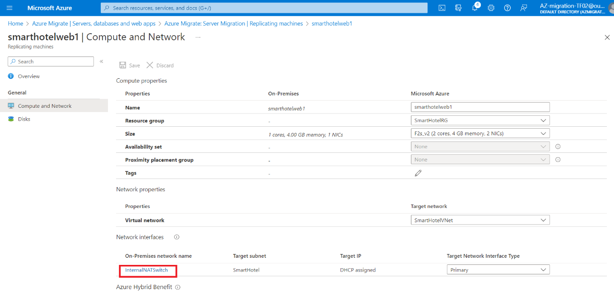

# Lab 03 - Migrazione delle VM dall'ambiente on-premises ad Azure

## Obiettivo

In questo lab eseguiremo la migrazione delle macchine virtuali locali
usando lo strumento Azure Migrate e i data di valutazione in un progetto
di migrazione di Azure, registreremo l'appliance di Azure Migrate per la
replica e quindi configureremo l'IP statico per la macchina virtuale
replicata e infine emigramo le macchine virtuali in Azure nel rispettivo
gruppo di risorse.

### Attività 1: Creare un account di archiviazione

In questa attività verrà creato un nuovo di **Azure Storage Account**
che verrà usato da **Azure Migrate:Server Migration** per
l'archiviazione dei data della macchina virtuale durante la migrazione.

> **Nota:** questo lab si concentra sugli strumenti tecnici necessari
> per la migrazione dei carichi di lavoro. In uno scenario reale, prima
> di migrare gli asset, è necessario prestare maggiore attenzione al
> piano a lungo termine. La zona di destinazione necessaria per ospitare
> le macchine virtuali deve includere anche considerazioni per il
> traffico di rete, il controllo di accesso, l'organizzazione delle
> risorse e la governance. Ad esempio, il CAF Migration Blueprint e il
> CAF Foundataon Blueprint possono essere utilizzati per distribuire una
> zona di destinazione predefinita e dimostrare il potenziale di un
> approccio IaC (Infrastructure as Code) alla gestione delle risorse
> dell'infrastruttura.

1.  Torna alla scheda di **Azure Portal** o apri una nuova scheda e vai
    a `https://portal.azure.com` e accedi con le credenziali del tenant
    di Office 365. Nel riquadro di spostamento a sinistra del portale di
    Azure selezionare **+ Create** una risorsa.

- 

  Graphical user interface, testo, applicazione, e-mail Descrizione
  generata automaticamente

2.  Cercare e selezionare `di S``torage account`, quindi **Create**.

- 

  Graphical User interface, applicazione Descrizione generata
  automaticamente

  

  Graphical user interface, testo, applicazione, e-mail Descrizione
  generata automaticamente

3.  Nel pannello **Create storage account** , nella scheda **Basics**,
    usare i valori seguenti:

    - Subscription: **mantiene l'abbonamento selezionato predefinito**.

    - Resource group: **AzureMigrateRG**

    - Storage account name: `migstrgXXXXXX` \[sostituisci **XXXXXX** con
      un numero casuale\]

    - Location: **West US**.

    - Performance: **Standard**

    - Redundancy: **Locally-redundant storage(LRS)**

- 

  Uno screenshot di un computer Descrizione generata automaticamente

4.  Selezionare la scheda **Data protection** e \[**uncheck**\] **Enable
    soft delete blobs,** quindi selezionare il pulsante **Review,**
    quindi selezionare **Create.**

- 

  Uno screenshot di un computer Descrizione generata automaticamente

  

  Uno screenshot di un computer Descrizione generata automaticamente

  

  Uno screenshot di un computer Descrizione generata automaticamente

5.  Fare clic su Vai alla risorsa e quindi in **Data management**
    selezionare **Data protection** per assicurarsi che l' opzione
    **Enable soft delete for blobs** sia deselezionata, quindi fare clic
    sul pulsante **Save**.

- 

L'attività è stata completata. Non chiudere questa scheda per procedere
con l'attività successiva.

**Riepilogo delle attività**

In questa attività è stato creato un nuovo account di archiviazione di
Azure che verrà usato da Azure Migrate: Migrazione del server.

### Attività 2: Creare un endpoint privato

In questa attività verrà creato un endpoint nella rete virtuale fornita
che verrà usato dalla risorsa SQL Server.

Verrà inoltre configurato un endpoint privato in questa rete per
consentire l'accesso privato e sicuro al database SQL.

> **Nota:** Azure offre diverse opzioni per la distribuzione della
> corretta configurazione di rete. Dopo il lab, se si vuole comprendere
> meglio le opzioni di rete, vedere la \[guida alle decisioni di
> rete\]`https://docs.microsoft.com/azure/cloud-adoption-framework/decision-guides/software-defined-network`,
> che si basa sulle zone di destinazione di Azure di Cloud Adoption
> Framework.

1.  Passare al gruppo di risorse **SmartHotelRG** e fare clic sul **SQL
    server** elencato**,** come mostrato nell'immagine seguente.

- 

  Graphical user interface, testo, applicazione, e-mail Descrizione
  generata automaticamente

  

  Graphical user interface, testo, applicazione Descrizione generata
  automaticamente

2.  In **Security** selezionare **Networking -\>Private access**, quindi
    selezionare **+ Create a Private endpoint**.

- 

3.  Nella scheda di **Basics** immettere la configurazione seguente,
    quindi selezionare **Next: Resource**:

    - Resource group: **SmartHotelRG**

    - Name: `SmartHotel``-DB-Endpoint`

    - Region: **West US** (selezionare la stessa posizione di
      SmartHotelVNet).

- 

  Uno screenshot di un computer Descrizione generata automaticamente

4.  Nella scheda **Resource** immettere la configurazione seguente,
    quindi selezionare **Next:Virtual Network**:

    - Target sub-resource: **sqlServer**

- 

5.  Nella scheda **Virtual Network** immettere la configurazione
    seguente, quindi selezionare **Next: DNS**:

    - Virtual network: **SmartHotelVNet**

    - Subnet: **SmartHotelDB (192.168.0.128/25)**

    - Private IP configuration: selezionare **Dynamically allocate IP
      address**

- 

6.  Nella scheda **DNS** immettere la configurazione seguente, quindi
    selezionare **Next: Tags.**

    - Integrazione con la zona DNS privata: **Yes**

    - Abbonamento: **Keep the default selected subscription**

    - Gruppo di risorse: **SmartHotelRG**

- 

7.  Seleziona **Review + create**.

- 

8.  Seleziona **Create**.

- 

  Uno screenshot di un computer Descrizione generata automaticamente

9.  **Wait** il completamento della distribuzione.

- 

  Uno screenshot di un computer Descrizione generata automaticamente

10. Aprire il pannello **Private Endpoint**, fare clic su **DNS**
    **Configuration** e notare che il nome di **FQDN** per l'endpoint è
    elencato come **\database.windows.net**, con un indirizzo IP interno
    **192.168.0.132**.

- 

  Uno screenshot di un computer Descrizione generata automaticamente

> **Nota**: il DNS privato viene utilizzato in modo che il nome di
> dominio del database, **\database.windows.net** venga risolto
> nell'indirizzo IP dell'endpoint privato interno **192.168.0.132**
> quando viene risolto da SmartHotelVNet, ma si risolve nell'indirizzo
> IP con connessione Internet del server di database quando viene
> risolto dall'esterno della rete virtuale. Ciò significa che in
> entrambi i casi è possibile utilizzare la stessa stringa di
> connessione (che contiene il nome di dominio).
>
> **Nota**: se la connessione all'endpoint privato non riesce a
> consentire all'indirizzo IP o al nome di dominio del database di
> connettersi al database, potrebbe essere necessario creare una nuova
> regola del firewall per consentire gli intervalli di indirizzi IP del
> database e il collegamento privato.

L'attività è stata completata. Non chiudere questa scheda per procedere
con l'attività successiva.

**Riepilogo delle attività**

In questa attività è stato creato un endpoint privato nella rete
virtuale che verrà usato per accedere al database SQL.

### Attività 3: Creare un endpoint privato per l'account di archiviazione

In questa attività verrà creato un endpoint nella rete virtuale fornita
che verrà usato di **Replication Storage Account**. Verrà inoltre
configurato un endpoint privato in questa rete per consentire l'accesso
privato e sicuro **Replication Storage Account.**

1.  Passare al gruppo di risorse **AzureMigrateRG** e fare clic
    sull'account di archiviazione di replica elencato **migstrgXXXXXX,**
    come illustrato nell'immagine seguente.

- 

  Uno screenshot di un computer Descrizione generata automaticamente

2.  In **Security** selezionare **Networking \> Private endpoint
    connections**, quindi selezionare **+ Private Endpoint**.

- 

  Uno screenshot di un computer Descrizione generata automaticamente

3.  Nella scheda di **Basics** immettere la configurazione seguente,
    quindi selezionare **Next**: **Resource**

    - Resource group: **AzureMigrateRG**

    - Name: `Storage-Endpoint`

    - Regione: **West US**

- 

  Uno screenshot di un computer Descrizione generata automaticamente

4.  Nella scheda **Resource** immettere la configurazione seguente,
    quindi selezionare **Next**: **Virtual Network:**

    - Target sub-resource: **blob**

- 

  Uno screenshot di un computer Descrizione generata automaticamente

5.  Nella scheda **Virtual Network** immettere la configurazione
    seguente, quindi selezionare **Next: DNS**:

    - Virtual Network: **smarthotelhostvnet**

    - Subnet: **hostsubnet**

    - Private IP configuration: selezionare **Dynamically allocate IP
      address**

- 

  Uno screenshot di un computer Descrizione generata automaticamente

6.  Nella scheda **DNS** immettere la configurazione seguente, quindi
    selezionare **Next: Tags**.

    - Integrate with private DNS zone: **Yes**

    - Subscription: **mantieni l'abbonamento selezionato predefinito**

    - Resource group: **SmartHotelHostRG**

- 

  Uno screenshot di un computer Descrizione generata automaticamente

7.  Seleziona **Review + create**.

- 

  Uno screenshot di un computer Descrizione generata automaticamente

8.  Seleziona **Create.**

- 

  Uno screenshot di un computer Descrizione generata automaticamente

9.  **Wait** il completamento della distribuzione.

- 

  Uno screenshot di un computer Descrizione generata automaticamente

**Riepilogo delle attività**

In questa attività è stato creato un endpoint privato nella rete
virtuale che verrà usato per accedere **Replication Storage Account**.

### Attività 4: Registrare l'host Hyper-V con la migrazione e la modernizzazione

In questa attività si registrerà l'host Hyper-V con **Azure**
**Migrate:Server Migration** Servizio. Questo servizio usa **Azure Site
Recovery** come motore di migrazione sottostante. Come parte del
processo di registrazione, si distribuirà il **Azure Site Recovery
Provider** nella **Hyper-V host**.

1.  Tornare al pannello **Azure Migrate** nel
    <https://portal.azure.com>` di ``Azure Portal`.

- 

  Graphical user interface, applicazione Descrizione generata
  automaticamente

2.  Selezionare **Server, databases and Webapps** in di **Migration
    goals** a sinistra. In **Migration tools** selezionare **Discover**.

- > **Nota:** potrebbe essere necessario aggiungere lo strumento di
  > migrazione seguendo il collegamento sotto la sezione di **Migration
  > Tools**, selezionando **Azure Migrate: Server Migration**, quindi
  > selezionando **Add tool(s)**.

  

  Uno screenshot di un computer Descrizione generata automaticamente

3.  Nel pannello **Discover machines**, Per **Where do you want to
    migrate to?** Scegliere Macchina virtuale di Azure, in **Are your
    machines virtualized** selezionare **Yes, with Hyper-V**. In
    **Target region** immettere **West US (la stessa area usata per il
    database SQL di Azure**, disponibile nel portale di Azure) e
    selezionare la casella di controllo di conferma. Selezionare
    **Create resources** per iniziare la distribuzione della risorsa
    Azure Site Recovery usata da Azure Migrate: Migrazione del server
    per **Hyper-V migrations**. Io

- 

  Uno screenshot di un computer Descrizione generata automaticamente

4.  Una volta completata la distribuzione, il pannello **"Discover
    machines"** dovrebbe essere aggiornato con ulteriori istruzioni.

- 

  Un primo piano di un testo Descrizione generata automaticamente

5.  Copiare negli Appunti il collegamento per il **Download** del
    programma di installazione del software del provider di **Hyper-V
    replication**.

- 

  Uno screenshot di un computer Descrizione generata automaticamente

6.  Aprire la finestra del desktop remoto **SmartHotelHost**, avviare
    **Chrome** dal collegamento sul desktop e incollare il collegamento
    in una nuova scheda del browser per scaricare il programma di
    installazione del provider Azure Site Recovery.

- 

  Graphical user interface, testo, applicazione Descrizione generata
  automaticamente

7.  Torna alla pagina **Discover machines** nel suoi browser (al di
    fuori della sessione di desktop remoto SmartHotelHost). Seleziona il
    pulsante blu **Download** e scarica il file della chiave di
    registrazione.

- 

  Graphical user interface, testo, applicazione, e-mail Descrizione
  generata automaticamente

8.  Aprire il percorso del file in Esplora risorse e copiare il file
    negli Appunti. Torna alla sessione di desktop remoto
    **SmartHotelHost** e incolla il file sul desktop.

- 

  Graphical user interface,applicazione Descrizione generata
  automaticamente

9.  Sempre all'interno della sessione di desktop remoto di
    **SmartHotelHost**, apri il programma di installazione
    **AzureSiteRecoveryProvider.exe** che hai scaricato poco fa.

- 

  Graphical user interface, testo, applicazione, e-mail Descrizione
  generata automaticamente

10. Nella scheda **Microsoft Update** selezionare **Off** e selezionare
    **Next.**

- 

  Graphical user interface, testo, applicazione, e-mail Descrizione
  generata automaticamente

11. Accettare il percorso di installazione predefinito e fare clic su
    **Install**.

- 

  Graphical user interface, testo, applicazione Descrizione generata
  automaticamente

12. Seleziona **Register** .

- 

  Graphical user interface, testo, applicazione, e-mail Descrizione
  generata automaticamente

13. Individuare il percorso del file della chiave scaricato. Quando la
    chiave è caricata, selezionare **Next**.

- 

  Graphical user interface, testo, applicazione, e-mail Descrizione
  generata automaticamente

14. Selezionare **Connect directly to Azure Site Recovery without a
    proxy server** e selezionare **Next**. Verrà avviata la
    **registration** della **Hyper-V** **host** con **Azure Site
    Recovery**.

- 

  Graphical user interface, testo, applicazione, e-mail Descrizione
  generata automaticamente

15. Attendi il completamento della registrazione (l'operazione potrebbe
    richiedere alcuni minuti). Quindi seleziona **Finish**.

- 

  Graphical user interface, testo, applicazione Descrizione generata
  automaticamente

16. Ridurre a icona la sessione di desktop remoto **SmartHotelHost** e
    tornare alla finestra del browser di **Azure Migrate**. **Refresh**
    il browser, quindi riapri il pannello **Discover machines**
    selezionando **Discover** in **Migration tools**.

- 

  Uno screenshot di un computer Descrizione generata automaticamente

17. Selezionare **Yes, con Hyper-V** per **Are your machines
    virtualized?**. Fare clic sul pulsante **Finalize registration**,
    che ora dovrebbe essere abilitato.

- 

  Uno screenshot di un computer Descrizione generata automaticamente

18. Azure Migrate completerà ora la registrazione con l'host Hyper-V.
    **Wait** il completamento della registrazione. L'operazione potrebbe
    richiedere alcuni minuti.

- 

  Uno screenshot di un computer Descrizione generata automaticamente

19. Una volta completata la registrazione, chiudere il pannello
    **Discover machines**.

- 

  Uno screenshot di un errore del computer Descrizione generata
  automaticamente

20. Il pannello **Migration and modernization** dovrebbe ora mostrare
    **5 discovered servers**.

- 

  Uno screenshot di un computer Descrizione generata automaticamente

**Riepilogo delle attività**

In questa attività è stato registrato l'host Hyper-V con il servizio
Migrazione server di Azure Migrate.

### Attività 5: Abilitare la replica da Hyper-V ad Azure Migrate

In questa attività si configurerà e si abiliterà la replica delle
macchine virtuali locali da Hyper-V al servizio Migrazione server di
Azure Migrate.

1.  In **Migration and modernization** selezionare **Replicate**. Verrà
    visualizzata la procedura guidata **Replicate**

- 

  Uno screenshot di un computer Descrizione generata automaticamente

2.  Nella scheda **Specify intent** , immettere la seguente
    configurazione, quindi selezionare **Continue (Continua).**

    - What do you want to migrate?** Servers or virtual machines (VM) **

    - Where do you want to migrate to ?**: Azure VM **

    - Are your machine virtualized? – **Yes, with Hyper-V** 

- 

  Uno screenshot di un computer Descrizione generata automaticamente

3.  Nella scheda **virtual machines**, in **Import migration settings
    from an assessment,** selezionare **Yes, apply migration settings
    from an Azure Migrate assessment.** Selezionare il gruppo di
    macchine virtuali **SmartHotel VMs** e la valutazione della
    migrazione **SmartHotelAssessment**.

- 

  Uno screenshot di un computer Descrizione generata automaticamente

4.  La scheda **Virtual Machines** dovrebbe ora mostrare le macchine
    virtuali incluse nella valutazione. Selezionare le macchine virtuali
    **UbuntuWAF**, **smarthotelweb1** e **smarthotelweb2**, quindi
    selezionare **Next**.

- 

  Uno screenshot di un computer Descrizione generata automaticamente

5.  Nella scheda di **Target settings** selezionare l'abbonamento e il
    gruppo di risorse **SmartHotelRG** esistente . In **Cache**
    **storage account** selezionare l' account di archiviazione
    **migstrgXXXXXX** e in **Virtual Network** selezionare
    **SmartHotelVNet**. In Subnet selezionare **SmartHotel**. Seleziona
    **Next**.

- 

  Uno screenshot di un computer Descrizione generata automaticamente

6.  Nella scheda **Compute** selezionare le dimensioni
    **Standard_F2s_v2** della macchina virtuale per ogni macchina
    virtuale. Seleziona il **Windows** **operating system** per le
    macchine virtuali **smarthotelweb** e il sistema operativo **Linux**
    per la macchina virtuale **UbuntuWAF**. Seleziona **Next**.

- 

  Uno screenshot di un computer Descrizione generata automaticamente

7.  Nella scheda **Disks**, rivedere le impostazioni ma non apportare
    modifiche. Seleziona **Next**

- 

  Uno screenshot di un computer Descrizione generata automaticamente

8.  Nella scheda **Tags** fare clic su **Next**, quindi nella scheda
    **Review + Start** replication, fare clic sul pulsante
    **Replicate**.

9.  Nel pannello di **Migration tools**, in **Migration and
    modernization**, selezionare il pulsante **Overview**.

- 

  Uno screenshot di un computer Descrizione generata automaticamente

10. Verificare che i 3 computer siano in fase di replica.

- 

  Uno screenshot di un computer Descrizione generata automaticamente

11. Selezionare **Replication** in **Manage** a sinistra. Selezionare
    **Refresh** di tanto in tanto e attendere che tutti e tre i computer
    abbiano uno stato **Protected**, che indica che la replica iniziale
    è stata completata. L'operazione richiederà diversi minuti.

- 

  Uno screenshot di un computer Descrizione generata automaticamente

> **Nota:** La replica delle macchine virtuali richiederà circa 20-40
> minuti per essere completata, attendere lo stesso.

Uno screenshot di un computer Descrizione generata automaticamente

L'attività è stata completata. Non chiudere la finestra e procedere
all'attività successiva.

**Riepilogo delle attività**

In questa attività è stata abilitata la replica dall'host Hyper-V ad
Azure Migrate e sono state configurate le dimensioni della macchina
virtuale replicata in Azure.

### Attività 6: Configurare gli indirizzi IP interni statici per ogni macchina virtuale

In questa attività si modificheranno le impostazioni per ogni macchina
virtuale replicata in modo da usare un indirizzo IP privato statico che
corrisponda agli indirizzi IP locali per tale computer.

1.  Ancora con **Azure Migrate: Migration and modernization |** Pannello
    **Replication,** selezionare la macchina virtuale
    **smarthotelweb1**. Verrà aperto un pannello di migrazione e replica
    dettagliato per questo computer. Prenditi un momento per studiare
    queste informazioni.

- 

  Uno screenshot di un computer Descrizione generata automaticamente

2.  Seleziona **Compute and Network** in **General** a sinistra, quindi
    seleziona **Edit**.

- 

  Uno screenshot di un computer Descrizione generata automaticamente

3.  Verificare che la macchina virtuale sia configurata per l'uso delle
    dimensioni **F2s_v2** della macchina virtuale (or **DS2_v2 or
    D2s_v3**).

- 

4.  In **Network Interface**, selezionare **InternalNATSwitch** per
    aprire le **network interface settings**.

- 

  Uno screenshot di un computer Descrizione generata automaticamente

5.  Modificare **Private IP address** in `192.168.0.4`. Selezionare
    **OK** per chiudere il pannello delle impostazioni dell'interfaccia
    di rete.

- 

  Interfaccia utente grafica, testo, applicazione Descrizione generata
  automaticamente

6.  **Save** le impostazioni di **smarthotelweb1**.

- 

  Uno screenshot di un computer Descrizione generata automaticamente

  

> **Nota** - Ripetere questi passaggi per configurare l'indirizzo IP
> privato per l'altro

7.  Ancora con **Azure Migrate: Migration and modernization |** Pannello
    **Replication,** selezionare la macchina virtuale
    **smarthotelweb2.**

- 

  Uno screenshot di un computer Descrizione generata automaticamente

8.  Seleziona **Compute and Network** in **General** a sinistra, quindi
    seleziona **Edit**.

- 

9.  In **Network Interfaces**, selezionare **InternalNATSwitch** per
    aprire le impostazioni dell'interfaccia di rete.

- 

10. Modificare **Private IP address** in `192.168.0.5`. Selezionare
    **OK** per chiudere il pannello delle impostazioni dell'interfaccia
    di rete.

- 

11. **Save** le impostazioni di **smarthotelweb2**.

- 

12. Uso di **Azure Migrate: Migration and modernization |** Pannello
    **Replicating machines**, selezionare la macchina virtuale
    **UbuntuWAF**. Verrà aperto un pannello di migrazione e replica
    dettagliato per questo computer

- 

  Uno screenshot di un computer Descrizione generata automaticamente

13. Seleziona **Compute and Network** in **General** a sinistra, quindi
    seleziona **Edit**

- 

  Graphical user interface, testo, applicazione, e-mail Descrizione
  generata automaticamente

14. Verificare che la macchina virtuale sia configurata per l'uso delle
    dimensioni **F2s_v2** della macchina virtuale. In **Network
    Interfaces**, selezionare **InternalNATSwitch** per aprire le
    impostazioni dell'interfaccia di rete.

- 

15. Modificare **Private IP address** in `192.168.0.8`. Selezionare
    **OK** per chiudere il pannello delle impostazioni dell'interfaccia
    di rete.

- 

  Interfaccia utente grafica, applicazione Descrizione generata
  automaticamente

16. **Save** le impostazioni di **UbuntuWAF**.

- 

  Interfaccia utente grafica, applicazione Descrizione generata
  automaticamente

L'attività è stata completata. Non chiudere la finestra e procedere
all'attività successiva.

**Riepilogo delle attività**

In questa attività sono state modificate le impostazioni per ogni
macchina virtuale replicata per usare un indirizzo IP privato statico
che corrisponde agli indirizzi IP locali per tale computer

> **Nota**: Azure Migrate fa una "migliore ipotesi" per le impostazioni
> della macchina virtuale, ma si ha il controllo completo sulle
> impostazioni degli elementi migrati. In questo caso, l'impostazione di
> un indirizzo IP privato statico garantisce che le macchine virtuali in
> Azure mantengano gli stessi indirizzi IP locali, evitando di dover
> riconfigurare le macchine virtuali durante la migrazione, ad esempio
> modificando i file web.config.

### Attività 7: Migrazione del server

In questa attività verrà eseguita una migrazione dei computer UbuntuWAF,
smarthotelweb1 e smarthotelweb2 ad Azure.

> **Nota**: in uno scenario reale, è necessario eseguire una migrazione
> di prova prima della migrazione finale. Per risparmiare tempo, in
> questo lab si salterà la migrazione di prova. Il processo di
> migrazione di prova è molto simile alla migrazione finale.

1.  Tornare al pannello **Azure Migrate: Server, database and Webapps**
    usando il collegamento nella parte superiore, come illustrato
    nell'immagine seguente.

- 

2.  Fare clic su **Overview** nella sezione **Migration tools**.

- 

  Uno screenshot di un computer Descrizione generata automaticamente

3.  In **Passaggio 3: Migrazione**, seleziona **Migrate.**

- 

  Uno screenshot di un computer Descrizione generata automaticamente

4.  Nella pagina **Specify Intent** assicurarsi che sia stata scelta la
    **Azure VM**, quindi fare clic su Continua

- 

  Uno screenshot di un computer Descrizione generata automaticamente

  > **Nota**: Facoltativamente, è possibile scegliere se le macchine
  > virtuali locali devono essere arrestate automaticamente prima della
  > migrazione per ridurre al minimo la perdita di data. Entrambe le
  > impostazioni funzioneranno per questo lab.

5.  Nel pannello **Migrate** selezionare le 3 macchine virtuali, quindi
    selezionare **Migrate** per avviare il processo di migrazione.

- 

  Uno screenshot di un computer Descrizione generata automaticamente

6.  Il processo di migrazione verrà avviato.

- 

7.  Per monitorare lo stato di avanzamento, selezionare **Jobs** in
    **Manage** a sinistra ed esaminare lo stato dei tre processi di
    **Planned failover**.

- 

  Uno screenshot di un computer Descrizione generata automaticamente

8.  **Wait** che tutti e tre i processi di **Planned failover** mostrino
    lo **Status** Operazione **Successful**. Non dovrebbe essere
    necessario aggiornare il browser. Questa operazione potrebbe
    richiedere fino a **15 minutes**.

- 

  Uno screenshot di un computer Descrizione generata automaticamente

9.  Passare al gruppo di risorse **SmartHotelRG** e verificare che la
    macchina virtuale, l'interfaccia di rete e le risorse disco siano
    state create per ciascuna delle macchine virtuali di cui viene
    eseguita la migrazione.

- 

  Graphical user interface, testo, applicazione, e-mail Descrizione
  generata automaticamente

  

  Uno screenshot di un computer Descrizione generata automaticamente

**Riepilogo delle attività**

In questa attività è stato usato Azure Migrate per creare macchine
virtuali di Azure usando le impostazioni configurate e i data replicati
dai computer Hyper-V. In questo modo è stata eseguita la migrazione
delle macchine virtuali locali ad Azure.

### Sommario

Al termine del Lab, dovremmo aver replicato correttamente e quindi
migrato le 3 VM nel gruppo di risorse SmartHotelRG.

- **SmartHotelWeb1**

- **SmartHotelWeb2**

- **UbuntuWAF**

È inoltre necessario arrestare le macchine virtuali migrate e la
macchina virtuale SmartHotelHost per conservare il credito e garantire
che i lab rimanenti possano essere completati.

Graphical user interface, testo, applicazione, e-mail Descrizione
generata automaticamente

Graphical user interface, testo, applicazione, e-mail Descrizione
generata automaticamente

È inoltre necessario arrestare le macchine virtuali migrate e la
macchina virtuale SmartHotelHost per conservare il credito e garantire
che i lab rimanenti possano essere completati.
