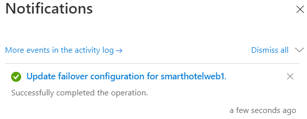

# ラボ 03－on-premises環境から Azure への VM の移行

## 客観的

このラボでは、Azure
MigrateツールとAzure移行プロジェクトの評価データを使用してon-premisesのVMを移行し、Azure
Migrateアプライアンスをレプリケーション用に登録して、レプリケートされた
VM の静的IPを構成し、最後にそれぞれのリソース
グループでVMをAzureに移行します。

### タスク 1：ストレージ アカウントを作成する

このタスクでは、移行中に仮想マシン データの保存のために**Azure Migrate:
Server Migration**によって使用される新しい**Azure Storage
Account**を作成します。

> **注意:**このラボでは、ワークロードの移行に必要な技術ツールに焦点を当てています。実際のシナリオでは、アセットの移行前に長期的な計画をより深く検討する必要があります。VMをホストするための必要なランディングゾーンには、ネットワークトラフィック、アクセス制御、リソース構成、ガバナンスについても考慮する必要があります。例えば、CAF移行ブループリントとCAF基盤ブループリントを使用して、事前定義されたランディングゾーンをデプロイし、インフラストラクチャ・リソース管理におけるInfrastructure
> as Code（IaC）アプローチの可能性を実証できます。

1.  **Azure
    Portal**タブに戻るか、または新しいタブを開いて`https://portal.azure.com`にアクセスし`、Office
    365テナントの資格情報でサインインします。Azure
    Portalの左側のナビゲーションで、リソースの**+ Create**を選択します。

- 

  グラフィカルユーザーインターフェース、テキスト、アプリケーション、電子メールの説明が自動的に生成される。

2.  Storage accountを検索して選択し、**Create**をクリックします。

- 

  グラフィカルユーザーインターフェース、アプリケーションの説明は自動的に生成されます。

  

  グラフィカルユーザーインターフェース、テキスト、アプリケーション、電子メールの説明が自動的に生成される。

3.  **Create storage
    account**ブレードの**Basics**タブで、次の値を使用します：

    - サブスクリプション: **Keep the default selected subscription**.

    - リソース グループ: **AzureMigrateRG**

    - ストレージ アカウント名: `migstrgXXXXXX `\[ **XXXXXX**
      をランダムな数字に置き換えます\]

    - 場所: **West US.**

    - パフォーマンス: **Standard**

    - 冗長性: **Locally-redundant storage (LRS)**

- 

  コンピュータのスクリーンショット 説明は自動的に生成されました。

4.  **Data protection**タブを選択し、**Enable soft delete
    blobs**を\[**uncheck**\]、**Review**ボタンを選択し、**Create**を選択します。

- 

  コンピュータのスクリーンショット 説明は自動的に生成されました。

  

  コンピュータのスクリーンショット 説明は自動的に生成されました。

  

  コンピュータのスクリーンショット 説明は自動的に生成されました。

5.  リソースに移動をクリックし、 **Data management**の下から**Data
    protection**を選択して、**Enable soft delete for
    blobs**にチェックが外れていることを確認してから、**Save**ボタンをクリックします。

- 

このタスクは完了しました。次のタスクに進むには、このタブを閉じないでください。

**タスクのまとめ**

このタスクでは、Azure Migrate: Server Migration で使用される新しい Azure
ストレージ アカウントを作成しました。

### タスク２：プライベートエンドポイントを作成する

このタスクでは、SQL Server
リソースによって使用される、指定された仮想ネットワーク上にエンドポイントを作成します。

また、このネットワークにプライベート エンドポイントを構成して、SQL
データベースへのプライベートで安全なアクセスを許可します。

> **注意:** Azure
> では、適切なネットワーク構成を導入するためのオプションが複数用意されています。ラボ終了後、ネットワーク構成のオプションについてさらに詳しく知りたい場合は、クラウド導入フレームワークの
> Azure ランディングゾーンに基づいた\[network decision guide\]
> `(https://docs.microsoft.com/azure/cloud-adoption-framework/decision-guides/software-defined-network )` をご覧ください。`

1.  **SmartHotelRG**リソース
    グループに移動し、下の画像に示すようにリストされている**SQL
    server**をクリックします。

- 

  グラフィカルユーザーインターフェース、テキスト、アプリケーション、電子メールの説明が自動的に生成される。

  

  グラフィカルユーザーインターフェース、テキスト、アプリケーションの説明が自動的に生成される。

2.  **Security**の下で**Networking -\>Private
    access**を選択します。 そして** + Create a Private
    endpoint**を選択します。

- 

3.  **Basicsタブ**で次の構成を入力し、**Next: Resource**を選択します：

    - リソース グループ: **SmartHotelRG**

    - 名前: `SmartHotel-DB-Endpoint`

    - リージョン: **West US** (SmartHotelVNet と同じ場所を選択します。)

- 

  コンピュータのスクリーンショット 説明は自動的に生成されました。

4.  **Resource**タブで次の構成を入力し、**Next: Virtual
    Network**:を選択します。

    - ターゲットサブリソース: **sqlServer**

- 

5.  **Virtual Network**タブで次の構成を入力し、**Next:
    DNS**:を選択します：

    - 仮想ネットワーク: **SmartHotelVNet**

    - サブネット: **SmartHotelDB (192.168.0.128/25)**

    - プライベートIP設定: **Dynamically allocate IP
      address**を選択します。

- 

6.  **DNS**タブで次の構成を入力し、**Next: Tags**を選択します。

    - プライベートDNSゾーンとの統合: **Yes**

    - サブスクリプション: **Keep the default selected subscription**

    - リソース グループ: **SmartHotelRG**

- 

7.  **Review + create**を選択します。

- 

8.  **Create**を選択します。

- 

  コンピュータのスクリーンショット 説明は自動的に生成されました。

9.  デプロイメントが完了するまで**Wait**します**。**

- 

  コンピュータのスクリーンショット 説明は自動的に生成されました。

10. **Private Endpoint**ブレードを開き、**DNS
    configuration**をクリックすると、エンドポイントのFQDNが∖**database.windows.net**としてリストされ、内部
    IP アドレスが**192.168.0.132**であることを確認します。

- 

  コンピュータのスクリーンショット 説明は自動的に生成されました。

> **注意:**プライベートDNSを使用することで、データベースドメイン名∖**database.windows.net**は、**SmartHotelVNet**
> から解決された場合は内部プライベートエンドポイント IP
> アドレス**192.168.0.132**に解決されますが、VNet
> 外部から解決された場合はデータベースサーバーのインターネット接続 IP
> アドレスに解決されます。つまり、どちらの場合も同じ接続文字列（ドメイン名を含む）を使用できます。
>
> **注意:** プライベート エンドポイント接続で、IP
> アドレスまたはデータベース
> ドメイン名がデータベースに接続できない場合は、データベースとプライベート
> リンクの IP アドレス範囲を許可する新しいファイアウォール
> ルールの作成が必要になることがあります。

このタスクは完了しました。次のタスクに進むには、このタブを閉じないでください。

**タスクのまとめ**

このタスクでは、SQL
データベースへのアクセスに使用される仮想ネットワーク上にプライベート
エンドポイントを作成しました。

### タスク３：ストレージ アカウントのプライベート エンドポイントを作成する

**Replication Storage
Account**が使用するエンドポイントを作成します。また、このネットワークにプライベート
エンドポイントを構成し、**Replication Storage
Account**へのプライベートで安全なアクセスを許可します。

1.  **AzureMigrateRG**リソース
    グループに移動し、下の画像に示すように、リストされているレプリケーション
    ストレージ アカウント**migstrgXXXXXX**をクリックします。

- 

  コンピュータのスクリーンショット 説明は自動的に生成されました。

2.  ** Security**の下で、**Networking -\> Private endpoint
    connections**を選択し、**+ Private endpoint**を選択します。

- 

  コンピュータのスクリーンショット 説明は自動的に生成されました。

3.  **Basics**タブで次の構成を入力し、**Next: Resource**を選択します：

    - リソース グループ: **AzureMigrateRG**

    - 名前: `Storage-Endpoint`

    - 地域:**West US**

- 

  コンピュータのスクリーンショット 説明は自動的に生成されました。

4.  **Resource**タブで次の構成を入力し、**Next: Virtual
    Network**を選択します：

    - ターゲットサブリソース: **blob**

- 

  コンピュータのスクリーンショット 説明は自動的に生成されました。

5.  **Virtual Network**タブで次の構成を入力し、**Next:
    DNS**を選択します：

    - 仮想ネットワーク: **smarthotelhostvnet**

    - サブネット: **hostsubnet**

    - プライベートIP設定: **Dynamically allocate IP address**を選択

- 

  コンピュータのスクリーンショット 説明は自動的に生成されました。

6.  **DNS**タブで次の構成を入力し、**Next: Tags**を選択します：

    - プライベートDNSゾーンとの統合: **Yes**

    - サブスクリプション: **Keep the default selected subscription**

    - リソース グループ: **SmartHotelHostRG**

- 

  コンピュータのスクリーンショット 説明は自動的に生成されました。

7.  **Review + create**を選択します。

- 

  コンピュータのスクリーンショット 説明は自動的に生成されました。

8.  **Create**を選択します。

- 

  コンピュータのスクリーンショット 説明は自動的に生成されました。

9.  デプロイメントが完了するまで**Wait**します**。**

- 

  コンピュータのスクリーンショット 説明は自動的に生成されました。

**タスクのまとめ**

**Replication Storage
Account**へのアクセスに使用される仮想ネットワーク上にプライベート
エンドポイントを作成しました。

### タスク４：移行と最新化を使用して Hyper-V ホストを登録する

このタスクでは、Hyper-V ホストを**Azure Migrate: Server
Migration**サービスに登録します。このサービスは、**Azure Site Recovery**
を基盤となる移行エンジンとして使用します。登録プロセスの一環として、**Hyper-V
ホスト**に**Azure Site Recovery**プロバイダーをデプロイします。

1.  **Azure ポータル**`https://portal.azure.com`の**Azure
    Migrate**ブレードに戻ります。

- 

  グラフィカルユーザーインターフェース、アプリケーションの説明は自動的に生成されます。

2.  左側の**Migration goals**で**Servers,databases and
    webapps**を選択します。**Migration
    tools**で**Discover**を選択します。

- > **注意:**
  > 移行ツールを自分で追加する必要がある場合がありますので、**Migration
  > Tools**セクションの下のリンクにアクセスし、**Azure Migrate: Server
  > Migration**を選択してから**Add tool(s)**を選択します。

  

  コンピュータのスクリーンショット 説明は自動的に生成されました。

3.  **Discover machines**パネルの「**Where do you want to migrate
    to?」**でAzure VMを選択し、「**Are your machines
    virtualized?」でYes, with Hyper-V**を選択します。**Target
    region**の下で**West US（Azureポータルで確認できるWest US (the same
    region as used for your Azure SQL
    Database）**を入力し、確認チェックボックスをオンにします。**Create
    resources**を選択して、Azure Migrate: Server Migration for **Hyper-V
    Migrations**で使用されるAzure Site
    Recoveryリソースのデプロイを開始します。

- 

  コンピュータのスクリーンショット 説明は自動的に生成されました。

4.  展開が完了すると、 **「Discover
    machines」**パネルが更新され、追加の手順が表示されます。

- 

  テキストのクローズアップ説明は自動的に生成されます。

5.  **Hyper-V replication**プロバイダー ソフトウェア
    インストーラーの**Download**リンクをクリップボードにコピーします。

- 

  コンピュータのスクリーンショット 説明は自動的に生成されました。

6.  **SmartHotelHost**リモート デスクトップ
    ウィンドウを開き、デスクトップ
    ショートカットから**Chrome**を起動し、リンクを新しいブラウザー
    タブに貼り付けて、Azure Site Recovery プロバイダー
    インストーラーをダウンロードします。

- 

  グラフィカルユーザーインターフェース、テキスト、アプリケーションの説明が自動的に生成される。

7.  ブラウザで**Discover machines**ページ**（**SmartHotelHost
    リモートデスクトップセッション外**）**に戻ります。青い**Download**ボタンを選択し、登録キーファイルをダウンロードします。

- 

  グラフィカルユーザーインターフェース、テキスト、アプリケーション、電子メールの説明が自動的に生成される。

8.  Windowsエクスプローラーでファイルの場所を開き、ファイルをクリップボードにコピーします。**SmartHotelHost**のリモートデスクトップセッションに戻り、ファイルをデスクトップに貼り付けます。

- 

  グラフィカルユーザーインターフェース、アプリケーションの説明は自動的に生成されます。

9.  引き続き**SmartHotelHost**リモート デスクトップ
    セッション内で、先ほどダウンロードした**AzureSiteRecoveryProvider.exe**インストーラーを開きます。

- 

  グラフィカルユーザーインターフェース、テキスト、アプリケーション、電子メールの説明が自動的に生成される。

10. **Microsoft Update**タブで**Off**を選択し、**Next**を選択します。

- 

  グラフィカルユーザーインターフェース、テキスト、アプリケーション、電子メールの説明が自動的に生成される。

11. デフォルトのインストール場所を受け入れて、**Install**をクリックします。

- 

  グラフィカルユーザーインターフェース、テキスト、アプリケーションの説明が自動的に生成される。

12. **Register**を選択します。

- 

  グラフィカルユーザーインターフェース、テキスト、アプリケーション、電子メールの説明が自動的に生成される。

13. ダウンロードしたキーファイルの場所を参照します。キーが読み込まれたら、**Next**を選択します。

- 

  グラフィカルユーザーインターフェース、テキスト、アプリケーション、電子メールの説明が自動的に生成される。

14. **Connect directly to Azure Site Recovery without a proxy
    server**を選択し、**Next**を選択します。**Hyper -V host**の**Azure
    Site Recovery**への登録が開始されます。

- 

  グラフィカルユーザーインターフェース、テキスト、アプリケーション、電子メールの説明が自動的に生成される。

15. 登録が完了するまでお待ちください（数分かかる場合があります）。完了したら、**Finish**を選択してください。

- 

  グラフィカルユーザーインターフェース、テキスト、アプリケーションの説明が自動的に生成される。

16. **SmartHotelHost**リモート デスクトップ セッションを最小化し、
    **Azure Migrate**ブラウザー
    ウィンドウに戻ります。ブラウザーを**Refresh**し、**Migration
    tools**の**Discover**を選択して、**Discover
    machines**パネルを再度開きます。

- 

  コンピュータのスクリーンショット 説明は自動的に生成されました。

17. **「Are your machines virtualized?」**で**「Yes, with
    Hyper-V**」を選択します。「**Finalize
    registration」**ボタンをクリックすると、有効になります。

- 

  コンピュータのスクリーンショット 説明は自動的に生成されました。

18. Azure Migrate は Hyper-V
    ホストへの登録を完了します。登録が完了するまで**Wait**します。数分かかる場合があります。

- 

  コンピュータのスクリーンショット 説明は自動的に生成されました。

19. 登録が完了したら、**Discover machines**パネルを閉じます。

- 

  コンピュータエラーのスクリーンショット 説明は自動的に生成されました。

20. **Migration and modernization**パネルには、**5 discovered
    servers**が表示されます。

- 

  コンピュータのスクリーンショット 説明は自動的に生成されました。

**タスクのまとめ**

このタスクでは、Hyper-V ホストを Azure Migrate Server Migration
サービスに登録しました。

### タスク５：Hyper-V から Azure Migrate へのレプリケーションを有効にする

このタスクでは、on-premisesの仮想マシンの Hyper-V から Azure Migrate
Server Migration サービスへのレプリケーションを構成して有効にします。

1.  **Migration and
    modernization**で**Replicate**を選択します。**Replicate**ウィザードが開きます。

- 

  コンピュータのスクリーンショット 説明は自動的に生成されました。

2.  **Specify intent**タブで次の構成を入力し、**Continue**を選択します。

    - 移行するもの: **Servers or virtual machines(VM)**

    - 移行先: **Azure VM**

    - あなたのマシンは仮想化されていますか？ －**Yes, with Hyper-V**

- 

  コンピュータのスクリーンショット 説明は自動的に生成されました。

3.  **Virtual machines**タブの **「Import migration settings from an
    assessment」で**、「**Yes, apply migration settings from an Azure
    Migrate assessment」** を選択します。VMグループの `SmartHotel
    VMs` と移行評価 `SmartHotelAssessment` を選択します。

- 

  コンピュータのスクリーンショット 説明は自動的に生成されました。

4.  **Virtual
    machines**タブに、評価に含まれる仮想マシンが表示されます。**UbuntuWAF
    、** **smarthotelweb1** と**smarthotelweb2
    の**仮想マシンを選択し、Nextを選択します。

- 

  コンピュータのスクリーンショット 説明は自動的に生成されました。

5.  **Target
    settings**タブで、サブスクリプションと既存の**SmartHotelRG**リソースグループを選択します。
    **Cache storage
    account**で**migstrgXXXXXX**ストレージアカウントを選択し、 **Virtual
    Network**で**SmartHotelVNet**を選択します。サブネットで**SmartHotel**を選択します。**Next**を選択します。

- 

  コンピュータのスクリーンショット 説明は自動的に生成されました。

6.  **Compute**タブで、各仮想マシンのVMサイズとして**Standard_F2s_v2**を選択します。**smarthotelweb**仮想マシンには**Windows
    operating
    system**、**UbuntuWAF**仮想マシンには**Linux**オペレーティングシステムを選択します**。Next**を選択します。

- 

  コンピュータのスクリーンショット 説明は自動的に生成されました。

7.  **Disks**タブで設定を確認しますが、変更は行わないでください。**Next**を選択します。

- 

  コンピュータのスクリーンショット 説明は自動的に生成されました。

8.  **Tags**タブで**Next**をクリックし、レプリケーションの**Review +
    Start**タブで**Replicate**ボタンをクリックします。

9.  **Migration tools**ブレードの**Migration and
    modernization**で、**Overview**ボタンを選択します。

- 

  コンピュータのスクリーンショット 説明は自動的に生成されました。

10. 3 台のマシンが複製されていることを確認します。

- 

  コンピュータのスクリーンショット 説明は自動的に生成されました。

11. 左側の**Manage**から**Replication**を選択します。時々**Refresh**を選択し、3台のマシンすべてが**Protected**ステータスになるまで待ちます。これは初期レプリケーションが完了したことを示します。これには数分かかります。

- 

  コンピュータのスクリーンショット 説明は自動的に生成されました。

> **注意:**仮想マシンのレプリケーションは完了するまでに約 20 ～ 40
> 分かかりますので、しばらくお待ちください。

コンピュータのスクリーンショット 説明は自動的に生成されました。

タスクは完了しました。ウィンドウを閉じずに次のタスクに進んでください。

**タスクのまとめ**

このタスクでは、Hyper-V ホストから Azure Migrate
へのレプリケーションを有効にし、Azure でレプリケートされた
VMサイズを構成しました。

### タスク６：各VMに静的内部IPアドレスを構成する

このタスクでは、レプリケートされた各 VM
の設定を変更して、そのマシンのon-premises IP
アドレスと一致する静的プライベート IP アドレスを使用します。

1.  引き続き**Azure Migrate: Migration and modernization |
    Replication**ブレードを使用し、
    **smarthotelweb1**仮想マシンを選択します。すると、このマシンの詳細な移行とレプリケーションのブレードが開きます。この情報をよくご確認ください。

- 

  コンピュータのスクリーンショット 説明は自動的に生成されました。

2.  左側の**General**の下にある**Compute and
    Network**を選択し、**Edit**を選択します。

- 

  コンピュータのスクリーンショット 説明は自動的に生成されました。

3.  VMが**F2s_v2** VMサイズ (または**DS2_v2 or D2s_v3**
    )を使用するように構成されていることを確認します。

- 

4.  **Network
    Interfaces**の下で、**InternalNATSwitch**を選択して、**network
    interface settings**を開きます。

- 

  コンピュータのスクリーンショット 説明は自動的に生成されました

5.  **Private IP
    address**を`192.168.0.4`に変更します。**OK**を選択して、ネットワークインターフェース設定ブレードを閉じます。

- 

  グラフィカルユーザーインターフェース、テキスト、アプリケーションの説明が自動的に生成される。

6.  **smarthotelweb1** の設定を**Save**します。

- 

  コンピュータのスクリーンショット 説明は自動的に生成されました。

  

> **注意**-
> 他のプライベートIPアドレスを設定するには、これらの手順を繰り返します。

7.  引き続き**Azure Migrate: Migration and modernization |
    Replication**ブレードを使用して、
    **smarthotelweb2**仮想マシンを選択します。

- 

  コンピュータのスクリーンショット 説明は自動的に生成されました。

8.  左側の**General**の下にある**Compute and
    Network**を選択し、**Edit**を選択します。

- 

9.  **Network
    Interfaces**の下で、**InternalNATSwitch**を選択して、ネットワーク
    インターフェイス設定を開きます。

- 

10. **Private IP
    address**を`192.168.0.5`に変更します。**OK**を選択して、ネットワークインターフェース設定ブレードを閉じます。

- 

11. **smarthotelweb2** の設定を**Save**します。

- 

12. **Azure Migrate: Migration and modernization | Replicating
    machinesブレード**を使用して、
    **UbuntuWAF**仮想マシンを選択します。これにより、このマシンの詳細な移行とレプリケーション
    ブレードが開きます。

- 

  コンピュータのスクリーンショット 説明は自動的に生成されました。

13. 左側の**General**の下にある**Compute and
    Network**を選択し、**Edit**を選択します。

- 

  グラフィカルユーザーインターフェース、テキスト、アプリケーション、電子メールの説明が自動的に生成される。

14. VM が**F2s_v2** VM
    サイズを使用するように構成されていることを確認します。**Network
    Interfaces**で**InternalNATSwitch**を選択して、ネットワーク
    インターフェイス設定を開きます。

- 

15. **Private IP
    address**を`192.168.0.8`に変更します。**OK**を選択して、ネットワークインターフェース設定ブレードを閉じます。

- 

  グラフィカルユーザーインターフェース、アプリケーションの説明は自動的に生成されます。

16. **UbuntuWAF**設定を**Save**します。

- 

  グラフィカルユーザーインターフェース、アプリケーションの説明は自動的に生成されます。

タスクは完了しました。ウィンドウを閉じずに次のタスクに進んでください。

**タスクのまとめ**

このタスクでは、複製された各 VM
の設定を変更して、そのマシンのon-premises IP
アドレスと一致する静的プライベート IP アドレスを使用するようにしました。

> **注意:**Azure Migrate は VM の設定を「best
> guess」に基づいて行いますが、移行されたアイテムの設定はユーザーが完全に制御できます。この場合、静的プライベート
> IP アドレスを設定することで、Azure 上の仮想マシンはon-premisesと同じ
> IP アドレスを保持し、移行中に VM
> を再構成する必要がなくなります（例えば、web.config
> ファイルの編集など）。

### タスク７：サーバーの移行

このタスクでは、UbuntuWAF、smarthotelweb1、および smarthotelweb2
マシンの Azure への移行を実行します。

> **注意:**実際のシナリオでは、最終的な移行の前にテスト移行を実行します。時間を節約するため、このラボではテスト移行を省略します。テスト移行のプロセスは最終的な移行と非常に似ています。

1.  下の画像に示すように、上部のリンクを使用して**Azure Migrate:
    Servers, databases and web apps**に戻ります。

- 

2.  **Migration tools**の**Overview**をクリックします。

- 

  コンピュータのスクリーンショット 説明は自動的に生成されました。

3.  **Step 3: Migrate**で、**Migrate**を選択します。

- 

  コンピュータのスクリーンショット 説明は自動的に生成されました。

4.  **Specify Intent**ページで、 **Azure
    VM**が選択されていることを確認し、Continueをクリックします。

- 

  コンピュータのスクリーンショット 説明は自動的に生成されました。

  > **注意:**データ損失を最小限に抑えるため、移行前にon-premisesの仮想マシンを自動的にシャットダウンするかどうかをオプションで選択できます。このラボではどちらの設定でも機能します。

5.  **Migrate**ブレードで3
    つの仮想マシンを選択し、**Migrate**を選択して移行プロセスを開始します。

- 

  コンピュータのスクリーンショット 説明は自動的に生成されました。

6.  移行プロセスが開始されます。

- 

7.  進行状況を監視するには、左側の**Manage**の下にある**Jobs**を選択し、3
    つの**Planned failover**のステータスを確認します。

- 

  コンピュータのスクリーンショット 説明は自動的に生成されました。

8.  **Planned
    failover**ジョブの**Status**がすべて**Successful**になるまで**Wait**します。ブラウザを更新する必要はありません。これには最大**15
    minutes**。

- 

  コンピュータのスクリーンショット 説明は自動的に生成されました。

9.  **SmartHotelRG**リソース
    グループに移動し、移行する各仮想マシンに対して VM、ネットワーク
    インターフェイス、およびディスク
    リソースが作成されていることを確認します。

- 

  グラフィカルユーザーインターフェース、テキスト、アプリケーション、電子メールの説明が自動的に生成される。

  

  コンピュータのスクリーンショット 説明は自動的に生成されました。

**タスクのまとめ**

このタスクでは、Azure Migrate を使用して、構成した設定と Hyper-V
マシンからレプリケートされたデータに基づいて Azure VM
を作成しました。これにより、on-premisesの VM が Azure に移行されました。

### まとめ

ラボの最後には、3 台の VM が SmartHotelRG リソース
グループに正常にレプリケートされ、移行されているはずです。

- **スマートホテルウェブ1**

- **スマートホテルウェブ2**

- **UbuntuWAF**

残りのラボを完了できるようにクレジットを節約するために、移行された VM と
SmartHotelHost VM を停止する必要もあります。

グラフィカルユーザーインターフェース、テキスト、アプリケーション、電子メールの説明が自動的に生成される。

グラフィカルユーザーインターフェース、テキスト、アプリケーション、電子メールの説明が自動的に生成される。

残りのラボを完了できるようにクレジットを節約するために、移行された VM と
SmartHotelHost VM を停止する必要もあります。
