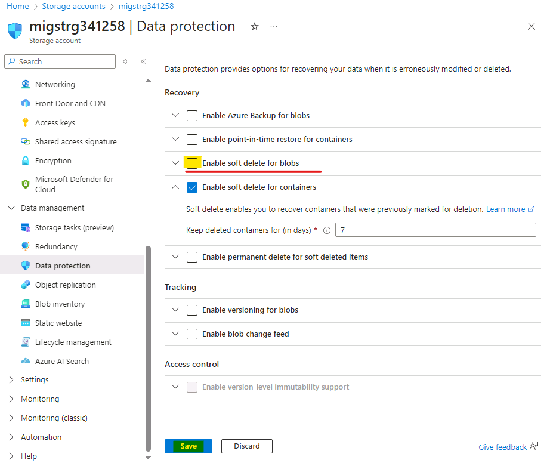
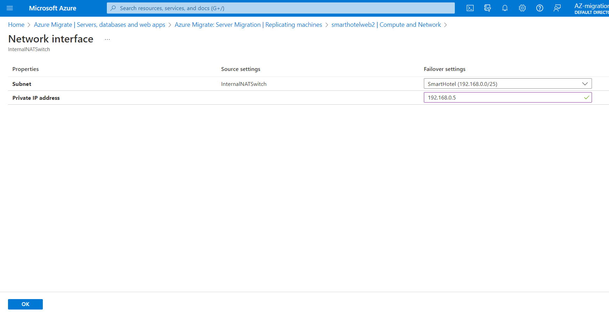

# 실습 03 - 온프레미스 환경에서 Azure로 VM 마이그레이션

## 목표

이 실습에서는 Azure Migrate tool와 Azure Migration Project의 평가
데이터를 사용하여 온프레미스 VM을 마이그레이션합니다. 복제를 위해 Azure
Migrate Appliance를 등록한 후 복제된 VM에 대한 고정 IP를 구성하고,
마지막으로 해당 리소스 그룹의 Azure로 VM을 마이그레이션합니다.

### 작업 1: Storage account 만들기

이 작업에서는 **Azure Migrate: Server Migration** 에서 마이그레이션 중
가상 머신 데이터를 저장하는 데 사용할 새 **Azure Storage Account** 을
만듭니다.

> **참고**: 이 실습에서는 워크로드 마이그레이션에 필요한 기술 도구에
> 중점을 둡니다. 실제 환경에서는 자산 마이그레이션 전에 장기적인 계획을
> 더욱 신중하게 고려해야 합니다. VM 호스팅에 필요한 landing zone에는
> 네트워크 트래픽, 액세스 제어, 리소스 구성 및 거버넌스에 대한 고려
> 사항도 포함되어야 합니다. 예를 들어, CAF Migration Blueprint와 CAF
> Foundation Blueprint를 사용하여 미리 정의된 Landing zone을 구축하고
> 인프라 리소스 관리에 대한 Infrastructure as Code (IaC) 접근 방식의
> 잠재력을 입증할 수 있습니다.

1.  Azure Portal 탭으로 돌아가거나 새 탭을 열고
    `https://portal.azure.com`으로 이동하여 Office 365 테넌트 자격
    증명으로 로그인합니다. **Azure Portal**의 왼쪽 탐색 창에서 **+
    Create a resource**를 선택합니다.

- 

  그래픽 사용자 인터페이스, 텍스트, 애플리케이션, 이메일 설명 자동 생성

2.  `Storage account`계정을 검색하여 선택한 다음 **Create**를 클릭합니다.

- 

  그래픽 사용자 인터페이스, 응용 프로그램 설명 자동 생성

  

  그래픽 사용자 인터페이스, 텍스트, 애플리케이션, 이메일 설명 자동 생성

3.  **Create storage account** 블레이드의 **Basics** 탭에서 다음 값을
    사용합니다.

    - Subscription: **Keep the default selected subscription**.

    - Resource group: **AzureMigrateRG**

    - Storage account name: `migstrgXXXXXX` \[substitute **XXXXXX** with
      random number\]

    - Location: **West US**.

    - Performance: **Standard**

    - Redundancy: **Locally-redundant storage (LRS)**

- 

  컴퓨터 설명의 스크린샷이 자동으로 생성

4.  **Data protection**  탭을 선택하고 **Enable soft delete blobs**을
    \[**uncheck**\]한 다음 **Review** 버튼을 선택하고 **Create**를
    선택합니다.

- 

  컴퓨터 설명의 스크린샷이 자동으로 생성

  

  컴퓨터 설명의 스크린샷이 자동으로 생성

  

  컴퓨터 설명의 스크린샷이 자동으로 생성

5.  리소스로 이동을 클릭한 다음 **Data management**에서 **Data
    protection**를 선택하고 **Enable soft delete for blobs**이 선택
    취소되었는지 확인한 다음 **Save** 버튼을 클릭합니다.

- 

이 작업을 완료했습니다. 다음 작업을 진행하려면 이 탭을 닫지 마세요.

**작업 요약**

이 작업에서는 Azure Migrate: Server Migration에 사용할 새 Azure Storage
계정을 만들었습니다.

### 작업 2: 개인 엔드포인트 만들기

이 작업에서는 제공된 가상 네트워크에 SQL Server 리소스에서 사용할
엔드포인트를 생성합니다.

또한 이 네트워크에 개인 엔드포인트를 구성하여 SQL Database에 대한 비공개
보안 액세스를 허용합니다.

> **참고**: Azure는 적절한 네트워크 구성을 배포하기 위한 여러 옵션을
> 제공합니다. 랩을 마친 후 네트워킹 옵션을 더 자세히 알아보려면 Cloud
> Adoption Framework의 Azure Landing zone을 기반으로 하는 \[네트워크
> 결정
> 가이드\]`https://docs.microsoft.com/azure/cloud-adoption-framework/decision-guides/software-defined-network`를
> 참조하세요.

1.  **SmartHotelRG** 리소스 그룹으로 이동하여 아래 이미지와 같이 나열된
    **SQL server** 를 클릭합니다.

- 

  그래픽 사용자 인터페이스, 텍스트, 애플리케이션, 이메일 설명 자동 생성

  

  그래픽 사용자 인터페이스, 텍스트, 애플리케이션 설명 자동 생성

2.  **Security**에서 **Networking** **-\>Private access**를 선택한 **+
    Create a Private endpoint**.를 선택합니다.

- 

3.  **Basics** 탭에서 다음 구성을 입력한 후 다음을 선택합니다. **Next:
    Resource**

    - Resource group: **SmartHotelRG**

    - Name: `SmartHotel-DB-Endpoint`

    - Region: **West US** (Select the same location as the
      SmartHotelVNet.)

- 

  컴퓨터 설명의 스크린샷이 자동으로 생성

4.  **Resource** 탭에서 다음 구성을 입력한 후 다음을 선택합니다. **Next:
    Virtual Network**:

    - Target sub-resource: **sqlServer**

- 

5.  **Virtual Network** 탭에서 다음 구성을 입력한 후 다음을 선택합니다.
    **Next: DNS**:

    - Virtual network: **SmartHotelVNet**

    - Subnet: **SmartHotelDB (192.168.0.128/25)**

    - Private IP configuration: Select **Dynamically allocate IP
      address**

- 

6.  **DNS** 탭에서 다음 구성을 입력한 후 **Next: Tags**를 선택합니다.

    - Integrate with private DNS zone: **Yes**

    - Subscription: **Keep the default selected subscription**

    - Resource group: **SmartHotelRG**

- 

7.  **Review + create**를 선택합니다.

- 

8.  **Create**를 선택합니다.

- 

  컴퓨터 설명의 스크린샷이 자동으로 생성

9.  배포가 완료될 때까지 **기다립니다**.

- 

  컴퓨터 설명의 스크린샷이 자동으로 생성

10. **Private Endpoint** 블레이드를 열고 **DNS configuration** 을 클릭한
    후 엔드포인트의 **FQDN**이 **\database.windows.net**으로 나열되어
    있고 내부 IP 주소는 **192.168.0.132**인지 확인합니다.

- 

  컴퓨터 설명의 스크린샷이 자동으로 생성

> **참고**: 개인 DNS를 사용하면 데이터베이스 도메인 이름
> **\database.windows.net**이 SmartHotelVNet에서 확인될 때는 내부 개인
> 엔드포인트 IP 주소 **192.168.0.132**로 확인되고, VNet 외부에서 확인될
> 때는 데이터베이스 서버의 인터넷 연결 IP 주소로 확인됩니다. 즉, 두 경우
> 모두 도메인 이름이 포함된 동일한 연결 문자열을 사용할 수 있습니다.
>
> **참고**: 개인 엔드포인트 연결에서 IP 주소나 데이터베이스 도메인
> 이름을 통해 데이터베이스에 연결할 수 없는 경우, 데이터베이스의 IP 주소
> 범위와 개인 링크를 허용하기 위해 새로운 방화벽 규칙을 만들어야 할 수도
> 있습니다.

이 작업을 완료했습니다. 다음 작업을 진행하려면 이 탭을 닫지 마세요.

**작업 요약**

이 작업에서는 SQL 데이터베이스에 액세스하는 데 사용할 가상 네트워크에
개인 엔드포인트를 생성했습니다.

### 작업 3: Storage account에 대한 개인 엔드포인트 생성

이 작업에서는 제공된 가상 네트워크에 **Replication Storage Account**에서
사용할 엔드포인트를 생성합니다. 또한 이 네트워크에 프라이빗 엔드포인트를
구성하여 **Replication Storage Account**대한 비공개 보안 액세스를
허용합니다.

1.  아래 이미지와 같이 **AzureMigrateRG** 리소스 그룹으로 이동하여
    나열된 복제 저장소 계정 **migstrgXXXXXX**을 클릭합니다.

- 

  컴퓨터 설명의 스크린샷이 자동으로 생성

2.  **Security**에서 **Networking -\> Private endpoint connections**을
    선택한 다음 **+ Private endpoint**를 선택합니다.

- 

  컴퓨터 설명의 스크린샷이 자동으로 생성

3.  **Basics** 탭에서 다음 구성을 입력한 후 다음을 선택합니다. **Next:
    Resource**

    - Resource group:  **AzureMigrateRG**

    - Name: `Storage-Endpoint`

    - Region: **West US**

- 

  컴퓨터 설명의 스크린샷이 자동으로 생성

4.  **Resource**  탭에서 다음 구성을 입력한 후 다음을 선택합니다.
    **Next: Virtual Network**

    - Target sub-resource: **blob**

- 

  컴퓨터 설명의 스크린샷이 자동으로 생성

5.  **Virtual Network**탭에서 다음 구성을 입력한 후 다음을 선택합니다.
    **Next: DNS**

    - Virtual network: **smarthotelhostvnet**

    - Subnet: **hostsubnet**

    - Private IP configuration: Select **Dynamically allocate IP
      address**

- 

  컴퓨터 설명의 스크린샷이 자동으로 생성

6.  **DNS** 탭에서 다음 구성을 입력한 후 **Next: Tags**를 선택합니다.

    - Integrate with private DNS zone: **Yes**

    - Subscription: **Keep the default selected subscription**

    - Resource group: **SmartHotelHostRG**

- 

  컴퓨터 설명의 스크린샷이 자동으로 생성

7.  **Review + create**를 선택합니다.

- 

  컴퓨터 설명의 스크린샷이 자동으로 생성

8.  **Create**를 선택합니다

- 

  컴퓨터 설명의 스크린샷이 자동으로 생성

9.  배포가 완료될 때까지 **기다립니다**.

- 

  컴퓨터 설명의 스크린샷이 자동으로 생성

**작업 요약**

이 작업에서는 **Replication Storage Account**에 액세스하는 데 사용할
가상 네트워크에 프라이빗 엔드포인트를 만들었습니다.

### 작업 4: 마이그레이션 및 현대화를 통해 Hyper-V Host 등록

이 작업에서는 Hyper-V Host를 **Azure Migrate: Server Migration**
서비스에 등록합니다. 이 서비스는 **Azure Site Recovery**를 기본
마이그레이션 엔진으로 사용합니다. 등록 과정의 일환으로 **Hyper-V
host**에 **Azure Site Recovery Provider**를 배포합니다.

1.  **Azure Portal** `https://portal.azure.com`의 **Azure Migrate**
    블레이드로 돌아갑니다.

- 

  그래픽 사용자 인터페이스, 응용 프로그램 설명 자동 생성

2.  왼쪽의 **Migration goals** 에서 **Servers,databases and webapps** 을
    선택합니다. **Migration tools**에서 **Discover**를 선택합니다.

- > **참고**: **Migration Tools**  섹션 아래의 링크를 따라 **Azure
  > Migrate: Server Migration**을 선택한 다음 **Add tool(s)**를 선택하여
  > 마이그레이션 도구를 직접 추가해야 할 수도 있습니다.

  

  컴퓨터 설명의 스크린샷이 자동으로 생성

3.  **Discover machines** 패널에서 **Where do you want to migrate
    to?** 항목에서 "Azure VM"을 선택하고, **Are your machines
    virtualized**항목에서 **Yes, with Hyper-V**을 선택합니다. **Target
    region** 항목에 **West US (the same region as used for your Azure
    SQL Database**를 입력하고 확인 확인란을 선택합니다. **Create
    resources** 를 선택하여 **Azure Migrate:** **Hyper-V migrations**을
    위한 서버 마이그레이션에서 사용되는 Azure Site Recovery 리소스
    배포를 시작합니다.

- 

  컴퓨터 설명의 스크린샷이 자동으로 생성

4.  배포가 완료되면 **Discover machines** 패널이 추가 지침으로
    업데이트됩니다.

- 

  자동 생성된 텍스트 설명의 클로즈업입니다.

5.  **Hyper-V replication**  공급자 소프트웨어 설치 프로그램의
    **Download** 링크를 클립보드에 복사합니다.

- 

  컴퓨터 설명의 스크린샷이 자동으로 생성

6.  **SmartHotelHost** 원격 데스크톱 창을 열고 데스크톱 바로 가기에서
    **Chrome**을 실행한 다음 링크를 새 브라우저 탭에 붙여넣어 Azure Site
    Recovery provider installer를 다운로드합니다.

- 

  그래픽 사용자 인터페이스, 텍스트, 애플리케이션 설명 자동 생성

7.  브라우저에서 **Discover machines** 페이지로
    돌아갑니다(SmartHotelHost 원격 데스크톱 세션 외부). 파란색
    **Download** 버튼을 선택하고 등록 키 파일을 다운로드합니다.

- 

  그래픽 사용자 인터페이스, 텍스트, 애플리케이션, 이메일 설명 자동 생성

8.  Windows 탐색기에서 파일 위치를 열고 파일을 클립보드에 복사합니다.
    **SmartHotelHost** 원격 데스크톱 세션으로 돌아와 파일을 바탕 화면에
    붙여넣습니다.

- 

  그래픽 사용자 인터페이스, 응용 프로그램 설명 자동 생성

9.  **SmartHotelHost** 원격 데스크톱 세션 내에서 방금 다운로드한
    **AzureSiteRecoveryProvider.exe** 설치 프로그램을 엽니다.

- 

  그래픽 사용자 인터페이스, 텍스트, 애플리케이션, 이메일 설명 자동 생성

10. **Microsoft Update**  탭에서 **Off** 를 선택하고 **Next**를
    선택합니다.

- 

  그래픽 사용자 인터페이스, 텍스트, 애플리케이션, 이메일 설명 자동 생성

11. 기본 설치 위치를 수락하고 **Install**을 클릭합니다.

- 

  그래픽 사용자 인터페이스, 텍스트, 애플리케이션 설명 자동 생성

12. **Register**을 선택합니다.

- 

  그래픽 사용자 인터페이스, 텍스트, 애플리케이션, 이메일 설명 자동 생성

13. 다운로드한 키 파일의 위치를 ​​찾습니다. 키가 로드되면 **Next**를
    선택합니다.

- 

  그래픽 사용자 인터페이스, 텍스트, 애플리케이션, 이메일 설명 자동 생성

14. **Connect directly to Azure Site Recovery without a proxy server**을
    선택하고 "다음"을 클릭합니다. **Hyper-V** **host**가 **Azure Site
    Recovery**에 **등록됩니다.**

- 

  그래픽 사용자 인터페이스, 텍스트, 애플리케이션, 이메일 설명 자동 생성

15. 등록이 완료될 때까지 기다립니다(몇 분 정도 걸릴 수 있습니다). 그런
    다음 **Finish**를 선택합니다.

- 

  그래픽 사용자 인터페이스, 텍스트, 애플리케이션 설명 자동 생성

16. **SmartHotelHost** 원격 데스크톱 세션을 최소화하고 **Azure Migrate**
    브라우저 창으로 돌아갑니다. 브라우저를 **새로 고친** 후, **Migration
    tools**에서 "검색"을 선택하여 **Discover machines**  패널을 다시
    엽니다.

- 

  컴퓨터 설명의 스크린샷이 자동으로 생성

17. **Are your machines virtualized?**에서 **Yes, with Hyper-V** 을
    선택합니다. **Finalize registration**버튼을 클릭하면 활성화됩니다.

- 

  컴퓨터 설명의 스크린샷이 자동으로 생성

18. Azure Migrate가 Hyper-V Host 등록을 완료합니다. 등록이 완료될 때까지
    **기다립니다**. 몇 분 정도 걸릴 수 있습니다.

- 

  컴퓨터 설명의 스크린샷이 자동으로 생성

19. 등록이 완료되면 **Discover machines** 패널을 닫습니다.

- 

  컴퓨터 오류 설명 스크린샷가 자동으로 생성.

20. 이제 **Migration and modernization**  패널에 **5 discovered
    servers**가 표시됩니다.

- 

  컴퓨터 설명의 스크린샷이 자동으로 생성

**작업 요약**

이 작업에서는 Azure Migrate Server Migration Service에 Hyper-V host를
등록했습니다.

### 작업 5: Hyper-V에서 Azure Migrate로 복제 활성화하기

이 작업에서는 Hyper-V에서 Azure Migrate Server Migration Service로
온-프레미스 가상 머신의 복제를 구성하고 활성화합니다.

1.  **Migration and modernization**에서 **Replicate**를 선택합니다.
    **Replicate** wizard가 열립니다.

- 

  컴퓨터 설명의 스크린샷이 자동으로 생성

2.  **Specify intent** 탭에서 다음 구성을 입력한 후 **Continue**를
    선택합니다.

    - What do you want to migrate: **Servers or virtual machines(VM)**

    - Where do you want to migrate to: **Azure VM**

    - Are your machine virtualized? – **Yes, with Hyper-V**

- 

  컴퓨터 설명의 스크린샷이 자동으로 생성

3.  **Virtual machines** 탭의 **Import migration settings from an
    assessment** 아래에서 **Yes, apply migration settings from an Azure
    Migrate assessment**를 선택합니다. `SmartHotel VMs` VM그룹과
    `SmartHotelAssessment` 마이그레이션 평가를 선택합니다.

- 

  컴퓨터 설명의 스크린샷이 자동으로 생성

4.  이제 **Virtual machines** 탭에 평가에 포함된 가상 머신이 표시됩니다.
    **UbuntuWAF**, **smarthotelweb1**, **smarthotelweb2**가상 머신을
    선택하고 다음을 클릭합니다.

- 

  컴퓨터 설명의 스크린샷이 자동으로 생성

5.  **Target settings**  탭에서 구독과 기존 **SmartHotelRG** 리소스
    그룹을 선택합니다. **Cache storage account** 에서
    **migstrgXXXXXX**저장소 계정을 선택하고 **Virtual Network** 에서
    **SmartHotelVNet**을 선택합니다. 서브넷에서 **SmartHotel**을
    선택합니다. **Next**를 클릭합니다.

- 

  컴퓨터 설명의 스크린샷이 자동으로 생성

6.  **Compute** 탭에서 각 가상 머신의 **Standard_F2s_v2** VM 크기를
    선택합니다. **smarthotelweb** 가상 머신에는 **Windows operating
    system** 를, **UbuntuWAF** 가상 머신에는 **Linux** 운영 체제를
    선택합니다. **Next**를 선택합니다.

- 

  컴퓨터 설명의 스크린샷이 자동으로 생성

7.  **Disks** 탭에서 설정을 검토하되 변경하지 마십시오. **Next**를
    선택합니다.

- 

  컴퓨터 설명의 스크린샷이 자동으로 생성

8.  **Tags** 탭에서 **Next**를 클릭한 다음 **Review + Start** 시작
    탭에서 **Replicate** 버튼을 클릭합니다.

9.  **Migration tools**  블레이드의 **Migration and modernization**에서
    **Overview** 버튼을 선택합니다.

- 

  컴퓨터 설명의 스크린샷이 자동으로 생성

10. 3개의 머신이 복제되는지 확인합니다.

- 

  컴퓨터 설명의 스크린샷이 자동으로 생성

11. 왼쪽의 **Manage**에서 **Replication**를 선택합니다.
    **Refresh** **occasionally**를 선택하고 세 대의 머신이 모두
    **Protected**상태가 되어 초기 복제가 완료될 때까지 기다립니다. 이
    작업에는 몇 분 정도 소요됩니다.

- 

  컴퓨터 설명의 스크린샷이 자동으로 생성

> **참고**: 가상 머신 복제는 완료되기까지 약 20~40분이 소요됩니다.
> 완료될 때까지 기다려 주시기 바랍니다.

컴퓨터 설명의 스크린샷이 자동으로 생성

작업을 완료했습니다. 창을 닫지 말고 다음 작업으로 넘어갑니다.

**작업 요약**

이 작업에서는 Hyper-V Host에서 Azure Migrate로의 복제를 활성화하고
Azure에서 복제된 VM 크기를 구성했습니다.

### 작업 6: 각 VM에 대한 고정 내부 IP 주소 구성

이 작업에서는 각 복제된 VM의 설정을 수정하여 해당 머신의 온-프레미스 IP
주소와 일치하는 고정 개인 IP 주소를 사용합니다.

1.  **Azure Migrate: Migration and modernization |
    Replication** 블레이드를 계속 사용하는 상태에서
    **smarthotelweb1**가상 머신을 선택합니다. 그러면 이 머신에 대한
    자세한 마이그레이션 및 복제 블레이드가 열립니다. 잠시 시간을 내어 이
    정보를 살펴봅니다.

- 

  컴퓨터 설명의 스크린샷이 자동으로 생성

2.  왼쪽의 **General**에서 **Compute and Network** 를 선택한 다음
    **Edit**을 선택합니다.

- 

  컴퓨터 설명의 스크린샷이 자동으로 생성

3.  VM이 **F2s_v2** VM 크기(또는 **DS2_v2 or D2s_v3**)를 사용하도록
    구성되었는지 확인합니다.

- 

4.  **Network Interfaces**에서 **InternalNATSwitch**를 선택하여
    **network interface settings**를 엽니다.

- 

  컴퓨터 설명의 스크린샷이 자동으로 생성

5.  **Private IP address**를 `192.168.0.4` 로 변경합니다. **OK**를 선택하여
    network interface설정 블레이드를 닫습니다.

- 

  그래픽 사용자 인터페이스, 텍스트, 애플리케이션 설명 자동 생성

6.  **smarthotelweb1** 설정을 **저장**합니다.

- 

  컴퓨터 설명의 스크린샷이 자동으로 생성

  

> **참고** - 다른 가상 머신의 개인 IP 주소를 구성하려면 이 단계를
> 반복합니다.

7.  **Azure Migrate: Migration and modernization | Replication**
    블레이드를 계속 사용하는 경우 **smarthotelweb2** 가상 머신을
    선택합니다.

- 

  컴퓨터 설명의 스크린샷이 자동으로 생성

8.  왼쪽의 일반에서 **Compute and Network**를 선택한 다음 **General**을
    선택합니다.

- 

9.  **Network Interfaces**에서 **InternalNATSwitch**를 선택하여 네트워크
    인터페이스 설정을 엽니다.

- 

10. **Private IP address** 를 `192.168.0.5` 로 변경합니다. **OK**를
    선택하여 네트워크 인터페이스 설정 블레이드를 닫습니다.

- 

11. **smarthotelweb2** 설정을 **저장**합니다.

- 

12. **Azure Migrate: Migration and modernization | Replicating
    machines** 블레이드를 사용하여 **UbuntuWAF** 가상 머신을 선택합니다.
    그러면 해당 머신에 대한 자세한 마이그레이션 및 복제 블레이드가
    열립니다.

- 

  컴퓨터 설명의 스크린샷이 자동으로 생성

13. 왼쪽의 **General**에서 **Compute and Network**를 선택한 다음
    **Edit**을 선택합니다.

- 

  그래픽 사용자 인터페이스, 텍스트, 애플리케이션, 이메일 설명 자동 생성

14. VM이 **F2s_v2**  VM 크기를 사용하도록 구성되었는지 확인합니다.
    **Network Interfaces**에서 **InternalNATSwitch**를 선택하여 네트워크
    인터페이스 설정을 엽니다.

- 

15. **Private IP address**를 `192.168.0.8` 로 변경합니다. **OK**를 선택하여
    네트워크 인터페이스 설정 블레이드를 닫습니다.

- 

  그래픽 사용자 인터페이스, 응용 프로그램 설명 자동 생성

16. UbuntuWAF 설정을 **저장**합니다.

- 

  그래픽 사용자 인터페이스, 응용 프로그램 설명 자동 생성

작업을 완료했습니다. 창을 닫지 말고 다음 작업으로 넘어갑니다.

**작업 요약**

이 작업에서는 복제된 각 VM의 설정을 수정하여 해당 머신의 온-프레미스 IP
주소와 일치하는 고정 개인 IP 주소를 사용하도록 했습니다.

> **참고**: Azure Migrate는 VM/ 설정을 " best guess"으로 설정하지만,
> 마이그레이션된 항목의 설정은 사용자가 완전히 제어할 수 있습니다. 이
> 경우 고정 개인 IP 주소를 설정하면 Azure의 가상 머신이 온-프레미스와
> 동일한 IP를 유지하므로 마이그레이션 중에 VM을 다시 구성할 필요가
> 없습니다(예: web.config 파일 편집).

### 작업 7: 서버 마이그레이션

이 작업에서는 UbuntuWAF, smarthotelweb1 및 smarthotelweb2 머신을 Azure로
마이그레이션합니다.

> **참고**: 실제 시나리오에서는 최종 마이그레이션 전에 테스트
> 마이그레이션을 수행합니다. 시간 절약을 위해 이 실습에서는 테스트
> 마이그레이션을 건너뜁니다. 테스트 마이그레이션 프로세스는 최종
> 마이그레이션과 매우 유사합니다.

1.  아래 이미지와 같이 상단의 링크를 사용하여 **Azure Migrate: Servers,
    databases and web apps**  블레이드로 돌아갑니다.

- 

2.  **Migration tools** 섹션에서 **Overview** 를 클릭합니다.

- 

  컴퓨터 설명의 스크린샷이 자동으로 생성

3.  **Step 3: Migrate**에서 **Migrate**를 선택합니다.

- 

  컴퓨터 설명의 스크린샷이 자동으로 생성

4.  **Specify Intent** 페이지에서 **Azure VM**이 선택되었는지 확인한
    다음 Continue를 클릭합니다.

- 

  컴퓨터 설명의 스크린샷이 자동으로 생성

  > **참고**: 데이터 손실을 최소화하기 위해 마이그레이션 전에 온프레미스
  > 가상 머신을 자동으로 종료할지 여부를 선택할 수 있습니다. 이
  > 실습에서는 두 설정 모두 적용됩니다.

5.  **Migrate** 블레이드에서 3개의 가상 머신을 선택한 다음
    **Migrate** 를 선택하여 마이그레이션 프로세스를 시작합니다.

- 

  컴퓨터 설명의 스크린샷이 자동으로 생성

6.  마이그레이션 프로세스가 시작됩니다.

- 

7.  진행 상황을 모니터링하려면 왼쪽의 **Manage**에서 **Jobs**을 선택하고
    계획된 세 가지 **Planned failover**의 상태를 검토합니다.

- 

  컴퓨터 설명의 스크린샷이 자동으로 생성

8.  **Planned failover** 작업 세 개 모두 상태가 **Successful**으로
    표시될 때까지 기다립니다. 브라우저를 새로 고칠 필요는 없습니다. 최대
    **15 minutes**정도 걸릴 수 있습니다.

- 

  컴퓨터 설명의 스크린샷이 자동으로 생성

9.  **SmartHotelRG** 리소스 그룹으로 이동하여 마이그레이션 중인 각 가상
    머신에 대해 VM, 네트워크 인터페이스 및 디스크 리소스가 생성되었는지
    확인합니다.

- 

  그래픽 사용자 인터페이스, 텍스트, 애플리케이션, 이메일 설명 자동 생성

  

  컴퓨터 설명의 스크린샷이 자동으로 생성

**작업 요약**

이 작업에서는 Azure Migrate를 사용하여 구성한 설정과 Hyper-V 머신에서
복제된 데이터를 기반으로 Azure VM을 만들었습니다. 이를 통해 온-프레미스
VM이 Azure로 마이그레이션되었습니다.

### 요약

실습이 끝나면 3개의 VM을 성공적으로 복제한 다음 SmartHotelRG 리소스
그룹으로 마이그레이션해야 합니다.

- **smarthotelweb1**

- **smarthotelweb2**

- **UbuntuWAF**

또한 남은 실습을 완료할 수 있도록 크레딧을 보존하기 위해 마이그레이션된
VM과 SmartHotelHost VM을 중지해야 합니다.

그래픽 사용자 인터페이스, 텍스트, 애플리케이션, 이메일 설명 자동 생성

그래픽 사용자 인터페이스, 텍스트, 애플리케이션, 이메일 설명 자동 생성

또한 남은 실습을 완료할 수 있도록 크레딧을 보존하기 위해 마이그레이션된
VM과 SmartHotelHost VM을 중지해야 합니다.
