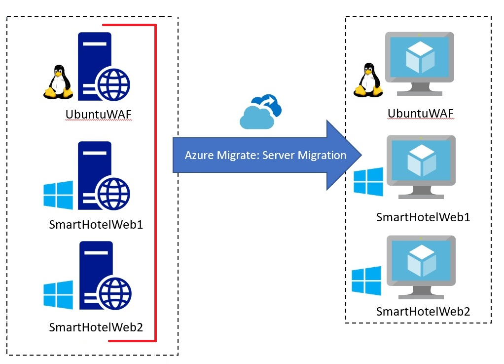

# Lab 03 - Migrando as VMs do ambiente local para o Azure

## Objetivo

Neste laboratório, migraremos VMs locais usando a Ferramenta de Migração
do Azure e os dados de avaliação em um Projeto de Migração do Azure,
registraremos o Dispositivo Azure Migrate para replicação e, em seguida,
configuraremos o IP estático para a VM replicada e, por fim, migraremos
as VMs para o Azure no respectivo grupo de recursos.

### Tarefa 1: Criar uma conta de armazenamento

Nesta tarefa, você criará uma nova **conta de armazenamento do Azure**
que será usada pelo **Azure Migrate: Migração de servidor** para
armazenamento de dados da sua máquina virtual durante a migração.

> **Observação:** Este laboratório se concentra nas ferramentas técnicas
> necessárias para a migração de cargas de trabalho. Em um cenário real,
> é necessário considerar um planejamento de longo prazo antes da
> migração de ativos. A landing zone necessária para hospedar VMs também
> deve incluir considerações sobre tráfego de rede, controle de acesso,
> organização de recursos e governança. Por exemplo, o CAF Migration
> Blueprint e o CAF Foundation Blueprint podem ser usados para
> implementar uma landing zone predefinida e demonstrar o potencial de
> uma abordagem de Infraestrutura como Código (IaC) para o gerenciamento
> de recursos de infraestrutura.

1.  Volte para a aba do **Portal do Azure** ou abra uma nova aba, acesse
    `https://portal.azure.com` e entre com suas credenciais de
    locatário do Office 365. Na barra de navegação à esquerda do Portal
    do Azure, selecione **+ Create** um recurso.

- 

  Interface gráfica do usuário, texto, aplicativo, e-mail de uma
  descrição de computador gerada automaticamente

2.  Pesquise e selecione `Storage account`, após o **Create**.

- 

  Interface gráfica do usuário, descrição do aplicativo gerada
  automaticamente

  

  Interface gráfica do usuário, texto, aplicativo, e-mail de uma
  descrição de computador gerada automaticamente

3.  No painel **Create storage account**, na aba **Basics**, use os
    seguintes valores:

    - Subscription: **Keep the default selected subscription**.

    - Resource group: **AzureMigrateRG**

    - Storage account name: `migstrgXXXXXX` \[substitute **XXXXXX** with
      random number\]

    - Location: **West US**.

    - Performance: **Standard**

    - Redundancy: **Locally-redundant storage (LRS)**

- 

  Uma imagem contendo o gráfico de uma descrição gerada automaticamente

4.  Selecione a aba **Data protection** e \[ **desmarque** \] a **Enable
    soft delete blobs** e então selecione o botão **Review** e então
    selecione **Create**.

- 

  Uma imagem contendo o gráfico de uma descrição gerada automaticamente

  

  Uma imagem contendo o gráfico de uma descrição gerada automaticamente

  

  Uma imagem contendo o gráfico de uma descrição gerada automaticamente

5.  Clique em ir para o recurso e, em **Data management,** selecione
    **Data protection.** Certifique-se de que **Enable soft delete for
    blobs** esteja desmarcado e clique no botão **Save**.

- 

Você concluiu esta tarefa. Não feche esta aba para prosseguir para a
próxima tarefa.

**Resumo da tarefa**

Nesta tarefa, você criou uma nova conta de armazenamento do Azure que
será usada pelo Azure Migrate: Migração de servidor.

### Tarefa 2: Criar um endpoint privado

Nesta tarefa, você criará um endpoint na rede virtual fornecida que será
usado pelo recurso do SQL Server.

Você também configurará um endpoint privado nesta rede para permitir
acesso privado e seguro ao Banco de Dados SQL.

> **Observação:** o Azure oferece diversas opções para implementar a
> configuração de rede correta. Após o laboratório, se você quiser
> entender melhor suas opções de rede, consulte \[guia de decisão de
> rede\]
> `https://docs.microsoft.com/azure/cloud-adoption-framework/decision-guides/software-defined-network`,
> which builds on the Cloud Adoption Framework’s Azure landing zones.

1.  Navegue até o grupo de recursos **SmartHotelRG** e clique no **SQL
    server**, conforme mostrado na imagem abaixo.

- 

  Interface gráfica do usuário, texto, aplicativo, e-mail de uma
  descrição de computador gerada automaticamente

  

  Interface gráfica do usuário, texto, descrição do aplicativo gerada
  automaticamente

2.  Em **Security**, selecione **Networking** **-\>Private access** e
    selecione **+ Create a Private endpoint**.

- 

3.  Na aba **Basics**, insira a seguinte configuração e selecione
    **Next: Resource**:

    1.  Resource group: **SmartHotelRG**

    2.  Name: `SmartHotel-DB-Endpoint`

    3.  Region: **West US** (Select the same location as the
        SmartHotelVNet.)

- 

  Uma imagem contendo o gráfico de uma descrição gerada automaticamente

4.  Na aba **Resource**, insira a seguinte configuração e selecione
    **Next: Virtual Network**:

    - Target sub-resource: **sqlServer**

- 

5.  Na aba **Virtual Network**, insira a seguinte configuração e
    selecione **Next: DNS**:

    - Virtual network: SmartHotelVNet

    - Subnet: SmartHotelDB (192.168.0.128/25)

    - Private IP configuration: Select Dynamically allocate IP address

- 

6.  Na aba **DNS**, insira a seguinte configuração e selecione **Next:
    Tags.**

    1.  Integrate with private DNS zone: **Yes**

    2.  Subscription: **Keep the default selected subscription**

    3.  Resource group: **SmartHotelRG**

- 

7.  Selecione **Review + create**.

- 

8.  Selecione **Create**.

- 

  Uma imagem contendo o gráfico de uma descrição gerada automaticamente

9.  **Aguarde** a conclusão da implementação.

- 

  Uma imagem contendo o gráfico de uma descrição gerada automaticamente

10. Abra o painel **Private Endpoint,** clique em **DNS configuration**
    e observe que o **FQDN** para o endpoint está listado como
    **\database.windows.net**, com um endereço IP interno
    **192.168.0.132.**

- 

  Uma imagem contendo o gráfico de uma descrição gerada automaticamente

> **Observação:** O DNS privado é usado para que o nome de domínio do
> banco de dados, **\database.windows.net,** seja resolvido para o
> endereço IP do endpoint privado interno **192.168.0.132** quando
> consultado a partir do SmartHotelVNet, seja direcionado para o
> endereço IP do servidor de banco de dados quando consultado fora da
> VNet. Isso significa que a mesma string de conexão (que contém o nome
> de domínio) pode ser usada em ambos os casos.
>
> **Observação**: Se a conexão do endpoint privado não permitir que o
> endereço IP ou o nome de domínio do banco de dados se conecte ao banco
> de dados, pode ser necessário criar uma nova regra de firewall para
> permitir os intervalos de endereços IP do banco de dados e do link
> privado.

Você concluiu esta tarefa. Não feche esta aba para prosseguir para a
próxima tarefa.

**Resumo da tarefa**

Nesta tarefa, você criou um endpoint privado na rede virtual que será
usado para acessar o banco de dados SQL.

### Tarefa 3: Criar um endpoint privado para conta de armazenamento

Nesta tarefa, você criará um endpoint na rede virtual fornecida que será
usado pela **Conta de Armazenamento de Replicação**. Você também
configurará um endpoint privado nessa rede para permitir acesso privado
e seguro à **Conta de Armazenamento de Replicação.**

1.  Navegue até o grupo de recursos **AzureMigrateRG** e clique na conta
    de armazenamento de replicação listada **migstrgXXXXXX**, conforme
    mostrado na imagem abaixo.

- 

  Uma imagem contendo o gráfico de uma descrição gerada automaticamente

2.  Em **Security**, selecione **Networking -\> Private endpoint
    connections** e, em seguida, selecione **+ Private endpoint**.

- 

  Uma imagem contendo o gráfico de uma descrição gerada automaticamente

3.  Na aba **Basics**, insira a seguinte configuração e selecione
    **Next: Resource**:

    1.  Resource group:  **AzureMigrateRG**

    2.  Name: `Storage-Endpoint`

    3.  Region: **West US**

- 

  Uma imagem contendo o gráfico de uma descrição gerada automaticamente

4.  Na aba **Resource** , insira a seguinte configuração e selecione
    **Next: Virtual Network**:

    - Target sub-resource: **blob**

- 

  Uma imagem contendo o gráfico de uma descrição gerada automaticamente

5.  Na aba **Virtual Network**, insira a seguinte configuração e
    selecione **Next: DNS**:

    - Virtual network: smarthotelhostvnet

    - Subnet: hostsubnet

    - Private IP configuration: Select Dynamically allocate IP address

- 

  Uma imagem contendo o gráfico de uma descrição gerada automaticamente

6.  Na aba **DNS**, insira a seguinte configuração e selecione **Next:
    Tags**.

    - Integrate with private DNS zone: Yes

    - Subscription: Keep the default selected subscription

    - Resource group: SmartHotelHostRG

- 

  Uma imagem contendo o gráfico de uma descrição gerada automaticamente

7.  Selecione **Review + create**.

- 

  Uma imagem contendo o gráfico de uma descrição gerada automaticamente

8.  Selecione **Create**.

- 

  Uma imagem contendo o gráfico de uma descrição gerada automaticamente

9.  **Aguarde** a conclusão da implementação.

- 

  Uma imagem contendo o gráfico de uma descrição gerada automaticamente

**Resumo da tarefa**

Nesta tarefa, você criou um endpoint privado na rede virtual que será
usado para acessar a **Replication Storage Account**.

### Tarefa 4: Registrar o Hyper-V host com migração e modernização

Nesta tarefa, você registrará seu Hyper-V host no serviço **Azure
Migrate: Migração de Servidor.** Este serviço usa o **Azure Site
Recovery** como mecanismo de migração subjacente. Como parte do processo
de registro, você implementará o **Provedor do Azure Site Recovery** no
seu **Hyper-V host**.

1.  Retorne ao **Azure Migrate** no **Portal do Azure**
    `https://portal.azure.com`.

- 

  Interface gráfica do usuário, descrição do aplicativo gerada
  automaticamente

2.  Selecione **Servers,databases and webapps** em **Migration goals** à
    esquerda. Em **Migration tools**, selecione **Discover**.

- > **Observação:** talvez seja necessário adicionar a ferramenta de
  > migração seguindo o link abaixo da seção **Migration Tools**,
  > selecionando **Azure Migrate: Server Migration** e, em seguida,
  > selecionando **Add tool(s)**.

  

  Uma imagem contendo o gráfico de uma descrição gerada automaticamente

3.  No painel **Discover machines,** em **Where do you want to migrate
    to?,** escolha Azure VM. Em **Are your machines virtualized**,
    selecione **Yes, with Hyper-V**. Em **Target region,** insira **West
    US (the same region as used for your Azure SQL Database**, que pode
    ser encontrada no portal do Azure) e marque a caixa de seleção de
    confirmação. Selecione **Create resources** para iniciar a
    implementação do recurso do Azure Site Recovery usado pelo Azure
    Migrate: Migração de Servidor para **Hyper-V migrations**.

- 

  Uma imagem contendo o gráfico de uma descrição gerada automaticamente

4.  Após a conclusão da implementação, o painel **Discover machines**
    deverá ser atualizado com instruções adicionais.

- 

  Um close de uma descrição de texto gerada automaticamente

5.  Copie o link de **Download** do instalador do software do provedor
    de **Hyper-V replication** para sua área de transferência.

- 

  Uma imagem contendo o gráfico de uma descrição gerada automaticamente

6.  Abra a janela do desktop remota do **SmartHotelHost, inicie o
    Chrome** no desktop e cole o link em uma nova aba do navegador para
    baixar o instalador do provedor do Azure Site Recovery.

- 

  Interface gráfica do usuário, texto, descrição do aplicativo gerada
  automaticamente

7.  Retorne à página **Discover machines** no seu navegador (fora da
    sessão de desktop remoto do SmartHotelHost). Selecione o botão azul
    **Download** e baixe o arquivo da chave de registro.

- 

  Interface gráfica do usuário, texto, aplicativo, e-mail de uma
  descrição de computador gerada automaticamente

8.  Abra o local do arquivo no Windows Explorer e copie o arquivo para a
    área de transferência. Retorne à sessão de desktop remota do
    **SmartHotelHost** e cole o arquivo no desktop.

- 

  Interface gráfica do usuário, descrição do aplicativo gerada
  automaticamente

9.  Ainda na sessão do desktop remota do **SmartHotelHost,** abra o
    instalador **AzureSiteRecoveryProvider.exe** que você baixou
    anteriormente.

- 

  Interface gráfica do usuário, texto, aplicativo, e-mail de uma
  descrição de computador gerada automaticamente

10. Na aba **Microsoft Update,** selecione **Off** e **Next**.

- 

  Interface gráfica do usuário, texto, aplicativo, e-mail de uma
  descrição de computador gerada automaticamente

11. Aceite o local de instalação padrão e clique em **Install**.

- 

  Interface gráfica do usuário, texto, descrição do aplicativo gerada
  automaticamente

12. Selecione **Register**.

- 

  Interface gráfica do usuário, texto, aplicativo, e-mail de uma
  descrição de computador gerada automaticamente

13. Navegue até o local do arquivo de chave que você baixou. Quando a
    chave for carregada, selecione **Next**.

- 

  Interface gráfica do usuário, texto, aplicativo, e-mail de uma
  descrição de computador gerada automaticamente

14. Selecione **Connect directly to Azure Site Recovery without a proxy
    server** e selecione **Next**. O **registro** do **Hyper-V host** no
    **Azure Site Recovery** será iniciado.

- 

  Interface gráfica do usuário, texto, aplicativo, e-mail de uma
  descrição de computador gerada automaticamente

15. Aguarde a conclusão do registro (isso pode levar vários minutos). Em
    seguida, selecione **Finish**.

- 

  Interface gráfica do usuário, texto, descrição do aplicativo gerada
  automaticamente

16. Minimize a sessão do desktop remoto do **SmartHotelHost** e retorne
    à janela do navegador do **Azure Migrate.** **Atualize** o navegador
    e reabra o painel **Discover machines** selecionando **Discover** em
    **Migration tools**.

- 

  Uma imagem contendo o gráfico de uma descrição gerada automaticamente

17. Selecione **Yes, com Hyper-V** em **Are your machines
    virtualized?**. Clique no botão **Finalize registration**, que agora
    deve estar habilitado.

- 

  Uma imagem contendo o gráfico de uma descrição gerada automaticamente

18. O Azure Migrate concluirá o registro no Hyper-V host. **Aguarde** a
    conclusão do registro. Isso pode levar alguns minutos.

- 

  Uma imagem contendo o gráfico de uma descrição gerada automaticamente

19. Após a conclusão do registro, feche o painel **Discover machines.**

- 

  Uma captura de tela de um erro de computador Descrição gerada
  automaticamente

20. O painel **Migration and modernization** agora deve mostrar **5
    discovered servers**.

- 

  Uma imagem contendo o gráfico de uma descrição gerada automaticamente

**Resumo da tarefa**

Nesta tarefa, você registrou seu Hyper-V host com o serviço de migração
do Azure Migrate Server.

### Tarefa 5: Habilitar a replicação do Hyper-V para o Azure Migrate

Nesta tarefa, você configurará e habilitará a replicação de suas
máquinas virtuais locais do Hyper-V para o serviço de migração do
Servidor do Azure Migrate.

1.  Em **Migration and modernization**, selecione **Replicate**. Isso
    abrirá o assistente de **Replicação.**

- 

  Uma imagem contendo o gráfico de uma descrição gerada automaticamente

2.  Na aba **Specify intent**, insira a seguinte configuração e
    selecione **Continue.**

    1.  What do you want to migrate: **Servers or virtual machines(VM)**

    2.  Where do you want to migrate to: **Azure VM**

    3.  Are your machine virtualized? – **Yes, with Hyper-V**

- 

  Uma imagem contendo o gráfico de uma descrição gerada automaticamente

3.  Na aba **Virtual machines**, em **Import migration settings from an
    assessment**, selecione **Yes, apply migration settings from an
    Azure Migrate assessment.** Selecione o grupo de VMs **SmartHotel
    VMs** e a avaliação de migração **SmartHotelAssessment**.

- 

  Uma imagem contendo o gráfico de uma descrição gerada automaticamente

4.  A aba **Virtual machines** agora deve mostrar as máquinas virtuais
    incluídas na avaliação. Selecione as máquinas virtuais
    **UbuntuWAF**, **smarthotelweb1** e **smarthotelweb2** e, em
    seguida, selecione Next.

- 

  Uma imagem contendo o gráfico de uma descrição gerada automaticamente

5.  Na aba **Target settings**, selecione sua assinatura e o grupo de
    recursos **SmartHotelRG**. Em **Cache storage account,** selecione a
    conta de armazenamento **migstrgXXXXXX** e, em **Virtual Network,**
    selecione **SmartHotelVNet.** Em Sub-rede, selecione **SmartHotel**.
    Selecione **Next**.

- 

  Uma imagem contendo o gráfico de uma descrição gerada automaticamente

6.  Na aba **Compute**, selecione o tamanho da VM **Standard_F2s_v2**
    para cada máquina virtual. Selecione o **Windows operating system**
    para as máquinas virtuais **smarthotelweb** e o sistema operacional
    **Linux** para a máquina virtual **UbuntuWAF**. Selecione **Next**.

- 

  Uma imagem contendo o gráfico de uma descrição gerada automaticamente

7.  Na aba **Disks**, revise as configurações, mas não faça nenhuma
    alteração. Selecione **Next.**

- 

  Uma imagem contendo o gráfico de uma descrição gerada automaticamente

8.  Na aba **Tags**, clique em **Next** e, na aba de replicação
    **Review + Start**, clique no botão **Replicate**.

9.  No painel **Migration tools**, em **Migration and modernization**,
    selecione o botão **Overview**.

- 

  Uma imagem contendo o gráfico de uma descrição gerada automaticamente

10. Confirme se as 3 máquinas estão replicando.

- 

  Uma imagem contendo o gráfico de uma descrição gerada automaticamente

11. Selecione **Replication** em **Manage** à esquerda. Selecione
    **Refresh** ocasionalmente e aguarde até que todas as três máquinas
    apresentem o status **Protected**, o que indica que a replicação
    inicial foi concluída. Isso levará alguns minutos.

- 

  Uma imagem contendo o gráfico de uma descrição gerada automaticamente

> **Observação:** A replicação das máquinas virtuais levará de 20 a 40
> minutos para ser concluída. Aguarde.

Uma imagem contendo o gráfico de uma descrição gerada automaticamente

Você concluiu a tarefa. Não feche a janela e prossiga para a próxima
tarefa.

**Resumo da tarefa**

Nesta tarefa, você habilitou a replicação do Hyper-V host para o Azure
Migrate e configurou o tamanho da VM replicada no Azure.

### Tarefa 6: Configurar endereços IP internos estáticos para cada VM

Nesta tarefa, você modificará as configurações de cada VM replicada para
usar um endereço IP privado estático que corresponda aos endereços IP
locais dessa máquina.

1.  Ainda usando o painel **Azure Migrate: Migration and modernization |
    Replication,** selecione a máquina virtual **smarthotelweb1.** Isso
    abrirá um painel detalhada de migração e replicação para esta
    máquina. Reserve um momento para analisar essas informações.

- 

  Uma imagem contendo o gráfico de uma descrição gerada automaticamente

2.  Selecione **Compute and Network** em **General** à esquerda e depois
    selecione **Edit.**

- 

  Uma imagem contendo o gráfico de uma descrição gerada automaticamente

3.  Confirme se a VM está configurada para usar o tamanho de VM **F2s_v2
    (ou DS2_v2 ou D2s_v3** ).

- 

4.  Em **Network Interfaces**, selecione **InternalNATSwitch** para
    abrir as **network interface settings**.

- 

  Uma imagem contendo o gráfico de uma descrição gerada automaticamente

5.  Altere o **Private IP address** para `192.168.0.4`. Selecione **OK**
    para fechar a janela de configurações da interface de rede.

- 

  Interface gráfica do usuário, texto, descrição do aplicativo gerada
  automaticamente

6.  **Save** as configurações do **smarthotelweb1.**

- 

  Uma imagem contendo o gráfico de uma descrição gerada automaticamente

  

> **Observação** - Repita essas etapas para configurar o endereço IP
> privado para o outro

7.  Ainda usando o painel **Azure Migrate: Migration and modernization |
    Replication**, selecione a máquina virtual **smarthotelweb2.**

- 

  Uma imagem contendo o gráfico de uma descrição gerada automaticamente

8.  Selecione **Compute and Network** em **General** à esquerda e depois
    selecione **Edit**.

- 

9.  Em **Network Interfaces**, selecione **InternalNATSwitch** para
    abrir as configurações da interface de rede.

- 

10. Altere o **Private IP address** para `192.168.0.5`. Selecione **OK**
    para fechar a janela de configurações da interface de rede.

- 

11. **Save** as configurações do **smarthotelweb2.**

- 

12. Usando o painel **Azure Migrate: Migration and modernization |
    Replicating machines**, selecione a máquina virtual **UbuntuWAF**.
    Abrirá um painel detalhado de migração e replicação para esta
    máquina.

- 

  Uma imagem contendo o gráfico de uma descrição gerada automaticamente

13. Selecione **Compute and Network** em **General** à esquerda e, em
    seguida, selecione **Edit**

- 

  Interface gráfica do usuário, texto, aplicativo, e-mail de uma
  descrição de computador gerada automaticamente

14. Confirme se a VM está configurada para usar o tamanho de VM
    **F2s_v2**. Em **Network Interfaces**, selecione
    **InternalNATSwitch** para abrir as configurações da interface de
    rede.

- 

15. Altere o **Private IP address** para `192.168.0.8`. Selecione **OK**
    para fechar a janela de configurações da interface de rede.

- 

  Interface gráfica do usuário, descrição do aplicativo gerada
  automaticamente

16. **Save** as configurações do **UbuntuWAF**.

- 

  Interface gráfica do usuário, descrição do aplicativo gerada
  automaticamente

Você concluiu a tarefa. Não feche a janela e prossiga para a próxima
tarefa.

**Resumo da tarefa**

Nesta tarefa, você modificou as configurações de cada VM replicada para
usar um endereço IP privado estático que corresponde aos endereços IP
locais dessa máquina

> **Observação**: O Azure Migrate faz uma "best guess" das configurações
> da VM, mas você tem controle total sobre as configurações dos itens
> migrados. Nesse caso, definir um endereço IP privado estático garante
> que as máquinas virtuais no Azure mantenham os mesmos IPs que tinham
> no local, o que evita a necessidade de reconfigurar as VMs durante a
> migração (por exemplo, editando arquivos web.config).

### Tarefa 7: Migração de servidor

Nesta tarefa, você executará uma migração das máquinas UbuntuWAF,
smarthotelweb1 e smarthotelweb2 para o Azure.

> **Observação:** Em um cenário real, você realizaria uma migração de
> teste antes da migração final. Para economizar tempo, você pulará a
> migração de teste neste laboratório. O processo de migração de teste é
> muito semelhante ao da migração final.

1.  Retorne ao portal **Azure Migrate: Servers, databases and web apps**
    usando o link na parte superior, conforme mostrado na imagem abaixo.

- 

2.  Clique em **Overview** na seção **Migration tools**.

- 

  Uma imagem contendo o gráfico de uma descrição gerada automaticamente

3.  Em **Step 3: Migrate**, selecione **Migrate**.

- 

  Uma imagem contendo o gráfico de uma descrição gerada automaticamente

4.  Na página **Specify Intent**, certifique-se de que a **VM do Azure**
    esteja escolhida e clique em Continuar

- 

  Uma imagem contendo o gráfico de uma descrição gerada automaticamente

  > **Observação:** você pode escolher se as máquinas virtuais locais
  > devem ser desligadas automaticamente antes da migração para
  > minimizar a perda de dados. Qualquer uma das configurações
  > funcionará para este laboratório.

5.  No painel **Migrate**, selecione as 3 máquinas virtuais e selecione
    **Migrate** para iniciar o processo de migração.

- 

  Uma imagem contendo o gráfico de uma descrição gerada automaticamente

6.  O processo de migração será iniciado.

- 

7.  Para monitorar o progresso, selecione **Jobs** em **Manage** à
    esquerda e revise o status das três tarefas de **Planned failover**.

- 

  Uma imagem contendo o gráfico de uma descrição gerada automaticamente

8.  **Aguarde** até que todos os três trabalhos de **Planned failover**
    apresentem o **Status** de **Successful**. Não é necessário
    atualizar o navegador. Isso pode levar até **15 minutos.**

- 

  Uma imagem contendo o gráfico de uma descrição gerada automaticamente

9.  Navegue até o grupo de recursos **SmartHotelRG** e verifique se os
    recursos de VM, interface de rede e disco foram criados para cada
    uma das máquinas virtuais que estão sendo migradas.

- 

  Interface gráfica do usuário, texto, aplicativo, e-mail de uma
  descrição de computador gerada automaticamente

  

  Uma imagem contendo o gráfico de uma descrição gerada automaticamente

**Resumo da tarefa**

Nesta tarefa, você usou o Azure Migrate para criar VMs do Azure usando
as configurações definidas e os dados replicados das máquinas Hyper-V.
Migrando suas VMs locais para o Azure.

### Resumo

Ao final do laboratório, devemos ter replicado com sucesso e migrado as
3 VMs para o grupo de recursos SmartHotelRG.

- **smarthotelweb1**

- **smarthotelweb2**

- **UbuntuWAF**

Também precisamos parar as VMs migradas e a VM SmartHotelHost para
conservar o crédito e garantir que os laboratórios restantes possam ser
concluídos.

Interface gráfica do usuário, texto, aplicativo, e-mail de uma descrição
de computador gerada automaticamente

Interface gráfica do usuário, texto, aplicativo, e-mail de uma descrição
de computador gerada automaticamente

Também precisamos parar as VMs migradas e a VM SmartHotelHost para
conservar o crédito e garantir que os laboratórios restantes possam ser
concluídos.
