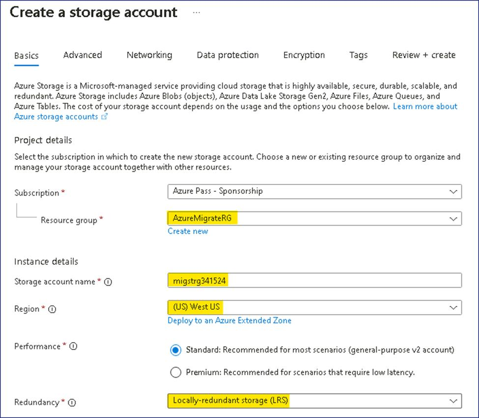

# Lab 03 - Migrating the VMs from on-premises environment to Azure

## Objective

In this Lab we would migrate on-premises VMs using the Azure Migrate
Tool and the assessment data in an Azure Migration Project, we will
Register the Azure Migrate Appliance for Replication and then configure
the static IP for the replicated VM, and finally migrate the VMs to
Azure in the respective Resource group.

### Task 1: Create a Storage Account

In this task you will create a new **Azure Storage Account** that will
be used by **Azure Migrate: Server Migration** for storage of your
virtual machine data during migration.

> **Note:** This lab focuses on the technical tools required for workload
migration. In a real-world scenario, more consideration should go into
the long-term plan prior to migrating assets. The landing zone required
to host VMs should also include considerations for network traffic,
access control, resource organization, and governance. For example, the
CAF Migration Blueprint and CAF Foundation Blueprint can be used to
deploy a pre-defined landing zone, and demonstrate the potential of an
Infrastructure as Code (IaC) approach to infrastructure resource
management.

1.  Switch back to **Azure Portal** tab or open new tab and navigate
    to `https://portal.azure.com` and sign in with your office 365
    tenant credentials. In the Azure portal's left navigation,
    select **+ Create** a resource.

    

2.  Search for and select `Storage account`, followed by **Create**.

    

    

3.  In the **Create storage account** blade, on the **Basics** tab, use
    the following values:

    - Subscription: **Keep the default selected subscription**.

    - Resource group: **AzureMigrateRG**

    - Storage account
      name: `migstrg@lab.LabInstance.Id`

    - Region: **West US**.

    - Primary service: **Azure Blob Storage or Azure Data Lake Storage Gen 2**

    - Performance: **Standard**

    - Redundancy: **Locally-redundant storage (LRS)**

    

4.  Select the **Data protection** tab and [**uncheck**] the **Enable soft
    delete blobs** and then select **Review** button, then
    select **Create**.

    

    

    

5. Click on Go to resource and then under **Data management** select **Data protection** ensure that **Enable soft delete for blobs** is unchecked, then click on **Save** button.

    

You have completed this task. Do not close this tab to proceed ahead
with the next task.

**Task summary**

In this task you created a new Azure Storage Account that will be used
by Azure Migrate: Server Migration.

### Task 2: Create a Private Endpoint for storage account

In this task you will create an endpoint on the provided virtual network
that will be used by the **Replication Storage Account**. You will also
configure a private endpoint in this network to allow private, secure
access to the **Replication Storage Account**.

1.  Under **Security + networking**, select **Networking -\> Private endpoint
    connections**, then select **+ Private endpoint**.

    

3.  On the **Basics** tab, enter the following configuration then
    select **Next: Resource**:

    - Resource group:  **AzureMigrateRG**

    - Name: `Storage-Endpoint`

    - Region: **West US**

    

4.  On the **Resource** tab, enter the following configuration then
    select **Next: Virtual Network**:

    - Target sub-resource: **blob**

    

5.  On the **Virtual Network** tab, enter the following configuration
    then select **Next: DNS**:

    - Virtual network: **smarthotelhostvnet**

    - Subnet: **hostsubnet**

    - Private IP configuration: Select **Dynamically allocate IP
      address**

    

6.  On the **DNS** tab, enter the following configuration then
    select **Next: Tags**.

    - Integrate with private DNS zone: **Yes**

    - Subscription: **Keep the default selected subscription**

    - Resource group: **SmartHotelHostRG**

    

7.  Select **Review + create**.

    

8.  Select **Create**.

    

9.  **Wait** for the deployment to complete.

    

**Task summary**

In this task you created a private endpoint on the virtual network that
will be used to access the **Replication Storage Account**.

### Task 3: Register the Hyper-V Host with Migration and modernization

In this task, you will register your Hyper-V host with the **Azure
Migrate: Server Migration** service. This service uses **Azure Site
Recovery** as the underlying migration engine. As part of the
registration process, you will deploy the **Azure Site Recovery
Provider** on your **Hyper-V host**.

1.  Return to the **Azure Migrate** blade in the **Azure Portal**
    `https://portal.azure.com`.

    

2.  Select **Servers,databases and webapps** under **Migration
    goals** on the left. Under **Migration tools**, select **Discover**.

    > **Note:** You may need to add the migration tool yourself by following
    the link below the **Migration Tools** section, selecting **Azure
    Migrate: Server Migration**, then selecting **Add tool(s)**.

    

3.  In the **Discover machines** panel, For **Where do you want to
    migrate to?** Choose Azure VM, under **Are your machines
    virtualized**, select **Yes, with Hyper-V**. Under **Target
    region** enter **West US (the same region as used for your Azure SQL
    Database** which can be found in the Azure portal) and check the
    confirmation checkbox. Select **Create resources** to begin the
    deployment of the Azure Site Recovery resource used by Azure
    Migrate: Server Migration for **Hyper-V migrations**. I

    

4.  Once deployment is complete, the **'Discover machines'** panel
    should be updated with additional instructions.

    

5.  Copy the **Download** link for the **Hyper-V replication** provider
    software installer to your clipboard.

    

6.  Open the **SmartHotelHost** remote desktop window,
    launch **Chrome** from the desktop shortcut, and paste the link into
    a new browser tab to download the Azure Site Recovery provider
    installer.

    

7.  Return to the **Discover machines** page in your browser (outside
    the SmartHotelHost remote desktop session). Select the
    blue **Download** button and download the registration key file.

    

8.  Open the file location in Windows Explorer, and copy the file to
    your clipboard. Return to the **SmartHotelHost** remote desktop
    session and paste the file to the desktop.

    

9.  Still within the **SmartHotelHost** remote desktop session, open
    the **AzureSiteRecoveryProvider.exe** installer you downloaded a
    moment ago.

    

10. On the **Microsoft Update** tab, select **Off** and select **Next**.

    

11. Accept the default installation location and click **Install**.

    

12. Select **Register** .

    

13. Browse to the location of the key file you downloaded. When the key
    is loaded select **Next**.

    

14. Select **Connect directly to Azure Site Recovery without a proxy
    server** and select **Next**. The **registration** of the **Hyper-V
    host** with **Azure Site Recovery** will begin.

    

15. Wait for registration to complete (this may take several minutes).
    Then select **Finish**.

    

16. Minimize the **SmartHotelHost** remote desktop session and return to
    the **Azure Migrate** browser window. **Refresh** your browser, then
    re-open the **Discover machines** panel by
    selecting **Discover** under **Migration tools**.

    

17. Select **Yes, with Hyper-V** for **Are your machines virtualized?**.
    Click on the **Finalize registration** button, which should now be
    enabled.

    

18. Azure Migrate will now complete the registration with the Hyper-V
    host. **Wait** for the registration to complete. This may take
    several minutes.

    

19. Once the registration is complete, close the **Discover
    machines** panel.

    

20. The **Migration and modernization** panel should now show **5
    discovered servers**.

    

**Task summary**

In this task you registered your Hyper-V host with the Azure Migrate
Server Migration service.

### Task 4: Enable Replication from Hyper-V to Azure Migrate

In this task, you will configure and enable the replication of your
on-premises virtual machines from Hyper-V to the Azure Migrate Server
Migration service.

1.  Under **Migration and modernization**, select **Replicate**. This
    opens the **Replicate** wizard

    

2.  In the **Specify intent** tab enter the following configuration then
    select **Continue.**

    - What do you want to migrate: **Servers or virtual machines(VM)**

    - Where do you want to migrate to: **Azure VM**

    - Are your machine virtualized? – **Yes, with Hyper-V**

    

    > **Note** - if you receive the below error, then close the browser and try again.

    

3.  On the **Virtual machines** tab, under **Import migration settings
    from an assessment**, select **Yes, apply migration settings from an
    Azure Migrate assessment.** Select the **SmartHotel VMs** VM group
    and the **SmartHotelAssessment** migration assessment.

    

4.  The **Virtual machines** tab should now show the virtual machines
    included in the assessment. Select
    the **UbuntuWAF**, **smarthotelweb1**,
    and **smarthotelweb2** virtual machines, then select Next.

    

5.  On the **Target settings** tab, select your subscription and the
    existing 
    
    - Resource group: **SmartHotelRG**
    
    - Cache storage account: **migstrg@lab.LabInstance.Id** 
    
    -  Virtual Network: **SmartHotelVNet**. 
    
    - Subnet: **SmartHotel**. 
    
    - Availability options: **No infrastructure redundancy required**
    
    Select **Next**.

    

6.  On the **Compute** tab, set the VM Security Type to **Standard**, select the **Standard_F2s_v2** VM size for
    each virtual machine. Select the **Windows operating system** for
    the **smarthotelwebX** virtual machines and the **Linux** operating
    system for the **UbuntuWAF** virtual machine. Select **Next**.

    

7.  On the **Disks** tab, review the settings but do not make any
    changes. Select **Next**

    

8.  On the **Tags** tab click on **Next**, then on the on the **Review +
    Start** replication tab, click on the **Replicate** button.

9.  In the **Migration tools** blade, under **Migration and
    modernization**, select the **Overview** button.

    

10. Expand **Migration**, select **Replications** and confirm that the 3 machines are replicating.

    

11. Click on the **Refresh** button, occasionally and wait until all three machines
    have a **Protected** status, which shows the initial replication is
    complete. This will take several minutes.

    

> **Note:** The replication of the Virtual machines, will take around
20-40 minutes to complete, please wait for the same.

You have completed the task. Do not close the window and proceed to the
next task.

**Task summary**

In this task you enabled replication from the Hyper-V host to Azure
Migrate, and configured the replicated VM size in Azure.

### Task 5: Configure static internal IP addresses for each VM

In this task you will modify the settings for each replicated VM to use
a static private IP address that matches the on-premises IP addresses
for that machine.

1.  Still using the **Azure Migrate: Migration and modernization |
    Replication** blade, select the **smarthotelweb1** virtual machine.
    This opens a detailed migration and replication blade for this
    machine. Take a moment to study this information.

    

2.  Select **Compute and Network** under **General** on the left.

3.  Confirm that the VM is configured to use the **F2s_v2** VM size

    
    
4.  Under **Network Interfaces**, click on the pencil icon to edit.

    

5.  Change the settings as below

    - IP address type - **Static**

    - **Private IP address** - `192.168.0.4`

    - Click on **Apply** button.
    
    

6.  **Save** the **smarthotelweb1** settings.

    

    

7. Repeat these steps to configure the private IP address for
the **smarthotelweb2** 

    - verify VM size to be **F2s_v2** 
    
    - IP address type - **Static**

    - **Private IP address** - `192.168.0.5`

7. Repeat these steps to configure the private IP address for
the **UbuntuWAF** 

    - verify VM size to be **F2s_v2** 
    
    - IP address type - **Static**

    - **Private IP address** - `192.168.0.8`

You have completed the task. Do not close the window and proceed to the
next task.

**Task summary**

In this task you modified the settings for each replicated VM to use a
static private IP address that matches the on-premises IP addresses for
that machine

> **Note**: Azure Migrate makes a "best guess" at the VM settings, but you
have full control over the settings of migrated items. In this case,
setting a static private IP address ensures the virtual machines in
Azure retain the same IPs they had on-premises, which avoids having to
reconfigure the VMs during migration (for example, by editing web.config
files).

### Task 6: Server migration

In this task you will perform a migration of the UbuntuWAF,
smarthotelweb1, and smarthotelweb2 machines to Azure.

> **Note**: In a real-world scenario, you would perform a test migration
before the final migration. To save time, you will skip the test
migration in this lab. The test migration process is very similar to the
final migration.

1.  Return to the **Azure Migrate: Servers, databases and web
    apps** blade using the link on the top, as shown in the image below.

    

2.  Click on **Overview** under **Migration tools** section.

    

3.  From the Overview screen click on the **Migrate** button.

    

4.  On the **Specify Intent** page, ensure **Azure VM** is chosen, then
    click on Continue

    

    > **Note**: You can optionally choose whether the on-premises virtual
    machines should be automatically shut down before migration to minimize
    data loss. Either setting will work for this lab.

5.  On the **Migrate** blade, select the 3 virtual machines then
    click on the **Migrate** button to start the migration process.

    

    > **Note** - Ignore the Test migration status as Failed, as we are not doing it for this test environment 

6.  The migration process will start.

    

7.  To monitor progress, select **Jobs** under **Manage** on the left
    and review the status of the three **Planned failover** jobs.

    

8.  **Wait** until all three **Planned failover** jobs show
    a **Status** of **Successful**. You should not need to refresh your
    browser. This could take up to **15 minutes**.

    

9.  Navigate to the **SmartHotelRG** resource group and check that the
    VM, network interface, and disk resources have been created for each
    of the virtual machines being migrated.

    

    

**Task summary**

In this task you used Azure Migrate to create Azure VMs using the
settings you have configured, and the data replicated from the Hyper-V
machines. This migrated your on-premises VMs to Azure.

### Summary

At the end of the Lab, we should have successfully replicated and then
Migrated the 3 VMs to the SmartHotelRG resource group.

- **smarthotelweb1**

- **smarthotelweb2**

- **UbuntuWAF**

