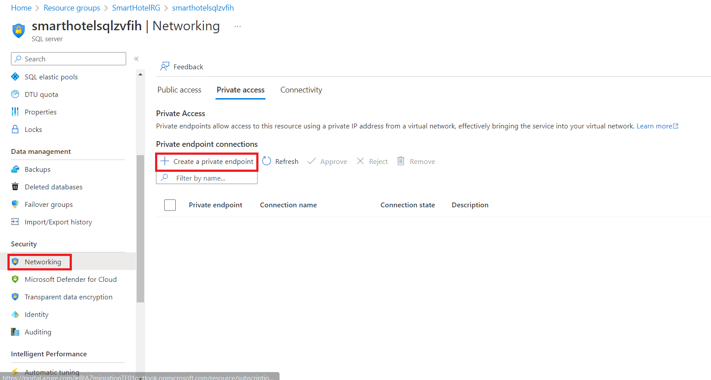
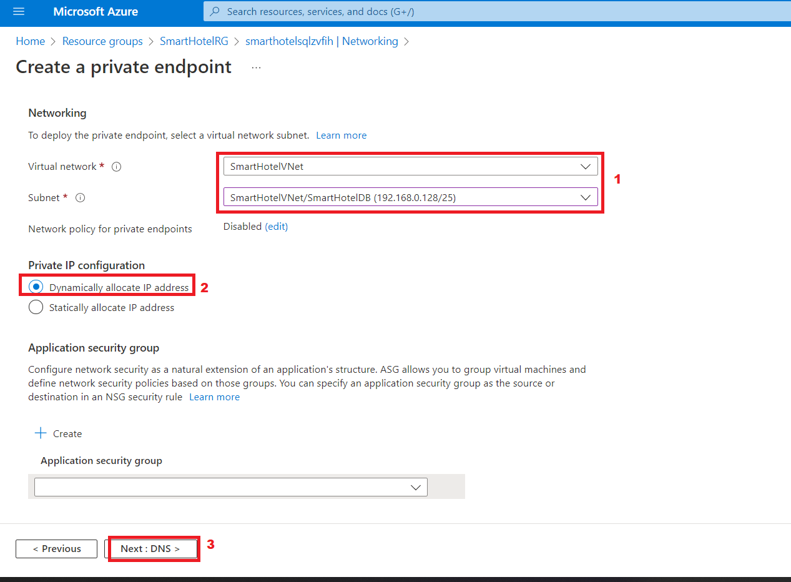
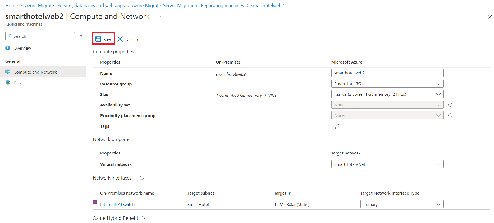

# Lab 03: Migrieren der VMs aus on-premises Umgebung zu Azure

## Ziele

In diesem Lab migrieren wir on-premises VMs mithilfe des Azure
Migrate-Tools und der Bewertungsdaten in einem Azure Migration Project,
registrieren die Azure Migrate-Appliance für die Replikation,
konfigurieren dann die statische IP-Adresse für die replizierte VM und
migrieren schließlich die VMs zu Azure in der jeweiligen
Ressourcengruppe.

### Aufgabe 1: Erstellen eines Speicherkontos

In dieser Aufgabe erstellen Sie ein neues **Azure Storage-Konto**, das
von **Azure Migrate: Server Migration**  für die Speicherung Ihrer
VM-Daten während der Migration verwendet wird.

> **Hinweis:** Diesen Lab konzentriert sich auf die technischen Tools,
> die für die Migration von Workloads erforderlich sind. In einem realen
> Szenario sollten mehrere Überlegungen in den langfristigen Plan
> einfließen, bevor die Ressourcen migriert werden. Die Zielzone, die
> zum Hosten von VMs erforderlich ist, sollte auch Überlegungen zum
> Netzwerkdatenverkehr, zur Zugriffssteuerung, zur
> Ressourcenorganisation und zur Governance enthalten. Beispielsweise
> können der CAF Migration Blueprint und der CAF Foundation Blueprint
> verwendet werden, um eine vordefinierte Zielzone bereitzustellen und
> das Potenzial eines Infrastructure as Code (IaC) Ansatzes für das
> Infrastrukturressourcenmanagement zu demonstrieren.

1.  Wechseln Sie zurück zur Registerkarte **Azure Portal,** oder öffnen
    Sie eine neue Registerkarte, navigieren Sie zu
    ``https://portal.azure.com`,`` `und melden Sie sich mit Ihren Office
    365-Mandantenanmeldeinformationen an. Wählen Sie im linken
    Navigationsbereich des Azure-Portals die Option **+ Create** a
    resource aus.

- 

  Grafische Benutzeroberfläche, Text, Anwendung, E-Mail Beschreibung
  wird automatisch generiert

2.  Suchen Sie nach `Storage account``, und wählen Sie es`` `aus,
    gefolgt von **Create**.

- 

  Grafische Benutzeroberfläche, Anwendung Beschreibung wird automatisch
  generiert

  

  Grafische Benutzeroberfläche, Text, Anwendung, E-Mail Beschreibung
  wird automatisch generiert

3.  Verwenden Sie auf dem Schwert **Create storage account** auf der
    Registerkarte **Basics** die folgenden Werte:

    - Subscription: **Behalten Sie das standardmäßig ausgewählte
      Abonnement bei**.

    - Resource group: **AzureMigrateRG**

    - Storage account name: `migstrgXXXXXX`  \[**XXXXXX** durch
      Zufallszahl ersetzen\]

    - Location: **West US**.

    - Performance: **Standard**

    - Redundancy: **Locally-redundant storage (LRS)**

- 

  Ein Screenshot eines Computers Beschreibung wird automatisch generiert

4.  Wählen Sie die Registerkarte **Data protection** aus, und
    \[**deaktivieren**\] Sie die Option **Enable soft delete blobs**,
    und wählen Sie dann die Schaltfläche **Review**  und dann **Create**
    aus.

- 

  Ein Screenshot eines Computers Beschreibung wird automatisch generiert

  

  Ein Screenshot eines Computers Beschreibung wird automatisch generiert

  

  Ein Screenshot eines Computers Beschreibung wird automatisch generiert

5.  Klicken Sie auf Go to resource, und wählen Sie dann unter **Data
    management** die Option **Data protection** aus, stellen Sie sicher,
    dass **Enable soft delete for blobs** deaktiviert ist, und klicken
    Sie dann auf die Schaltfläche **Save**.

- 

Sie haben diese Aufgabe abgeschlossen. Schließen Sie diese Registerkarte
nicht, um mit der nächsten Aufgabe fortzufahren.

**Zusammenfassung der Aufgabe**

In dieser Aufgabe haben Sie ein neues Azure Storage-Konto erstellt, das
von Azure Migrate: Server Migration verwendet wird.

### Aufgabe 2: Erstellen eines privaten Endpunkts

In dieser Aufgabe erstellen Sie einen Endpunkt im bereitgestellten
virtuellen Netzwerk, der von der SQL Server-Ressource verwendet wird.

Außerdem konfigurieren Sie einen privaten Endpunkt in diesem Netzwerk,
um einen privaten, sicheren Zugriff auf die SQL-Datenbank zu
ermöglichen.

> **Hinweis:** Azure bietet mehrere Optionen zum Bereitstellen der
> richtigen Netzwerkkonfiguration. Wenn Sie nach dem Lab Ihre
> Netzwerkoptionen besser verstehen möchten, lesen Sie den \[network
> decision
> guide\]` https://docs.microsoft.com/azure/cloud-adoption-framework/decision-guides/software-defined-network`,
> der auf den Azure-Zielzonen des Cloud Adoption Framework aufbaut.

1.  Navigieren Sie zur resource group **SmartHotelRG**, und klicken Sie
    auf den aufgelisteten **SQL-Server,** wie in der folgenden Abbildung
    gezeigt.

- 

  Grafische Benutzeroberfläche, Text, Anwendung, E-Mail Beschreibung
  wird automatisch generiert

  

  Grafische Benutzeroberfläche, Text, Anwendung Beschreibung wird
  automatisch generiert

2.  Wählen Sie unter **Security**, die Option
    **Networking** **-\>Private access** aus, und wählen Sie dann **+
    Create a Private endpoint** aus.

- 

3.  Geben Sie auf der Registerkarte **Basics**, die folgende
    Konfiguration ein, und wählen Sie dann **Next: Resource** aus:

    1.  Resource group: **SmartHotelRG**

    2.  Name: `SmartHotel``-DB-Endpoint`

    - Region: **West US**  (Wählen Sie denselben Standort wie das
      SmartHotelVNet aus.)

- 

  Ein Screenshot eines Computers Beschreibung wird automatisch generiert

4.  Geben Sie auf der Registerkarte **Resource**, die folgende
    Konfiguration ein, und wählen Sie dann **Next: Virtual Network**
    aus:

    - Target sub-resource: **sqlServer**

- 

5.  Geben Sie auf der Registerkarte **Virtual Network**, die folgende
    Konfiguration ein, und wählen Sie dann **Next: DNS** aus:

    1.  Virtual network: **SmartHotelVNet**

    2.  Subnet: **SmartHotelDB (192.168.0.128/25)**

    3.  Private IP configuration: Wählen Sie **Dynamically allocate IP
        address** aus

- 

6.  Geben Sie auf der Registerkarte **DNS,** die folgende Konfiguration
    ein, und wählen Sie dann **Next: Tags** aus**.**

    - Integrate with private DNS zone: **Yes**

    &nbsp;

    - Subscription: **Behalten Sie das standardmäßig ausgewählte
      Abonnement bei**

    - Resource group: **SmartHotelRG**

- 

7.  Wählen Sie **Review + create** aus.

- 

8.  Wählen Sie **Create** aus.

- 

  Ein Screenshot eines Computers Beschreibung wird automatisch generiert

9.  **Warten** Sie, bis die Bereitstellung abgeschlossen ist.

- 

  Ein Screenshot eines Computers Beschreibung wird automatisch generiert

10. Öffnen Sie das **Schwert Private Endpoint**, klicken Sie auf **DNS
    configuration,** und beachten Sie, dass der **FQDN** für den
    Endpunkt als **\database.windows.net** mit der internen IP-Adresse
    **192.168.0.132** aufgeführt ist.

- 

  Ein Screenshot eines Computers Beschreibung wird automatisch generiert

> **Hinweis**: Privates DNS wird so verwendet, dass der
> Datenbankdomänenname **\database.windows.net** in die interne
> IP-Adresse des privaten Endpunkts **192.168.0.132** aufgelöst wird,
> wenn er aus dem SmartHotelVNet aufgelöst wird, aber in die mit dem
> Internet verbundene IP-Adresse des Datenbankservers aufgelöst wird,
> wenn er von außerhalb des VNets aufgelöst wird. Das bedeutet, dass in
> beiden Fällen dieselbe Verbindungszeichenfolge (die den Domänennamen
> enthält) verwendet werden kann.
>
> **Hinweis**: Wenn die Verbindung mit dem privaten Endpunkt nicht
> zulässt, dass die IP-Adresse oder der Domänenname der Datenbank eine
> Verbindung mit der Datenbank herstellt, muss möglicherweise eine neue
> Firewallregel erstellt werden, um die IP-Adressbereiche der Datenbank
> und der privaten Verbindung zuzulassen.

Sie haben diese Aufgabe abgeschlossen. Schließen Sie diese Registerkarte
nicht, um mit der nächsten Aufgabe fortzufahren.

**Zusammenfassung der Aufgabe**

In dieser Aufgabe haben Sie einen privaten Endpunkt im virtuellen
Netzwerk erstellt, der für den Zugriff auf die SQL-Datenbank verwendet
wird.

### Aufgabe 3: Erstellen eines privaten Endpunkts für das Speicherkonto

In dieser Aufgabe erstellen Sie einen Endpunkt im bereitgestellten
virtuellen Netzwerk, der im **Replication Storage Account** verwendet
wird. Außerdem konfigurieren Sie einen privaten Endpunkt in diesem
Netzwerk, um einen privaten, sicheren Zugriff auf das **Replication
Storage Account** zu ermöglichen.

1.  Navigieren Sie zur Ressourcengruppe **AzureMigrateRG,** und klicken
    Sie auf das aufgelistete Replication Storage Account
    **migstrgXXXXXX,** wie in der folgenden Abbildung dargestellt.

- 

  Ein Screenshot eines Computers Beschreibung wird automatisch generiert

6.  Wählen Sie unter **Security**, die Option **Networking -\> Private
    endpoint connections**, und wählen Sie dann **+ Private endpoint**
    aus.

- 

  Ein Screenshot eines Computers Beschreibung wird automatisch generiert

2.  Geben Sie auf der Registerkarte **Basics**, die folgende
    Konfiguration ein, und wählen Sie dann **Next: Resource** aus:

    - Resource group:  **AzureMigrateRG**

    - Name: `Storage-Endpoint`

    - Region: **West US**

> 

- Ein Screenshot eines Computers Beschreibung wird automatisch generiert

3.  Geben Sie auf der Registerkarte **Resource**, die folgende
    Konfiguration ein, und wählen Sie dann select **Next: Virtual
    Network** aus:

    1.  Target sub-resource: **blob**

- 

  Ein Screenshot eines Computers Beschreibung wird automatisch generiert

7.  Geben Sie auf der Registerkarte **Virtual Network** die folgende
    Konfiguration ein, und wählen Sie dann **Next: DNS** aus:

    - Virtual network: **smarthotelhostvnet**

    - Subnet: **hostsubnet**

    &nbsp;

    - Private IP configuration: Wählen Sie **Dynamically allocate IP
      address** aus.

- 

  Ein Screenshot eines Computers Beschreibung wird automatisch generiert

4.  Geben Sie auf der Registerkarte **DNS** die folgende Konfiguration
    ein, und wählen Sie dann **Next: Tags** aus.

    - Integrate with private DNS zone: **Yes**

    &nbsp;

    - Subscription: **Behalten Sie das standardmäßig ausgewählte
      Abonnement bei**

    - Resource group: **SmartHotelHostRG**

- 

  Ein Screenshot eines Computers Beschreibung wird automatisch generiert

5.  Wählen Sie **Review + create** aus.

- 

  Ein Screenshot eines Computers Beschreibung wird automatisch generiert

6.  Wählen Sie **Create** aus.

- 

  Ein Screenshot eines Computers Beschreibung wird automatisch generiert

7.  **Warten** Sie, bis die Bereitstellung abgeschlossen ist.

- 

  Ein Screenshot eines Computers Beschreibung wird automatisch generiert

**Zusammenfassung der Aufgabe**

In dieser Aufgabe haben Sie einen privaten Endpunkt im virtuellen
Netzwerk erstellt, der für den Zugriff auf **Replication Storage
Account** verwendet wird.

### Aufgabe 4: Registrieren des Hyper-V-Hosts bei Migration und Modernisierung

In dieser Aufgabe registrieren Sie Ihren Hyper-V-Host beim **Azure
Migrate: Server Migration** dienst. Dieser Dienst verwendet **Azure Site
Recovery** als zugrunde liegendes Migrationsmodul. Im Rahmen des
Registrierungsprozesses stellen Sie den **Azure Site Recovery Provider**
auf Ihrem **Hyper-V-Host** bereit.

1.  Kehren Sie zum Schwert **Azure Migrate** im **Azure-Portal**
    https://portal.azure.com` ``zurück`.

- 

  Grafische Benutzeroberfläche, Anwendung Beschreibung wird automatisch
  generiert

2.  Wählen Sie auf der linken Seite unter **Migration goals**, die
    Option **Servers,databases und webapps** aus. Wählen Sie unter
    **Migration tools**, die Option **Discover** aus.

- > **Hinweis:** Möglicherweise müssen Sie das Migrationstool selbst
  > hinzufügen, indem Sie dem Link unter dem Abschnitt **Migration
  > Tools** folgen, **Azure Migrate: Server Migration** und dann **Add
  > tool(s)** auswählen.

  

  Ein Screenshot eines Computers Beschreibung wird automatisch generiert

3.  Klicken Sie im Bereich **Discover machines** auf **" Where do you
    want to migrate to?**“ Wählen Sie Azure-VM aus, und wählen Sie unter
    **Are your machines virtualized**, die Option **Yes, with Hyper-V**
    aus. Geben Sie unter **Target region** den Namen **West US (the same
    region as used for your Azure SQL Database** which can be found in
    the Azure portal) und aktivieren Sie das confirmation
    kontrollkästchen. Wählen Sie **Create resources** aus, um mit der
    Bereitstellung der Azure Site Recovery-Ressource zu beginnen, die
    von Azure Migrate verwendet wird: Server Migration for **Hyper-V
    migrations.**

- 

  Ein Screenshot eines Computers Beschreibung wird automatisch generiert

4.  Sobald die Bereitstellung abgeschlossen ist, sollte der Bereich
    **„Discover machines“** mit zusätzlichen Anweisungen aktualisiert
    werden.

- 

  Nahaufnahme eines Textes Beschreibung automatisch generiert

5.  Kopieren Sie den **Download**-Link für das Installationsprogramm des
    **Hyper-V-Replikations**-Anbieters in Ihre Zwischenablage.

- 

  Ein Screenshot eines Computers Beschreibung wird automatisch generiert

6.  Öffnen Sie das **SmartHotelHost** Remotedesktop fenster, starten Sie
    **Chrome** über die Desktop verknüpfung, und fügen Sie den Link in
    eine neue Browserregisterkarte ein, um das Installationsprogramm für
    den Azure Site Recovery- provider herunterzuladen.

- 

  Grafische Benutzeroberfläche, Text, Anwendung Beschreibung wird
  automatisch generiert

7.  Kehren Sie zur Seite **Discover machines** in Ihrem Browser zurück
    (außerhalb der SmartHotelHost-Remote-desktop sitzung). Wählen Sie
    die blaue Schaltfläche **Download** aus, und laden Sie die
    Registrierungsschlüsseldatei herunter.

- 

  Grafische Benutzeroberfläche, Text, Anwendung, E-Mail Beschreibung
  wird automatisch generiert

8.  Öffnen Sie den Dateispeicherort in Windows Explorer, und kopieren
    Sie die Datei in die Zwischenablage. Kehren Sie zur
    **SmartHotelHost** Remote-desktop sitzung zurück, und fügen Sie die
    Datei auf dem Desktop ein.

- 

  Grafische Benutzeroberfläche, Anwendung Beschreibung wird automatisch
  generiert

9.  Öffnen Sie in der **SmartHotelHost** Remote-desktop sitzung das
    Installationsprogramm **AzureSiteRecoveryProvider.exe**, das Sie
    gerade heruntergeladen haben.

- 

  Grafische Benutzeroberfläche, Text, Anwendung, E-Mail Beschreibung
  wird automatisch generiert

10. Wählen Sie auf der Registerkarte **Microsoft Update**, die Option
    **Off** und dann **Next** aus.

- 

  Grafische Benutzeroberfläche, Text, Anwendung, E-Mail Beschreibung
  wird automatisch generiert

11. Übernehmen Sie den Standard installation-speicherort und klicken Sie
    auf **Install**.

- 

  Grafische Benutzeroberfläche, Text, Anwendung Beschreibung wird
  automatisch generiert

12. Wählen Sie **Register** aus.

- 

  Grafische Benutzeroberfläche, Text, Anwendung, E-Mail Beschreibung
  wird automatisch generiert

13. Navigieren Sie zum Speicherort der Schlüsseldatei, die Sie
    heruntergeladen haben. Wenn der Schlüssel geladen ist, wählen Sie
    **Next** aus.

- 

  Grafische Benutzeroberfläche, Text, Anwendung, E-Mail Beschreibung
  wird automatisch generiert

14. Wählen Sie **Connect directly to Azure Site Recovery without a proxy
    server** aus, und klicken Sie dann auf **Next**. Die
    **Registrierung** des **Hyper-V-Hosts** bei **Azure Site Recovery**
    beginnt.

- 

  Grafische Benutzeroberfläche, Text, Anwendung, E-Mail Beschreibung
  wird automatisch generiert

15. Warten Sie, bis die Registrierung abgeschlossen ist (dies kann
    einige Minuten dauern). Wählen Sie dann **Finish** aus.

- 

  Grafische Benutzeroberfläche, Text, Anwendung Beschreibung wird
  automatisch generiert

16. Minimieren Sie die **SmartHotelHost** Remote-desktop sitzung, und
    kehren Sie zum **Azure Migrate** Browserfenster zurück.
    **Aktualisieren Sie** Ihren Browser, und öffnen Sie dann den Bereich
    **Discover machines** erneut, indem Sie unter **Migration tools**
    die Option **Discover** auswählen.

- 

  Ein Screenshot eines Computers Beschreibung wird automatisch generiert

17. Wählen Sie **Yes, with Hyper-V** for **Are your machines
    virtualized?**. Klicken Sie auf die Schaltfläche **Finalize
    registration**, die nun aktiviert sein sollte.

- 

  Ein Screenshot eines Computers Beschreibung wird automatisch generiert

18. Azure Migrate schließt nun die Registrierung beim Hyper-V-Host ab.
    **Warten Sie**, bis die Registrierung abgeschlossen ist. Dies kann
    einige Minuten dauern.

- 

  Ein Screenshot eines Computers Beschreibung wird automatisch generiert

19. Sobald die Registrierung abgeschlossen ist, schließen Sie den
    Bereich **Discover machines**.

- 

  Ein Screenshot eines Computerfehlers Beschreibung wird automatisch
  generiert

20. Das **Migration and modernization** panel sollte nun **5 discovered
    servers** anzeigen.

- 

  Ein Screenshot eines Computers Beschreibung wird automatisch generiert

**Zusammenfassung der Aufgabe**

In dieser Aufgabe haben Sie Ihren Hyper-V-Host beim Azure Migrate Server
Migration dienst registriert.

### Aufgabe 5: Aktivieren der Replikation von Hyper-V zu Azure Migrate

In dieser Aufgabe konfigurieren und aktivieren Sie die Replikation Ihrer
on- premises virtuellen Maschinen von Hyper-V zum Azure Migrate Server
Migration dienst.

1.  Wählen Sie unter **Migration and modernization**, die Option
    **Replicate** aus. Dadurch wird der Assistent **Replicate**
    geöffnet.

- 

  Ein Screenshot eines Computers Beschreibung wird automatisch generiert

2.  Geben Sie auf der Registerkarte **Specify intent**, die folgende
    Konfiguration ein, und wählen Sie dann **Continue** aus.

    - What do you want to migrate: **Servers or virtual machines(VM)**

    - Where do you want to migrate to: **Azure VM**

    - Are your machine virtualized? – **Yes, with Hyper-V**

> 

- Ein Screenshot eines Computers Beschreibung wird automatisch generiert

3.  Wählen Sie auf der Registerkarte **Virtual machines** unter **Import
    migration settings from an assessment**, die Option **Yes, apply
    migration settings from an Azure Migrate assessment** aus. Wählen
    Sie die VM-Gruppe **SmartHotel VMs** und die
    **SmartHotelAssessment**  -Migrationsbewertung aus.

- 

  Ein Screenshot eines Computers Beschreibung wird automatisch generiert

4.  Auf der Registerkarte **Virtual machines** sollten nun die in die
    Bewertung einbezogenen virtuellen Maschinen angezeigt werden. Wählen
    Sie die virtual machines **UbuntuWAF**, **smarthotelweb1**, and
    **smarthotelweb2** aus und wählen Sie dann **Weiter**.

- 

  Ein Screenshot eines Computers Beschreibung wird automatisch generiert

5.  Wählen Sie auf der Registerkarte **Target settings** Ihr
    subscription und die vorhandene **SmartHotelRG**  resource group
    aus. Wählen Sie unter **Cache storage account** das storage account
    **migstrgXXXXXX**  aus, und wählen Sie unter **Virtual Network** die
    Option **SmartHotelVNet** aus. Wählen Sie unter Subnet die Option
    **SmartHotel** aus. Wählen Sie **Next** aus.

- 

  Ein Screenshot eines Computers Beschreibung wird automatisch generiert

6.  Wählen Sie auf der Registerkarte **Compute**, die
    **Standard_F2s_v2** **-**Größe für jeden virtuellen Computer aus.
    Wählen Sie das **Windows operating system** für die virtuellen
    Maschinen **smarthotelweb** und das **Linux-Betriebssystem** für die
    virtuelle Maschine **UbuntuWAF** aus. Wählen Sie **Next** aus.

- 

  Ein Screenshot eines Computers Beschreibung wird automatisch generiert

7.  Überprüfen Sie auf der Registerkarte **Disks**, die Einstellungen,
    nehmen Sie jedoch keine Änderungen vor. Wählen Sie **Next** aus.

- 

  Ein Screenshot eines Computers Beschreibung wird automatisch generiert

8.  Klicken Sie auf der Registerkarte **Tags** auf **Next** und dann auf
    der Registerkarte **Review + Start** replication, auf die
    Schaltfläche **Replicate**.

9.  Wählen Sie auf dem Schwert **Migration tools** unter **Migration and
    modernization,** die Schaltfläche **Overview** aus.

- 

  Ein Screenshot eines Computers Beschreibung wird automatisch generiert

10. Vergewissern Sie sich, dass die 3 Maschinen repliziert werden.

- 

  Ein Screenshot eines Computers Beschreibung wird automatisch generiert

11. Wählen Sie links unter **Manage** die Option **Replication** aus.
    Wählen Sie **Refresh**  Gelegentlich aus, und warten Sie, bis alle
    drei Computer den Status **Protected**  haben, der anzeigt, dass die
    erste Replizierung abgeschlossen ist. Dies dauert einige Minuten.

- 

  Ein Screenshot eines Computers Beschreibung wird automatisch generiert

> **Hinweis:** Die Replizierung der virtuellen Maschinen dauert circa
> 20-40 Minuten, bitte warten Sie darauf.

Ein Screenshot eines Computers Beschreibung wird automatisch generiert

Sie haben die Aufgabe abgeschlossen. Schließen Sie das Fenster nicht und
fahren Sie mit der nächsten Aufgabe fort.

**Zusammenfassung der Aufgabe**

In dieser Aufgabe haben Sie die Replikation vom Hyper-V-Host zu Azure
Migrate aktiviert und die Größe des replizierten virtuellen Computers in
Azure konfiguriert.

### Aufgabe 6: Konfigurieren static internal IP addresses für jede VM

In dieser Aufgabe ändern Sie die Einstellungen für jede replizierte VM
so, dass eine static private IP address verwendet wird, die mit den
on-premises IP-Adressen für diesen Computer übereinstimmt.

1.  Verwenden Sie weiterhin das Schwert **Azure Migrate: Migration and
    modernization | Replication** wählen Sie virtual machine **als
    smarthotelweb1** aus. Dadurch wird ein detailliertes migration and
    replication Schwert für diesen Computer geöffnet. Nehmen Sie sich
    einen Moment Zeit, um diese Informationen zu studieren.

- 

  Ein Screenshot eines Computers Beschreibung wird automatisch generiert

2.  Wählen Sie links unter **General,** die Option **Compute and
    Network** aus, und wählen Sie dann **Edit** aus.

- 

  Ein Screenshot eines Computers Beschreibung wird automatisch generiert

3.  Vergewissern Sie sich, dass die VM für die Verwendung der **F2s_v2
    VM-Größe** (oder **DS2_v2 oder D2s_v3**) konfiguriert ist.

- 

8.  Wählen Sie unter **Network Interfaces**, die Option
    **InternalNATSwitch** aus, **um die network interface settings** zu
    öffnen.

- 

  Ein Screenshot eines Computers Beschreibung wird automatisch generiert

4.  Ändern Sie die **Private IP address** in `192.168.0.4`. Wählen Sie
    **OK** aus, um das Schwert für network interface Einstellungen zu
    schließen.

- 

  Grafische Benutzeroberfläche, Text, Anwendung Beschreibung wird
  automatisch generiert

5.  **Save** die Einstellungen **smarthotelweb1**.

- 

  Ein Screenshot eines Computers Beschreibung wird automatisch generiert

  

> **Hinweis** – Wiederholen Sie diese Schritte, um die private
> IP-Adresse für die andere zu konfigurieren.

7.  Verwenden Sie weiterhin das Schwert **Azure Migrate: Migration and
    modernization | Replication**, wählen Sie **smarthotelweb2** virtual
    machine aus.

- 

  Ein Screenshot eines Computers Beschreibung wird automatisch generiert

8.  Wählen Sie links **unter General** die Option **Compute and
    Network** aus, und wählen Sie dann **Edit** aus.

- 

9.  Wählen Sie unter **Network Interfaces**, die Option
    **InternalNATSwitch** aus, network interface Einstellungen zu
    öffnen.

- 

10. Ändern Sie die **Private IP address** in `192.168.0.5`. Wählen Sie
    **OK** aus, um das Schwert für die network interface Einstellungen
    zu schließen.

- 

11. **Save** die **smarthotelweb2** Einstellungen.

- 

12. Verwenden Sie das Schwert **Azure Migrate: Migration and
    modernization | Replicating machines**, wählen Sie die virtuelle
    Maschine **UbuntuWAF** aus. Dadurch wird ein detailliertes migration
    and replication Schwert für diesen Maschinen geöffnet.

- 

  Ein Screenshot eines Computers Beschreibung wird automatisch generiert

13. Wählen Sie links unter **Allgemein Compute and Network** aus, und
    wählen Sie dann **Edit.**

- 

  Grafische Benutzeroberfläche, Text, Anwendung, E-Mail Beschreibung
  wird automatisch generiert

14. Vergewissern Sie sich, dass die VM für die Verwendung der **F2s_v2
    VM-Größe** konfiguriert ist. Wählen Sie unter **Network
    Interfaces,** die Option **InternalNATSwitch** aus, um die network
    interface Einstellungen **zu öffnen.**

- 

15. Ändern Sie die **Private IP address** in `192.168.0.8`. Wählen Sie
    **OK** aus, um das Schwert network interface Einstellungen zu
    schließen.

- 

  Grafische Benutzeroberfläche, Anwendung Beschreibung wird automatisch
  generiert

16. **Save** die **UbuntuWAF** Einstellungen.

- 

  Grafische Benutzeroberfläche, Anwendung Beschreibung wird automatisch
  generiert

Sie haben die Aufgabe abgeschlossen. Schließen Sie das Fenster nicht und
fahren Sie mit der nächsten Aufgabe fort.

**Zusammenfassung der Aufgabe**

In dieser Aufgabe haben Sie die Einstellungen für jede replizierte VM so
geändert, dass eine static private IP-Adresse verwendet wird, die mit
den on-premises IP-Adressen für diesen Machine übereinstimmt.

> **Hinweis**: Azure Migrate schätzt die VM-Einstellungen, aber Sie
> haben die volle Kontrolle über die Einstellungen der migrierten
> Elemente. In diesem Fall wird durch das Festlegen einer static private
> IP address sichergestellt, dass die virtuellen Computer in Azure
> dieselben IP-Adressen beibehalten, die sie on-premises hatten, wodurch
> vermieden wird, dass die VMs während der Migration neu konfiguriert
> werden müssen (z. B. durch Bearbeiten von web.config-Dateien).

### Aufgabe 7: Server Migration

In dieser Aufgabe führen Sie eine Migration der machine UbuntuWAF,
smarthotelweb1 und smarthotelweb2 zu Azure durch.

> **Hinweis**: In einem realen Szenario würden Sie vor der endgültigen
> Migration eine Testmigration durchführen. Um Zeit zu sparen,
> überspringen Sie die Testmigration in diesem Lab. Der Prozess der
> Testmigration ist der endgültigen Migration sehr ähnlich.

1.  Kehren Sie über den Link oben zum Schwert **Azure Migrate: Servers,
    databases and web apps**, wie in der Abbildung unten gezeigt.

- 

2.  Klicken Sie auf **Overview** im Abschnitt **Migration tools**.

- 

  Ein Screenshot eines Computers Beschreibung wird automatisch generiert

3.  Wählen Sie unter **Step 3: Migrate** die Option **Migrate** aus.

- 

  Ein Screenshot eines Computers Beschreibung wird automatisch generiert

4.  Stellen Sie auf Seite **Specify Intent** sicher, dass **Azure-VM**
    ausgewählt ist, und klicken Sie dann auf Continue

- 

  Ein Screenshot eines Computers Beschreibung wird automatisch generiert

  > **Hinweis**: Sie können optional auswählen, ob die on-premises
  > virtuellen Maschinen vor der Migration automatisch heruntergefahren
  > werden sollen, um Datenverluste zu minimieren. Beide Einstellungen
  > funktionieren für dieses Lab.

5.  Wählen Sie auf dem Schwert **Migrate**, die 3 virtual machines aus,
    und wählen Sie dann **Migrate** aus, um den Migrationsprozess zu
    starten.

- 

  Ein Screenshot eines Computers Beschreibung wird automatisch generiert

6.  Der Migrationsprozess wird gestartet.

- 

7.  Um den Fortschritt zu überwachen, wählen Sie links unter **Manage**
    die Option **Jobs** aus, und überprüfen Sie den Status der drei
    **Planned failover** jobs.

- 

  Ein Screenshot eines Computers Beschreibung wird automatisch generiert

8.  **Warten Sie**, bis alle drei **Planned failover** jobs den **Status
    Successful** anzeigen. Sie sollten Ihren Browser nicht aktualisieren
    müssen. Dies kann bis zu **15 Minuten dauern**.

- 

  Ein Screenshot eines Computers Beschreibung wird automatisch generiert

9.  Navigieren Sie zur **SmartHotelRG** resource group, und überprüfen
    Sie, ob die VM-, network interface, and disk resources für jeden der
    zu migrierenden virtuellen Machinen erstellt wurden.

- 

  Grafische Benutzeroberfläche, Text, Anwendung, E-Mail Beschreibung
  wird automatisch generiert

  

  Ein Screenshot eines Computers Beschreibung wird automatisch generiert

**Zusammenfassung der Aufgabe**

In dieser Aufgabe haben Sie Azure Migrate verwendet, um Azure-VMs mit
den von Ihnen konfigurierten Einstellungen und den von den
Hyper-V-Maschinen replizierten Daten zu erstellen. Dadurch wurden Ihre
on-premises VMs zu Azure migriert.

### Zusammenfassung

Am Ende dieses Labs sollten wir die 3 VMs erfolgreich repliziert und
dann zur SmartHotelRG-Ressourcengruppe migriert haben.

- **smarthotelweb1**

- **smarthotelweb2**

- **UbuntuWAF**

Wir müssen auch die migrierten VMs und die SmartHotelHost-VM beenden, um
das Guthaben zu sparen und sicherzustellen, dass die verbleibenden Labs
abgeschlossen werden können.

Grafische Benutzeroberfläche, Text, Anwendung, E-Mail Beschreibung wird
automatisch generiert

Grafische Benutzeroberfläche, Text, Anwendung, E-Mail Beschreibung wird
automatisch generiert

Wir müssen auch die migrierten VMs und die SmartHotelHost-VM beenden, um
das Guthaben zu sparen und sicherzustellen, dass die verbleibenden Labs
abgeschlossen werden können.
