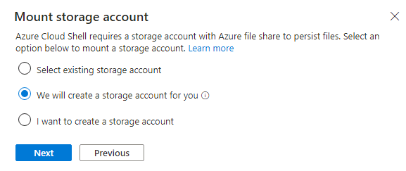

# Lab 04: Migrieren der Anwendungs-Datenbank aus on-premises Umgebung zu Azure

## Ziele

In diesem Lab verwenden wir die Cloud Adoption Framework
Adoption-Methodik, um on-premises Datenbanken mithilfe des Azure
Database Migration Service zu migrieren, um die SQL-Datenbank zu
migrieren. Azure Database Migration Service ist ein Tool, mit dem Sie
Ihre Datenbank-Migration zu Azure vereinfachen, leiten und
automatisieren können. Migrieren Sie Ihre Daten, Schemata und Objekte
einfach und skalierbar aus mehreren Quellen in die Cloud.

Ein Diagramm eines Cloud-Servers Beschreibung wird automatisch mit
mittlerer Zuverlässigkeit generiert

> **Hinweis**: Starten Sie Ihre virtuellen Maschinen, wenn Sie sie nach
> dem vorherigen Lab gestoppt haben.

## Übung 1: Migrieren von Microsoft SQL-Datenbank zu Azure SQL-Datenbank

### Aufgabe 1: Registrieren Sie den Microsoft.DataMigration-Ressourcenanbieter

Vor der Verwendung von Azure Database Migration Service muss der
Ressourcenanbieter **Microsoft.DataMigration** im Ziel-Abonnement
registriert werden.

1.  Öffnen Sie Azure Cloud Shell, indem Sie zu
    `https://shell.azure.com` navigieren. Melden Sie sich mit den
    Anmeldeinformationen Ihres Azure-Abonnements an, wenn Sie dazu
    aufgefordert werden, wählen Sie eine **PowerShell-Sitzung aus** ,
    und akzeptieren Sie alle Eingabeaufforderungen.

- 

  Ein Screenshot eines Computers Beschreibung wird automatisch generiert

2.  Wählen Sie im Fenster **Get started** die Option **Mount storage
    account** aus, wählen Sie dann das entsprechende Abonnement aus, und
    klicken Sie dann auf die **Apply** Schaltfläche.

- 

3.  Wählen Sie im Fenster **Mount storage account**, die Option **We
    will create a storage account for you**, und klicken Sie dann auf
    die Schaltfläche **Next**.

- 

4.  Warten Sie, bis die Bereitstellung abgeschlossen ist.

5.  Führen Sie den folgenden Befehl aus, um den Ressourcenanbieter
    **Microsoft.DataMigration** zu registrieren:

- `Register-AzResourceProvider -ProviderNamespace Microsoft.DataMigration`

  > **Hinweis**: Es kann einige Minuten dauern, bis sich der
  > Ressourcenanbieter registriert hat. Sie können mit der nächsten
  > Aufgabe fortfahren, ohne auf den Abschluss der Registrierung zu
  > warten. Sie werden den Ressourcenanbieter erst bei Aufgabe 3
  > verwenden.

  

  Ein Screenshot eines Computers Beschreibung wird automatisch generiert

6.  Sie können den Status überprüfen, indem Sie Folgendes ausführen:

- `Get-AzResourceProvider -ProviderNamespace Microsoft.DataMigration | Select-Object ProviderNamespace, RegistrationState, ResourceTypes`

  

  Ein Screenshot eines Computers Beschreibung wird automatisch generiert

Sie haben diese Aufgabe abgeschlossen. Schließen Sie keine Fenster und
fahren Sie mit der nächsten Aufgabe fort.

**Zusammenfassung der Aufgabe**

In dieser Aufgabe haben Sie den Ressourcenanbieter
**Microsoft.DataMigration** bei Ihrem Abonnement registriert. Dadurch
kann dieses Abonnement den Azure Database Migration Service verwenden.

### Aufgabe 2: Erstellen des Database Migration Service

In dieser Aufgabe erstellen Sie eine Azure Database Migration
Service-Ressource. Diese Ressource wird vom **Ressourcen-**Anbieter
**Microsoft.DataMigration** verwaltet, den Sie in Aufgabe 1 registriert
haben.

> **Hinweis**: Azure Database Migrate Service (DMS) erfordert
> Netzwerkzugriff auf Ihre on-premises Datenbank, um die zu
> übertragenden Daten abzurufen. Um diesen Zugriff zu erreichen, wird
> das DMS in einem Azure-VNet bereitgestellt. Anschließend sind Sie
> dafür verantwortlich, dieses VNet sicher mit Ihrer Datenbank zu
> verbinden, z. B. mithilfe einer Site-to-Site-VPN- oder
> ExpressRoute-Verbindung.

In diesem Lab wird die "on-premises" Umgebung von einem Hyper-V-Host
simuliert, der auf einer Azure-VM ausgeführt wird. Dies VM wird im VNet
"smarthotelvnet" bereitgestellt. Das DMS wird in einem separaten VNet
mit dem Namen "DMSVnet" bereitgestellt. Um die on-premises Verbindung zu
simulieren, wurden diese beiden VNets per Peering verbunden.

1.  Navigieren Sie zum **Azure-Portal**. Geben Sie im globalen Suchfeld
    `SmartHotelHost` ein, und wählen Sie dann den virtuellen Computer
    **SmartHotelHost**  aus.

- 

2.  Wählen Sie **Connect** aus, und wählen Sie aus der Dropdown-Liste
    die Option **Connect** aus.

- 

  Ein Screenshot eines Computers Beschreibung wird automatisch generiert

3.  Wählen Sie **Download RDP File** aus.

- 

  Ein Screenshot eines Computers Beschreibung wird automatisch generiert

4.  Klicken Sie auf die Schaltfläche **Keep** für die Benachrichtigung
    und dann auf **Open file**, um eine Verbindung herzustellen.

- 

  Ein Screenshot eines Computers Beschreibung wird automatisch generiert

5.  **Connect** `mit der virtuellen Maschine` mit dem Benutzernamen
    `demouser` und dem Passwort ` demo demo!pass123`

6.  Starten Sie **Chrome** über die Desktop-Verknüpfung.

7.  Navigieren Sie zum Azure-Portal`, ``https://portal.azure.com` suchen
    Sie nach `Azure database migration`, und wählen Sie dann aus der
    Dropdownliste **Azure Database Migration Services** aus.

- 

  Ein Screenshot eines Computers Beschreibung wird automatisch generiert

8.  Wählen Sie auf dem Schwert **Azure Database Migration Services**,
    die Option **+** **Create** aus.

- 

  Ein Screenshot eines Computers Beschreibung wird automatisch generiert

9.  Überprüfen Sie die Details auf der Seite **Select migration scenario
    and Database Migration Service**, und klicken Sie auf die
    Schaltfläche **Select** 

- 

  Ein Screenshot eines Computers Beschreibung wird automatisch generiert

10. Auf der Seite Create Data Migration Service, Registerkarte Basics,
    geben Sie die folgenden Details an.

    1.  Subscription – **Depth-@lab.CloudSubscription.Id**

    2.  Resource group: **SmartHotelRG**

    3.  Location – **West US**

    4.  Name: `SmartHotelDBMigration`

    5.  Klicken Sie auf **Review + create**

- 

  Ein Screenshot von data migration service Description automatisch
  erstellt

11. Klicken Sie auf der Registerkarte **Review + create** auf die
    Schaltfläche **Create**.

- 

  Ein Screenshot eines Computers Beschreibung wird automatisch generiert

12. Die Bereitstellung sollte in wenigen Sekunden abgeschlossen sein,
    klicken Sie auf die Schaltfläche **Go to resource**.

- 

  Ein Screenshot eines Computers Beschreibung wird automatisch generiert

7.  Wählen Sie unter Settings**,** die Option **Integration runtime**
    aus und klicken Sie dann auf **Configure integration runtime.**

- 

  Ein Screenshot eines Computers Beschreibung wird automatisch generiert

13. Klicken Sie auf den Link **Download and install the integration
    runtime** und laden Sie die Runtime auf die **SmartHotelHost** VM
    herunter

- 

  Ein Screenshot eines Computers Beschreibung wird automatisch generiert

14. Klicken Sie auf **Download**

- 

  Ein Screenshot eines Computers Beschreibung wird automatisch generiert

15. Wählen Sie die aktuellste Version aus und klicken Sie dann auf
    **Download**

- 

  Ein Screenshot eines Computers Beschreibung wird automatisch generiert

16. Installieren Sie nach dem Herunterladen, die Integration Runtime mit
    den Standardoptionen

- 

  Ein Screenshot eines Computers Beschreibung wird automatisch generiert

17. Der **Microsoft Integration runtime Configuration manager** sollte
    gestartet werden, wenn Sie auf die Schaltfläche **Finish** klicken .

18. Im Azure-Portal, auf der Registerkarte **Configure integration
    runtime** den Wert, kopieren Sie **Key 1** value

- 

  Ein Screenshot eines Computers Beschreibung wird automatisch generiert

19. Fügen Sie im **Microsoft Integration runtime Configuration manager**
    den kopierten Key ein und klicken Sie auf die Schaltfläche
    **Register** .

- 

  Ein Screenshot eines Computers Beschreibung wird automatisch generiert

20. Klicken Sie auf die Schaltfläche **Finish**.

- 

  Ein Screenshot eines Computers Beschreibung wird automatisch generiert

  

  Ein gelbes Rechteck mit schwarzem Text Beschreibung wird automatisch
  generiert

21. Sobald die Registrierung abgeschlossen ist, klicken Sie auf die
    Schaltfläche **Launch Configuration Manager**.

- 

  Ein Screenshot eines Computers Beschreibung wird automatisch generiert

22. Überprüfen Sie die Details im **Microsoft Integration runtime
    Configuration manager**

- 

  Ein Screenshot eines Computers Beschreibung wird automatisch generiert

23. Wechseln Sie zurück zum Azure-Portal, und klicken Sie auf der
    Registerkarte **Configure integration runtime** auf OK .

24. Der Status sollte für **Integration runtime** auf Online
    aktualisiert werden.

- 

  Ein Screenshot eines Computers Beschreibung wird automatisch generiert

### Aufgabe 3: Migrieren der on-premises SQL-Datenbank zu Azure SQL-Datenbank

1.  Wählen Sie auf der Seite Azure Database Migration service, die
    Option Overview aus, und klicken Sie dann auf der Registerkarte,
    Getting started, auf die Schaltfläche **New Migration**.

- 

  Ein Screenshot eines Computers Beschreibung wird automatisch generiert

2.  Geben Sie auf der Seite Select new migration scenario, die folgenden
    Details an

    1.  Source server type – **SQL Server**

    2.  Target server type – **Azure SQL Database**

- 

  Ein Screenshot eines Computers Beschreibung wird automatisch generiert

3.  Klicken Sie auf die Schaltfläche **Select** 

4.  Auf der Seite Azure SQL Database Offline Migration Wizard, geben Sie
    die folgenden Details auf der Registerkarte **Connect to source SQL
    Server** an .

    1.  Source server name: `192.168.0.6`

    2.  Authentication type: **SQL Authentication**

    3.  Username: `sa`

    4.  Password: `demo!pass``123`

    5.  Connection properties – **aktivieren Sie beide
        Kontrollkästchen**

- 

  Ein Screenshot einer automatisch generierten Login-Beschreibung

5.  Klicken Sie auf **Next: Select database for migration \>\>**

6.  Wählen Sie auf der Registerkarte **Select database for migration**,
    SmartHotel.Registration datenbank aus, und klicken Sie auf **Next:
    Connect to the target Azure SQL Database \>\>**

- 

  Ein Screenshot eines Computers Beschreibung wird automatisch generiert

8.  Auf der Registerkarte **Connect to the target Azure SQL
    Database** sollten alle Informationen bereits ausgefüllt sein, Sie
    können die Informationen überprüfen, dann das Kennwort eingeben –
    `demo!pass123` und auf **Next: Map source and target databases
    \>\>**

- 

  Ein Screenshot eines Computers Beschreibung wird automatisch generiert

9.  Wählen Sie auf der Registerkarte **Map source and target
    databases** aus der Dropdown-Liste der Target database, die Option
    **smarthoteldb** aus und klicken Sie dann auf **Next: Select
    database tables to migrate \>\>**

- 

  Ein Screenshot eines Computers Beschreibung wird automatisch generiert

7.  Klicken Sie auf der Registerkarte **Select database tables to
    migrate**, auf das Dropdown-Menü **SmartHotel.Registration tables
    selected 2/2** und stellen Sie sicher, dass das Symbol
    \[dbo\].\[Bookings\] ist nur die Tabelle, die ausgewählt ist, und
    klicken Sie dann auf **Next: Database migration summary \>\>**

- 

  Ein Screenshot eines Computers Beschreibung wird automatisch generiert

8.  Überprüfen Sie auf der Registerkarte **Database migration summary**,
    die Details, und klicken Sie dann auf die Schaltfläche **Start
    migration** .

- 

  Ein Screenshot eines Computers Beschreibung wird automatisch generiert

9.  Der Migration status kann auf der Registerkarte
    **Migration** eingesehen werden

- 

  Ein Screenshot eines Computers Beschreibung wird automatisch generiert

  > **Hinweis: Die Migration dauert circa 10 Minuten**

  

  Ein Screenshot eines Computers Beschreibung wird automatisch generiert

10. Klicken Sie mehrmals auf die Schaltfläche **Refresh**, bis der
    Migrationsstatus auf **Succeeded** geändert wird.

- 

  Ein Screenshot eines Computers Beschreibung wird automatisch generiert

11. Klicken Sie auf Source name, **192.168.0.6**

- 

  Ein Screenshot eines Computers Beschreibung wird automatisch generiert

12. Überprüfen Sie die Details der Migration

- 

  Ein Screenshot eines Computers Beschreibung wird automatisch generiert

13. Wir haben on-premises SQL-Datenbank erfolgreich zu Azure
    SQL-Datenbank migriert.

### Zusammenfassung

In diesem Lab sollten wir mit Azure Database Migration service
gearbeitet und die erforderliche Integration Runtime auf der
**SmartHotelHost-VM** installiert haben, um die on-premises Datenbank
mithilfe des Database Migration Service (DMS) erfolgreich zu Azure
SQL-Datenbank migrieren zu können.

Ein Screenshot eines Computers Beschreibung wird automatisch generiert
