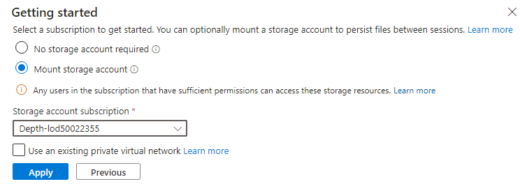

# 實驗 04 - 將應用程序數據庫從本地環境遷移到 Azure 

## 目的

在本實驗室中，我們將利用雲採用框架採用方法，使用 Azure
數據庫遷移服務遷移本地數據庫來遷移 SQL 數據庫。Azure
數據庫遷移服務是一種工具，可幫助你簡化、指導和自動化數據庫到 Azure
的遷移。輕鬆地將數據、架構和對象從多個來源大規模遷移到雲中。

以中等置信度自動生成的雲服務器描述

> **注意** 如果您在上一個實驗後停止了虛擬機，請啟動它們。

## 練習 1 - 將 Microsoft SQL 數據庫遷移到 Azure SQL 數據庫

### 任務 1：註冊 Microsoft.DataMigration 資源提供程序

在使用 Azure 數據庫遷移服務之前，必須在目標訂閱中註冊資源提供程序
**Microsoft.DataMigration**。

1.  導航到 https://shell.azure.com 打開 Azure Cloud
    Shell。如果系統提示，請使用 Azure 訂閱憑據登錄，選擇 PowerShell
    會話，並接受任何提示。

- 

  自動生成的計算機 Description 的屏幕截圖

2.  在 **Get started** （開始） 窗口中，選擇 **Mount storage account**
    （掛載存儲帳戶），然後選擇相應的訂閱，然後單擊 **Apply** （應用）
    按鈕。

- 

  替換文本

3.  在 **Mount storage account** （掛載存儲帳戶） 窗口中，選擇 **We will
    create a storage account for you**
    （我們將為您創建存儲帳戶），然後單擊 **Next** （下一步） 按鈕。

- 

  替換文本

4.  等待部署完成。

5.  執行以下命令，註冊 **Microsoft.DataMigration** 資源提供程序。

- `Register-AzResourceProvider -ProviderNamespace Microsoft.DataMigration`

  > **注意** 資源提供程序可能需要幾分鐘時間才能完成註冊。您可以繼續執行下一個任務，而無需等待註冊完成。在任務
  > 3 之前，您不會使用資源提供程序。

  

  自動生成的計算機 Description 的屏幕截圖

6.  您可以通過運行以下命令來檢查狀態：

- `Get-AzResourceProvider -ProviderNamespace Microsoft.DataMigration | Select-Object ProviderNamespace, RegistrationState, ResourceTypes`

  

  自動生成的計算機 Description 的屏幕截圖

您已完成此任務。請勿關閉任何窗口，請繼續執行下一個任務。

**任務摘要**

在此任務中，您向訂閱註冊了 **Microsoft.DataMigration**
資源提供程序。這使此訂閱能夠使用 Azure 數據庫遷移服務。

### 任務 2：創建 Database Migration Service 

在此任務中，您將創建一個 Azure 數據庫遷移服務資源。此資源由您在任務 1
中註冊的 **Microsoft.DataMigration 資源**提供程序管理。

> **注意** Azure Database Migrate 服務 （DMS）
> 需要對本地數據庫進行網絡訪問，以檢索要傳輸的數據。為了實現此訪問，DMS
> 將部署到 Azure VNet 中。然後，你負責將該 VNet
> 安全地連接到數據庫，例如，使用 Site-to-Site VPN 或 ExpressRoute 連接。

在本實驗中， “本地” 環境由在 Azure VM 中運行的 Hyper-V 主機模擬。此 VM
將部署到 “smarthotelvnet” VNet。DMS 將部署到名為“DMSVnet”的單獨
VNet。為了模擬本地連接，這兩個 VNet 已對等互連。

1.  導航到 **Azure 門戶**。在全域搜索框中，輸入 `SmartHotelHost`，然後選擇
    **SmartHotelHost** 虛擬機。

- 

2.  選擇 **Connect**，從下拉列表中選擇 **Connect**。

- 

  自動生成的計算機 Description 的屏幕截圖

3.  選擇 **Download RDP File**（下載 RDP 文件）。

- 

  自動生成的計算機 Description 的屏幕截圖

4.  單擊通知的 **Keep** 按鈕，然後單擊 **Open file** 進行連接。

- 

  自動生成的計算機 Description 的屏幕截圖

5.  使用用戶名 `demouser` 和密碼 `demo!pass123` **連接**到虛擬機

6.  從桌面快捷方式啟動 **Chrome**。

7.  導航到 Azure 門戶 `https://portal.azure.com` 搜索 `Azure
    Database Migration`，然後從下拉列表中選擇 **Azure Database Migration
    Services**。

- 

  自動生成的計算機 Description 的屏幕截圖

8.  在 “**Azure Database Migration Services**” 邊欄選項卡上，選擇“**+
    Create**” 。

- 

  自動生成的計算機 Description 的屏幕截圖

9.  在 **Select migration scenario and Database Migration Service**
    頁面上查看詳細信息，然後單擊 **Select** 按鈕

- 

  自動生成的計算機 Description 的屏幕截圖

10. 在 Create Data Migration Service （創建數據遷移服務） 頁面的 Basics
    （基本） 選項卡上，提供以下詳細信息。

    - 訂閱 – **Depth-@lab.CloudSubscription.Id**

    - 資源組：**SmartHotelRG**

    - 地點 – **West US**

    - 名稱：`SmartHotelDBMigration`

    - 單擊 **Review + create**

- 

  自動生成的數據遷移服務描述的屏幕截圖

11. 在 **Review + create** 選項卡上，單擊 **Create** 按鈕。

- 

  自動生成的計算機 Description 的屏幕截圖

12. Deployment 應該在幾秒鐘內完成，單擊 **Go to resource** 按鈕。

- 

  自動生成的計算機 Description 的屏幕截圖

13. 在 Settings 下選擇 **Integration Runtime**，然後單擊 **Configure
    integration runtime**。

- 

  自動生成的計算機 Description 的屏幕截圖

14. 單擊鏈接**Download and install the integration runtime**，然後在
    **SmartHotelHost** VM 上下載運行時

- 

  自動生成的計算機 Description 的屏幕截圖

15. 點擊 **Download**

- 

  自動生成的計算機 Description 的屏幕截圖

16. 選擇最新版本，然後單擊 **Download**

- 

  自動生成的計算機 Description 的屏幕截圖

17. 下載後，使用默認選項安裝 Integration runtime

- 

  自動生成的計算機 Description 的屏幕截圖

18. **Microsoft Integration Runtime Configuration Manager** 應在單擊
    **Finish** 按鈕時啟動。

19. 在 Azure 門戶的 “**Configure integration runtime**”
    選項卡中，複製“**Key 1**” 值

- 

  自動生成的計算機 Description 的屏幕截圖

20. 返回 **Microsoft Integration Runtime Configuration
    Manager**，粘貼複製的密鑰，然後單擊 **Register** 按鈕。

- 

  自動生成的計算機 Description 的屏幕截圖

21. 點擊 **Finish** 按鈕

- 

  A screenshot of a computer Description automatically generated

  

  自動生成帶有黑色文本 Description 的黃色矩形

22. 註冊完成後，單擊 **Launch Configuration Manager** 按鈕。

- 

  自動生成的計算機 Description 的屏幕截圖

23. 查看 **Microsoft Integration Runtime Configuration Manager**
    上的詳細信息

- 

  自動生成的計算機 Description 的屏幕截圖

24. 切換回 Azure 門戶，然後單擊 “**Configure integration runtime**”
    選項卡上的 “Ok” 。

25. 對於 **Integration runtime**，Status （狀態） 應更新為 Online
    （連線）

- 

  自動生成的計算機 Description 的屏幕截圖

### 任務 3：將本地 SQL 數據庫遷移到 Azure SQL 數據庫

1.  仍在 Azure
    數據庫遷移服務頁面上時，選擇“概述”，然後單擊“入門”選項卡下的“**New
    Migration**”按鈕。

- 

  自動生成的計算機 Description 的屏幕截圖

2.  在 Select new migration scenario （選擇新的遷移方案）
    頁面上，提供以下詳細信息

    - 源服務器類型 – **SQL Server**

    - 目標服務器類型 – **Azure SQL Database**

- 

  自動生成的計算機 Description 的屏幕截圖

3.  點擊 **Select** 按鈕

4.  在 Azure SQL 數據庫離線遷移嚮導頁面上，在**連接到源 SQL Server**
    選項卡上提供以下詳細信息。

    - 源服務器名稱：`192.168.0.6`

    - 身份驗證類型：**SQL Authentication**

    - 用戶名：`sa`

    - 密碼：`demo!pass123`

    - 連接屬性 – **啟用兩個複選框**

- 

  自動生成的登錄 Description 的屏幕截圖

5.  單擊 **Next: Select database for migration \>\>**

6.  在 **Select database for migration** 選項卡上，選擇
    SmartHotel.Registration 數據庫，然後單擊 **Next: Connect to the
    target Azure SQL Database \>\>**

- 

  自動生成的計算機 Description 的屏幕截圖

7.  在 “**Connect to the target Azure SQL Database**”
    選項卡上，所有信息都應該已填充，您可以查看信息，然後提供密碼 –
    `demo!pass123` 並單擊 **Next: Map source and target databases \>\>**

- 

  自動生成的計算機 Description 的屏幕截圖

8.  在 **Map source and target databases** 選項卡上，從 目標數據庫
    的下拉列表中選擇 **smarthoteldb**，然後單擊 **Next: Select database
    tables to migrate \>\>**

- 

  自動生成的計算機 描述的屏幕截圖

9.  在 **Select database tables to migrate** 選項卡上，單擊下拉菜單
    **SmartHotel.Registration tables selected 2/2** 並確保
    \[dbo\]。\[Bookings\] 只是所選的表，然後單擊 **Next: Database
    migration summary \>\>**

- 

  自動生成的計算機 Description 的屏幕截圖

10. 在 **Database migration summary** （數據庫遷移摘要）
    選項卡上，查看詳細信息，然後單擊 **Start migration** （開始遷移）
    按鈕。

- 

  自動生成的計算機 Description 的屏幕截圖

11. 的 Migration status（遷移狀態）可以在 **Migration** 選項卡下看到

- 

  自動生成的計算機 描述的屏幕截圖

  > **注意：遷移大約需要 10 分鐘**

  

  自動生成的計算機 描述的屏幕截圖

12. 單擊 **Refresh** 按鈕幾次，直到 Migration status（遷移狀態）更改為
    **Succeeded**（成功）。

- 

  自動生成的計算機 描述的屏幕截圖

13. 單擊 Source name （源名稱）， **192.168.0.6**

- 

  自動生成的計算機 描述的屏幕截圖

14. 查看遷移的詳細信息

- 

  自動生成的計算機 描述的屏幕截圖

15. 我們已成功將本地 SQL 數據庫遷移到 Azure SQL 數據庫。

### 總結

在本實驗中，我們應該使用 Azure 數據庫遷移服務，並在 **SmartHotelHost**
VM 上安裝所需的集成運行時，以便能夠使用數據庫遷移服務 （**DMS**）
將本地數據庫成功遷移到 Azure SQL 數據庫。

自動生成的計算機 描述的屏幕截圖
