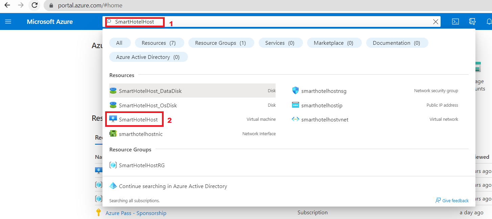

# Lab 04 - Migrazione del database dell'applicazione dall'ambiente locale ad Azure

## Obiettivo

In questo lab utilizzeremo la metodologia di adozione di Cloud Adoption
Framework per eseguire la migrazione di database locali utilizzando il
servizio Migrazione del database di Azure per eseguire la migrazione del
database SQL. Il Servizio Migrazione del database di Azure è uno
strumento che consente di semplificare, guidare e automatizzare la
migrazione del database ad Azure. Esegui facilmente la migrazione di
data, schemi e oggetti da più origini al cloud su larga scala.

Un diagramma di un server cloud Descrizione generata automaticamente con
media confidenza

> **Nota**: Avviare le macchine virtuali se sono state arrestate dopo il
> lab precedente.

## Esercizio 1 - Migrazione del database Microsoft SQL al database SQL di Azure

### Attività 1: Registrare il provider di risorse Microsoft.DataMigration

Prima di usare il Servizio Migrazione del database di Azure, il provider
di risorse **Microsoft.DataMigration** deve essere registrato nella
sottoscrizione di destinazione.

1.  Aprire Azure Cloud Shell passando a `https://shell.azure.com`.
    Accedere usando le credenziali della sottoscrizione di Azure, se
    richiesto, selezionare una sessione di **PowerShell** e accettare le
    richieste.

- 

  Uno screenshot di un computer Descrizione generata automaticamente

2.  Nella finestra **Get started**, selezionare **Mount storage
    account**, quindi selezionare la sottoscrizione appropriata e fare
    clic sul pulsante **Apply**.

- 

  Testo alternativo

3.  Nella finestra **Mount storage account** selezionare **We will
    create a storage account for you**, quindi fare clic sul pulsante
    **Next**.

- 

  Testo alternativo

4.  Attendere il completamento della distribuzione.

5.  Eseguire il comando seguente per registrare il provider di risorse
    **Microsoft.DataMigration**:

- `Register-``AzResourceProvider`` -``ProviderNamespace`` ``Microsoft.DataMigration`

  > **Nota**: la registrazione del provider di risorse potrebbe
  > richiedere alcuni minuti. È possibile procedere all'attività
  > successiva senza attendere il completamento della registrazione. Non
  > si utilizzerà il provider di risorse fino all'attività 3.

  

  Uno screenshot di un computer Descrizione generata automaticamente

6.  È possibile controllare lo stato eseguendo:

- `Get-``AzResourceProvider`` -``ProviderNamespace`` ``Microsoft.DataMigration`` | Select-Object ProviderNamespace, RegistrationState, ResourceTypes`

  

  Uno screenshot di un computer Descrizione generata automaticamente

L'attività è stata completata. Non chiudere alcuna finestra e procedi
con l'attività successiva.

**Riepilogo delle attività**

In questa attività è stato registrato il provider di risorse
**Microsoft.DataMigration** con la sottoscrizione. In questo modo questa
sottoscrizione può usare il Servizio Migrazione del database di Azure.

### Attività 2: Creare il servizio Migrazione del database

In questa attività verrà creata una risorsa del Servizio Migrazione del
database di Azure. Questa risorsa è gestita dal provider di risorse
**Microsoft.DataMigration** registrato nell'attività 1.

> **Nota**: il servizio Migrazione del database di Azure richiede
> l'accesso di rete al database locale per recuperare i data da
> trasferire. Per ottenere questo accesso, il servizio Migrazione del
> database viene distribuito in una rete virtuale di Azure. L'utente è
> quindi responsabile della connessione sicura della rete virtuale al
> database, ad esempio usando una connessione VPN da sito a sito o
> ExpressRoute.

In questo lab l'ambiente "locale" viene simulato da un host Hyper-V in
esecuzione in una macchina virtuale di Azure. Questa macchina virtuale
viene distribuita nella rete virtuale 'smarthotelvnet'. Il servizio di
migrazione del database verrà distribuito in una rete virtuale separata
denominata "DMSVnet". Per simulare la connessione locale, è stato
eseguito il peering di queste due reti virtuali.

1.  Passare al **Azure portal**. Nella casella di ricerca globale
    immettere `SmartHotelHost,`quindi selezionare la macchina virtuale
    **SmartHotelHost.**

- 

2.  Seleziona **Connect**, scegli **Connect** dal menu a discesa.

- 

  Uno screenshot di un computer Descrizione generata automaticamente

3.  Selezionare **Download RDP File**.

- 

  Uno screenshot di un computer Descrizione generata automaticamente

4.  Fare clic sul pulsante **Keep** per la notifica, quindi fare clic su
    **Open file** per connettersi.

- 

  Uno screenshot di un computer Descrizione generata automaticamente

5.  **Connect** alla macchina virtuale utilizzando username `demouser` e
    password `demo!pass123`

6.  Avvia **Chrome** dal collegamento sul desktop.

7.  Passare al portale di Azure `https://portal.azure.com` cercare
    `Migrazione del database di Azure` e quindi selezionare **Azure
    Database Migration Services** dall'elenco a discesa.

- 

  Uno screenshot di un computer Descrizione generata automaticamente

8.  Nel pannello **Azure Database Migration Services** selezionare +
    **Create**.

- 

  Uno screenshot di un computer Descrizione generata automaticamente

9.  Esaminare i dettagli nella pagina **Select migration scenario and
    Database Migration service** e fare clic sul pulsante **Select**

- 

  Uno screenshot di un computer Descrizione generata automaticamente

10. Nella pagina Crea servizio migrazione data, scheda Informazioni di
    base, specificare i dettagli seguenti.

    - Subscription – **Depth-@lab.CloudSubscription.Id**

    - Resource group: **SmartHotelRG**

    - Location– **West US**

    - Name: `SmartHotelDBMigration`

    - Clicca su **Review + create**

- 

  Uno screenshot di un servizio di migrazione dei data Descrizione
  generata automaticamente

11. Nella scheda **Review + create**, fai clic sul pulsante **Create**.

- 

  Uno screenshot di un computer Descrizione generata automaticamente

12. La distribuzione dovrebbe essere completata in pochi secondi, fare
    clic sul pulsante **Go to resource**.

- 

  Uno screenshot di un computer Descrizione generata automaticamente

13. Seleziona **Integration runtime** in Impostazioni, quindi fai clic
    su **Configure integration runtime.**

- 

  Uno screenshot di un computer Descrizione generata automaticamente

14. Clicca sul link **Download and install the integration runtime** e
    scarica il runtime sulla VM **SmartHotelHost**

- 

  Uno screenshot di un computer Descrizione generata automaticamente

15. Clicca sul pulsante **Download**

- 

  Uno screenshot di un computer Descrizione generata automaticamente

16. Scegli la versione più recente e clicca su **Download**

- 

  Uno screenshot di un computer Descrizione generata automaticamente

17. Una volta scaricato, installa il runtime di integrazione con le
    opzioni predefinite

- 

  Uno screenshot di un computer Descrizione generata automaticamente

18. Il **Microsoft Integration runtime Configuration manager** dovrebbe
    essere avviato dopo aver fatto clic sul pulsante **Finish**.

19. Dal portale di Azure, scheda **Configure integration runtime**
    copiare il valore **Key 1**

- 

  Uno screenshot di un computer Descrizione generata automaticamente

20. Torna al **Microsoft Integration runtime Configuration manager**,
    incolla la chiave copiata e fai clic sul pulsante **Register**.

- 

  Uno screenshot di un computer Descrizione generata automaticamente

21. Fare clic sul pulsante **Finish**

- 

  Uno screenshot di un computer Descrizione generata automaticamente

  

  Un rettangolo giallo con testo nero Descrizione generata
  automaticamente

22. Una volta completata la registrazione, fare clic sul pulsante
    **Launch Configuration Manager**.

- 

  Uno screenshot di un computer Descrizione generata automaticamente

23. Esaminare i dettagli in **Microsoft Integration runtime
    Configuration manager**

- 

  Uno screenshot di un computer Descrizione generata automaticamente

24. Tornare al portale di Azure e fare clic su OK nella scheda
    **Configure integration runtime**.

25. Lo stato deve essere aggiornato a Online per il **Integration
    runtime**

- 

  Uno screenshot di un computer Descrizione generata automaticamente

### Attività 3: Eseguire la migrazione del database SQL locale al database SQL di Azure

1.  Nella pagina del servizio Migrazione del database di Azure,
    selezionare Panoramica e quindi fare clic sul pulsante **New
    Migration** nella scheda Introduzione.

- 

  Uno screenshot di un computer Descrizione generata automaticamente

2.  Nella pagina Selezione nuovo scenario di migrazione specificare i
    dettagli seguenti

    - Source server type - **SQL Server**

    - Target server type: **Azure SQL database**

- 

  Uno screenshot di un computer Descrizione generata automaticamente

3.  Fare clic sul pulsante **Select**

4.  Nella pagina Migrazione guidata offline del database SQL di Azure
    specificare i dettagli seguenti nella scheda **Connect to source SQL
    Server**.

    - Source server name: `192.168.0.6`

    - Autentication type : **SQL** **Autentication**

    - Username: `sa`

    - Password: `demo!pass``123`

    - Connection properties: **attivare entrambe le caselle di
      controllo**

- 

  Uno screenshot di un login Descrizione generata automaticamente

5.  Fare clic su **Next: Select database for migration\>\>**

6.  Nella scheda **Select database for migration** selezionare il
    database SmartHotel.Registration e fare clic su **Next: Connect to
    the target Azure SQL Database \>\>**

- 

  Uno screenshot di un computer Descrizione generata automaticamente

7.  Nella scheda **Connect to the target Azure SQL Database** tutte le
    informazioni dovrebbero essere già popolate, è possibile esaminare
    le informazioni, quindi fornire la password - `demo!pass123` e fare
    clic su **Next: Map source and target databases \>\>**

- 

  Uno screenshot di un computer Descrizione generata automaticamente

8.  Nella scheda **Map source and target databases**, dal menu a discesa
    di Database di destinazione selezionare **smarthoteldb** e quindi
    fare clic su **Next: Select database tables to migrate \>\>**

- 

  Uno screenshot di un computer Descrizione generata automaticamente

9.  Nella scheda **Select database tables to migrate** , fare clic sul
    menu a discesa **SmartHotel.Registration tables selected 2/2** e
    assicurarsi che il \[dbo\].\[ Prenotazioni\] è solo la tabella
    selezionata e quindi fare clic su **Next: Database migration summary
    \>\>**

- 

  Uno screenshot di un computer Descrizione generata automaticamente

10. Nella scheda **Database migration summary** esaminare i dettagli e
    quindi fare clic sul pulsante **Start migration**.

- 

  Uno screenshot di un computer Descrizione generata automaticamente

11. Lo stato della migrazione può essere visualizzato nella scheda
    **Migration**

- 

  Uno screenshot di un computer Descrizione generata automaticamente

  > **Nota: la migrazione richiederà circa 10 minuti**

  

  Uno screenshot di un computer Descrizione generata automaticamente

12. Fare clic sul pulsante **Refresh** un paio di volte, fino a quando
    lo stato della migrazione non è cambiato in **Succeeded**.

- 

  Uno screenshot di un computer Descrizione generata automaticamente

13. Fare clic sul nome della fonte, **192.168.0.6**

- 

  Uno screenshot di un computer Descrizione generata automaticamente

14. Esamina i dettagli della migrazione

- 

  Uno screenshot di un computer Descrizione generata automaticamente

15. È stata eseguita correttamente la migrazione del database SQL locale
    al database SQL di Azure.

### Sommario

In questo lab è necessario aver lavorato con il servizio Migrazione del
database di Azure e installare il runtime di integrazione necessario
nella macchina virtuale **SmartHotelHost** per poter eseguire
correttamente la migrazione del database locale al database SQL di Azure
utilizzando il servizio Migrazione del database (**DMS**).

Uno screenshot di un computer Descrizione generata automaticamente
