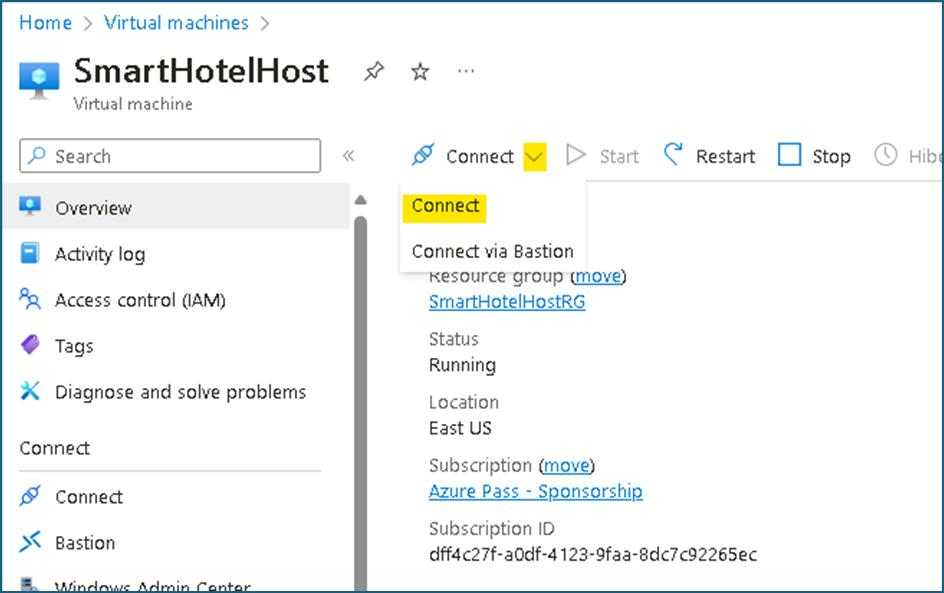
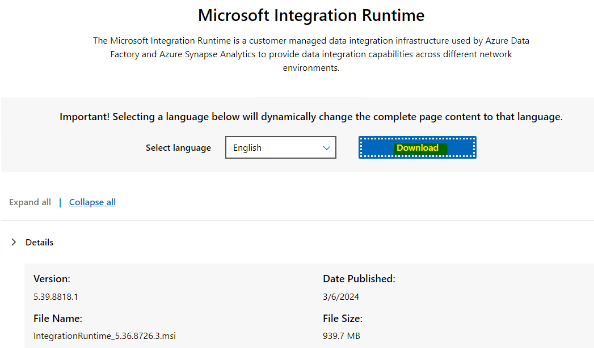
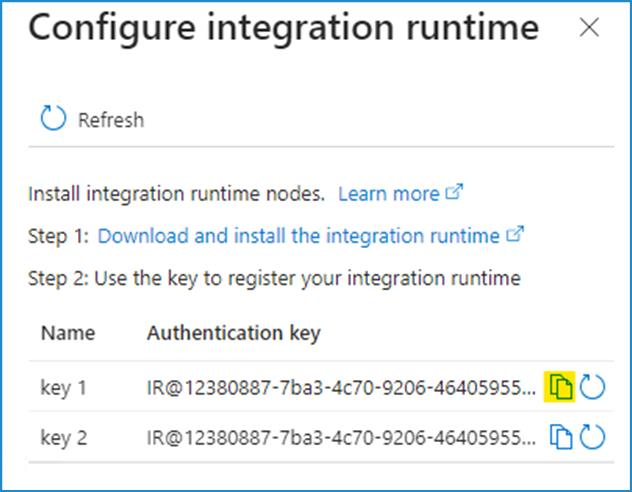
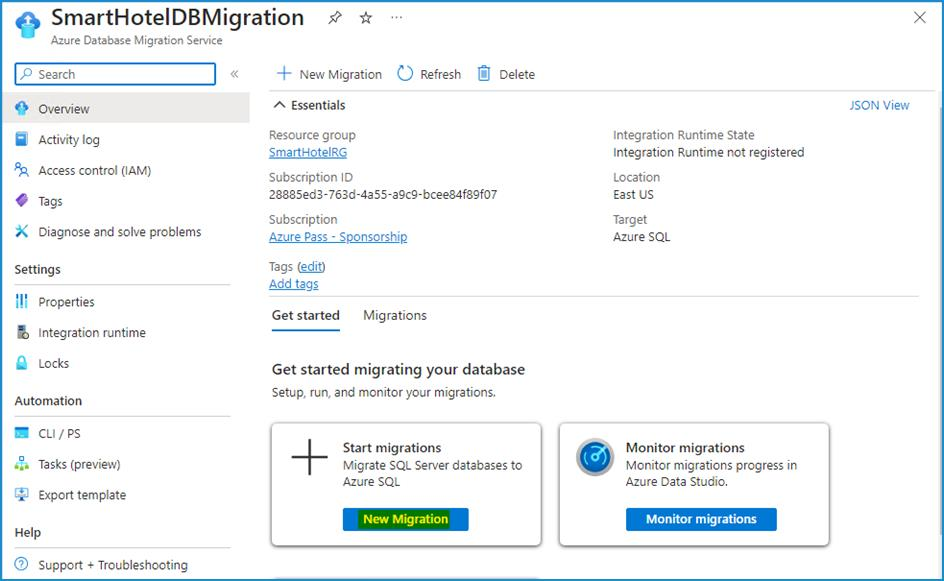
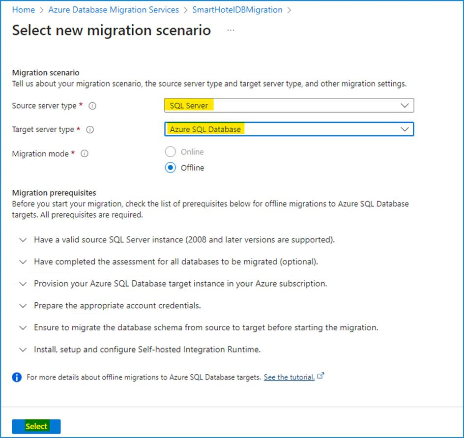
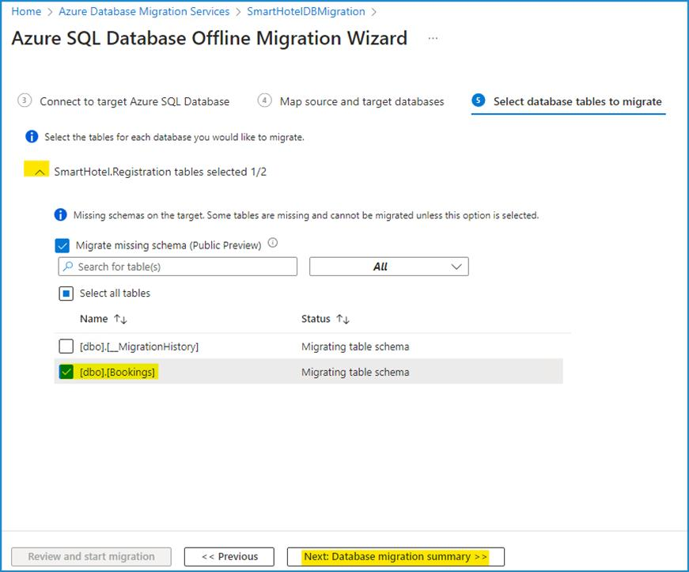
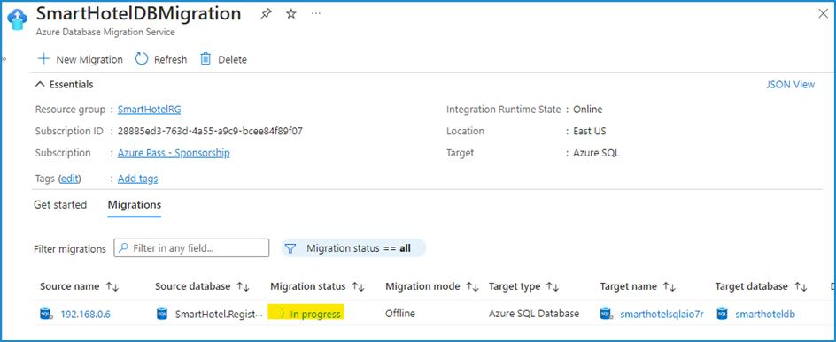

# ラボ04：on-premises環境から Azure へのアプリケーション データベースの移行

## 目的

このラボでは、クラウド導入フレームワークの導入手法を活用し、on-premisesデータベースをAzure
Database Migration Serviceを使用して移行します。Azure Database Migration
Serviceは、Azureへのデータベース移行を簡素化、ガイド、自動化するツールです。複数のソースからクラウドへ、データ、スキーマ、オブジェクトを大規模かつ簡単に移行できます。

> **注意：** 前のラボの後に仮想マシンを停止した場合は、仮想マシンを起動してください。

## 演習 1 - Microsoft SQL データベースから Azure SQL データベースへ移行する

### タスク１：Microsoft.DataMigration リソース プロバイダーを登録する

Azure Database Migration Service を使用する前に、リソース
プロバイダー**Microsoft.DataMigration**をターゲット
サブスクリプションに登録する必要があります。

1.  `https://shell.azure.com`に移動して、Azure Cloud Shell
    を開きます。要求された場合、Azure
    サブスクリプションの資格情報を使用してログインし、**PowerShell**セッションを選択して、プロンプトを受け入れます。

    

  

2.  **Get started**ウィンドウで**Mount storage
    account**を選択し、適切なサブスクリプションを選択して**Apply**ボタンをクリックします。

    

3.  **Mount storage account**ウィンドウで、**We will create a storage
    account for you**を選択し、**Next**ボタンをクリックします。

    

4.  デプロイメントが完了するまで待ちます。

5.  次のコマンドを実行して、 **Microsoft.DataMigration**リソース
    プロバイダーを登録します:

     `Register-AzResourceProvider -ProviderNamespace Microsoft.DataMigration`

    > **注意**-
    > 貼り付けが**^V**と表示される場合は、コマンドを手動でコピーして  
    > 貼り付けます。

    > **注意：** リソースプロバイダーの登録には数分かかる場合があります。登録が完了するまで待たずに次のタスクに進むことができます。リソースプロバイダーはタスク3まで使用しません。

    

  

6.  次のコマンドを実行してステータスを確認できます。

    `Get-AzResourceProvider -ProviderNamespace Microsoft.DataMigration | Select-Object ProviderNamespace, RegistrationState, ResourceTypes`

    

    > **注意**-
    > 貼り付けが**^V**と表示される場合は、コマンドを手動でコピーして  
    > 貼り付けます。  

このタスクは完了しました。ウィンドウを閉じずに次のタスクに進んでください。

**タスクの概要**

このタスクでは、
**Microsoft.DataMigration** リソースプロバイダーをサブスクリプションに登録しました。これにより、このサブスクリプションで
Azure Database Migration Service を使用できるようになります。

### タスク２：データベース移行サービスを作成する

このタスクでは、Azure Database Migration Service
リソースを作成します。このリソースは、タスク 1
で登録した**Microsoft.DataMigration
resource**プロバイダーによって管理されます。

> **注意：** Azure Database Migrate Service (DMS)
> は、転送するデータを取得するために、on-premises
> データベースへのネットワーク
> アクセスを必要とします。このアクセスを実現するために、DMS は Azure
> VNet にデプロイされます。その後、Site-to-Site VPNや ExpressRoute
> 接続などを使用して、その VNet
> をデータベースに安全に接続する責任はお客様にあります。

このラボでは、Azure VM 上で稼働する Hyper-V
ホストによって「on-premises」環境をシミュレートします。この VM
は「smarthotelvnet」VNet にデプロイされます。DMS は「DMSVnet」という別の
VNet にデプロイされます。on-premises接続をシミュレートするため、これら 2
つの VNet はピアリングされています。

1.  **Azure
    portal**に移動します。グローバル検索ボックスに`SmartHotelHost`と入力し、 `**SmartHotelHost**仮想マシンを選択します。

    

2.  **Connect**を選択し、ドロップダウンから**Connect**を選択します。

    

  

3.  **Download RDP File**を選択します。

    

  

4.  通知の**Keep**ボタンをクリックし、**Open
    file**をクリックして接続します。

    

  

5.  `demouser`とパスワード`demo!pass123`を使用して仮想マシンに **Connect** します。

6.  デスクトップショートカットから**Chrome**を起動します。

7.  Azure
    ポータル `https://portal.azure.com` に移動し、`Azure database migration` を検索して、ドロップダウン
    リストから**Azure Database Migration Services**を選択します。

    

  

8.  **Azure Database Migration
    Services**ブレードで、+ **Create**を選択します。

    

  

9.  **Select migration scenario and Database Migration
    Service**ページで詳細を確認し、**Select**ボタンをクリックします。

    

  

10. データ移行サービスの作成ページのBasicsタブで、以下の詳細を入力します。

    - サブスクリプション – **Depth-@lab.CloudSubscription.Id**

    - リソース グループ: **SmartHotelRG**

    - 場所 –**West US**

    - 名前: `SmartHotelDBMigration`

    - **Review + create**をクリック

    

  データ移行サービスのスクリーンショット 自動生成された説明。

11. **Review + create**タブで、**Create**ボタンをクリックします。

    

  

12. デプロイメントは数秒で完了します。**Go to
    resource**ボタンをクリックします。

    

  

13. **Integration runtime**を選択し、**Configure integration
    runtime**をクリックします。

    

  

14. **Download and install the integration runtime**リンクをクリックし、
    **SmartHotelHost VM**にランタイムをダウンロードします。

    

  

15. **Download**をクリックしてください。

    

16. 最新バージョンを選択し、**Download**をクリックします。

    

  

17. ダウンロードしたら、デフォルトのオプションで統合ランタイムをインストールします。

    

  コンピュータのスクリーンショット 説明は自動的に生成されました

18. **Finish**ボタンをクリックすると、**Microsoft Integration runtime
    Configuration manager**が起動します。

19. Azureポータルの**Configure integration runtime**タブから、**Key
    1**の値をコピーします。

    

  

20. **Microsoft Integration runtime Configuration
    manager**に戻り、コピーしたキーを貼り付けて、**Register**ボタンをクリックします。

    

  

21. **Finish**ボタンをクリックします。

    

  

  

  黒いテキストが入った黄色の四角形 説明は自動的に生成されます。

22. 登録が完了したら、**Launch Configuration
    Manager**ボタンをクリックします。

    

  

23. **Microsoft Integration runtime Configuration
    manager**の詳細を確認します。

    

  

24. Azure ポータルに戻り、**Configure integration
    runtime**タブでOKをクリックします。

25. **Integration
    runtime**のステータスがオンラインに更新される必要があります。

    

  

### タスク３：on-premisesの SQL データベースを Azure SQL データベースに移行する

1.  Azure Database Migration サービス
    ページで概要を選択し、開始タブの**New
    Migration**ボタンをクリックします。

    

  

2.  新しい移行シナリオの選択ページで、以下の詳細を入力します。

    - ソースサーバーの種類 – **SQL Server**

    - ターゲット サーバーの種類 – **Azure SQL Database**

    

  コンピュータのスクリーンショット 説明は自動的に生成されました

3.  **Select**ボタンをクリックします

4. Azure SQL Database Offline Migration
    Wizardウィザードページで、**Source  
    details** タブに以下の詳細を入力します。

    - Is your source SQL server instance tracked in Azure? - **No**

    - Source Infrastructure Type: **Hyper-V**

    - Subscription – keep the default selected.

    - Resource group: **SmartHotelHostRG**

    - Location: **West US**

    - SQL Server Instance Name: `192.168.0.6`

    

    > **注意**:
    > 以下の通知が表示された場合は、無視して次の手順に進むことが  
    > できます。

      

4.  Azure SQL データベース オフライン移行ウィザードのページで、**Connect
    to source SQL Server**タブに以下の詳細を入力します。

    - ソースサーバー名: `192.168.0.6`

    - 認証タイプ: **SQL Authentication**

    - ユーザー名: `sa`

    - パスワード: `demo!pass123`

    - Connection properties – –**両方のチェックボックスをオンにする**

    

5.  **Next: Select database for migration \>\>** をクリックします。

6.  **Select database for migration**タブで、SmartHotel.Registration
    データベースを選択し、**Next: Connect to the target Azure SQL
    Database \>\>** をクリックします。

    

  

7.  **Connect to the target Azure SQL
    Database**タブには、すべての情報がすでに入力されているはずです。情報を確認し、パスワード
    ( `demo!pass123` )を入力`して、**Next: Map source and target databases
    \>\>** をクリックします。

    

  

8.  **Map source and target databases**タブで、ターゲット
    データベースのドロップダウンから**smarthoteldb**を選択し、**Next:
    Select database tables to migrate \>\>** をクリックします。

    

  

9.  **Select database tables to
    migrat**タブで、ドロップダウンの**SmartHotel.Registration
    テーブルtables selected 2/2**をクリックし、\[dbo\].\[Bookings\]
    のみが選択されていることを確認し、**Next: Database migration summary
    \>\>** をクリックします。

    

  

10. **Database migration summary**タブで詳細を確認し、**Start
    migration**ボタンをクリックします。

    

  

11. 移行ステータスは**Migration**タブで確認できます。

    
    

    > **注意***：**The Migration will take around 10 minutes**

  

12. 移行ステータスが**Succeeded**に変わるまで、**Refresh**ボタンを数回クリックします。

    

  

13. ソース名**192.168.0.6**をクリックします。

    

  

14. 移行の詳細を確認します。

    

  

15. on-premisesの SQL データベースをAzure
    SQLデータベースに正常に移行しました。

### まとめ

このラボでは、Azure Database Migration Service を操作し、
**SmartHotelHost** VM に必要な統合ランタイムをインストールして、Database
Migration Service ( **DMS** ) を使用してon-premises データベースを Azure
SQL Database に正常に移行できるようにする必要があります。

