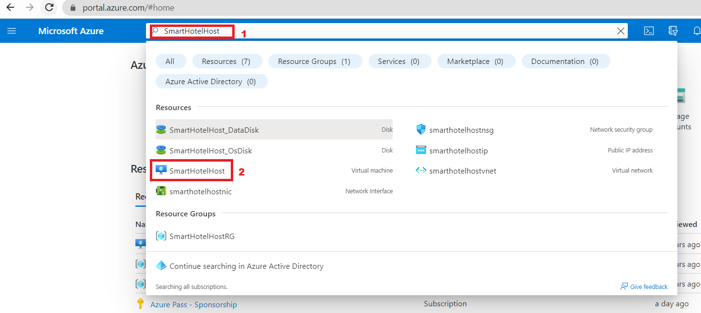

# 실습 04 - 온-프레미스 환경에서 Azure로 애플리케이션 데이터베이스 마이그레이션

## 목표

이 실습에서는 Cloud Adoption Framework 도입 방법론을 활용하여 Azure
Database Migration Service를 통해 온프레미스 데이터베이스를
마이그레이션하고 SQL 데이터베이스를 마이그레이션합니다. Azure Database
Migration Service는 Azure로의 데이터베이스 마이그레이션을 간소화, 안내
및 자동화하는 데 도움이 되는 도구입니다. 여러 소스의 데이터, 스키마 및
개체를 대규모 클라우드로 쉽게 마이그레이션할 수 있습니다.

클라우드 서버 설명 다이어그램은 중간 신뢰도로 자동 생성됨

> **참고**: 이전 실습 이후 가상 머신을 중지한 경우 다시 시작합니다.

## 연습 1 - Microsoft SQL 데이터베이스를 Azure SQL 데이터베이스로 마이그레이션

### 작업 1: Microsoft.DataMigration 리소스 공급자 등록

Azure Database Migration Service를 사용하기 전에 리소스 공급자
**Microsoft.DataMigration**을 대상 구독에 등록해야 합니다.

1.  `https://shell.azure.com` 으로 이동하여 Azure Cloud Shell을 엽니다.
    메시지가 표시되면 Azure 구독 자격 증명을 사용하여 로그인하고,
    **PowerShell** 세션을 선택한 후 모든 메시지에 동의합니다.

- 

  컴퓨터 설명 스크린샷이 자동으로 생성

2.  **Get started** 창에서 **Mount storage account**를 선택한 후, 원하는
    구독을 선택하고 **Apply** 버튼을 클릭합니다.

- 

  alt text

3.  **Mount storage account** 창에서 **We will create a storage account
    for you**를 선택한 후 **Next**버튼을 클릭합니다.

- 

  alt text

4.  배포가 완료될 때까지 기다립니다.

5.  다음 명령을 실행하여 **Microsoft.DataMigration** 리소스 공급자를
    등록합니다:

- `Register-AzResourceProvider -ProviderNamespace Microsoft.DataMigration`

  > **참고**: 리소스 공급자를 등록하는 데 몇 분 정도 걸릴 수 있습니다.
  > 등록이 완료될 때까지 기다리지 않고 다음 작업으로 진행할 수 있습니다.
  > 작업 3까지는 리소스 공급자를 사용하지 않습니다.

  

  컴퓨터 설명의 스크린샷이 자동으로 생성되었습니다

6.  다음을 실행하여 상태를 확인할 수 있습니다:

- `Get-AzResourceProvider -ProviderNamespace Microsoft.DataMigration | Select-Object ProviderNamespace, RegistrationState, ResourceTypes`

  

  컴퓨터 설명 스크린샷이 자동으로 생성되었습니다.

이 작업을 완료했습니다. 창을 닫지 말고 다음 작업을 진행합니다.

**작업 요약**

이 작업에서는 **Microsoft.DataMigration** 리소스 공급자를 구독에
등록했습니다. 이를 통해 이 구독에서 Azure Database Migration Service를
사용할 수 있습니다.

### 작업 2: Database Migration Service 만들기

이 작업에서는 Azure Database Migration Service 리소스를 만듭니다. 이
리소스는 작업 1에서 등록한 **Microsoft.DataMigration** 리소스 공급자가
관리합니다.

> **참고**: Azure Database Migrate Service(DMS)는 전송할 데이터를
> 검색하기 위해 온-프레미스 데이터베이스에 대한 네트워크 액세스가
> 필요합니다. 이러한 액세스를 위해 DMS는 Azure VNet에 배포됩니다. 그런
> 다음 Site-to-Site VPN 또는 ExpressRoute 연결 등을 사용하여 해당 VNet을
> 데이터베이스에 안전하게 연결해야 합니다.

이 실습에서는 Azure VM에서 실행되는 Hyper-V host를 통해 '온-프레미스'
환경을 시뮬레이션합니다. 이 VM은 'smarthotelvnet' VNet에 배포됩니다.
DMS는 'DMSVnet'이라는 별도의 VNet에 배포됩니다. 온-프레미스 연결을
시뮬레이션하기 위해 두 VNet은 피어링되었습니다.

1.  **Azure Portal**로 이동합니다. 글로벌 검색 상자에
    `SmartHotelHost` 를 입력한 다음 SmartHotelHost 가상 머신을
    선택합니다.

- 

2.  **Connect**를 선택하고 드롭다운에서 **Connect**를 선택합니다.

- 

  컴퓨터 설명 스크린샷이 자동으로 생성

3.  **Download RDP File**를 선택합니다.

- 

  컴퓨터 설명 스크린샷이 자동으로 생성

4.  알림에서 **Keep** 버튼을 클릭한 다음 **Open file** 를 클릭하여
    연결합니다.

- 

  컴퓨터 설명 스크린샷이 자동으로 생성.

5.  사용자 이름 `demouser` 와 비밀번호 `demo!pass123` 을 사용하여 가상 머신에
    **연결합니다.**

6.  바탕 화면 바로 가기에서 **Chrome**을 실행합니다.

7.  Azure Portal(https://portal.azure.com)로 이동하여 Azure 데이터베이스
    마이그레이션을 검색한 다음 드롭다운 목록에서 **Azure Database
    Migration Services**를 선택합니다.

- 

  컴퓨터 설명의 스크린샷이 자동으로 생성

8.  **Azure Database Migration Services**블레이드에서 + **Create**를
    선택합니다.

- 

  컴퓨터 설명 스크린샷이 자동으로 생성

9.  **Select migration scenario and Database Migration Service**
    페이지에서 세부 정보를 검토하고 **Select** 버튼을 클릭합니다.

- 

  컴퓨터 설명 스크린샷이 자동으로 생성

10. Create Data Migration Service 페이지의 Basics 탭에서 아래 세부
    정보를 입력합니다.

    - Subscription – **Depth-@lab.CloudSubscription.Id**

    - Resource group: **SmartHotelRG**

    - Location – **West US**

    - Name: `SmartHotelDBMigration`

    - Click on **Review + create**

- 

  데이터 마이그레이션 서비스 설명의 스크린샷이 자동으로 생성

11. **Review + create** 탭에서 **Create** 버튼을 클릭합니다.

- 

  컴퓨터 설명 스크린샷이 자동으로 생성

12. 배포는 몇 초 안에 완료됩니다. **Go to resource**  버튼을 클릭합니다.

- 

  컴퓨터 설명 스크린샷이 자동으로 생성

13. 설정에서 **Integration runtime** 을 선택한 다음 **Configure
    integration runtime**을 클릭합니다.

- 

  컴퓨터 설명의 스크린샷이 자동으로 생성

14. **Download and install the integration runtime**  링크를 클릭하고
    **SmartHotelHost** VM에 런타임을 다운로드합니다.

- 

  컴퓨터 설명의 스크린샷이 자동으로 생성

15. **Download**를 클릭합니다.

- 

  컴퓨터 설명의 스크린샷이 자동으로 생성

16. 최신 버전을 선택하고 **Download**를 클릭합니다.

- 

  컴퓨터 설명의 스크린샷이 자동으로 생성

17. 다운로드가 완료되면 기본 옵션으로 Integration Runtime을 설치합니다.

- 

  컴퓨터 설명의 스크린샷이 자동으로 생성

18. **Finish**버튼을 클릭하면 **Microsoft Integration runtime
    Configuration manager** 가 시작됩니다.

19. Azure Portal에서 **Configure integration runtime**  탭을 클릭하고
    **Key 1** 값을 복사합니다.

- 

  컴퓨터 설명의 스크린샷이 자동으로 생성

20. **Microsoft Integration runtime Configuration manager**로 돌아가서
    복사한 키를 붙여넣고 **Register** 버튼을 클릭합니다.

- 

  컴퓨터 설명의 스크린샷이 자동으로 생성

21. **Finish** 버튼을 클릭합니다.

- 

  컴퓨터 설명의 스크린샷이 자동으로 생성

  

  검은색 텍스트가 있는 노란색 사각형 설명이 자동 생성

22. 등록이 완료되면 **Launch Configuration Manager** 버튼을 클릭합니다.

- 

  컴퓨터 설명의 스크린샷이 자동으로 생성

23. **Microsoft Integration runtime Configuration manager**에 대한 세부
    정보를 검토합니다.

- 

  컴퓨터 설명의 스크린샷이 자동으로 생성

24. Azure Portal로 돌아가서 **Configure integration runtime** 탭에서
    확인을 클릭합니다.

25. **Integration runtime**의 상태를 온라인으로 업데이트해야 합니다.

- 

  컴퓨터 설명의 스크린샷이 자동으로 생성

### 작업 3: 온-프레미스 SQL 데이터베이스를 Azure SQL 데이터베이스로 마이그레이션

1.  Azure Database Migration Service 페이지에서 Overview를 선택한 다음
    Getting started탭 아래에 있는 **New Migration**버튼을 클릭합니다.

- 

  컴퓨터 설명의 스크린샷이 자동으로 생성

2.  New migration 시나리오 선택 페이지에서 아래 세부 정보를 제공합니다.

    - Source server type – **SQL Server**

    - Target server type – **Azure SQL Database**

- 

  컴퓨터 설명의 스크린샷이 자동으로 생성

3.  **Select** 버튼을 클릭합니다.

4. Azure SQL Database 오프라인 마이그레이션 마법사 페이지에서Source details 탭에 아래 정보를 입력하세요.
    - Is your source SQL server instance tracked in Azure? - No
    - Source Infrastructure Type: **Hyper-V**
    - Subscription – 기본값 유지
    - 인증 유형: **SQL Authentication**
    - Resource group: **SmartHotelHostRG**
    - Location: **West US**
    - SQL Server Instance Name: **192.168.0.6**

    

4.  Azure SQL Database Offline Migration Wizard페이지에서 **Connect to
    source SQL Server** 탭에 아래 세부 정보를 입력합니다.

    - Source server name: `192.168.0.6`

    - Authentication type: **SQL Authentication**

    - Username: `sa`

    - Password: `demo!pass123`

    - Connection properties – **enable both check boxes**

- 

  로그인 설명 스크린샷이 자동으로 생성

5.  **Next: Select database for migration \>\>을 클릭합니다.**

6.  **Select database for migration**  탭에서 SmartHotel.Registration
    데이터베이스를 선택하고 **Next: Connect to the target Azure SQL
    Database \>\>**을 클릭합니다.

- 

  컴퓨터 설명의 스크린샷이 자동으로 생성

7.  **Connect to the target Azure SQL Database**  탭에서 모든 정보가
    이미 채워져 있어야 합니다. 정보를 검토한 다음 암호(demo!pass123)를
    입력하고 **Next: Map source and target databases \>\>**을
    클릭합니다.

- 

  컴퓨터 설명의 스크린샷이 자동으로 생성

8.  **Map source and target databases** 탭에서 대상 데이터베이스
    드롭다운에서 **smarthoteldb**를 선택한 다음 **Next: Select database
    tables to migrate \>\>**을 클릭합니다.

- 

  컴퓨터 설명의 스크린샷이 자동으로 생성

9.  **Select database tables to migrate** 탭에서
    **SmartHotel.Registration tables selected 2/2**드롭다운을 클릭하고
    \[dbo\].\[Bookings\]만 선택된 테이블인지 확인한 후 **Next: Database
    migration summary \>\>**을 클릭합니다.

- 

  컴퓨터 설명의 스크린샷이 자동으로 생성

10. **Database migration summary** 탭에서 세부 정보를 검토한 다음
    **Start migration**버튼을 클릭합니다.

- 

  컴퓨터 설명의 스크린샷이 자동으로 생성

11. 마이그레이션 상태는 **Migration**탭에서 확인할 수 있습니다.

- 

  컴퓨터 설명의 스크린샷이 자동으로 생성

  > **참고: 마이그레이션에는 약 10분이 소요됩니다.**

  

  컴퓨터 설명의 스크린샷이 자동으로 생성

12. 마이그레이션 상태가 **Succeeded**으로 바뀔 때까지 **Refresh**버튼을
    두 번 클릭합니다.

- 

  컴퓨터 설명의 스크린샷이 자동으로 생성

13. 소스 이름 **192.168.0.6**을 클릭합니다.

- 

  컴퓨터 설명의 스크린샷이 자동으로 생성

14. 마이그레이션 세부 정보를 검토합니다.

- 

  컴퓨터 설명의 스크린샷이 자동으로 생성

15. 온프레미스 SQL 데이터베이스를 Azure SQL Database로 성공적으로
    마이그레이션했습니다.

### 요약

이 실습에서는 Azure Database Migration Service를 사용하고
**SmartHotelHost** VM에 필요한 통합 런타임을 설치하여 Database Migration
Service(**DMS**)를 사용하여 온프레미스 데이터베이스를 Azure SQL
Database로 성공적으로 마이그레이션해야 합니다.

컴퓨터 설명의 스크린샷이 자동으로 생성
