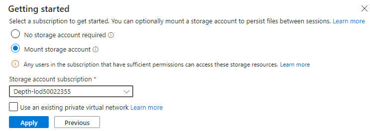
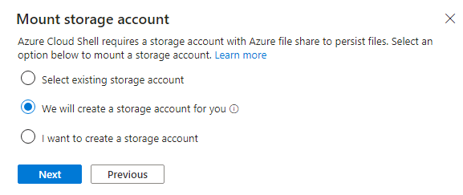

# Laboratório 04 - Migrando o banco de dados da aplicação do ambiente local para o Azure

## Objetivo

Neste laboratório, utilizaremos a metodologia Adopt do Cloud Adoption
Framework para migrar bancos de dados locais usando o Azure Database
Migration Service para migrar o Banco de Dados SQL. O Azure Database
Migration Service é uma ferramenta que ajuda a simplificar, orientar e
automatizar a migração de seu banco de dados para o Azure. Migre
facilmente seus dados, esquemas e objetos de várias fontes para a nuvem
em escala.

Um diagrama de um servidor em nuvem Descrição gerada automaticamente com
confiança média

> **Observação:** Inicie suas máquinas virtuais se você as tiver
> interrompido após o laboratório anterior.

## Exercício 1 - Migrando o banco de dados Microsoft SQL para o Banco de Dados SQL do Azure

### Tarefa 1: Registrar o provedor de recursos Microsoft.DataMigration

Antes de usar o Azure Database Migration Service, o provedor de recursos
**Microsoft.DataMigration** deve ser registrado na assinatura de
destino.

1.  Abra o Azure Cloud Shell acessando `https://shell.azure.com`. Efetue
    login usando suas credenciais de assinatura do Azure, se solicitado,
    selecione uma sessão do **PowerShell** e aceite os prompts.

- 

  Uma captura de tela de uma descrição de computador gerada
  automaticamente

2.  Na janela **Get started,** selecione **Mount storage account**,
    depois selecione a assinatura apropriada e clique no botão
    **Apply**.

- 

  texto alternativo

3.  Na janela **Mount storage account,** selecione **We will create a
    storage account for you** e depois clique no botão **Next**.

- 

  texto alternativo

4.  Aguarde a conclusão da implementação.

5.  Execute o seguinte comando para registrar o provedor de recursos
    **Microsoft.DataMigration**:

- `Register-AzResourceProvider -ProviderNamespace Microsoft.DataMigration`

  > **Observação:** O registro do provedor de recursos pode levar vários
  > minutos. Você pode prosseguir para a próxima tarefa sem esperar a
  > conclusão do registro. Você não usará o provedor de recursos até a
  > tarefa 3.

  

  Uma captura de tela de uma descrição de computador gerada
  automaticamente

6.  Você pode verificar o status executando:

- `Get-AzResourceProvider -ProviderNamespace Microsoft.DataMigration | Select-Object ProviderNamespace, RegistrationState, ResourceTypes`

  

  Uma captura de tela de uma descrição de computador gerada
  automaticamente

Você concluiu esta tarefa. Não feche nenhuma janela e prossiga para a
próxima tarefa.

**Resumo da tarefa**

Nesta tarefa, você registrou o provedor de recursos
**Microsoft.DataMigration** com sua assinatura. Isso permite que esta
assinatura use o Azure Database Migration Service.

### Tarefa 2: Criar o Database Migration Service

Nesta tarefa, você criará um recurso do Azure Database Migration
Service. Este recurso é gerenciado pelo provedor de **recursos
Microsoft.DataMigration**, que você registrou na tarefa 1.

> **Observação:** O Azure Database Migrate Service (DMS) requer acesso à
> rede do seu banco de dados local para recuperar os dados a serem
> transferidos. Para obter esse acesso, o DMS é implementado em uma VNet
> do Azure. Você é responsável por conectar essa VNet de forma segura ao
> seu banco de dados, por exemplo, usando uma VPN Site-to-Site ou uma
> conexão ExpressRoute.

Neste laboratório, o ambiente "local" é simulado por um Hyper-V host em
execução em uma VM do Azure. Essa VM é implementada na VNet
"smarthotelvnet". O DMS será implementado em uma VNet separada, chamada
"DMSVnet". Para simular a conexão local, essas duas VNets foram
pareadas.

1.  Navegue até o **Azure portal**. Na caixa de pesquisa global, digite
    `SmartHotelHost`` `e selecione a máquina virtual **SmartHotelHost.**

- 

2.  Selecione **Connect** e escolha **Connect** no menu suspenso.

- 

  Uma captura de tela de uma descrição de computador gerada
  automaticamente

3.  Selecione **Download RDP File**.

- 

  Uma captura de tela de uma descrição de computador gerada
  automaticamente

4.  Clique no botão **Keep** para receber a notificação e depois clique
    em **Open file** para conectar.

- 

  Uma captura de tela de uma descrição de computador gerada
  automaticamente

5.  **Connect** à máquina virtual usando o nome de usuário `demouser `e
    a senha `demo!pass123`

6.  Inicie o **Chrome** a partir do atalho no desktop.

7.  Navegue até o portal do Azure `https://portal.azure.com` procure
    por Migração de banco de dados do Azure e selecione `Azure
    Database Migration Services` na lista suspensa.

- 

  Uma captura de tela de uma descrição de computador gerada
  automaticamente

8.  No portal **Azure Database Migration Services**, selecione +
    **Create**.

- 

  Uma captura de tela de uma descrição de computador gerada
  automaticamente

9.  Revise os detalhes na página **Select migration scenario and
    Database Migration Service** e clique no botão **Select**

- 

  Uma captura de tela de uma descrição de computador gerada
  automaticamente

10. Na página Create Data Migration Service, aba Basics, forneça os
    detalhes abaixo.

    - Subscription – Depth-@lab.CloudSubscription.Id

    - Resource group: SmartHotelRG

    - Location – West US

    - Name: `SmartHotelDBMigration`

    - Click on Review + create

- 

  Uma captura de tela de um serviço de migração de dados de uma
  descrição de computador gerada automaticamente

11. Na aba **Review + create**, clique no botão **Create**.

- 

  Uma captura de tela de uma descrição de computador gerada
  automaticamente

12. A implementação deve ser concluída em poucos segundos, clique no
    botão **Go** **to resource**.

- 

  Uma captura de tela de uma descrição de computador gerada
  automaticamente

13. Selecione **Integration runtime** em Configurações e clique em
    **Configure integration runtime.**

- 

  Uma captura de tela de uma descrição de computador gerada
  automaticamente

14. Clique no link **Download and install the integration runtime** e
    baixe o runtime na VM **SmartHotelHost**

- 

  Uma captura de tela de uma descrição de computador gerada
  automaticamente

15. Clique em **Download**

- 

  Uma captura de tela de uma descrição de computador gerada
  automaticamente

16. Escolha a versão mais recente e clique em **Download**

- 

  Uma captura de tela de uma descrição de computador gerada
  automaticamente

17. Após o download, instale o Integration Runtime com as opções padrão

- 

  Uma captura de tela de uma descrição de computador gerada
  automaticamente

18. O **Microsoft Integration runtime Configuration manager** deve ser
    iniciado ao clicar no botão **Finish**.

19. No Portal do Azure, na aba **Configure integration runtime,** copie
    o valor da **Key 1**

- 

  Uma captura de tela de uma descrição de computador gerada
  automaticamente

20. De volta ao **Microsoft Integration runtime Configuration manager,**
    cole a chave copiada e clique no botão **Register**.

- 

  Uma captura de tela de uma descrição de computador gerada
  automaticamente

21. Clique no botão **Finish**

- 

  Uma captura de tela de uma descrição de computador gerada
  automaticamente

  

  Um retângulo amarelo com texto preto Descrição gerada automaticamente

22. Após a conclusão do registro, clique no botão **Launch Configuration
    Manager**.

- 

  Uma captura de tela de uma descrição de computador gerada
  automaticamente

23. Revise os detalhes no **Microsoft Integration runtime Configuration
    manager**

- 

  Uma captura de tela de uma descrição de computador gerada
  automaticamente

24. Retorne ao portal do Azure e clique em Ok na aba **Configure
    integration runtime**.

25. O status deve ser atualizado para Online para o **Integration
    runtime**

- 

  Uma captura de tela de uma descrição de computador gerada
  automaticamente

### Tarefa 3: Migrar o Banco de Dados SQL Local para o Banco de Dados SQL do Azure

1.  Ainda na página do Azure Database Migration Service, selecione
    Overview e clique no botão **New Migration** na guia Introdução.

- 

  Uma captura de tela de uma descrição de computador gerada
  automaticamente

2.  Na página Select new migration scenario, forneça os detalhes abaixo

    - Source server type – SQL Server

    - Target server type – Azure SQL Database

- 

  Uma captura de tela de uma descrição de computador gerada
  automaticamente

3.  Clique no botão **Select**

4. Na página do Azure SQL Database Offline Migration Wizard, forneça os seguintes detalhes na guia Source details. 

    - Is your source SQL server instance tracked in Azure? - **No** 
    - Source Infrastructure Type: **Hyper-V**
    - Subscription – **mantenha o padrão selecionado.** 
    - Authentication type: **SQL Authentication** 
    - Resource group: **SmartHotelHostRG** 
    - Location: **West US** 
    - SQL Server Instance Name: **192.168.0.6** 

    

4.  Na página Assistente de Migração Offline do Banco de Dados SQL do
    Azure, forneça os detalhes abaixo na aba **Connect to source SQL
    Server**.

    - Source server name: 192.168.0.6

    - Authentication type: SQL Authentication

    - Username: sa

    - Password: demo!pass123

    - Connection properties – enable both check boxes

- 

  Uma captura de tela de uma descrição de login gerada automaticamente

5.  Clique em **Next: Select database for migration \>\>**

6.  Na aba **Select database for migration**, selecione o banco de dados
    SmartHotel.Registration e clique em **Next: Connect to the target
    Azure SQL Database \>\>**

- 

  Uma captura de tela de uma descrição de computador gerada
  automaticamente

7.  Na aba **Connect to the target Azure SQL Database**, todas as
    informações já devem estar preenchidas. Você pode revisá-las,
    fornecer a senha – `demo!pass123` e clicar em **Next: Map source
    and target databases \>\>**

- 

  Uma captura de tela de uma descrição de computador gerada
  automaticamente

8.  Na aba **Map source and target databases**, no menu suspenso Banco
    de dados de destino, selecione **smarthoteldb** e clique em **Next:
    Select database tables to migrate \>\>**

- 

  Uma captura de tela de uma descrição de computador gerada
  automaticamente

9.  Na aba **Select database tables to migrate**, clique no menu
    suspenso **SmartHotel.Registration tables selected 2/2** e
    certifique-se de que \[dbo\].\[Bookings\] seja apenas a tabela
    selecionada e então clique em **Next: Database migration summary
    \>\>**

- 

  Uma captura de tela de uma descrição de computador gerada
  automaticamente

10. Na aba **Database migration summary**, revise os detalhes e clique
    no botão **Start migration**.

- 

  Uma captura de tela de uma descrição de computador gerada
  automaticamente

11. O status da migração pode ser visto na aba **Migration**

- 

  Uma captura de tela de uma descrição de computador gerada
  automaticamente

  > **Observação: A migração levará cerca de 10 minutos**

  

  Uma captura de tela de uma descrição de computador gerada
  automaticamente

12. Clique no botão **Refresh** algumas vezes, até que o status da
    migração mude para **Succeeded**.

- 

  Uma captura de tela de uma descrição de computador gerada
  automaticamente

13. Clique no nome da fonte, **192.168.0.6**

- 

  Uma captura de tela de uma descrição de computador gerada
  automaticamente

14. Revise os detalhes da migração

- 

  Uma captura de tela de uma descrição de computador gerada
  automaticamente

15. Migramos com sucesso o Banco de Dados SQL local para o Banco de
    Dados SQL do Azure.

### Resumo

Neste laboratório, trabalhamos com o Azure Database Migration Service e
instalado o runtime de integração necessário na VM **SmartHotelHost**
para poder migrar o banco de dados local com sucesso para o Banco de
Dados SQL do Azure usando o Database Migration Service (DMS).

Uma captura de tela de uma descrição de computador gerada
automaticamente
