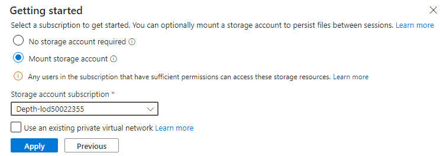

# Atelier 04 : migration de la base de données d'application d'un environnement local vers Azure

## Objectif

Dans cet atelier, nous allons utiliser la méthodologie Cloud Adoption
Framework Adopt pour migrer des bases de données locales à l'aide du
Azure Database Migration Service pour migrer SQL Database. Azure
Database Migration Service est un outil qui vous permet de simplifier,
de guider et d'automatiser la migration de votre base de données vers
Azure. Migrez facilement vos données, schémas et objets de plusieurs
sources vers le cloud à grande échelle.

Un schéma d'un serveur cloud Description générée automatiquement avec un
niveau de confiance moyen

> **Remarque** : Démarrez vos machines virtuelles si vous les avez
> arrêtées après votre labo précédent.

## Exercice 1 : migration d'une base de Microsoft SQL database vers Azure SQL Database

### Tâche 1 : Inscrire le fournisseur de ressources Microsoft.DataMigration

Avant d'utiliser Azure Database Migration Service, le fournisseur de
ressources **Microsoft.DataMigration** doit être inscrit dans
l'abonnement cible.

1.  Ouvrez Azure Cloud Shell en accédant à `https://shell.azure.com`.
    Connectez-vous à l'aide de vos informations d'identification
    d'abonnement Azure si vous y êtes invité, sélectionnez une session
    **PowerShell** et acceptez toutes les Prompts.

- 

  Une capture d'écran d'un ordinateur Description générée
  automatiquement

2.  Dans la fenêtre **Get started** , sélectionnez **Mount storage
    account**, puis sélectionnez l'abonnement approprié, puis cliquez
    sur le bouton **Apply**.

- 

  texte alternatif

3.  Dans la fenêtre **Mount storage account**, sélectionnez **We will
    create a storage account for you** puis cliquez sur le bouton
    **Next**.

- 

  texte alternatif

4.  Attendez la fin du déploiement.

5.  Exécutez la commande suivante pour inscrire le fournisseur de
    ressources **Microsoft.DataMigration** :

- `Register-AzResourceProvider -ProviderNamespace Microsoft.DataMigration`

  > **Remarque** : L'inscription du fournisseur de ressources peut
  > prendre plusieurs minutes. Vous pouvez passer à la tâche suivante
  > sans attendre la fin de l'enregistrement. Vous n'utiliserez pas le
  > fournisseur de ressources avant la tâche 3.

  

  Une capture d'écran d'un ordinateur Description générée
  automatiquement

6.  Vous pouvez vérifier l'état en exécutant :

- `Get-AzResourceProvider -ProviderNamespace Microsoft.DataMigration | Select-Object ProviderNamespace, RegistrationState, ResourceTypes`

  

  Une capture d'écran d'un ordinateur Description générée
  automatiquement

Vous avez terminé cette tâche. Ne fermez aucune fenêtre et passez à la
tâche suivante.

**Résumé de la tâche**

Dans cette tâche, vous avez inscrit le fournisseur de ressources
**Microsoft.DataMigration** avec votre abonnement. Cela permet à cet
abonnement d'utiliser le service de migration de Azure database.

### Tâche 2 : Création du service de migration de base de données

Dans cette tâche, vous allez créer une ressource Azure Database
Migration Service. Cette ressource est gérée par le fournisseur de
**ressources Microsoft.DataMigration** que vous avez inscrit dans la
tâche 1.

> **Remarque** : Azure Database Migrate Service (DMS) nécessite un accès
> réseau à votre base de données locale pour récupérer les données à
> transférer. Pour obtenir cet accès, le DMS est déployé dans un réseau
> virtuel Azure. Vous êtes ensuite responsable de la connexion sécurisée
> de ce réseau virtuel à votre base de données, par exemple à l'aide
> d'une connexion VPN s Site-to-Site ou ExpressRoute.

Dans cet atelier, l'environnement local est simulé par un Hyper-V host
s'exécutant dans Azure Vm . Cette machine virtuelle est déployée sur le
réseau ‘smarthotelvnet’ VNet. Le DMS sera déployé sur un Vnet distinct
appelé « DMSVnet ». Pour simuler la connexion locale, ces deux réseaux
virtuels ont été appairés.

1.  accédez au **Azure portal** . Dans la zone de recherche globale,
    entrez `SmartHotelHost,`` ` puis sélectionnez la machine virtuelle
    **SmartHotelHost.**

- 

2.  Sélectionnez **Connect**, choisissez **Connect** dans la liste
    déroulante.

- 

  Une capture d'écran d'un ordinateur Description générée
  automatiquement

3.  Sélectionnez **Download RDP File**

- 

  Une capture d'écran d'un ordinateur Description générée
  automatiquement

4.  Cliquez sur le bouton **Keep** pour la notification, puis cliquez
    sur **Open file** pour vous connecter.

- 

  Une capture d'écran d'un ordinateur Description générée
  automatiquement

5.  **Connectez-vou** à la machine virtuelle à l'aide du nom
    d'utilisateur `demouser` et du mot de passe `demo !pass``123`

6.  Lancez **Chrome** à partir du raccourci sur le bureau.

7.  Accédez au portail Azure `https://portal.azure.com` recherchez
    `Migration de base de données Azure`, puis sélectionnez **Azure
    Database Migration Services** dans la liste déroulante.

- 

  Une capture d'écran d'un ordinateur Description générée
  automatiquement

8.  Dans le panneau **Azure Database Migration Services**,
    sélectionnez + **Create**.

- 

  Une capture d'écran d'un ordinateur Description générée
  automatiquement

9.  Passez en revue les détails sur la page **Select migration scenario
    and Database Migration Service** , puis cliquez sur le bouton
    **Sélect**

- 

  Une capture d'écran d'un ordinateur Description générée
  automatiquement

10. Sur la page Créer un service de migration de données, onglet
    Informations de base, fournissez les détails ci-dessous.

    - Abonnement – **Depth-@lab.CloudSubscription.Id**

    - Groupe de ressources : **SmartHotelRG**

    - Lieu – **West us**

    - Nom : `SmartHotelDBMigration`

    - Cliquez sur **Review + create**

- 

  Une capture d'écran d'un service de migration de données Description
  générée automatiquement

11. Dans l' onglet **Review + create**, cliquez sur le bouton
    **Create**.

- 

  Une capture d'écran d'un ordinateur Description générée
  automatiquement

12. Le déploiement devrait être terminé en quelques secondes, cliquez
    sur le bouton **Go to resource** .

- 

  Une capture d'écran d'un ordinateur Description générée
  automatiquement

13. Sélectionnez **Integration runtime**  sous Paramètres, puis cliquez
    sur **Configure integration runtime.**

- 

  Une capture d'écran d'un ordinateur Description générée
  automatiquement

14. Cliquez sur le lien **Download and install the integration
    runtime**  et télécharger le runtime sur la VM **SmartHotelHost**

- 

  Une capture d'écran d'un ordinateur Description générée
  automatiquement

15. Cliquez sur le bouton **Download**

- 

  Une capture d'écran d'un ordinateur Description générée
  automatiquement

16. Choisissez la version la plus récente et cliquez sur **Download**

- 

  Une capture d'écran d'un ordinateur Description générée
  automatiquement

17. Une fois téléchargé, installez le runtime d'intégration avec les
    options par défaut

- 

  Une capture d'écran d'un ordinateur Description générée
  automatiquement

18. Le **Microsoft Integration runtime Configuration manager**  doit se
    lancer lorsque vous cliquez sur le bouton **Finish**.

19. À partir du portail Azure, l' onglet **Configure integration
    runtime**  copie la valeur **Key 1**

- 

  Une capture d'écran d'un ordinateur Description générée
  automatiquement

20. De retour sur le **Microsoft Integration runtime Configuration
    manager**  collez la clé copiée et cliquez sur le bouton
    **Register**.

- 

  Une capture d'écran d'un ordinateur Description générée
  automatiquement

21. Cliquez sur le bouton **Finish**

- 

  Une capture d'écran d'un ordinateur Description générée
  automatiquement

  

  Un rectangle jaune avec du texte noir Description générée
  automatiquement

22. Une fois l'inscription terminée, cliquez sur le bouton **Launch
    Configuration Manager**.

- 

  Une capture d'écran d'un ordinateur Description générée
  automatiquement

23. Passez en revue les détails sur le **Microsoft Integration runtime
    Configuration manager**

- 

  Une capture d'écran d'un ordinateur Description générée
  automatiquement

24. Revenez au portail Azure et cliquez sur OK dans l' onglet
    **Configure integration runtime**.

25. L'état doit être mis à jour sur En ligne pour l’ **Integration
    runtime**

- 

  Une capture d'écran d'un ordinateur Description générée
  automatiquement

### Tâche 3 : Migrer le SQL Database locale vers Azure SQL Database

1.  Toujours sur Azure Database Migration service sélectionnez Vue
    d'ensemble, puis cliquez sur le bouton **New migration** sous
    l'onglet Prise en main.

- 

  Une capture d'écran d'un ordinateur Description générée
  automatiquement

2.  Sur la page Sélectionner un nouveau scénario de migration,
    fournissez les détails ci-dessous

    - Type de serveur source – **SQL Server**

    - Type de serveur cible : **Azure SQL Database**

- 

  Une capture d'écran d'un ordinateur Description générée
  automatiquement

3.  Cliquez sur le bouton **Select**

4.  Sur la page Assistant Migration hors connexion d'Azure SQL Database,
    fournissez les détails ci-dessous sous l' onglet **Connect to source
    SQL Server** 

    - Nom du serveur source : `192.168.0.6`

    - Type d'authentification : **SQL Authentification**

    - Nom d'utilisateur : `sa`

    - Mot de passe : `demo!pass123`

    - Propriétés de connexion – **enable both check boxes**

- 

  Une capture d'écran d'une description de connexion générée
  automatiquement

5.  Cliquez sur **Next: Select database for migration \>\>**

6.  Dans l' onglet **Select database for migration**  sélectionnez la
    base de données SmartHotel.Registration et cliquez sur **Next:
    Connect to the target Azure SQL Database \>\>**

- 

  Une capture d'écran d'un ordinateur Description générée
  automatiquement

7.  Dans l' onglet **Connect to the target Azure SQL Database**  toutes
    les informations doivent déjà être renseignées, vous pouvez
    consulter les informations, puis fournir le mot de passe –
    `demo!pass123` et cliquer sur **Next: Map source and target
    databases \>\>**

- 

  Une capture d'écran d'un ordinateur Description générée
  automatiquement

8.  Dans l' onglet **Map source and target databases** , dans la liste
    déroulante Base de données cible, sélectionnez **smarthoteldb** puis
    cliquez sur **Next: Select database tables to migrate \>\>**

- 

  Une capture d'écran d'un ordinateur Description générée
  automatiquement

9.  Dans l' onglet **Select database tables to migrate** tab, cliquez
    sur le menu déroulant **SmartHotel.Registration tables selected
    2/2**  et assurez-vous que le \[dbo\].\[ Réservations\] n'est que la
    table qui est sélectionnée puis cliquez sur **Next : Database
    migration summary \>\>**

- 

  Une capture d'écran d'un ordinateur Description générée
  automatiquement

10. Dans l' onglet **Database migration summary** tab, vérifiez les
    détails, puis cliquez sur le bouton **Start migration**.

- 

  Une capture d'écran d'un ordinateur Description générée
  automatiquement

11. L'état de la migration peut être consulté sous l' onglet
    **Migration**

- 

  Une capture d'écran d'un ordinateur Description générée
  automatiquement

  > **Remarque : la migration prendra environ 10 minutes**

  

  Une capture d'écran d'un ordinateur Description générée
  automatiquement

12. Cliquez plusieurs fois sur le bouton **Refresh**, jusqu'à ce que
    l'état de la migration passe à **Succeeded.**

- 

  Une capture d'écran d'un ordinateur Description générée
  automatiquement

13. Cliquez sur le nom de la source, **192.168.0.6**

- 

  Une capture d'écran d'un ordinateur Description générée
  automatiquement

14. Passez en revue les détails de la migration

- 

  Une capture d'écran d'un ordinateur Description générée
  automatiquement

15. Nous avons migré avec succès la base de données SQL locale vers
    Azure SQL Database.

### Résumé

Dans cet atelier, nous devons avoir travaillé avec le service de
migration de base de données Azure et installé le runtime d'intégration
requis sur la **SmartHotelHost** VM pour pouvoir migrer la base de
données locale vers Azure SQL Database à l'aide du service de migration
de base de données (**DMS**).

Une capture d'écran d'un ordinateur Description générée automatiquement
