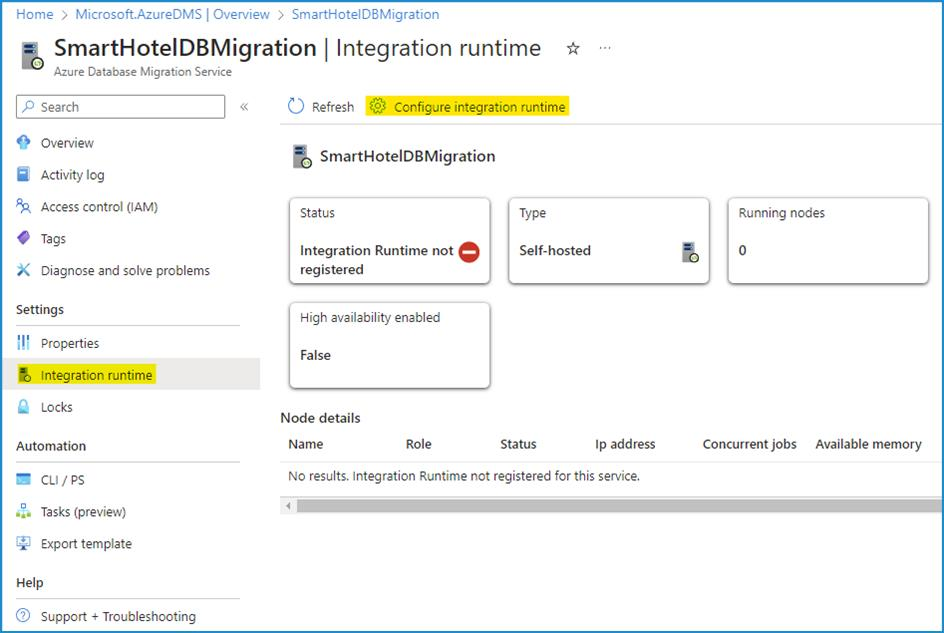
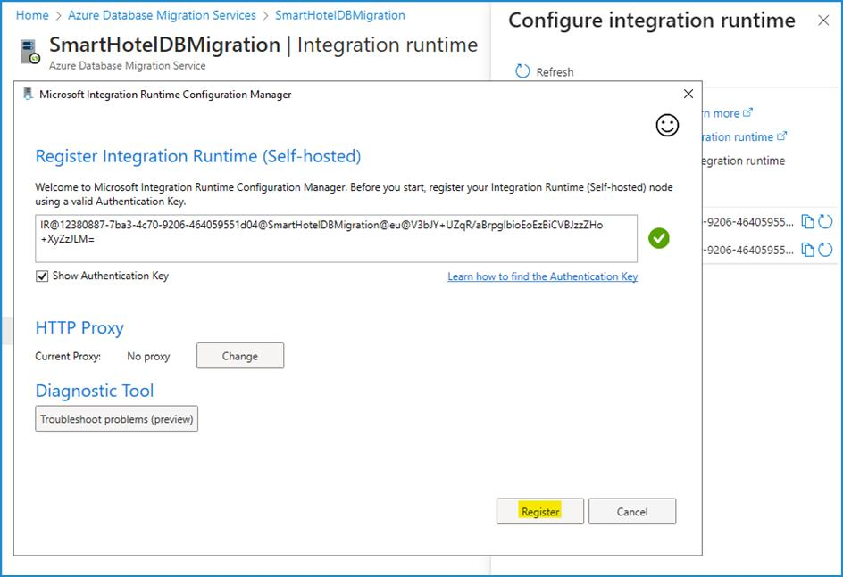
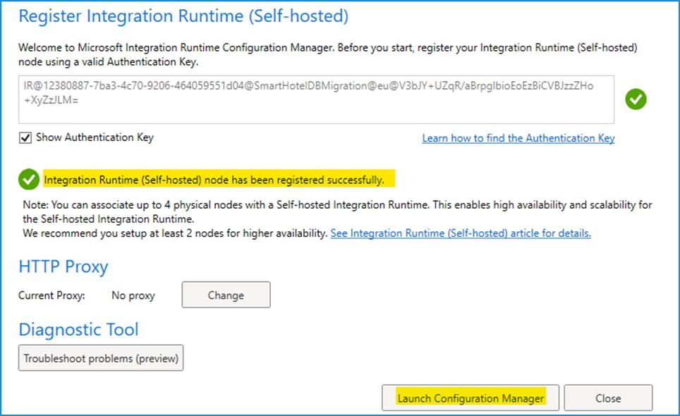
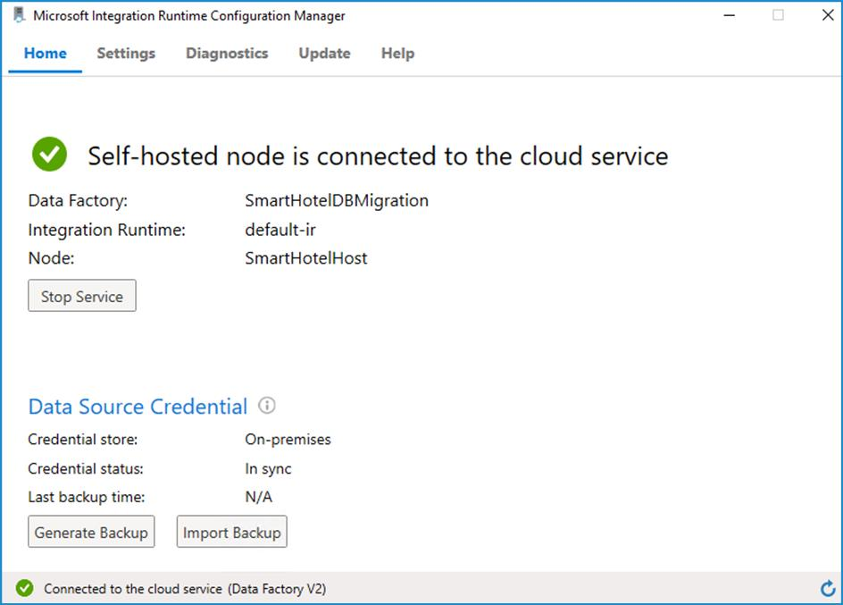
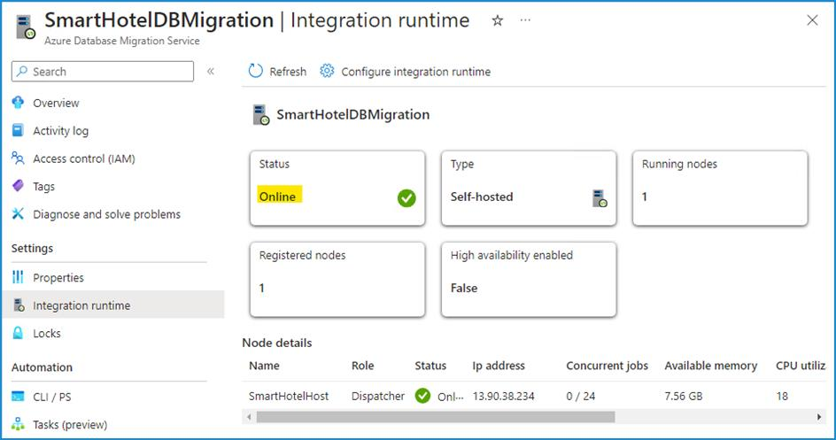
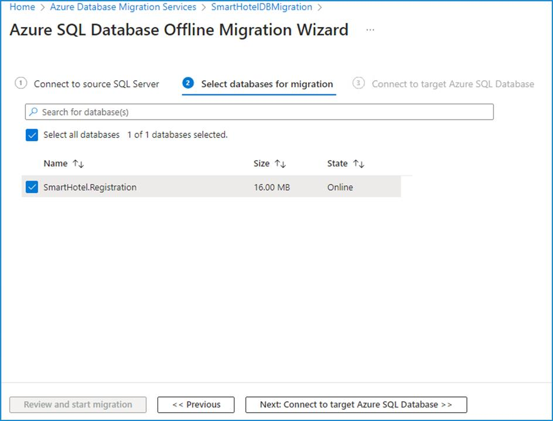
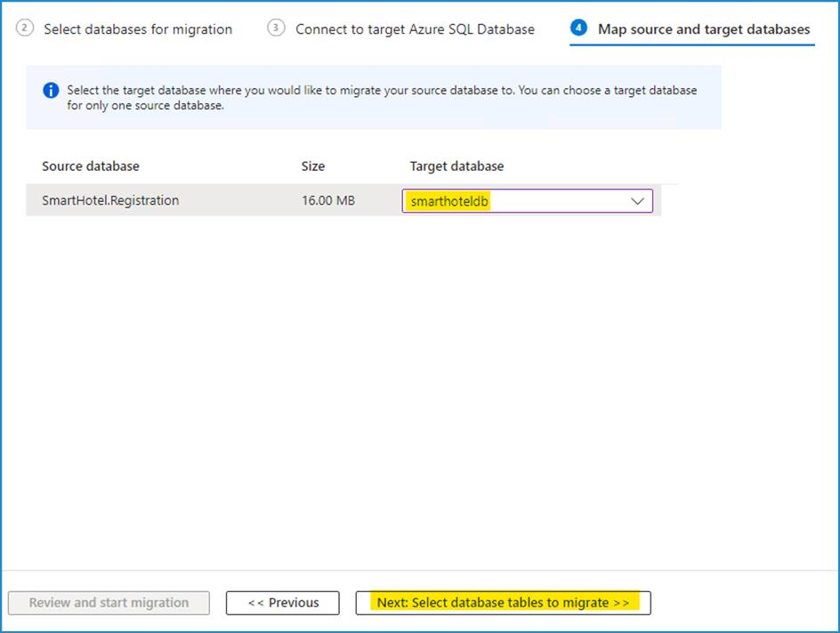
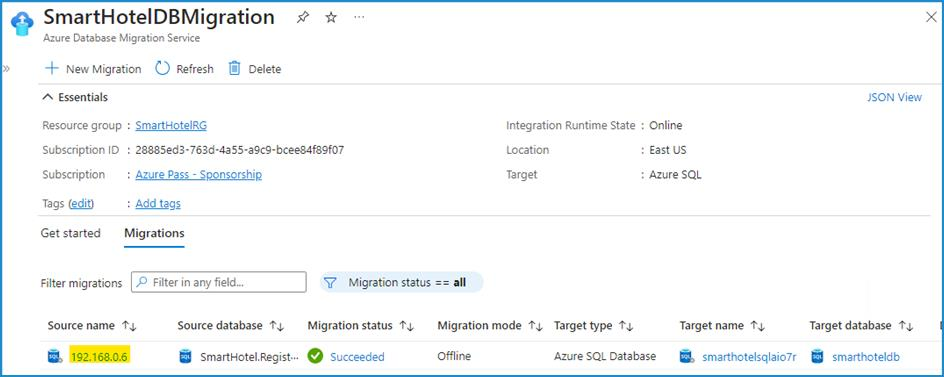

# Lab 04 - Migrating the application database from on-premises environment to Azure

## Objective

In this Lab we would utilize the Cloud Adoption Framework Adopt
methodology to migrate on-premises Databases using the Azure Database
Migration Service to migrate the SQL Database. Azure Database Migration
Service is a tool that helps you simplify, guide, and automate your
database migration to Azure. Easily migrate your data, schema, and
objects from multiple sources to the cloud at scale.

> **Note**: Start your virtual machines if you have stopped them after
your previous lab.

## Exercise 1 - Migrating Microsoft SQL database to Azure SQL Database

### Task 1: Register the Microsoft.DataMigration resource provider

Prior to using the Azure Database Migration Service, the resource
provider **Microsoft.DataMigration** must be registered in the target
subscription.

1.  Open the Azure Cloud Shell by navigating
    to `https://shell.azure.com`. 
    
    
2. Log in using the Credentials provided on the Home/Resources tab of the Lab interface, if prompted to do so, 

2. Select **PowerShell** session, and accept any prompts.

    

2.  On the **Get started** window select **Mount storage account** and then select the appropriate subscription and thek click on the **Apply** button.

    

2. On the **Mount storage account** window select **We will create a storage account for you** and then click on the **Next** button.

    

2. Wait for the deployment to complete.

3.  Run the following command to register
    the **Microsoft.DataMigration** resource provider:

    `Register-AzResourceProvider -ProviderNamespace Microsoft.DataMigration`

    

    > **Note** - if the paste is showing as **^V** then copy and paste the command manually.

     

    > **Note**: It may take several minutes for the resource provider to
    register. You can proceed to the next task without waiting for the
    registration to complete. You will not use the resource provider until
    task 3.

    

4.  You can check the status by running:

    `Get-AzResourceProvider -ProviderNamespace Microsoft.DataMigration | Select-Object ProviderNamespace, RegistrationState, ResourceTypes`

    

    

    > **Note** - if the paste is showing as **^V** then copy and paste the command manually.

     

You have completed this task. Do not close any windows and please
proceed ahead with the next task.

**Task summary**

In this task you registered the **Microsoft.DataMigration** resource
provider with your subscription. This enables this subscription to use
the Azure Database Migration Service.

### Task 2: Create the Database Migration Service

In this task you will create an Azure Database Migration Service
resource. This resource is managed by the **Microsoft.DataMigration
resource** provider which you registered in task 1.

> **Note**: The Azure Database Migrate Service (DMS) requires network
access to your on-premises database to retrieve the data to transfer. To
achieve this access, the DMS is deployed into an Azure VNet. You are
then responsible for connecting that VNet securely to your database, for
example by using a Site-to-Site VPN or ExpressRoute connection.

In this lab, the 'on-premises' environment is simulated by a Hyper-V
host running in an Azure VM. This VM is deployed to the 'smarthotelvnet'
VNet. The DMS will be deployed to a separate VNet called 'DMSVnet'. To
simulate the on-premises connection, these two VNet have been peered.

1. navigate to the **Azure portal**. In the
    global search box, enter `SmartHotelHost` then select
    the **SmartHotelHost** virtual machine.

    

1.  Select **Connect**, choose **Connect** from the drop-down.

    

2.  Select **Download RDP File**.

    

3. Click on the **Keep** button for the notification and then click
    on **Open file** to connect.

    

3. **Connect** to the virtual machine using username `demouser` and
    password `demo!pass123`

1. Launch **Chrome** from the desktop shortcut.

2. Navigate to the Azure portal `https://portal.azure.com` and login using the credentials from Home/Resources tab of the Lab interface. 

2. Search for `Azure database migration`, and then select **Azure Database
    Migration Services** from the drop-down list.

    

3.  On the **Azure Database Migration Services** blade, select
    + **Create**.

    

4.  Review the details on the **Select migration scenario and Database
    Migration Service** page and click on the **Select** button

    

5.  On the Create Data Migration Service page, Basics tab, provide the
    below details.

    - Subscription -- **Depth-@lab.CloudSubscription.Id**

    - Resource group: **SmartHotelRG**

    - Location -- **West US**

    - Name: `SmartHotelDBMigration`

    - Click on **Review + create**

    

6.  On the **Review + create** tab, click on the **Create** button.

    

7.  The Deployment should be completed in few seconds, click on **Go to
    resource** button.

    

8.  Select **Integration runtime** under Settings, then click
    on **Configure integration runtime.**

    

9.  Click on the link **Download and install the integration
    runtime** and download the runtime on the **SmartHotelHost** VM

    

10. Click on the **Download**

    

11. Choose the most recent version and the click on **Download**

    

12. Once downloaded, install the Integration runtime with the default
    options

    

13. The **Microsoft Integration runtime Configuration manager** should
    launch upon clicking the **Finish** button.

14. From the Azure Portal, **Configure integration runtime** tab copy
    the **Key 1** value

    

15. Back on the **Microsoft Integration runtime Configuration
    manager** paste the copied key and click on the **Register** button.

    

16. Click on the **Finish** button

    

    

17. Once the Registration is completed, click on **Launch Configuration
    Manager** button.

    

18. Review the details on the **Microsoft Integration runtime
    Configuration manager**

    

19. Switch back to the Azure portal and click Ok on the **Configure
    integration runtime** tab.

20. The Status should be updated to Online for the **Integration
    runtime**

    

### Task 3: Migrate the On-premises SQL Database to Azure SQL Database

1.  While still on the Azure Database Migration service page, select
    Overview and then click on **New Migration** button under Getting
    started tab.

    

2.  On the Select new migration scenario page, provide the below details

    - Source server type -- **SQL Server**

    - Target server type -- **Azure SQL Database**

    

3.  Click on the **Select** button

4. On the Azure SQL Database Offline Migration Wizard page, provide the
below details on the **Source details** tab.

    - Is your source SQL server instance tracked in Azure? - **No**

    - Source Infrastructure Type: **Hyper-V**

    - Subscription – keep the default selected.

    - Resource group: **SmartHotelHostRG**

    - Location: **West US**

    - SQL Server Instance Name: `192.168.0.6`

    

    > **Note** - ignore if you are getting the below notification and proceed with next step.
    
    

4.  On the Azure SQL Database Offline Migration Wizard page, provide the
    below details on the **Connect to source SQL Server** tab.

    - Source server name: `192.168.0.6`

    - Authentication type: **SQL Authentication**

    - Username: `sa`

    - Password: `demo!pass123`

    - Connection properties -- **enable both check boxes**

    

5.  Click on **Next: Select database for migration \>\>**

6.  On the **Select database for migration** tab, select the
    SmartHotel.Registration database and click on **Next: Connect to the
    target Azure SQL Database \>\>**

    

7.  On the **Connect to the target Azure SQL Database** tab all the
    information should already be populated, you can review the
    information, then provide the password -- `demo!pass123` and
    click on **Next: Map source and target databases \>\>**

    

8.  On the **Map source and target databases** tab, from the drop-down
    of Target database select **smarthoteldb** and then click on **Next:
    Select database tables to migrate \>\>**

    

9.  On the **Select database tables to migrate** tab, click on the
    drop-down **SmartHotel.Registration tables selected 2/2** and ensure
    that the \[dbo\].\[Bookings\] is only the table which is selected
    and then click on **Next: Database migration summary \>\>**

    

10. On the **Database migration summary** tab, review the details and
    then click on **Start migration** button.

    

11. The Migration status can be seen under the **Migration** tab

    

    > **Note: The Migration will take around 10 minutes**

    

12. Click on the **Refresh** button couple of times, till the Migration
    status changed to **Succeeded**.

    

13. Click on the Source name, **192.168.0.6**

    

14. Review the details of the Migration

    

15. We have successfully migrated the On-premises SQL Database to Azure
    SQL Database.

### Summary

In this Lab we should have worked with Azure Database Migration service
and install the required integration runtime on
the **SmartHotelHost** VM to be able migrate the on-premises database
successfully to Azure SQL Database using the Database Migration Service
(**DMS**).

