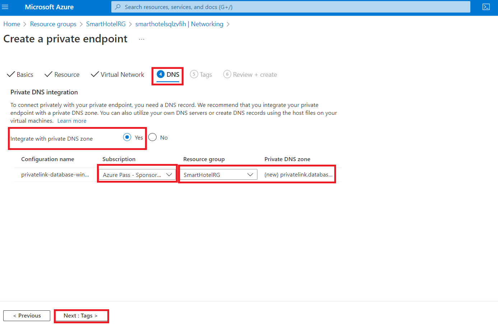
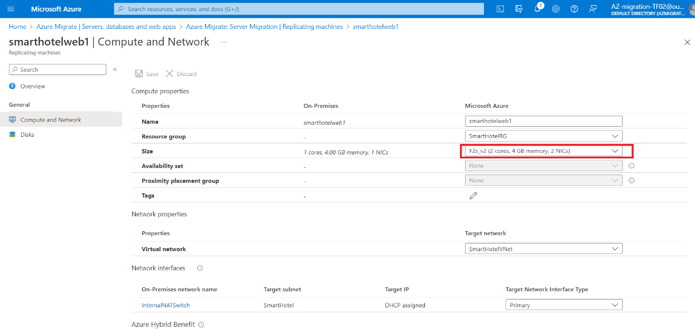

# Atelier 03 : migration des machines virtuelles d'un environnement local vers Azure

## Objectif

Dans cet atelier, nous allons migrer des machines virtuelles locales à
l'aide de l'outil Azure Migrate et des données d'évaluation dans un
projet de migration Azure, inscrire Azure Migrate appliance pour la
réplication, puis configurer l'adresse IP statique de la machine
virtuelle répliquée, et enfin migrer les machines virtuelles vers Azure
dans le groupe de ressources respectif.

### Tâche 1 : Création d'un compte de stockage

Dans cette tâche, vous allez créer un compte **Azure Storage Account** 
qui sera utilisé par **Azure Migrate: Server Migration**  pour le
stockage des données de votre machine virtuelle pendant la migration.

> **Remarque :** Cet atelier se concentre sur les outils techniques
> requis pour la migration des charges de travail. Dans un scénario
> réel, il faut tenir compte davantage du plan à long terme avant de
> migrer les actifs. La zone d'atterrissage requise pour héberger des
> machines virtuelles doit également inclure des considérations pour le
> trafic réseau, le contrôle d'accès, l'organisation des ressources et
> la gouvernance. Par exemple, le plan de migration de la CAF et le plan
> de base de la CAF peuvent être utilisés pour déployer une zone
> d'atterrissage prédéfinie et démontrer le potentiel d'une approche
> d'infrastructure en tant que code (IaC) pour la gestion des ressources
> d'infrastructure.

1.  Revenez à l' onglet **Azure Portal**  ou ouvrez un nouvel onglet,
    accédez à `https://portal.azure.com` et connectez-vous avec vos
    informations d'identification de office 365 tenant. Dans le volet de
    navigation gauche du portail Azure, sélectionnez **+ Create** une
    ressource.

- 

  Interface utilisateur graphique, texte, application, e-mail
  Description générée automatiquement

2.  Recherchez et sélectionnez `Compte de stockage`, puis **Create**.

- 

  Interface utilisateur graphique, application Description générée
  automatiquement

  

  Interface utilisateur graphique, texte, application, e-mail
  Description générée automatiquement

3.  Dans le panneau **Create storage account** , sous l' onglet
    **Basics** , utilisez les valeurs suivantes :

    - Abonnement : **Keep the default selected subscription**.

    - Groupe de ressources : **AzureMigrateRG**

    - Nom du compte de stockage : `migstrgXXXXXX` \[remplacer **XXXXXX**
      par un nombre aléatoire\]

    - Lieu : **West Us**.

    - Performance : **Standard**

    - Redondance : **Locally-redundant storage (LRS)**

- 

  Une capture d'écran d'un ordinateur Description générée
  automatiquement

4.  Sélectionnez l' onglet **Data protection**  et \[**uncheck**\]
    l'option **Enable soft delete blobs,** puis sélectionnez le bouton
    **Review**, sélectionnez puis **Create**.

- 

  Une capture d'écran d'un ordinateur Description générée
  automatiquement

  

  Une capture d'écran d'un ordinateur Description générée
  automatiquement

  

  Une capture d'écran d'un ordinateur Description générée
  automatiquement

5.  Cliquez sur Accéder à la ressource, puis sous **Data management,**
    sélectionnez **Data protection**, assurez-vous que l'option **Enable
    soft delete for blobs** n'est pas cochée, puis cliquez sur le bouton
    **Save**.

- 

Vous avez terminé cette tâche. Ne fermez pas cet onglet pour passer à la
tâche suivante.

**Résumé de la tâche**

Dans cette tâche, vous avez créé un compte de stockage Azure qui sera
utilisé par Azure Migrate : Migration de serveur.

### Tâche 2 : Créer un point de terminaison privé

Dans cette tâche, vous allez créer un point de terminaison sur le réseau
virtuel fourni qui sera utilisé par la ressource SQL Server.

Vous allez également configurer un point de terminaison privé dans ce
réseau pour permettre un accès privé et sécurisé à la base de données
SQL.

> **Remarque :** Azure propose plusieurs options pour déployer la
> configuration réseau appropriée. Après l'atelier, si vous souhaitez
> mieux comprendre vos options de mise en réseau, consultez le \[Guide
> de décision
> réseau\]`https://docs.microsoft.com/azure/cloud-adoption-framework/decision-guides/software-defined-network`,
> qui s'appuie sur les zones d'atterrissage Azure du Cloud Adoption
> Framework.

1.  Accédez au groupe de ressources **SmartHotelRG** et cliquez sur le
    **SQL server** répertorié , comme indiqué dans l'image ci-dessous.

- 

  Interface utilisateur graphique, texte, application, e-mail
  Description générée automatiquement

  

  Interface utilisateur graphique, texte, application Description
  générée automatiquement

2.  Sous **Security**, sélectionnez **Networking** **-\>Private
    access**,, puis sélectionnez + **Create a Private endpoint**.

- 

3.  Sous l' onglet **basics**, entrez la configuration suivante, puis
    sélectionnez **Next : Resource** :

    - Groupe de ressources : **SmartHotelRG**

    - Nom : `SmartHotel-DB-Endpoint`

    - Région : **West Us** (Sélectionnez le même emplacement que le
      SmartHotelVNet.)

- 

  Une capture d'écran d'un ordinateur Description générée
  automatiquement

4.  Sous l' onglet **Ressource**, entrez la configuration suivante, puis
    sélectionnez **Next: Virtual Network**

    - Sous-ressource cible : **sqlServer**

- 

5.  Sous l' onglet **Virtual Network** , entrez la configuration
    suivante, puis sélectionnez **Next: DNS** :

    - Réseau virtuel : **SmartHotelVNet**

    - Sous-réseau : **SmartHotelDB (192.168.0.128/25)**

    - Configuration de l'adresse IP privée : sélectionnez **Dynamically
      allocate IP address**

- 

6.  Dans l' onglet **DNS**, entrez la configuration suivante, puis
    sélectionnez **Next : Tags.**

    - Intégration avec la zone DNS privée : **Yes**

    - Abonnement : **Keep the default selected subscription**

    - Groupe de ressources : **SmartHotelRG**

- 

7.  Sélectionnez **Review + create**.

- 

8.  Sélectionnez **Create**.

- 

  Une capture d'écran d'un ordinateur Description générée
  automatiquement

9.  **Wait** la fin du déploiement.

- 

  Une capture d'écran d'un ordinateur Description générée
  automatiquement

10. Ouvrez le panneau **Private Endpoint**, cliquez sur **DNS
    Configuration** et notez que le  **FQDN**  de terminaison est
    répertorié sous la forme **\database.windows.net**, avec une adresse
    IP interne **192.168.0.132**.

- 

  Une capture d'écran d'un ordinateur Description générée
  automatiquement

> **Remarque** : Le DNS privé est utilisé de sorte que le nom de domaine
> de la base de données, **\database.windows.net se** résout en
> l'adresse IP du point de terminaison privé interne **192.168.0.132**
> lorsqu'il est résolu à partir du SmartHotelVNet, mais qu'il est résolu
> à l'adresse IP Internet du serveur de base de données lorsqu'il est
> résolu à partir de l'extérieur du réseau virtuel. Cela signifie que la
> même chaîne de connexion (qui contient le nom de domaine) peut être
> utilisée dans les deux cas.
>
> **Remarque** : Si la connexion au point de terminaison privé ne permet
> pas à l'adresse IP ou au nom de domaine de la base de données de se
> connecter à la base de données, il peut être nécessaire de créer une
> nouvelle règle de pare-feu pour autoriser les plages d'adresses IP de
> la base de données et le lien privé.

Vous avez terminé cette tâche. Ne fermez pas cet onglet pour passer à la
tâche suivante.

**Résumé de la tâche**

Dans cette tâche, vous avez créé un point de terminaison privé sur le
réseau virtuel qui sera utilisé pour accéder à la base de données SQL.

### Tâche 3 : Créer un point de terminaison privé pour le compte de stockage

Dans cette tâche, vous allez créer un point de terminaison sur le réseau
virtuel fourni qui sera utilisé par le **Replication Storage Account**.
Vous allez également configurer un point de terminaison privé dans ce
réseau pour autoriser un accès privé et sécurisé au **Replication
Storage Account**.

1.  Accédez au groupe de ressources **AzureMigrateRG** et cliquez sur le
    compte de stockage de réplication **migstrgXXXXXX** répertorié,
    comme illustré dans l'image ci-dessous.

- 

  Une capture d'écran d'un ordinateur Description générée
  automatiquement

2.  Sous **Security**, sélectionnez **Networking -\> Private endpoint
    connections**, puis sélectionnez **+ Private endpoint**.

- 

  Une capture d'écran d'un ordinateur Description générée
  automatiquement

3.  Sous l' onglet **basics**, entrez la configuration suivante, puis
    sélectionnez **Next : Resource** :

    - Groupe de ressources : **AzureMigrateRG**

    - Nom : `Storage-Endpoint`

    - Région : **West Us**

- 

  Une capture d'écran d'un ordinateur Description générée
  automatiquement

4.  Sous l' onglet **Resource**, entrez la configuration suivante, puis
    sélectionnez **Suivant : Réseau virtuel** :

    - Sous-ressource cible : **blob**

- 

  Une capture d'écran d'un ordinateur Description générée
  automatiquement

5.  Sous l' onglet **Virtual Network**, entrez la configuration
    suivante, puis sélectionnez **Next : DNS** :

    - Réseau virtuel : **smarthotelhostvnet**

    - Sous-réseau : **hostsubnet**

    - Configuration de l'adresse IP privée : sélectionnez **Dynamically
      allocate IP address**

- 

  Une capture d'écran d'un ordinateur Description générée
  automatiquement

6.  Dans l' onglet **DNS**, entrez la configuration suivante, puis
    sélectionnez **Next: Tags**.

    - Intégration avec la zone DNS privée : **Yes**

    - Abonnement : **Keep the default selected subscription**

    - Groupe de ressources : **SmartHotelHostRG**

- 

  Une capture d'écran d'un ordinateur Description générée
  automatiquement

7.  Sélectionnez **Review + create**.

- 

  Une capture d'écran d'un ordinateur Description générée
  automatiquement

8.  Sélectionnez **Create**.

- 

  Une capture d'écran d'un ordinateur Description générée
  automatiquement

9.  **Wait** la fin du déploiement.

- 

  Une capture d'écran d'un ordinateur Description générée
  automatiquement

**Résumé de la tâche**

Dans cette tâche, vous avez créé un point de terminaison privé sur le
réseau virtuel qui sera utilisé pour accéder au **Replication Storage
Account**.

### Tâche 4 : Inscrire Hyper-V Host avec la migration et la modernisation

Dans cette tâche, vous allez inscrire votre Hyper-V host auprès du
**Azure Migrate: Server Migration** . Ce service utilise **Azure Site
Recovery** comme moteur de migration sous-jacent. Dans le cadre du
processus d'inscription, vous allez déployer le **Azure Site Recovery
Provider**  sur votre **Hyper-V host**.

1.  Revenez à la lame **Azure Migrate** dans le **Azure Portal**
    `https://portal.azure.com`.

- 

  Interface utilisateur graphique, application Description générée
  automatiquement

2.  Sélectionnez **Servers,databases and webapps**  sous **Migration
    goals**  sur la gauche. Sous **Migration tools**, sélectionnez
    **Discover**.

- > **Remarque :** Vous devrez peut-être ajouter l'outil de migration
  > vous-même en suivant le lien sous la section **migration tools**, en
  > sélectionnant **Azure Migrate: Server Migration**, puis Sélectionnez
  > **Add tool(s)**..

  

  Une capture d'écran d'un ordinateur Description générée
  automatiquement

3.  Dans le panneau **Discover machines** , Pour **Where do you want to
    migrate to?** Choisissez Machine virtuelle Azure, sous **Are your
    machines virtualized**, sélectionnez **Yes, With Hyper-V**. Sous
    **target Region** , entrez **West US (the same region as used for
    your Azure SQL Database** , disponible dans le portail Azure) et
    cochez la case de confirmation. Sélectionnez **Create resources** 
    pour commencer le déploiement de la ressource Azure Site Recovery
    utilisée par Azure Migrate : Migration de serveur pour **Hyper-V
    migrations**.

- 

  Une capture d'écran d'un ordinateur Description générée
  automatiquement

4.  Une fois le déploiement terminé, le panneau **‘Discover machines’** 
    doit être mis à jour avec des instructions supplémentaires.

- 

  Gros plan d'un texte Description générée automatiquement

5.  Copiez le lien **Download** du programme d'installation du logiciel
    du fournisseur **Hyper-V replication**  dans votre presse-papiers.

- 

  Une capture d'écran d'un ordinateur Description générée
  automatiquement

6.  Ouvrez la fenêtre du bureau à distance **SmartHotelHost,** lancez
    **Chrome** à partir du raccourci sur le bureau et collez le lien
    dans un nouvel onglet du navigateur pour télécharger le programme
    d'installation du fournisseur Azure Site Recovery.

- 

  Interface utilisateur graphique, texte, application Description
  générée automatiquement

7.  Revenez à la page **Discover machines**  dans votre navigateur (en
    dehors de la session de bureau à distance SmartHotelHost).
    Sélectionnez le bouton bleu **Download** et téléchargez le fichier
    de clé d'enregistrement.

- 

  Interface utilisateur graphique, texte, application, e-mail
  Description générée automatiquement

8.  Ouvrez l'emplacement du fichier dans l'Explorateur Windows et
    copiez-le dans votre presse-papiers. Revenez à la session de bureau
    à distance **SmartHotelHost** et collez le fichier sur le bureau.

- 

  Interface utilisateur graphique, application Description générée
  automatiquement

9.  Toujours dans la session de bureau à distance **SmartHotelHost**,
    ouvrez le programme d'installation **AzureSiteRecoveryProvider.exe**
    que vous avez téléchargé il y a un instant.

- 

  Interface utilisateur graphique, texte, application, e-mail
  Description générée automatiquement

10. Sous l' onglet **Microsoft Update**, sélectionnez **Off,** puis
    sélectionnez **Next**.

- 

  Interface utilisateur graphique, texte, application, e-mail
  Description générée automatiquement

11. Acceptez l'emplacement d'installation par défaut et cliquez sur
    **Install**.

- 

  Interface utilisateur graphique, texte, application Description
  générée automatiquement

12. Sélectionnez **Register** .

- 

  Interface utilisateur graphique, texte, application, e-mail
  Description générée automatiquement

13. Accédez à l'emplacement du fichier de clé que vous avez téléchargé.
    Lorsque la clé est chargée, sélectionnez **Next**.

- 

  Interface utilisateur graphique, texte, application, e-mail
  Description générée automatiquement

14. Sélectionnez **Connect directly to Azure Site Recovery without a
    proxy server**  puis sélectionnez **Next**. Le **registration** de
    **Hyper-V host**  auprès **d'Azure Site Recovery** commence.

- 

  Interface utilisateur graphique, texte, application, e-mail
  Description générée automatiquement

15. Attendez que l'inscription soit terminée (cela peut prendre
    plusieurs minutes). Sélectionnez ensuite **Finish**.

- 

  Interface utilisateur graphique, texte, application Description
  générée automatiquement

16. Réduisez la session de bureau à distance **SmartHotelHost** et
    revenez à la fenêtre du navigateur **Azure Migrate**. **Refresh**
    votre navigateur, puis rouvrez le panneau **Discover machines**  en
    sélectionnant **Discover** sous **Migration tools**..

- 

  Une capture d'écran d'un ordinateur Description générée
  automatiquement

17. Sélectionnez **Yes, with Hyper-V** pour  **Are your machines
    virtualized ?**. Cliquez sur le bouton **Finalize registration**,
    qui devrait maintenant être activé.

- 

  Une capture d'écran d'un ordinateur Description générée
  automatiquement

18. Azure Migrate va maintenant terminer l'inscription auprès de Hyper-V
    host. **Wait** que l'inscription soit terminée. Cela peut prendre
    plusieurs minutes.

- 

  Une capture d'écran d'un ordinateur Description générée
  automatiquement

19. Une fois l'enregistrement terminé, fermez le panneau **Discover
    machines** .

- 

  Une capture d'écran d'une erreur informatique Description générée
  automatiquement

20. Le panneau **Migration and modernization** doit maintenant afficher
    **5 discovered servers**..

- 

  Une capture d'écran d'un ordinateur Description générée
  automatiquement

**Résumé de la tâche**

Dans cette tâche, vous avez inscrit votre Hyper-V host auprès du service
de migration de serveur Azure Migrate.

### Tâche 5 : Activer la réplication d'Hyper-V vers Azure Migrate

Dans cette tâche, vous allez configurer et activer la réplication de vos
machines virtuelles locales d'Hyper-V vers le service de migration de
serveur Azure Migrate.

1.  Sous **Migration and modernization**, sélectionnez **Replicate**. L'
    assistant de **replicate** s'ouvre

- 

  Une capture d'écran d'un ordinateur Description générée
  automatiquement

2.  Dans l' onglet **Specify intent**, entrez la configuration suivante,
    puis sélectionnez **Continue.**

    - Que voulez-vous migrer : **Servers or virtual machines(VM)**

    - Où souhaitez-vous migrer vers : **Azure VM**

    - Votre machine est-elle virtualisée ? – **Yes, with Hyper-V**

- 

  Une capture d'écran d'un ordinateur Description générée
  automatiquement

3.  Sous l' onglet **Virtual machines** , sous **Import migration
    settings from an assessment**, sélectionnez **Yes, apply migration
    settings from an Azure Migrate assessment.** Sélectionnez le groupe
    de machines virtuelles **SmartHotel VMs** et l'évaluation de
    migration **SmartHotelAssessment**.

- 

  Une capture d'écran d'un ordinateur Description générée
  automatiquement

4.  L' onglet **Virtual Machines v**doit maintenant afficher les
    machines virtuelles incluses dans l'évaluation. Sélectionnez les
    machines virtuelles **UbuntuWAF**, **smarthotelweb1** et
    **smarthotelweb2**, puis sélectionnez Suivant.

- 

  Une capture d'écran d'un ordinateur Description générée
  automatiquement

5.  Dans l' onglet **Target Settings** , sélectionnez votre abonnement
    et le groupe de ressources **SmartHotelRG** existant . Sous **Cache
    storage account**  sélectionnez le compte de stockage
    **migstrgXXXXXX** et sous **virtuel network**, sélectionnez
    **SmartHotelVNet**. Sous Sous-réseau, sélectionnez **SmartHotel**.
    Sélectionnez **Next**.

- 

  Une capture d'écran d'un ordinateur Description générée
  automatiquement

6.  Dans l' onglet **Compute**, sélectionnez la taille de machine
    virtuelle **Standard_F2s_v2** pour chaque machine virtuelle.
    Sélectionnez le **Windows operating system**  pour les machines
    virtuelles **smarthotelweb** et le système d'exploitation **Linux**
    pour la machine virtuelle **UbuntuWAF**. Sélectionnez **Next**.

- 

  Une capture d'écran d'un ordinateur Description générée
  automatiquement

7.  Dans l' onglet **Disks**, vérifiez les paramètres, mais n'apportez
    aucune modification. Sélectionnez **Next**

- 

  Une capture d'écran d'un ordinateur Description générée
  automatiquement

8.  Dans l' onglet **Tags**, cliquez sur **Next**, puis sur l' onglet
    **Review + Start**  la réplication, cliquez sur le bouton
    **Replicate**.

9.  Dans le panneau **migration tools** , sous **Migration and
    modernization**, sélectionnez le bouton **OverView**.

- 

  Une capture d'écran d'un ordinateur Description générée
  automatiquement

10. Vérifiez que les 3 machines sont en cours de réplication.

- 

  Une capture d'écran d'un ordinateur Description générée
  automatiquement

11. Sélectionnez **Replication** sous **Manage** sur la gauche.
    Sélectionnez **Refresh** de temps en temps et attendez que les trois
    machines aient l' état **Protected**, ce qui indique que la
    réplication initiale est terminée. Cela prendra plusieurs minutes.

- 

  Une capture d'écran d'un ordinateur Description générée
  automatiquement

> **Remarque :** La réplication des machines virtuelles prendra environ
> 20 à 40 minutes, veuillez attendre la même chose.

Une capture d'écran d'un ordinateur Description générée automatiquement

Vous avez terminé la tâche. Ne fermez pas la fenêtre et ne passez pas à
la tâche suivante.

**Résumé de la tâche**

Dans cette tâche, vous avez activé la réplication de l'hôte Hyper-V vers
Azure Migrate et configuré la taille de la machine virtuelle répliquée
dans Azure.

### Tâche 6 : Configurer les adresses IP internes statiques pour chaque machine virtuelle

Dans cette tâche, vous allez modifier les paramètres de chaque machine
virtuelle répliquée afin d'utiliser une adresse IP privée statique qui
correspond aux adresses IP locales de cette machine.

1.  Toujours à l'aide du panneau d'**Azure Migrate : migration et
    modernisation | replication**, sélectionnez la machine virtuelle
    **smarthotelweb1**. Cela ouvre une lame de migration et de
    réplication détaillée pour cette machine. Prenez un moment pour
    étudier ces informations.

- 

  Une capture d'écran d'un ordinateur Description générée
  automatiquement

2.  Sélectionnez **Compute and network** sous **General** sur la gauche,
    puis sélectionnez **Edit**.

- 

  Une capture d'écran d'un ordinateur Description générée
  automatiquement

3.  Vérifiez que la machine virtuelle est configurée pour utiliser la
    **taille** de **F2s_v2** VM (ou **DS2_v2 ou D2s_v3**).

- 

4.  Sous **Network Interfaces**, sélectionnez **InternalNATSwitch** pour
    ouvrir les **network interface settings**.

- 

  Une capture d'écran d'un ordinateur Description générée
  automatiquement

5.  Remplacez l'**adresse IP privée** par `192.168.0.4`. Sélectionnez
    **OK** pour fermer le panneau des paramètres de l'interface réseau.

- 

  Interface utilisateur graphique, texte, application Description
  générée automatiquement

6.  **Save** les paramètres **smarthotelweb1**.

- 

  Une capture d'écran d'un ordinateur Description générée
  automatiquement

  

> **Remarque** - Répétez ces étapes pour configurer l'adresse IP privée
> de l'autre

7.  Toujours à l'aide de panneau '**Azure Migrate : migration and
    modernisation |replication**, sélectionnez la machine virtuelle
    **smarthotelweb2**.

- 

  Une capture d'écran d'un ordinateur Description générée
  automatiquement

8.  Sélectionnez **Compute and network** sous **General** sur la gauche,
    puis sélectionnez **Edit**.

- 

9.  Sous **Network Interfaces** , sélectionnez **InternalNATSwitch**
    pour ouvrir les paramètres de l'interface réseau.

- 

10. Remplacez l'**adresse IP privée** par `192.168.0.5`. Sélectionnez
    **OK** pour fermer le panneau des paramètres de l'interface réseau.

- 

11. **Save** les paramètres **smarthotelweb2**.

- 

12. Utilisation le paneau **Azure Migrate : migration et modernisation |
    Replicating machines**, sélectionnez la machine virtuelle
    **UbuntuWAF**. Cela ouvre une lame de migration et de réplication
    détaillée pour cette machine

- 

  Une capture d'écran d'un ordinateur Description générée
  automatiquement

13. Sélectionnez **Compute and network** sous **General** sur la gauche,
    puis sélectionnez **Edit**

- 

  Interface utilisateur graphique, texte, application, e-mail
  Description générée automatiquement

14. Vérifiez que la machine virtuelle est configurée pour utiliser la
    taille **F2s_v2** VM . Sous **Network interface**, sélectionnez
    **InternalNATSwitch** pour ouvrir les paramètres de l'interface
    réseau.

- 

15. Remplacez l'**adresse IP privée** par `192.168.0.8`. Sélectionnez
    **OK** pour fermer le panneau des paramètres de l'interface réseau.

- 

  Interface utilisateur graphique, application Description générée
  automatiquement

16. **save** les paramètres **UbuntuWAF**.

- 

  Interface utilisateur graphique, application Description générée
  automatiquement

Vous avez terminé la tâche. Ne fermez pas la fenêtre et ne passez pas à
la tâche suivante.

**Résumé de la tâche**

Dans cette tâche, vous avez modifié les paramètres de chaque machine
virtuelle répliquée afin d'utiliser une adresse IP privée statique qui
correspond aux adresses IP locales de cette machine

> **Remarque** : Azure Migrate fait une “best guess” des paramètres de
> la machine virtuelle, mais vous avez un contrôle total sur les
> paramètres des éléments migrés. Dans ce cas, la définition d'une
> adresse IP privée statique garantit que les machines virtuelles dans
> Azure conservent les mêmes adresses IP qu'elles avaient localement, ce
> qui évite d'avoir à reconfigurer les machines virtuelles lors de la
> migration (par exemple, en modifiant les fichiers web.config).

### Tâche 7 : Migration du serveur

Dans cette tâche, vous allez effectuer une migration des machines
UbuntuWAF, smarthotelweb1 et smarthotelweb2 vers Azure.

> **Remarque** : Dans un scénario réel, vous devez effectuer une
> migration de test avant la migration finale. Pour gagner du temps,
> vous allez ignorer la migration de test dans cet atelier. Le processus
> de migration de test est très similaire à la migration finale.

1.  Revenez au panneau **Azure Migrate: Servers, databases and web
    apps**  à l'aide du lien en haut, comme illustré dans l'image
    ci-dessous.

- 

2.  Cliquez sur **Overview** dans la section **Migration tools**.

- 

  Une capture d'écran d'un ordinateur Description générée
  automatiquement

3.  Sous **Stape 3 : Migrate**, sélectionnez **Migrate**.

- 

  Une capture d'écran d'un ordinateur Description générée
  automatiquement

4.  Dans la page **Specify intent**, assurez-vous que **Azure VM** est
    sélectionnée, puis cliquez sur Continuer

- 

  Une capture d'écran d'un ordinateur Description générée
  automatiquement

  > **Remarque** : Vous pouvez éventuellement choisir si les machines
  > virtuelles locales doivent être automatiquement arrêtées avant la
  > migration afin de minimiser la perte de données. L'un ou l'autre
  > paramètre fonctionnera pour cet atelier.

5.  Dans le panneau **Migrate**, sélectionnez les 3 machines virtuelles,
    puis sélectionnez **Migrate** pour démarrer le processus de
    migration.

- 

  Une capture d'écran d'un ordinateur Description générée
  automatiquement

6.  Le processus de migration commencera.

- 

7.  Pour surveiller la progression, sélectionnez **Jobs** sous
    **Manage** sur la gauche et vérifiez l'état des trois travails de
    **Planned failover** 

- 

  Une capture d'écran d'un ordinateur Description générée
  automatiquement

8.  **Attendez** que les trois travails de **Planned failover** 
    affichent **status** of **successfull**. Vous ne devriez pas avoir
    besoin d'actualiser votre navigateur. Cela peut prendre jusqu'à **15
    minutes**.

- 

  Une capture d'écran d'un ordinateur Description générée
  automatiquement

9.  Accédez au groupe de ressources **SmartHotelRG** et vérifiez que la
    machine virtuelle, l'interface réseau et les ressources de disque
    ont été créées pour chacune des machines virtuelles en cours de
    migration.

- 

  Interface utilisateur graphique, texte, application, e-mail
  Description générée automatiquement

  

  Une capture d'écran d'un ordinateur Description générée
  automatiquement

**Résumé de la tâche**

Dans cette tâche, vous avez utilisé Azure Migrate pour créer des
machines virtuelles Azure à l'aide des paramètres que vous avez
configurés et des données répliquées à partir des machines Hyper-V. Cela
a migré vos machines virtuelles locales vers Azure.

### Résumé

À la fin du laboratoire, nous devrions avoir correctement répliqué, puis
migré les 3 VM vers le groupe de ressources SmartHotelRG.

- **smarthotelweb1**

- **smarthotelweb2**

- **UbuntuWAF**

Nous devons également arrêter les machines virtuelles migrées et la
machine virtuelle SmartHotelHost pour conserver le crédit afin de
garantir que les labos restants peuvent être terminés.

Interface utilisateur graphique, texte, application, e-mail Description
générée automatiquement

Interface utilisateur graphique, texte, application, e-mail Description
générée automatiquement

Nous devons également arrêter les machines virtuelles migrées et la
machine virtuelle SmartHotelHost pour conserver le crédit afin de
garantir que les labos restants peuvent être terminés.
